# КОНСПЕКТ ЛЕКЦІЇ: Word Embeddings — Векторні Подання Слів

> **Де виконувати:** [Google Colab](https://colab.research.google.com), Kaggle Notebook або локальний Jupyter. Інструкція з підготовки середовища — у **Частині 7** перед кроками з кодом.
>
> **RAM:** Word2Vec Google News вимагає ~4 ГБ RAM при завантаженні. GloVe 50d ~170 МБ. Для Colab рекомендуємо починати з GloVe.

---

## ЧАСТИНА 0. КОРОТКИЙ ОГЛЯД ТЕМИ

### Що ми будемо робити?

У цій темі ми:

- зрозуміємо, що таке **word embeddings** і чому «кіт» і «собака» мають схожі вектори
- навчимо **Word2Vec з нуля** на датасеті Amazon Product Reviews
- завантажимо **претреновані вектори** GloVe, Word2Vec (Google News) і FastText
- порівняємо семантичних сусідів у загальній і доменній моделях
- **візуалізуємо** семантичний простір за допомогою t-SNE
- використаємо ембединги як **ознаки** для логістичної регресії (AUC = 0.807)
- навчимо **Doc2Vec** і порівняємо з Word2Vec (AUC = 0.821)

### Розшифровка нових скорочень


| Символ / Скорочення    | Повна назва                                 | Простими словами                       | Навіщо                                              |
| ---------------------- | ------------------------------------------- | -------------------------------------- | --------------------------------------------------- |
| `embedding`            | Word Embedding                              | Векторне подання слова                 | Перетворює слово на масив чисел                     |
| `CBOW`                 | Continuous Bag of Words                     | Архітектура Word2Vec: контекст → слово | Передбачає центральне слово за сусідами             |
| `skip-gram`            | Skip-gram                                   | Архітектура Word2Vec: слово → контекст | Передбачає сусідні слова за центральним             |
| `co-occurrence`        | Co-occurrence                               | Спільна поява                          | Скільки разів два слова зустрічалися поруч          |
| `GloVe`                | Global Vectors for Word Representation      | Глобальні вектори                      | Ембединги на основі статистики всього корпусу       |
| `FastText`             | FastText                                    | Швидкий текст                          | Ембединги Facebook з підсловами                     |
| `char n-gram`          | Character N-gram                            | Символьна n-грама                      | Послідовність n символів усередині слова            |
| `OOV`                  | Out-Of-Vocabulary                           | Позасловниковий                        | Слово, якого не було у навчальному корпусі          |
| `hierarchical softmax` | Hierarchical Softmax                        | Ієрархічний softmax                    | Оптимізація: бінарне дерево замість повного softmax |
| `negative sampling`    | Negative Sampling                           | Негативний семплінг                    | Навчаємо лише на малій вибірці «хибних» слів        |
| `t-SNE`                | t-Distributed Stochastic Neighbor Embedding | —                                      | Алгоритм зниження розмірності для візуалізації      |
| `KL divergence`        | Kullback-Leibler Divergence                 | Дивергенція Кульбака-Лейблера          | Міра відстані між двома розподілами ймовірностей    |
| `PV-DM`                | Paragraph Vector — Distributed Memory       | —                                      | Архітектура Doc2Vec, що враховує порядок слів       |
| `PV-DBOW`              | Paragraph Vector — Distributed Bag of Words | —                                      | Архітектура Doc2Vec без урахування порядку          |
| `AUC`                  | Area Under the Curve                        | Площа під кривою                       | Якість бінарного класифікатора: 1 = ідеально        |
| `KeyedVectors`         | KeyedVectors                                | —                                      | Клас gensim для роботи з навченими векторами        |


---

## ЧАСТИНА 1. ЩО ТАКЕ WORD EMBEDDINGS?

### Ідея: слово як вектор

**Word Embedding (векторне подання слова)** — це перетворення слова на вектор числових значень. Вектор кодує **семантику** (значення) слова через числа.

```
«cat»  →  [ 0.453, -0.501, -0.537, ...,  0.238]   # 50 чисел (GloVe 50d)
«dog»  →  [ 0.423, -0.482, -0.501, ...,  0.195]   # схожий вектор!
«car»  →  [-0.120,  0.743,  0.891, ..., -0.670]   # далекий вектор
```

**Навіщо саме вектори?** Нейронні мережі працюють з числами. Але просте порядкове кодування (слово №1, слово №2, ...) нічого не говорить про зміст. Ембединги кодують *семантичні відносини* через числа.

**Ключова ідея — гіпотеза дистрибутивної семантики:**

> Слова, що зустрічаються в схожих контекстах, мають схоже значення.

«Cat» і «dog» часто зустрічаються зі словами «food», «vet», «pet» — тому їхні вектори близькі у векторному просторі.

### Схожі слова розташовані поруч

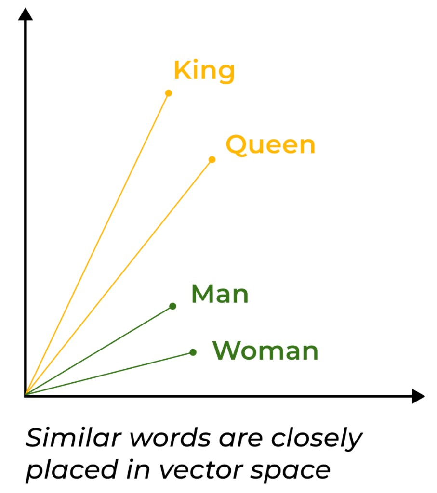

На рисунку показано 2D-проекцію векторного простору. Зверніть увагу:

- «King» і «Queen» (жовті) — поруч: обидва пов'язані з монархією
- «Man» і «Woman» (зелені) — поруч: обидва описують людей
- Але групи «королів» і «людей» розрізняються — між ними є відстань

### Математичні аналогії

Одна з найвідоміших властивостей ембедингів — вектори **зберігають аналогії**:

**Формула:** `v(King) - v(Man) + v(Woman) ≈ v(Queen)`

**Розшифровка:**


| Символ             | Що означає                                                               |
| ------------------ | ------------------------------------------------------------------------ |
| v(King)           | Вектор слова «King» у просторі ембедингів                                |
| v(King) − v(Man)  | Різниця векторів — кодує концепцію «роялтетності» без прив'язки до статі |
| + v(Woman)        | Додаємо концепцію «жіноча стать»                                         |
| ≈ v(Queen)        | Отримуємо вектор, найближчий до «Queen»                                  |


Це означає: **різниця між векторами несе змістовну інформацію**. Ембединги вловлюють семантичні відносини типу «столиця країни», «ступені порівняння», «чоловічий/жіночий рід».

---

## ЧАСТИНА 2. WORD2VEC

### Що таке Word2Vec

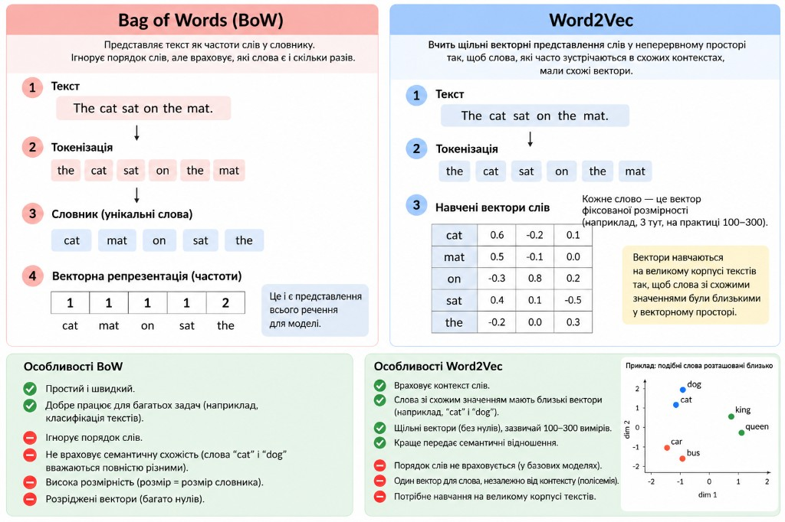

**Word2Vec** (Google, 2013) — ітераційний алгоритм для навчання векторних подань слів. Оригінальна стаття: [Efficient Estimation of Word Representations in Vector Space](Efficient%20Estimation%20of%20Word%20Representations%20in%20Vector%20Space.pdf)

Суть алгоритму:

1. Беремо великий текстовий корпус
2. Ковзним вікном (sliding window) проходимо по тексту — крок за кроком
3. На кожному кроці є **центральне слово** і **контекстні слова** (сусіди у вікні)
4. Навчаємо нейронну мережу: вона має навчитися передбачати контекстні слова за центральним (або навпаки)
5. Ваги навченої мережі = **векторні подання слів**

### Ковзне вікно


**Розмір вікна** (`window=2`) означає: беремо 2 слова ліворуч і 2 праворуч від центрального. Вікно ковзає по всьому тексту покроково — на кожній позиції утворюється одна навчальна пара (центральне слово, контекстне слово).

**Інтуїція:** якщо «cat» часто зустрічається поряд з «grey», «cute», «pet» — то вектор «cat» навчається враховувати ці зв'язки.

### Дві архітектури: CBOW і Skip-gram

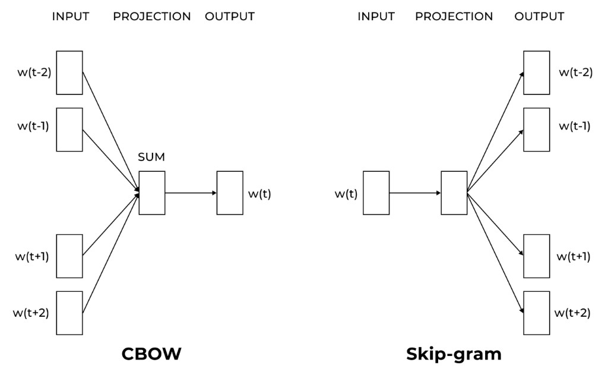

**Коротко:**

> **CBOW:** `контекст → слово`
> **Skip-gram:** `слово → контекст`

**Розгорнутий приклад:**

*CBOW:*

```
Я люблю ___ молоко.
```

Модель бачить слова `Я`, `люблю`, `молоко` → намагається передбачити пропущене: **пити**.

*Skip-gram:*

```
Є слово: пити
```

Модель намагається передбачити слова навколо: `люблю`, `молоко` тощо.

> **Чому «Bag» у CBOW?** Слово *bag* (мішок) означає, що контекст розглядається як **набір слів без урахування порядку** — як якщо скласти всі сусідні слова у мішок і перемішати. Саме тому CBOW не дуже чутливий до порядку слів у контексті.

**Порівняльна таблиця:**


|                   | CBOW                                             | Skip-gram                                                |
| ----------------- | ------------------------------------------------ | -------------------------------------------------------- |
| **Завдання**      | Передбачаємо центральне слово w(t) за контекстом | Передбачаємо контекст w(t±1), w(t±2) за центральним w(t) |
| **Вхід**          | w(t-2), w(t-1), w(t+1), w(t+2)                   | w(t)                                                     |
| **Проміжний шар** | SUM — усереднення векторів контексту             | Вектор центрального слова                                |
| **Вихід**         | Одне слово w(t)                                  | Чотири слова: w(t-2), w(t-1), w(t+1), w(t+2)             |
| **Швидкість**     | Швидший                                          | Повільніший                                              |
| **Якість**        | Краще для частих слів, великих корпусів          | Краще для рідких слів і малих корпусів                   |


**Простими словами:**

- **CBOW**: «Навколо мене стоять «cute», «grey», «playing», «in» — яке я слово?» → «cat»
- **Skip-gram**: «Я — «cat». Які слова можуть бути поруч?» → «cute», «grey», «playing», «in»

### Математика: цільова функція Skip-gram

Word2Vec мінімізує **негативну логарифмічну правдоподібність**. Шукаємо вектори, при яких контекстні слова мають **максимальну ймовірність**.

**Ймовірність контекстного слова** w_(t+j) при заданому центральному слові w_t (через softmax):

$$P(w_{t+j} \mid w_t) = \frac{\exp(u_{w_{t+j}}^\top v_{w_t})}{\sum_{w \in V} \exp(u_w^\top v_{w_t})}$$

**Розшифровка кожного символу:**


| Символ    | Що означає                                                      |
| --------- | --------------------------------------------------------------- |
| wₜ        | Центральне слово в позиції t у тексті                           |
| w(t+j)    | Контекстне слово (зміщення j від центру, j ≠ 0)                 |
| v(wₜ)     | Вектор центрального слова з матриці **вхідних** ваг (розмір d)  |
| u(w(t+j)) | Вектор контекстного слова з матриці **вихідних** ваг (розмір d) |
| uᵀ · v    | Скалярний добуток (dot product) двох векторів — міра схожості   |
| exp(·)    | Експонента e^x — робить усі числа додатними                     |
| V         | Весь словник (десятки тисяч слів)                               |
| Знаменник | Нормувальна константа — гарантує, що сума всіх ймовірностей = 1 |


**Загальна функція втрат** (те, що мінімізуємо):

**Формула:** `J = -(1/T) · Σ(t=1..T) Σ(0<|j|≤c) log P(w(t+j) | w(t))`

**Розшифровка:**


| Символ            | Що означає                                                        |
| ----------------- | ----------------------------------------------------------------- |
| T                 | Загальна кількість слів у корпусі                                 |
| c                 | Розмір контекстного вікна (window size)                           |
| -c ≤ j ≤ c, j ≠ 0 | Усі зміщення вікна (від -c до c, крім нуля)                       |
| log P(...)        | Логарифмічна ймовірність — мінімізуємо її негатив                 |
| -(1)/(T)          | Ділимо на T: нормуємо, щоб довжина корпусу не впливала на масштаб |


**Чому знаменник — проблема?** При кожному кроці треба підсумовувати exp(·) по **всьому словнику** V (100 000 – 1 000 000 слів). Це V операцій на кожний кроку тренування — дуже повільно! Рішення: Hierarchical Softmax і Negative Sampling (Частина 6).

### Embeddings до і після навчання

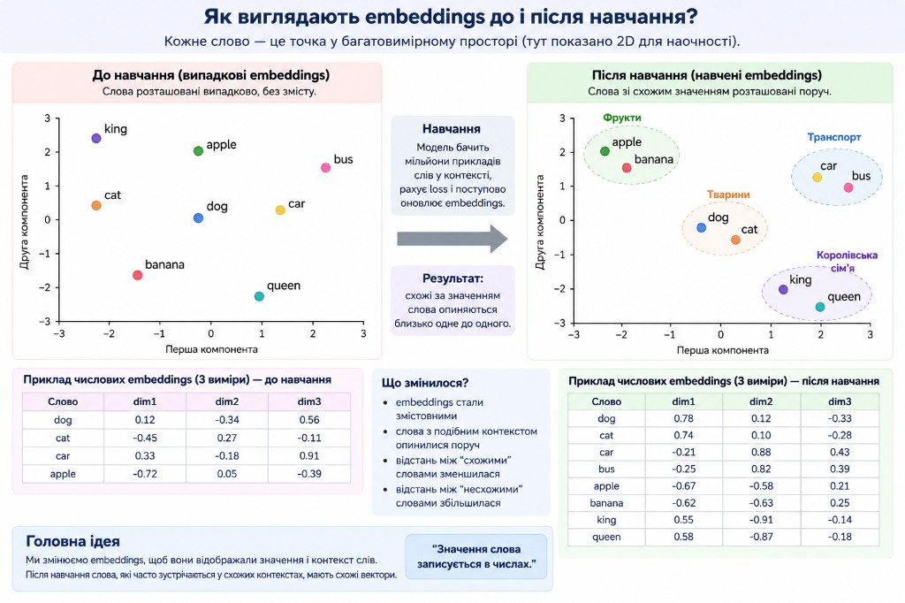

### Приховані ваги = вектори слів

Word2Vec — **одношарова нейронна мережа**. Після навчання ми **викидаємо вихідний шар** і берємо лише матрицю прихованих ваг (вхідну) — вона і є нашими векторами слів.

> Тобто Word2Vec — це **не** інструмент для передбачення слів. Передбачення — лише привід для навчання хороших векторів.

---

## ЧАСТИНА 3. GLOVE

### Що таке GloVe

**GloVe** (Global Vectors for Word Representation) — розроблений у Стенфорді у 2014 р. авторами Jeffrey Pennington, Richard Socher, Christopher Manning. [Офіційний сайт](https://nlp.stanford.edu/projects/glove/) | [GitHub](https://github.com/stanfordnlp/GloVe)

> ⚠️ Нерідко в джерелах авторство GloVe приписується іншим людям. Правильно: **Pennington, Socher, Manning** (Stanford NLP Group).

**Ключова відмінність від Word2Vec:** GloVe використовує **глобальну статистику** всього корпусу (матрицю спільних появ), а не лише локальне ковзне вікно.

### Крок 1: Матриця спільних появ (Co-occurrence Matrix)

**Co-occurrence (спільна поява)** — скільки разів два слова зустрілися поруч у межах контекстного вікна.

**Будова матриці:**

- Розмір: N |×| N, де N — кількість унікальних слів
- Рядок i, стовпець j → скільки разів слова i і j з'являлись в одному вікні

**Як будується крок за кроком:**

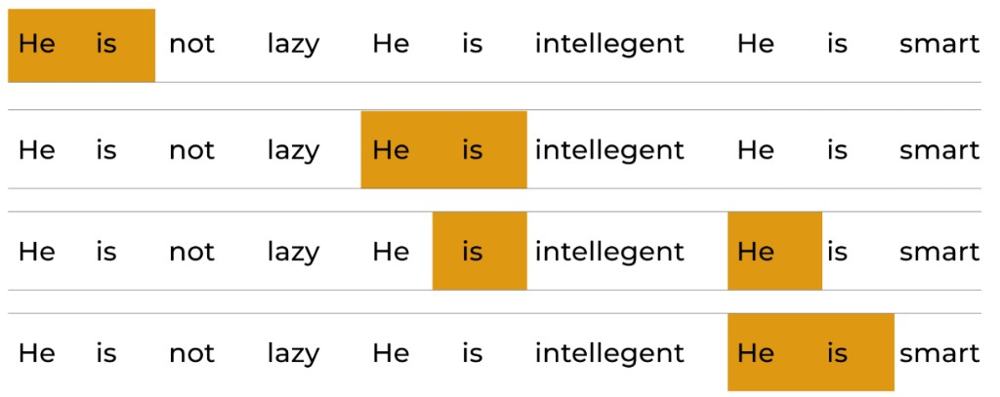

Кожен рядок рисунка — новий стан ковзного вікна. Коли вікно охоплює пару («He», «is») — збільшуємо елемент матриці X_(He, is) на 1.

**Готова матриця** для корпусу `He is not lazy. He is intelligent. He is smart.` (вікно розміру 2):

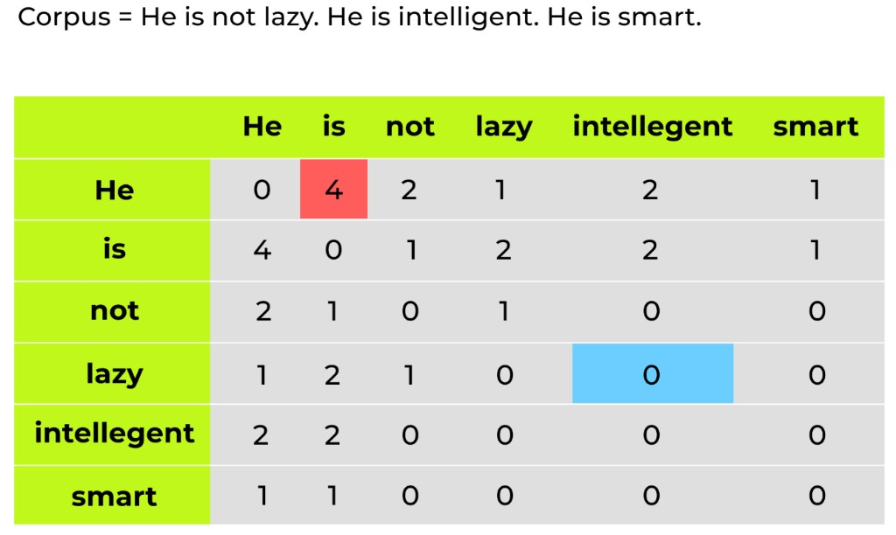

**Як читати:**

- Клітинка (He, is) = **4** (червона) — «He» і «is» зустрілися 4 рази
- Клітинка (lazy, intelligent) = **0** (синя) — жодного разу поруч не зустрічались

Ця матриця — стиснена семантична статистика всього корпусу.

### Крок 2: Відношення ймовірностей

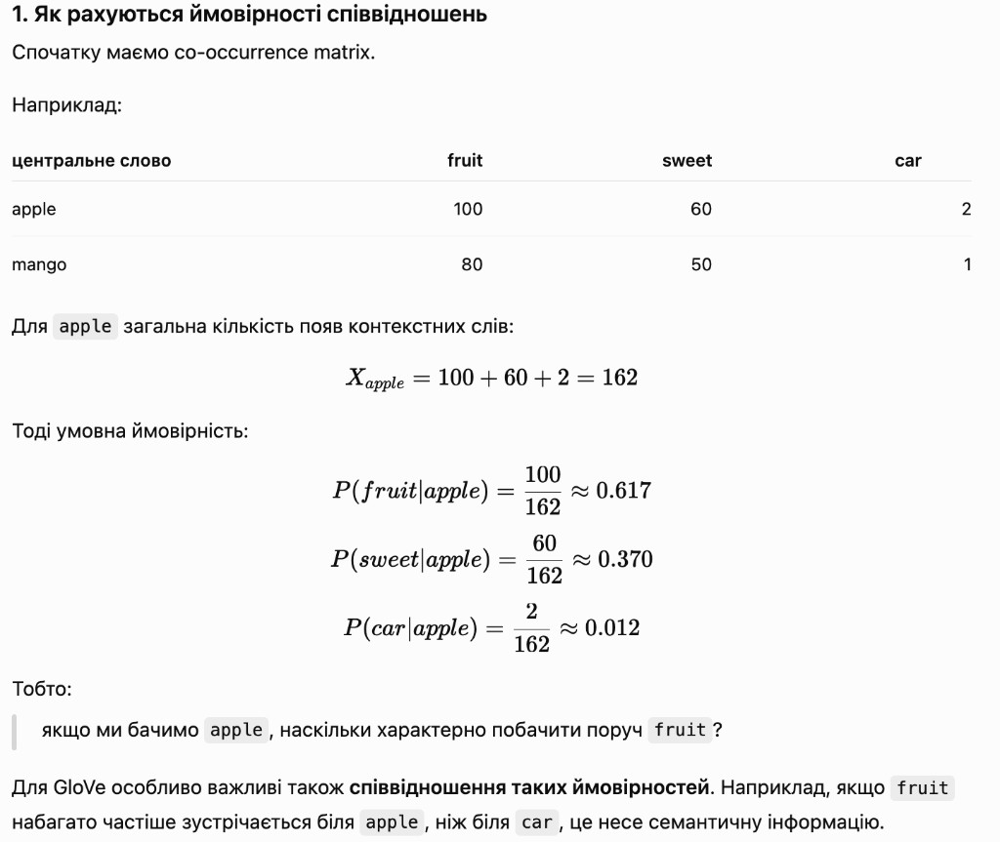

GloVe не просто рахує частоти, а аналізує **відношення ймовірностей** спільних появ:

**Формула:** `P(k | i) / P(k | j)`

де `P(k | i)` — ймовірність зустріти слово `k` у контексті слова `i`.

### Структурований приклад (apple / mango / car)

**1) Маємо co-occurrence-частоти** (за скріншотом):


| Центральне слово | fruit | sweet | car |
| ---------------- | ----- | ----- | --- |
| apple            | 100   | 60    | 2   |
| mango            | 80    | 50    | 1   |


**2) Нормалізуємо до ймовірностей для** `apple`

Сума контекстів для `apple`: `100 + 60 + 2 = 162`

- `P(fruit | apple) = 100/162 ≈ 0.617`
- `P(sweet | apple) = 60/162 ≈ 0.370`
- `P(car | apple) = 2/162 ≈ 0.012`

**3) Нормалізуємо до ймовірностей для** `mango`

Сума контекстів для `mango`: `80 + 50 + 1 = 131`

- `P(fruit | mango) = 80/131 ≈ 0.611`
- `P(sweet | mango) = 50/131 ≈ 0.382`
- `P(car | mango) = 1/131 ≈ 0.008`

**4) Дивимось саме на відношення ймовірностей**

Якщо взяти `k = fruit`, `i = apple`, `j = car`, то:

`P(fruit | apple) / P(fruit | car) >> 1`

Інтуїтивно: `fruit` набагато характерніше для `apple`, ніж для `car`.

**Головна ідея:** відношення ймовірностей «прибирає шум» від нейтральних слів і підсилює дискримінаційні зв'язки. Саме таку структуру GloVe і кодує у векторах.

### Функція втрат GloVe

$$J = \sum_{i,j=1}^{V} f(X_{ij}) \left( w_i^\top \tilde{w}_j + b_i + \tilde{b}_j - \log X_{ij} \right)^2$$

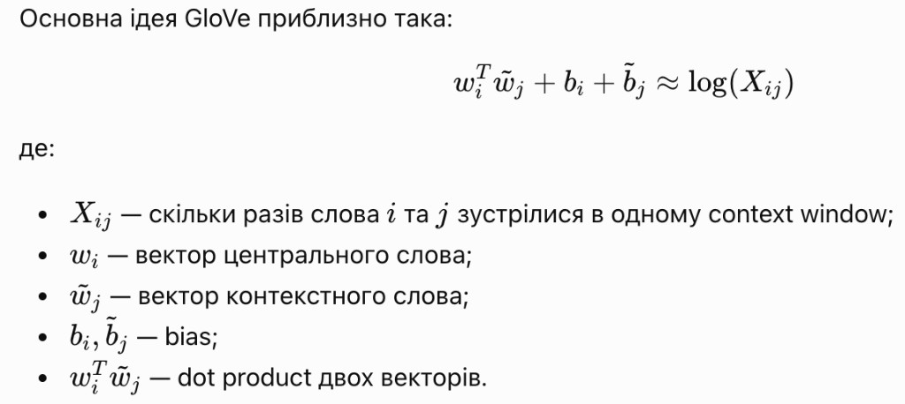

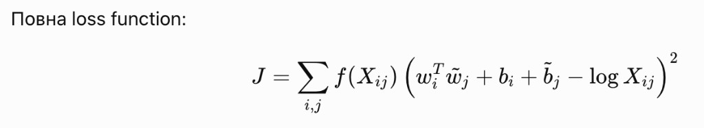

**Розшифровка кожного символу:**


| Символ        | Що означає                                                            |
| ------------- | --------------------------------------------------------------------- |
| Xᵢⱼ           | Кількість спільних появ слів i і j (з матриці co-occurrence)          |
| log Xᵢⱼ       | **Ціль**: логарифм частоти спільної появи (те, що хочемо передбачити) |
| wᵢ            | Вектор слова i — основна матриця ваг                                  |
| w̃ⱼ            | Вектор контексту слова j — окрема матриця ваг                         |
| wᵢᵀ · w̃ⱼ      | Скалярний добуток — **передбачення** log Xᵢⱼ                          |
| bᵢ, b̃ⱼ        | Зміщення (bias) для слів i і j                                        |
| (...)²        | Квадрат помилки — штраф за відхилення передбачення від цілі           |
| f(Xᵢⱼ)        | Вагова функція — знижує вплив дуже рідких і дуже частих пар           |
| Σᵢⱼ (1..V)    | Підсумовуємо по всіх парах слів у словнику                            |


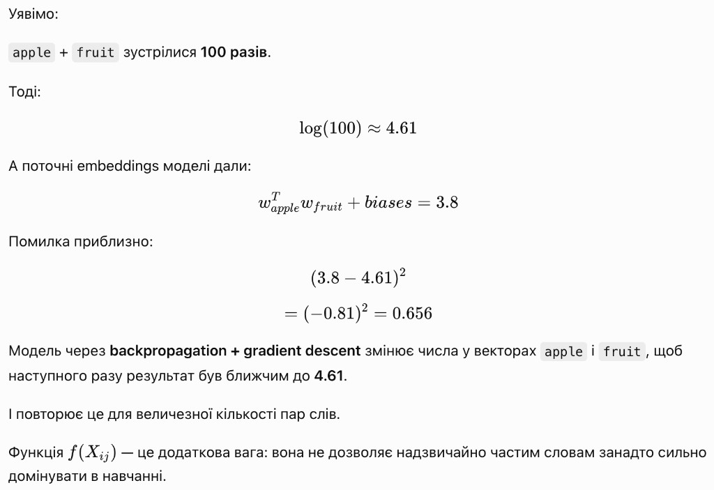

**Вагова функція** (щоб рідкісні і дуже часті пари не «шуміли»):

**Формула:** `f(x) = (x / xmax)^α, якщо x < xmax; інакше 1`

де x_(max) = 100, α = 3/4 (рекомендовані авторами значення).

**Після навчання:** фінальний вектор слова i = w_i + w~_i (сума двох матриць ваг — авторська рекомендація).

### Як виглядають embeddings після навчання

Припустімо, ми вибрали `embedding dimension = 3`.

Після навчання можемо отримати щось таке:


| слово | dimension 1 | dimension 2 | dimension 3 |
| ----- | ----------- | ----------- | ----------- |
| apple | 0.72        | -0.31       | 0.58        |
| mango | 0.69        | -0.28       | 0.62        |
| car   | -0.43       | 0.81        | 0.15        |


Тобто:

- `apple → [0.72, -0.31, 0.58]`
- `mango → [0.69, -0.28, 0.62]`
- `car → [-0.43, 0.81, 0.15]`

Бачиш: `apple` і `mango` мають схожі числа — вони опинилися близько у векторному просторі.

У реальному GloVe це зазвичай не 3 числа, а, наприклад: **50, 100, 200 або 300 dimensions**.

**Де вони зберігаються?**

Фактично — у матриці ваг:

```text
W = [
  [ 0.72, -0.31,  0.58],
  [ 0.69, -0.28,  0.62],
  [-0.43,  0.81,  0.15]
]
```

Кожен рядок = одне слово.

А якщо завантажиш готовий GloVe, файл може буквально виглядати приблизно так:

```text
apple  0.72 -0.31 0.58 ...
mango  0.69 -0.28 0.62 ...
car   -0.43  0.81 0.15 ...
```

Отже весь процес:

`текст → context windows → co-occurrence matrix → X_ij → loss → gradient descent → навчені ваги → embeddings`

І найважливіше: `embedding apple` — це просто рядок чисел у навченій матриці ваг.

**Embedding dimension** — це кількість чисел у векторі, яким ми представляємо одне слово.

Наприклад:

`apple → [0.72, -0.31, 0.58]`

Тут `embedding dimension = 3`, бо у векторі 3 числа.

У реальній моделі може бути:

- 50 dimensions
- 100 dimensions
- 200 dimensions
- 300 dimensions

Наприклад, при `dimension = 300`:

`apple → [0.12, -0.44, 0.81, ..., 0.07]`

і всього там 300 чисел.

Ці числа — не щось на кшталт:

- `dimension 1 = фруктовість`
- `dimension 2 = солодкість`

Ні. Окремі координати зазвичай не мають зрозумілого людського значення. Сенс закодований у всьому векторі разом.

Можна думати так:

`embedding dimension = розмір простору, в якому живуть слова`

- Якщо `dimension = 3`, слово — це точка в 3D-просторі.
- Якщо `dimension = 300`, слово — це точка в 300-вимірному просторі.

### Ключові переваги GloVe


| Перевага                 | Пояснення                                                           |
| ------------------------ | ------------------------------------------------------------------- |
| **Глобальна статистика** | Враховує відносини між усіма парами слів, а не лише локальне вікно  |
| **Ефективність**         | Матриця co-occurrence будується один раз, потім навчання ітераційне |
| **Якісні аналогії**      | Добре виражає відносини типу «man:woman = king:queen»               |


---

## ЧАСТИНА 4. FASTTEXT

### Що таке FastText

**FastText** (Facebook AI Research, 2016) — розширення Word2Vec. [Офіційний сайт](https://fasttext.cc/)

**Ключова відмінність:** FastText представляє слово не як цілу одиницю, а як **набір char n-grams** (підслів). Це вирішує головну проблему Word2Vec і GloVe — **OOV-слова** (нові слова, яких не було в корпусі).

### Char n-grams на прикладі

**Char n-gram** — послідовність n символів всередині слова. Межі позначаються `<` (початок) і `>` (кінець).

**Приклад: слово** `matter`**, n = 3 (триграми):**


| Підслово   | Тип           | Позиція                              |
| ---------- | ------------- | ------------------------------------ |
| `<ma`      | початок слова | символи 1–2 + відкриваючий маркер    |
| `mat`      | середина      | символи 1–3                          |
| `att`      | середина      | символи 2–4                          |
| `tte`      | середина      | символи 3–5                          |
| `ter`      | середина      | символи 4–6                          |
| `er>`      | кінець слова  | символи 5–6 + закриваючий маркер     |
| `<matter>` | ціле слово    | спеціальне підслово для всього слова |


> Символи `<` і `>` важливі: вони дозволяють відрізнити n-gram `mat` (частину слова `matter`) від слова `mat` (яке записується як `<mat>`).

### Формула векторного подання

$$v_w = \sum_{g \in G_w} z_g$$

**Розшифровка:**


| Символ      | Що означає                                                            |
| ----------- | --------------------------------------------------------------------- |
| v_w         | Фінальний вектор слова w                                              |
| G_w         | Множина всіх char n-grams слова w (включно з `<word>`)                |
| z_g         | Вектор підслова (char n-gram) g — навчається так само як вектор слова |
| Σ(g∈Gw)     | Вектор слова = **сума** векторів усіх його підслів                    |


**Модель навчається так само** як Word2Vec (CBOW або Skip-gram), але замість векторів цілих слів використовує суми векторів їхніх n-gram.

### Як виглядає сума векторів char n-grams

Уявімо дуже маленькі embeddings по 3 числа.

FastText навчила такі вектори:

- `<ma` → `[0.2, 0.1, 0.4]`
- `mat` → `[0.3, 0.2, 0.1]`
- `att` → `[0.1, 0.4, 0.2]`
- `tte` → `[0.2, 0.3, 0.1]`
- `ter` → `[0.4, 0.1, 0.3]`
- `er>` → `[0.1, 0.2, 0.4]`

Тоді модель складає їх покоординатно:

```text
matter =
[0.2, 0.1, 0.4]
+ [0.3, 0.2, 0.1]
+ [0.1, 0.4, 0.2]
+ [0.2, 0.3, 0.1]
+ [0.4, 0.1, 0.3]
+ [0.1, 0.2, 0.4]
```

Отримаємо:

`matter → [1.3, 1.3, 1.5]`

Це дуже спрощений приклад, але принцип саме такий.

У реальному FastText використовуються n-grams різної довжини (зазвичай 3–6 символів), а не лише триграми.

Ще важливий нюанс: для слова, яке було в словнику під час навчання, FastText зазвичай бере:

`embedding(matter) = word vector + sum(character n-gram vectors)`

А якщо нового слова не було в training corpus, FastText усе одно може приблизно побудувати його embedding із відомих character n-grams.

Саме тому FastText добре працює, наприклад, із формами:

- `work`
- `worker`
- `working`
- `worked`

бо модель бачить повторювані частини слова.

### Переваги FastText


| Перевага          | Пояснення                                     | Приклад                                  |
| ----------------- | --------------------------------------------- | ---------------------------------------- |
| **OOV-стійкість** | Нове слово = є n-grams = є вектор             | `COVID` → n-grams є, вектор обчислюється |
| **Морфологія**    | Схожі форми → спільні n-grams → схожі вектори | `run`, `running`, `runner`               |
| **Орфографія**    | Помилки → часткові n-grams збігаються         | `colour` ≈ `color`                       |
| **Швидкість**     | Ефективна реалізація на C++; CPU-friendly     | Навчання на Wikipedia за годину          |


---

## ЧАСТИНА 5. КОСИНУСНА ПОДІБНІСТЬ І МЕТРИКИ ВІДСТАНІ

### Огляд метрик

Після того як слова перетворено на вектори, нам потрібна **міра схожості**. Різні завдання вимагають різних метрик:

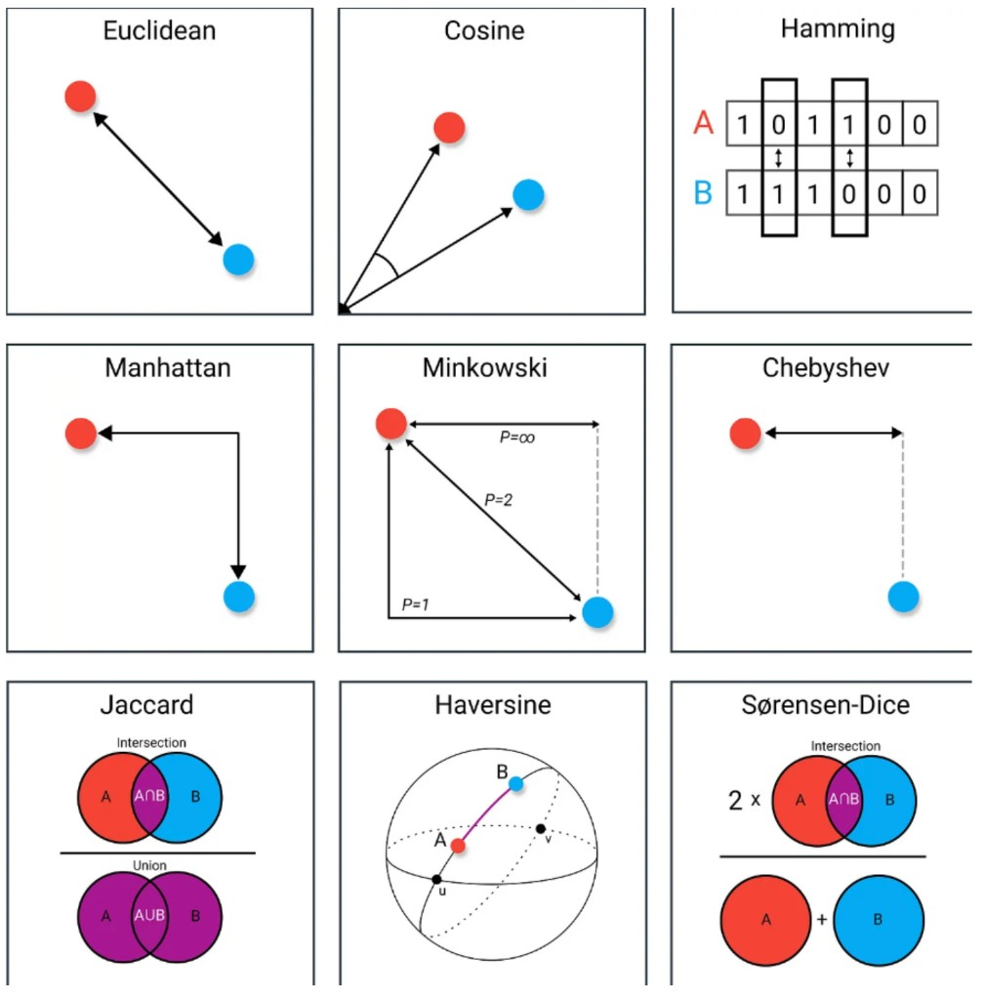

### Косинусна подібність — головна метрика для NLP

**Косинусна подібність** вимірює **кут між векторами**, а не відстань між їхніми кінцями. Це ключова відмінність від евклідової відстані.

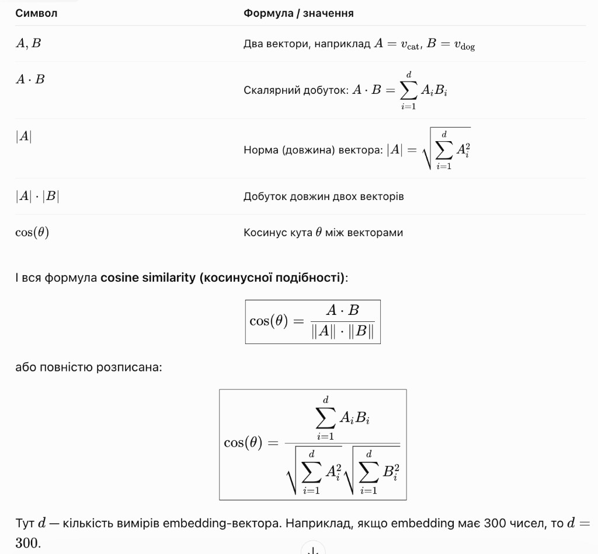

**Розшифровка кожного символу:**


| Символ            | Що означає                                                                                                                 |
| ----------------- | -------------------------------------------------------------------------------------------------------------------------- |
| A, B              | Два вектори слів, наприклад v(cat) і v(dog)                                                                                |
| A · B             | Скалярний добуток: Σᵢ Aᵢ · Bᵢ                                                                                              |
| norm(A)           | Норма (довжина) вектора A: √(Σᵢ Aᵢ²)                                                                                       |
| norm(A) · norm(B) | Добуток норм — дільник у формулі; саме ділення скалярного добутку на добуток норм приводить результат до діапазону [-1, 1] |
| cos(θ)            | Косинус кута θ між векторами                                                                                               |


**Інтерпретація значень:**


| Значення    | Кут θ | Сенс                                                   |
| ----------- | ----- | ------------------------------------------------------ |
| cos(θ) = 1  | 0°    | Вектори паралельні, однаковий напрям — слова ідентичні |
| cos(θ) = 0  | 90°   | Вектори перпендикулярні — слова не пов'язані           |
| cos(θ) = -1 | 180°  | Вектори протилежні — слова-антоніми                    |


### Ручний розрахунок на прикладі

Нехай (спрощений 3D приклад):

- `cat` = A = [1, 2, 3]
- `dog` = B = [2, 3, 4]

**Крок 1 — скалярний добуток:**
**Обчислення:** `A · B = 1·2 + 2·3 + 3·4 = 2 + 6 + 12 = 20`

**Крок 2 — норми:**
**Обчислення:** `A = sqrt(1² + 2² + 3²) = sqrt(1 + 4 + 9) = sqrt(14) ≈ 3.742`  
**Обчислення:** `B = sqrt(2² + 3² + 4²) = sqrt(4 + 9 + 16) = sqrt(29) ≈ 5.385`

**Крок 3 — косинусна подібність:**
**Обчислення:** `cos(θ) = 20 / (3.742 × 5.385) ≈ 20 / 20.149 ≈ 0.993`

Значення **0.993** — дуже висока подібність (вектори майже паралельні), що відповідає семантичній близькості «cat» і «dog».

### Чому косинусна, а не евклідова?


| Евклідова відстань A - B                            | Косинусна подібність                         |
| --------------------------------------------------- | -------------------------------------------- |
| Чутлива до **масштабу** вектора                     | **Нечутлива** до масштабу — вимірює лише кут |
| «cat» і «cats» можуть бути далеко через різну норму | «cat» і «cats» — майже паралельні вектори    |
| Часте слово → більше контекстів → довший вектор     | Нормалізація усуває цей ефект                |
| Погано для NLP                                      | Ідеально для NLP                             |


### Короткий огляд інших метрик (коли що застосовувати)

> ⚠️ **Важливий нюанс:** косинусна — це **подібність** (similarity), решта метрик у таблиці — переважно **відстані** (distance). Логіка інтерпретації протилежна:
>
> - **Косинусна подібність:** чим **більша** → тим об'єкти **ближчі** (1 = ідентичні, 0 = не пов'язані)
> - **Відстані (евклідова, манхетенська тощо):** чим **менша** → тим об'єкти **ближчі** (0 = однакові)


| Метрика          | Тип        | Формула                            | Коли використовують                            |
| ---------------- | ---------- | ---------------------------------- | ---------------------------------------------- |
| **Косинусна**    | подібність | (A · B) / (norm(A) · norm(B))      | NLP, word embeddings — **головна для тексту**  |
| **Евклідова**    | відстань   | √(Σᵢ (Aᵢ − Bᵢ)²)                  | Геометрія, k-NN на зображеннях                 |
| **Манхетенська** | відстань   | Σᵢ \|Aᵢ − Bᵢ\|                    | Коли важлива сума абсолютних відхилень         |
| **Мінковського** | відстань   | (Σᵢ \|Aᵢ − Bᵢ\|ᵖ)^(1/p)          | Загальний випадок (p=1: Манхетен, p=2: Евклід) |
| **Хемінга**      | відстань   | кількість позицій з різними бітами | Бінарні рядки, хеші                            |
| **Жаккара**      | подібність | size(A ∩ B) / size(A ∪ B)          | Множини, рекомендаційні системи                |
| **Хаверсинова**  | відстань   | —                                  | Відстань між точками на сфері (геолокація)     |


**Формули метрик з поясненнями:**

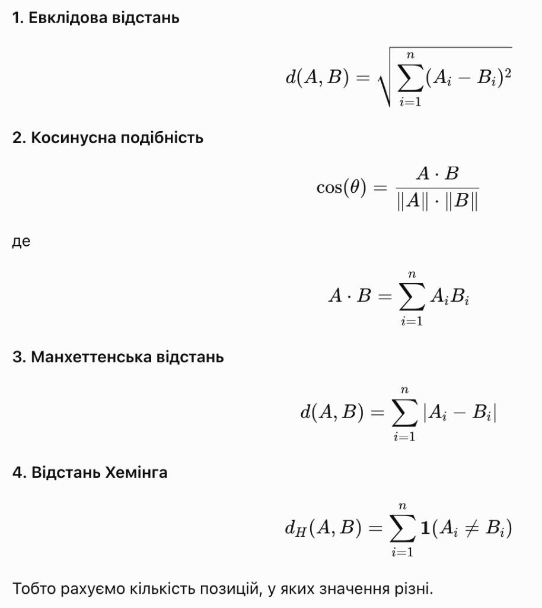

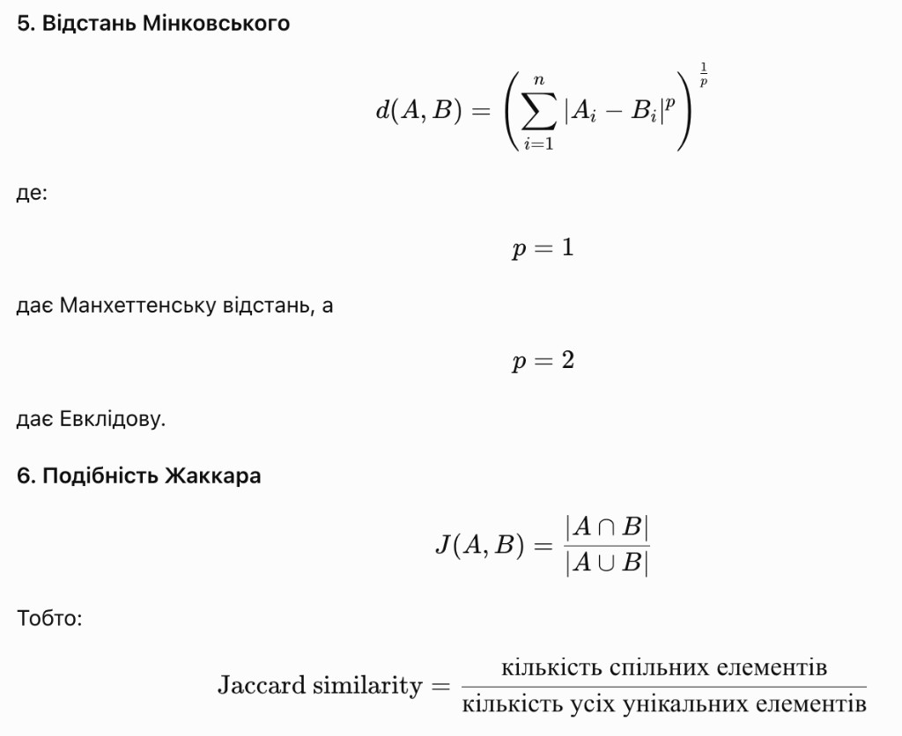

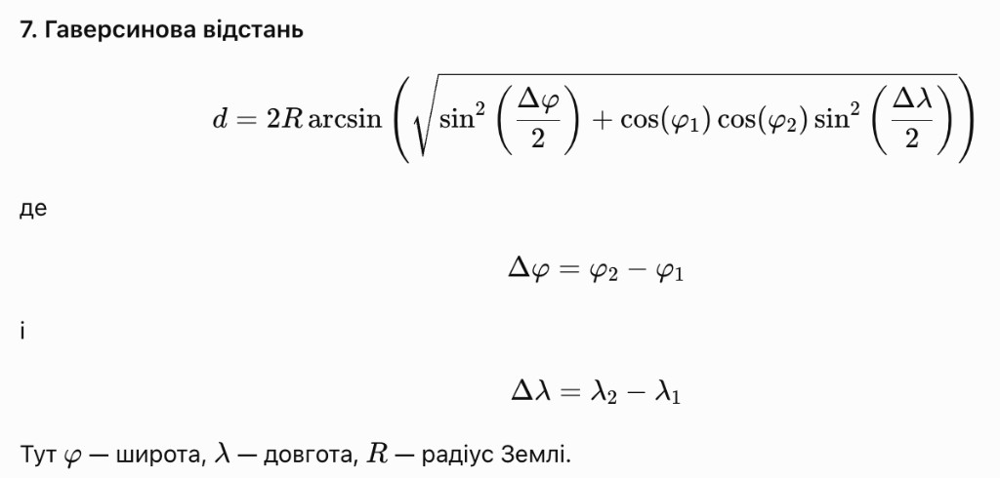

---

## ЧАСТИНА 6. ПРИСКОРЕННЯ ТРЕНУВАННЯ

### Проблема стандартного softmax

Нагадаємо знаменник формули ймовірності:

**Формула:** `Σ(w∈V) exp(u_w^T · v_w(t))`

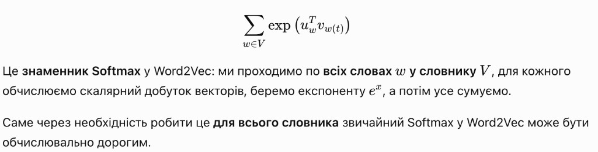

При V = 1 000 000 слів це **1 мільйон операцій** на кожний крок градієнтного спуску. Якщо корпус — мільярди слів — тренування зайняло б роки.

Два рішення: **Hierarchical Softmax** і **Negative Sampling**.

---

### 6.1 Hierarchical Softmax

**Ідея:** організуємо слова словника у **бінарне дерево** і замість розрахунку ймовірності кожного слова — рухаємось по дереву зверху вниз, приймаючи двійкові рішення в кожному вузлі.

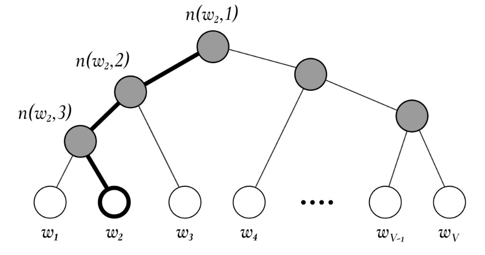

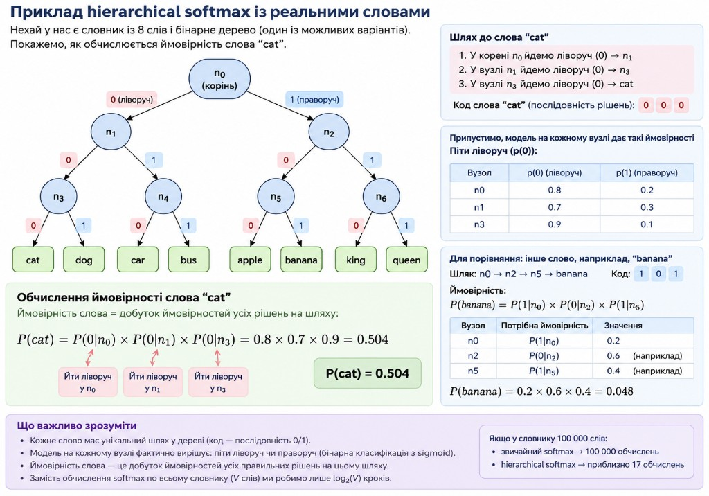

**Як читати дерево:**

- Корінь n(w_2, 1) — верхній вузол (рівень 1 для шляху до w_2)
- Кожен **внутрішній вузол** (сірий) — бінарне рішення: ліворуч чи праворуч
- Листки w_1, w_2, ..., w_V (білі) — окремі слова словника
- **Жирна лінія** — шлях від кореня до w_2 через n(w_2,1) |→| n(w_2,2) |→| n(w_2,3) |→| w_2

**Ймовірність слова** = добуток ймовірностей бінарних рішень на шляху:

**Формула:** `P(w) = Π(j=1..L(w)-1) σ(± u_n(w,j)^T · v_c)`

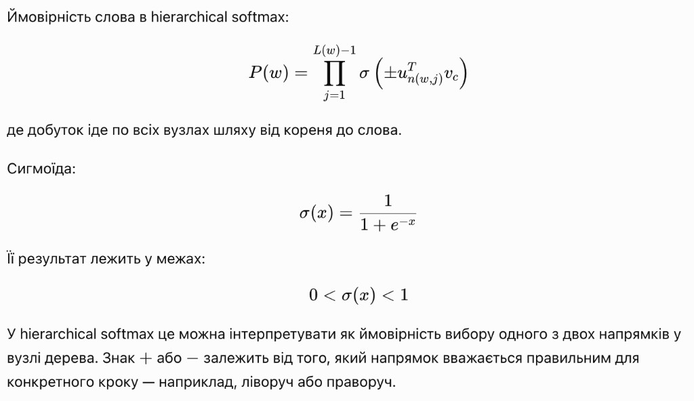

де знак «+» — якщо на кроці j йдемо **ліворуч**, «-» — **праворуч**.

**Розшифровка:**


| Символ     | Що означає                                                         |
| ---------- | ------------------------------------------------------------------ |
| L(w)       | Довжина шляху від кореня до слова w в дереві                       |
| n(w, j)    | j-й вузол на шляху від кореня до w                                 |
| σ(·)       | Сигмоїда: σ(x) = 1/(1+e⁻ˣ) — повертає ймовірність «ліворуч»       |
| ±          | +1 якщо наступний вузол — лівий нащадок, −1 якщо правий            |
| u(n(w,j))  | Вектор параметрів внутрішнього вузла n(w,j)                        |
| v_c        | Вектор центрального слова                                          |
| Π          | Добуток ймовірностей по всіх вузлах шляху                          |


**Складність:**

**Складність:** `O(V) → O(log2(V))`

**Числовий приклад:**


|                  | Стандартний softmax | Hierarchical softmax  |
| ---------------- | ------------------- | --------------------- |
| Словник V        | 1 000 000 слів      | 1 000 000 слів        |
| Операцій за крок | **1 000 000**       | log_2(1 000 000) ≈ 20 |
| Прискорення      | —                   | **у 50 000 разів**    |


**Дерево Хаффмана:** у кращих реалізаціях для дерева використовують **дерево Хаффмана**: часті слова розміщуються ближче до кореня (коротший шлях → менше кроків). Це дає додаткове прискорення, бо часті слова зустрічаються у навчанні найчастіше.

---

### 6.2 Negative Sampling

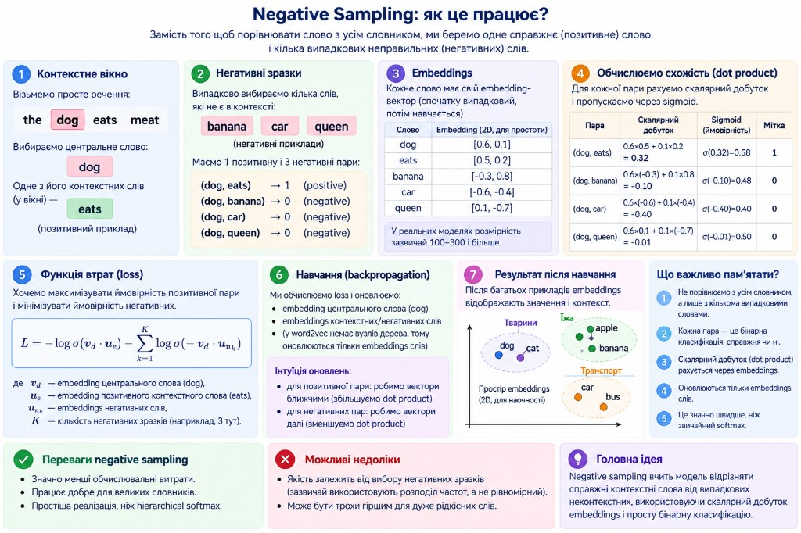

**Ідея:** замість навчання розрізняти правильне слово серед **усього словника** — навчаємо відрізняти його від **K випадково вибраних «негативних» прикладів**.

**Цільова функція (максимізуємо):**

$$
J_{\text{NS}} = \log \sigma\!\left(u_o^T v_c\right) + \sum_{k=1}^{K} \log \sigma\!\left(-u_k^T v_c\right)
$$

**Розшифровка кожного символу:**


| Символ               | Що означає                                                         |
| -------------------- | ------------------------------------------------------------------ |
| uₒ                   | Вектор **правильного** контекстного слова o                        |
| v꜀                   | Вектор **центрального** слова c                                    |
| uₖ                   | Вектор k-го **негативного зразка** (хибне контекстне слово)        |
| σ(x) = 1 / (1 + e⁻ˣ) | Сигмоїда — стискає значення до (0, 1)                              |
| log σ(uₒᵀ v꜀)        | **Максимізуємо**: правильна пара має бути схожою (uₒᵀ v꜀ → велике) |
| log σ(−uₖᵀ v꜀)       | **Максимізуємо**: хибна пара має бути несхожою (uₖᵀ v꜀ → мале)     |
| K                    | Кількість негативних зразків (зазвичай 5–20)                       |
| Pₙ(w)                | Розподіл для вибору негативних зразків                             |
| Σ(k=1..K)            | Сумуємо по всіх K негативних зразках (замість усього словника)     |


**Розподіл вибору негативних зразків:**

$$
P_n(w) \propto U(w)^{3/4}
$$

де U(w) — частота слова w у корпусі (уніграмний розподіл).


| Символ | Що означає                                 |
| ------ | ------------------------------------------ |
| U(w)   | Кількість появ слова w у корпусі (частота) |
| ³⁄₄    | Степінь 3/4 «згладжує» розподіл            |
| ∝      | Пропорційно (нормуємо, щоб сума = 1)       |


**Чому степінь 3/4?** Без нього «the», «a», «is» (дуже часті) домінували б у негативних зразках, і модель навчалась би лише відкидати їх. Степінь 3/4 зменшує перевагу частих слів і дає шанс рідкісним.

**Складність:** замість V — лише K+1 операцій за крок. При K=5, V=1 000 000 — прискорення у **166 667 разів**.

---

## ПРАКТИЧНА ЧАСТИНА — ПОВНИЙ PIPELINE (ЧАСТИНИ 7–11)

> Тут — весь код від сирого тексту до натренованих моделей і порівняння AUC. Виконуй практичні кроки по порядку зверху вниз. Кроки пронумеровані глобально (1–20) через усі частини. Один «Практичний крок» може містити одну або кілька Kaggle-клітинок.

### Карта pipeline


| Блок                         | Що робимо                                       | Навіщо                                                    | Кроки |
| ---------------------------- | ----------------------------------------------- | --------------------------------------------------------- | ----- |
| **1 — Підготовка даних**     | NLTK, бібліотеки, датасет, нормалізація, корпус | Без цього жоден наступний крок не запрацює                | 1–4   |
| **2 — Власна модель**        | Тренуємо Word2Vec на Amazon Reviews             | Отримуємо вектори слів, специфічних для домену відгуків   | 5     |
| **3 — Претреновані вектори** | WordEmbedding клас + завантаження GloVe         | GloVe навчений на 6B токенів — порівняємо з нашою моделлю | 6–7   |
| **4 — Дослідження**          | Вектори слів, синоніми, схожість king↔queen     | Перевіряємо, що моделі «знають» семантику                 | 8–10  |
| **5 — Візуалізація**         | Кластери → t-SNE → scatter plot                 | Бачимо семантичний простір очима                          | 11–13 |
| **6 — Класифікація**         | tok2vec + логістична регресія                   | Ембединги → ознаки → AUC = 0.807                          | 14–16 |
| **7 — Doc2Vec**              | Вектори документів + класифікація               | Враховуємо порядок слів → AUC = 0.821                     | 17–20 |


---

## ЧАСТИНА 7. ТРЕНУВАННЯ WORD2VEC З НУЛЯ

Навчимо Word2Vec на датасеті [Amazon Product Reviews](https://www.kaggle.com/datasets/arhamrumi/amazon-product-reviews).

---

> ### БЛОК 1 — Підготовка даних (Кроки 1–4)
>
> **Що робимо:** завантажуємо NLTK-ресурси, підключаємо бібліотеки, читаємо датасет, нормалізуємо текст, будуємо корпус.
> **Навіщо:** Word2Vec очікує `list[list[str]]` — список речень, кожне з яких є списком токенів. Всі 4 клітинки готують саме цю структуру.

### Підготовка середовища (виконати перед кроками з кодом)

### Для Google Colab

1. Відкрий [Google Colab](https://colab.research.google.com) → **"New notebook"**
2. Клонуємо репозиторій і переходимо у директорію:

```python
# Видаляємо стару копію репозиторію (якщо вже клонували раніше)
!rm -rf deep

# Клонуємо особистий репозиторій з конспектами і матеріалами
!git clone https://github.com/PetraStill/deep.git deep

# Переходимо в директорію репозиторію
%cd deep
```

1. Встановлюємо всі необхідні бібліотеки:

```python
# Встановлюємо gensim — основна бібліотека для word embeddings
!pip install gensim

# Встановлюємо NLTK для токенізації і стоп-слів
!pip install nltk

# Встановлюємо spaCy та мовну модель для англійської
!pip install spacy
!python -m spacy download en_core_web_sm
```

1. Завантажуємо ресурси NLTK (виконати **один раз**):

```python
import nltk
# Завантажуємо стоп-слова
nltk.download('stopwords')
# Завантажуємо токенізатор (gensim 4.x+ потребує punkt_tab)
nltk.download('punkt_tab')
```

1. Створюємо директорії для збереження моделей:

```python
import os
# Створюємо директорії для збереження моделей
os.makedirs('saved_models', exist_ok=True)
os.makedirs('pretrained_models', exist_ok=True)
```

1. Завантажуємо датасет Amazon Product Reviews з [Kaggle](https://www.kaggle.com/datasets/arhamrumi/amazon-product-reviews):

```python
import kagglehub

# Завантажуємо датасет (потрібен Kaggle-акаунт; авторизація автоматична)
path = kagglehub.dataset_download("arhamrumi/amazon-product-reviews")
print("Датасет знаходиться за шляхом:", path)
```

> **Спосіб 2 (ручне завантаження):** відкрий [kaggle.com/datasets/arhamrumi/amazon-product-reviews](https://www.kaggle.com/datasets/arhamrumi/amazon-product-reviews), натисни **Download**, завантаж CSV у Colab через **Files → Upload**.

### Де завантажити претреновані вектори


| Модель                 | Джерело           | Посилання                                                                       | Розмір | Формат |
| ---------------------- | ----------------- | ------------------------------------------------------------------------------- | ------ | ------ |
| Word2Vec (Google News) | Google, 300B слів | [Kaggle](https://www.kaggle.com/datasets/leadbest/googlenewsvectorsnegative300) | 1.5 ГБ | `.bin` |
| GloVe 6B.50d           | Stanford          | [nlp.stanford.edu/projects/glove](https://nlp.stanford.edu/projects/glove/)     | 822 МБ | `.txt` |
| FastText wiki-news     | Facebook AI       | [Kaggle](https://www.kaggle.com/datasets/facebook/fasttext-wikinews)            | 2.2 ГБ | `.vec` |


**Легший спосіб — через** `gensim.downloader` **(без ручного завантаження):**

```python
import gensim.downloader

# Завантажуємо GloVe 50d (~60 МБ) прямо в пам'ять — зручно для Colab
glove_model = gensim.downloader.load('glove-wiki-gigaword-50')

# Переглядаємо найближчі слова до 'cat'
print(glove_model.most_similar('cat', topn=5))
```

Доступні ключі для `gensim.downloader.load(...)`:


| Ключ                                | Опис                            | RAM     |
| ----------------------------------- | ------------------------------- | ------- |
| `'glove-wiki-gigaword-50'`          | GloVe, Wikipedia+Gigaword, 50d  | ~170 МБ |
| `'glove-wiki-gigaword-100'`         | GloVe, Wikipedia+Gigaword, 100d | ~330 МБ |
| `'glove-twitter-25'`                | GloVe, Twitter, 25d             | ~200 МБ |
| `'word2vec-google-news-300'`        | Word2Vec, Google News, 300d     | ~3.5 ГБ |
| `'fasttext-wiki-news-subwords-300'` | FastText, Wikipedia, 300d       | ~1 ГБ   |


### Для локального запуску

```bash
# Створюємо і активуємо окреме Python-середовище
python -m venv we_env
source we_env/bin/activate   # macOS/Linux
# we_env\Scripts\activate    # Windows

# Встановлюємо всі необхідні бібліотеки
pip install pandas numpy gensim nltk spacy scikit-learn matplotlib tqdm jupyter kagglehub

# Завантажуємо мовну модель spaCy
python -m spacy download en_core_web_sm

# Завантажуємо ресурси NLTK (виконати один раз у Python)
python -c "import nltk; nltk.download('stopwords'); nltk.download('punkt_tab')"

# Запускаємо Jupyter Lab
jupyter lab
```

> **Що потрібно локально:**
>
> - Python 3.9+
> - GPU не потрібен — тренування Word2Vec і Doc2Vec відбувається на CPU
> - Мінімум 2 ГБ RAM (для GloVe 50d). Для Google News Word2Vec — 4+ ГБ

---

### Крок 1: Підключаємо датасет у Kaggle

1. У лівій панелі Kaggle notebook натисни **"+ Add data"**.
2. У пошуку введи: `arhamrumi/amazon-product-reviews`
3. Вибери **Amazon Product Reviews** (ARHAM RUMI · 1 File (CSV) · 120 MB) і натисни **Add**.
4. Kaggle автоматично змонтує файл у `/kaggle/input/amazon-product-reviews/Reviews.csv`.
5. Після додавання **перезапусти ядро** (Run → Restart & Run All) і виконуй кроки нижче по порядку.

### Практичний крок 1 — Завантажуємо ресурси NLTK

NLTK потребує окремого завантаження словників і токенізатора — **один раз на сесію**, до будь-якого виклику `word_tokenize`. Запусти цей блок першим:

```python
import nltk

# Завантажуємо список стоп-слів (the, a, is...)
nltk.download('stopwords')
# Завантажуємо токенізатор (gensim 4.x потребує punkt_tab)
nltk.download('punkt_tab')
```

**Очікуваний вивід:**

```
[nltk_data] Downloading package stopwords to /root/nltk_data...
[nltk_data]   Unzipping corpora/stopwords.zip.
[nltk_data] Downloading package punkt_tab to /root/nltk_data...
[nltk_data]   Unzipping tokenizers/punkt_tab.zip.
```

### Практичний крок 2 — Імпортуємо бібліотеки

```python
# Імпортуємо стандартні бібліотеки
import re
import os
import gc
import datetime
import string 

import pandas as pd
import numpy as np

# Імпортуємо NLTK — токенізація і стоп-слова
from nltk.corpus import stopwords
from nltk.tokenize import word_tokenize

# Імпортуємо gensim — основну бібліотеку для word embeddings
import gensim
from gensim.models import word2vec
from gensim.models import KeyedVectors        # реалізація word vectors
from gensim.test.utils import datapath, get_tmpfile

# Імпортуємо конвертер GloVe → Word2Vec (застарілий, але підтримується)
from gensim.scripts.glove2word2vec import glove2word2vec

# Імпортуємо t-SNE для зниження розмірності
from sklearn.manifold import TSNE
# Імпортуємо метрику якості і класифікатор
from sklearn.metrics import roc_auc_score
from sklearn.linear_model import LogisticRegression

# Імпортуємо matplotlib для візуалізації
import matplotlib.cm as cm
import matplotlib.pyplot as plt

# Імпортуємо spaCy для лематизації
import spacy

# Підключаємо прогрес-бар tqdm
from tqdm.auto import tqdm
tqdm.pandas()
```

### Практичний крок 3 — Завантажуємо і нормалізуємо датасет

Датасет: [Amazon Product Reviews](https://www.kaggle.com/datasets/arhamrumi/amazon-product-reviews)

У датасеті немає готового стовпця `text_normalized` — є сирий текст у стовпці `Text`. Нормалізуємо його тут же: наводимо до нижнього регістру, прибираємо пунктуацію і зайві пробіли.

**Спочатку дізнаємось, де Kaggle розмістив наш файл** — запускаємо окремою клітинкою:

```python
# Kaggle монтує датасети у /kaggle/input/ — але точний шлях залежить від назви датасету.
# Цей код покаже всі файли, які Kaggle знайшов після "Add data".
import os
for root, dirs, files in os.walk("/kaggle/input"):
    for name in files:
        print(os.path.join(root, name))
# Приклад виводу:
# /kaggle/input/datasets/arhamrumi/amazon-product-reviews/Reviews.csv
```

Скопіюй рядок з виводу (той, що закінчується на `.csv`) і підстав у наступний блок:

```python
# Читаємо датасет — підстав шлях з виводу вище
df = pd.read_csv("/kaggle/input/datasets/arhamrumi/amazon-product-reviews/Reviews.csv")
print(df.columns)
# Index(['Id', 'ProductId', 'UserId', 'ProfileName', 'HelpfulnessNumerator',
#        'HelpfulnessDenominator', 'Score', 'Time', 'Summary', 'Text'], ...)
```

```python
stop_words = set(stopwords.words('english'))

def normalize_text(text):
    """Нормалізуємо текст: нижній регістр → без пунктуації → без зайвих пробілів."""
    if not isinstance(text, str):
        return ""
    text = text.lower()
    text = text.translate(str.maketrans('', '', string.punctuation))
    text = re.sub(r'\s+', ' ', text).strip()
    return text

# Створюємо стовпець text_normalized зі стовпця Text
df['text_normalized'] = df['Text'].apply(normalize_text)

# Перевіряємо результат
print(df[['Text', 'text_normalized']].head(2))
```

### Практичний крок 4 — Будуємо корпус (`build_corpus`)

```python
def build_corpus(data):
    """
    Будуємо корпус для Word2Vec:
    перетворюємо кожен рядок тексту на список слів.
    Word2Vec очікує на вхід список списків (list of lists).
    """
    corpus = []
    # Ітеруємо по всіх нормалізованих відгуках
    for sentence in data:
        # Розбиваємо речення на слова за пробілом
        word_list = sentence.split(" ")
        # Додаємо список слів до корпусу
        corpus.append(word_list)
    return corpus


# Формуємо корпус зі стовпця text_normalized
corpus = build_corpus(df['text_normalized'])

# Переглядаємо перший документ
corpus[0]
```

**Пояснення змінних і параметрів:**


| Змінна      | Тип                    | Що містить                                                        |
| ----------- | ---------------------- | ----------------------------------------------------------------- |
| `data`      | `pd.Series` або `list` | Послідовність нормалізованих рядків тексту                        |
| `sentence`  | `str`                  | Один нормалізований відгук: `'suppose people might rate...'`      |
| `word_list` | `list[str]`            | Список слів одного відгуку: `['suppose', 'people', 'might', ...]` |
| `corpus`    | `list[list[str]]`      | Список списків — кожен підсписок = токени одного відгуку          |


**Що на вході:** `df['text_normalized']` — стовпець нормалізованих рядків.

**Що повертаємо:** `[['suppose', 'people', 'might', ...], ['try', 'different', ...], ...]`

**Очікуваний вивід** `corpus[0]`**:**

```
['suppose', 'people', 'might', 'rate', 'product', 'high',
 'great', 'substitute', 'bisquik', 'however', 'not',
 'like', 'everything', 'make', 'tasted', 'like', 'bisquik']
```

**Як інтерпретувати:** кожен підсписок — один відгук у вигляді очищених токенів. Саме такий формат очікує gensim `Word2Vec`.

---

> ### БЛОК 2 — Власна модель Word2Vec (Крок 5)
>
> **Що робимо:** тренуємо Word2Vec на корпусі Amazon Reviews і зберігаємо навчені вектори у файл.
> **Навіщо:** отримуємо модель, яка «знає» специфіку відгуків на продукти. Порівняємо її з GloVe у Блоці 4.

### Практичний крок 5 — Тренуємо Word2Vec і зберігаємо модель

```python
# Тренуємо модель Word2Vec на нашому корпусі
model_emb_from_scratch = word2vec.Word2Vec(
    corpus,           # підготовлений корпус: список списків токенів
    vector_size=100,  # кожне слово → вектор з 100 чисел
    window=5,         # контекстне вікно: 5 слів ліворуч і праворуч
    min_count=50,     # ігноруємо слова, що зустрічаються < 50 разів
    workers=4         # кількість CPU-потоків для паралельного тренування
)

# Створюємо папку для збереження (на Kaggle запис дозволений лише у /kaggle/working/)
os.makedirs('/kaggle/working/saved_models', exist_ok=True)

# Зберігаємо навчені вектори у бінарному форматі
model_emb_from_scratch.wv.save_word2vec_format(
    '/kaggle/working/saved_models/model_emb_from_scratch.bin',
    binary=True   # бінарний формат: компактний, швидке зчитування
)
```

**Пояснення параметрів** `word2vec.Word2Vec`**:**


| Параметр      | Тип               | Значення | Що робить                                          |
| ------------- | ----------------- | -------- | -------------------------------------------------- |
| `corpus`      | `list[list[str]]` | —        | Вхідні дані: токенізовані документи                |
| `vector_size` | `int`             | 100      | Розмірність вектора кожного слова                  |
| `window`      | `int`             | 5        | Розмір ковзного вікна (по 5 слів у кожен бік)      |
| `min_count`   | `int`             | 50       | Ігноруємо слова з частотою < 50 (фільтр рідкісних) |
| `workers`     | `int`             | 4        | Кількість потоків (в Colab зазвичай 2–4)           |


**Що на вході:** корпус токенізованих відгуків.

**Що отримуємо:** навчені вектори розмірності 100 для всіх слів, що зустрічаються ≥ 50 разів.

**Збережений файл:** `/kaggle/working/saved_models/model_emb_from_scratch.bin` — бінарна матриця ваг.

---

## ЧАСТИНА 8. ПРЕТРЕНОВАНІ ВЕКТОРИ

### Навіщо використовувати претреновані вектори

**Основна перевага:** навчені на мільярдах слів — якість набагато вища, ніж можна досягти на маленькому корпусі (5 000 відгуків).


| Перевага                | Пояснення                                             |
| ----------------------- | ----------------------------------------------------- |
| **Якість**              | GloVe 6B навчений на 6 мільярдах токенів              |
| **Скорочення часу**     | Не треба чекати тренування — вектори готові           |
| **Трансферне навчання** | Знання з великого корпусу переносяться на нашу задачу |
| **Покриття**            | Сотні тисяч слів у словнику                           |


**Обмеження:** загальні корпуси не завжди відображають специфіку домену (наприклад, Amazon Reviews).

### Клас `WordEmbedding` — уніфікований інтерфейс

```python
class WordEmbedding:
    """
    Клас-обгортка для роботи з різними моделями word embeddings.
    Підтримує: 'glove', 'word2vec', 'fasttext', 'from_scratch'.
    """

    def __init__(self):
        # Ініціалізуємо порожній словник моделей
        # Ключ = назва моделі, значення = KeyedVectors об'єкт
        self.model = {}
```

---

**Метод** `convert` **— конвертуємо GloVe у формат Word2Vec:**

```python
    def convert(self, source, ipnut_file_path, output_file_path):
        """
        Конвертуємо файл GloVe (.txt без заголовка) у формат Word2Vec (.vec з заголовком).

        ❌ Стара версія (gensim < 4.x): glove2word2vec додавала рядок-заголовок
           "<vocab_size> <dim>" перед векторами, щоб gensim міг зчитати файл.
        ✅ Сучасна версія (gensim 4.x+): glove2word2vec є deprecated —
           достатньо передати no_header=True безпосередньо у load_word2vec_format().
           Тому метод convert() для GloVe більше нічого не робить (pass).
        """
        if source == 'glove':
            input_file = datapath(ipnut_file_path)
            output_file = get_tmpfile(output_file_path)
            # ❌ Стара версія — більше не використовуємо (deprecated у gensim 4.x):
            # glove2word2vec(input_file, output_file)
            # ✅ Конвертацію замінено параметром no_header=True у методі load()
            pass
        elif source in ['word2vec', 'fasttext', 'from_scratch']:
            # Ці формати вже сумісні — конвертація не потрібна
            pass
        else:
            raise ValueError(
                'Possible value of source are glove, word2vec, fasttext, or from_scratch'
            )
```

**Параметри** `convert`**:**


| Параметр           | Тип   | Що означає                                                           |
| ------------------ | ----- | -------------------------------------------------------------------- |
| `source`           | `str` | Тип джерела: `'glove'`, `'word2vec'`, `'fasttext'`, `'from_scratch'` |
| `ipnut_file_path`  | `str` | Шлях до вхідного GloVe-файлу (`.txt`)                                |
| `output_file_path` | `str` | Шлях до вихідного файлу у форматі Word2Vec (`.vec`)                  |


---

**Метод** `load` **— завантажуємо модель у пам'ять:**

```python
    def load(self, source, file_path):
        """
        Завантажуємо збережені вектори з файлу в пам'ять.
        GloVe і FastText — текстовий формат.
        Word2Vec і from_scratch — бінарний формат (binary=True).
        """
        print(datetime.datetime.now(), 'start: loading', source)
        
        if source == 'glove':
            # ✅ Сучасна версія gensim 4.x: no_header=True замість glove2word2vec
            self.model[source] = gensim.models.KeyedVectors.load_word2vec_format(
                file_path, binary=False, no_header=True
            )
        elif source == 'fasttext':
            # Текстовий формат із заголовком — читаємо як є
            self.model[source] = gensim.models.KeyedVectors.load_word2vec_format(file_path)
        elif source in ['word2vec', 'from_scratch']:
            # Бінарний формат
            self.model[source] = gensim.models.KeyedVectors.load_word2vec_format(
                file_path, binary=True
            )
        else:
            raise ValueError('...')
            
        print(datetime.datetime.now(), 'end: loading', source)
        return self   # повертаємо self для method chaining
```

**Параметри** `load`**:**


| Параметр    | Тип   | Що означає                           |
| ----------- | ----- | ------------------------------------ |
| `source`    | `str` | Назва моделі — ключ для `self.model` |
| `file_path` | `str` | Шлях до збереженого файлу ембедингів |


**Що на вході → що отримуємо:** шлях до файлу → `self.model[source]` = завантажений `KeyedVectors` об'єкт.

---

**Метод** `get_model` **— отримуємо KeyedVectors об'єкт:**

```python
    def get_model(self, source):
        """
        Повертаємо раніше завантажений KeyedVectors об'єкт за назвою моделі.
        """
        if source not in ['glove', 'word2vec', 'fasttext', 'from_scratch']:
            raise ValueError('...')
        return self.model[source]
```

---

**Метод** `get_words` **— отримуємо список слів зі словника:**

```python
    def get_words(self, source, size=None):
        """
        Повертаємо всі слова зі словника або перші size слів.
        Слова впорядковані за частотою (найчастіші — перші).
        """
        if size is None:
            # Повертаємо весь словник (може містити мільйон+ слів)
            return [w for w in self.get_model(source=source).key_to_index]
        else:
            # Повертаємо лише перші size слів
            results = []
            for i, word in enumerate(self.get_model(source=source).key_to_index):
                if i >= size:
                    break
                results.append(word)
            return results
```

**Параметри** `get_words`**:**


| Параметр | Тип              | Що означає                                     |
| -------- | ---------------- | ---------------------------------------------- |
| `source` | `str`            | Назва моделі                                   |
| `size`   | `int` або `None` | Скільки слів повернути; `None` = увесь словник |


`key_to_index` — словник `{слово: індекс}` у `KeyedVectors`.

---

**Метод** `get_dimension` **— розмірність векторів:**

```python
    def get_dimension(self, source):
        """
        Повертаємо кількість вимірів векторів моделі.
        GloVe 50d → 50; Word2Vec Google News → 300.
        """
        # .vectors — матриця всіх векторів, shape = (vocab_size, dim)
        # [0] — перший вектор; .shape[0] — його довжина (= dim)
        return self.get_model(source=source).vectors[0].shape[0]
```

---

**Метод** `get_vectors` **— матриця векторів для списку слів:**

```python
    def get_vectors(self, source, words=None):
        """
        Отримуємо матрицю ембедингів для заданого списку слів.
        Якщо words=None — повертаємо матрицю для всього словника.
        Повертаємо np.ndarray форми (n_words, dim).
        """
        if words is None:
            words = self.get_words(source=source)
            
        # Виділяємо порожню матрицю (кількість_слів × розмірність)
        embedding = np.empty(
            (len(words), self.get_dimension(source=source)),
            dtype=np.float32
        )
        # Заповнюємо рядок за рядком
        for i, word in enumerate(words):
            embedding[i] = self.get_vector(source=source, word=word)
                
        return embedding
```

**Параметри** `get_vectors`**:**


| Параметр | Тип                    | Що означає                         |
| -------- | ---------------------- | ---------------------------------- |
| `source` | `str`                  | Назва моделі                       |
| `words`  | `list[str]` або `None` | Список слів; `None` = весь словник |


**Що повертаємо:** `np.ndarray` форми `(n_words, dim)`.

---

**Метод** `get_vector` **— вектор одного слова:**

```python
    def get_vector(self, source, word):
        """
        Повертаємо вектор одного слова.
        Якщо слово відсутнє в словнику (OOV) — повертаємо вектор з NaN.
        NaN дозволяє надалі ігнорувати OOV-слова через np.nanmean.
        """
        try:
            # Отримуємо вектор: np.ndarray форми (dim,)
            return self.model[source][word]
        except KeyError:
            # OOV-слово — заповнюємо вектор NaN
            dims = self.model[source][0].shape   # форма будь-якого вектора
            vect = np.empty(dims)
            vect[:] = np.nan   # NaN = "not a number"
            return vect
```

**Чому NaN замість нуля?** Нульовий вектор вплинув би на усереднення. NaN-вектори ігноруються `np.nanmean` — це правильна поведінка для OOV.

---

**Метод** `get_synonym` **— найближчі слова за косинусною подібністю:**

```python
    def get_synonym(self, source, word, topn=5):
        """
        Знаходимо topn найближчих слів до заданого за косинусною подібністю.
        Повертаємо список кортежів [(слово, схожість), ...].
        """
        try:
            return self.model[source].most_similar(positive=word, topn=topn)
        except KeyError:
            raise   # пробрасовуємо помилку, якщо слово OOV
```

**Параметри** `get_synonym`**:**


| Параметр | Тип   | Що означає                       |
| -------- | ----- | -------------------------------- |
| `source` | `str` | Назва моделі                     |
| `word`   | `str` | Слово, для якого шукаємо сусідів |
| `topn`   | `int` | Кількість найближчих слів        |


**Що повертаємо:** `[('dog', 0.9218), ('rabbit', 0.8487), ...]` — слово і косинусна подібність.

---

**Метод** `get_distance_between_two_words` **— косинусна подібність між двома словами:**

```python
    def get_distance_between_two_words(self, source, word1, word2):
        """
        Обчислюємо косинусну подібність між двома словами.
        Повертаємо число від -1 до 1: 1 = ідентичні, 0 = не пов'язані.
        """
        try:
            return self.model[source].similarity(word1, word2)
        except KeyError:
            raise
```

---

---

---

> ### БЛОК 3 — Претреновані вектори: GloVe (Кроки 6–7)
>
> **Що робимо:** визначаємо клас `WordEmbedding` і завантажуємо GloVe (71 МБ) і нашу модель from_scratch.
> **Навіщо:** GloVe навчений на 6B токенів Wikipedia — він «знає» загальну мову. Клас WordEmbedding дає єдиний API для всіх моделей.

### Практичний крок 6 — Клас `WordEmbedding` (вставити цілком в одну клітинку)

Весь клас `WordEmbedding` з усіма методами — копіюй і вставляй в Kaggle як одну клітинку:

```python
class WordEmbedding:
    """
    Клас-обгортка для роботи з різними моделями word embeddings.
    Підтримує: 'glove', 'word2vec', 'fasttext', 'from_scratch'.
    """

    def __init__(self):
        # Словник моделей: ключ = назва, значення = KeyedVectors об'єкт
        self.model = {}

    def convert(self, source, ipnut_file_path, output_file_path):
        """
        ❌ Стара версія (gensim < 4.x): glove2word2vec додавала рядок-заголовок.
        ✅ Сучасна версія (gensim 4.x+): glove2word2vec є deprecated —
           тепер достатньо no_header=True у load_word2vec_format().
        """
        if source == 'glove':
            input_file = datapath(ipnut_file_path)
            output_file = get_tmpfile(output_file_path)
            # ❌ Стара версія (deprecated у gensim 4.x):
            # glove2word2vec(input_file, output_file)
            # ✅ Конвертація замінена параметром no_header=True у методі load()
            pass
        elif source in ['word2vec', 'fasttext', 'from_scratch']:
            pass
        else:
            raise ValueError(
                'Possible value of source are glove, word2vec, fasttext, or from_scratch'
            )

    def load(self, source, file_path):
        """Завантажуємо вектори з файлу в пам'ять."""
        print(datetime.datetime.now(), 'start: loading', source)

        if source == 'glove':
            # ✅ Сучасна версія gensim 4.x: no_header=True замість glove2word2vec
            self.model[source] = gensim.models.KeyedVectors.load_word2vec_format(
                file_path, binary=False, no_header=True
            )
        elif source == 'fasttext':
            self.model[source] = gensim.models.KeyedVectors.load_word2vec_format(file_path)
        elif source in ['word2vec', 'from_scratch']:
            self.model[source] = gensim.models.KeyedVectors.load_word2vec_format(
                file_path, binary=True
            )
        else:
            raise ValueError('...')

        print(datetime.datetime.now(), 'end: loading', source)
        return self

    def get_model(self, source):
        """Повертаємо KeyedVectors об'єкт за назвою моделі."""
        if source not in ['glove', 'word2vec', 'fasttext', 'from_scratch']:
            raise ValueError('...')
        return self.model[source]

    def get_words(self, source, size=None):
        """Повертаємо всі слова зі словника або перші size слів."""
        if size is None:
            return [w for w in self.get_model(source=source).key_to_index]
        else:
            results = []
            for i, word in enumerate(self.get_model(source=source).key_to_index):
                if i >= size:
                    break
                results.append(word)
            return results

    def get_dimension(self, source):
        """Повертаємо кількість вимірів векторів моделі."""
        return self.get_model(source=source).vectors[0].shape[0]

    def get_vectors(self, source, words=None):
        """Повертаємо матрицю ембедингів np.ndarray форми (n_words, dim)."""
        if words is None:
            words = self.get_words(source=source)
        embedding = np.empty(
            (len(words), self.get_dimension(source=source)),
            dtype=np.float32
        )
        for i, word in enumerate(words):
            embedding[i] = self.get_vector(source=source, word=word)
        return embedding

    def get_vector(self, source, word):
        """Повертаємо вектор одного слова. OOV → вектор з NaN."""
        try:
            return self.model[source][word]
        except KeyError:
            dims = self.model[source][0].shape
            vect = np.empty(dims)
            vect[:] = np.nan
            return vect

    def get_synonym(self, source, word, topn=5):
        """Знаходимо topn найближчих слів за косинусною подібністю."""
        try:
            return self.model[source].most_similar(positive=word, topn=topn)
        except KeyError:
            raise

    def get_distance_between_two_words(self, source, word1, word2):
        """Обчислюємо косинусну подібність між двома словами."""
        try:
            return self.model[source].similarity(word1, word2)
        except KeyError:
            raise
```

---

### Практичний крок 7 — Завантажуємо GloVe і модель from_scratch

**Крок 0: підключаємо GloVe датасет у Kaggle**

1. Натисни **"+ Add data"** → пошук: `glove 6b`
2. Додай датасет (наприклад, [GloVe 6B](https://www.kaggle.com/datasets/danielwillgeiger/glove-6b)) → **Add**
3. Знайди реальний шлях до файлу:

```python
for root, dirs, files in os.walk("/kaggle/input"):
    for name in files:
        if 'glove' in name.lower():
            print(os.path.join(root, name))
# Очікуємо щось на кшталт:
# /kaggle/input/datasets/watts2/glove6b50dtxt/glove.6B.50d.txt
```

```python
# Шляхи до файлів — підстав реальний шлях GloVe з виводу вище
glove_file_path     = '/kaggle/input/datasets/watts2/glove6b50dtxt/glove.6B.50d.txt'   # ← підстав свій шлях — див. результат виконання клітинки вище
from_scratch_file_path = '/kaggle/working/saved_models/model_emb_from_scratch.bin'

# word2vec і fasttext — закоментовані, бо займають забагато RAM:
# word2vec_file_path = '/kaggle/input/.../GoogleNews-vectors-negative300.bin'
# fasttext_file_path = '/kaggle/input/.../wiki-news-300d-1M.vec'
```

```python
# Ініціалізуємо об'єкт-обгортку
word_embedding = WordEmbedding()

# Конвертація GloVe більше не потрібна — використовуємо no_header=True у load()
# word_embedding.convert(...)   # ← не потрібно у gensim 4.x

# Завантажуємо GloVe і нашу модель from_scratch у пам'ять
word_embedding.load(source='glove', file_path=glove_file_path)
word_embedding.load(source='from_scratch', file_path=from_scratch_file_path)
```

**Очікуваний вивід:**

```
2023-08-03 19:33:31.863121 start: loading glove
2023-08-03 19:33:47.153841 end: loading glove
2023-08-03 19:33:47.154041 start: loading from_scratch
2023-08-03 19:33:47.159494 end: loading from_scratch
```

> ⚠️ **Увага — пам'ять!** Не завантажуй всі моделі одночасно — на Kaggle обмежений RAM. Якщо хочеш переключитись на іншу модель (наприклад, word2vec Google News), спочатку вивільни пам'ять:
>
> ```python
> # ЦЕЙ КОД — НЕ ЗАПУСКАТИ ЗАРАЗ. Це шаблон на майбутнє.
> # Використовуй коли захочеш переключитись на іншу модель.
>
> del word_embedding          # видаляємо поточний об'єкт з пам'яті
> gc.collect()                # примусовий збір сміття
> word_embedding = WordEmbedding()
> word_embedding.load(
>     source='word2vec',
>     file_path=word2vec_file_path    # підстав потрібну змінну: word2vec_file_path або fasttext_file_path
> )
> ```

---

> ### БЛОК 4 — Дослідження векторів (Кроки 8–10)
>
> **Що робимо:** отримуємо вектор конкретного слова, знаходимо семантично близькі слова, вимірюємо схожість між king і queen.
> **Навіщо:** переконуємось, що моделі дійсно вловили семантику — не просто числа, а смисл.

### Практичний крок 8 — Вектор слова «cat»

```python
# Переглядаємо векторне подання слова 'cat' у різних моделях
for source in ['glove', 'from_scratch']:   # 'word2vec', 'fasttext',
    print('Source: %s' % source)
    print(word_embedding.get_vector(source=source, word='cat'))
    print(len(word_embedding.get_vector(source=source, word='cat')))
```

**Очікуваний вивід:**

```
Source: glove
[ 0.45281 -0.50108 -0.53714 ... 0.23782]
50

Source: from_scratch
[ 0.16465467  0.139362  ... -0.30060935]
100
```

**Як інтерпретувати:** GloVe (50d) → 50 чисел; наша модель (vector_size=100) → 100 чисел. Самі числа без контексту не несуть сенсу — важлива лише **відносна відстань** між векторами різних слів.

### Практичний крок 9 — Синоніми (найближчі слова)

```python
# Шукаємо 5 найближчих слів до 'cat' у кожній моделі
for source in ['glove', 'from_scratch']:
    print('Source: %s' % source)
    print(word_embedding.get_synonym(source=source, word='cat', topn=5))
```

**Очікуваний вивід:**

```
Source: glove
[('dog', 0.9218), ('rabbit', 0.8488), ('monkey', 0.8041), ('rat', 0.7892), ('cats', 0.7865)]

Source: from_scratch
[('dog', 0.9849), ('treat', 0.9737), ('feed', 0.9648), ('food', 0.9434), ('they', 0.9142)]
```

**Як інтерпретувати:**

- **GloVe** (Wikipedia): сусіди «cat» — тварини: «dog», «rabbit», «monkey». Загальна семантика.
- **from_scratch** (Amazon Reviews): сусіди «cat» — «treat», «feed», «food». Специфіка домену: у відгуках на корм і аксесуари для котів «cat» найчастіше поруч з «годувати», «корм».

> Цей результат ілюструє ключову ідею: **домен корпусу визначає семантику ембедингів**. Де навчили — там і «мовить».

### Практичний крок 10 — Схожість «king» — «queen»

```python
# Вимірюємо схожість між 'king' і 'queen'
w1 = 'king'
w2 = 'queen'

for source in ['glove']:   # 'word2vec', 'fasttext'
    print('Source: %s' % source)
    print(word_embedding.get_distance_between_two_words(source=source, word1=w1, word2=w2))
```

**Очікуваний вивід:**

```
Source: glove
0.78390425
```

**Як інтерпретувати:** 0.78 — висока косинусна подібність. «King» і «Queen» близькі у семантичному просторі (обидва — монархія), але не ідентичні (є різниця за статтю та іншими ознаками).

---

## ЧАСТИНА 9. ВІЗУАЛІЗАЦІЯ ЕМБЕДИНГІВ (t-SNE)

### Навіщо зменшувати розмірність

Вектори ембедингів мають 50–300 вимірів — візуалізувати їх напряму неможливо. **t-SNE** стискає їх до 2D так, щоб слова, близькі у вихідному просторі, залишалися близькими у 2D.

### Алгоритм t-SNE у трьох кроках

**Крок 1: Ймовірності у вихідному (300D) просторі**

Для кожної пари точок i, j обчислюємо умовну ймовірність «j є сусідом i»:

$$p(j \mid i) = \frac{\exp\!\left(-\|x_i - x_j\|^2 / 2\sigma_i^2\right)}{\sum_{k \neq i} \exp\!\left(-\|x_i - x_k\|^2 / 2\sigma_i^2\right)}$$

**Розшифровка:**


| Символ    | Що означає                                                            |
| --------- | --------------------------------------------------------------------- |
| xᵢ, xⱼ   | Вектори двох слів у вихідному просторі                                |
| σᵢ        | Ширина «гауссіана» навколо точки i — контролюється через `perplexity` |
| p(j\|i)   | Умовна ймовірність: «j є сусідом i» у вихідному просторі             |


**Крок 2: Ймовірності у 2D просторі**

Для 2D-точок y_i, y_j використовуємо **t-розподіл Стьюдента** (звідси «t» у назві):

$$q_{ij} = \frac{\left(1 + \|y_i - y_j\|^2\right)^{-1}}{\sum_{k \neq l} \left(1 + \|y_k - y_l\|^2\right)^{-1}}$$

**Чому t-розподіл?** Він має «важкі хвости» — далекі точки ще більше відштовхуються у 2D. Це запобігає скупченню всіх точок у центрі графіка.

> **Детальніше — проблема скупчення (crowding problem):**
>
> У t-SNE використовуються **два різні розподіли** для двох просторів:
> - У **вихідному** 300D просторі — **гаусівський** розподіл (крок 1)
> - У **цільовому** 2D просторі — **t-розподіл** Стьюдента з одним ступенем свободи (= розподіл Коші)
>
> **Навіщо різні?** У 300D є багато місця: точка може бути «помірно далеко» від усіх сусідів. У 2D місця набагато менше — якщо використати той самий гаусівський розподіл, усі точки злипаються в центрі.
>
> t-розподіл вирішує це: він спадає до нуля **повільніше**, ніж Гаус. Тому «помірно далекі» точки отримують більшу свободу розійтися, а «близькі» сусіди лишаються разом.
>
> | | Гаусівський (SNE) | t-розподіл (t-SNE) |
> |---|---|---|
> | Близькі точки | Добре зберігає | Добре зберігає |
> | Середньо-далекі | Злипаються в центрі | Розштовхуються |
> | Результат | Каша у центрі | Чіткі кластери |

**Крок 3: Мінімізація KL-дивергенції**

**KL-дивергенція** — це міра того, наскільки один розподіл ймовірностей відрізняється від іншого.

Оптимізуємо розташування 2D-точок, щоб мінімізувати різницю між P і Q:

$$KL(P \| Q) = \sum_i \sum_j p_{ij} \cdot \log \frac{p_{ij}}{q_{ij}}$$

**Розшифровка символів KL-дивергенції:**


| Символ              | Що означає                                               |
| ------------------- | -------------------------------------------------------- |
| P                   | Матриця ймовірностей у **вихідному** (300D) просторі     |
| Q                   | Матриця ймовірностей у **2D** просторі (наше наближення) |
| pᵢⱼ               | Ймовірність того, що i і j — сусіди у вихідному просторі |
| qᵢⱼ               | Ймовірність того, що i і j — сусіди у 2D                 |
| log(pᵢⱼ/qᵢⱼ)      | Наскільки qᵢⱼ відрізняється від pᵢⱼ для цієї пари        |
| Σᵢⱼ · pᵢⱼ · (...)  | Середньозважена різниця; вага = pᵢⱼ                      |


**KL = 0** означає ідеальне відображення (P = Q). На практиці KL > 0 завжди.

### t-SNE vs PCA


|                     | t-SNE                                                        | PCA                                                          |
| ------------------- | ------------------------------------------------------------ | ------------------------------------------------------------ |
| **Що зберігає**     | **Локальну** структуру (близькі точки залишаються близькими) | **Глобальну** дисперсію (напрями максимальної варіативності) |
| **Кластери**        | Чіткі, добре розділені                                       | Розмиті                                                      |
| **Швидкість**       | Повільний                                                    | Дуже швидкий                                                 |
| **Відтворюваність** | Потребує `random_state`                                      | Детермінований                                               |
| **Мета**            | **Візуалізація**                                             | Зниження розмірності для ML                                  |


> **Правило:** якщо мета — побачити кластери → t-SNE. Якщо зменшити розмірність перед ML-моделлю → PCA.

### Інтуїція: від 300D до точки на графіку

Головна ідея значно простіша, ніж виглядає в описі.

У нас вже є навчені embeddings Word2Vec. Наприклад, кожне слово — вектор із 300 чисел:

$$Paris \rightarrow [0.12,\ -0.44,\ 0.81,\ \dots]$$

$$London \rightarrow [0.10,\ -0.40,\ 0.79,\ \dots]$$

**Проблема:** 300-вимірний простір намалювати неможливо. Тому робимо так:

1. Беремо кілька ключових слів: `Paris`, `Python`, `Sunday`, `food`.
2. Для кожного знаходимо 10 найближчих слів за embedding similarity.
3. Отримуємо їхні 300-вимірні вектори.
4. t-SNE стискає кожен вектор:

$$300D \rightarrow 2D$$

Тобто замість `[0.12, -0.44, 0.81, …, 0.32]` отримуємо щось типу `[4.2, -1.7]` — і це вже можна намалювати як **точку на площині**.

Якщо embeddings двох слів були схожими у 300D, t-SNE намагається залишити їх близькими і в 2D. Тому бачимо групи:

| Ключове слово | Що опиняється поруч у 2D |
|---|---|
| `shakespeare` | назви творів і пов'язані слова |
| `sunday` | дні тижня |
| `food` | слова про їжу |
| `ios` | Apple/Android-related слова |

Ці «кластери» — не результат окремого алгоритму кластеризації. Просто **схожі embeddings опинилися поруч**, а t-SNE дозволив це побачити.

> ⚠️ **Важливо:** відстані між **дуже далекими групами** на t-SNE графіку не варто трактувати буквально. t-SNE найкраще показує **локальні** сусідства.

### Що означають форми масивів

| Форма | Що значить |
|---|---|
| `(14, 10, 300)` | 14 ключових слів × 10 схожих × 300 чисел (embedding) |
| `(14, 10, 2)` | те саме після t-SNE: кожне слово → лише (x, y) |

```python
model.most_similar(word, topn=10)   # 10 найближчих за embedding similarity
TSNE(n_components=2)                # перетворити 300D у 2D координати (x, y)
```

### Параметр perplexity

**Perplexity** буквально перекладається як «збентеження», але в ML її не перекладають.

У t-SNE — це параметр, який каже алгоритму:

> **«Скільки сусідів приблизно вважати локально важливими?»**

| Значення | Ефект |
|---|---|
| Низька perplexity | Дуже локальний погляд — дрібні, ізольовані кластери |
| Вища perplexity | Ширший контекст — крупніші структури |

Це не буквально «рівно N сусідів» — лише близька інтуїція.

### KL-дивергенція у t-SNE

t-SNE технічно: дивиться, які точки були сусідами у 300D, розставляє їх у 2D і поступово рухає так, щоб ті самі сусіди лишилися близькими. Для цього він мінімізує **KL-дивергенцію** — міру того, наскільки розподіл сусідства у 2D відрізняється від початкового у 300D.

| | |
|---|---|
| KL → 0 | 2D-карта ідеально зберігає структуру сусідства |
| KL > 0 | Є спотворення (на практиці — завжди) |

**KL** — прізвища авторів: **Kullback–Leibler**, названа на честь Solomon Kullback і Richard Leibler.

### Найкоротша схема

$$\text{Word2Vec embeddings (300D)} \rightarrow \text{знаходимо схожі слова} \rightarrow \text{t-SNE} \rightarrow \text{2D координати} \rightarrow \text{малюємо точки}$$

---

> ### БЛОК 5 — Візуалізація семантичного простору (Кроки 11–13)
>
> **Що робимо:** для 14 ключових слів знаходимо 10 найближчих сусідів, стискаємо 300D → 2D через t-SNE, будуємо scatter plot.
> **Навіщо:** «побачити» семантичний простір — переконатись, що Paris, London, Berlin стоять разом, а food, delivery окремо.

### Практичний крок 11 — Підготовка кластерів

```python
# Використовуємо GloVe — він вже завантажений у word_embedding (Практичний крок 7)
# (оригінальний код лекції використовував Google News Word2Vec,
#  але у нас на Kaggle є тільки GloVe — результат буде схожим)
model = word_embedding.get_model('glove')

# Визначаємо 14 ключових слів — центри кластерів
keys = [
    'paris', 'python', 'sunday', 'shakespeare', 'twitter',
    'bachelor', 'delivery', 'election', 'expensive',
    'experience', 'financial', 'food', 'ios', 'release'
]
# GloVe зберігає слова у нижньому регістрі → ключові слова теж нижній регістр

# Збираємо 10 найближчих слів і їхні вектори для кожного ключового слова
embedding_clusters = []   # список кластерів ембедингів
word_clusters = []         # список кластерів слів

for word in keys:
    embeddings = []   # вектори 10 сусідів поточного ключового слова
    words = []        # самі слова-сусіди

    # Знаходимо 10 найближчих слів за косинусною подібністю
    for similar_word, _ in model.most_similar(word, topn=10):
        words.append(similar_word)
        embeddings.append(model[similar_word])

    embedding_clusters.append(embeddings)
    word_clusters.append(words)
```

**Пояснення змінних:**


| Змінна               | Тип                   | Форма           | Що містить                               |
| -------------------- | --------------------- | --------------- | ---------------------------------------- |
| `keys`               | `list[str]`           | `(14,)`         | 14 ключових слів — назви кластерів       |
| `embedding_clusters` | `list[list[ndarray]]` | `(14, 10, 300)` | Вектори 10 сусідів для кожного з 14 слів |
| `word_clusters`      | `list[list[str]]`     | `(14, 10)`      | Самі слова-сусіди                        |


### Практичний крок 12 — t-SNE: 300D → 2D

```python
# Перетворюємо список у тривимірний NumPy-масив
embedding_clusters = np.array(embedding_clusters)
n, m, k = embedding_clusters.shape
# n = 14 (ключових слів), m = 10 (сусідів), k = 300 (розмірність)

# Ініціалізуємо t-SNE для перетворення 300D → 2D
tsne_model_en_2d = TSNE(
    perplexity=10,       # ~ кількість ефективних сусідів; 5–50 рекомендовано
    n_components=2,      # цільова розмірність: 2D для візуалізації
    init='pca',          # PCA-ініціалізація: стабільніша за random
    max_iter=3500,       # максимальна кількість ітерацій (мін. 250); sklearn 1.5+ замість n_iter
    random_state=42      # фіксуємо seed для відтворюваності
)

# Застосовуємо t-SNE:
# 1. Сплющуємо (14, 10, 300) → (140, 300)
# 2. t-SNE перетворює (140, 300) → (140, 2)
# 3. Відновлюємо форму (140, 2) → (14, 10, 2)
embeddings_en_2d = np.array(
    tsne_model_en_2d.fit_transform(
        embedding_clusters.reshape(n * m, k)   # (140, 300)
    )
).reshape(n, m, 2)   # (14, 10, 2)

embeddings_en_2d.shape   # → (14, 10, 2)
```

> ℹ️ **scikit-learn 1.5+:** параметр `n_iter` перейменовано на `max_iter` — у коді вище вже використовується `max_iter=3500`.

**Пояснення параметрів** `TSNE`**:**


| Параметр              | Тип     | Значення | Що робить                                                        |
| --------------------- | ------- | -------- | ---------------------------------------------------------------- |
| `perplexity`          | `float` | 10       | «Кількість ефективних сусідів». Менше → дрібніші кластери. 5–50. |
| `n_components`        | `int`   | 2        | Цільова розмірність (2 або 3)                                    |
| `init`                | `str`   | `'pca'`  | Спосіб ініціалізації: `'pca'` стабільніший за `'random'`         |
| `n_iter` / `max_iter` | `int`   | 3500     | Кількість ітерацій градієнтного спуску                           |
| `random_state`        | `int`   | 42       | Seed для відтворюваності                                         |


### Практичний крок 13 — Scatter plot кластерів

```python
def tsne_plot_similar_words(title, labels, embedding_clusters, word_clusters, alpha, filename=None):
    """
    Будуємо scatter plot кластерів word embeddings у 2D.
    Кожен кластер (ключове слово) отримує свій колір.
    Кожна точка підписується назвою слова.
    """
    plt.figure(figsize=(16, 9))   # широкий формат для гарного вигляду

    # Генеруємо унікальні кольори для кожного кластера (14 кольорів веселки)
    colors = cm.rainbow(np.linspace(0, 1, len(labels)))

    for label, embeddings, words, color in zip(labels, embedding_clusters, word_clusters, colors):
        x = embeddings[:, 0]   # X-координати 10 сусідів
        y = embeddings[:, 1]   # Y-координати 10 сусідів

        # Розсіюємо точки; alpha = прозорість
        plt.scatter(x, y, color=color, alpha=alpha, label=label)

        # Підписуємо кожну точку назвою слова
        for i, word in enumerate(words):
            plt.annotate(
                word,
                alpha=0.5,                     # напівпрозорий текст
                xy=(x[i], y[i]),               # прив'язуємо до точки
                xytext=(5, 2),                 # зміщуємо підпис на 5px праворуч і 2px вгору
                textcoords='offset points',    # одиниці зміщення = пікселі
                ha='right',                    # горизонтальне вирівнювання
                va='bottom',                   # вертикальне вирівнювання
                size=8                         # розмір шрифту
            )

    plt.legend(loc=4)    # легенда у нижньому правому куті
    plt.title(title)
    plt.grid(True)

    # Зберігаємо у файл, якщо вказано шлях
    if filename:
        plt.savefig(filename, format='png', dpi=150, bbox_inches='tight')
    plt.show()


# Будуємо і відображаємо граф
tsne_plot_similar_words(
    'Similar words from Google News',   # заголовок
    keys,                                # мітки кластерів
    embeddings_en_2d,                    # 2D-координати (14, 10, 2)
    word_clusters,                       # слова для підписів (14, 10)
    0.8                                  # прозорість точок
)
```

**Пояснення параметрів** `tsne_plot_similar_words`**:**


| Параметр             | Тип                      | Що означає                                      |
| -------------------- | ------------------------ | ----------------------------------------------- |
| `title`              | `str`                    | Заголовок графіку                               |
| `labels`             | `list[str]`              | Назви кластерів для легенди                     |
| `embedding_clusters` | `np.ndarray (14, 10, 2)` | 2D-координати всіх точок                        |
| `word_clusters`      | `list[list[str]]`        | Слова для підписів точок                        |
| `alpha`              | `float`                  | Прозорість точок: 0 = невидимий, 1 = непрозорий |
| `filename`           | `str` або `None`         | Шлях для збереження; `None` = не зберігати      |


**Очікуваний результат:**

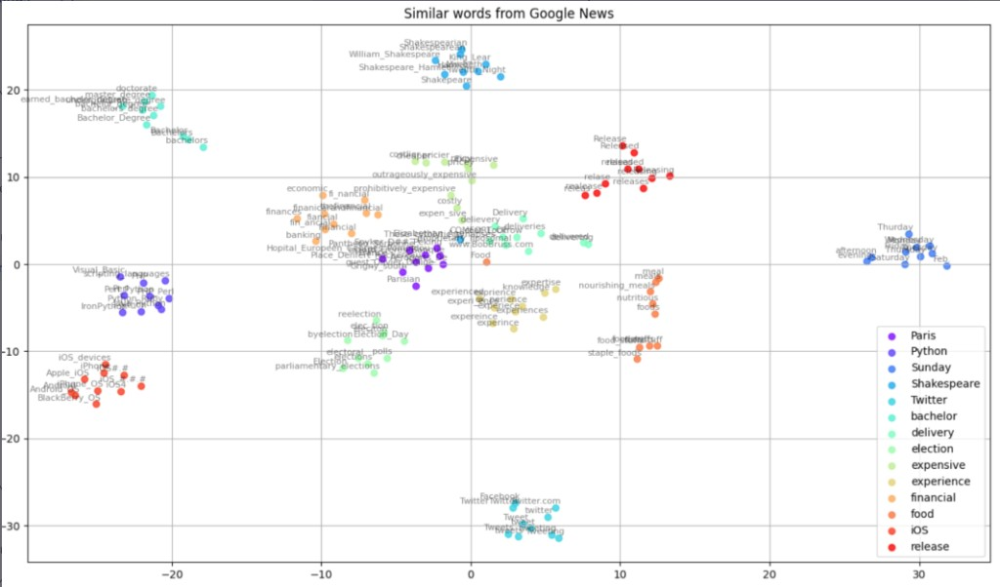

**Як інтерпретувати:**

- Кожен колір = один кластер (ключове слово і 10 найближчих)
- Слова одного кластера стоять поруч — семантично пов'язані
- «iOS», «Python», «Twitter» — технологічні теми — можуть бути поруч
- «food», «delivery», «financial» — відокремлені
- Якщо кластер розкиданий — модель не вловила чіткої семантики для цього слова

---

## ЧАСТИНА 10. ЕМБЕДИНГИ ЯК ОЗНАКИ ДЛЯ КЛАСИФІКАТОРА

### Ідея

Word embeddings можна використовувати як **ознаки (features)** для ML-моделі класифікації відгуків:

1. Для кожного слова відгуку → отримуємо вектор (50 або 300 чисел)
2. **Усереднюємо** вектори всіх слів → 1 вектор фіксованої розмірності для всього відгуку
3. Подаємо цей вектор до логістичної регресії

**Проблема різної довжини:** кожен відгук має різну кількість слів → різну кількість векторів. Для ML потрібен **фіксований розмір вхідних ознак**. Вирішення: усереднення.

### Покроковий розбір: від тексту до логістичної регресії

**Крок 1. Є текстовий відгук**

`The movie was very good` → після токенізації: `["the", "movie", "was", "very", "good"]`

**Крок 2. Для кожного слова беремо pretrained embedding**

Умовно, якщо embedding має 3 виміри:

$$movie = [0.2,\ 0.7,\ -0.1]$$

$$good = [0.8,\ 0.3,\ 0.5]$$

У реальному Word2Vec — 300 чисел на слово.

**Крок 3. Проблема: речення мають різну довжину**

| Відгук | Слів | Embeddings |
|---|---|---|
| `good movie` | 2 | 2 × 300 чисел |
| `this movie was really very good` | 6 | 6 × 300 чисел |

Logistic Regression очікує **однакову кількість ознак** для кожного прикладу. Тому не можна подавати різну кількість embedding-векторів.

**Крок 4. Тому embeddings усереднюють**

$$\frac{[0.2,\ 0.7,\ -0.1] + [0.8,\ 0.3,\ 0.5]}{2} = [0.5,\ 0.5,\ 0.2]$$

Весь текст `good movie` → один вектор `[0.5, 0.5, 0.2]`.

Якщо Word2Vec 300-вимірний — **кожен відгук стає одним вектором із 300 чисел**:

$$text \rightarrow tokens \rightarrow embeddings \rightarrow mean \rightarrow one\ vector\ (300D)$$

**Крок 5. Цей вектор — ознаки для Logistic Regression**

Раніше могли бути ознаки типу `age`, `salary`, `height`. Тут:

```
embedding_dim_1
embedding_dim_2
...
embedding_dim_300
```

Логістична регресія отримує ці 300 чисел і навчається прогнозувати `positive / negative sentiment`.

**Крок 6. Що робить `tok2vec`**

`word_embedding.get_vectors(...)` — бере embedding-вектори всіх слів.

`np.nanmean(vects, axis=0)` — рахує **середнє по кожній координаті**; NaN (OOV-слова) ігноруються.

```
word1 = [1, 2, 3]
word2 = [3, 4, 5]
mean  = [2, 3, 4]
```

**Крок 7. Train/test split**

80% → X_train для навчання. 20% → X_test для перевірки. y — sentiment labels: `0 = negative`, `1 = positive`.

**Крок 8. Logistic Regression не бачить тексту**

Вона не бачить `"The movie was good"` — лише усереднений embedding:

$$[0.15,\ -0.44,\ 0.72,\ \dots]$$

**Крок 9. Чому Word2Vec mean може програти Bag of Words**

Усереднення стирає багато інформації. Наприклад, `"movie was good"` і `"movie was not good"` можуть мати схожі середні вектори, але протилежний сентимент.

Втрачається: порядок слів, negation, частота важливих слів, локальна семантична структура. BoW зберігає факт появи слів `excellent`, `awful`, `boring`, `amazing` — а це сильні сигнали для сентименту.

> 💡 Word embeddings показують свій потенціал у **глибших** архітектурах (LSTM, Transformer), де порядок слів і контекст зберігаються.

---

> ### БЛОК 6 — Ембединги як ознаки для класифікації (Кроки 14–16)
>
> **Що робимо:** середній вектор усіх слів відгуку → вектор документа → логістична регресія → AUC.
> **Навіщо:** перевіряємо практичну цінність ембедингів для NLP-задачі. Спойлер: GloVe дає AUC = 0.807.

### Практичний крок 14 — Функція `tok2vec`

```python
def tok2vec(tokens, source: str, avg: str):
    """
    Перетворюємо список токенів одного відгуку на вектор фіксованої розмірності.
    OOV-слова повертаються як NaN-вектор і ігноруються при усередненні.

    Параметри:
        tokens — list[str]: список токенів (слів) одного відгуку
        source — str: назва моделі ('glove', 'word2vec', 'from_scratch')
        avg — str: метод агрегації: 'mean' або 'sum'

    Повертаємо: np.ndarray форми (dim,)
    """
    # Отримуємо матрицю векторів для всіх токенів: форма (n_tokens, dim)
    # OOV-токени → рядок з NaN
    vects = word_embedding.get_vectors(source=source, words=tokens)

    if avg == 'mean':
        # Усереднюємо по рядках, ігноруємо NaN (OOV-слова)
        return np.nanmean(vects, axis=0)
    elif avg == 'sum':
        # Підсумовуємо по рядках, ігноруємо NaN
        return np.nansum(vects, axis=0)
    else:
        raise ValueError('Select correct averaging method: sum or mean')
```

**Пояснення змінних:**


| Змінна / Параметр | Тип          | Форма            | Що містить                                         |
| ----------------- | ------------ | ---------------- | -------------------------------------------------- |
| `tokens`          | `list[str]`  | `(n_words,)`     | Список токенів одного відгуку (вже нормалізованих) |
| `source`          | `str`        | —                | Назва моделі ембедингів                            |
| `avg`             | `str`        | —                | Метод: `'mean'` або `'sum'`                        |
| `vects`           | `np.ndarray` | `(n_words, dim)` | Матриця: рядок = вектор одного токена; OOV = NaN   |
| Повернення        | `np.ndarray` | `(dim,)`         | Один вектор для всього відгуку                     |


**Чому** `np.nanmean`**, а не** `np.mean`**?** Якщо хоча б один токен OOV → рядок `vects` заповнений NaN. `np.mean` з NaN дає NaN для всього результату. `np.nanmean` ігнорує NaN-рядки і усереднює лише наявні вектори.

**Що на вході → що на виході:**

- Вхід: `['cat', 'food', 'goodness', 'really']` — 4 токени
- `vects` = матриця 4 × 300 (або 4 × 50 для GloVe 50d)
- Вихід: `array([-0.02, 0.13, ..., 0.45])` — один вектор довжиною 300 (або 50)

### Практичний крок 15 — Застосовуємо tok2vec до датасету

Використовуємо GloVe, який вже завантажений. Спочатку створюємо стовпець `sentiment` зі `Score` (1–2 = негатив, 4–5 = позитив, 3 — пропускаємо), потім перетворюємо кожен відгук на один вектор через `tok2vec`.

```python
# Використовуємо GloVe — він вже є в word_embedding
source = 'glove'

# Створюємо бінарну цільову змінну з Score:
# Score 1-2 → 0 (негативний), Score 4-5 → 1 (позитивний), Score 3 → виключаємо
df_clf = df[df['Score'] != 3].copy()
df_clf['sentiment'] = (df_clf['Score'] >= 4).astype(int)

# Розбиваємо на тренувальну (80%) і тестову (20%) вибірки
train_idxs = df_clf.sample(frac=0.8, random_state=42).index
test_idxs = [idx for idx in df_clf.index if idx not in train_idxs]

# Формуємо матриці ознак:
# 1. Токенізуємо кожен відгук за допомогою word_tokenize
# 2. Усереднюємо вектори токенів через tok2vec
X_train = df_clf.loc[train_idxs, 'text_normalized'].apply(
    word_tokenize
).apply(
    lambda x: tok2vec(x, source, 'mean')
).to_numpy()

X_test = df_clf.loc[test_idxs, 'text_normalized'].apply(
    word_tokenize
).apply(lambda x: tok2vec(x, source, 'mean')).to_numpy()

# Складаємо вектори у матриці
X_train = np.stack(X_train, axis=0)
X_test = np.stack(X_test, axis=0)

# Цільові змінні
y_train = df_clf.loc[train_idxs, 'sentiment']
y_test = df_clf.loc[test_idxs, 'sentiment']

print(f'Train: {X_train.shape}, Test: {X_test.shape}')
```

**Очікуваний вивід:**
```
Train: (xxxxx, 50), Test: (xxxxx, 50)
```
(50 — тому що GloVe 50d; якби Google News Word2Vec — було б 300)

### Практичний крок 16 — Тренуємо класифікатор і рахуємо AUC

**Пояснення змінних:**


| Змінна       | Тип          | Форма         | Що містить                                 |
| ------------ | ------------ | ------------- | ------------------------------------------ |
| `train_idxs` | `pd.Index`   | `(4000,)`     | Індекси рядків тренувальної вибірки        |
| `test_idxs`  | `list[int]`  | `(1000,)`     | Індекси рядків тестової вибірки            |
| `df_clf`     | `pd.DataFrame` | —           | Датасет без Score=3 і з новим стовпцем `sentiment` |
| `X_train`    | `np.ndarray` | `(N×0.8, 50)` | Матриця ознак тренувальної вибірки (50 = GloVe dim) |
| `X_test`     | `np.ndarray` | `(N×0.2, 50)` | Матриця ознак тестової вибірки             |
| `y_train`    | `pd.Series`  | `(N×0.8,)`    | Цільова змінна: 0 (негатив) або 1 (позитив) |


```python
# Навчаємо логістичну регресію на ознаках-ембедингах
model = LogisticRegression(random_state=42)
model.fit(X_train, y_train)

# Передбачаємо класи для тестової вибірки
predictions = model.predict(X_test)

# Обчислюємо AUC
print('AUC: ', roc_auc_score(y_test, predictions))
```

**Очікуваний вивід:**

```
AUC:  0.8071177944862156
```

### Як інтерпретувати AUC = 0.807

AUC = 0.807 — добрий результат. Для порівняння, кращий результат із [теми 9](../тема_9/9_nlp_text_preprocessing_notes.md) (BoW + уніграми + біграми) давав AUC = **0.864**.

**Чому word embeddings (усереднені) поступаються BoW у цьому завданні:**


| Причина                          | Пояснення                                                                                 |
| -------------------------------- | ----------------------------------------------------------------------------------------- |
| **Усереднення = втрата порядку** | «not good» і «good not» дають однаковий усереднений вектор, але різний сентимент          |
| **Часті слова-маркери**          | «excellent», «terrible» — сильні сигнали; BoW зберігає їхню частоту, усереднення розмиває |
| **Менша розмірність**            | 300 ознак vs 127 843 у BoW з біграмами                                                    |
| **Загальний домен**              | Word2Vec Google News не спеціалізований під Amazon Reviews                                |


> 💡 Word embeddings показують свій потенціал у **глибших** архітектурах (LSTM, Transformer), де порядок слів і контекст зберігаються.

### Що таке ROC-AUC

**ROC-AUC** — метрика для бінарної класифікації, яка показує, наскільки добре модель відрізняє позитивний клас від негативного при **різних threshold**.

- **ROC** = Receiver Operating Characteristic
- **AUC** = Area Under the Curve

**Як будується ROC-крива:**

ROC-крива — це графік, де:

- вісь Y: **True Positive Rate (= Recall)**

$$TPR = \frac{TP}{TP + FN}$$

- вісь X: **False Positive Rate**

$$FPR = \frac{FP}{FP + TN}$$

Ми змінюємо threshold від 0.9 до 0.1 — і для кожного значення отримуємо нову точку (FPR, TPR). З цих точок будується крива.

**AUC** — площа під цією кривою.

**Інтерпретація AUC:**

| AUC | Що означає |
|---|---|
| 1.0 | Ідеальне розділення класів |
| ~0.8 | Хороша здатність розрізняти |
| ~0.7 | Модель уже розрізняє класи |
| 0.5 | Майже випадкове вгадування |

$$ROC\text{-}AUC \approx 0.807$$

означає: модель досить добре відрізняє позитивні відгуки від негативних.

> **Корисна інтуїція:** ROC-AUC ≈ ймовірність того, що модель поставить випадковому позитивному прикладу **вищий score**, ніж випадковому негативному.

**Чому для ROC-AUC краще передавати ймовірності, а не класи:**

```python
# ✅ Правильно: передаємо ймовірності
proba = model.predict_proba(X_test)[:, 1]
roc_auc_score(y_test, proba)

# ⚠️ Грубіше: передаємо вже готові класи 0/1
roc_auc_score(y_test, predictions)
```

`predictions` — це вже `0` або `1`, тобто ROC-крива будується лише з двох точок. `predict_proba` дає неперервний score → повна крива → точніший AUC.

---

## ЧАСТИНА 11. DOC2VEC

### Від слів до документів

**Doc2Vec** (Quoc Le, Tomas Mikolov, 2014) — розширення Word2Vec для отримання векторів **цілих документів** (речень, абзаців, текстів).

**Проблема усередненого Word2Vec:** втрачається порядок слів, унікальний «стиль» документа і локальний контекст.

**Рішення Doc2Vec:** кожному документу присвоюється **унікальний «вектор абзацу» (Paragraph Vector, D)**, який тренується разом зі словами.

### Архітектура PV-DM (Distributed Memory)

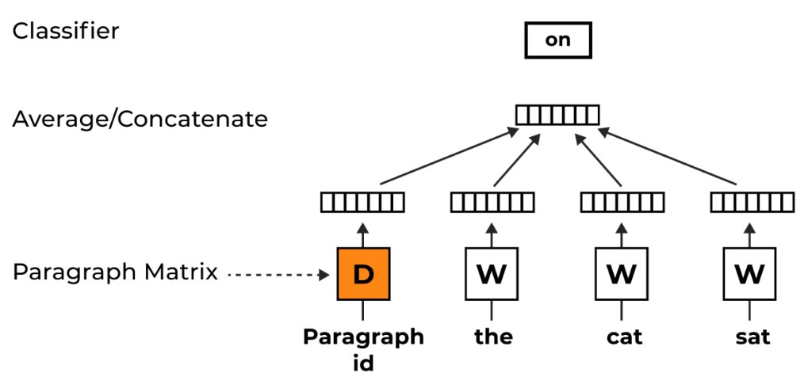

**PV-DM** = аналог CBOW Word2Vec з додатковим вектором документа:

- **Вхід:** вектор документа D + вектори контекстних слів W
- **Об'єднання:** усереднення або конкатенація (D і W)
- **Вихід:** передбачення наступного слова (класифікатор зверху)

**«Вектор абзацу» D** — це «пам'ять документа»: він пам'ятає тему і стиль всього документа, яких може не вистачати в локальному контексті.

**Особливості PV-DM:**

- Вектор D **унікальний** для кожного документа
- Вектори слів W **спільні** для всього корпусу
- При навчанні оновлюємо і D, і W одночасно

### Архітектура PV-DBOW (Distributed Bag of Words)

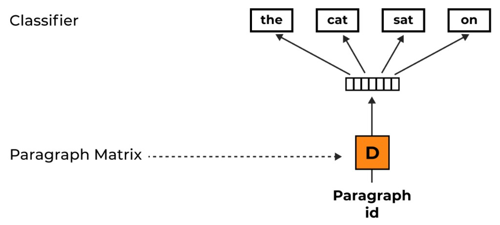

**PV-DBOW** = аналог Skip-gram Word2Vec:

- **Вхід:** лише вектор документа D
- **Вихід:** передбачає випадково вибрані слова з документа
- **Порядок слів:** не враховується


|                          | PV-DM                            | PV-DBOW                |
| ------------------------ | -------------------------------- | ---------------------- |
| **Аналог Word2Vec**      | CBOW                             | Skip-gram              |
| **Порядок слів**         | Враховує (частково, через вікно) | Не враховує            |
| **Вектори слів**         | Тренуються разом з D             | Не тренуються (лише D) |
| **Якість**               | Зазвичай вища                    | Дещо нижча             |
| **Рекомендація авторів** | Комбінувати DM + DBOW            | —                      |

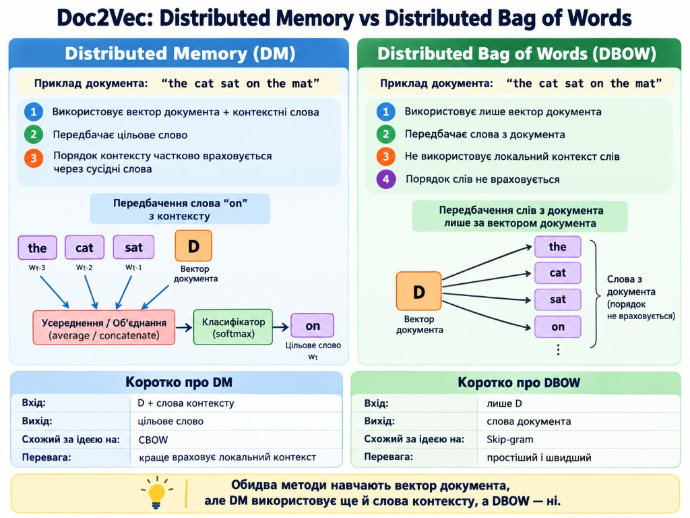

### Покроковий розбір: як Doc2Vec навчає вектор документа

**1. Чому взагалі потрібен Doc2Vec**

У Word2Vec кожне слово має embedding: `dog → embedding`, `cat → embedding`. Але для цілого тексту `"the cat sat on the mat"` просте усереднення word embeddings — грубе наближення.

Doc2Vec каже: давай одразу навчимо окремий вектор для всього документа:

$$Document_3 \rightarrow [0.21,\ -0.45,\ 0.77,\ \dots]$$

Цей вектор має фіксовану довжину (наприклад, 300) і представляє зміст і стиль усього документа.

**2. Що означає `tags=[3]` у TaggedDocument**

`D` на схемах — це **document/paragraph vector**. `tags=[3]` означає: «це третій документ у корпусі, і для нього модель тримає окремий вектор».

```python
TaggedDocument(words=[...], tags=[3])
# words — список слів документа
# tags=[3] — ідентифікатор цього документа
```

**3. PV-DM (Distributed Memory) — покроково**

Модель використовує вектор документа D + вектори сусідніх слів, щоб передбачити наступне слово:

```
the + cat + sat → predict "on"
     ↕
paragraph vector D (пам'ять про весь документ)
```

Paragraph vector — це додаткова **«пам'ять» про весь документ**. Він зберігає контекст, якого нема в локальних словах.

$$document\ vector + word\ vectors \rightarrow predict\ target\ word$$

**4. PV-DBOW (Distributed Bag of Words) — покроково**

Тут простіше: беремо лише paragraph vector D і просимо його передбачити будь-які слова з документа:

```
        → the
        → cat
D  →    → sat
        → on
```

$$document\ vector \rightarrow predict\ words\ from\ document$$

**5. Як навчається paragraph vector**

На початку — випадковий:

$$D_3 = [0.01,\ -0.02,\ 0.04,\ \dots]$$

Після кожного prediction рахується loss → backpropagation → оновлення. Після 200 епох:

$$D_3 = [0.42,\ -0.31,\ 0.76,\ \dots]$$

Тепер він містить інформацію про зміст конкретного документа.

**6. Що робить `infer_vector`**

```python
model_Doc2Vec.infer_vector(tokens)
```

Для нового тексту (якого не було при тренуванні) — фіксує ваги моделі і знаходить оптимальний вектор документа:

```
"this product is very good"
↓ Doc2Vec infer_vector
[0.17, -0.44, 0.31, ..., 0.05]   # 300 чисел
```

**7. Потім — як завжди: Logistic Regression**

$$Doc2Vec\ vector \rightarrow LogisticRegression \rightarrow sentiment$$

Logistic Regression не бачить слів — лише 300 чисел [x₁, x₂, …, x₃₀₀].

**8. Чому Doc2Vec може бути кращим за mean Word2Vec**

| | Mean Word2Vec | Doc2Vec |
|---|---|---|
| Як отримуємо вектор документа | Механічне усереднення word vectors | Окремий вектор, навчений через prediction task |
| Враховує порядок слів | ❌ | ✅ (PV-DM) |
| Доменна адаптація | Загальна модель | Навчається на нашому корпусі |
| AUC (наш приклад) | ~0.807 | ~0.821 |

> **Найкоротше:**
> **Word2Vec вчить вектори слів. Doc2Vec вчить вектори документів.**
> DM і DBOW — це два різні способи навчити цей document vector.

---

> ### БЛОК 7 — Doc2Vec: вектори документів (Кроки 17–20)
>
> **Що робимо:** готуємо TaggedDocument, тренуємо Doc2Vec, отримуємо вектори документів, класифікуємо.
> **Навіщо:** Doc2Vec враховує порядок слів і контекст всього документа → AUC = 0.821 (краще ніж Word2Vec).

### Практичний крок 17 — TaggedDocument: формат даних

```python
# Використовуємо df_clf (той самий відфільтрований датасет що і в кроці 15)
# → Score 1-2 = 0 (негатив), Score 4-5 = 1 (позитив), Score 3 виключено
df_clf_reset = df_clf.reset_index(drop=True)   # скидаємо індекси: 0, 1, 2, ...

# Токенізуємо нормалізовані тексти
text_tokenized = df_clf_reset['text_normalized'].apply(word_tokenize).to_list()

def tagged_document(list_of_list_of_words):
    """
    Генераторна функція: перетворюємо кожен список токенів
    у TaggedDocument з унікальним числовим тегом.
    gensim Doc2Vec очікує саме такий формат.
    """
    for i, list_of_words in enumerate(list_of_list_of_words):
        yield gensim.models.doc2vec.TaggedDocument(list_of_words, [i])

# Формуємо список тегованих документів
text_tokenized_tagget = list(tagged_document(text_tokenized))

# Переглядаємо приклад четвертого документа
text_tokenized_tagget[3]
```

**Пояснення змінних:**


| Змінна                  | Тип                    | Що містить                           |
| ----------------------- | ---------------------- | ------------------------------------ |
| `text_tokenized`        | `list[list[str]]`      | Список токенізованих відгуків        |
| `tagged_document`       | `generator`            | Генераторна функція `TaggedDocument` |
| `text_tokenized_tagget` | `list[TaggedDocument]` | Теговані документи для Doc2Vec       |


**Структура** `TaggedDocument`**:**

- `words` — список токенів документа
- `tags` — список тегів (зазвичай `[порядковий_номер]`)

**Очікуваний вивід** `text_tokenized_tagget[3]`**:**

```
TaggedDocument(
    words=['try', 'differant', 'brand', 'juice', 'imply', 'get', 'relief',
           'arthritis', 'pain', 'save', 'money', 'buy', 'tylenol', 'brand',
           'good', 'bland', 'taste', 'nothing', 'pain'],
    tags=[3]
)
```

### Практичний крок 18 — Тренуємо Doc2Vec і виводимо прогрес

```python
from gensim.models.callbacks import CallbackAny2Vec
from tqdm.notebook import tqdm

# Callback для відображення прогрес-бару по епохах
# (tqdm — від арабського "taqaddum" تقدم — «прогрес»)
class EpochProgress(CallbackAny2Vec):
    def __init__(self, total_epochs):
        self.pbar = tqdm(total=total_epochs, desc='Doc2Vec training')
    def on_epoch_end(self, model):
        self.pbar.update(1)
    def on_train_end(self, model):
        self.pbar.close()

# Створюємо модель Doc2Vec з параметрами
model_Doc2Vec = gensim.models.doc2vec.Doc2Vec(
    vector_size=300,   # розмірність вектора документа і слів
    min_count=5,       # ігноруємо слова з частотою < 5
    epochs=200         # кількість проходів по всьому корпусу
)

# Будуємо словник — Doc2Vec проходить по корпусу і рахує частоти слів
model_Doc2Vec.build_vocab(text_tokenized_tagget)

# Тренуємо модель — 200 епох по всіх документах, з прогрес-баром
model_Doc2Vec.train(
    text_tokenized_tagget,
    total_examples=model_Doc2Vec.corpus_count,   # кількість документів
    epochs=model_Doc2Vec.epochs,                  # 200 епох
    callbacks=[EpochProgress(model_Doc2Vec.epochs)]
)
```

**Пояснення параметрів** `Doc2Vec`**:**


| Параметр         | Тип   | Значення       | Що робить                                   |
| ---------------- | ----- | -------------- | ------------------------------------------- |
| `vector_size`    | `int` | 300            | Розмірність векторів документів і слів      |
| `min_count`      | `int` | 5              | Ігноруємо слова, що зустрічаються < 5 разів |
| `epochs`         | `int` | 200            | Кількість проходів по корпусу               |
| `total_examples` | `int` | `corpus_count` | Загальна кількість документів у корпусі     |


**Що відбувається при** `build_vocab`**:** Doc2Vec збирає всі унікальні слова і будує словник з частотами — необхідна підготовка перед тренуванням.

**Що відбувається при** `train`**:** 200 разів проходимо по всьому корпусу, на кожному кроці оновлюємо вектори слів і вектори документів через градієнтний спуск.

### Практичний крок 19 — Отримуємо вектори і класифікуємо

```python
# Отримуємо вектор кожного документа через infer_vector
X = [model_Doc2Vec.infer_vector(tokens) for tokens in text_tokenized]

# Розбиваємо на train/test (80/20) — по позиційних індексах у df_clf_reset
n = len(X)
split = int(n * 0.8)
X_train = np.vstack(X[:split])
X_test  = np.vstack(X[split:])
y_train_doc = df_clf_reset['sentiment'].iloc[:split]
y_test_doc  = df_clf_reset['sentiment'].iloc[split:]

# Навчаємо логістичну регресію
clf_doc = LogisticRegression(random_state=42)
clf_doc.fit(X_train, y_train_doc)
predictions = clf_doc.predict(X_test)

print('AUC Doc2Vec:', roc_auc_score(y_test_doc, predictions))
```

**Очікуваний вивід:**
```
AUC Doc2Vec: 0.821...
```

### Практичний крок 20 — Порівнюємо AUC усіх методів

```python
# Збираємо AUC усіх методів в одну таблицю
# (значення обчислені у кроках 16 і 19 — запускати після них)

auc_w2v  = roc_auc_score(y_test,     model.predict(X_test))        # Word2Vec (усереднений)
auc_doc  = roc_auc_score(y_test_doc, clf_doc.predict(X_test))       # Doc2Vec

results = {
    'BoW + CV (1,2) — тема 9':       0.864,   # еталон із попередньої теми
    'Doc2Vec (vector_size=300)':      auc_doc,
    'Word2Vec Google News (mean)':    auc_w2v,
}

print(f'{"Метод":<40} {"AUC":>6}')
print('-' * 48)
for name, auc in sorted(results.items(), key=lambda x: -x[1]):
    print(f'{name:<40} {auc:>6.4f}')
```

**Очікуваний вивід:**
```
Метод                                      AUC
------------------------------------------------
BoW + CV (1,2) — тема 9                  0.8640
Doc2Vec (vector_size=300)                0.8210
Word2Vec Google News (mean)              0.8071
```

### Порівняння всіх методів


| Метод                         | AUC       | Переваги                                      | Недоліки                          |
| ----------------------------- | --------- | --------------------------------------------- | --------------------------------- |
| **BoW + CV** `(1,2)` (тема 9) | **0.864** | Прості, ефективні для сентименту              | Не семантика, не враховує порядок |
| **Doc2Vec**                   | 0.821     | Враховує контекст, навчений на нашому корпусі | Довше тренується                  |
| **Word2Vec (усереднений)**    | 0.807     | Семантично багатий                            | Усереднення втрачає порядок       |
| **Word2Vec from scratch**     | < 0.807   | Доменна специфіка                             | Малий корпус → низька якість      |


**Чому Doc2Vec перемагає усереднений Word2Vec:**

- Doc2Vec навчається спеціально на нашому корпусі → доменна специфіка Amazon Reviews
- Вектор документа D не просто усереднення — він оптимізується безпосередньо для передбачення слів

---

## ПІДСУМКИ

Чудово попрацювали! 🚀

Ми пройшли повний шлях від окремих слів до документів у векторному просторі.

**Теорія:**

- **Word2Vec** — ковзне вікно, CBOW і Skip-gram, softmax-функція, чому знаменник = проблема
- **GloVe** — матриця co-occurrence, відношення ймовірностей, функція втрат із ваговою функцією
- **FastText** — char n-grams, вектор слова = сума векторів підслів, вирішення OOV-проблеми
- **Hierarchical Softmax** — O(V) |→| O(log_2 V), дерево Хаффмана
- **Negative Sampling** — K хибних слів замість усього словника, розподіл U(w)^(3/4)
- **Косинусна подібність** — кут між векторами, нечутлива до масштабу

**Практика:**

- Тренування Word2Vec з нуля (`word2vec.Word2Vec`, `build_corpus`)
- Клас `WordEmbedding` — уніфікований інтерфейс для всіх моделей
- Завантаження GloVe, Word2Vec Google News, FastText
- Порівняння семантичних сусідів: загальна модель vs доменна
- Візуалізація t-SNE: 300D → 2D з мінімізацією KL-дивергенції
- Ембединги як ознаки + логістична регресія (AUC = 0.807)
- Doc2Vec: PV-DM і PV-DBOW, `TaggedDocument`, `infer_vector` (AUC = 0.821)

---

## EXAM / REVISION CHEAT SHEET

### 1) Word2Vec — швидко

- **CBOW**: контекст → слово (швидший, для великих корпусів)
- **Skip-gram**: слово → контекст (повільніший, краще для рідких слів)
- Ковзне вікно `window=5` → 5 слів ліворуч і праворуч
- Результат = прихований шар мережі, **не** вихідний

### 2) GloVe — швидко

$$J = \sum_{i,j} f(X_{ij}) \left( w_i^\top \tilde{w}_j + b_i + \tilde{b}_j - \log X_{ij} \right)^2$$

- Co-occurrence matrix: X_(ij) = кількість спільних появ слів i і j
- Вагова функція f знижує вплив дуже рідких і дуже частих пар
- Автори: Pennington, Socher, Manning (Stanford, 2014)
- [Завантажити](https://nlp.stanford.edu/projects/glove/) | [GitHub](https://github.com/stanfordnlp/GloVe)

### 3) FastText — швидко

- Char n-grams: `matter` → `<ma`, `mat`, `att`, `tte`, `ter`, `er>`, `<matter>`
- v_w = Σ_(g ∈ G_w) z_g (вектор слова = сума векторів підслів)
- OOV-слово: є n-grams → є вектор (головна перевага)

### 4) Косинусна подібність — швидко

**Формула:** `cos(θ) = (A · B) / (A · B), значення в межах [-1, 1]`

- 1.0 = ідентичні, 0.0 = не пов'язані, −1.0 = антоніми
- `model.similarity(word1, word2)` — у gensim
- `model.most_similar(word, topn=5)` — N найближчих

### 5) Hierarchical Softmax vs Negative Sampling — швидко


|                             | Hierarchical Softmax     | Negative Sampling     |
| --------------------------- | ------------------------ | --------------------- |
| Складність                  | O(log_2 V)               | O(K), K ≈ 5–20        |
| Структура                   | Дерево Хаффмана          | —                     |
| Розподіл                    | —                        | Pₙ(w) ∝ U(w)^(3/4)    |
| Числовий приклад (V = 10^6) | ≈ 20 кроків замість 10^6 | 6 кроків замість 10^6 |


### 6) t-SNE — швидко

- Мінімізує KL(P ‖ Q) = Σᵢⱼ pᵢⱼ · log(pᵢⱼ/qᵢⱼ)
- `perplexity` ≈ кількість ефективних сусідів (5–50)
- `init='pca'` — стабільніший результат
- t-SNE → **локальна** структура; PCA → **глобальна** структура
- scikit-learn 1.5+: `n_iter` → `max_iter`

### 7) Doc2Vec — швидко

- **PV-DM** (аналог CBOW): D + слова → передбачаємо наступне слово
- **PV-DBOW** (аналог Skip-gram): D → передбачаємо слова документа
- `TaggedDocument(words, [id])` — формат вхідних даних для gensim
- `model.infer_vector(tokens)` — вектор нового документа
- Комбінація DM + DBOW → кращі результати

### 8) Зведена таблиця AUC (Amazon Reviews, 5000 прикладів)


| Метод                                                    | AUC                   |
| -------------------------------------------------------- | --------------------- |
| BoW + CountVectorizer `(1,2)` + text_normalized (тема 9) | **0.864** ← найкращий |
| Doc2Vec (vector_size=300, epochs=200)                    | 0.821                 |
| Word2Vec Google News (усереднений, mean)                 | 0.807                 |


---

## КОРИСНІ ПОСИЛАННЯ

- **Репозиторій курсу:** [goitacademy/DEEP-LEARNING-FOR-COMPUTER-VISION-AND-NLP](https://github.com/goitacademy/DEEP-LEARNING-FOR-COMPUTER-VISION-AND-NLP)
- **Офіційний ноутбук лекції:** [Module_5_Lecture_10_Class.ipynb](https://github.com/goitacademy/DEEP-LEARNING-FOR-COMPUTER-VISION-AND-NLP/blob/main/notebooks/Module_5_Lecture_10_Class.ipynb)
- **Датасет Amazon Product Reviews:** [kaggle.com/datasets/arhamrumi/amazon-product-reviews](https://www.kaggle.com/datasets/arhamrumi/amazon-product-reviews)
- **Word2Vec (оригінальна стаття):** [Efficient Estimation of Word Representations in Vector Space](Efficient%20Estimation%20of%20Word%20Representations%20in%20Vector%20Space.pdf)
- **GloVe (офіційний сайт):** [nlp.stanford.edu/projects/glove](https://nlp.stanford.edu/projects/glove/)
- **GloVe (GitHub):** [github.com/stanfordnlp/GloVe](https://github.com/stanfordnlp/GloVe)
- **FastText (офіційний сайт):** [fasttext.cc](https://fasttext.cc/)
- **Doc2Vec (catfood docs):** [catfood.readthedocs.io/en/latest/doc2vec.html](https://catfood.readthedocs.io/en/latest/doc2vec.html)
- **Word2Vec Google News (Kaggle):** [kaggle.com/datasets/leadbest/googlenewsvectorsnegative300](https://www.kaggle.com/datasets/leadbest/googlenewsvectorsnegative300)
- **FastText wiki-news (Kaggle):** [kaggle.com/datasets/facebook/fasttext-wikinews](https://www.kaggle.com/datasets/facebook/fasttext-wikinews)
- **Ілюстрована теорія word embeddings (Lena Voita):** [lena-voita.github.io/nlp_course/word_embeddings.html](https://lena-voita.github.io/nlp_course/word_embeddings.html)
- **Transfer Learning with GloVe:** [thinkingneuron.com/transfer-learning-with-glove](https://thinkingneuron.com/transfer-learning-with-glove/)
- **Gensim KeyedVectors:** [radimrehurek.com/gensim/models/keyedvectors.html](https://radimrehurek.com/gensim/models/keyedvectors.html)
- **Gensim Doc2Vec:** [radimrehurek.com/gensim/models/doc2vec.html](https://radimrehurek.com/gensim/models/doc2vec.html)
- **t-SNE (scikit-learn):** [scikit-learn.org/stable/modules/generated/sklearn.manifold.TSNE.html](https://scikit-learn.org/stable/modules/generated/sklearn.manifold.TSNE.html)
- **Конспект теми 9 (NLP Preprocessing):** [тема_9/9_nlp_text_preprocessing_notes.md](../тема_9/9_nlp_text_preprocessing_notes.md)

---

## ДОДАТОК: ПОКРОКОВИЙ РОЗБІР ПРОЦЕСУ НАВЧАННЯ

> Інтуїтивне пояснення — від випадкових чисел до навчених ембедингів. Читати як послідовну розповідь.

---

### 1. Що таке word embedding

Word embedding — це числовий вектор слова.

Наприклад:

$$dog \rightarrow [0.71,\ 0.32,\ -0.18]$$

Ці числа самі по собі не мають окремого людського значення. Важливий увесь вектор.

Ідея така: слова, які часто трапляються в схожих контекстах, повинні мати схожі вектори.

Наприклад, у векторному просторі:

$$dog \approx cat$$

---

### 2. На початку embeddings ще нічого не знають

Спочатку embeddings зазвичай ініціалізуються випадковими числами.

$$dog \rightarrow [0.02,\ -0.01,\ 0.03]$$

$$cat \rightarrow [-0.04,\ 0.02,\ 0.01]$$

Ці значення ще не відображають значення слів. Їх треба навчити.

---

### 3. Word2Vec — це спосіб навчити embeddings

Word2Vec має два основні варіанти.

**CBOW (Continuous Bag of Words)**

$$context \rightarrow target\ word$$

Наприклад: `I like ___ very much` — модель намагається передбачити слово в центрі.

**Skip-gram**

Навпаки:

$$word \rightarrow context$$

Наприклад: `dog` — модель намагається передбачити слова, які можуть бути поруч: `pet`, `animal`, `barks` тощо.

---

### 4. Контекстне вікно

Щоб визначити контекст, використовується **context window**.

`I really like green apples today`

Якщо центральне слово `green` і window = 2:

`[I | really | GREEN | apples | today]`

Контекст: `I`, `really`, `apples`, `today`.

---

### 5. Під час навчання модель бачить пари слів

Наприклад, для Skip-gram: `dog → eats` — це **positive pair**:

$$(dog,\ eats)$$

Модель повинна навчитися давати таким справжнім парам **високий score**.

---

### 6. Як слова представлені всередині

Кожне слово має embedding. Наприклад:

$$v_{dog} = [0.6,\ 0.1]$$

$$u_{eats} = [0.5,\ 0.2]$$

Щоб виміряти, наскільки ці два вектори сумісні, використовується **dot product** (скалярний добуток).

---

### 7. Скалярний добуток

$$0.6 \times 0.5 + 0.1 \times 0.2 = 0.30 + 0.02 = 0.32$$

Отримали `0.32`. Це ще **не ймовірність**.

---

### 8. Sigmoid

Sigmoid перетворює будь-яке число в число від 0 до 1:

$$\sigma(x) = \frac{1}{1 + e^{-x}}$$

Наприклад:

$$\sigma(0.32) \approx 0.58$$

Тобто: dog + eats → 0.58. Це можна інтерпретувати як score/ймовірність того, що пара справжня.

---

### 9. Проблема звичайного softmax

Якщо у словнику 100 000 слів, то звичайний softmax повинен порівнювати правильне слово з усіма кандидатами одразу. Це дуже дорого. Тому використовують:
- hierarchical softmax
- negative sampling

---

### 10. Hierarchical softmax — одне бінарне дерево для всього словника

```
             ROOT
           /      \
          0        1
        /            \
      ...            ...
     /                  \
   cat                  king
```

Кожне слово — лист дерева.

---

### 11. Кожне слово має шлях 0/1

| Слово | Шлях |
|-------|------|
| `cat` | 000  |
| `dog` | 001  |
| `car` | 010  |
| `bus` | 011  |

0 і 1 — це не ймовірності. Це лише: `0` → ліворуч, `1` → праворуч.

---

### 12. Внутрішні вузли дерева мають свої ваги

$$u_{root} = [-1,\ -0.8]$$

$$u_{N1} = [-0.6,\ -0.5]$$

Ці ваги теж навчаються. На старті вони можуть бути випадковими.

---

### 13. Як hierarchical softmax рахує ймовірність

Припустімо:

$$embedding(dog) = [1,\ 0.5], \quad u_{root} = [-1,\ -0.8]$$

Dot product:

$$1 \cdot (-1) + 0.5 \cdot (-0.8) = -1 - 0.4 = -1.4$$

Sigmoid:

$$\sigma(-1.4) \approx 0.198$$

Якщо домовилися, що sigmoid дає P(right), то:

$$P(right) = 0.198, \quad P(left) = 1 - 0.198 = 0.802$$

---

### 14. Проходимо весь шлях

Якщо `cat = 000` і на трьох вузлах маємо P(left) = 0.802, 0.701, 0.900, то:

$$P(cat \mid dog) = 0.802 \times 0.701 \times 0.900 \approx 0.506$$

Тобто множимо **не 0 і 1**, а ймовірності правильних рішень на кожному вузлі.

---

### 15. Loss

Правильне слово знаємо з training data. Наприклад: `dog → cat`. Модель отримала P(cat|dog) = 0.506.

$$L = -\log P(cat \mid dog) = -\log(0.506) \approx 0.681$$

Чим більша ймовірність правильного слова → тим менший loss.

---

### 16. Backpropagation

$$prediction \rightarrow loss \rightarrow backpropagation \rightarrow gradients \rightarrow update$$

Оновлюються:
- embedding центрального слова
- ваги внутрішніх вузлів дерева, через які ми пройшли

До навчання:

$$dog = [0.02,\ -0.01,\ 0.03]$$

Після багатьох оновлень:

$$dog = [0.71,\ 0.32,\ -0.18]$$

---

### 17. Навіщо змінювати embedding

Бо спочатку він випадковий. Після багатьох прикладів модель бачить, що `dog` часто має контексти, схожі на `cat`. Тому їхні embeddings поступово стають схожими:

$$dog = [0.71,\ 0.32,\ -0.18]$$

$$cat = [0.68,\ 0.30,\ -0.20]$$

---

### 18. Дерево і embedding space — не одне й те саме

![Чи будуємо ми дерево з embeddings? Ні. Дерево будується зі словника (шлях dog=001), embedding — окремий числовий вектор (dog→[0.71,0.32,-0.18])](images/tree_vs_embeddings.jpg)

**Дерево** — потрібне для ефективного навчання (hierarchical softmax).

**Embedding space** — простір, у якому живуть навчені вектори.

Тому `cat` і `dog` можуть бути **близькими у vector space**, навіть якщо в Huffman tree вони не поруч.

---

### 19. Negative sampling

Це інший спосіб уникнути повного softmax. Замість порівняння `dog` з усіма 100 000 словами, беремо:

1 **positive**: `(dog, eats) → 1`

і кілька **negative**:
- `(dog, banana) → 0`
- `(dog, car) → 0`
- `(dog, queen) → 0`

---

### 20. Для кожної пари рахуємо dot product + sigmoid

$$v_{dog} = [0.6,\ 0.1], \quad u_{eats} = [0.5,\ 0.2]$$

$$v_{dog}^\top u_{eats} = 0.32, \quad \sigma(0.32) = 0.58$$

- Для **positive pair** — хочемо результат → 1
- Для **negative pair** — хочемо результат → 0

---

### 21. Negative sampling loss

Для positive pair:

$$-\log \sigma(v_d^\top u_e)$$

Для negative sample:

$$-\log \sigma(-v_d^\top u_n)$$

Для K негативних зразків загалом:

$$L = -\log \sigma(v_d^\top u_e) - \sum_{k=1}^{K} \log \sigma(-v_d^\top u_{n_k})$$

---

### 22. Що робить backpropagation тут

Для `dog + eats` — вектори мають стати **більш сумісними**:

$$dot\ product\ \uparrow$$

Для `dog + banana` — **менш сумісними**:

$$dot\ product\ \downarrow$$

---

### 23. GloVe — інший підхід

GloVe спочатку будує **co-occurrence matrix** Xᵢⱼ — скільки разів слова i і j зустрілися в одному context window.

| слово   | fruit | sweet |  car |
|---------|------:|------:|-----:|
| `apple` |   100 |    60 |    2 |
| `mango` |    80 |    50 |    1 |

---

### 24. Ймовірність co-occurrence

$$X_{apple} = 100 + 60 + 2 = 162$$

$$P(fruit \mid apple) = \frac{100}{162} \approx 0.617$$

Це означає: якщо центральне слово `apple`, наскільки часто `fruit` зустрічається поруч.

---

### 25. GloVe loss

GloVe намагається зробити так, щоб:

$$w_i^\top \tilde{w}_j + b_i + \tilde{b}_j \approx \log X_{ij}$$

$$J = \sum_{i,j} f(X_{ij}) \left( w_i^\top \tilde{w}_j + b_i + \tilde{b}_j - \log X_{ij} \right)^2$$

Тобто модель змінює embeddings, щоб вони відображали **глобальну статистику** co-occurrence.

---

### 26. FastText

FastText схожий на Word2Vec, але слово представляється не лише як ціле — воно розбивається на **character n-grams**.

`matter` → з boundary symbols `<matter>` → тріграми: `<ma`, `mat`, `att`, `tte`, `ter`, `er>`

> Не треба писати `<mat>` — `<` і `>` означають початок і кінець саме цілого слова.

---

### 27. FastText embedding

Кожен char n-gram має свій вектор:

| n-gram | вектор |
|--------|--------|
| `<ma`  | [0.2, 0.1, 0.4] |
| `mat`  | [0.3, 0.2, 0.1] |
| ...    | ...    |

$$embedding(matter) = word\ vector + \sum subword\ vectors$$

Тому FastText може створювати embedding навіть для **нового слова** (OOV), якщо знає його character n-grams.

---

### 28. Як усе виглядає в одному ланцюжку

**Word2Vec:**
```
текст → словник → context windows → training pairs
→ початкові випадкові embeddings → prediction → dot product
→ sigmoid / hierarchical softmax / negative sampling
→ loss → backpropagation → оновлення embeddings
→ повторюємо багато разів → навчені embeddings
```

**GloVe:**
```
текст → context windows → co-occurrence matrix
→ Xᵢⱼ → log(Xᵢⱼ) → GloVe loss
→ gradient descent → оновлення embeddings → навчені embeddings
```

**FastText:**
```
слово → character n-grams → subword embeddings
→ Word2Vec-style training
→ оновлення word + subword vectors → навчений embedding слова
```

---

### 29. Якщо хочемо побачити embeddings візуально

Реальний embedding має 50, 100 або 300 вимірів:

$$dog \rightarrow [0.12,\ -0.44,\ 0.81,\ \dots]$$

Людина не може намалювати 300-вимірний простір. Тому використовуємо алгоритм зниження розмірності.

---

### 30. t-SNE зменшує 300D до 2D

$$[0.12,\ -0.44,\ 0.81,\ \dots] \rightarrow [4.2,\ -1.7]$$

$$300D \rightarrow 2D$$

Тепер слово можна намалювати як точку на площині.

---

### 31. Навіщо t-SNE

t-SNE намагається зберегти **локальні сусідства**: якщо `dog` і `cat` були близькими у 300D, вони залишаються близькими у 2D. Тому на графіку виникають групи (тварини, їжа, дні тижня) — але це не окрема кластеризація, просто **схожі embeddings опинилися поруч**.

---

### 32. Звідки беруться найближчі слова

```python
model.most_similar("Paris", topn=10)
```

Знайди 10 слів, embeddings яких найближчі до embedding `Paris` — за косинусною подібністю.

---

### 33. Що означає shape `(14, 10, 300)`

| Вісь | Значення |
|---|---|
| 14 | кількість ключових слів |
| 10 | схожих слів для кожного |
| 300 | розмірність embedding |

Після t-SNE: `(14, 10, 2)` — кожне слово має лише [x, y].

---

### 34. Perplexity у t-SNE

Параметр, який приблизно задає масштаб локального сусідства:

| Значення | Ефект |
|---|---|
| Менша perplexity | Дуже локальний погляд |
| Більша perplexity | Ширший локальний контекст |

---

### 35. KL divergence у t-SNE

**KL = Kullback–Leibler divergence** (названа на честь Kullback і Leibler) — вимірює, наскільки один розподіл ймовірностей відрізняється від іншого.

У t-SNE: порівнює схожості між точками у 300D і у 2D. Алгоритм мінімізує цю різницю.

---

### 36. t-SNE теж має оптимізацію

1. Рахує схожості у 300D
2. Створює початкові точки у 2D
3. Рахує схожості у 2D
4. Рахує KL divergence
5. Рухає точки у 2D
6. Повторює багато разів

$$loss \rightarrow optimization$$

---

### 37. Embeddings можна використовувати як features

$$Word2Vec \rightarrow LogisticRegression$$

---

### 38–39. Токенізуємо і беремо embedding кожного слова

`"The movie was very good"` → `["the", "movie", "was", "very", "good"]`

$$movie = [0.2,\ 0.7,\ -0.1], \quad good = [0.8,\ 0.3,\ 0.5]$$

---

### 40–42. Проблема різної довжини → усереднення

Речення мають різну кількість слів, а Logistic Regression потребує однакової кількості ознак. Тому усереднюємо:

$$\frac{[0.2,\ 0.7,\ -0.1] + [0.8,\ 0.3,\ 0.5]}{2} = [0.5,\ 0.5,\ 0.2]$$

Якщо Word2Vec 300-вимірний — будь-яке речення (5 слів чи 50) стає **одним вектором із 300 чисел**.

---

### 43. Весь pipeline

$$text \rightarrow tokens \rightarrow word\ embeddings \rightarrow mean \rightarrow 300D\ vector \rightarrow LogisticRegression$$

---

### 44. Logistic Regression не бачить текст

Вона не бачить `"this movie was excellent"`. Вона бачить:

$$[0.12,\ -0.44,\ 0.31,\ \dots]$$

і прогнозує `positive / negative`.

---

### 45. Чому mean Word2Vec може програти Bag of Words

`"good movie"` і `"not good movie"` можуть отримати схожі середні вектори. Губляться: порядок слів, negation, важливість окремих слів, частота, структура речення.

---

### 46–48. ROC-AUC

**ROC** = Receiver Operating Characteristic, **AUC** = Area Under the Curve.

ROC-крива будується при різних threshold:

$$TPR = \frac{TP}{TP + FN}, \quad FPR = \frac{FP}{FP + TN}$$

| AUC | Що означає |
|---|---|
| 1.0 | Ідеальне розділення |
| ~0.8 | Добре |
| ~0.7 | Помірне |
| 0.5 | Випадково |

---

### 49. Для ROC-AUC краще використовувати ймовірності

```python
# ✅ Краще
model.predict_proba(X_test)[:, 1]

# ⚠️ Грубіше
model.predict(X_test)
```

ROC-AUC оцінює ranking при різних threshold — потрібні неперервні scores, а не 0/1.

---

### 50–51. Doc2Vec: від слів до документів

$$word \rightarrow vector \quad \text{(Word2Vec)}$$

$$document \rightarrow vector \quad \text{(Doc2Vec)}$$

Документом може бути sentence, paragraph, review, article. Кожен має свій ID:

```python
TaggedDocument(words=[...], tags=[3])   # tags=[3] — ID документа
```

---

### 52. Document embedding теж починається випадковим

$$D_3 = [0.01,\ -0.02,\ 0.04,\ \dots]$$

Потім навчається через prediction task, як і word embeddings.

---

### 53–57. DM vs DBOW

**DM (Distributed Memory):**

$$document\ vector + word\ vectors \rightarrow target\ word$$

Document vector — «пам'ять» про весь документ: додає інформацію про загальний зміст, якої нема в локальному контексті.

**DBOW (Distributed Bag of Words):**

$$document\ vector \rightarrow words\ from\ document$$

Простіше: лише vector документа передбачає слова з нього.

---

### 58–59. Doc2Vec теж використовує loss, backpropagation і negative sampling

$$prediction \rightarrow loss \rightarrow backpropagation \rightarrow update\ D_3$$

Механізми hierarchical softmax і negative sampling — ті самі, що у Word2Vec.

---

### 60–61. `infer_vector` і features

```python
model_Doc2Vec.infer_vector(tokens)   # embedding нового документа
```

$$Doc2Vec\ vector \rightarrow LogisticRegression, \quad document \rightarrow [x_1,\ x_2,\ \dots,\ x_{300}]$$

---

### 62–63. Чому Doc2Vec може бути кращим за mean Word2Vec

| | Mean Word2Vec | Doc2Vec |
|---|---|---|
| Як отримуємо document vector | Механічне усереднення | Навчається через prediction task |
| Адаптація до корпусу | ❌ | ✅ |
| Враховує структуру документа | ❌ | ✅ |

---

### 64. Але не завжди кращий

$$AUC_{Word2Vec} \approx 0.807, \quad AUC_{Doc2Vec} \approx 0.821$$

Різниця є, але невелика. Контекст задачі вирішує.

---

### Оновлена суцільна картина

**Word2Vec → features → класифікація:**

```
ТЕКСТ → токенізація → словник → context windows → training pairs
→ випадкові embeddings → prediction → dot product
→ sigmoid / hierarchical softmax / negative sampling
→ loss → backpropagation → навчені word embeddings
→ mean → document vector → Logistic Regression → ROC-AUC
```

**Doc2Vec → features → класифікація:**

```
ТЕКСТИ → TaggedDocument → Doc2Vec → випадковий document vector
→ DM або DBOW → prediction → negative sampling
→ loss → backpropagation → навчені document embeddings
→ Logistic Regression → ROC-AUC
```

**Візуалізація:**

```
навчені word embeddings (300D)
→ most_similar → збираємо сусідів
→ t-SNE (300D → 2D) → мінімізуємо KL divergence
→ scatter plot
```

> **Ментальна модель:**
> Word2Vec навчає вектор слова. Doc2Vec навчає вектор документа.
> Hierarchical softmax і negative sampling — способи зробити навчання дешевшим.
> Backpropagation — механізм, який змінює embeddings.
> t-SNE — спосіб показати навчені embeddings на 2D-графіку.
> Logistic Regression — окрема модель, яка використовує embeddings як features.

---

### Backpropagation — зворотне поширення помилки

**1. Forward pass — ідемо вперед:**

$$input \rightarrow weights \rightarrow prediction \rightarrow loss$$

Наприклад: `dog embedding → dot product → sigmoid → prediction = 0.3`, а правильна відповідь — `1`. Модель помилилася.

**2. Рахуємо loss** — наскільки сильно помилилася.

**3. Backpropagation — ідемо назад:**

$$loss \rightarrow output \rightarrow попередні\ параметри \rightarrow embeddings$$

Backpropagation за допомогою **похідних і chain rule** рахує: який параметр наскільки вплинув на цю помилку? Для кожної ваги отримуємо градієнт:

$$\frac{\partial L}{\partial w}$$

тобто: якщо трохи змінити цю вагу — як зміниться loss?

Потім optimizer (наприклад SGD) змінює вагу, де η — learning rate:

$$w_{new} = w_{old} - \eta \cdot \frac{\partial L}{\partial w}$$

**Весь цикл:**

$$\boxed{Forward\ pass \rightarrow Loss \rightarrow Backpropagation \rightarrow Update\ weights}$$

$$\rightarrow Forward \rightarrow Loss \rightarrow Backprop \rightarrow Update \rightarrow \dots$$

---

### Найголовніша картина

> **Ми починаємо з випадкових чисел. Потім даємо моделі багато прикладів того, які слова зустрічаються разом. Через dot product, sigmoid, loss і backpropagation вона поступово змінює ці числа. У результаті embeddings починають відображати контекст і семантичні зв'язки між словами.**
>
> **Hierarchical softmax, negative sampling і GloVe loss — це різні механізми, які кажуть моделі, ЯК саме навчати ці вектори.**

| Крок | Питання | Відповідь |
|------|---------|-----------|
| Forward pass | "що модель відповіла?" | prediction |
| Loss | "наскільки вона помилилася?" | scalar число |
| Backpropagation | "хто з ваг наскільки винен?" | градієнти ∂L/∂w |
| Optimizer | "тоді ось як змінимо ваги" | w_new = w_old − η·∂L/∂w |

---

## СТРУКТУРА ФАЙЛІВ

```
тема_10/
├── 10_word_embeddings_notes.md                                        ← Цей конспект
├── Efficient Estimation of Word Representations in Vector Space.pdf  ← Оригінальна стаття Word2Vec
└── images/
    ├── word_vectors_semantic_space.png      ← King/Queen/Man/Woman у семантичному просторі
    ├── sliding_window_cat.png               ← Ковзне вікно розміру 2 для слова «cat»
    ├── cbow_vs_skipgram.png                ← Порівняння архітектур CBOW і Skip-gram
    ├── cooccurrence_matrix.png             ← Матриця спільних появ (He/is/not/lazy)
    ├── cooccurrence_window_steps.png       ← Як ковзне вікно проходить по тексту
    ├── hierarchical_softmax_tree.png       ← Бінарне дерево для hierarchical softmax
    ├── distance_metrics_overview.png       ← Огляд 9 метрик відстані між векторами
    ├── tsne_google_news_clusters.png       ← t-SNE візуалізація кластерів Word2Vec
    ├── doc2vec_pv_dm.png                   ← Архітектура PV-DM (Distributed Memory)
    └── doc2vec_pv_dbow.png                 ← Архітектура PV-DBOW (Distributed Bag of Words)
```

