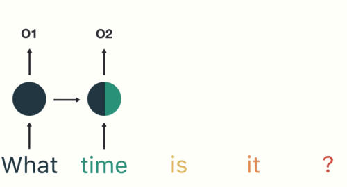
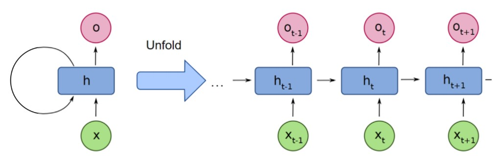
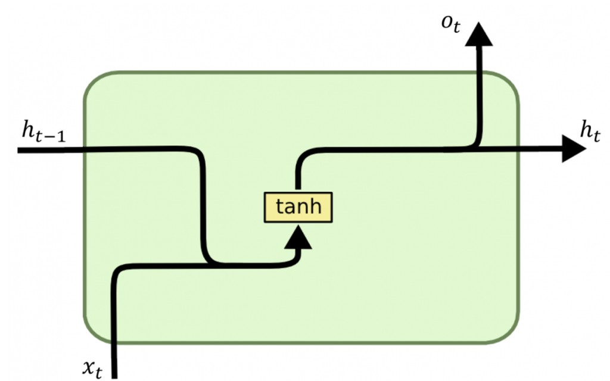
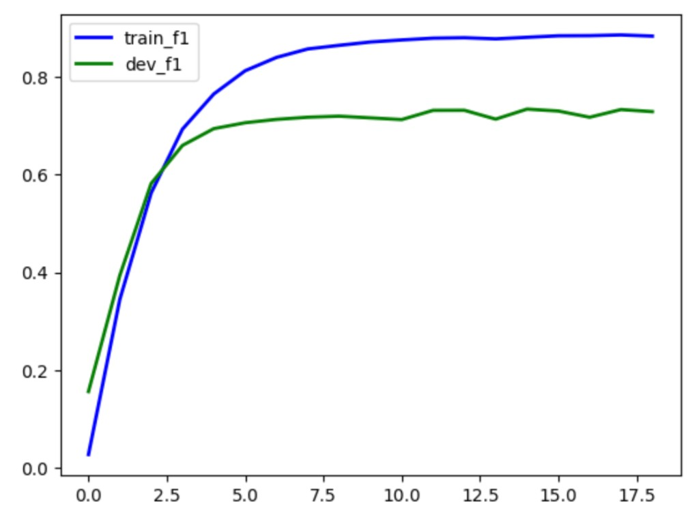

# КОНСПЕКТ ЛЕКЦІЇ: RNN, LSTM, GRU — Рекурентні нейронні мережі

> **Де виконувати:** Kaggle Notebook. Інструкція — у Частині 7.
> **GPU:** рекомендується T4 (вмикається у Kaggle: Settings → Accelerator → GPU T4 x1).
> **PyTorch 2.6+:** `torch.load(path)` вимагає `weights_only=False` для збереженої моделі цілком — завжди передавай явно.

---

## ЧАСТИНА 0. КОРОТКИЙ ОГЛЯД ТЕМИ

### Що ми будемо робити?

У цій темі ми:

- зрозуміємо, чому текст, аудіо й часові ряди — це **послідовності** і чому звичайна нейромережа погано з ними справляється
- вивчимо архітектуру **RNN** (Recurrent Neural Network) та її «робочу пам'ять» через прихований стан hₜ
- розберемо **типи архітектур** RNN: One-to-One, One-to-Many, Many-to-One, Many-to-Many
- дізнаємося про проблему **згасаючого градієнта** та чому tanh підсилює її для довгих послідовностей
- вивчимо архітектуру **LSTM** з комірками стану і трьома воротами (forget / input / output)
- ознайомимось з **GRU** — спрощеним варіантом LSTM із двома воротами (reset / update)
- побудуємо **Bi-LSTM** (двонаправлена LSTM) для задачі NER з датасетом CoNLL2003
- навчимо модель із **early stopping**, схемою тегування **BIO** і padding-маскуванням міток
- оцінимо якість через **macro F1** і `classification_report` по кожному класу сутностей
- зберемо все разом у **ЧАСТИНІ 14**: увесь конвеєр від тексту до оновлення ваг, простими словами

### Розшифровка нових скорочень

| Символ / Скорочення | Повна назва | Простими словами | Навіщо |
| ------------------- | ----------- | ---------------- | ------ |
| `RNN` | Recurrent Neural Network | Рекурентна нейромережа | Обробляє послідовні дані через прихований стан |
| `BPTT` | Backpropagation Through Time | Зворотне поширення крізь час | Алгоритм навчання RNN |
| `LSTM` | Long Short-Term Memory | Довга короткочасна пам'ять | RNN з воротами для довгої пам'яті |
| `GRU` | Gated Recurrent Unit | Вентильований рекурентний блок | Спрощений LSTM: 2 ворота замість 3 |
| `Bi-LSTM` | Bidirectional LSTM | Двонаправлена LSTM | Читає послідовність зліва направо і навпаки |
| `NER` | Named Entity Recognition | Розпізнавання іменованих сутностей | Знаходить імена, організації, місця в тексті |
| `NE` | Named Entity | Іменована сутність | Конкретний об'єкт у тексті (особа, місце тощо) |
| `BIO` | Begin / Inside / Outside | Схема тегування сутностей | B=початок, I=всередині, O=поза сутністю |
| `cell state` (Cₜ) | Cell State | Стан комірки | Довгострокова пам'ять у LSTM |
| `hidden state` (hₜ) | Hidden State | Прихований стан | Короткострокова пам'ять; подається до виходу |
| `forget gate` (fₜ) | Forget Gate | Ворота забуття | Вирішує, яку частину Cₜ₋₁ видалити |
| `input gate` (iₜ) | Input Gate | Вхідні ворота | Вирішує, яку нову інформацію додати |
| `output gate` (oₜ) | Output Gate | Вихідні ворота | Вирішує, що показати як hₜ |
| `reset gate` (rₜ) | Reset Gate | Ворота скидання (GRU) | Вирішує, скільки з hₜ₋₁ врахувати |
| `update gate` (zₜ) | Update Gate | Ворота оновлення (GRU) | Вирішує, скільки нового додати |
| `<UNK>` | Unknown token | Токен для невідомих слів | Замінює OOV-слова |
| `<PAD>` | Padding token | Токен-заповнювач | Вирівнює всі речення до однієї довжини |
| `collate_fn` | Collate Function | Функція збирання батчу | Додає padding і конвертує в тензори |
| `macro F1` | Macro-averaged F1 | Макро-усереднений F1 | Незважене середнє F1 по всіх класах |
| `micro F1` | Micro-averaged F1 | Мікро-усереднений F1 | Глобальний F1 = accuracy при одному label |
| `weighted F1` | Weighted-averaged F1 | Зважений F1 | Середнє F1 зважене на support кожного класу |
| `early stopping` | Early Stopping | Рання зупинка | Зупиняє тренування при стагнації val-метрики |
| `CoNLL2003` | Conference on NLL 2003 | Датасет CoNLL-2003 | Еталонний датасет NER |
| `ignore_index` | — | Ігнорований індекс у loss | CrossEntropyLoss пропускає мітки = −100 |

---

## ЧАСТИНА 1. ТЕКСТ ЯК ПОСЛІДОВНІСТЬ



**Ідея:** текстові дані мають порядок — слова не можна переставити довільно. Нейромережа, що обробляє вектори незалежно одне від одного, втрачає цю структуру.

### Рівні послідовностей у тексті

Текст можна розглядати як послідовність на різних рівнях:

| Рівень | Елементи | Приклад |
| ------ | -------- | ------- |
| Символьний | Символи → слово | `['П','р','и','в','і','т']` |
| Словесний | Слова → речення | `['Привіт', ',', 'світе', '!']` |
| Речення | Речення → текст | `['Привіт, світе!', 'Як справи?']` |

### Інші типи послідовностей

- **Часові ряди** — щоденні температури, ціни акцій: кожне значення залежить від попередніх
- **Аудіосигнал** — послідовність амплітуд звукової хвилі; порядок семплів визначає звук
- **Відео** — послідовність кадрів: для розуміння сцени важливий часовий порядок

> 💡 Головна характеристика послідовності — **залежність між елементами**, яка визначається їхнім порядком. Саме для таких даних і розроблені RNN.

---

## ЧАСТИНА 2. АРХІТЕКТУРА RNN



**Ідея:** RNN — це звичайна нейромережа, яка **повторюється** на кожному елементі послідовності і передає свій «стан» (робочу пам'ять) на наступний крок.

> 💡 RNN можна розглядати як **багато копій** простої нейромережі, з'єднаних у ланцюжок. Кожна копія використовує **однакові ваги**.

### ASCII-схема розгортання RNN у часі

```
   x₀        x₁        x₂        x₃
    │         │         │         │
    ▼         ▼         ▼         ▼
  [RNN] ──▶ [RNN] ──▶ [RNN] ──▶ [RNN]
  h₀  ─┘   h₁  ─┘   h₂  ─┘   h₃
    │         │         │         │
    ▼         ▼         ▼         ▼
   o₀        o₁        o₂        o₃

  ← Один і той самий набір ваг на кожному кроці →
```

### Прихований вузол RNN



На кожному кроці hₜ обчислюється з поточного входу xₜ і попереднього прихованого стану hₜ₋₁:

$$h_t = \tanh(W_{hx} \cdot x_t + W_{hh} \cdot h_{t-1} + b_h)$$

| Символ | Що означає | Розмір |
| ------ | ---------- | ------ |
| hₜ | Прихований стан на кроці t | (hidden\_dim,) |
| xₜ | Вхідний вектор на кроці t (ембединг слова) | (embedding\_dim,) |
| hₜ₋₁ | Прихований стан попереднього кроку | (hidden\_dim,) |
| W_hx | Матриця ваг для входу | (hidden\_dim × embedding\_dim) |
| W_hh | Матриця ваг для попереднього стану | (hidden\_dim × hidden\_dim) |
| bₕ | Вектор зсуву | (hidden\_dim,) |
| tanh | Гіперболічний тангенс | виводить значення в (−1, 1) |

**Вихідний вектор** oₜ (якщо потрібен):

$$o_t = W_{ho} \cdot h_t + b_o$$

### 6-кроковий ітеративний цикл RNN

1. Отримує елемент послідовності — слово xₜ
2. Обчислює прихований стан hₜ з xₜ і попереднього hₜ₋₁
3. Передбачає вихід oₜ (якщо задача потребує виходу на кожному кроці)
4. Передає hₜ наступному кроку як «робочу пам'ять»
5. Переходить до наступного слова xₜ₊₁
6. Повторює до кінця послідовності

---

## ЧАСТИНА 2б. RNN ПРОСТИМИ СЛОВАМИ — ВІД СЛОВА ДО ПАМ'ЯТІ

> 💡 Формули вище виглядають «підручниково», а сам принцип значно простіший. Ця частина — те саме, але «на пальцях», з числовими прикладами.

### Що взагалі робить RNN

Уяви речення:

> **Я дуже люблю читати книжки**

RNN читає його **слово за словом**. На кожному кроці вона має поточне слово xₜ і пам'ять про те, що було раніше hₜ₋₁ — і на їх основі створює нову пам'ять hₜ.

```
"Я"
↓
пам'ять: [Я]

"дуже"
↓
пам'ять: [Я дуже]

"люблю"
↓
пам'ять: [Я дуже люблю]

"читати"
↓
пам'ять: [Я дуже люблю читати]
```

> ⚠️ Модель не зберігає слова буквально. Вона зберігає **числовий вектор**, який представляє контекст.

### Що означає індекс t

t означає **time step — крок у послідовності**. Не обов'язково фізичний час — це просто номер елемента.

Наприклад, для речення `I love neural networks`:

| Крок t | Елемент xₜ |
| ------ | ---------- |
| 1 | x₁ = I |
| 2 | x₂ = love |
| 3 | x₃ = neural |
| 4 | x₄ = networks |

А позначення станів:

| Символ | Що означає |
| ------ | ---------- |
| hₜ₋₁ | Пам'ять із **попереднього** кроку |
| hₜ | Пам'ять **зараз** |
| hₜ₊₁ | Пам'ять **на наступному** кроці |

Тобто на схемі розгортання це виглядає так:

```
             попереднє       зараз        наступне
Input:        x(t-1)         x(t)          x(t+1)
Memory:       h(t-1)   →     h(t)    →     h(t+1)
Output:       o(t-1)         o(t)          o(t+1)
```

### Що таке h (hidden state)

h — **hidden state**, прихований стан. Можна буквально думати про нього як про:

> 🧠 «Що RNN зараз пам'ятає про все, що вона вже прочитала».

Наприклад, для тексту `The cat sat on the ...` до моменту, коли RNN дійшла до `the`, її hₜ уже містить інформацію про `cat`, `sat`, `on` і структуру речення. Завдяки цьому вона може припустити, що далі буде щось на кшталт `mat`.

### Формула словами

$$h_t = \tanh(W_{hx} x_t + W_{hh} h_{t-1} + b_h)$$

Ця формула буквально каже:

> **нова пам'ять = функція від поточного входу + старої пам'яті**

| Частина формули | Що вона вносить |
| --------------- | --------------- |
| W_hx · xₜ | Інформація від **поточного слова** |
| W_hh · hₜ₋₁ | Інформація від **попередньої пам'яті** |
| bₕ | Зсув (bias) |
| tanh(…) | Перетворює отриману суму, стискаючи її до (−1, 1) |

### Числовий приклад «на пальцях»

Замість матриць візьмемо звичайні числа:

| Величина | Значення | Що означає |
| -------- | -------- | ---------- |
| xₜ | 2 | Поточний вхід |
| hₜ₋₁ | 0.5 | Попередня пам'ять |
| W_hx | 0.4 | Вага поточного входу |
| W_hh | 0.6 | Вага пам'яті |
| bₕ | 0.1 | Зсув |

Підставляємо:

$$h_t = \tanh(0.4 \times 2 + 0.6 \times 0.5 + 0.1)$$

Рахуємо покроково:

```
0.4 × 2   = 0.8      ← внесок нового слова
0.6 × 0.5 = 0.3      ← внесок старої пам'яті
+ bias      0.1
─────────────────
сума      = 1.2
```

$$h_t = \tanh(1.2) \approx 0.834$$

Отже новий hidden state hₜ ≈ 0.834 — і саме він піде в наступний RNN-крок.

### Що таке функція (і функція активації)

**Функція** — це правило, яке каже: що зробити з вхідним значенням, щоб отримати вихідне.

$$f(x) = 2x + 1$$

Це означає: візьми x → помнож на 2 → додай 1. Якщо x = 3, то f(3) = 2 × 3 + 1 = 7.

Можна уявити функцію як машинку:

```
        функція
x  →  [ 2x + 1 ]  →  результат

3  →  [ 2×3 + 1 ] →  7
5  →  [ 2×5 + 1 ] →  11
```

У нейронних мережах таких «машинок» дуже багато. `tanh` — теж функція: подали x = 1, отримали tanh(1) ≈ 0.76.

> 💡 **Функція активації** — це просто функція зі спеціальним призначенням: вона бере число, яке порахував нейрон, і певним чином його перетворює.

Запис y = f(x) читається як: **y є результатом застосування функції f до x**. А «функція всередині функції» виглядає так:

$$y = f(g(x))$$

```
x → функція g → результат → функція f → y
```

### tanh — гіперболічний тангенс

`tanh` читається як «танч / tan-h» і означає **hyperbolic tangent — гіперболічний тангенс**. Вона бере будь-яке число (−100, −5, −1, 0, 1, 5, 100) і стискає його в діапазон (−1, 1):

| x | tanh(x) |
| ---: | ---: |
| −3 | −0.995 |
| −1 | −0.762 |
| 0 | 0 |
| 1 | 0.762 |
| 2 | 0.964 |
| 3 | 0.995 |

Графік приблизно такий:

```
 1 |                ________
   |             __/
   |           /
 0 |----------/----------
   |        /
   |     __/
-1 |____/
```

### Чому RNN взагалі потрібен tanh

Без функції активації ми б просто складали лінійні перетворення W·x + b. А багато лінійних операцій поспіль усе одно залишаються фактично **одним великим лінійним перетворенням**.

`tanh` додає **нелінійність** — і саме завдяки їй мережа може вчитися складнішим залежностям.

### Звідки взявся гіперболічний тангенс

Це звичайна математична функція, яка існувала задовго до нейронних мереж:

$$\tanh(x) = \frac{e^x - e^{-x}}{e^x + e^{-x}}$$

Але для ML цю формулу майже ніколи не потрібно рахувати вручну. Важливіше пам'ятати: tanh(x) ∈ (−1, 1) і що вона має S-подібну форму.

### tanh працює поелементно

`tanh` нічого не ставить навмання — вона детерміновано обчислює значення за формулою. Якщо на вході одне число 0.78, то tanh(0.78) ≈ 0.65. Якщо на вході вектор, то tanh застосовується **до кожного числа окремо**:

```
вхід:   [ 2,      -0.5,     1.3  ]
           ↓         ↓        ↓
tanh:   [ 0.96,   -0.46,    0.86 ]
```

> 💡 **tanh працює поелементно** і кожне число перетворює в діапазон (−1, 1). Вона не «вибирає» значення, а обчислює його за математичною формулою.

### Ваги — це «наскільки довіряти» (аналогія з парфумами)

**Ідея:** ваги — це не «вага» у фізичному сенсі, а **коефіцієнти важливості**.

Уяви, що ти створюєш аромат на основі двох речей:

| Символ | Роль в аналогії |
| ------ | --------------- |
| xₜ | **Нова нота**, яку додаєш зараз (наприклад, ваніль) |
| hₜ₋₁ | **Ароматична база**, яка вже є з попередніх нот |
| W_hx | Наскільки сильно нова нота має впливати |
| W_hh | Наскільки сильно треба зберегти попередню композицію |
| bₕ | Базове зміщення — умовно «фірмовий характер» суміші |
| tanh | Фінальний нормалізатор, який не дає результату вилетіти за межі |

Нехай нова нота досить сильна (xₜ = 0.8), попередня композиція помірна (hₜ₋₁ = 0.4), нову ноту враховуємо сильно (W_hx = 0.7), а стару композицію слабше (W_hh = 0.3), зсув bₕ = 0.1:

```
0.7 × 0.8 = 0.56     ← внесок нової ноти
0.3 × 0.4 = 0.12     ← внесок старої композиції
+ bias      0.10
─────────────────
сума      = 0.78
```

$$h_t = \tanh(0.78) \approx 0.65$$

Сенс ваг саме в тому, що модель вчиться: **наскільки довіряти новій інформації і наскільки зберігати стару**.

> 💡 Найкоротше:
> **ваги = наскільки сильно врахувати кожне джерело інформації**
> **tanh = стиснути кожен отриманий результат до (−1, 1)**

---

## ЧАСТИНА 3. ТИПИ АРХІТЕКТУР RNN

### One-to-One

**Приклад:** класифікація одного слова за частиною мови.

**Опис:** один вхідний елемент → один вихідний елемент. Це звичайна нейромережа; рекурентний характер тут не задіяний.

```
x → [RNN] → o
```

### One-to-Many

**Приклад:** генерація опису зображення (image captioning) або генерація музики з однієї ноти.

**Опис:** один вхід → послідовність виходів. Кожен згенерований вихід подається як вхід до наступного кроку.

```
x → [RNN] → o₁ → [RNN] → o₂ → [RNN] → o₃ → ...
```

### Many-to-One

**Приклад:** аналіз тональності (sentiment analysis) — ціле речення → позитивний/негативний.

**Опис:** послідовність входів → один вихід. Проміжні oₜ не використовуються — лише фінальний hₙ.

```
x₁ → [RNN] → x₂ → [RNN] → x₃ → [RNN] → ... → o
```

### Many-to-Many

**Приклад:** машинний переклад, NER — кожне слово на вході → відповідний тег на виході.

**Опис:** послідовність входів → послідовність виходів (однакової або різної довжини).

```
x₁ → [RNN] → o₁
x₂ → [RNN] → o₂
x₃ → [RNN] → o₃
```

> 💡 Наша задача NER — **Many-to-Many**: для кожного слова речення модель передбачає тег (B-PER, I-ORG, O тощо).

### Зведена порівняльна таблиця

| Архітектура | Вхід | Вихід | Приклад |
| ----------- | ---- | ------ | ------- |
| One-to-One | 1 елемент | 1 елемент | POS-tagging одного слова |
| One-to-Many | 1 елемент | Послідовність | Image captioning |
| Many-to-One | Послідовність | 1 елемент | Sentiment analysis |
| Many-to-Many | Послідовність | Послідовність | NER, Machine Translation |

---

## ЧАСТИНА 4. ОБМЕЖЕННЯ RNN: ПРОБЛЕМА ЗГАСАЮЧОГО ГРАДІЄНТА

**Ідея:** при навчанні RNN на довгих послідовностях градієнт, що поширюється назад у часі, множиться на одне й те саме число на кожному кроці — і якщо це число < 1, градієнт **зникає**.

### Що таке градієнт простими словами

**Градієнт показує, наскільки треба змінити вагу**, щоб зменшити loss.

```
великий gradient
→ вагу можна помітно змінити
→ нейрон добре навчається

дуже малий gradient
→ вага майже не змінюється
→ навчання майже зупиняється
```

### Ланцюгове правило (chain rule) — на простому прикладі

**Ідея:** це правило використовується, коли одна функція знаходиться **всередині іншої**.

Наприклад:

$$y = (2x + 1)^2$$

Тут можна уявити дві функції: спочатку z = 2x + 1, а потім y = z². Щоб знайти ∂y/∂x, використовуємо:

$$\frac{\partial y}{\partial x} = \frac{\partial y}{\partial z} \times \frac{\partial z}{\partial x}$$

Це і є **chain rule — ланцюгове правило**.

**Конкретний розрахунок:**

| Крок | Похідна |
| ---- | ------- |
| y = z² | ∂y/∂z = 2z |
| z = 2x + 1 | ∂z/∂x = 2 |
| Перемножуємо | ∂y/∂x = 2z × 2 = 4z |
| Підставляємо z | ∂y/∂x = 4(2x + 1) |

### Chain rule у нейронній мережі

Нейронна мережа — це багато функцій одна за одною:

```
x → layer 1 → layer 2 → layer 3 → prediction → loss
```

Коли робимо backpropagation, йдемо назад:

```
loss ← layer 3 ← layer 2 ← layer 1
```

І градієнти **множаться**. Умовно:

$$gradient = 0.5 \times 0.5 \times 0.5 \times 0.5$$

І тут починається проблема.

### Ланцюгове правило і BPTT

Під час навчання RNN ми розгортаємо мережу в часі (BPTT — Backpropagation Through Time) і застосовуємо ланцюгове правило:

$$\frac{\partial L}{\partial W} = \sum_{t=1}^{T} \frac{\partial L_t}{\partial W} = \sum_{t=1}^{T} \frac{\partial L_t}{\partial h_t} \cdot \prod_{k=2}^{t} \frac{\partial h_k}{\partial h_{k-1}}$$

Кожен множник ∂hₖ/∂hₖ₋₁ містить похідну tanh. Похідна tanh(x):

$$\frac{d}{dx}\tanh(x) = 1 - \tanh^2(x) \leq 1$$

### Числовий приклад

Якщо кожен крок множить градієнт на 0.5:

| Кроків T | Добуток градієнтів |
| --------- | ------------------ |
| 5 | 0.5⁵ = 0.031 |
| 10 | 0.5¹⁰ ≈ 0.001 |
| 20 | 0.5²⁰ ≈ 10⁻⁶ |
| 50 | 0.5⁵⁰ ≈ 10⁻¹⁵ |

> ⚠️ При T = 20 кроків градієнт зменшується у **мільйон** разів — перші кроки практично не навчаються.

### Як згасає градієнт — покроково

Припустимо, що на кожному кроці градієнт множиться на 0.5:

```
крок 1:   1.0
крок 2:   0.5
крок 3:   0.25
крок 4:   0.125
крок 5:   0.0625
крок 6:   0.03125
крок 7:   0.015625
крок 8:   0.0078125
```

Через 10 кроків: 0.5¹⁰ ≈ 0.00098. Через 20 кроків: 0.5²⁰ ≈ 0.00000095 — практично нічого.

**Візуально:**

```
gradient

1.0 |████████████████████
0.5 |██████████
0.25|█████
0.12|██
0.06|█
0.03|▌
0.01|▏
0.00| .
     --------------------
      1  2  3  4  5  6...
```

Оце і є **vanishing gradient** — градієнт «зникає», бо багато малих чисел множаться між собою.

### Чому tanh підсилює проблему

1. **Ланцюгове правило** — кожен часовий крок додає множник до добутку градієнтів
2. **Функція активації tanh** — її похідна ≤ 1, найчастіше значно менше 1 в насиченій зоні
3. **Довжина послідовності** — кожен додатковий крок ще раз множить і зменшує градієнт

**Числовий приклад.** Похідна tanh:

$$\tanh'(x) = 1 - \tanh^2(x)$$

Вона максимум дорівнює 1, але дуже часто значно менша. Наприклад, якщо tanh(x) = 0.9:

$$\tanh'(x) = 1 - 0.9^2 = 1 - 0.81 = 0.19$$

Тобто під час backpropagation градієнт може множитися на 0.19. Якщо так 5 разів:

$$0.19^5 \approx 0.00025$$

Градієнт став майже нульовим.

### Як RNN «забуває» початок речення

Уявімо речення:

> **The cat that I saw yesterday while walking through the beautiful old city was hungry.**

Коли модель доходить до `hungry`, їй може бути важливо пам'ятати `cat`. Але між ними багато кроків, і під час навчання сигнал помилки повинен пройти:

```
hungry → was → city → old → beautiful → ... → cat
        (градієнт зменшується на кожному кроці)
```

Якщо градієнт кожного разу зменшується, то до слова `cat` доходить щось на кшталт 0.000001. Модель майже не може оновити ваги, які відповідали за ранню інформацію.

> ⚠️ Саме тому кажуть: стандартна RNN погано навчає **long-term dependencies** (довгострокові залежності).

### Важливе уточнення: hidden state ≠ gradient

Це дві пов'язані, але **різні** речі:

| | Hidden state (hₜ) | Gradient |
| --- | ----------------- | -------- |
| Що це | Інформація про контекст | Інформація про помилку |
| Куди рухається | **Вперед** під час обробки послідовності | **Назад** під час навчання |
| Схема | h₁ → h₂ → h₃ → h₄ | h₁ ← h₂ ← h₃ ← h₄ ← loss |

> 💡 Vanishing gradient безпосередньо стосується **навчання назад**. А наслідком стає те, що RNN погано вчиться зберігати інформацію протягом великої кількості кроків.

### Уся RNN одним малюнком

```
              FORWARD PASS

слово₁ → [RNN] → h₁
                ↓
слово₂ → [RNN] → h₂
                ↓
слово₃ → [RNN] → h₃
                ↓
слово₄ → [RNN] → h₄ → prediction
                         ↓
                        loss


              BACKPROPAGATION

слово₁ ← [RNN] ← [RNN] ← [RNN] ← loss
             gradient стає
             все меншим
             ← ← ←
```

### Найкоротше, що варто запам'ятати

$$\text{нова пам'ять} = f(\text{новий input},\ \text{стара пам'ять})$$

| Символ / поняття | Що означає |
| ---------------- | ---------- |
| t | Номер кроку в послідовності |
| xₜ | Поточний input |
| hₜ₋₁ | Попередня пам'ять |
| hₜ | Нова пам'ять |
| oₜ | Output |
| tanh | Функція активації, що стискає до (−1, 1) |
| backpropagation | Використовує chain rule |
| Довгий ланцюжок | Багато малих похідних множаться → gradient ≈ 0 |
| Наслідок | Ранні частини послідовності погано навчаються |

> 💡 І саме для розв'язання цієї проблеми далі з'являються **LSTM і GRU** — вони додають спеціальні механізми, які дозволяють краще контролювати, **що пам'ятати, а що забувати**.

### Три наслідки

- **Сповільнення навчання** — перші шари (ранні кроки) майже не оновлюються
- **Нестабільність** — модель може не сходитися або застрягати в локальних мінімумах
- **Втрата контексту** — RNN «забуває» початок речення до кінця (актуально для довгих текстів)

### Exploding gradient і gradient clipping

Зворотна ситуація — **вибухаючий градієнт** (якщо множник > 1). Рішення — **gradient clipping**: якщо норма градієнта перевищує поріг, ми масштабуємо його вниз.

```python
# Gradient clipping у PyTorch
torch.nn.utils.clip_grad_norm_(model.parameters(), max_norm=1.0)
```

> 💡 Vanishing gradient — **системна** проблема RNN. Для її подолання розроблені LSTM і GRU.

---

## ЧАСТИНА 5. LSTM — LONG SHORT-TERM MEMORY

**Ідея:** LSTM вирішує проблему згасаючого градієнта, додаючи **другий канал пам'яті** (cell state Cₜ), який не проходить через tanh і зберігає інформацію без множення. Управління пам'яттю відбувається через три **ворота**.

### ASCII-схема LSTM-комірки

```
         ┌─────────────────────────────────────────────┐
         │                LSTM Cell                    │
         │                                             │
Cₜ₋₁ ───┼────[×fₜ]────[+]────────────────────── Cₜ ──┼───▶
         │             │                         │    │
         │         [×iₜ·C̃ₜ]                   tanh   │
         │                                      │    │
hₜ₋₁ ──▶│──[forget]──[input]──[C̃ₜ]──[output]──[×oₜ]─┼───▶ hₜ
 xₜ  ──▶│                                             │
         └─────────────────────────────────────────────┘
```

Розгорнута схема (всі 4 операції):

```
Входи: [hₜ₋₁, xₜ]

  fₜ = σ( Wf · [hₜ₋₁, xₜ] + bf )          ← ворота забуття
  iₜ = σ( Wi · [hₜ₋₁, xₜ] + bi )          ← вхідні ворота
  C̃ₜ = tanh( Wc · [hₜ₋₁, xₜ] + bc )      ← кандидат нової пам'яті
  Cₜ = fₜ · Cₜ₋₁ + iₜ · C̃ₜ               ← оновлення cell state
  oₜ = σ( Wo · [hₜ₋₁, xₜ] + bo )          ← вихідні ворота
  hₜ = oₜ · tanh(Cₜ)                       ← новий прихований стан
```

### Крок 1 — Ворота забуття (Forget Gate)

Вирішують, яку частину старої пам'яті Cₜ₋₁ видалити:

$$f_t = \sigma(W_f \cdot [h_{t-1}, x_t] + b_f)$$

| Символ | Що означає |
| ------ | ---------- |
| σ | Сигмоїдальна функція → виводить (0, 1): 0=забути, 1=зберегти |
| Wf | Матриця ваг воріт забуття |
| [hₜ₋₁, xₜ] | Конкатенація попереднього стану і поточного входу |
| bf | Зсув воріт забуття |

### Крок 2 — Вхідні ворота (Input Gate) і кандидат

Вирішують, яку нову інформацію додати до Cₜ:

$$i_t = \sigma(W_i \cdot [h_{t-1}, x_t] + b_i)$$

$$\tilde{C}_t = \tanh(W_C \cdot [h_{t-1}, x_t] + b_C)$$

| Символ | Що означає |
| ------ | ---------- |
| iₜ | Наскільки «пропустити» нову інформацію (0–1) |
| C̃ₜ | Кандидат на нову пам'ять (через tanh → (-1, 1)) |
| W_C, b_C | Ваги і зсув для кандидата |

### Крок 3 — Оновлення cell state

$$C_t = f_t \cdot C_{t-1} + i_t \cdot \tilde{C}_t$$

> 💡 **Чому це рятує від vanishing gradient?** Операція **адитивна** (додавання), а не мультиплікативна. Градієнт може текти назад через Cₜ без згасання: ∂Cₜ/∂Cₜ₋₁ = fₜ (не множиться на похідну tanh кожен крок).

### Крок 4 — Вихідні ворота (Output Gate)

$$o_t = \sigma(W_o \cdot [h_{t-1}, x_t] + b_o)$$

$$h_t = o_t \cdot \tanh(C_t)$$

| Символ | Що означає |
| ------ | ---------- |
| oₜ | Фільтр: що показати з cell state у вигляді hₜ |
| hₜ | Короткочасна пам'ять + вихід поточного кроку |

### Cell State vs Hidden State

| Характеристика | Cell State (Cₜ) | Hidden State (hₜ) |
| -------------- | --------------- | ------------------ |
| Призначення | Довгострокова пам'ять | Короткострокова; подається до виходу |
| Оновлення | Через fₜ (забуття) і iₜ (вхід) | Через oₜ (вихідні ворота) × tanh(Cₜ) |
| Чи проходить через tanh | Ні (лише при читанні через hₜ) | Так |
| Роль у градієнті | «Шосе» без згасання | Може згасати при довгих послідовностях |

---

## ЧАСТИНА 5б. LSTM ПРОСТИМИ СЛОВАМИ — АНАЛОГІЯ З ЛЮДСЬКОЮ ПАМ'ЯТТЮ

> 💡 LSTM не просто відбирає «найкращих кандидатів до фіналу». Вона **постійно редагує свою пам'ять**: це залишити, це послабити, це додати, а ось це зараз використати.

### Чим LSTM відрізняється від звичайної RNN

У звичайної RNN була фактично **одна** пам'ять hₜ, яка на кожному кроці перераховувалася:

$$\text{новий } h = f(\text{старий } h,\ \text{новий input})$$

Через багато таких перерахунків інформацію з далекого минулого важко зберігати.

LSTM каже: **а зробімо окремий канал для довготривалої пам'яті.** Тому тепер маємо два стани:

| Стан | Формальна назва | Як краще думати |
| ---- | --------------- | --------------- |
| Cₜ | cell state | **Довготривала пам'ять** |
| hₜ | hidden state | **Робоча пам'ять / актуальний контекст** |

> ⚠️ Назва **hidden state** не дуже інтуїтивна. Не варто перекладати її в голові як «заховані знання» — краще думати «те, що актуально прямо зараз».

### Аналогія з мозком

Уявімо, що ти роками накопичуєш знання. У твоїй умовній довготривалій пам'яті є:

```
Варшава — столиця Польщі.
Париж — столиця Франції.
Земля обертається навколо Сонця.
У мене сьогодні заняття.
Колись мені сказали, що X працює ось так.
...
```

Це наша аналогія для Cₜ₋₁. І надходить нова інформація xₜ, наприклад:

> «Те, що ти раніше вивчила про X, було спрощенням. Насправді X працює ось так».

LSTM повинна вирішити кілька **окремих** питань.

### 🚪 Forget gate: що зі старого залишити?

> Старе твердження про X неправильне → послаблюємо/видаляємо.
> Париж — столиця Франції → це не стосується нової інформації → залишаємо.

Це fₜ. Сигмоїда дає значення між 0 і 1:

```
старе неправильне знання → 0.05 → майже забути
інше корисне знання      → 0.98 → майже повністю залишити
```

### 🚪 Input gate: що з нового запам'ятати?

Ти почула купу нового, і не все однаково важливе:

```
нова правильна інформація → 0.95
важлива формула           → 0.90
випадкова деталь          → 0.03
```

Це iₜ.

### А хто такий «кандидат»?

Ось тут слово справді збиває з пантелику.

**Кандидат C̃ₜ — це нова інформація, яку LSTM потенційно може записати в cell state.** Це ще не нова пам'ять Cₜ. Це просто:

> **«Ось що я пропоную додати до пам'яті».**

А input gate iₜ вирішує, **скільки з цього кандидата реально записати**. Наприклад, кандидат «Нове правило: X = Y» має C̃ₜ = 0.8:

| Рішення input gate | Розрахунок | Реально додано |
| ------------------ | ---------- | -------------- |
| iₜ = 0.9 (пропустити) | 0.9 × 0.8 | 0.72 |
| iₜ = 0.1 (притримати) | 0.1 × 0.8 | 0.08 |

> 💡 Ось тут конкурсна аналогія якраз працює: **кандидат прийшов на кастинг → input gate вирішує, наскільки його пропустити далі.**

### Найважливіша формула LSTM

Оце фактично серце всієї конструкції:

$$C_t = f_t C_{t-1} + i_t \tilde{C}_t$$

Словами:

$$\text{нова пам'ять} = \text{те зі старого, що вирішили залишити} + \text{те з нового, що вирішили додати}$$

**Числовий приклад:**

| Величина | Значення | Що означає |
| -------- | -------- | ---------- |
| Cₜ₋₁ | 0.8 | Стара інформація |
| fₜ | 0.2 | Forget gate: залишити лише 20% |
| C̃ₜ | 0.9 | Новий кандидат |
| iₜ | 0.9 | Input gate: взяти 90% |

```
fₜ × Cₜ₋₁ = 0.2 × 0.8 = 0.16    ← що залишилось зі старого
iₜ × C̃ₜ  = 0.9 × 0.9 = 0.81    ← що додали з нового
──────────────────────────────
Cₜ                     = 0.97
```

Тобто стару інформацію майже викинули і значною мірою замінили новою. Приклад **«я думала, що це працює так, а тепер дізналася, що насправді ось так»** дуже добре передає цей принцип.

### А output gate навіщо?

Тепер у «мозку» є купа знань. Але тобі **не потрібні всі вони прямо зараз**. Наприклад, питання:

> Яка столиця Франції?

У пам'яті одночасно є інформація про роботу, їжу, танці, математику, Париж тощо. А назовні зараз треба витягнути лише релевантне: **Париж**.

Оце хороша аналогія для **output gate** oₜ. Вона визначає:

> **Яку частину актуального стану пам'яті зараз використати для hidden state?**

$$h_t = o_t \times \tanh(C_t)$$

Тобто Cₜ — ширша пам'ять, а hₜ — те, що зараз актуальне для подальшої обробки/виходу.

### Уся LSTM одним малюнком

Приходить нова інформація xₜ. Модель дивиться на неї + на попередній актуальний контекст hₜ₋₁ і вирішує:

```
             НОВА ІНФОРМАЦІЯ
                    ↓
           ┌────────────────┐
           │     LSTM       │
           │                │
СТАРА ───→ │ Forget gate    │ → що зі старого забути?
ПАМ'ЯТЬ    │                │
           │ Input gate     │ → що з нового записати?
           │      +         │
           │ Candidate      │ → що саме пропонуємо записати?
           │                │
           │ Output gate    │ → що зараз використати?
           └────────────────┘
                 ↓       ↓
                Cₜ      hₜ
            нова       актуальна
            пам'ять    інформація
```

> 💡 Це значно важливіше для розуміння, ніж зубрити чотири формули.

### Де саме вирішується проблема vanishing gradient

У звичайній RNN стан постійно проходить через складні перетворення з tanh:

$$h_1 \rightarrow h_2 \rightarrow h_3 \rightarrow h_4 \rightarrow \ldots$$

У LSTM є окрема «магістраль» для cell state:

$$C_1 \rightarrow C_2 \rightarrow C_3 \rightarrow C_4 \rightarrow \ldots$$

і оновлення виглядає як Cₜ = fₜ·Cₜ₋₁ + iₜ·C̃ₜ. Тобто інформацію можна **частково провести вперед майже без змін**. Якщо forget gate багато кроків дає fₜ ≈ 1, то важлива інформація зберігається:

```
C₁ ─────────→ C₂ ─────────→ C₃ ─────────→ C₄
      0.99          0.99          0.99
```

І градієнту теж є значно простіший шлях назад.

> ⚠️ LSTM **пом'якшує** проблему vanishing gradient і краще вчить довгі залежності. Це не означає, що згасаючий градієнт математично взагалі неможливий.

### Як насправді рахується gate

Ворота рахуються на основі **поточного входу xₜ** і **попереднього hidden state hₜ₋₁**. Наприклад, input gate:

$$i_t = \sigma(W_i [h_{t-1}, x_t] + b_i)$$

| Символ | Що означає |
| ------ | ---------- |
| xₜ | Що модель бачить зараз |
| hₜ₋₁ | Який контекст уже був |
| Wᵢ | Навчені ваги, які визначають, що важливе |
| bᵢ | Зсув (bias) |
| σ | Сигмоїда, яка стискає результат у діапазон (0, 1) |

**Приклад.** Речення `The cat is not hungry`, поточний вхід xₜ = «not», контекст hₜ₋₁ ≈ «The cat is ...». Через свої ваги модель може отримати велике значення перед сигмоїдою:

$$\sigma(2.2) \approx 0.9$$

Тобто input gate фактично каже: **цю нову інформацію варто майже повністю пропустити в пам'ять.**

А якщо нова інформація мало важлива для контексту, перед сигмоїдою може вийти, наприклад, −2:

$$\sigma(-2) \approx 0.12$$

Тобто: майже не записуй це в пам'ять.

> ⚠️ Дуже важливо: gate не «думає» сам по собі. Він просто використовує **ваги, які були навчені через backpropagation**. Під час тренування модель поступово вчиться: у таких контекстах цю інформацію треба пропускати сильно, а в таких — слабко.

### Як рахується сигмоїда — покроково

**Ідея:** усі ворота LSTM і GRU використовують сигмоїду σ. Розберемо, звідки беруться числа типу 0.88 чи 0.12.

Формула:

$$\sigma(x) = \frac{1}{1 + e^{-x}}$$

#### Спочатку правило від'ємного степеня

Загальне правило:

$$a^{-n} = \frac{1}{a^n}$$

Наприклад, 2⁻³ = 1/2³ = 1/8. Тому для числа e:

$$e^{-x} = \frac{1}{e^x}$$

Оскільки e ≈ 2.718, то e² ≈ 7.39, а отже:

$$e^{-2} \approx \frac{1}{7.39} \approx 0.135$$

#### Приклад 1: додатний вхід, x = 2

$$\sigma(2) = \frac{1}{1 + e^{-2}} = \frac{1}{1 + 0.135} = \frac{1}{1.135} \approx 0.881$$

Уся послідовність кроків:

| Крок | Обчислення |
| ---- | ---------- |
| Вхід | x = 2 |
| Формула | σ(x) = 1 / (1 + e⁻ˣ) |
| Підставляємо | σ(2) = 1 / (1 + e⁻²) |
| Правило степеня | e⁻² = 1 / e² |
| Рахуємо e² | e² ≈ 7.39 |
| Отже | e⁻² ≈ 0.135 |
| Знаменник | 1 + 0.135 = 1.135 |
| Результат | σ(2) ≈ 0.88 |

#### Приклад 2: від'ємний вхід, x = −2

Тут важливо, що мінус на мінус дає плюс: −(−2) = 2. Тому e⁻⁽⁻²⁾ = e²:

$$\sigma(-2) = \frac{1}{1 + e^{2}} = \frac{1}{1 + 7.39} = \frac{1}{8.39} \approx 0.119$$

Отже σ(−2) ≈ 0.12.

#### Приклад 3: нуль, x = 0

Будь-яке ненульове число в степені 0 дорівнює 1, тобто e⁰ = 1:

$$\sigma(0) = \frac{1}{1 + e^{0}} = \frac{1}{1 + 1} = \frac{1}{2} = 0.5$$

#### Що варто запам'ятати

| Вхід x | Результат σ(x) | Що це означає для воріт |
| ------ | -------------- | ----------------------- |
| x ≪ 0 | σ(x) ≈ 0 | Ворота закриті — майже нічого не пропускаємо |
| x = 0 | σ(x) = 0.5 | Рівно половина |
| x ≫ 0 | σ(x) ≈ 1 | Ворота відкриті — пропускаємо майже все |

> 💡 Головне правило для мінусового степеня: **e⁻ˣ = 1 / eˣ**. Саме через нього великий додатний x робить e⁻ˣ крихітним, а знаменник (1 + e⁻ˣ) → 1, тому σ(x) → 1.

---

## ЧАСТИНА 6. GRU — GATED RECURRENT UNIT

**Ідея:** GRU об'єднує ворота забуття і вхідні ворота LSTM в єдиний **update gate** (zₜ) і замінює cell state / hidden state **одним** прихованим вектором hₜ. Простіша структура → менше параметрів → швидше тренування.

### Що таке GRU

**GRU (Gated Recurrent Unit)** — це спрощений варіант LSTM (Long Short-Term Memory), який також розв'язує проблему згасаючого градієнта й ефективно працює з послідовними даними. GRU об'єднує вхідні ворота й ворота забуття в єдиний механізм і має простішу структуру.

Завдяки простішій структурі GRU часто тренується швидше і працює ефективніше, зберігаючи здатність запам'ятовувати довгострокові залежності в послідовних даних.

> 💡 Детальніше з архітектурою GRU можна ознайомитися у статті [GRU Recurrent Neural Networks — A Smart Way to Predict Sequences in Python](https://towardsdatascience.com/gru-recurrent-neural-networks-a-smart-way-to-predict-sequences-in-python-80864e4fe9f6/) (Saul Dobilas).

### GRU простими словами — це «LSTM Lite»

GRU бере ту саму основну ідею:

> треба навчитися контролювати, що пам'ятати, а що оновлювати,

але робить конструкцію простішою. Порівняємо набір механізмів:

| | LSTM | GRU |
| --- | ---- | --- |
| Стани | cell state + hidden state | лише hidden state |
| Ворота | forget gate, input gate, output gate | update gate, reset gate |
| Кандидат | C̃ₜ | h̃ₜ |

У GRU немає окремого cell state у класичному сенсі; основні ворота — **update gate** і **reset gate**. Тому параметрів зазвичай менше, і GRU може навчатися швидше.

> ⚠️ Не можна сказати, що GRU завжди краща за LSTM або навпаки — це залежить від задачі.

### ASCII-схема GRU-комірки

```
Входи: [hₜ₋₁, xₜ]

  rₜ = σ( Wr · [hₜ₋₁, xₜ] + br )          ← ворота скидання (reset)
  zₜ = σ( Wz · [hₜ₋₁, xₜ] + bz )          ← ворота оновлення (update)
  h̃ₜ = tanh( W · [rₜ ⊙ hₜ₋₁, xₜ] + b )  ← кандидат нового стану
  hₜ = (1 − zₜ) ⊙ hₜ₋₁ + zₜ ⊙ h̃ₜ       ← новий прихований стан

  де ⊙ — поелементне множення
```

### 8 кроків роботи GRU (за Saul Dobilas)

**1. Reset gate — крок 1:** об'єднати hₜ₋₁ і xₜ, пропустити через σ → rₜ ∈ (0,1)

**2. Reset gate — крок 2:** rₜ ⊙ hₜ₋₁ — обнулення частини старого стану

**3. Update gate — крок 3:** окрема лінійна комбінація [hₜ₋₁, xₜ] → σ → zₜ ∈ (0,1)

**4. Update gate — крок 4:** (1 − zₜ) — скільки «старого» залишити

**5. Update gate — крок 5:** (1 − zₜ) ⊙ hₜ₋₁ — зважена стара пам'ять

**6. Candidate — крок 6:** [rₜ ⊙ hₜ₋₁, xₜ] → lінійне перетворення → tanh → h̃ₜ

**7. Candidate — крок 7:** zₜ ⊙ h̃ₜ — зважена нова інформація

**8. New hidden state:** hₜ = крок 5 + крок 7 = (1−zₜ)·hₜ₋₁ + zₜ·h̃ₜ

### Формули GRU

$$r_t = \sigma(W_r \cdot [h_{t-1}, x_t] + b_r)$$

$$z_t = \sigma(W_z \cdot [h_{t-1}, x_t] + b_z)$$

$$\tilde{h}_t = \tanh(W \cdot [r_t \odot h_{t-1},\ x_t] + b)$$

$$h_t = (1 - z_t) \odot h_{t-1} + z_t \odot \tilde{h}_t$$

| Символ | Що означає |
| ------ | ---------- |
| rₜ | Reset gate: скільки hₜ₋₁ врахувати при побудові кандидата |
| zₜ | Update gate: скільки нового (h̃ₜ) взяти; (1−zₜ) — скільки старого |
| h̃ₜ | Кандидат нового стану |
| hₜ | Новий прихований стан (єдина пам'ять GRU) |
| ⊙ | Поелементне (Hadamard) множення |

> 💡 Якщо zₜ → 0: hₜ ≈ hₜ₋₁ (нічого не змінилося — «забути нове»). Якщо zₜ → 1: hₜ ≈ h̃ₜ (повністю замінити старе новим).

### Порівняльна таблиця RNN / LSTM / GRU

| | RNN | LSTM | GRU |
| --- | --- | ---- | --- |
| Пам'ять | hₜ (один стан) | hₜ + Cₜ (два стани) | hₜ (один стан) |
| Кількість воріт | 0 | 3 (forget, input, output) | 2 (reset, update) |
| Параметрів (hidden=H, input=I) | (I+H)×H + H | 4×((I+H)×H + H) | 3×((I+H)×H + H) |
| Швидкість тренування | Найшвидше | Найповільніше | Швидко |
| Довготривала пам'ять | Погано | Добре (через Cₜ) | Добре |
| Vanishing gradient | ❌ Проблема | ✅ Вирішено | ✅ Вирішено |
| Коли обирати | Короткі послідовності, швидкий baseline | Довгі послідовності, складні залежності | Альтернатива LSTM, менше даних |

---

## ЧАСТИНА 6б. BI-LSTM — ДВОНАПРАВЛЕНА LSTM


**Ідея:** стандартна LSTM бачить контекст тільки **зліва** (минуле). Для NER важливо також бачити, що йде **після** слова. Bi-LSTM запускає два LSTM: один у прямому напрямку, інший — у зворотному.

### Що таке Bi-LSTM

**Bi-Directional Long Short-Term Memory (Bi-LSTM)** — це розширення стандартної LSTM-архітектури, яке дозволяє моделі враховувати контекст **як з минулого, так і з майбутнього**. Це досягається шляхом використання двох LSTM-шарів, один з яких обробляє послідовність у прямому напрямку (зліва направо), а інший — у зворотному напрямку (справа наліво).

> Джерело схеми: [A Deep Learning Approach for Human Activities Recognition, Nwajana et al., 2020](29862%20NWAJANA_A_Deep_Learning_Approach_for_Human_Activities_Recognition_%28OA%29_2020.pdf)

### Архітектура Bi-LSTM — по шарах

| Шар | Що відбувається |
| --- | --------------- |
| **Вхідний шар** | Вхідні дані подаються **одночасно** на два LSTM-шари: один обробляє дані у прямому напрямку, інший — у зворотному |
| **Прямий LSTM (Forward)** | Обробляє послідовність від початку до кінця (зліва направо) |
| **Зворотний LSTM (Backward)** | Обробляє послідовність від кінця до початку (справа наліво) |
| **Об'єднання виходів** | Виходи обох LSTM-шарів об'єднуються (конкатенуються або складаються) для формування повного контексту для кожного кроку послідовності |
| **Вихідний шар** | Об'єднані виходи передаються до наступних шарів мережі для подальшої обробки чи безпосереднього передбачення |

### Переваги Bi-LSTM

- **Повний контекст.** Bi-LSTM враховує інформацію з обох напрямків, що дозволяє моделі мати повніше уявлення про контекст. Це особливо корисно для задач, де майбутній контекст так само важливий, як і попередній.
- **Покращена точність.** Завдяки доступу до контексту з обох сторін Bi-LSTM-моделі часто демонструють кращу продуктивність порівняно з односпрямованими LSTM — особливо в задачах обробки природної мови, таких як розпізнавання мови, машинний переклад і аналіз тексту.

### А де стартує зворотний LSTM?

Часте питання: «А де старт? Якщо зі старту назад, воно ж нічого не поверне?»

Річ у тім, що **backward LSTM не стартує з початку речення і не намагається йти кудись "перед початок"**. Вона стартує **з іншого кінця послідовності**.

Візьмемо `I love deep learning`:

```
Forward LSTM читає:
  I → love → deep → learning

Backward LSTM отримує ту саму готову послідовність, але обробляє:
  learning → deep → love → I
```

> 💡 Це **два окремі проходи**. Ніякого кола немає.

### Навіщо це потрібно — приклад зі словом «bank»

Візьмемо слово **bank** у двох реченнях:

> I deposited money in the **bank** yesterday.
> He sat on the **bank** of the river.

У другому випадку, коли ми дійшли до `bank`, слово `river` ще **попереду**:

```
Forward LSTM:
  He → sat → on → the → BANK → of → the → river
                           ↑
                    знає тільки минуле

Backward LSTM:
  river → the → of → BANK → the → on → sat → He
                      ↑
               уже бачила "river"
```

Для позиції `bank` потім об'єднуємо інформацію обох напрямків:

$$h_t^{forward} + h_t^{backward}$$

(або, дуже часто, конкатенуємо два вектори). Тепер представлення слова `bank` має інформацію **зліва і справа**.

### Принципове обмеження Bi-LSTM

Bi-LSTM може так зробити лише тоді, коли **вся послідовність уже доступна**. Наприклад, ми дали моделі готове речення `The cat is sleeping on the sofa.` — вона може прочитати його `→ → → → → →` і `← ← ← ← ← ←`.

> ⚠️ А якщо дані надходять у реальному часі і **майбутнього ще фізично немає**, backward LSTM не може його знати. Це не передбачення майбутнього — вона просто читає **вже наявну послідовність** у зворотному напрямку.

Саме так треба читати схему вище: зелені стрілки — один LSTM іде зліва направо, фіолетові — другий іде справа наліво, а для кожної позиції результати двох напрямків об'єднуються у yₜ.

### ASCII-схема Bi-LSTM

```
Пряме направлення (→):
  x₁  → [LSTM→] h₁→  → [LSTM→] h₂→  → [LSTM→] h₃→
  
Зворотне направлення (←):
  x₃  → [LSTM←] h₃←  → [LSTM←] h₂←  → [LSTM←] h₁←

Об'єднання конкатенацією:
  h₁_bi = [h₁→ ; h₁←]   # розмірність 2 × hidden_dim
  h₂_bi = [h₂→ ; h₂←]
  h₃_bi = [h₃→ ; h₃←]
```

### Чому вихід = 2 × hidden\_dim

У PyTorch `nn.LSTM(bidirectional=True)` об'єднує вихід прямого і зворотного LSTM через **конкатенацію** (не суму). Тому:

- Прямий LSTM: вихід має розмір `(batch, seq_len, hidden_dim)`
- Зворотний LSTM: вихід має розмір `(batch, seq_len, hidden_dim)`
- Concat → `(batch, seq_len, 2 × hidden_dim)`

Лінійний шар приймає `2 * hidden_dim` ознак:

```python
self.fc = nn.Linear(2 * hidden_dim, output_size)
```

### Чому Bi-LSTM особливо важливо для NER

Для розрізнення «Washington» (особа) і «Washington» (місце) модель повинна бачити **і попереднє, і наступне слово**:

```
"George Washington visited Washington D.C."
         ↑ B-PER ↑                ↑ B-LOC ↑
         
Пряме: бачить «George» перед «Washington» → B-PER
Зворотне: бачить «D.C.» після другого «Washington» → B-LOC
```

### Якщо звести всю тему до однієї аналогії

| Архітектура | Аналогія |
| ----------- | -------- |
| **RNN** | «Я постійно переписую одну робочу нотатку». |
| **LSTM** | «У мене є довготривалий блокнот C. Я вирішую, що в ньому стерти, що дописати і яку інформацію зараз витягнути в робочу пам'ять h.» |
| **GRU** | «Схожа система, але з меншою кількістю механізмів». |
| **Bi-LSTM** | «Я дала двом людям одне готове речення. Один читає його зліва направо, другий — справа наліво. Потім вони об'єднують контекст для кожного слова». |

---

## ЧАСТИНА 6в. ЗАДАЧА NER І ФОРМАТ ДАТАСЕТУ CoNLL-2003

**Ідея:** перед тим як писати код, розберемо, що саме модель має навчитися робити і як виглядають розмічені дані.

### Приклад розміченого речення

Візьмемо просте речення:

> **John Smith works at Google in London.**

У CoNLL-2003 воно концептуально виглядатиме приблизно так:

| Word | POS | Chunk | Named Entity |
| ---- | --- | ----- | ------------ |
| John | `NNP` | `B-NP` | **B-PER** |
| Smith | `NNP` | `I-NP` | **I-PER** |
| works | `VBZ` | `B-VP` | **O** |
| at | `IN` | `B-PP` | **O** |
| Google | `NNP` | `B-NP` | **B-ORG** |
| in | `IN` | `B-PP` | **O** |
| London | `NNP` | `B-NP` | **B-LOC** |
| . | `.` | `O` | **O** |

### Word — саме слово

Просто токен: `John`, `Smith`, `works`, `Google` тощо.

### POS — Part of Speech

Якою частиною мови є слово — модель отримує додаткову граматичну інформацію:

| Тег | Розшифровка |
| --- | ----------- |
| `NNP` | Proper noun — власна назва |
| `VBZ` | Дієслово (3-я особа однини) |
| `IN` | Прийменник |

### Chunk — синтаксичний блок

Показує, до якого **синтаксичного шматка речення** належить слово:

```
John Smith | works | at | Google | in | London
──────────
    NP
```

`NP` = **noun phrase** — іменникова група. Тому:

```
John  → B-NP
Smith → I-NP
```

| Префікс | Розшифровка | Що означає |
| ------- | ----------- | ---------- |
| `B` | Beginning | Початок блоку |
| `I` | Inside | Продовження блоку |

### Named Entity — найважливіше для NER

Тут модель повинна навчитися визначати:

```
John Smith → PERSON
Google     → ORGANIZATION
London     → LOCATION
```

Тому теги виглядають так:

```
John    → B-PER
Smith   → I-PER

Google  → B-ORG

London  → B-LOC

works   → O
at      → O
in      → O
```

> 💡 `O` означає **Outside** — слово не належить до жодної іменованої сутності.

### Чому John = B-PER, а Smith = I-PER?

Тому що **John Smith — одна сутність із двох слів**:

```
John Smith
↑    ↑
B    I

B-PER I-PER
└──────────┘
  одна PERSON
```

А якщо речення було б **John works at Google**, то:

```
John → B-PER
```

і `I-PER` взагалі не потрібен, бо ім'я складається з одного слова.

### Ще один приклад

> **Iraida works for the European Commission in Brussels.**

NER мав би знайти:

```
Iraida      → B-PER

European    → B-ORG
Commission  → I-ORG

Brussels    → B-LOC
```

Тобто задача моделі зрештою дуже проста за формулюванням:

> **Подивись на кожне слово → визнач, чи є воно частиною сутності → якщо так, якої саме.**

### NER як many-to-many задача

Це якраз хороший приклад **many-to-many** задачі, про яку ми говорили в ЧАСТИНІ 3:

$$x_1, x_2, x_3, \ldots, x_n \rightarrow y_1, y_2, y_3, \ldots, y_n$$

На **кожне вхідне слово** отримуємо **одну вихідну NER-мітку**.

### Навчання vs inference

**Під час навчання** ти даєш моделі текст **разом із правильними тегами** з датасету:

```
Iraida      B-PER
works       O
for         O
European    B-ORG
Commission  I-ORG
in          O
Brussels    B-LOC
```

Модель робить свої передбачення → порівнює їх із правильними тегами → рахує loss → через backpropagation змінює ваги → поступово вчиться правильно розпізнавати сутності.

**А після навчання (inference)** ти вже даєш новий текст **без тегів**:

```
Anna works for Microsoft in Warsaw.
```

І модель сама прогнозує:

```
Anna       → B-PER
works      → O
for        → O
Microsoft  → B-ORG
in         → O
Warsaw     → B-LOC
```

Тобто:

$$\text{текст без тегів} \rightarrow \text{навчена NER-модель} \rightarrow \text{теги}$$

> 💡 А CoNLL-2003 потрібен насамперед для того, щоб показати моделі **правильні відповіді** під час supervised learning.

---

## ПРАКТИЧНА ЧАСТИНА — ПОВНИЙ PIPELINE (ЧАСТИНИ 7–14)

![Повна схема pipeline NER з Bi-LSTM у 9 блоках. Блок 1 — датасет CoNLL-2003: таблиця зі словами John, works, at, Google, in, London та колонками Word, POS, Chunk, NER; John = B-PER, Google = B-ORG, London = B-LOC, решта = O; поруч розшифровка BIO-схеми. Блок 2 — словник і кодування слів: службові токени та слова отримують числові індекси; слова, яких немає у словнику, замінюються на <UNK>. Блок 3 — кодування 9 NER-тегів числами: O = 0, B-PER = 1, I-PER = 2, B-ORG = 3, I-ORG = 4, B-LOC = 5, I-LOC = 6, B-MISC = 7, I-MISC = 8. Блок 4 — підготовка речення: «John works at Google in London» перетворюється на послідовність словникових ID, доповнюється padding-токенами до однакової довжини в межах батчу, а мітки padding-позицій позначаються −100, щоб не враховуватись у loss. Блок 5 — DataLoader: 32 речення формують батч, collate_fn автоматично вирівнює довжини. Блок 6 — архітектура BiLSTMTagger: вхід (batch_size, seq_len) → Embedding VOCAB_SIZE × 100 → (batch_size, seq_len, 100) → тришаровий Bi-LSTM із hidden_dim 64, де forward 64 + backward 64 = 128 → (batch_size, seq_len, 128) → Linear 128 → 9 → (batch_size, seq_len, 9) логітів без softmax → argmax обирає клас із найбільшим логітом, наприклад B-LOC для London. Блок 7 — навчання на train set: forward pass → порівняння з правильними тегами → CrossEntropyLoss з ignore_index = −100 → backpropagation → Adam оновлює ваги; цикл повторюється для всіх батчів = 1 епоха; після кожної епохи рахуються train F1 і validation F1, зберігається найкраща модель і працює early stopping. Блок 8 — оцінка на test set: завантажуємо найкращу збережену модель, прогнозуємо теги і рахуємо precision, recall, F1 у варіантах micro, macro, weighted. Блок 9 — використання на новому тексті без розмітки: «Anna works for Microsoft in Warsaw» → Anna = B-PER, Microsoft = B-ORG, Warsaw = B-LOC, решта слів = O.](images/ner_bilstm_pipeline_overview.jpg)

> Виконуй практичні кроки по порядку зверху вниз. Кроки пронумеровані глобально (1–18) через усі частини.

> 💡 **Як читати схему.** Блоки 1–5 — це підготовка даних (Кроки 1–8), блок 6 — модель (Крок 9), блок 7 — навчання (Кроки 10–14), блок 8 — оцінка (Кроки 16–18), блок 9 — застосування навченої моделі. Форми тензорів під блоком 6 (`batch_size, seq_len, ...`) — найкорисніше на схемі: саме через невідповідність форм виникає більшість помилок у практиці.

> ⚠️ **Одна розбіжність зі схемою.** На схемі `<PAD>` має індекс 0 — так робить більшість реалізацій, і це справді зручніше. Але в коді цієї лекції (Крок 6) `<UNK>` і `<PAD>` додаються до `word_dict` **після** всіх слів, тому `enumerate` дає їм **два останніх** індекси (≈ 11982 і 11983), а індекс 0 отримує перше слово датасету. На результат це не впливає, бо padding усе одно маскується мітками −100. Головне — не переносити зі схеми буквальне «`<PAD>` = 0» у код, де це не так.

### Карта pipeline

| Блок | Що робимо | Навіщо | Кроки |
| ---- | --------- | ------ | ----- |
| **1 — Підготовка** | GPU, шляхи, бібліотеки | Без цього нічого не запрацює | 1–3 |
| **2 — Завантаження даних** | Читаємо CoNLL2003, BIO-теги | Формуємо список речень зі мітками | 4–5 |
| **3 — Словник** | word_dict, word2id, UNK/PAD | Числове подання тексту | 6 |
| **4 — Dataset / DataLoader** | CoNLLDataset, Collate, DataLoader | Батчеве тренування | 7–8 |
| **5 — Модель** | BiLSTMTagger | Embedding → Bi-LSTM → Linear | 9 |
| **6 — Допоміжні функції** | train(), test(), masking | Навчання з early stopping | 10–11 |
| **7 — Тренування і оцінка** | Гіперпараметри, fit, eval | Навчаємо і дивимось classification_report | 12–18 |
| **8 — Розбір конвеєра** | Читаємо кроки 1–18 як одну історію | Зв'язуємо код із теорією (ЧАСТИНА 14) | — |

---

## ЧАСТИНА 7. ПІДГОТОВКА СЕРЕДОВИЩА — KAGGLE

### Підключення датасету на Kaggle

1. Відкрий [Kaggle](https://www.kaggle.com) → **Create** → **New Notebook**
2. У правій панелі: **Add Data** → пошук: `alaakhaled/conll003-englishversion`
3. Додай датасет **CoNLL-003 English Version** (Alaa Khaled)
4. Kaggle монтує датасет у `/kaggle/input/` **одразу** — `Save Version` для цього не потрібен
5. Увімкни GPU: **Session options → Accelerator → GPU T4 x1** (сесія перезапуститься)

> ⚠️ **Вмикай GPU до першого запуску.** Зміна акселератора перезапускає сесію і скидає всі змінні та завантажені дані — доведеться виконувати ноутбук з першої клітинки.

### Для локального запуску

```bash
# Встановлюємо залежності
pip install torch torchvision tqdm scikit-learn pandas numpy matplotlib

# Завантажити CoNLL2003: https://www.kaggle.com/datasets/alaakhaled/conll003-englishversion
# Розпакувати у ./data/Module_6_Lecture_1_CoNLL2003/
```

> 💡 **Локально** замінити `/kaggle/input` на `./data` у пошуку шляху (Крок 3) і `/kaggle/working/models` на `./models` у Кроці 1. Решта коду не змінюється.

---

## ЧАСТИНА 8. ЗАВАНТАЖЕННЯ ДАНИХ (Кроки 1–5)

> ### БЛОК 1 — Підготовка і завантаження (Кроки 1–5)
> **Що робимо:** встановлюємо шляхи, визначаємо device, завантажуємо CoNLL2003 і кодуємо мітки.
> **Навіщо:** усі наступні кроки залежать від правильно прочитаного датасету і числових міток.

### Практичний крок 1 — Знаходимо шлях до файлів

```python
import os

# Знаходимо всі файли датасету після Add Data на Kaggle
for root, dirs, files in os.walk("/kaggle/input"):
    for name in files:
        print(os.path.join(root, name))

# Створюємо директорію для збереження моделей
os.makedirs('/kaggle/working/models', exist_ok=True)
```

**Очікуваний вивід** (порядок файлів довільний — `os.walk` не гарантує сортування):
```
/kaggle/input/datasets/alaakhaled/conll003-englishversion/valid.txt
/kaggle/input/datasets/alaakhaled/conll003-englishversion/metadata
/kaggle/input/datasets/alaakhaled/conll003-englishversion/test.txt
/kaggle/input/datasets/alaakhaled/conll003-englishversion/train.txt
```

> ⚠️ **Шлях монтування різниться!** Залежно від того, як датасет додано, Kaggle монтує його або як `/kaggle/input/conll003-englishversion/`, або як `/kaggle/input/datasets/<owner>/conll003-englishversion/`. Тому **не переписуй шлях з чужого ноутбука** — візьми його з виводу цього кроку. У **Кроці 3** ми визначимо `data_path` автоматично, щоб код працював у будь-якому варіанті.

### Практичний крок 2 — Імпортуємо бібліотеки

**Ідея:** зібрати всі імпорти в одній клітинці на початку ноутбука, щоб далі код читався без сюрпризів.

```python
# os вже імпортовано у Кроці 1 (для os.walk і os.makedirs) — повторно не потрібно
import gc
import math
import random
from collections import defaultdict

import pandas as pd
import numpy as np
import matplotlib.pyplot as plt

import torch
from torch.utils.data import Dataset, DataLoader
import torch.nn as nn
from torch.nn.utils.rnn import pack_padded_sequence, pad_packed_sequence

from torch.optim import Adam

# Сучасний tqdm — сумісний з Kaggle і Colab
# from tqdm import tqdm_notebook as tqdm  ← застарілий варіант (PyTorch < 1.9)
from tqdm.auto import tqdm               # сучасний варіант: auto обирає середовище

from sklearn.metrics import classification_report, f1_score

import warnings
warnings.filterwarnings('ignore')
```

**Пояснення змінних:**

| Бібліотека | Навіщо |
| ---------- | ------ |
| `torch` | Основний фреймворк глибокого навчання |
| `nn.Module` | Базовий клас для всіх моделей PyTorch |
| `DataLoader` | Ітератор по батчах датасету |
| `tqdm.auto` | Прогрес-бар, сумісний з будь-яким середовищем |
| `f1_score` | Обчислення macro/micro/weighted F1 |
| `classification_report` | Повний звіт по precision, recall, F1 по класах |

### Практичний крок 3 — Визначаємо шляхи і device

**Ідея:** замість вписування шляху вручну знайдемо директорію, у якій реально лежить `train.txt`. Тоді код не зламається, як би Kaggle не змонтував датасет.

```python
# Шукаємо директорію з train.txt усередині /kaggle/input/
data_path = None
for root, dirs, files in os.walk("/kaggle/input"):
    if 'train.txt' in files:
        data_path = root + '/'
        break

# Якщо датасет не підключено — падаємо одразу з понятною помилкою,
# а не через 20 рядків усередині load_sentences
assert data_path is not None, "Датасет не знайдено! Add Data → conll003-englishversion"
print(f"data_path: {data_path}")

# device: використовуємо GPU якщо є (T4 на Kaggle), інакше CPU
device = torch.device("cuda" if torch.cuda.is_available() else "cpu")
print(f"Використовуємо: {device}")
```

**Пояснення змінних:**

| Змінна | Тип | Що містить |
| ------- | ---- | ---------- |
| `root` | str | Поточна директорія, яку обходить `os.walk` |
| `files` | list[str] | Імена файлів у цій директорії (без шляху) |
| `data_path` | str | Шлях до директорії з train/test/valid.txt, зі `/` на кінці |
| `device` | torch.device | CPU або cuda (GPU) — куди переміщуємо тензори |

**Очікуваний вивід:**
```
data_path: /kaggle/input/datasets/alaakhaled/conll003-englishversion/
Використовуємо: cuda
```

> ⚠️ **Побачив `Використовуємо: cpu`?** Значить, акселератор не увімкнено, і навчання 3-шарової Bi-LSTM займе години замість хвилин. Увімкни **Session options → Accelerator → GPU T4 x1** — Kaggle перезапустить сесію, після чого виконай ноутбук з Кроку 1.

> 💡 **Чому `data_path` закінчується на `/`:** далі ми склеюємо шляхи як `data_path + 'train.txt'`. Без слеша вийде `...versiontrain.txt` і `FileNotFoundError`. Надійніша альтернатива — `os.path.join(data_path, 'train.txt')`, який додає розділювач сам.

### Практичний крок 4 — Завантажуємо дані (load_sentences)

CoNLL2003 зберігає кожне слово на окремому рядку з 4 атрибутами через пробіл:
```
EU B-ORG      ← слово (позиція 0) і NER-мітка (позиція 3)
rejects O
...
              ← порожній рядок = кінець речення
```

Нас цікавлять лише позиції 0 (слово) і 3 (NER-тег).

```python
def load_sentences(filepath):
    """Зчитує CoNLL2003-файл і повертає список речень у форматі
    [[(слово, тег), ...], [(слово, тег), ...], ...]"""
    final = []
    sentences = []
    with open(filepath, 'r') as f:
        for line in f.readlines():
            # Пропускаємо заголовок документа і порожні рядки (розділювачі речень)
            if (line == '-DOCSTART- -X- -X- O\n') or (line == '\n'):
                if len(sentences) > 0:
                    final.append(sentences)
                    sentences = []
            else:
                l = line.split(' ')
                # Беремо тільки слово (l[0]) і NER-мітку (l[3])
                sentences.append((l[0], l[3].strip('\n')))
    return final

# Завантажуємо три сплити
train_sents = load_sentences(data_path + 'train.txt')
test_sents  = load_sentences(data_path + 'test.txt')
val_sents   = load_sentences(data_path + 'valid.txt')

# Перевіряємо перші три речення
train_sents[:3]
```

**Пояснення змінних:**

| Змінна | Тип | Що містить |
| ------- | ---- | ---------- |
| `final` | list[list[tuple]] | Список речень; кожне речення = список (слово, тег) |
| `sentences` | list[tuple] | Поточне речення, що збирається |
| `train_sents` | list[list[tuple]] | ~14041 речень навчального сплиту |
| `test_sents` | list[list[tuple]] | ~3684 речень тестового сплиту |
| `val_sents` | list[list[tuple]] | ~3250 речень валідаційного сплиту |

**Очікуваний вивід:**
```
[[('EU', 'B-ORG'), ('rejects', 'O'), ('German', 'B-MISC'), ('call', 'O'),
  ('to', 'O'), ('boycott', 'O'), ('British', 'B-MISC'), ('lamb', 'O'), ('.', 'O')],
 [('Peter', 'B-PER'), ('Blackburn', 'I-PER')],
 [('BRUSSELS', 'B-LOC'), ('1996-08-22', 'O')]]
```

> 💡 **BIO-схема тегування:** `B-ORG` = початок організації, `I-PER` = всередині іменованої особи, `O` = не сутність. Наприклад: «Тарас Григорович Шевченко» → `['B-PER', 'I-PER', 'I-PER']`. Детальний розбір формату — у **ЧАСТИНІ 6в**.

### Практичний крок 5 — Кодуємо мітки

```python
# Список усіх NER-міток у датасеті
ner_labels = ['O', 'B-PER', 'I-PER', 'B-ORG', 'I-ORG', 'B-LOC', 'I-LOC', 'B-MISC', 'I-MISC']

# Словники для конвертації мітка ↔ індекс
id2label = {str(i): label for i, label in enumerate(ner_labels)}
label2id = {value: int(key) for key, value in id2label.items()}

def get_df(samples):
    """Перетворює список речень у словник {text: [...], label: [...]}
    де мітки закодовані числами"""
    df, label = [], []
    for lines in samples:
        cur_line, cur_label = list(zip(*lines))  # розпаковуємо кортежі
        df.append(list(cur_line))
        label.append([label2id[i] for i in cur_label])
    return {'text': df, 'label': label}

# Конвертуємо всі три сплити
train_df = get_df(train_sents)
test_df  = get_df(test_sents)
val_df   = get_df(val_sents)
```

**Пояснення змінних:**

| Змінна | Тип | Що містить |
| ------- | ---- | ---------- |
| `id2label` | dict[str→str] | `{'0': 'O', '1': 'B-PER', ...}` |
| `label2id` | dict[str→int] | `{'O': 0, 'B-PER': 1, ...}` |
| `train_df` | dict | `{'text': [[слова...], ...], 'label': [[числа...], ...]}` |

---

## ЧАСТИНА 9. СЛОВНИК (Крок 6)

> ### БЛОК 3 — Побудова словника (Крок 6)
> **Що робимо:** підраховуємо частоти слів, видаляємо рідкісні, додаємо спеціальні токени, будуємо word2id.
> **Навіщо:** нейромережа не розуміє рядки — лише числа; словник — це відображення слово → індекс.

### Практичний крок 6 — Будуємо словник

```python
# Підраховуємо частоту кожного слова у тренувальному наборі
word_dict = defaultdict(int)
for line in train_df['text']:
    for word in line:
        word_dict[word] += 1

# Видаляємо слова, що зустрічаються менше 2 разів (занадто рідкісні)
lower_freq_word = [k for k, v in word_dict.items() if v < 2]
for word in lower_freq_word:
    del word_dict[word]

# Додаємо спеціальні токени
word_dict['<UNK>'] = -1   # для слів не зі словника (Out-Of-Vocabulary)
word_dict['<PAD>'] = -2   # для вирівнювання довжини речень у батчі

# Будуємо словник слово → числовий індекс
word2id = {}
for idx, word in enumerate(word_dict.keys()):
    word2id[word] = idx

print(f"Розмір словника: {len(word2id)}")
```

**Пояснення змінних:**

| Змінна | Тип | Що містить |
| ------- | ---- | ---------- |
| `word_dict` | defaultdict(int) | Слово → кількість появ у train |
| `lower_freq_word` | list | Слова, що зустрічаються < 2 разів |
| `word2id` | dict | Слово → числовий індекс (0, 1, 2, …) |

**Очікуваний вивід:**
```
Розмір словника: 11984
```

> ⚠️ **Чому `word_dict['<PAD>'] = -2` і потім `VOCAB_SIZE + 2`?** Ми присвоюємо спеціальним токенам фіктивні значення частот (−1, −2), щоб вони потрапили до `word2id` після `enumerate`. Але `VOCAB_SIZE = len(word2id)` вже враховує їх. Пізніше при створенні `nn.Embedding(VOCAB_SIZE + 2, ...)` додаємо +2 на випадок, якщо підрахунок дещо відрізняється. Це безпечний запас.

---

## ЧАСТИНА 10. DATASET І DATALOADER (Кроки 7–8)

> ### БЛОК 4 — Dataset, Collate, DataLoader (Кроки 7–8)
> **Що робимо:** реалізуємо CoNLLDataset і Collate-функцію з padding, створюємо DataLoader.
> **Навіщо:** DataLoader подає дані батчами; Collate вирівнює речення різної довжини до однакової матриці.

### Практичний крок 7 — Dataset і Collate

```python
def prepare_sequence(seq, to_ix):
    """Перетворює список слів у список числових індексів.
    Слова не зі словника замінюються на індекс <UNK>."""
    idxs = []
    for w in seq:
        if w in to_ix:
            idxs.append(to_ix[w])
        else:
            idxs.append(to_ix['<UNK>'])
    return idxs


class CoNLLDataset(Dataset):
    """PyTorch Dataset для CoNLL2003: повертає {input_ids, labels} для кожного речення."""
    def __init__(self, df):
        self.texts  = df['text']
        self.labels = df['label']

    def __len__(self):
        return len(self.texts)

    def __getitem__(self, item):
        inputs = prepare_sequence(self.texts[item], word2id)  # слова → індекси
        label  = self.labels[item]
        return {'input_ids': inputs, 'labels': label}


class Collate:
    """Збирає речення різної довжини у батч однакової розмірності через padding."""
    def __init__(self, train):
        self.train = train   # True під час тренування (потрібні мітки), False при inference

    def __call__(self, batch):
        output = {}
        output["input_ids"] = [sample["input_ids"] for sample in batch]
        if self.train:
            output["labels"] = [sample["labels"] for sample in batch]

        # Знаходимо максимальну довжину речення в батчі
        batch_max = max(len(ids) for ids in output["input_ids"])

        # Додаємо padding до кожного речення до довжини batch_max
        output["input_ids"] = [
            s + (batch_max - len(s)) * [word2id['<PAD>']]
            for s in output["input_ids"]
        ]
        if self.train:
            # Мітки для паддінг-токенів = -100 → CrossEntropyLoss їх ігнорує
            output["labels"] = [
                s + (batch_max - len(s)) * [-100]
                for s in output["labels"]
            ]

        # Конвертуємо у torch.Tensor
        output["input_ids"] = torch.tensor(output["input_ids"], dtype=torch.long)
        if self.train:
            output["labels"] = torch.tensor(output["labels"], dtype=torch.long)

        return output

collate_fn = Collate(True)
```

**Пояснення змінних:**

| Змінна | Тип | Форма | Що містить |
| ------- | ---- | ----- | ---------- |
| `input_ids` | Tensor | (B, T) | Числові індекси слів у батчі; T = max довжина речення |
| `labels` | Tensor | (B, T) | NER-мітки (0–8); −100 для padding-позицій |
| `batch_max` | int | — | Максимальна довжина речення у поточному батчі |

> ⚠️ **Чому `labels = −100` для padding?** `nn.CrossEntropyLoss(ignore_index=-100)` автоматично пропускає позиції з цією міткою. Так loss рахується лише для справжніх слів, а не для PAD-токенів.

### Практичний крок 8 — DataLoader

```python
# Створюємо Dataset-об'єкти для кожного сплиту
train_dataset = CoNLLDataset(train_df)
val_dataset   = CoNLLDataset(val_df)
test_dataset  = CoNLLDataset(test_df)

# DataLoader: подає батчі моделі; collate_fn вирівнює довжини
train_loader = DataLoader(train_dataset,
                          batch_size=32,
                          shuffle=False,
                          collate_fn=collate_fn,
                          num_workers=2,       # Kaggle: 2 (не 4, щоб не отримати SIGKILL)
                          pin_memory=True,
                          drop_last=False)

val_loader = DataLoader(val_dataset,
                        batch_size=32,
                        shuffle=False,
                        collate_fn=collate_fn,
                        num_workers=2,
                        pin_memory=True,
                        drop_last=False)

test_loader = DataLoader(test_dataset,
                         batch_size=32,
                         shuffle=False,
                         collate_fn=collate_fn,
                         num_workers=2,
                         pin_memory=True,
                         drop_last=False)
```

**Пояснення змінних:**

| Змінна | Навіщо |
| ------- | ------ |
| `batch_size=32` | 32 речення обробляються паралельно |
| `shuffle=False` | NER — не перемішуємо (порядок речень не важливий, але стабільність відтворення) |
| `num_workers=2` | 2 процеси для паралельного завантаження (4 може спричинити OOM на Kaggle) |
| `pin_memory=True` | Прискорює перенос CPU → GPU |
| `drop_last=False` | Останній неповний батч не відкидаємо |

> 💡 **Найбезпечніший варіант тут — `num_workers=0`.** Наші дані вже цілком у пам'яті (звичайні списки), а `collate_fn` робить лише padding, тому окремі процеси нічого не прискорюють — зате вони спричиняють шумні `AssertionError: can only test a child process` між епохами. Розбір цього повідомлення — у **Кроці 14**. Якщо все ж хочеш воркерів, додай `persistent_workers=True`, щоб вони не перестворювалися кожну епоху.

---

## ЧАСТИНА 11. КЛАС МОДЕЛІ (Крок 9)

> ### БЛОК 5 — Bi-LSTM модель (Крок 9)
> **Що робимо:** реалізуємо `BiLSTMTagger` з трьома шарами і двонаправленим LSTM.
> **Навіщо:** модель перетворює послідовність індексів слів у послідовність векторів класів.

### Практичний крок 9 — BiLSTMTagger

```python
class BiLSTMTagger(nn.Module):
    """Bi-LSTM модель для NER.
    Архітектура: Embedding → 3-шарова Bi-LSTM → Linear(2*H → num_classes)"""

    def __init__(self, embedding_dim, hidden_dim, vocab_size, output_size, embeddings=None):
        super(BiLSTMTagger, self).__init__()

        # 1. Шар ембедингів: кожен індекс слова → вектор розміром embedding_dim
        if embeddings is None:
            # Навчаємо ембединги з нуля
            self.embeddings = nn.Embedding(vocab_size, embedding_dim)
        else:
            # Завантажуємо претреновані (наприклад, GloVe)
            self.embeddings = nn.Embedding.from_pretrained(embeddings)

        # 2. Bi-LSTM: читає послідовність ембедингів у двох напрямках
        self.lstm = nn.LSTM(
            embedding_dim,        # розмір вхідного вектора
            hidden_dim,           # розмір прихованого стану одного LSTM
            bidirectional=True,   # запустити прямий і зворотний LSTM
            num_layers=3,         # три послідовні LSTM-шари (глибока модель)
            batch_first=True      # перший вимір = batch (зручно для нас)
        )

        # 3. Лінійний шар: 2*hidden_dim → кількість класів
        # 2* бо bidirectional об'єднує прямий і зворотний вихід конкатенацією
        self.fc = nn.Linear(2 * hidden_dim, output_size)

    def forward(self, batch_text):
        # batch_text: (B, T) — індекси слів
        embeddings = self.embeddings(batch_text)     # → (B, T, embedding_dim)

        lstm_output, _ = self.lstm(embeddings)       # → (B, T, 2*hidden_dim)

        logits = self.fc(lstm_output)                # → (B, T, num_classes)
        return logits
```

**Форми тензорів по шарах:**

| Шар | Вхід | Вихід | Розмір |
| ---- | ----- | ------ | ------ |
| `nn.Embedding` | (B, T) | (B, T, E) | E = embedding\_dim = 100 |
| `nn.LSTM (bidirectional)` | (B, T, E) | (B, T, 2H) | H = hidden\_dim = 64, 2H = 128 |
| `nn.Linear` | (B, T, 2H) | (B, T, C) | C = num\_classes = 9 |

де B = batch\_size, T = довжина речення, E = 100, H = 64, C = 9.

**Очікуваний вивід `tagger` після ініціалізації:**
```
BiLSTMTagger(
  (embeddings): Embedding(11986, 100)
  (lstm): LSTM(100, 64, num_layers=3, batch_first=True, bidirectional=True)
  (fc): Linear(in_features=128, out_features=9, bias=True)
)
```

---

## ЧАСТИНА 12. ДОПОМІЖНІ ФУНКЦІЇ (Кроки 10–11)

> ### БЛОК 6 — Маскування, тренування, тестування (Кроки 10–11)
> **Що робимо:** реалізуємо masking для PAD-токенів, цикл тренування з early stopping і функцію тестування.
> **Навіщо:** без маскування модель «навчається» правильно тегувати PAD — що безглуздо.

### Практичний крок 10 — Допоміжні функції

```python
def remove_predictions_for_masked_items(predicted_labels, correct_labels):
    """Видаляє передбачення і мітки для PAD-токенів (мітки <= 0).
    Нас цікавить лише якість на реальних словах (мітки 1–8)."""
    predicted_labels_without_mask = []
    correct_labels_without_mask   = []

    for p, c in zip(predicted_labels, correct_labels):
        if c > 0:    # 0 = клас 'O' (є реальним), > 0 = NER-класи; -100 = PAD
            predicted_labels_without_mask.append(p)
            correct_labels_without_mask.append(c)

    return predicted_labels_without_mask, correct_labels_without_mask
```

> ⚠️ Функція залишає лише позиції де `c > 0`, тобто лише мітки B-PER, I-PER, B-ORG, ... (1–8). Мітка `O` (індекс 0) теж відфільтровується. Це навмисно: ми оцінюємо лише якість розпізнавання **іменованих сутностей**, не враховуючи тривіальний клас «не сутність».

### Практичний крок 11 — Функція тренування (train)

```python
def train(model, train_loader, val_loader, batch_size, max_epochs, num_batches, patience, output_path):
    """Тренує модель з early stopping; зберігає найкращу модель за val macro F1."""

    # Функція втрат: CrossEntropy ігнорує індекс -100 (PAD-мітки)
    criterion = nn.CrossEntropyLoss(ignore_index=-100)
    optimizer = Adam(model.parameters())

    train_f_score_history = []
    dev_f_score_history   = []
    no_improvement = 0

    for epoch in range(max_epochs):
        total_loss = 0
        predictions, correct = [], []

        # ── Тренувальна фаза ──────────────────────────────────
        model.train()
        for batch in tqdm(train_loader, total=num_batches, desc=f"Epoch {epoch}"):
            cur_batch_size, text_length = batch['input_ids'].shape

            # Forward pass: (B, T, C)  →  розгорнути у (B*T, C) для CrossEntropy
            pred = model(batch['input_ids'].to(device)).view(cur_batch_size * text_length, NUM_CLASSES)
            gold = batch['labels'].to(device).view(cur_batch_size * text_length)

            loss = criterion(pred, gold)
            total_loss += loss.item()

            # Backward pass
            optimizer.zero_grad()
            loss.backward()
            optimizer.step()

            # Збираємо передбачення для метрики
            _, pred_indices = torch.max(pred, 1)
            predicted_labels = list(pred_indices.cpu().numpy())
            correct_labels   = list(batch['labels'].view(cur_batch_size * text_length).numpy())

            predicted_labels, correct_labels = remove_predictions_for_masked_items(
                predicted_labels, correct_labels
            )
            predictions += predicted_labels
            correct     += correct_labels

        train_score = f1_score(correct, predictions, average="macro")
        train_f_score_history.append(train_score)
        print(f"Total training loss: {total_loss:.4f}")
        print(f"Training Macro F1:   {train_score:.4f}")

        # ── Валідаційна фаза ───────────────────────────────────
        total_loss = 0
        predictions, correct = [], []

        model.eval()
        with torch.no_grad():
            for batch in val_loader:
                cur_batch_size, text_length = batch['input_ids'].shape

                pred = model(batch['input_ids'].to(device)).view(cur_batch_size * text_length, NUM_CLASSES)
                gold = batch['labels'].to(device).view(cur_batch_size * text_length)

                loss = criterion(pred, gold)
                total_loss += loss.item()

                _, pred_indices = torch.max(pred, 1)
                predicted_labels = list(pred_indices.cpu().numpy())
                correct_labels   = list(batch['labels'].view(cur_batch_size * text_length).numpy())

                predicted_labels, correct_labels = remove_predictions_for_masked_items(
                    predicted_labels, correct_labels
                )
                predictions += predicted_labels
                correct     += correct_labels

        dev_score = f1_score(correct, predictions, average="macro")
        print(f"Total validation loss: {total_loss:.4f}")
        print(f"Validation Macro F1:   {dev_score:.4f}")

        # ── Early stopping ─────────────────────────────────────
        if len(dev_f_score_history) > patience and dev_score < max(dev_f_score_history):
            no_improvement += 1
        elif len(dev_f_score_history) == 0 or dev_score > max(dev_f_score_history):
            print("Зберігаємо модель.")
            torch.save(model, output_path)
            no_improvement = 0

        if no_improvement > patience:
            print("Val F-score не покращується. Зупиняємо тренування.")
            dev_f_score_history.append(dev_score)
            break

        dev_f_score_history.append(dev_score)

    return train_f_score_history, dev_f_score_history
```

**Пояснення ключових моментів:**

| Концепція | Що відбувається |
| --------- | --------------- |
| `.view(B*T, C)` | Розгортаємо 3D тензор (B,T,C) у 2D (B×T, C) — CrossEntropy очікує саме 2D |
| `ignore_index=-100` | Loss не рахується для PAD-позицій → не штрафуємо за них |
| `torch.max(pred, 1)` | Беремо індекс максимального logit = передбачений клас |
| `model.eval()` + `no_grad()` | Вимикаємо dropout/batch norm і не зберігаємо граф для grad |
| `patience` | Кількість епох без покращення перед зупинкою |

**Функція тестування:**

```python
def test(model, test_iter, batch_size, labels, target_names):
    """Обчислює classification_report на тестовому наборі."""
    predictions, correct = [], []

    model.eval()
    with torch.no_grad():
        for batch in test_iter:
            cur_batch_size, text_length = batch['input_ids'].shape

            pred = model(batch['input_ids'].to(device)).view(cur_batch_size * text_length, NUM_CLASSES)

            _, pred_indices = torch.max(pred, 1)
            predicted_labels = list(pred_indices.cpu().numpy())
            correct_labels   = list(batch['labels'].view(cur_batch_size * text_length).numpy())

            predicted_labels, correct_labels = remove_predictions_for_masked_items(
                predicted_labels, correct_labels
            )
            predictions += predicted_labels
            correct     += correct_labels

    print(classification_report(correct, predictions, labels=labels, target_names=target_names))
```

---

## ЧАСТИНА 13. ТРЕНУВАННЯ І ОЦІНКА (Кроки 12–18)

> ### БЛОК 7 — Гіперпараметри, тренування, оцінка (Кроки 12–18)
> **Що робимо:** визначаємо гіперпараметри, тренуємо модель, будуємо графік F1, оцінюємо на тесті.
> **Навіщо:** повний цикл навчання → збереження найкращої моделі → оцінка якості.

### Практичний крок 12 — Гіперпараметри

```python
EMBEDDING_DIM = 100   # розмірність ембедингів слів
HIDDEN_DIM    = 64    # розмір прихованого стану одного LSTM
NUM_CLASSES   = len(id2label)   # 9 класів (O, B-PER, I-PER, ...)
MAX_EPOCHS    = 50    # максимальна кількість епох
PATIENCE      = 3     # early stopping: зупиняємо після 3 епох без покращення
BATCH_SIZE    = 32    # розмір батчу
VOCAB_SIZE    = len(word2id)    # розмір словника
OUTPUT_PATH   = '/kaggle/working/models/bilstmtagger'

# ⚠️ Виправлення: len(train_df) поверне 2 (бо train_df — це dict з двома ключами).
# Правильно: len(train_df['text']) — кількість речень у навчальному наборі.
num_batches = math.ceil(len(train_df['text']) / BATCH_SIZE)
print(f"Кількість батчів за епоху: {num_batches}")
```

**Пояснення змінних:**

| Змінна | Значення | Навіщо |
| ------- | -------- | ------ |
| `EMBEDDING_DIM` | 100 | Розмірність векторів слів |
| `HIDDEN_DIM` | 64 | Прихований стан LSTM; вихід Bi-LSTM = 128 |
| `NUM_CLASSES` | 9 | O + 4 пари B-/I- для PER/ORG/LOC/MISC |
| `PATIENCE` | 3 | Зупинка якщо 3 епохи підряд немає покращення val F1 |
| `num_batches` | ~439 | Для tqdm прогрес-бару |

### Практичний крок 13 — Ініціалізація моделі

```python
# Створюємо модель (VOCAB_SIZE + 2 — запас для UNK і PAD)
tagger = BiLSTMTagger(EMBEDDING_DIM, HIDDEN_DIM, VOCAB_SIZE + 2, NUM_CLASSES)
print(tagger)
```

**Очікуваний вивід:**
```
BiLSTMTagger(
  (embeddings): Embedding(11986, 100)
  (lstm): LSTM(100, 64, num_layers=3, batch_first=True, bidirectional=True)
  (fc): Linear(in_features=128, out_features=9, bias=True)
)
```

### Практичний крок 14 — Тренування

```python
# Переміщуємо модель на GPU (або CPU)
train_f, dev_f = train(
    tagger.to(device),
    train_loader,
    val_loader,
    BATCH_SIZE,
    MAX_EPOCHS,
    num_batches,
    PATIENCE,
    OUTPUT_PATH
)
```

**Очікуваний вивід (перші й останні епохи):**
```
Epoch 0: 439/? [00:10<00:00, 40.99it/s]
Total training loss: 339.3215
Training Macro F1:   0.0277
Total validation loss: 53.1552
Validation Macro F1:   0.1563
Зберігаємо модель.

Epoch 1: ...
...
Epoch 17: ...
Total training loss: 1.7009
Training Macro F1:   0.8849
Total validation loss: 25.4609
Validation Macro F1:   0.7325
Epoch 18: ...
Validation F-score does not improve anymore. Stop training.
```

> ⚠️ **Побачив між епохами простирадло з `AssertionError: can only test a child process`?** Це **не падіння тренування**, а шум. Зверни увагу на ключові слова `Exception ignored in:` на початку — Python повідомляє, що виняток стався у деструкторі `__del__` і був **проігнорований**. Метрики після нього виводяться нормально, навчання продовжується.

Виглядає це приблизно так (рядки переплітаються символами `^`, бо кілька процесів пишуть у stderr одночасно):

```
Epoch 2: 100% 439/439 [00:03<00:00, 163.07it/s]
Exception ignored in: <function _MultiProcessingDataLoaderIter.__del__ ...>
Traceback (most recent call last):
  File ".../torch/utils/data/dataloader.py", line 1690, in _shutdown_workers
    if w.is_alive():
  File ".../multiprocessing/process.py", line 160, in is_alive
    assert self._parent_pid == os.getpid(), 'can only test a child process'
AssertionError: can only test a child process

Total training loss: 93.5811      ← а метрики все одно порахувалися
Training Macro F1:   0.5854
Total validation loss: 23.2093
Validation Macro F1:   0.6067
```

**Звідки це береться.** Кожен рядок `for batch in train_loader` створює **новий** ітератор, а той при `num_workers=2` запускає два робочих процеси. У кінці епохи старий ітератор стає непотрібним, збирач сміття викликає його `__del__` → `_shutdown_workers()` → `w.is_alive()`. А `is_alive()` містить перевірку «чи я батьківський процес для цього воркера»:

```python
assert self._parent_pid == os.getpid(), 'can only test a child process'
```

Оскільки при fork копія об'єкта ітератора дісталася і воркерам, деструктор інколи спрацьовує в **не тому** процесі — і assert падає. На навчання це не впливає, бо воркери на той момент уже зробили свою роботу.

| Що робити | Як | Коли обирати |
| --------- | -- | ------------ |
| **Прибрати воркери** | `num_workers=0` у всіх трьох `DataLoader` | Найпростіше й рекомендовано тут: наші дані вже повністю в RAM, тож паралельне завантаження нічого не прискорює |
| **Не перестворювати воркерів** | `persistent_workers=True` (разом з `num_workers > 0`) | Якщо воркери справді потрібні: вони створюються один раз і живуть усі епохи |
| **Нічого** | — | Повідомлення нешкідливе, лише засмічує вивід |

> 💡 **Як швидко відрізнити шум від справжньої аварії:** справжня помилка обриває виконання клітинки, і `Total training loss` після неї **не друкується**. Якщо метрики є — читай далі й не звертай уваги.

### Практичний крок 15 — Графік навчання

```python
# Будуємо графік train і val F1 по епохах
df_metrics = pd.DataFrame({
    'epochs':   range(0, len(train_f)),
    'train_f1': train_f,
    'dev_f1':   dev_f
})

plt.figure(figsize=(8, 5))
plt.plot('epochs', 'train_f1', data=df_metrics, color='blue',  linewidth=2, label='train_f1')
plt.plot('epochs', 'dev_f1',   data=df_metrics, color='green', linewidth=2, label='dev_f1')
plt.legend()
plt.xlabel('Епоха')
plt.ylabel('Macro F1')
plt.title('Крива навчання BiLSTM NER')
plt.show()
```

**Очікуваний вивід:**



> 💡 Модель дещо **перенавчена**: train F1 ≈ 0.89, val F1 ≈ 0.73. Шляхи покращення: регуляризація (dropout), менша кількість шарів, більший датасет, pretrained embeddings.

### Практичний крок 16 — Завантаження найкращої моделі

```python
# PyTorch 2.6+: weights_only=False обов'язковий для збереженого nn.Module цілком
tagger = torch.load(OUTPUT_PATH, weights_only=False)
```

> ⚠️ Якщо не передати `weights_only=False`, PyTorch 2.6+ видасть `FutureWarning` або помилку. Це безпечно лише якщо ви довіряєте файлу моделі.

### Практичний крок 17 — Тестування

```python
# Беремо всі мітки крім 'O' (індекс 0) — оцінюємо лише NER-класи
labels     = list(label2id.keys())[1:]    # ['B-PER', 'I-PER', ..., 'I-MISC']
label_idxs = list(label2id.values())[1:]  # [1, 2, 3, 4, 5, 6, 7, 8]

test(tagger, test_loader, BATCH_SIZE, labels=label_idxs, target_names=labels)
```

**Очікуваний вивід:**
```
              precision    recall  f1-score   support

       B-PER       0.87      0.65      0.75      1617
       I-PER       0.87      0.74      0.80      1156
       B-ORG       0.83      0.63      0.72      1661
       I-ORG       0.83      0.72      0.77       835
       B-LOC       0.89      0.78      0.83      1668
       I-LOC       0.75      0.60      0.66       257
      B-MISC       0.81      0.64      0.71       702
      I-MISC       0.78      0.58      0.67       216

   micro avg       0.85      0.69      0.76      8112
   macro avg       0.83      0.67      0.74      8112
weighted avg       0.85      0.69      0.76      8112
```

### Практичний крок 18 — Аналіз результатів

```python
# Аналізуємо: модель precision-орієнтована (мало false positive, але пропускає сутності)
# precision ≈ 0.83-0.89 — рідко теґуємо щось зайве
# recall ≈ 0.58-0.78    — часто пропускаємо сутності (false negative)

# Для NER зазвичай важливіший recall: нам критично не пропустити сутності
# Підвищити recall: dropout, більше даних, pretrained embeddings (GloVe/FastText)
print("Macro precision:", 0.83)
print("Macro recall:   ", 0.67)
print("Macro F1:       ", 0.74)
print("\nВисновок: модель задовільна для архітектури без pretrained embeddings.")
```

---

## ЧАСТИНА 14. УВЕСЬ КОНВЕЄР ПРОСТИМИ СЛОВАМИ — ВІД ТЕКСТУ ДО ОНОВЛЕННЯ ВАГ

**Ідея:** ми виконали 18 практичних кроків окремими клітинками. Тепер прочитаємо їх як одну історію — без нових формул, лише «що з чим з'єднується і чому саме так». Тримай перед очима **схему pipeline на початку практичної частини** — далі ми проговоримо кожен її блок словами.

Насправді тут відбувається дуже логічний конвеєр:

$$\text{текст} \rightarrow \text{числа} \rightarrow \text{embeddings} \rightarrow \text{Bi-LSTM} \rightarrow \text{теги NER} \rightarrow \text{loss} \rightarrow \text{оновлення ваг}$$

### 14.1 Спочатку в нас уже є правильні відповіді

CoNLL-2003 — розмічений датасет, тобто для кожного слова людина вже вписала правильний тег:

```
EU         B-ORG
rejects    O
German     B-MISC
...
Peter      B-PER
Blackburn  I-PER
```

Використовується BIO-схема: `B-` — початок сутності, `I-` — її продовження, `O` — не сутність (детальний розбір — у **ЧАСТИНІ 6в**).

Але мітки теж треба перевести у числа, бо нейромережа не працює з текстовими назвами класів:

```
O      → 0
B-PER  → 1
I-PER  → 2
...
```

### 14.2 Слова також переводяться у числа

З навчального набору будується словник:

```
London → 354
Peter  → 812
works  → 76
...
```

Плюс два службові токени: `<UNK>` для незнайомого слова і `<PAD>` для вирівнювання речень у батчі.

Проблема в тому, що число 354 **саме по собі нічого не означає** — це просто порядковий номер у словнику. З нього не видно, що London — це місто. Саме тому наступний крок — embedding.

### 14.3 Embedding — індекс перетворюється на вектор

У нашій моделі:

```python
Embedding(11986, 100)
```

Читається так: у словнику ≈ 11 986 токенів, і кожен з них перетворюється на вектор із **100 чисел**:

```
London → [0.23, -0.71, 0.14, ..., 0.42]
                 ↑ усього 100 чисел
```

$$\text{word ID} \rightarrow \text{вектор із 100 чисел}$$

> 💡 **Тут embeddings навчаються з нуля**, а не беруться готові Word2Vec чи GloVe. Тобто модель сама, у процесі розв'язування задачі NER, підбирає для кожного слова такі 100 чисел, які допомагають вгадувати теги. Це одна з причин, чому recall у нас невисокий: 14 тисяч речень мало для того, щоб вивчити хороші вектори з нуля.

### 14.4 Далі embedding потрапляє у Bi-LSTM

```python
LSTM(100, 64, num_layers=3, bidirectional=True)
```

| Параметр | Значення | Що означає |
| -------- | -------- | ---------- |
| `input_size` | 100 | Розмір embedding-вектора одного слова |
| `hidden_size` | 64 | Скільки чисел у hidden state одного напрямку |
| `num_layers` | 3 | Три Bi-LSTM-шари один над одним |
| `bidirectional` | True | Речення читається у два боки |

Тобто речення обробляється одночасно в обох напрямках:

```
Peter works at Microsoft in London
  →     →    →     →      →    →      прямий LSTM

Peter works at Microsoft in London
  ←     ←    ←     ←      ←    ←      зворотний LSTM
```

Для кожного слова отримуємо два вектори по 64 числа, які склеюються:

$$64_{\text{forward}} + 64_{\text{backward}} = 128$$

Тому наступний шар має саме такий вигляд:

```python
Linear(128, 9)
```

#### Звідки взялися 64 і 9

Ці два числа прийшли з абсолютно різних місць — і це важливо розрізняти.

**64 — це гіперпараметр**, який автор моделі просто обрав:

$$\text{HIDDEN\_DIM} = 64$$

Можна було поставити 32 або 128 і подивитися, як зміниться якість. Це питання вибору архітектури, а не властивість задачі.

**9 — це не довільне число.** Це кількість NER-класів у CoNLL-2003:

```
O, B-PER, I-PER, B-ORG, I-ORG, B-LOC, I-LOC, B-MISC, I-MISC
```

Разом рівно 9. Тому для кожного слова модель мусить видати 9 оцінок — по одній на кожен можливий клас. Запис

$$128 \rightarrow 9$$

читається як: **128 ознак від Bi-LSTM → 9 оцінок можливих NER-класів**.

#### hidden\_dim = 64 — це вектор, а не 64 матриці

> ⚠️ **Поширена плутанина.** 64 hidden dimensions — це **не 64 матриці**. Це означає, що hidden state складається з 64 чисел.

$$h_t = [h_1, h_2, h_3, \ldots, h_{64}]$$

Умовно:

```
hₜ = [0.12, -0.43, 0.88, 0.05, ..., -0.21]
      └──────────── рівно 64 числа ────────────┘
```

А **матриці ваг** — це вже інше: вони потрібні, щоб ці 64 числа порахувати. Якщо embedding має 100 чисел (xₜ — вектор довжини 100), а hidden state — 64 (hₜ — вектор довжини 64), то матриця для перетворення входу має форму приблизно 64 × 100:

$$100\ \text{вхідних чисел} \rightarrow 64\ \text{hidden-значення}$$

У LSTM усе трохи складніше, бо одночасно рахуються чотири речі (три ворота і кандидат), тому PyTorch тримає одну велику матрицю замість чотирьох окремих:

| Тензор PyTorch | Форма | Що робить |
| -------------- | ----- | --------- |
| `weight_ih_l0` | 256 × 100 | Вхід xₜ → 4 × 64 (fₜ, iₜ, oₜ, C̃ₜ) |
| `weight_hh_l0` | 256 × 64 | Пам'ять hₜ₋₁ → ті самі 4 × 64 |
| `bias_ih_l0` | 256 | Зсуви для чотирьох блоків |

> 💡 Для запам'ятовування: **hidden\_dim = 64 ⟹ hidden state — це вектор із 64 чисел.** У Bi-LSTM таких векторів два (прямий і зворотний), тому далі Linear отримує 64 + 64 = 128 значень.

### 14.5 Для кожного слова модель видає 9 чисел

Для слова `London` Linear-шар може видати умовно такі значення:

| Клас | Оцінка |
| ---- | ------ |
| O | 0.1 |
| B-PER | −0.8 |
| I-PER | −1.2 |
| B-ORG | 0.6 |
| I-ORG | −0.5 |
| **B-LOC** | **3.4** ← найбільша |
| I-LOC | 0.9 |
| B-MISC | 0.2 |
| I-MISC | −0.7 |

Це **logits** — сирі, ненормовані оцінки. Модель вибирає клас із найбільшою оцінкою, тобто `B-LOC`. У коді це робить:

```python
_, predicted = torch.max(pred, 1)   # 1 = шукаємо максимум по вимірі класів
```

### 14.6 А звідки модель знає, чи правильно відповіла?

Бо для навчального набору ми маємо правильний тег:

```
Правильно: London → B-LOC
Модель:    London → B-ORG    ← помилка
```

Розмір цієї помилки вимірює `CrossEntropyLoss`. І тут з'являється важлива деталь:

```python
criterion = nn.CrossEntropyLoss(ignore_index=-100)
```

`ignore_index=-100` каже: позиції з міткою −100 не враховуй. Це потрібно, щоб padding не впливав на навчання.

#### `<PAD>` у вході і −100 у мітках — це дві різні речі

`<PAD>` теж зрештою представлений **числом-індексом** у словнику:

```
I       → 15
love    → 207
cats    → 981
<PAD>   → 11983      ← у нашому коді це останній індекс словника
```

Тому коротке речення «I love cats» після padding до 5 токенів стає:

```
[15, 207, 981, 11983, 11983]
```

`<PAD>` так само проходить через `Embedding` і навіть отримує свій вектор. Але ми не хочемо, щоб він впливав на loss і метрики — тому для його **мітки** ставлять −100:

| Що | Значення | Навіщо |
| -- | -------- | ------ |
| `<PAD>` у вході | Звичайний ID токена (11983) | Щоб батч був прямокутною матрицею |
| −100 у мітці | Спеціальне значення | Щоб `CrossEntropyLoss` пропустив цю позицію |

### 14.7 Далі — стандартне навчання

Ці три рядки — серце тренування:

```python
optimizer.zero_grad()   # 1. очистити старі градієнти
loss.backward()         # 2. порахувати, хто винен у помилці
optimizer.step()        # 3. змінити ваги
```

**Пояснення змінних:**

| Виклик | Що робить | Що буде, якщо забути |
| ------ | --------- | -------------------- |
| `zero_grad()` | Обнуляє градієнти з попереднього батчу | Градієнти накопичуються, крок стає хаотичним |
| `loss.backward()` | Backpropagation: loss → Linear → Bi-LSTM → Embeddings | Градієнтів немає, ваги не зміняться |
| `optimizer.step()` | Adam змінює ваги так, щоб наступний loss був меншим | Модель не навчається взагалі |

Питання, на яке відповідає `backward()`, формулюється так: **які ваги і наскільки спричинили цю помилку?** А весь цикл виглядає як:

```
prediction
    ↓
порівняння з правильним тегом
    ↓
loss
    ↓
backpropagation
    ↓
gradients
    ↓
Adam змінює ваги
```

### 14.8 Що тут параметри, а що гіперпараметри

| | Параметри | Гіперпараметри |
| -- | --------- | -------------- |
| **Хто задає** | Модель вчить сама | Ми задаємо вручну |
| **Приклади** | Embedding-ваги, LSTM-ваги, ваги Linear, bias | `EMBEDDING_DIM`, `HIDDEN_DIM`, `MAX_EPOCHS`, `PATIENCE`, `BATCH_SIZE` |
| **Коли змінюються** | На кожному `optimizer.step()` | Ніколи під час навчання |
| **Суть** | Усі ті W, про які йшла мова в теорії | Як саме ми хочемо побудувати й тренувати модель |

### 14.9 Batch size = 32 і що таке епоха

Модель не обробляє весь датасет одразу. Вона бере 32 речення, робить для них forward → loss → backpropagation → оновлення ваг, потім наступні 32. Один такий прохід — це **batch**:

```
32 речення → forward → loss → backward → step
наступні 32 → forward → loss → backward → step
...
```

Коли пройшли всі навчальні дані:

$$1\ \text{epoch} = \text{усі батчі навчального набору один раз}$$

### 14.10 Навіщо DataLoader і collate\_fn

Речення мають різну довжину:

```
Peter works.
I work for the European Commission in Brussels.
```

А в одному батчі потрібна прямокутна матриця чисел. Тому коротші речення доповнюють:

```
Peter works <PAD> <PAD> <PAD> ...
```

`collate_fn` знаходить найдовше речення **в конкретному батчі** і доповнює решту саме до цієї довжини — а не до максимуму по всьому датасету. Тому padding-у виходить рівно стільки, скільки потрібно.

### 14.11 Що відбувається після кожної епохи

Модель оцінюють двічі:

| Метрика | Що показує |
| ------- | ---------- |
| **Training F1** | Як добре вона працює на даних, на яких вчилася |
| **Validation F1** | Як добре вона працює на даних, яких не бачила під час оновлення ваг |

Саме validation важливіший, бо він відповідає на питання: **чи модель навчилася узагальнювати, а не просто запам'ятала train set?**

### 14.12 Як читати наш графік навчання

На графіку з **Кроку 15** синя крива (train F1) доходить приблизно до 0.88, а зелена (validation F1) зупиняється приблизно на 0.72–0.73. На початку вони ростуть разом, потім розходяться:

```
train F1:       ↑ ↑ ↑ ↑ 0.88
validation F1:  ↑ ↑ → → 0.73
```

Модель продовжує ставати кращою на **train**, але вже майже не стає кращою на **нових даних**. Це і є ознака overfitting — розрив між кривими приблизно 0.15.

### 14.13 Тому тут є early stopping

```python
MAX_EPOCHS = 50   # максимум, скільки епох дозволено
PATIENCE = 3      # скільки епох без покращення терпимо
```

`MAX_EPOCHS = 50` означає лише верхню межу. А `PATIENCE = 3` означає: якщо validation F1 три епохи підряд не покращується — припиняємо. Саме тому тренування фактично закінчилося після ≈ 18 епох, а не після 50.

### 14.14 Чому модель зберігають під час навчання

Кожного разу, коли validation F1 стає найкращим за всю історію, модель зберігається:

```python
torch.save(model, output_path)
```

Виглядає це так:

```
epoch 10 → val F1 = 0.720 → save
epoch 11 → val F1 = 0.735 → save   ← новий best
epoch 12 → val F1 = 0.735
epoch 13 → val F1 = 0.710
...
```

> ⚠️ **Після тренування беруть не останню модель, а найкращу збережену.** Остання епоха — це майже завжди вже перевчена модель. Якби ми брали її, усі метрики були б гіршими за ті, які показав early stopping.

### 14.15 І тільки потім — test set

До цього моменту тестовий набір узагалі не використовувався для жодних рішень: ні для оновлення ваг, ні для вибору найкращої епохи. Тепер завантажуємо найкращу модель і проганяємо через неї тест:

```python
tagger = torch.load(OUTPUT_PATH, weights_only=False)
```

```
test data → модель → predictions → порівняння з правильними тегами
```

### 14.16 Як читати classification report

Візьмемо один рядок із виводу **Кроку 17**:

```
B-PER     precision = 0.87    recall = 0.65    F1 = 0.75
```

**Precision = 0.87** означає: коли модель сказала «це початок імені людини», вона була права у 87 % випадків.

$$\text{Precision} = \frac{TP}{TP + FP}$$

Тобто false positives мало — модель рідко теґує зайве.

**Recall = 0.65** означає: з усіх справжніх `B-PER` у тесті модель знайшла лише 65 %.

$$\text{Recall} = \frac{TP}{TP + FN}$$

Тобто приблизно 35 % початків імен вона пропустила:

```
Правильно:  Alice → B-PER
Модель:     Alice → O        ← це false negative (FN)
```

### 14.17 Чому кажуть, що наша модель precision-орієнтована

Подивимось на загальні результати з **Кроку 17**:

| Усереднення | Precision | Recall |
| ----------- | --------- | ------ |
| micro avg | 0.85 | 0.69 |
| macro avg | 0.83 | 0.67 |

Precision помітно вищий за recall в обох випадках. Модель поводиться приблизно так: **«якщо я не дуже впевнена, краще не називатиму це сутністю»**. Наслідок: false positives мало, але false negatives багато. Тобто вона рідко вигадує сутності, зате пропускає частину справжніх.

> ⚠️ Для NER це радше погано: зазвичай критичніше **не пропустити** сутність, ніж помилитися в її типі. Що підвищує recall — pretrained embeddings (GloVe / FastText), більше даних, dropout.

### 14.18 Macro, micro і weighted F1 — на наших числах

У нашому звіті:

```
micro avg    F1 = 0.76
macro avg    F1 = 0.74
weighted avg F1 = 0.76
```

| Усереднення | Як рахується | Наслідок |
| ----------- | ------------ | -------- |
| **Macro F1** | Рахує F1 кожного класу окремо, потім бере просте середнє | Маленький I-MISC (216 прикладів) впливає так само, як великий B-LOC (1668) |
| **Weighted F1** | Теж усереднює по класах, але зважує на support | Великі класи важать більше |
| **Micro F1** | Об'єднує всі TP, FP, FN разом і рахує одну метрику | Фактично глобальна якість по всіх сутностях |

Саме **macro F1** ми використовуємо для validation і early stopping — щоб рідкісні класи не «загубилися» за великими.

### 14.19 Одна цікава деталь у коді

У функції з **Кроку 10** є умова:

```python
if c > 0:    # залишаємо тільки мітки з ID більшим за 0
```

Оскільки `O = 0`, то для обчислення F1 тут фактично **ігнорується клас `O`**. Це узгоджено з **Кроком 17**, де список `labels` теж починається після `O`.

Тому наш F1 відповідає на питання **«наскільки добре модель розпізнає саме іменовані сутності»**, а не «наскільки добре вона класифікує всі слова взагалі».

> 💡 Це важливо, бо клас `O` у NER становить більшість токенів, і його розпізнати легко. Якби ми його врахували, високий результат на `O` штучно прикрасив би загальну картину — метрика вийшла б ≈ 0.95 і нічого не сказала б про якість.

### 14.20 Уся модель одним ланцюжком

Ось що реально відбувається з реченням `Peter works at Google in London`:

```
① Word IDs        [192, 73, 44, 831, 25, 612]
                            ↓
② Embeddings      кожне число → вектор зі 100 чисел
                            ↓
③ Прямий LSTM     Peter → works → at → Google → in → London
④ Зворотний LSTM  Peter ← works ← at ← Google ← in ← London
                            ↓
⑤ Для кожного слова   64 + 64 = 128 чисел
                            ↓
⑥ Linear layer        128 → 9
                            ↓
⑦ 9 logits для кожного слова
                            ↓
⑧ Беремо найбільший   Peter → B-PER    works  → O
                              at    → O        Google → B-ORG
                              in    → O        London → B-LOC
                            ↓
⑨ Під час навчання порівнюємо з правильними тегами
                            ↓
⑩ CrossEntropyLoss
                            ↓
⑪ Backpropagation
                            ↓
⑫ Adam оновлює ваги
                            ↓
⑬ Повторюємо: багато батчів → епоха → багато епох
```

### 14.21 Що тут найважливіше запам'ятати

Не весь код. Ось ці **8 понять**:

| № | Поняття | Одним рядком |
| - | ------- | ------------ |
| 1 | **Embedding** | Слово → вектор |
| 2 | **Bi-LSTM** | Читаємо контекст зліва і справа |
| 3 | **Linear layer** | Перетворюємо представлення Bi-LSTM на 9 оцінок класів |
| 4 | **Logits** | Сирі, ненормовані оцінки класів |
| 5 | **CrossEntropyLoss** | Наскільки передбачення відрізняється від правильного тегу |
| 6 | **Backpropagation + Adam** | Навчаємо ваги |
| 7 | **Validation + early stopping** | Контролюємо overfitting |
| 8 | **Precision / Recall / F1** | Оцінюємо результат |

А весь експеримент можна стиснути взагалі до одного рядка:

$$\text{слово} \rightarrow \text{embedding} \rightarrow \text{Bi-LSTM} \rightarrow \text{NER-тег}$$

І під час навчання — до другого:

$$\text{prediction} \rightarrow \text{loss} \rightarrow \text{backpropagation} \rightarrow \text{оновлення ваг}$$

---

## ПІДСУМКИ

Чудово попрацювали! 🚀

**Теорія:**

- **Текст як послідовність** — символи → слова → речення; RNN обробляє кожен елемент у правильному порядку
- **Архітектура RNN** — прихований стан hₜ = tanh(W·xₜ + U·hₜ₋₁ + b); цикл розгортається у ланцюжок
- **Типи RNN** — One-to-One, One-to-Many, Many-to-One, Many-to-Many — залежно від задачі
- **Vanishing gradient** — множення градієнтів через T кроків → зникнення; 0.5²⁰ ≈ 10⁻⁶
- **LSTM** — cell state Cₜ (адитивне оновлення), три ворота (forget, input, output)
- **GRU** — один стан hₜ, два ворота (reset, update); швидше ніж LSTM, результати порівнянні
- **Bi-LSTM** — конкатенує прямий і зворотний LSTM → 2×hidden\_dim → враховує лівий і правий контекст

**Практика:**

- Завантаження CoNLL2003 у форматі BIO-тегів
- Побудова словника з відсіканням рідких слів; спеціальні токени `<UNK>`, `<PAD>`
- `CoNLLDataset` + `Collate` з padding і маскуванням мітками −100
- `BiLSTMTagger`: Embedding → 3-шаровий Bi-LSTM → Linear(128→9)
- Навчання з `CrossEntropyLoss(ignore_index=-100)` і early stopping (patience=3)
- `classification_report` для NER: precision ≈ 0.83, recall ≈ 0.67, macro F1 ≈ 0.74

---

## EXAM / REVISION CHEAT SHEET

### 1) RNN — швидко

- Формула: hₜ = tanh(W·xₜ + U·hₜ₋₁ + b)
- Один набір ваг розділяється між усіма часовими кроками
- Many-to-Many → NER; Many-to-One → Sentiment; One-to-Many → Image Captioning
- Головна слабкість: **не пам'ятає початок довгих послідовностей**

### 2) Vanishing gradient — швидко

$$\frac{\partial h_T}{\partial h_1} = \prod_{t=2}^{T} \frac{\partial h_t}{\partial h_{t-1}} \approx (\text{мале число})^{T-1} \approx 0$$

- tanh'(x) ≤ 1 → кожен крок зменшує градієнт
- Числовий приклад: 0.5²⁰ ≈ 10⁻⁶
- Рішення: LSTM (адитивне оновлення Cₜ), GRU, gradient clipping

### 3) LSTM — швидко

$$C_t = f_t \cdot C_{t-1} + i_t \cdot \tilde{C}_t$$

$$h_t = o_t \cdot \tanh(C_t)$$

- Два стани: Cₜ (довга пам'ять), hₜ (коротка пам'ять / вихід)
- Три ворота: σ(·) → значення (0,1): 0=блок, 1=пропустити
- Адитивне оновлення Cₜ рятує від vanishing gradient

### 4) GRU — швидко

$$h_t = (1 - z_t) \odot h_{t-1} + z_t \odot \tilde{h}_t$$

- Два ворота: rₜ (reset), zₜ (update)
- Один стан hₜ (немає окремого cell state)
- Менше параметрів ніж LSTM; часто зіставна якість

### 5) Bi-LSTM — швидко

- Два окремих LSTM: прямий (→) і зворотний (←)
- Конкатенація виходів: `[h→; h←]` → розмір `2 * hidden_dim`
- Потрібен для задач, де важливий і лівий, і правий контекст (NER, POS)

### 6) Macro / Micro / Weighted F1 — швидко

| Тип | Формула | Коли використовувати |
| ---- | ------- | -------------------- |
| Macro | Середнє F1 по класах (незважене) | Незбалансований датасет, всі класи важливі однаково |
| Micro | Глобальний F1 = accuracy (при одному label) | Збалансований датасет |
| Weighted | Середнє F1 зважене на support | Незбалансований, хочемо врахувати розмір класів |

### 7) Early stopping — швидко

- Моніторимо val-метрику (F1) кожну епоху
- Якщо `patience` епох підряд немає покращення → зупиняємо
- Зберігаємо **найкращу** модель за весь час тренування
- Захищає від перенавчання без зміни архітектури

### 8) Padding і маскування — швидко

- Речення різної довжини → padding до max длини батчу
- PAD-мітки = −100 → `CrossEntropyLoss(ignore_index=-100)` ігнорує
- `<UNK>` для OOV-слів, `<PAD>` для вирівнювання
- `.view(B*T, C)` розгортає (batch, seq, classes) → (batch×seq, classes) для loss

### 9) Зведена таблиця результатів тестового набору (CoNLL2003)

| Клас | Precision | Recall | F1 | Support |
| ----- | --------- | ------ | -- | ------- |
| B-PER | 0.87 | 0.65 | 0.75 | 1617 |
| I-PER | 0.87 | 0.74 | 0.80 | 1156 |
| B-ORG | 0.83 | 0.63 | 0.72 | 1661 |
| I-ORG | 0.83 | 0.72 | 0.77 | 835 |
| B-LOC | 0.89 | 0.78 | 0.83 | 1668 |
| I-LOC | 0.75 | 0.60 | 0.66 | 257 |
| B-MISC | 0.81 | 0.64 | 0.71 | 702 |
| I-MISC | 0.78 | 0.58 | 0.67 | 216 |
| **macro avg** | **0.83** | **0.67** | **0.74** | 8112 |

### 10) Порівняльна таблиця архітектур

| Архітектура | Пам'ять | Ворота | Переваги | Недоліки |
| ----------- | ------- | ------ | -------- | -------- |
| RNN | hₜ | — | Простий; мало параметрів | Vanishing gradient; коротка пам'ять |
| LSTM | hₜ + Cₜ | 3 | Довга пам'ять; усталена архітектура | Більше параметрів; повільніше |
| GRU | hₜ | 2 | Швидше LSTM; менше параметрів | Дещо гірше для дуже довгих послідовностей |
| Bi-LSTM | hₜ + Cₜ × 2 | 3×2 | Двосторонній контекст; краще для NER/POS | Вдвічі більше параметрів; не підходить для autoregressive генерації |

---

## ДОДАТОК: ПОКРОКОВИЙ РОЗБІР ПРОЦЕСУ НАВЧАННЯ

> Інтуїтивне пояснення — від токена до оновлення ваг. Читати як послідовну розповідь.

---

### 1. Що відбувається на вході

Маємо речення: `["Peter", "Blackburn"]`

```
"Peter"     → word2id["Peter"]     = 243
"Blackburn" → word2id["Blackburn"] = 1891
```

---

### 2. Ембединг: індекс → вектор

```python
nn.Embedding(vocab_size, 100)
```

```
243  →  [0.02, -0.13, 0.45, ..., 0.07]   # вектор розміром 100
1891 →  [0.11,  0.03, -0.22, ..., -0.05]
```

Це просто рядки з матриці ваг ембедингів. Спочатку — **випадкові**, потім навчаються.

---

### 3. LSTM-крок 1: обробка "Peter"

Вхід: x₁ = ембединг "Peter" (розмір 100)

Початковий стан: h₀ = 0, C₀ = 0

Три ворота і кандидат (все одночасно):

```
f₁ = σ(Wf · [h₀, x₁] + bf)   → (0, 1)  «що забути з C₀»
i₁ = σ(Wi · [h₁, x₁] + bi)   → (0, 1)  «що прийняти нового»
C̃₁ = tanh(Wc · [h₀, x₁] + bc) → (-1,1) «кандидат нової пам'яті»
o₁ = σ(Wo · [h₀, x₁] + bo)   → (0, 1)  «що показати»

C₁ = f₁ · C₀ + i₁ · C̃₁       «оновлена довга пам'ять»
h₁ = o₁ · tanh(C₁)            «короткочасна пам'ять / вихід»
```

---

### 4. LSTM-крок 2: обробка "Blackburn"

Вхід: x₂ = ембединг "Blackburn"

Стан передається: h₁, C₁ з кроку 1

```
f₂ = σ(Wf · [h₁, x₂] + bf)   ← «забути частину C₁?»
i₂ = σ(Wi · [h₁, x₂] + bi)
C̃₂ = tanh(Wc · [h₁, x₂] + bc)

C₂ = f₂ · C₁ + i₂ · C̃₂
h₂ = o₂ · tanh(C₂)
```

---

### 5. Зворотний LSTM (Bi-LSTM)

Паралельно з кроками 3–4 інший LSTM читає речення у зворотному порядку:

```
"Blackburn" (x₂) → [LSTM←] → h₂←
"Peter"     (x₁) → [LSTM←] → h₁←
```

---

### 6. Об'єднання

Конкатенація для кожної позиції:

```
h₁_bi = [h₁→ ; h₁←]   розмір 128 (64 + 64)
h₂_bi = [h₂→ ; h₂←]   розмір 128
```

---

### 7. Три шари LSTM

У `num_layers=3` вихід першого шару стає входом другого:

```
Шар 1: x       → LSTM₁ → z₁  (розмір 2×64=128)
Шар 2: z₁      → LSTM₂ → z₂  (розмір 2×64=128)
Шар 3: z₂      → LSTM₃ → z₃  (розмір 2×64=128)
Лінійний: z₃   → fc    → logits (розмір 9)
```

---

### 8. Лінійний шар → logits

```
h₁_bi (128) → Linear(128→9) → logits₁ (9 чисел)
h₂_bi (128) → Linear(128→9) → logits₂ (9 чисел)
```

---

### 9. Розгортання для CrossEntropyLoss

```
(B=1, T=2, C=9)  →  view(2, 9)
мітки: [B-PER, I-PER] = [1, 2]  →  view(2,)
```

---

### 10. CrossEntropyLoss з ignore_index

$$L = -\frac{1}{N} \sum_{i=1}^{N} \log \frac{\exp(z_{i,y_i})}{\sum_{j=1}^{C} \exp(z_{i,j})}$$

де N — кількість **не-PAD** токенів (мітки != −100).

```
L(logits₁, 1) = -log P(B-PER | "Peter")     ← рахуємо
L(logits₂, 2) = -log P(I-PER | "Blackburn") ← рахуємо
L(logits_pad, -100) → ігнорується            ← не рахуємо
```

---

### 11. Зміна форм у train()

```
batch['input_ids'] shape:  (32, T)          # B=32 речень, T=max довжина
model() output shape:      (32, T, 9)       # logit для кожного токена
.view(32*T, 9)          → (32*T, 9)        # потрібно для CrossEntropy
batch['labels'].view(32*T) → (32*T,)        # золоті мітки
```

---

### 12. Softmax усередині CrossEntropy

```
logits = [0.1, 3.5, -0.2, 0.8, ...]   # 9 чисел для "Peter"
softmax → P(O)=0.01, P(B-PER)=0.87, P(I-PER)=0.03, ...

loss = -log(0.87) ≈ 0.14  ← якщо правильна відповідь B-PER
```

---

### 13. Backpropagation Through Time (BPTT)

Помилка поширюється назад крізь усі часові кроки:

$$\frac{\partial L}{\partial W} = \sum_{t=1}^{T} \frac{\partial L_t}{\partial W}$$

Для кожного кроку t застосовується ланцюгове правило:

$$\frac{\partial L_t}{\partial W} = \frac{\partial L_t}{\partial h_t} \cdot \frac{\partial h_t}{\partial h_{t-1}} \cdot \frac{\partial h_{t-1}}{\partial h_{t-2}} \cdots$$

---

### 14. Чому Cₜ рятує від vanishing gradient

Градієнт через Cₜ:

$$\frac{\partial C_t}{\partial C_{t-1}} = f_t$$

fₜ — значення ворот забуття, близьке до 1 якщо «пам'ятаємо». Адитивне оновлення, а не мультиплікативне через tanh. Тому градієнт «тече» назад майже без згасання.

---

### 15. Optimizer: Adam

```python
optimizer = Adam(model.parameters())
```

Adam адаптивно регулює learning rate для кожного параметра. Крок оновлення:

$$\theta_{new} = \theta_{old} - \frac{\eta}{\sqrt{\hat{v}_t} + \epsilon} \cdot \hat{m}_t$$

де η = learning rate, m̂ₜ = перший момент (середнє градієнтів), v̂ₜ = другий момент (середнє квадратів градієнтів).

---

### 16. Early stopping детально

```
Epoch  0: val_F1 = 0.156  → зберігаємо (перша епоха)
Epoch  1: val_F1 = 0.394  → зберігаємо (покращення)
...
Epoch 14: val_F1 = 0.733  → зберігаємо
Epoch 15: val_F1 = 0.729  → no_improvement = 1
Epoch 16: val_F1 = 0.731  → no_improvement = 2
Epoch 17: val_F1 = 0.732  → no_improvement = 0 (краще ніж 0.731 але не краще ніж 0.733)
Epoch 18: val_F1 = 0.728  → no_improvement = 4 > patience → STOP
```

---

### 17. Macro vs Micro F1 для NER

```
Клас B-PER: F1 = 0.75
Клас B-ORG: F1 = 0.72
Клас B-LOC: F1 = 0.83
...

Macro F1 = (0.75 + 0.72 + 0.83 + ...) / 8 = 0.74
           ↑ кожен клас впливає однаково

Micro F1  = глобальне TP / (TP + ½(FP+FN)) ≈ 0.76
           ↑ класи з більшим support впливають більше
```

---

### 18. Підсумок: що таке NER з точки зору класифікації

```
Речення: ["Peter", "works",    "at",  "EU"  ]
Індекси: [  243,    5012,     892,    4561  ]
Мітки:   [B-PER,     O,        O,   B-ORG  ]
Числа:   [   1,       0,        0,      3  ]

Модель: для кожного токена передбачає розподіл ймовірностей
        по 9 класах і вибирає клас з найвищою ймовірністю.
```

---

### 19. Суцільна картина — ASCII-ланцюжок pipeline

```
ТЕКСТ → токенізація (слова) → word2id → CoNLLDataset
      → Collate (padding, -100 mask) → DataLoader
      → nn.Embedding (100d) → 3-layer Bi-LSTM
      → view(B*T, 128) → nn.Linear(128→9)
      → CrossEntropyLoss(ignore=-100)
      → .backward() → BPTT
      → Adam.step() → оновлення ваг
      → early stopping (patience=3)
      → torch.save(best model)
      → torch.load → classification_report
```

---

### Backpropagation Through Time — деталі

**1. Forward pass (прямий хід):**

```
x₁ → LSTM₁ → h₁ → output₁ → loss₁
x₂ → LSTM₂ → h₂ → output₂ → loss₂
...
xT → LSTMT → hT → outputT → lossT
Total loss = Σ lossₜ
```

**2. Накопичення loss:**

```python
total_loss = 0
for batch in train_loader:
    pred = model(batch['input_ids'])
    loss = criterion(pred, gold)
    total_loss += loss.item()
```

**3. Backward через час:**

Градієнт рахується для кожного кроку t і сумується по всій послідовності:

$$\frac{\partial L}{\partial W_{hx}} = \sum_{t=1}^{T} \frac{\partial L_t}{\partial W_{hx}}$$

PyTorch робить це автоматично через `.backward()`.

**4. Проблема BPTT для стандартного RNN:**

```
∂h₂₀/∂h₁ = (∂h₂₀/∂h₁₉) · (∂h₁₉/∂h₁₈) · ... · (∂h₂/∂h₁)
           = (W_hh · tanh'(...))^19
           ≈ (0.5)^19 ≈ 2 × 10⁻⁶  ← практично нуль
```

**5. LSTM вирішує це через Cₜ:**

```
∂C_t/∂C_{t-1} = f_t  ← немає похідної tanh!
```

Якщо fₜ ≈ 1 (ворота «відкриті»), градієнт іде назад без згасання.

---

### Найголовніша картина

> **Ми починаємо з випадкових ваг. Для кожного слова в послідовності LSTM обчислює новий прихований стан, враховуючи попередній контекст через hₜ і Cₜ. CrossEntropyLoss порівнює передбачені класи з правильними тегами. BPTT розповсюджує помилку назад крізь усі часові кроки. Adam оновлює ваги. Завдяки адитивному оновленню Cₜ градієнт не згасає навіть через 20+ кроків.**

| Крок | Питання | Відповідь |
| ---- | ------- | --------- |
| Forward pass | «Що передбачила модель?» | logits (B, T, 9) |
| Loss | «Наскільки помилилась?» | CrossEntropy скаляр (ігнорує −100) |
| BPTT | «Хто з ваг винен?» | градієнти ∂L/∂W через всі кроки |
| Adam | «Як змінити ваги?» | θ = θ − η · m̂ₜ / (√v̂ₜ + ε) |

---

## КОРИСНІ ПОСИЛАННЯ

- **Репозиторій курсу:** [goitacademy/DEEP-LEARNING-FOR-COMPUTER-VISION-AND-NLP](https://github.com/goitacademy/DEEP-LEARNING-FOR-COMPUTER-VISION-AND-NLP)
- **Офіційний ноутбук лекції:** [Module_6_Lecture_11_Class.ipynb](https://github.com/goitacademy/DEEP-LEARNING-FOR-COMPUTER-VISION-AND-NLP/blob/main/notebooks/Module_6_Lecture_11_Class.ipynb)
- **Датасет CoNLL2003:** [kaggle.com/datasets/alaakhaled/conll003-englishversion](https://www.kaggle.com/datasets/alaakhaled/conll003-englishversion)
- **Illustrated Guide to LSTM's and GRU's (YouTube):** [youtube.com/watch?v=8HyCNIVRbSU](https://www.youtube.com/watch?v=8HyCNIVRbSU)
- **GRU — A Smart Way to Predict Sequences (Saul Dobilas):** [towardsdatascience.com/gru-recurrent-neural-networks](https://towardsdatascience.com/gru-recurrent-neural-networks-a-smart-way-to-predict-sequences-in-python-80864e4fe9f6/)
- **Micro, Macro & Weighted F1 Clearly Explained (Kenneth Leung):** [towardsdatascience.com/micro-macro-weighted-averages-of-f1-score](https://towardsdatascience.com/micro-macro-weighted-averages-of-f1-score-clearly-explained-b603420b292f/)
- **A Brief Overview of RNN (Analytics Vidhya):** [analyticsvidhya.com/blog/2022/03/a-brief-overview-of-recurrent-neural-networks-rnn](https://www.analyticsvidhya.com/blog/2022/03/a-brief-overview-of-recurrent-neural-networks-rnn/)
- **Understanding RNN and LSTM:** [medium.com/@imjeremyhi/understanding-recurrent-networks](https://medium.com/@imjeremyhi/understanding-recurrent-networks-part-1-simple-rnn-lstm-cc53e7475980)
- **PyTorch nn.LSTM:** [pytorch.org/docs/stable/generated/torch.nn.LSTM.html](https://pytorch.org/docs/stable/generated/torch.nn.LSTM.html)
- **PyTorch nn.GRU:** [pytorch.org/docs/stable/generated/torch.nn.GRU.html](https://pytorch.org/docs/stable/generated/torch.nn.GRU.html)
- **Bi-LSTM (стаття-джерело схеми):** [A Deep Learning Approach for Human Activities Recognition, Nwajana et al., 2020](29862%20NWAJANA_A_Deep_Learning_Approach_for_Human_Activities_Recognition_%28OA%29_2020.pdf)
- **Конспект теми 10 (Word Embeddings):** [тема_10/10_word_embeddings_notes.md](../тема_10/10_word_embeddings_notes.md)

---

## СТРУКТУРА ФАЙЛІВ

```
тема_11/
├── 11_rnn_lstm_gru_notes.md                ← Цей конспект
├── 29862 NWAJANA_A_Deep_Learning_Approach_for_Human_Activities_Recognition_(OA)_2020.pdf
│                                           ← Стаття-джерело схеми Bi-LSTM
└── images/
    ├── rnn_unfold_architecture.png         ← RNN у згорнутому та розгорнутому (ланцюжок) вигляді
    ├── rnn_cell_tanh_detail.png            ← Прихований вузол RNN: hₜ₋₁ + xₜ → tanh → hₜ/oₜ
    ├── rnn_sequence_processing.gif         ← Покрокова обробка «What time is it?» рекурентною мережею
    ├── bilstm_architecture_layers.png      ← Bi-LSTM по шарах: Input / Bidirectional (→ і ←) / Output
    ├── bilstm_train_dev_f1_curves.png      ← Крива навчання Bi-LSTM: train F1 ≈ 0.89, val F1 ≈ 0.73
    └── ner_bilstm_pipeline_overview.jpg    ← Уся схема pipeline NER у 9 блоках: дані → модель → навчання → оцінка
```
