# КОНСПЕКТ ЛЕКЦІЇ: Sequence-to-Sequence + Attention — Машинний переклад

---

## 📖 Як користуватися цим конспектом

**Три шляхи читання:**

| Час | Мета | Розділи |
| --- | --- | --- |
| **10 хв (огляд)** | Зрозуміти ідею і де що знаходиться | ЧАСТИНИ 0, TL;DR нижче, Cheat Sheet |
| **1 година (практика)** | Розібрати код і навчання | ЧАСТИНИ 11–13, §38 |
| **Повне читання** | Глибоке розуміння теорії | ЧАСТИНИ 1–6, 2.2, 5, Додатки |

> Позначки в тексті: **[Т]** = теоретичний блок, **[К]** = блок про код, **💡** = ключова ідея, **⚠️** = типова помилка або уточнення.

---

## 🗒 TL;DR (10 речень — суть конспекту)

1. **Seq2Seq** перетворює одну послідовність на іншу (DE→EN): Encoder читає, Decoder генерує.
2. **Encoder** — Bidirectional GRU: читає DE токени, повертає `encoder_outputs` (усі h) + `hidden` (фінальний стан → початок Decoder).
3. **Attention** (Bahdanau) обчислює для кожного кроку Decoder вагові коефіцієнти αᵢ по всіх encoder станах → context vector Cₜ = Σ αᵢhᵢ.
4. **Decoder** — GRU, що на кожному кроці бачить: embed(prev_token) + Cₜ → GRU → fc_out([h; Cₜ; embed]) → logits.
5. **fc_out** повертає **logits**, не ймовірності. Softmax → всередині `CrossEntropyLoss`.
6. **Teacher Forcing (ratio=0.5)** — на тренуванні Decoder половину часу отримує справжній токен, половину — власне передбачення. Рішення — на рівні батчу, не токена.
7. **CrossEntropyLoss(ignore_index=pad_index)** усереднює по не-pad токенах. Padding у src не маскується (attention бачить `<pad>`).
8. **init_weights N(0, 0.01)** — маленькі випадкові ваги для порушення симетрії між нейронами.
9. **Adam** оновлює всі ~21M параметрів; gradient clipping (clip=1.0) обмежує норму градієнтів.
10. **Найкраща модель** — не остання епоха, а та з найнижчим validation loss (epoch ~7). Test loss ≈ Valid loss — очікувано для Multi30k.

> 🖼 Повна 7-панельна схема: дивіться `images/full_model_architecture_training_inference.jpg` (або у ЧАСТИНІ 11).

---

## 🔣 Таблиця нотацій і форм

| Символ / змінна | Опис | Форма тензора | Trainable? |
| --- | --- | --- | --- |
| `src` | DE token IDs (batch) | `(src_len, batch)` | ❌ |
| `trg` | EN token IDs (batch) | `(trg_len, batch)` | ❌ |
| `encoder_outputs` | Усі hidden states encoder | `(src_len, batch, enc_hid×2)` | ❌ |
| `hidden` | Початковий стан decoder | `(1, batch, dec_hid)` | ❌ (активація) |
| `a` | Attention weights αᵢ | `(batch, 1, src_len)` | ❌ |
| `weighted` / `Cₜ` | Context vector | `(batch, 1, enc_hid×2)` | ❌ |
| `output` | Decoder GRU output | `(1, batch, dec_hid)` | ❌ |
| `prediction` | logits по EN vocab | `(batch, vocab_en)` | ❌ |
| `energy` | Проміжний тензор Attention | `(batch, src_len, dec_hid)` | ❌ |
| `Embedding (DE)` | DE vocab × emb_dim | `(7853, 256)` | ✅ |
| `Encoder biGRU` | GRU weights | ≈3×2 матриці | ✅ |
| `attn_fc` | Attention Linear | `(1536, 512)` | ✅ |
| `v_fc` | Attention score | `(512, 1)` | ✅ |
| `Embedding (EN)` | EN vocab × emb_dim | `(5893, 256)` | ✅ |
| `fc_out` | Decoder final linear | `(1792, 5893)` | ✅ |

---

> **Де виконувати:** Kaggle Notebook.  Інструкція — у **Частині 7**.
> **GPU T4 обов'язковий** (тренування 10 епох займає ~30–40 хв без GPU).
> **Internet ON обов'язковий** — датасет `bentrevett/multi30k` завантажується напряму з HuggingFace.

---

## ЧАСТИНА 0. КОРОТКИЙ ОГЛЯД ТЕМИ

### Що ми будемо робити?

У цій темі ми:

- зрозуміємо архітектуру **Sequence-to-Sequence (seq2seq)** — «вхідна послідовність → вихідна послідовність»
- розберемо фреймворк **Encoder-Decoder** і роль **контекстного вектора** як «мосту»
- дізнаємось різницю між тренуванням і тестуванням декодера (**teacher forcing**)
- зрозуміємо **BPTT** (Backpropagation Through Time) і проблему вибухаючого градієнта
- побудуємо **механізм уваги (Attention)** і побачимо, чому контекстний вектор є вузьким місцем
- реалізуємо власні класи `Encoder`, `Attention`, `Decoder`, `Seq2Seq` на PyTorch
- навчимо модель перекладу **German → English** на датасеті **Multi30k (WMT 2016)**
- **візуалізуємо** ваги уваги у вигляді теплової карти (attention heatmap)


### Розшифровка нових скорочень


| Символ / Скорочення | Повна назва                     | Простими словами                | Навіщо                                                           |
| ------------------- | ------------------------------- | ------------------------------- | ---------------------------------------------------------------- |
| `seq2seq`           | Sequence-to-Sequence            | «послідовність → послідовність» | Загальна назва архітектури                                       |
| `encoder`           | Encoder                         | Енкодер / кодувальник           | Читає вхідну послідовність, будує контекст                       |
| `decoder`           | Decoder                         | Декодер / розшифрувальник       | Генерує вихідну послідовність з контексту                        |
| `context vector`    | Context Vector                  | Контекстний вектор              | Стиснена пам'ять про весь вхід                                   |
| `<sos>` / `<eos>`   | Start/End of Sequence           | Токени початку/кінця            | Сигналізують декодеру про початок і кінець                       |
| `<pad>`             | Padding                         | Заповнення                      | Вирівнювання послідовностей у батчі                              |
| `<unk>`             | Unknown                         | Невідоме слово                  | Замінник слів поза словником (OOV)                               |
| `teacher forcing`   | Teacher Forcing                 | «Навчання з підказкою»          | Під час тренування подаємо правильне слово замість передбаченого |
| `BPTT`              | Backpropagation Through Time    | Зворотне поширення крізь час    | Навчання RNN через розгортання у часі                            |
| `gradient clipping` | Gradient Clipping               | Обрізання градієнтів            | Захист від вибухаючого градієнта                                 |
| `attention`         | Attention Mechanism             | Механізм уваги                  | Дозволяє декодеру «дивитись» на всі стани енкодера               |
| `energy`            | Attention Energy (проміжний)    | Енергія уваги                   | Тензор (batch, src_len, dec_hid) після tanh; скалярний score eₜᵢ — після `v_fc` |
| `BLEU`              | Bilingual Evaluation Understudy | —                               | Метрика якості машинного перекладу (у цьому ноутбуці не обчислюється; `evaluate` встановлено для майбутнього використання) |
| `PPL`               | Perplexity                      | Перплексія                      | exp(loss) — інтерпретабельна міра якості мовної моделі           |
| `bidirectional GRU` | Bidirectional GRU               | Двонаправлена GRU               | Читає вхід зліва направо і справа наліво одночасно               |
| `OOV`               | Out-Of-Vocabulary               | Позасловникове слово            | Слово, якого немає у словнику                                    |
| `collate_fn`        | Collate Function                | Функція об'єднання              | Зводить приклади різної довжини у батч з padding                 |
| `min_freq`          | Minimum Frequency               | Мінімальна частота              | Слова, що зустрічаються рідше, → `<unk>`                         |


---


## ЧАСТИНА 1. SEQ2SEQ ЯК ЧОРНА СКРИНЬКА


### Ідея: будь-яка трансформація послідовності

**Seq2seq** — це архітектура, де на вхід подається одна послідовність (слів, символів, ознак), а на виході отримуємо іншу послідовність, що може мати іншу довжину і навіть іншу мову.

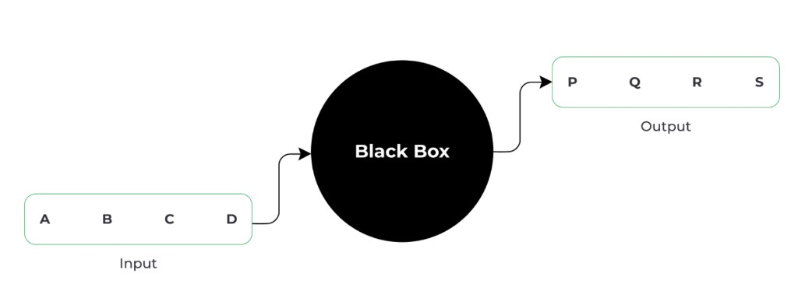

### Де застосовується seq2seq?


| Задача                       | Вхід                    | Вихід               | Приклад                                  |
| ---------------------------- | ----------------------- | ------------------- | ---------------------------------------- |
| **Машинний переклад**        | речення мовою-джерелом  | речення мовою-ціллю | "How are you?" → "Як справи?"            |
| **Автоматична сумаризація**  | довгий текст            | коротке резюме      | стаття → "AI is rapidly advancing"       |
| **QA (запитання-відповідь)** | запитання користувача   | відповідь           | "Capital of France?" → "Paris"           |
| **Image Captioning**         | ознаки зображення (CNN) | текстовий опис      | фото собаки → "A dog is playing"         |
| **Генерація коду**           | текстовий опис задачі   | програмний код      | "factorial of n" → `def factorial(n)...` |


> 💡 Ключова властивість: **вхідна і вихідна довжини можуть бути різними.** Саме тому звичайна нейронна мережа (з фіксованим входом/виходом) тут не підходить.

---

## 1.2 Від тексту до векторів — фундамент

> 💡 Перед тим як читати про архітектуру, варто розуміти базові концепції перетворення тексту на числа. Детально — в ДОДАТКУ 2 (§33–39). Нижче — квінтесенція.

### 1.2.1 Паралельний корпус і словники (→ ДОДАТОК §33)

Seq2Seq тренується на **парах речень**: DE речення ↔ EN речення. Для кожної мови будується окремий словник `{слово → index}`. У нашому коді: DE vocab (7853 токени), EN vocab (5893 токени), побудовані через `SimpleVocab` / `build_vocab_from_counter`.

### 1.2.2 Токенізація: текст → токени → IDs (→ ДОДАТОК §34)

```text
"Ein Mann" → токенізатор (spacy) → ["ein", "mann"] → vocab → [18, 26]
```

Завжди додаються `<sos>` (=2) і `<eos>` (=3). Padding `<pad>` (=1) вирівнює батч.

### 1.2.3 Embedding: числові ваги, не просто ID (→ ДОДАТОК §35)

```text
token ID 18 → Embedding(7853, 256) → вектор 256 float чисел
```

Embedding weights (7853×256 ≈ 2M параметрів) — **навчальні параметри**, не "вхідні дані". ID 18 — лише адреса рядка таблиці. Детально про різницю вхідні дані / параметри / активації — §37.

### 1.2.4 Що «навчається», а що «ні» (→ ДОДАТОК §37, §39)

| Тип | Приклад | Навчається? |
| --- | --- | --- |
| Вхідні дані | token IDs, батч тензори | ❌ Ні |
| Параметри (ваги) | Embedding, GRU, fc_out matrices | ✅ Так |
| Активації | hidden states, attention weights | ❌ Ні (перераховуються) |
| Bias | b у кожному шарі | ✅ Так |

---

## ЧАСТИНА 2. ФРЕЙМВОРК ЕНКОДЕР-ДЕКОДЕР


### Ідея: всередині чорної скриньки

Всередині seq2seq-моделі є два компоненти — **енкодер** і **декодер**, з'єднані через **контекстний вектор**.

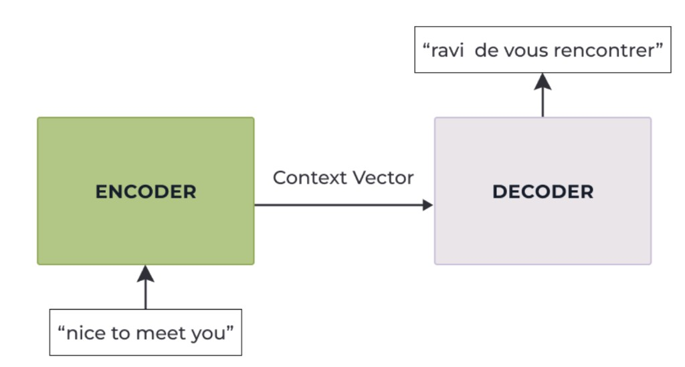

### Енкодер (Encoder)

**Ідея:** читає вхідну послідовність слово за словом і «стискає» всю інформацію в один вектор.

- Складається з шарів RNN (LSTM або GRU)
- На кожному кроці обробляє одне слово, оновлюючи прихований стан
- Після обробки всієї послідовності — **останній прихований стан** стає контекстним вектором

```
"nice" → LSTM → h₁
"to"   → LSTM → h₂
"meet" → LSTM → h₃
"you"  → LSTM → h₄  ← це і є Context Vector
```


### Контекстний вектор (Context Vector)

**Ідея:** «фотографія пам'яті» енкодера після прочитання всього вхідного речення.

![Контекстний вектор розміром 4: [0.11, 0.03, 0.81, -0.62]](images/context_vector_size4.png)

- Це звичайний вектор чисел (float-масив)
- Розмірність = кількість прихованих одиниць у енкодері
- **Типові розміри:** 256, 512, 1024 (у прикладі на схемі — 4 для наочності)
- Слугує **початковим станом** для декодера

> ⚠️ **Розмірність і якість:** більша розмірність → більше інформації зберігається → краща якість, але й більше параметрів, більше пам'яті і ризик перенавчання. Занадто мала розмірність → контекстний вектор не вміщає всю необхідну інформацію → погані переклади.


### Декодер (Decoder)

**Ідея:** отримує контекстний вектор і генерує вихідну послідовність слово за словом.

- Також є RNN (LSTM або GRU)
- Ініціалізується контекстним вектором
- На кожному кроці генерує **розподіл ймовірностей** по всьому словнику через Softmax
- Вибирає токен з найвищою ймовірністю


### Повна розгортка encoder+decoder

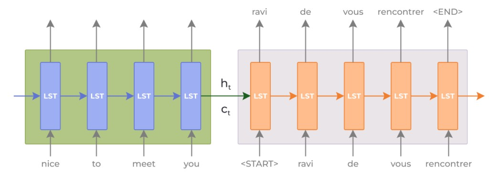

Ліворуч — енкодер (сині LSTM-клітинки), праворуч — декодер (оранжеві LSTM-клітинки).

### Де One-Hot, а де Embedding

У реальній реалізації слова не подаються як one-hot вектори — використовуються **ембединги**:

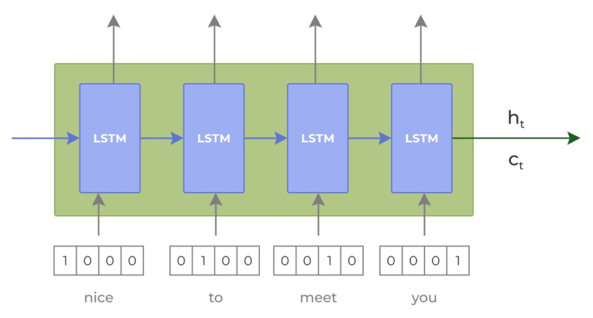

> 💡 One-hot — лише концептуально. У коді завжди `nn.Embedding` (шар перетворює індекс → щільний вектор).

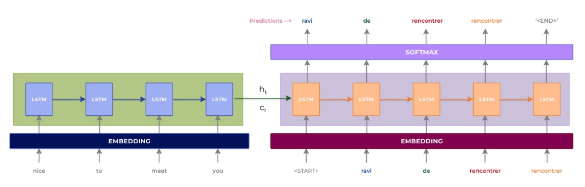

---


## ЧАСТИНА 2.5. ПОГЛИБЛЕНИЙ РОЗБІР: ЯК ENCODER І DECODER НАСПРАВДІ ПРАЦЮЮТЬ

> Інтуїтивне пояснення від нуля — на прикладі `nice to meet you` **→** `ravi de vous rencontrer`.

---


## 2.2 LSTM і GRU: від теорії до нашого коду

> 💡 **Де теорія і де код:** У ЧАСТИНАХ 2–6 описується Seq2Seq на **LSTM** (класична архітектура, яку пояснює більшість підручників). **Наш код** (ЧАСТИНА 11) реалізує **GRU**. Ця секція будує місток між ними.

---

### 2.2.1 LSTM (Long Short-Term Memory)

LSTM на кожному кроці t отримує xₜ (embedding), hₜ₋₁ (попередній hidden state), cₜ₋₁ (cell state) і обчислює чотири ворота:

**Forget gate** — що забути з пам'яті:
$$f_t = \sigma(W_f x_t + U_f h_{t-1} + b_f)$$

**Input gate** — що записати:
$$i_t = \sigma(W_i x_t + U_i h_{t-1} + b_i)$$

**Candidate cell state:**
$$\tilde{c}_t = \tanh(W_c x_t + U_c h_{t-1} + b_c)$$

**Cell state update:**
$$c_t = f_t \odot c_{t-1} + i_t \odot \tilde{c}_t$$

**Output gate:**
$$o_t = \sigma(W_o x_t + U_o h_{t-1} + b_o)$$
$$h_t = o_t \odot \tanh(c_t)$$

> 💡 Ключова ідея LSTM: **два стани** (h і c). Cell state cₜ — «довга пам'ять», hₜ — «короткострокова».

---

### 2.2.2 GRU (Gated Recurrent Unit) — спрощений LSTM

GRU об'єднує cell і hidden state в **один** стан hₜ і має **два** ворота замість чотирьох:

**Reset gate** — скільки пам'ятати з минулого:
$$r_t = \sigma(W_r x_t + U_r h_{t-1} + b_r)$$

**Update gate** — скільки «оновити» стан:
$$z_t = \sigma(W_z x_t + U_z h_{t-1} + b_z)$$

**Candidate hidden state:**
$$\tilde{h}_t = \tanh(W_h x_t + U_h (r_t \odot h_{t-1}) + b_h)$$

**Hidden state update:**
$$h_t = (1 - z_t) \odot h_{t-1} + z_t \odot \tilde{h}_t$$

> 💡 Якщо z=0 → стан взагалі не оновлюється (пам'ятаємо минуле). Якщо z=1 → стан повністю замінюється новим.

| | LSTM | GRU |
| --- | --- | --- |
| Станів | 2 (h + c) | 1 (h) |
| Воріт | 4 (f, i, c̃, o) | 2 (r, z) |
| Параметрів | більше | менше (~33%) |
| Якість | часто краща на довгих | часто аналогічна |

---

### 2.2.3 GRU у нашому коді: форми тензорів PyTorch

```python
# Encoder bidirectional GRU
self.rnn = nn.GRU(
    input_size=embedding_dim,      # 256
    hidden_size=encoder_hidden_dim, # 512
    bidirectional=True
)
# Форми ваг (PyTorch зберігає 3 матриці: r, z, h разом):
# weight_ih_l0:  (3*512, 256)  = (1536, 256)
# weight_hh_l0:  (3*512, 512)  = (1536, 512)
# ... і дзеркально для зворотного напрямку

# Decoder GRU (unidirectional)
self.rnn = nn.GRU(
    input_size=(encoder_hidden_dim * 2) + embedding_dim,  # 1280
    hidden_size=decoder_hidden_dim  # 512
)
# weight_ih_l0:  (3*512, 1280) = (1536, 1280)
# weight_hh_l0:  (3*512, 512)  = (1536, 512)
```

Перевірити форми:
```python
for name, param in model.named_parameters():
    if 'weight' in name:
        print(name, param.shape)
```

---

### 2.2.4 Місток теорія → код

```text
ТЕОРІЯ (LSTM)                    КОД (наш GRU)
─────────────────────────────────────────────────
hₜ, cₜ  (два стани)        →    тільки hₜ
forget/input/output gates   →    reset/update gates
Encoder передає (h,c) →dec  →    Encoder передає тільки h
                                  (cat(fwd,bwd) → Linear → tanh)
Decoder LSTM читає src      →    Decoder GRU + Attention
                                  (attention замінює cell state)
```

> 💡 Пояснення чому GRU часто обирають: менше параметрів → менше overfitting на невеликих датасетах (Multi30k ~29k речень). На великих корпусах різниця між LSTM і GRU зменшується.

---

## 2.3 Що насправді робить Encoder (→ ДОДАТОК §36)

> 💡 Поширена помилка: думати, що encoder «зберігає слова» або «запам'ятовує речення». Насправді він **оновлює стан**.

```text
Крок 1:  xₜ = embed("ein")   + h₀ (нулі)  →  h₁  (стан після "ein")
Крок 2:  xₜ = embed("mann")  + h₁          →  h₂  (стан після "ein mann")
Крок 3:  xₜ = embed("mit")   + h₂          →  h₃  (...)
...
Крок N:  xₜ = embed("<eos>") + hₙ₋₁        →  hₙ  ← фінальний стан (context vector)
```

Кожен hₜ — це **нове число**, яке кодує всю бачену послідовність до кроку t включно. Слова як такі не зберігаються — тільки статистична «суть».

У нашому коді: encoder → `encoder_outputs` (усі hᵢ) + `hidden` (фінальний, перетворений на dec_hid через Linear+tanh). Attention використовує **всі** hᵢ, а не лише фінальний.

---

### 2.5.1 Загальна ідея Seq2Seq

```text
nice → to → meet → you
          ↓
       ENCODER
          ↓
   "Я зрозумів зміст"
          ↓
       DECODER
          ↓
ravi → de → vous → rencontrer → <END>
```

**послідовність → стиснене представлення → інша послідовність**

Тут не нова магія, а просто **дві LSTM з'єднані разом**: одна читає, друга генерує.

---


### 2.5.2 Encoder: як він читає речення

Encoder — це LSTM. Він отримує слова **по одному**:

```text
"nice"  →  LSTM  →  h₁, c₁
"to"    →  LSTM  →  h₂, c₂
"meet"  →  LSTM  →  h₃, c₃
"you"   →  LSTM  →  h₄, c₄
```

> 💡 Це не чотири різні LSTM. Це **одна і та сама LSTM-комірка**, показана в чотирьох timestep'ах. Ми розгорнули її роботу в часі.

Після кожного слова вона пам'ятає дедалі більше:

- після `nice` — щось про `nice`
- після `to` — вже про `nice to`
- після `meet` — про `nice to meet`
- після `you` — про **всю фразу** `nice to meet you`

---


### 2.5.3 Що таке `hₜ` і `cₜ`

Оскільки це **LSTM**, вона має два стани:


| Стан | Повна назва  | Роль                                          |
| ---- | ------------ | --------------------------------------------- |
| `hₜ` | Hidden state | Поточне представлення / короткостроковий стан |
| `cₜ` | Cell state   | Довготривала пам'ять LSTM                     |


Після останнього слова `you` encoder повертає:

```text
h₄, c₄  ←  у них закодована вся фраза "nice to meet you"
```

Саме ці два стани передаються декодеру.

> 💡 **Для GRU (наш код):** GRU має лише **один** стан — `h`. Немає окремого cell state `c`. У ЧАСТИНІ 2.2 «LSTM і GRU» пояснено різницю та місток від теорії до коду.

---


### 2.5.4 Що насправді означає Context Vector

Контекстний вектор — це **приклад числового вектора** (не слова, не ймовірності):

```text
Context:  0.11
          0.03
          0.81
         -0.62
```

Для наочності на схемі показано лише 4 числа. У реальній моделі:

```text
hₜ = [0.11, 0.03, 0.81, -0.62, ..., 0.27]
      └──────────── 256 чисел ────────────┘
```

Ці числа модель **навчилася формувати сама** — у них немає «ручного» значення.

> ⚠️ `hidden_size = 256 / 512 / 1024` — це гіперпараметр (ми обираємо). Самі значення цих чисел мережа вивчає під час тренування.

---


### 2.5.5 Навіщо проміжні виходи encoder відкидаються

LSTM на кожному timestep створює hidden state:

```text
nice → h₁
to   → h₂
meet → h₃
you  → h₄
```

У класичному Seq2Seq нам не потрібно робити прогноз після кожного слова encoder — нам потрібен передусім **фінальний стан** `h₄, c₄`. Тому проміжні outputs не використовуються для генерації перекладу.

> Це зміниться, коли з'явиться **attention**: тоді decoder зможе звертатися до станів encoder з різних timestep'ів — саме тому ЧАСТИНА 5 передає декодеру **всі** `hᵢ`.

---


### 2.5.6 Decoder: крок за кроком

Encoder закінчив читати і передав `h₄, c₄`. Decoder теж LSTM, але його задача — **генерувати французьке речення слово за словом**.

Спочатку йому дають спеціальний токен `<START>` і фінальні стани encoder:

```text
h₄, c₄ + <START>
        ↓
       LSTM
        ↓
      "ravi"
```

Далі — **авторегресивна** генерація: попередній токен допомагає згенерувати наступний.

```text
<START>     → decoder → ravi
ravi        → decoder → de
de          → decoder → vous
vous        → decoder → rencontrer
rencontrer  → decoder → <END>
```

---


### 2.5.7 Linear + Softmax: від hidden state до слова

Decoder насправді не «видає слово» напряму. Після GRU йдуть ще два шари:

```text
Decoder GRU або LSTM
     ↓
 hidden state  (dec_hid чисел)
     ↓
   Linear      (dec_hid → vocab_size)
     ↓
   logits      (vocab_size чисел)   ← сирі оцінки без нормалізації
     ↓
  Softmax  (концептуально; у коді Softmax схований всередині CrossEntropyLoss)
     ↓
ймовірності всіх слів vocabulary
```

Наприклад (крок 1):

```text
bonjour    0.03
ravi       0.71  ←  argmax
de         0.04
vous       0.01
...
```

Крок 2 (вхід `ravi`):

```text
de         0.82  ←
vous       0.04
bonjour    0.01
...
```

---


### 2.5.8 Що таке `Linear` (`nn.Linear`)

`Linear` **— це повнозв'язний шар (fully connected layer)**, який робить лінійне перетворення:

$$
y = xW + b
$$

У PyTorch:

```python
nn.Linear(256, 20000)
```

означає:

```text
256 вхідних чисел (hidden state)
          ↓
       Linear
          ↓
20 000 вихідних чисел (logits по словнику)
```

Усі 256 входів пов'язані з **кожним із 20 000 вихідних нейронів**.

> 💡 `Linear` ≠ linear regression. `nn.Linear` — це просто **тип шару**. Він використовується скрізь: у класифікаторах, CNN, RNN, трансформерах.

---


### 2.5.9 Y_true: навчальний приклад і loss

Під час навчання ми знаємо правильний переклад (`Y_true`):

```text
Input:   nice to meet you
Y_true:  ravi de vous rencontrer
```

Порівнюємо передбачення з правильним перекладом:

```text
правильно:  ravi → de  → vous → rencontrer
модель:     ravi → du  → vous → rencontrer
                    ↑
                 помилка
```

З цього рахується **cross-entropy loss** → backpropagation → gradients → оновлення ваг. Це той самий принцип навчання нейромережі, що й раніше.

---


### 2.5.10 Training vs Inference (коротко)


|                               | Тренування                                   | Інференс                            |
| ----------------------------- | -------------------------------------------- | ----------------------------------- |
| **Вхід для наступного кроку** | Правильне слово з `Y_true` (teacher forcing) | Власне передбачення моделі          |
| `Y_true` **доступний?**       | Так                                          | Ні                                  |
| **Поведінка**                 | Стабільне, швидке навчання                   | Авторегресивна генерація до `<END>` |


> Детально з прикладами коду — у **ЧАСТИНІ 3** нижче.

---


### 2.5.11 Уся картина одним ланцюжком

```text
              ENCODER
─────────────────────────────────

"nice" → embedding → LSTM → h₁, c₁
                          ↓
"to"   → embedding → LSTM → h₂, c₂
                          ↓
"meet" → embedding → LSTM → h₃, c₃
                          ↓
"you"  → embedding → LSTM → h₄, c₄
                                 │
                   final states  │
                   / context     │
                                 ↓
              DECODER
─────────────────────────────────

            h₄, c₄
               ↓
<START> → embedding → LSTM
                       ↓
                    hidden
                       ↓
              Linear + Softmax
                       ↓
                     "ravi"
                       ↓
"ravi" → embedding → LSTM
                       ↓
              Linear + Softmax
                       ↓
                      "de"
                       ↓
                      ...
                       ↓
                "rencontrer"
                       ↓
                    <END>
```

> **Головна думка:** Encoder читає всю вхідну послідовність і стискає її зміст у свої фінальні стани. Decoder отримує ці стани й на їх основі генерує нову послідовність токен за токеном.

---


## ЧАСТИНА 2.6. DECODER ПІД ЧАС ТРЕНУВАННЯ: INPUT / PREDICTION / TARGET

> Детальний розбір того, що саме відбувається всередині decoder на кожному кроці тренування — три рівні, cross-entropy, Softmax і різниця між training та testing.

---


### 2.6.1 Три рівні: зсув на один крок

Під час training decoder одночасно працює з трьома «послідовностями»:

```text
INPUT у decoder:   <START>  ravi     de      vous      rencontrer
                     ↓        ↓        ↓        ↓          ↓
DECODER прогнозує: ravi      de      vous   rencontrer    <END>

TARGET (y_true):   ravi      de      vous   rencontrer    <END>
```

**INPUT і TARGET — це та сама правильна послідовність, зсунута на один крок:**

```text
INPUT:   <START>  ravi  de    vous   rencontrer
TARGET:  ravi     de    vous  rencontrer  <END>
```

Тобто задача decoder на кожному кроці: «дивлячись на попереднє слово — передбач наступне».

```text
<START>     → передбач ravi
ravi        → передбач de
de          → передбач vous
vous        → передбач rencontrer
rencontrer  → передбач <END>
```

Саме тому на схемах здається, що послідовностей «забагато» — насправді є одна правильна послідовність, і decoder вчиться передбачати кожне її слово по черзі.

---


### 2.6.2 y_true vs y_pred: розподіл ймовірностей

`y_true` — правильне слово з датасету:

```text
y_true = ravi
```

`y_pred` — **не одне слово**, а розподіл ймовірностей по всьому словнику після Softmax:

```text
ravi        0.92  ←  найімовірніше
de          0.03
vous        0.02
rencontrer  0.01
<END>       0.02
```

Модель каже: «Я думаю, що наступне слово — `ravi` з ймовірністю 92%».

Хороший прогноз: p(ravi) = 0.92 → правильному слову дали багато.

Поганий прогноз:

```text
ravi        0.10   ← правильне, але модель сумнівається
de          0.70   ← модель впевнена у неправильному
```

→ loss буде великим.

---


### 2.6.3 Categorical Cross-Entropy

Функція втрат для задачі «вибрати один правильний клас із багатьох». У нашому випадку клас — слово зі словника.

Приклад із мінісловником з 5 слів:

```text
Слова:   [ravi,  de,   vous, rencontrer, <END>]
y_true = [   1,   0,     0,          0,     0]   ← one-hot
y_pred = [0.92, 0.03, 0.02,       0.01,  0.02]   ← Softmax
```

Формула для одного кроку:

$$
Loss = -\log(p_{\text{correct}})
$$


| p(correct) | Loss    | Інтерпретація                          |
| ---------- | ------- | -------------------------------------- |
| 0.9        | ≈ 0.105 | Модель майже впевнена — loss маленький |
| 0.5        | ≈ 0.693 | Невизначеність — loss середній         |
| 0.1        | ≈ 2.303 | Модель помиляється — loss великий      |


> **Правило:** чим більша ймовірність правильного слова → тим менший loss.

Загальний loss по всіх T кроках decoder:

$$
Loss = \frac{loss_1 + loss_2 + \ldots + loss_T}{T}
$$

Наприклад, для `ravi de vous rencontrer <END>`:

```text
<START> → ravi         loss₁
ravi    → de           loss₂
de      → vous         loss₃
vous    → rencontrer   loss₄
rencontrer → <END>     loss₅

Loss = (loss₁ + loss₂ + loss₃ + loss₄ + loss₅) / 5
```

---


### 2.6.4 Softmax і argmax: від logits до слова

Перед Softmax decoder має сирі числа — **logits**:

```text
logits: [2.8, 0.4, -0.2, 1.1, -1.0]
```

Softmax перетворює їх у ймовірності (сума = 1):

```text
probs:  [0.70, 0.07, 0.04, 0.16, 0.03]
```

Потім argmax вибирає слово з найбільшою ймовірністю:

```text
argmax([0.70, 0.07, 0.04, 0.16, 0.03])
→ index 0 → ravi
```

У PyTorch:

```python
output = model(input)           # logits
predicted_token = output.argmax(dim=-1)   # argmax → індекс слова
```

Під час training ми ще додатково рахуємо loss між `output` і `y_true`.

> `predict` = прогнати input через модель → logits → Softmax → argmax.

---


### 2.6.5 Training vs Testing: проблема каскадних помилок

> 💡 **Дивіться також ЧАСТИНУ 3** — там докладна теорія Teacher Forcing та два режими декодера. Ця секція зосереджена на проблемі каскадних помилок.


|                            | Training                                        | Testing (inference)            |
| -------------------------- | ----------------------------------------------- | ------------------------------ |
| **Вхід наступного кроку**  | Правильне слово з y_true (teacher forcing)      | Власне передбачення            |
| **Y_true доступний?**      | Так                                             | Ні                             |
| **Якщо модель помилилась** | Наступний крок все одно отримує правильне слово | Помилка тягне наступну помилку |


Приклад каскадної помилки під час testing:

```text
<START> → ravi          ✓
ravi    → de            ✓
de      → rencontrer    ✗  (мала бути «vous»)
               ↓
rencontrer → ???  ← модель отримала неправильне попереднє слово
```

Саме тому teacher forcing під час training критично важливий: навіть якщо модель помилилась на кроці t, наступний крок отримує **правильне слово** і тренування не «ламається».

---


## ЧАСТИНА 3. ДЕКОДЕР: ТРЕНУВАННЯ VS ТЕСТУВАННЯ

> 💡 Каскадні помилки та порівняльна таблиця Training vs Testing — в секції **2.6.5**. Нижче — teacher forcing і inference pipeline.


### Ідея: дві різні стратегії поведінки

Декодер поводиться **по-різному** під час тренування і тестування.

### 3.1 Тренування — Teacher Forcing

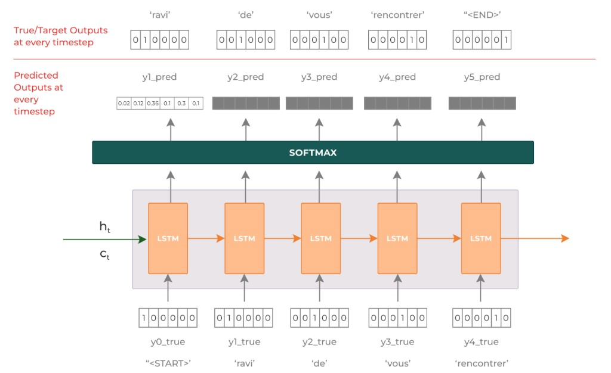

**Teacher Forcing** — техніка, за якої під час тренування на вхід декодера на кожному кроці подається **правильне слово з цільової послідовності** (а не попереднє передбачення).

**Кроки тренування:**

1. Декодер отримує контекстний вектор від енкодера
2. На першому кроці — спеціальний токен `<sos>` (start of sequence)
3. На кожному наступному кроці — **правильне слово** з target-послідовності (y_true)
4. Вихід декодера — розподіл ймовірностей по словнику (через Softmax)
5. Обчислюємо **categorical cross-entropy loss** між y_pred і y_true
6. Зворотне поширення оновлює ваги

> **Навіщо teacher forcing?** Без нього модель на ранніх етапах тренування подавала б помилкові передбачення на наступний крок → помилки накопичувалися б → навчання було б надзвичайно нестабільним і повільним. Teacher forcing стабілізує процес.

> ⚠️ **Teacher forcing ratio:** у практичній реалізації використовуємо `teacher_forcing_ratio=0.5` — тобто з ймовірністю 50% подаємо правильне слово, з ймовірністю 50% — власне передбачення моделі. Це баланс між швидким навчанням і реалістичністю.

**Функція втрат для seq2seq:**

$$
L = -\frac{1}{T} \sum_{t=1}^{T} \log P(y_t \mid y_1, \ldots, y_{t-1}, \mathbf{c})
$$


| Символ      | Що означає                                 |
| ----------- | ------------------------------------------ |
| T           | Довжина цільової послідовності             |
| yₜ          | Правильний токен на кроці t                |
| c           | Контекстний вектор                         |
| P(yₜ | ...) | Ймовірність правильного токена (з Softmax) |


### 3.2 Тестування — власні передбачення

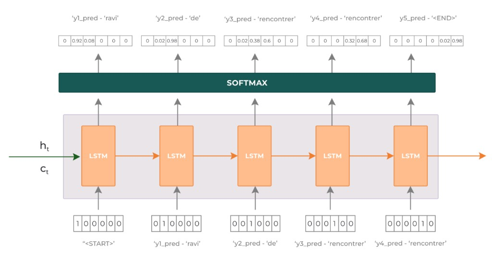

Під час тестування (інференсу):

1. Декодер отримує контекстний вектор + `<sos>`
2. На кожному наступному кроці — **власне попереднє передбачення** (greedy decoding: argmax по Softmax)
3. Цикл продовжується до токена `<eos>` або досягнення максимальної довжини

> **Чому X, а не Y?** Під час тестування ми не маємо доступу до правильних слів — модель повинна сама генерувати послідовність. Саме в цьому і полягає різниця між тренуванням і тестуванням.

---


## ЧАСТИНА 4. BPTT — ЗВОРОТНЕ ПОШИРЕННЯ КРІЗЬ ЧАС


### Ідея: навчання RNN = навчання розгорнутої у часі мережі

**Backpropagation Through Time (BPTT)** — стандартний алгоритм зворотного поширення, застосований до розгорнутої у часі RNN.

### Розгортання мережі

```
Кроки:      t=1      t=2      t=3      t=4
           ┌───┐    ┌───┐    ┌───┐    ┌───┐
x → embed: │ e₁│ → │ e₂│ → │ e₃│ → │ e₄│
           └───┘    └───┘    └───┘    └───┘
             ↓        ↓        ↓        ↓
hidden:    [h₁]  →  [h₂]  →  [h₃]  →  [h₄]
           (ваги W_hh розділяються між усіма кроками)
```


### Три кроки BPTT

**1. Forward pass** — проходимо по кроках 1→T, обчислюємо всі hₜ і фінальний loss.

**2. Обчислення градієнтів** — починаємо від T і йдемо назад T→1:

$$
\frac{\partial L}{\partial h_t} = \frac{\partial L}{\partial h_{t+1}} \cdot \frac{\partial h_{t+1}}{\partial h_t}
$$

Кожен крок множить попередній градієнт на матрицю Якобіана — звідси проблема **множення малих чисел** (vanishing gradient) або **вибухаючого градієнта** (exploding gradient).

**3. Оновлення ваг** — за алгоритмом оптимізації для всіх ваг одночасно (у нашому коді — **Adam**, а не звичайний градієнтний спуск).

### Exploding Gradient і Gradient Clipping

**Проблема:** у глибоких мережах або довгих послідовностях градієнти можуть **вибухати** (значення градієнтів → ∞), що робить навчання нестабільним.

**Рішення —** `clip_grad_norm_`**:**

```python
# Якщо норма градієнтів перевищує поріг clip,
# масштабуємо їх назад до clip, зберігаючи напрямок
torch.nn.utils.clip_grad_norm_(model.parameters(), clip)
```

> 💡 `clip=1.0` — стандартне значення. Градієнти нормуються так, щоб їхня L2-норма ≤ 1.0.

---


## ЧАСТИНА 5. ПРОБЛЕМА КОНТЕКСТНОГО ВЕКТОРА І МЕХАНІЗМ УВАГИ


### 5.1 Bottleneck — вузьке місце

Класичний seq2seq має фундаментальне обмеження: **весь вхідний текст будь-якої довжини** стискається в **один вектор фіксованої розмірності**.

```
Речення:   "The quick brown fox jumps over the lazy dog"  (9 слів)
                              ↓
Context:   [0.11, 0.03, ..., -0.62]    (512 чисел)
```

**Наслідки:**

- При **коротких реченнях** — ок
- При **довгих реченнях** — контекстний вектор «забуває» початок речення
- Модель не може «звернути увагу» на конкретне слово джерела


### 5.2 Механізм уваги — рішення

**Ідея:** замість одного контекстного вектора декодер на кожному кроці отримує **зважену суму всіх прихованих станів енкодера**, де ваги вказують — на яке вхідне слово звертати увагу зараз.

### Дві ключові відмінності від класичного seq2seq

**1. Енкодер передає декодеру ВСІ приховані стани, а не лише останній:**

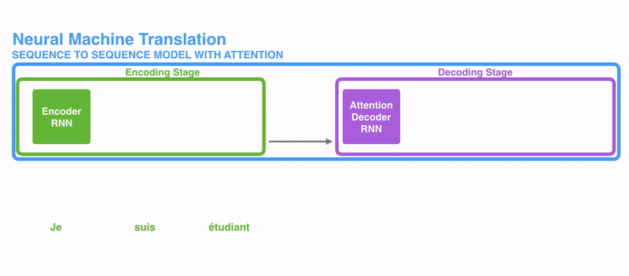

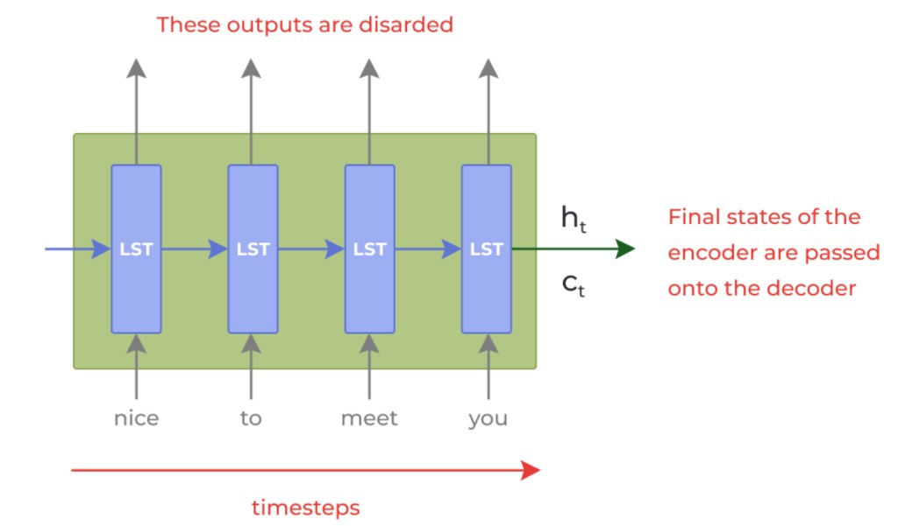

**2. Декодер робить додатковий крок уваги перед генерацією кожного токена.**
Для того щоб зосередитися на тих частинах вхідного сигналу, які мають стосунок до цього кроку декодування, декодер робить наступне:

— Дивиться на набір прихованих станів енкодера, який він отримав: кожен прихований стан енкодера найбільше асоціюється з певним словом у вхідному реченні.

— Оцінює кожен прихований стан (поки що не будемо розглядати, як саме). Підрахунок відбувається на кожному кроці на стороні декодера.

— Множить кожен прихований стан на його оцінку після застосування softmax, таким чином посилюючи приховані стани з високими оцінками та витісняючи приховані стани з низькими оцінками.

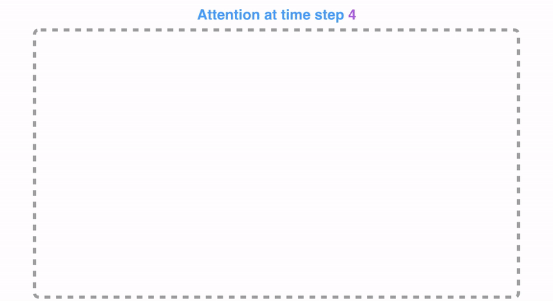

> 👉🏻 Механізм уваги в моделях seq2seq дозволяє декодеру фокусуватися на релевантних частинах вхідної послідовності під час генерації кожного токена, що значно покращує якість генерації. Це допомагає зберігати важливу інформацію та підвищує точність моделі. Крім того, увага дозволяє моделі краще обробляти залежності на великих відстанях у тексті.

---

### 5.2.5 Поглиблена інтуїція: від bottleneck до attention

> Attention логічно виростає із Seq2Seq, який ми вже розібрали. Головна зміна: ми перестаємо вимагати від одного фінального вектора encoder пам'ятати абсолютно все.

---

#### 1. Яка була проблема

У класичному Seq2Seq decoder отримував переважно **фінальний стан encoder**:

```text
nice → to → meet → you
 ↓      ↓      ↓      ↓
LSTM → LSTM → LSTM → LSTM
                       ↓
                    h₄, c₄  ← «запхай усе речення сюди 😵»
                       ↓
                    DECODER
```

Якщо речення величезне — це bottleneck.

---

#### 2. Attention: а навіщо викидати проміжні hidden states?

Encoder на кожному timestep вже створював h₁…h₄:

**Без attention:**

```text
h₁ ❌
h₂ ❌
h₃ ❌
h₄ → Decoder          (лише останній)
```

**З attention:**

```text
h₁ ─┐
h₂ ─┤
h₃ ─┤──→ Decoder може дивитися на ВСІ
h₄ ─┘
```

---

#### 3. Attention scores

Коли decoder хоче згенерувати `"ravi"`, він порівнює свій поточний hidden state з h₁…h₄ і обчислює **сирі оцінки важливості (scores)**:

```text
nice    4.2
to      0.3
meet    2.8
you     0.7
```

---

#### 4. Softmax перетворює scores на attention weights

```text
nice    0.55  ███████████
to      0.05  █
meet    0.32  ██████
you     0.08  ██
              ──────────
              sum = 1.0
```

> ⚠️ **«Weights» тут ≠ trainable weights W.** Attention weights (αᵢ) — динамічно обчислені коефіцієнти важливості для конкретного timestep. Trainable weights — у матрицях Wₐ і v всередині attention layer.

---

#### 5. Зважена сума — новий Context Vector

$$C = \alpha_1 h_1 + \alpha_2 h_2 + \alpha_3 h_3 + \alpha_4 h_4$$

Наприклад:

$$C = 0.55\, h_1 + 0.05\, h_2 + 0.32\, h_3 + 0.08\, h_4$$

Context vector тепер — **зважена суміш усіх hidden states encoder**, а не просто останній hₜ.

---

#### 6. Context Vector обчислюється заново для кожного токена decoder

| Крок decoder | Генерує | Увага (умовно) |
| --- | --- | --- |
| t=1 | ravi | nice ████, meet ███, to █, you ██ |
| t=2 | de | to ████████, meet ███, nice ██, you █ |
| t=3 | vous | you █████████, meet █, to ██, nice █ |

```text
C₁ → для першого output token
C₂ → для другого
C₃ → для третього
...
```

---

#### 7. Як decoder вирішує, куди дивитися

```text
Decoder h
   │
   ├── compare with Encoder h₁ → score₁
   ├── compare with Encoder h₂ → score₂
   ├── compare with Encoder h₃ → score₃
   └── compare with Encoder h₄ → score₄
```

Функція `score()` — dot product або невеликою нейромережею (в Bahdanau — tanh + лінійний шар). **Ця частина теж навчається через backpropagation** — модель поступово вчиться, куди корисніше дивитися при генерації кожного output.

---

#### 8. Повний крок одного timestep decoder з attention

```text
previous token (ravi)
       ↓
   Embedding
       ↓
Decoder LSTM
       ↓
  decoder h
       ↓
   ATTENTION  ←── h₁ h₂ h₃ h₄  (encoder states)
       ↓
attention weights  α₁ α₂ α₃ α₄
       ↓
  weighted sum  C = Σ αᵢhᵢ
       ↓
concatenate [h ; C]
       ↓
     Linear
       ↓
     logits
       ↓
    Softmax
       ↓
 probabilities  →  next token
```

---

#### 9. Concatenate: що це буквально

```text
h = [0.2,  0.7, -0.3]
C = [0.8, -0.1,  0.4]

[h ; C] = [0.2, 0.7, -0.3, 0.8, -0.1, 0.4]
```

Два вектори просто склеюються в один більший вектор, який потім проходить через Linear.

---

#### 10. Порівняння: Seq2Seq без і з attention

**Без attention:**

```text
x₁ → x₂ → x₃ → x₄
                 ↓
            ONE CONTEXT  ← «записка з усім реченням»
                 ↓
              Decoder
                 ↓
       y₁ → y₂ → y₃ → y₄
```

**З attention:**

```text
x₁ → h₁ ──┐
x₂ → h₂ ──┤
x₃ → h₃ ──┤──→ Decoder на кожному кроці питає:
x₄ → h₄ ──┘    «Які частини input мені зараз найбільш корисні?»
```

---

#### 11. Уся картина одним ланцюжком

```text
INPUT TOKENS
nice     to      meet      you
 ↓        ↓        ↓        ↓
Emb      Emb      Emb      Emb
 ↓        ↓        ↓        ↓
LSTM →   LSTM →   LSTM →   LSTM
 ↓        ↓        ↓        ↓
h₁       h₂       h₃       h₄
 \        |        |        /
  \       |        |       /
   ──── ATTENTION ────
             ↑
       Decoder hidden h
             ↓
      attention scores
             ↓
          Softmax
             ↓
   attention weights α
             ↓
  α₁h₁ + α₂h₂ + α₃h₃ + α₄h₄
             ↓
         Context C
             ↓
      concatenate [h ; C]
             ↓
           Linear → Softmax
             ↓
         NEXT TOKEN
             ↓
      наступний timestep → ATTENTION РАХУЄМО ЗНОВУ
```

> 💡 **Місток до Transformers:** у Seq2Seq з attention ми все ще маємо RNN/LSTM, а attention допомагає decoder дивитися на encoder. У Transformer ідею attention розвинули значно далі — RNN/LSTM взагалі прибрали, і attention став основою всієї архітектури.

---

### 5.3 Сім кроків процесу уваги

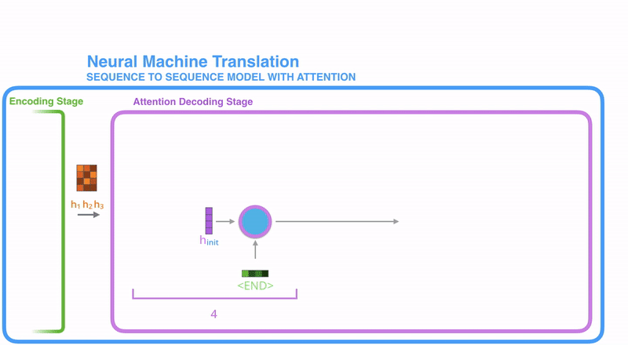

**На кожному кроці t декодера:**

1. **Вхід:** ембединг поточного токена + попередній прихований стан декодера sₜ₋₁
2. **RNN:** обробляє вхід → новий прихований стан sₜ (вихід відкидається)
3. **Attention Step:** використовуємо sₜ і ВСІ приховані стани енкодера h₁...hₜₓ для обчислення вектора контексту cₜ
4. **Конкатенація:** [sₜ; cₜ] → один вектор
5. **Feed-Forward шар:** перетворює конкатенований вектор → розподіл по словнику
6. **Argmax:** вибираємо найімовірніший токен
7. **Repeat:** повторюємо для наступного кроку

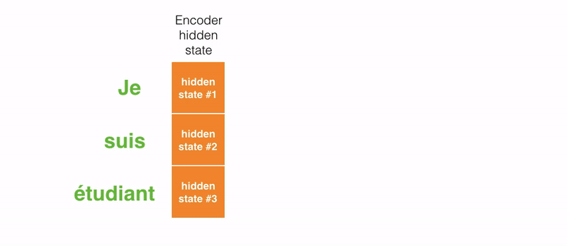
---

> ### ⚠️ Bahdanau (наш код) vs Luong/Alammar (схеми вище)
>
> Схеми і GIF-анімації ЧАСТИН 5.2 і 5.3 взяті з блогу Alammar і відповідають **Luong-подібному** порядку: спочатку Decoder GRU → новий стан `sₜ` → attention(`sₜ`) → context Cₜ → Linear. Це наочно і педагогічно цінно.
>
> **Наш код** (ЧАСТИНА 11в, клас `Decoder`) реалізує **Bahdanau-порядок**:
>
> ```text
> sₜ₋₁  (попередній стан decoder)
>    ↓
> Attention(sₜ₋₁, encoder_outputs) → Cₜ  ← context залежить від ПОПЕРЕДНЬОГО стану
>    ↓
> GRU( cat(embed(yₜ₋₁), Cₜ) )  → sₜ  ← context іде І в GRU
>    ↓
> fc_out( cat(sₜ, Cₜ, embed(yₜ₋₁)) )  → logits  ← context іде І в fc_out
> ```
>
> **Ключова різниця:**
>
> | | Luong/Alammar-порядок | Bahdanau (наш код) |
> | --- | --- | --- |
> | Attention від | поточного `sₜ` | попереднього `sₜ₋₁` |
> | Context іде в | лише Linear/fc_out | і в GRU, і в fc_out |
>
> Шпаргалка §10 правильно фіксує: «Bahdanau: sₜ₋₁ (попередній)». Обидва варіанти правильні — це різні архітектурні вибори.

## ЧАСТИНА 6. МАТЕМАТИКА BAHDANAU ATTENTION


### Ідея: три формули — Score → Weights → Context

Attention за Bahdanau (2014) — **аддитивний attention** (additive / concat attention).

### Крок 1 — Обчислення енергії (score) eₜᵢ

$$
e_{t,i} = v^\top \tanh(W_a \, [s_{t-1}; h_i])
$$


| Символ     | Розмірність                    | Що означає                                             |
| ---------- | ------------------------------ | ------------------------------------------------------ |
| sₜ₋₁       | (dec_hid,)                     | Попередній прихований стан декодера                    |
| hᵢ         | (enc_hid×2,)                   | i-й прихований стан енкодера (bidirectional → ×2)      |
| [sₜ₋₁; hᵢ] | (dec_hid + enc_hid×2,)         | Конкатенація двох векторів                             |
| Wₐ         | (dec_hid, dec_hid + enc_hid×2) | Навчувана матриця ваг                                  |
| tanh(·)    | (dec_hid,)                     | Нелінійна активація                                    |
| v          | (dec_hid,)                     | Навчуваний вектор проекції                             |
| vᵀ tanh(·) | scalar                         | Скалярна «енергія» — наскільки hᵢ важливий для кроку t |


**У коді (**`Attention.forward`**):**

```python
energy = torch.tanh(self.attn_fc(torch.cat((hidden, encoder_outputs), dim=2)))
# (batch, src_len, dec_hid)
attention = self.v_fc(energy).squeeze(2)
# (batch, src_len)
```


### Крок 2 — Softmax: нормалізуємо у ваги αₜᵢ

$$
\alpha_{t,i} = \frac{\exp(e_{t,i})}{\sum_{j=1}^{T_x} \exp(e_{t,j})}
$$


| Символ | Що означає                                                                  |
| ------ | --------------------------------------------------------------------------- |
| αₜᵢ    | Вага уваги — наскільки «важливий» стан hᵢ на кроці t (від 0 до 1, сума = 1) |
| Tₓ     | Довжина вхідної послідовності                                               |


```python
return torch.softmax(attention, dim=1)   # (batch, src_len)
```


### Крок 3 — Зважена сума: контекстний вектор cₜ

$$
c_t = \sum_{i=1}^{T_x} \alpha_{t,i} \, h_i
$$


| Символ   | Що означає                                                 |
| -------- | ---------------------------------------------------------- |
| cₜ       | Контекстний вектор для кроку t (різний для кожного кроку!) |
| αₜᵢ · hᵢ | Зважений прихований стан енкодера                          |


```python
weighted = torch.bmm(a.unsqueeze(1), encoder_outputs.permute(1, 0, 2))
# (batch, 1, enc_hid*2)
```

> 💡 **Ключова відмінність від класичного seq2seq:** cₜ **різний для кожного кроку t** — модель «перечитує» вхід по-різному залежно від того, яке слово генерує зараз.


### Порівняння класичного seq2seq і seq2seq з увагою


|                             | Класичний seq2seq         | Seq2Seq + Attention                             |
| --------------------------- | ------------------------- | ----------------------------------------------- |
| **Що передається декодеру** | Один фінальний вектор cₜ  | Всі hᵢ + динамічний cₜ                          |
| **Контекст на кроці t**     | Однаковий для всіх кроків | Різний для кожного кроку                        |
| **Довгі речення**           | Слабо (забуває початок)   | Добре (може «перечитати» будь-яке слово)        |
| **Інтерпретованість**       | Немає                     | Є (heatmap уваги)                               |
| **Складність**              | O(Tₓ) на крок decoder     | O(Tₓ · T_y) — кожен із T_y кроків decoder обчислює αₜᵢ для всіх Tₓ станів encoder |


---


## ПРАКТИЧНА ЧАСТИНА — ПОВНИЙ PIPELINE (ЧАСТИНИ 7–13)

> Виконуй практичні кроки по порядку зверху вниз. Кроки пронумеровані глобально (1–20) через усі частини.


### Карта pipeline


| Блок                       | Що робимо                                          | Навіщо                       | Кроки |
| -------------------------- | -------------------------------------------------- | ---------------------------- | ----- |
| **1 — Підготовка**         | GPU, Internet ON, бібліотеки, seed                 | Без цього нічого не запрацює | 1–3   |
| **2 — Дані**               | Завантажуємо Multi30k (29k train/1k val/1k test)   | Формуємо пари de↔en          | 4–5   |
| **3 — Препроцесинг**       | spaCy-токенізація, `<sos>`/`<eos>`, lower          | Чистий текст → токени        | 6     |
| **4 — Словник**            | `SimpleVocab` / `build_vocab_from_counter` (torchtext замінений), `min_freq=2`, `<unk>`/`<pad>` | Токени → індекси | 7 |
| **5 — Нумералізація**      | `numericalize_example`                             | Рядки → числові тензори      | 8     |
| **6 — Dataset/DataLoader** | `with_format("torch")`, `collate_fn`, `DataLoader` | Батчеве тренування з padding | 9–10  |
| **7 — Модель**             | `Encoder`, `Attention`, `Decoder`, `Seq2Seq`       | Визначаємо архітектуру       | 11    |
| **8 — Тренування**         | `init_weights`, Adam, CrossEntropyLoss, 10 епох    | Навчаємо модель              | 12–16 |
| **9 — Тестування**         | Завантажуємо best-ваги, test loss + PPL            | Оцінюємо якість              | 17    |
| **10 — Переклад**          | `translate_sentence`, attention heatmap            | Перевіряємо переклад вручну  | 18–20 |


---


## ЧАСТИНА 7. ПІДГОТОВКА СЕРЕДОВИЩА — KAGGLE


### Підключення на Kaggle

1. Відкрий [Kaggle](https://www.kaggle.com) → **Create** → **New Notebook**
2. Увімкни GPU: **Session options → Accelerator → GPU T4 x1** (сесія перезапуститься)
3. Увімкни Internet: **Session options → Internet → ON**

> ⚠️ **Вмикай GPU і Internet ДО першого запуску.** Зміна будь-якого параметра перезапускає сесію і скидає всі змінні.

> ⚠️ **Internet ON обов'язковий** — `datasets.load_dataset("bentrevett/multi30k")` завантажує датасет з HuggingFace Hub. Без Internet датасет не завантажиться.


### Практичний крок 1 — Налаштовуємо шляхи і директорії

```python
import os

# Перевіряємо вміст /kaggle/input (після Add Data для додаткових датасетів)
for root, dirs, files in os.walk("/kaggle/input"):
    for name in files:
        print(os.path.join(root, name))

# Створюємо директорію для збереження моделей
os.makedirs('/kaggle/working/saved_models', exist_ok=True)
model_dir = '/kaggle/working/saved_models'
```

**Очікуваний вивід:** (якщо не додавали зовнішніх датасетів — пусто, Multi30k тягнеться з HuggingFace)

> 💡 Для локального запуску: замінити `model_dir` на `'./saved_models'` і виконати `os.makedirs('./saved_models', exist_ok=True)`.


### Практичний крок 2 — Встановлюємо бібліотеки (якщо потрібно)

```bash
# datasets і evaluate — встановлюємо завжди
!pip install datasets==2.14.7 evaluate==0.4.0
```

> ⚠️ **torchtext недоступний у сучасних середовищах:** у Kaggle/Colab з Python 3.12+ `torchtext` не має wheels (`from versions: none`). **Не намагайтесь встановити** `torchtext` **— це зайнє.** У Кроці 7 замість `torchtext.vocab` використовується готова альтернатива `build_vocab_from_counter` (клас `SimpleVocab`).

> ⚠️ **spaCy моделі:** у матеріалі лекції вказано застарілі команди `python3 -m spacy download en` і `python3 -m spacy download de`. У spaCy 3.x ці shortcut-імена видалені. Використовуй:

```bash
# Сучасний варіант (spaCy 3.x+)
!python -m spacy download en_core_web_sm
!python -m spacy download de_core_news_sm
```


### Практичний крок 3 — Імпортуємо всі бібліотеки

```python
import os
import random
from tqdm.auto import tqdm    # автоматично обирає середовище (Kaggle/Colab/локальне)
# НЕ: from tqdm import tqdm_notebook  ← застарілий варіант

import pandas as pd
import numpy as np

import spacy
import en_core_web_sm
import de_core_news_sm

import datasets
# import torchtext  ← недоступний у Python 3.12+; замість нього — SimpleVocab (Крок 7)
from collections import Counter

import torch
import torch.nn as nn
import torch.optim as optim

import evaluate

import matplotlib.pyplot as plt
import matplotlib.ticker as ticker

import warnings
warnings.filterwarnings("ignore")
```

**Пояснення змінних:**


| Бібліотека            | Навіщо                                                               |
| --------------------- | -------------------------------------------------------------------- |
| `tqdm.auto`           | Прогрес-бар, сумісний з будь-яким середовищем                        |
| `datasets`            | HuggingFace — завантаження Multi30k                                  |
| `collections.Counter` | Побудова словника (замість `torchtext`, недоступного в Python 3.12+) |
| `spacy`               | Токенізатор для EN і DE                                              |
| `evaluate`            | Розрахунок метрик (BLEU)                                             |


---


## ЧАСТИНА 8. ЗАВАНТАЖЕННЯ І ОГЛЯД ДАНИХ (Кроки 4–5)

> ### БЛОК 2 — Завантаження даних (Кроки 4–5)
>
> **Що робимо:** завантажуємо датасет Multi30k з HuggingFace і встановлюємо random seed.
> **Навіщо:** Multi30k — стандартний бенчмарк для машинного перекладу EN↔DE.


### Практичний крок 4 — Встановлюємо random seed

```python
# Для відтворюваності результатів
seed = 42

random.seed(seed)
np.random.seed(seed)
torch.manual_seed(seed)
torch.cuda.manual_seed(seed)
torch.backends.cudnn.deterministic = True
```

**Пояснення змінних:**


| Змінна                               | Тип    | Що робить                                                 |
| ------------------------------------ | ------ | --------------------------------------------------------- |
| `seed`                               | `int`  | Фіксована «точка старту» для генераторів випадкових чисел |
| `torch.backends.cudnn.deterministic` | `bool` | Гарантує однакові результати на GPU                       |


### Практичний крок 5 — Завантажуємо Multi30k

```python
# Завантажуємо з HuggingFace Hub (потрібен Internet ON на Kaggle)
dataset = datasets.load_dataset("bentrevett/multi30k")

dataset
```

**Очікуваний вивід:**

```
DatasetDict({
    train: Dataset({
        features: ['en', 'de'],
        num_rows: 29000
    })
    validation: Dataset({
        features: ['en', 'de'],
        num_rows: 1014
    })
    test: Dataset({
        features: ['en', 'de'],
        num_rows: 1000
    })
})
```

```python
# Розподіляємо на тренувальну, валідаційну і тестову вибірки
train_data, valid_data, test_data = (
    dataset["train"],
    dataset["validation"],
    dataset["test"]
)

# Переглядаємо перший приклад
train_data[0]
```

**Очікуваний вивід:**

```python
{'en': 'Two young, White males are outside near many bushes.',
 'de': 'Zwei junge weiße Männer sind im Freien in der Nähe vieler Büsche.'}
```

**Пояснення змінних:**


| Змінна       | Тип           | Що містить                               |
| ------------ | ------------- | ---------------------------------------- |
| `dataset`    | `DatasetDict` | Словник з train/validation/test сплітами |
| `train_data` | `Dataset`     | 29 000 прикладів для тренування          |
| `valid_data` | `Dataset`     | 1 014 прикладів для валідації            |
| `test_data`  | `Dataset`     | 1 000 прикладів для тестування           |


> 💡 Кожен приклад — це словник `{'en': '...', 'de': '...'}`. Задача: навчити модель перекладати з **DE → EN** (German → English).

---


## ЧАСТИНА 9. ПРЕПРОЦЕСИНГ І СЛОВНИК (Кроки 6–8)

> ### БЛОК 3 — Препроцесинг (Кроки 6–8)
>
> **Що робимо:** токенізуємо тексти через spaCy, будуємо словник, нумералізуємо.
> **Навіщо:** нейронна мережа працює з числами — потрібно перетворити рядки на індекси.


### Практичний крок 6 — Завантажуємо spaCy-моделі і токенізуємо

```python
# Завантажуємо мовні моделі spaCy
en_nlp = en_core_web_sm.load()
de_nlp = de_core_news_sm.load()

def tokenize_example(
    example,
    en_nlp,
    de_nlp,
    max_length,
    lower,
    sos_token,
    eos_token
):
    """
    Токенізує пару (англійське, німецьке) речення.
    Обрізає до max_length токенів, переводить у нижній регістр,
    додає <sos> і <eos>.
    """
    # Токенізуємо через spaCy-токенізатор (не повну NLP-модель — лише розбиття на токени)
    en_tokens = [token.text for token in en_nlp.tokenizer(example["en"])][:max_length]
    de_tokens = [token.text for token in de_nlp.tokenizer(example["de"])][:max_length]

    # Нижній регістр
    if lower:
        en_tokens = [token.lower() for token in en_tokens]
        de_tokens = [token.lower() for token in de_tokens]

    # Додаємо спеціальні токени початку і кінця
    en_tokens = [sos_token] + en_tokens + [eos_token]
    de_tokens = [sos_token] + de_tokens + [eos_token]

    return {"en_tokens": en_tokens, "de_tokens": de_tokens}
```

```python
# Гіперпараметри препроцесингу
max_length = 1_000   # обмеження довжини речення (1000 токенів для Multi30k фактично означає «без обмеження»)
lower = True          # переводимо у нижній регістр
sos_token = "<sos>"  # токен початку послідовності
eos_token = "<eos>"  # токен кінця послідовності

fn_kwargs = {
    "en_nlp": en_nlp,
    "de_nlp": de_nlp,
    "max_length": max_length,
    "lower": lower,
    "sos_token": sos_token,
    "eos_token": eos_token,
}

# Застосовуємо до всіх сплітів
train_data = train_data.map(tokenize_example, fn_kwargs=fn_kwargs, load_from_cache_file=False)
valid_data = valid_data.map(tokenize_example, fn_kwargs=fn_kwargs, load_from_cache_file=False)
test_data  = test_data.map(tokenize_example,  fn_kwargs=fn_kwargs, load_from_cache_file=False)

train_data[0]
```

**Очікуваний вивід:**

```python
{'en': 'Two young, White males are outside near many bushes.',
 'de': 'Zwei junge weiße Männer sind im Freien in der Nähe vieler Büsche.',
 'en_tokens': ['<sos>', 'two', 'young', ',', 'white', 'males', 'are',
               'outside', 'near', 'many', 'bushes', '.', '<eos>'],
 'de_tokens': ['<sos>', 'zwei', 'junge', 'weiße', 'männer', 'sind', 'im',
               'freien', 'in', 'der', 'nähe', 'vieler', 'büsche', '.', '<eos>']}
```

**Пояснення змінних:**


| Змінна       | Тип         | Що містить                                      |
| ------------ | ----------- | ----------------------------------------------- |
| `en_tokens`  | `list[str]` | Токени англійського речення з `<sos>` і `<eos>` |
| `de_tokens`  | `list[str]` | Токени німецького речення з `<sos>` і `<eos>`   |
| `max_length` | `int`       | Максимальна кількість токенів (без спеціальних) |

> 💡 **Про `max_length=1000` і обрізання.** Твердження, що довгі речення містять «багато шуму», — не універсальна істина. Розгляньмо приклад:
>
> *"The man thought the weather was terrible, the hotel was awful, the journey was exhausting, but despite all that **he loved Paris**."*
>
> Якщо обрізати кінець:
>
> *"The man thought the weather was terrible, the hotel was awful..."*
>
> — ми втрачаємо **he loved Paris**, і зміст суттєво змінюється. Обрізання — це технічний компроміс між збереженням інформації та обчислювальною вартістю. Для Multi30k, де речення — короткі підписи до фотографій (caption-sentences, зазвичай 10–20 токенів), `max_length=1000` практично нічого не обрізає і є просто «заглушкою».

---

### Практичний крок 7 — Будуємо словники

> ⚠️ **torchtext недоступний у Python 3.12+ (Kaggle/Colab).** Використовуємо власну реалізацію `SimpleVocab` на базі `collections.Counter` — повністю сумісна заміна.

```python
from collections import Counter

def build_vocab_from_counter(data_tokens, min_freq, specials):
    """
    Будує словник із корпусу токенів.
    - specials завжди отримують індекси 0, 1, 2, ... (у порядку списку)
    - звичайні слова з частотою >= min_freq додаються після specials
    - слова зі specials виключаються з лічильника, щоб не дублюватись
    """
    specials_set = set(specials)
    counter = Counter(
        tok
        for sent in data_tokens
        for tok in sent
        if tok not in specials_set          # <sos>/<eos> не рахуємо — вони в specials
    )
    vocab_list = specials + [w for w, c in counter.most_common() if c >= min_freq]
    word2id = {w: i for i, w in enumerate(vocab_list)}

    class SimpleVocab:
        def __init__(self, w2i, i2w):
            self._w2i = w2i
            self._i2w = i2w
            self._default = w2i.get("<unk>", 0)
        def __getitem__(self, word):
            return self._w2i.get(word, self._default)
        def __len__(self):
            return len(self._w2i)
        def lookup_indices(self, tokens):
            return [self._w2i.get(t, self._default) for t in tokens]
        def lookup_tokens(self, ids):
            return [self._i2w[i] for i in ids]
        def set_default_index(self, idx):
            self._default = idx

    return SimpleVocab(word2id, vocab_list)

# Параметри словника
min_freq   = 2
unk_token  = "<unk>"
pad_token  = "<pad>"
special_tokens = [unk_token, pad_token, sos_token, eos_token]
#                  idx=0       idx=1      idx=2      idx=3

# Будуємо словники
en_vocab = build_vocab_from_counter(train_data["en_tokens"], min_freq, special_tokens)
de_vocab = build_vocab_from_counter(train_data["de_tokens"], min_freq, special_tokens)

# Перевіряємо індекси спеціальних токенів
assert en_vocab[unk_token] == de_vocab[unk_token] == 0
assert en_vocab[pad_token] == de_vocab[pad_token] == 1

unk_index = en_vocab[unk_token]   # 0
pad_index = en_vocab[pad_token]   # 1

en_vocab.set_default_index(unk_index)
de_vocab.set_default_index(unk_index)

print(f"<unk> index: {unk_index}")
print(f"<pad> index: {pad_index}")
print(f"<sos> index: {en_vocab[sos_token]}")   # 2
print(f"<eos> index: {en_vocab[eos_token]}")   # 3
print(f"EN vocab size: {len(en_vocab)}")
print(f"DE vocab size: {len(de_vocab)}")
```

**Очікуваний вивід:**

```
<unk> index: 0
<pad> index: 1
<sos> index: 2
<eos> index: 3
EN vocab size: ~5900
DE vocab size: ~7800
```


### Практичний крок 8 — Нумералізуємо дані

```python
def numericalize_example(example, en_vocab, de_vocab):
    """Перетворює рядки токенів на числові індекси зі словника."""
    en_ids = en_vocab.lookup_indices(example["en_tokens"])
    de_ids = de_vocab.lookup_indices(example["de_tokens"])
    return {"en_ids": en_ids, "de_ids": de_ids}

fn_kwargs = {"en_vocab": en_vocab, "de_vocab": de_vocab}

train_data = train_data.map(numericalize_example, fn_kwargs=fn_kwargs, load_from_cache_file=False)
valid_data = valid_data.map(numericalize_example, fn_kwargs=fn_kwargs, load_from_cache_file=False)
test_data  = test_data.map(numericalize_example,  fn_kwargs=fn_kwargs, load_from_cache_file=False)

# Перевіряємо
train_data[0]["en_ids"], train_data[0]["de_ids"]
```

**Очікуваний вивід:**

```
([2, 16, 24, 15, 25, 778, 17, 57, 80, 202, 1312, 5, 3],
 [2, 18, 26, 253, 30, 84, 20, 88, 7, 15, 110, 7647, 3171, 4, 3])
```

> `2` = `<sos>`, `3` = `<eos>`, `1` = `<pad>`, `0` = `<unk>`

---


## ЧАСТИНА 10. DATASET І DATALOADER (Кроки 9–10)

> ### БЛОК 4 — Dataset і DataLoader (Кроки 9–10)
>
> **Що робимо:** конвертуємо у тензори, додаємо padding через `collate_fn`, створюємо DataLoader.
> **Навіщо:** модель приймає батчі фіксованої розмірності — послідовності різної довжини потрібно вирівнювати.


### Практичний крок 9 — Конвертуємо у тензори

```python
# Конвертуємо у формат torch-тензорів
data_type = "torch"
format_columns = ["en_ids", "de_ids"]

train_data = train_data.with_format(
    type=data_type,
    columns=format_columns,
    output_all_columns=True   # зберігаємо рядкові поля (en, de, en_tokens, de_tokens)
)
valid_data = valid_data.with_format(type=data_type, columns=format_columns, output_all_columns=True)
test_data = test_data.with_format(type=data_type, columns=format_columns, output_all_columns=True)

train_data
```

**Очікуваний вивід:**

```
Dataset({
    features: ['en', 'de', 'en_tokens', 'de_tokens', 'en_ids', 'de_ids'],
    num_rows: 29000
})
```


### Практичний крок 10 — Collate функція і DataLoader

```python
def get_collate_fn(pad_index):
    """
    Повертає collate_fn — функцію, яка об'єднує список прикладів у батч.
    Додає padding до коротших послідовностей, щоб всі мали однакову довжину.
    """
    def collate_fn(batch):
        # Витягуємо en_ids і de_ids з кожного прикладу
        batch_en_ids = [example["en_ids"] for example in batch]
        batch_de_ids = [example["de_ids"] for example in batch]

        # Додаємо padding: коротші послідовності доповнюємо pad_index=1
        batch_en_ids = nn.utils.rnn.pad_sequence(batch_en_ids, padding_value=pad_index)
        batch_de_ids = nn.utils.rnn.pad_sequence(batch_de_ids, padding_value=pad_index)

        # ВАЖЛИВО: batch_first=False (дефолт) → форма (seq_len, batch_size)
        return {"en_ids": batch_en_ids, "de_ids": batch_de_ids}

    return collate_fn


def get_data_loader(dataset, batch_size, pad_index, shuffle=False):
    """Створює DataLoader з collate_fn."""
    collate_fn = get_collate_fn(pad_index)
    return torch.utils.data.DataLoader(
        dataset=dataset,
        batch_size=batch_size,
        collate_fn=collate_fn,
        shuffle=shuffle,
    )
```

```python
batch_size = 128

train_data_loader = get_data_loader(train_data, batch_size, pad_index, shuffle=True)
valid_data_loader = get_data_loader(valid_data, batch_size, pad_index)
test_data_loader = get_data_loader(test_data, batch_size, pad_index)

# Переглядаємо один батч
batch = next(iter(train_data_loader))
print("en_ids shape:", batch["en_ids"].shape)   # (seq_len, 128)
print("de_ids shape:", batch["de_ids"].shape)   # (seq_len, 128)
```

**Пояснення змінних:**


| Змінна            | Форма            | Що містить                                              |
| ----------------- | ---------------- | ------------------------------------------------------- |
| `batch["en_ids"]` | `(seq_len, 128)` | Індекси англійських токенів; стовпці = приклади в батчі |
| `batch["de_ids"]` | `(seq_len, 128)` | Індекси німецьких токенів                               |
| `pad_index`       | scalar           | Значення padding (1)                                    |


> 💡 **Чому форма** `(seq_len, batch_size)`**, а не** `(batch_size, seq_len)`**?** У PyTorch RNN стандартно очікує `(seq_len, batch_size, features)`. Без `batch_first=True` ми залишаємо цей формат — так уникаємо зайвого `permute` перед RNN.


> ⚠️ **Padding mask і Attention (відсутня у нашому коді):** Padding-токени (`<pad>`) у вхідній (src) послідовності encoder отримують ненульову attention weight — наша реалізація не маскує їх. `ignore_index=pad_index` у `CrossEntropyLoss` прибирає pad з **цільової** послідовності, але **не** із attention по src. Це відома спрощення: додавання `src_mask` (як у Transformer) покращило б якість на довших реченнях.


---


## ЧАСТИНА 11. КЛАС МОДЕЛІ (Крок 11)

> ### БЛОК 5 — Класи моделі (Крок 11)
>
> **Що робимо:** визначаємо `Encoder`, `Attention`, `Decoder`, `Seq2Seq`.
> **Навіщо:** це серце нашої системи — кожен клас відповідає за свою частину архітектури.

> 💡 **Як читати ЧАСТИНУ 11.** Код реалізує теорію з ЧАСТИН 2–6, але з трьома ключовими відмінностями від базового Seq2Seq: замість LSTM — **GRU**, encoder — **bidirectional**, є повноцінний **Attention**. Код найзручніше читати як один конвеєр: DE tokens → Encoder → [всі hidden states + початковий стан decoder] → Decoder + Attention (на кожному кроці) → EN tokens.

### Практичний крок 11а — Клас Encoder

```python
class Encoder(nn.Module):
    def __init__(self, input_dim, embedding_dim, encoder_hidden_dim, decoder_hidden_dim):
        """
        Аргументи:
            input_dim: розмір словника (DE)
            embedding_dim: розмірність ембедингу
            encoder_hidden_dim: розмір прихованого стану GRU енкодера
            decoder_hidden_dim: розмір прихованого стану декодера
        """
        super().__init__()
        self.embedding = nn.Embedding(input_dim, embedding_dim)

        # Двонаправлена GRU: читає речення зліва-направо і справа-наліво
        # → виходи мають розмір encoder_hidden_dim * 2
        self.rnn = nn.GRU(embedding_dim, encoder_hidden_dim, bidirectional=True)

        # Лінійний шар: зводимо [forward; backward] до розміру decoder_hidden_dim
        self.fc = nn.Linear(encoder_hidden_dim * 2, decoder_hidden_dim)

    def forward(self, src):
        # src: (src_length, batch_size)

        embedded = self.embedding(src)
        # embedded: (src_length, batch_size, embedding_dim)

        outputs, hidden = self.rnn(embedded)
        # outputs: (src_length, batch_size, encoder_hidden_dim * 2)
        # hidden:  (n_layers * n_directions=2, batch_size, encoder_hidden_dim)

        # hidden стек: [forward_layer1, backward_layer1] (для 1-шарової GRU)
        # hidden[-2]: останній стан прямого пробігу
        # hidden[-1]: останній стан зворотного пробігу
        hidden = torch.tanh(
            self.fc(torch.cat((hidden[-2, :, :], hidden[-1, :, :]), dim=1))
        )
        # hidden: (batch_size, decoder_hidden_dim)

        return outputs, hidden
```

**Пояснення змінних:**


| Змінна    | Форма                         | Що містить                        |
| --------- | ----------------------------- | --------------------------------- |
| `outputs` | `(src_len, batch, enc_hid*2)` | Всі приховані стани для attention |
| `hidden`  | `(batch, dec_hid)`            | Початковий стан декодера          |
#### Як читати клас Encoder

**Конвеєр:**

```text
DE token IDs  (src_length, batch)
       ↓
Embedding  →  вектори токенів  (src_length, batch, embedding_dim)
       ↓
Bidirectional GRU
```

**Bidirectional GRU** читає речення двічі одночасно:

```text
→ zwei → junge → weiße → Männer   (прямий прохід)
← zwei ← junge ← weiße ← Männer   (зворотний прохід)
```

Для кожної позиції отримуємо два hidden state, тому `outputs` має ширину `enc_hid × 2`.

**Encoder повертає дві різні речі — і це принципово:**

| Повертає | Форма | Навіщо |
| --- | --- | --- |
| `outputs` | (src_len, batch, enc_hid×2) | Всі h₁…hₙ — для attention на кожному кроці decoder |
| `hidden` | (batch, dec_hid) | Початковий стан decoder: cat(h_fwd, h_bwd) → Linear → tanh |

```text
hidden[-2]  ← останній стан прямого GRU
hidden[-1]  ← останній стан зворотного GRU
cat → (enc_hid×2,) → Linear → tanh → (dec_hid,)  ← початковий hidden decoder
```

> ⚠️ Без `outputs` attention не міг би «перечитувати» вхід на кожному кроці decoder. Без `hidden` decoder не знав би, з чого починати.

### Практичний крок 11б — Клас Attention

```python
class Attention(nn.Module):
    def __init__(self, encoder_hidden_dim, decoder_hidden_dim):
        super().__init__()
        # Об'єднуємо h_dec і h_enc → проекція у dec_hid
        self.attn_fc = nn.Linear(
            (encoder_hidden_dim * 2) + decoder_hidden_dim,
            decoder_hidden_dim
        )
        # Проекція dec_hid → скаляр (без bias)
        self.v_fc = nn.Linear(decoder_hidden_dim, 1, bias=False)

    def forward(self, hidden, encoder_outputs):
        # hidden:          (batch_size, decoder_hidden_dim)
        # encoder_outputs: (src_length, batch_size, encoder_hidden_dim * 2)

        src_length = encoder_outputs.shape[0]

        # Повторюємо прихований стан декодера src_length разів
        hidden = hidden.unsqueeze(1).repeat(1, src_length, 1)
        # hidden: (batch_size, src_length, decoder_hidden_dim)

        encoder_outputs = encoder_outputs.permute(1, 0, 2)
        # encoder_outputs: (batch_size, src_length, encoder_hidden_dim * 2)

        # Конкатенуємо і обчислюємо проміжний вектор «energy» через attn_fc + tanh
        energy = torch.tanh(
            self.attn_fc(torch.cat((hidden, encoder_outputs), dim=2))
        )
        # energy: (batch_size, src_length, decoder_hidden_dim)  ← ПРОМІЖНИЙ тензор; ще не скалярний score

        attention = self.v_fc(energy).squeeze(2)
        # attention (score eₜᵢ): (batch_size, src_length)  ← скалярний score після v_fc

        # Нормалізуємо через Softmax → ваги уваги α
        return torch.softmax(attention, dim=1)
        # повертаємо: (batch_size, src_length)
```
#### Як читати клас Attention

Attention отримує два входи на кожному кроці decoder: поточний `hidden` стан decoder + усі `encoder_outputs`.

**Навіщо `repeat(src_length)`:**

Щоб порівняти стан decoder з **кожною позицією** encoder, треба мати однакову кількість векторів. `hidden.unsqueeze(1).repeat(1, src_length, 1)` копіює hidden state `src_length` разів по другій осі — по одній копії на кожне вхідне слово.

**Як рахуються scores:**

```text
cat(decoder_h, encoder_h₁) → attn_fc → tanh → v_fc → score₁  (скаляр)
cat(decoder_h, encoder_h₂) → attn_fc → tanh → v_fc → score₂
cat(decoder_h, encoder_h₃) → attn_fc → tanh → v_fc → score₃
cat(decoder_h, encoder_h₄) → attn_fc → tanh → v_fc → score₄
```

Наприклад для речення «zwei junge weiße Männer» (4 токени):

```text
zwei     → score 1.3
junge    → score 0.2
weiße    → score 2.7
Männer   → score 3.1
```

**Softmax → attention weights:**

```text
zwei     → 0.10
junge    → 0.03
weiße    → 0.37
Männer   → 0.50
           ──────
           1.00   ← сума завжди = 1
```

> 💡 `v_fc` — це `Linear(dec_hid, 1, bias=False)`. Він стискає кожен вектор до одного скаляра-score. Це реалізація формули eₜᵢ = vᵀ tanh(Wₐ [sₜ₋₁; hᵢ]) з ЧАСТИНИ 6.

> ⚠️ **Відсутня src mask:** Attention не маскує padding-токени у вхідній (DE) послідовності. `<pad>`-токени отримують ненульові attention weights і входять у weighted sum. Це спрощення — `CrossEntropyLoss(ignore_index=pad_index)` прибирає pad лише з **цільового** (EN) боку. Для повноцінного маскування потрібно передавати `src_mask` до `Attention.forward` і заміняти scores на `-inf` перед softmax (як у Transformer).

### Практичний крок 11в — Клас Decoder

```python
class Decoder(nn.Module):
    def __init__(self, output_dim, embedding_dim, encoder_hidden_dim,
                 decoder_hidden_dim, attention):
        """
        output_dim: розмір словника (EN)
        attention:  об'єкт класу Attention
        """
        super().__init__()
        self.output_dim = output_dim
        self.attention = attention
        self.embedding = nn.Embedding(output_dim, embedding_dim)

        # GRU приймає [ембединг поточного токена; зважений контекст]
        self.rnn = nn.GRU((encoder_hidden_dim * 2) + embedding_dim, decoder_hidden_dim)

        # Вихідний шар: [h_dec; контекст; ембединг] → logits по словнику (сирі оцінки, без Softmax)
        self.fc_out = nn.Linear(
            (encoder_hidden_dim * 2) + decoder_hidden_dim + embedding_dim,
            output_dim
        )

    def forward(self, input, hidden, encoder_outputs):
        # input:           (batch_size,) — поточний вхідний токен
        # hidden:          (batch_size, decoder_hidden_dim)
        # encoder_outputs: (src_length, batch_size, encoder_hidden_dim * 2)

        input = input.unsqueeze(0)
        # input: (1, batch_size)

        embedded = self.embedding(input)
        # embedded: (1, batch_size, embedding_dim)

        # Обчислюємо ваги уваги
        a = self.attention(hidden, encoder_outputs)
        # a: (batch_size, src_length)

        a = a.unsqueeze(1)
        # a: (batch_size, 1, src_length)

        encoder_outputs = encoder_outputs.permute(1, 0, 2)
        # encoder_outputs: (batch_size, src_length, encoder_hidden_dim * 2)

        # Зважена сума: a × encoder_outputs
        weighted = torch.bmm(a, encoder_outputs)
        # weighted: (batch_size, 1, encoder_hidden_dim * 2)

        weighted = weighted.permute(1, 0, 2)
        # weighted: (1, batch_size, encoder_hidden_dim * 2)

        # Конкатенуємо ембединг і зважений контекст → вхід для GRU
        rnn_input = torch.cat((embedded, weighted), dim=2)
        # rnn_input: (1, batch_size, (enc_hid*2) + emb_dim)

        output, hidden = self.rnn(rnn_input, hidden.unsqueeze(0))
        # output:  (1, batch_size, decoder_hidden_dim)
        # hidden:  (1, batch_size, decoder_hidden_dim)
        # У 1-шаровому GRU output == hidden

        assert (output == hidden).all()

        # Squeeze для передачі у fc_out
        embedded = embedded.squeeze(0)    # (batch_size, emb_dim)
        output = output.squeeze(0)        # (batch_size, dec_hid)
        weighted = weighted.squeeze(0)    # (batch_size, enc_hid*2)

        # Передбачення: конкатенація трьох векторів → словник
        prediction = self.fc_out(torch.cat((output, weighted, embedded), dim=1))
        # prediction: (batch_size, output_dim)  ← logits (сирі оцінки без Softmax)

        return prediction, hidden.squeeze(0), a.squeeze(1)
```
#### Як читати клас Decoder

**Три входи на кожному кроці:**

```text
input           — поточний EN token ID (попередній або <sos>)
hidden          — поточний прихований стан decoder
encoder_outputs — всі стани encoder h₁…hₙ (для attention)
```

**`torch.bmm` — зважена сума для всього батчу одночасно:**

```python
weighted = torch.bmm(a, encoder_outputs)
```

$$C_t = \alpha_1 h_1 + \alpha_2 h_2 + \ldots + \alpha_n h_n$$

Наприклад (4 токени):

```text
a              = [0.10, 0.03, 0.37, 0.50]
encoder_outputs = [h₁,   h₂,   h₃,   h₄]

C = 0.10·h₁ + 0.03·h₂ + 0.37·h₃ + 0.50·h₄
```

> 💡 **`torch.bmm`** = **batch matrix multiplication**. Замість циклу по прикладах батчу він множить матриці для всього батчу одночасно: `(batch, 1, src_len) × (batch, src_len, enc_hid×2) → (batch, 1, enc_hid×2)`.

**Вхід для GRU decoder:**

```text
embedding поточного EN token  (emb_dim,)
             +
attention context C  (enc_hid×2,)
             ↓
cat → (emb_dim + enc_hid×2,)
             ↓
Decoder GRU  →  new hidden state (dec_hid,)
```

**Передбачення через `fc_out`:**

```python
prediction = self.fc_out(torch.cat((output, weighted, embedded), dim=1))
```

```text
cat([decoder output | context C | embedding])
   (dec_hid,)         (enc_hid×2,)  (emb_dim,)
             ↓
       Linear → logits для EN словника (~5900 слів)
```

Наприклад логіти для першого кроку (вхід `<sos>`):

```text
"two"    → 6.8   ←  argmax обере це слово
"young"  → 1.2
"white"  → 0.4
"males"  → -1.3
...
```

### Практичний крок 11г — Клас Seq2Seq

```python
class Seq2Seq(nn.Module):
    def __init__(self, encoder, decoder, device):
        super().__init__()
        self.encoder = encoder
        self.decoder = decoder
        self.device = device

    def forward(self, src, trg, teacher_forcing_ratio):
        # src: (src_length, batch_size)
        # trg: (trg_length, batch_size)
        # teacher_forcing_ratio: ймовірність використання teacher forcing (0.0–1.0)

        batch_size = src.shape[1]
        trg_length = trg.shape[0]
        trg_vocab_size = self.decoder.output_dim

        # Тензор для зберігання передбачень декодера
        outputs = torch.zeros(trg_length, batch_size, trg_vocab_size).to(self.device)

        # Енкодер обробляє вхідну послідовність
        encoder_outputs, hidden = self.encoder(src)
        # encoder_outputs: (src_length, batch_size, enc_hid*2)
        # hidden:          (batch_size, dec_hid)

        # Перший вхід декодера: <sos>-токен
        input = trg[0, :]  # (batch_size,)

        for t in range(1, trg_length):
            # Один крок декодера
            output, hidden, _ = self.decoder(input, hidden, encoder_outputs)
            # output: (batch_size, trg_vocab_size)

            outputs[t] = output

            # Teacher forcing: з ймовірністю teacher_forcing_ratio беремо правильне слово
            teacher_force = random.random() < teacher_forcing_ratio
            top1 = output.argmax(1)        # (batch_size,) — greedy передбачення
            input = trg[t] if teacher_force else top1

        return outputs
        # outputs: (trg_length, batch_size, trg_vocab_size)
```
#### Як читати клас Seq2Seq

**Encoder викликається один раз:**

```python
encoder_outputs, hidden = self.encoder(src)
input = trg[0, :]  # <sos> для кожного прикладу в батчі
```

**Цикл — ось він, той loop decoder:**

```python
for t in range(1, trg_length):
```

На кожній ітерації attention рахується **заново** з новим `hidden` decoder:

```text
timestep t=1:  <sos> + hidden₀  → Attention → C₁ → GRU → hidden₁ → predict "two"
timestep t=2:  "two" + hidden₁  → Attention → C₂ → GRU → hidden₂ → predict "young"
timestep t=3:  ...
```

**`argmax` — вибір найімовірнішого слова:**

```python
top1 = output.argmax(1)
```

`argmax` знаходить індекс максимального значення у векторі логітів:

```text
logits: [0.1, 6.8, 0.15, 0.05, ...]
argmax →  1   ←  ID слова "two"
```

**Teacher forcing:**

```python
teacher_force = random.random() < teacher_forcing_ratio   # у нас: 0.5
input = trg[t] if teacher_force else top1
```

```text
наступний input ←───┬→ trg[t]  (справжній EN токен)   teacher forcing = True
                    │
                    └→ top1    (predicted токен)         teacher forcing = False
```

> ⚠️ Під час **inference** (перекладу нового речення) `teacher_forcing_ratio=0` — модель завжди використовує власний попередній prediction, бо справжнього перекладу ми не знаємо.

> 💡 **Teacher forcing — на рівні батчу, не токена:** Рішення `random.random() < 0.5` приймається **один раз** для всього батчу на кожному timestep `t`. Якщо `teacher_force=True`, **усі** приклади батчу отримують справжній токен `trg[t]`; якщо `False` — **усі** отримують predicted `top1`. Немає можливості по-різному для різних прикладів у батчі в цій реалізації.

> ⚠️ **Exposure bias:** При тренуванні з teacher forcing модель не бачить власних помилок. Під час inference помилка на кроці t передається на крок t+1, і помилки накопичуються — **cascade error**. Це ціна teacher forcing. Рішення: Scheduled Sampling (поступово знижувати `teacher_forcing_ratio`) або Beam Search (тримати `k` найкращих гіпотез замість жадібного argmax).

> 💡 **Greedy decoding:** Наш `argmax` — жадібний: обирає найімовірніший токен на кожному кроці. Beam Search (k=5) зберігає 5 кращих часткових послідовностей і часто дає якісніший переклад, але повільніший.

---

### Уся модель одним ланцюжком

```text
GERMAN TEXT (src)
"zwei junge weiße Männer"
        ↓
DE token IDs  [18, 26, 253, 30]
        ↓
══════════════════════════════════════════
                ENCODER
══════════════════════════════════════════
Embedding (DE)
        ↓
Bidirectional GRU
        ↓
┌─────────────────────────────────────────┐
│ outputs: h₁ h₂ h₃ h₄  (enc_hid×2)     │ → зберігаємо для attention
│ hidden:  cat(fwd,bwd) → Linear → tanh  │ → початковий стан decoder
└──────────────────┬──────────────────────┘
                   ↓
══════════════════════════════════════════
     DECODER  (цикл по кроках)
══════════════════════════════════════════
input = <sos>

  ┌──── ATTENTION ──────────────────────┐
  │  decoder hidden                     │
  │       ↕  (порівнюється з кожним)    │
  │  h₁  h₂  h₃  h₄  (encoder)         │
  │       ↓                             │
  │  scores → Softmax → α₁ α₂ α₃ α₄   │
  │       ↓                             │
  │  C = α₁h₁ + α₂h₂ + α₃h₃ + α₄h₄   │
  └───────────────┬─────────────────────┘
                  ↓
   cat(embed(input), C)
                  ↓
          Decoder GRU
                  ↓
   fc_out(cat(output, C, embed))
                  ↓
   logits → argmax → predicted token
                  ↓
          ┌───────┴────────┐
  teacher  ↓                ↓  no teacher
  trg[t] → input      top1 → input
          └────────────────┘
                  ↓
           NEXT ITERATION
    (attention рахується заново з новим hidden)
                  ↓
    "two" → "young" → "white" → "males" → <eos>

══════════════════════════════════════════
            TRAINING STEP
══════════════════════════════════════════
predictions ↔ target EN tokens
        ↓
  CrossEntropyLoss (ignore <pad>)
        ↓
  loss.backward()  ← BPTT
        ↓
  clip_grad_norm_
        ↓
  optimizer.step()
        ↓
  оновлюються ВСІ ваги:
  Embedding(DE) · Encoder GRU · Attention · Decoder GRU · fc_out(EN)
```

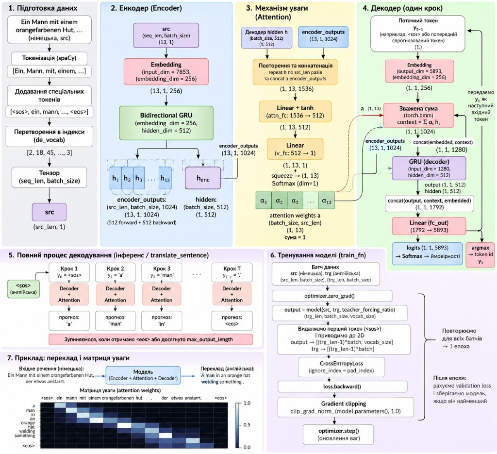


## ЧАСТИНА 12. ТРЕНУВАННЯ МОДЕЛІ (Кроки 12–16)

> ### БЛОК 6 — Тренування (Кроки 12–16)
>
> **Що робимо:** визначаємо гіперпараметри, ініціалізуємо модель, тренуємо 10 епох.
> **Навіщо:** навчаємо ваги так, щоб мінімізувати cross-entropy loss між передбаченим і правильним перекладом.

> 💡 **Як читати ЧАСТИНУ 12.** Весь наступний код — це реалізація одного циклу:

```text
batch
  ↓
forward pass
  ↓
prediction  (trg_length × batch × vocab)
  ↓
loss  (CrossEntropy)
  ↓
loss.backward()  ← обчислює градієнти
  ↓
clip_grad_norm_  ← масштабує градієнти
  ↓
optimizer.step()  ← змінює ваги
  ↓
оновлені weights
  ↓
наступний batch 🔄
```

### Практичний крок 12 — Гіперпараметри і ініціалізація моделі

```python
# Гіперпараметри
input_dim = len(de_vocab)         # ~7 853 — розмір DE словника
output_dim = len(en_vocab)        # ~5 893 — розмір EN словника
encoder_embedding_dim = 256       # розмірність ембедингу для DE
decoder_embedding_dim = 256       # розмірність ембедингу для EN
encoder_hidden_dim = 512          # прихований стан GRU в енкодері
decoder_hidden_dim = 512          # прихований стан GRU в декодері
device = torch.device("cuda" if torch.cuda.is_available() else "cpu")

print(f"Device: {device}")
print(f"DE vocab size: {input_dim}")
print(f"EN vocab size: {output_dim}")
```

```python
# Створюємо об'єкти моделі
attention = Attention(encoder_hidden_dim, decoder_hidden_dim)

encoder = Encoder(
    input_dim,
    encoder_embedding_dim,
    encoder_hidden_dim,
    decoder_hidden_dim
)

decoder = Decoder(
    output_dim,
    decoder_embedding_dim,
    encoder_hidden_dim,
    decoder_hidden_dim,
    attention,
)

model = Seq2Seq(encoder, decoder, device).to(device)
model
```

**Очікуваний вивід:**

```
Seq2Seq(
  (encoder): Encoder(
    (embedding): Embedding(7853, 256)
    (rnn): GRU(256, 512, bidirectional=True)
    (fc): Linear(in_features=1024, out_features=512, bias=True)
  )
  (decoder): Decoder(
    (attention): Attention(
      (attn_fc): Linear(in_features=1536, out_features=512, bias=True)
      (v_fc): Linear(in_features=512, out_features=1, bias=False)
    )
    (embedding): Embedding(5893, 256)
    (rnn): GRU(1280, 512)
    (fc_out): Linear(in_features=1792, out_features=5893, bias=True)
  )
)
```

> 💡 **Звідки** `1536` **у** `attn_fc`**?** `encoder_hidden_dim * 2 + decoder_hidden_dim = 512×2 + 512 = 1536` — конкатенація двонаправлених станів енкодера і стану декодера.
> 💡 **Звідки** `1280` **у** `rnn` **декодера?** `encoder_hidden_dim * 2 + embedding_dim = 1024 + 256 = 1280` — конкатенація зваженого контексту і ембедингу поточного токена.
> 💡 **Звідки** `1792` **у** `fc_out`**?** `encoder_hidden_dim * 2 + decoder_hidden_dim + embedding_dim = 1024 + 512 + 256 = 1792`.

#### Як читати гіперпараметри і вивід моделі

**Напрямок перекладу — DE → EN:**

```python
src = batch["de_ids"]   # German → encoder
trg = batch["en_ids"]   # English → decoder
```

Тому `input_dim = len(de_vocab)` ≈ 7 853 — це розмір **німецького** словника, а `output_dim = len(en_vocab)` ≈ 5 893 — **англійського**.

**Що означають числа у виводі моделі:**

```text
Embedding(7853, 256)
          ^^^^  ^^^
          │     └─ кожен токен представлений вектором із 256 чисел
          └─ 7853 токени в DE словнику
```

```text
GRU(256, 512, bidirectional=True)
    ^^^  ^^^
    │    └─ розмір hidden state GRU
    └─ розмір вхідного embedding
```

А оскільки encoder **двонаправлений**, він генерує два потоки hidden state:

```text
512  (forward)
+
512  (backward)
= 1024  → саме тому:

Linear(1024, 512)  ← стискаємо назад до dec_hid для початкового стану decoder
```


### Практичний крок 13 — Ініціалізація ваг

```python
def init_weights(m):
    """
    Ініціалізує ваги з нормального розподілу N(0, 0.01).
    Зміщення (bias) встановлює у 0.
    Потрібно для порушення симетрії між нейронами (без цього всі нейрони навчались би однаково).
    """
    for name, param in m.named_parameters():
        if "weight" in name:
            nn.init.normal_(param.data, mean=0, std=0.01)
        else:
            nn.init.constant_(param.data, 0)

model.apply(init_weights)
print("Ваги ініціалізовано")
```

#### Як читати ініціалізацію ваг

Перед навчанням модель нічого не знає. Ваги отримують **маленькі випадкові значення**, наприклад:

```text
 0.004
-0.012
 0.008
 0.001
-0.019
```

Bias встановлюється у **0**. Під час тренування і ваги, і bias будуть змінюватися разом.

> ⚠️ **Чому випадкова ініціалізація — не просто традиція.** Фраза в матеріалах, що random initialization потрібна «щоб уникнути хибного мінімуму», — спрощення. Головна причина: **порушення симетрії між нейронами**. Якщо всі ваги рівні (наприклад, нулю), кожен нейрон отримає однаковий градієнт і навчатиметься абсолютно однаково — весь шар перетвориться на один великий нейрон. Випадкові початкові ваги гарантують, що кожен нейрон іде своїм шляхом.

#### Нормальний (гаусівський) розподіл

**Gaussian = Normal = bell curve** — усі три назви для одного й того самого розподілу.

```text
частота
  ↑
  │              ███
  │            ███████
  │          ███████████
  │       █████████████████
  │____███████████████████████____
      -3  -2  -1   0   1   2   3
                    ↑
                 mean (μ)
```

| Параметр | Що означає |
| --- | --- |
| μ (mean) | Центр розподілу — навколо нього зосереджені більшість значень |
| σ (std) | Наскільки широко числа розкидані навколо центру |

У нашому коді `std=0.01` — дуже вузький розподіл, тому ваги дуже близькі до 0.


### Практичний крок 14 — Оптимізатор і функція втрат

```python
# Adam з дефолтними параметрами (lr=1e-3)
optimizer = optim.Adam(model.parameters())

# CrossEntropyLoss ігнорує <pad>-токени (index=1)
criterion = nn.CrossEntropyLoss(ignore_index=pad_index)
```

> 💡 **Навіщо** `ignore_index=pad_index`**?** Padding-токени — це «порожні місця» для вирівнювання батчу, а не реальні слова. Вони не мають нести loss і не мають впливати на оновлення ваг.

#### Що саме отримує Adam

`model.parameters()` передає Adam **всі trainable параметри** моделі:

```text
Embedding(DE)       ← 7853 × 256 = ~2 М чисел
Encoder GRU weights
Encoder GRU biases
Linear(1024→512)    ← fc encoder
Attention attn_fc
Attention v_fc
Embedding(EN)       ← 5893 × 256
Decoder GRU weights
Decoder GRU biases
fc_out Linear       ← 1792 × 5893 = ~10 М чисел
```

Adam отримує градієнт для кожного з цих параметрів після `loss.backward()` і вирішує, на скільки і в який бік його змінити.

#### Як CrossEntropy карає модель

На кожному timestep модель видає scores по всьому EN словнику:

```text
the     0.05
man     0.73   ← правильна відповідь (ймовірність після Softmax)
woman   0.04
dog     0.02
...
```

CrossEntropy дивиться лише на score правильного слова і карає модель тим сильніше, чим нижчий цей score:

$$Loss = -\log(p_{\text{correct}})$$

```text
p_correct = 0.73  →  loss = -log(0.73) ≈ 0.31   (низький loss, майже правильно)
p_correct = 0.05  →  loss = -log(0.05) ≈ 3.00   (високий loss, помилилась)
```

> 💡 `ignore_index=pad_index` означає: якщо правильна відповідь — `<pad>`, цей timestep у loss не враховується взагалі. Так батч різної довжини не штрафує модель за «порожні» позиції. `CrossEntropyLoss` **усереднює loss** по **не-pad токенах**, а не ділить на T (загальну довжину з pad).


### Практичний крок 15 — Функції тренування і валідації

```python
def train_fn(model, data_loader, optimizer, criterion, clip, teacher_forcing_ratio, device):
    """Один epoch тренування."""
    model.train()
    epoch_loss = 0

    for i, batch in tqdm(enumerate(data_loader), total=len(data_loader)):
        src = batch["de_ids"].to(device)    # German → джерело
        trg = batch["en_ids"].to(device)    # English → ціль

        optimizer.zero_grad()

        output = model(src, trg, teacher_forcing_ratio)
        # output: (trg_length, batch_size, trg_vocab_size)

        output_dim = output.shape[-1]

        # Обрізаємо перший токен <sos> і розгортаємо для CrossEntropyLoss
        output = output[1:].view(-1, output_dim)
        # output: ((trg_length - 1) * batch_size, trg_vocab_size)

        trg = trg[1:].view(-1)
        # trg: ((trg_length - 1) * batch_size,)

        loss = criterion(output, trg)
        loss.backward()

        # Gradient clipping: обрізаємо норму градієнтів до clip=1.0
        torch.nn.utils.clip_grad_norm_(model.parameters(), clip)

        optimizer.step()
        epoch_loss += loss.item()

    return epoch_loss / len(data_loader)


def evaluate_fn(model, data_loader, criterion, device):
    """Один epoch валідації (без градієнтів і teacher forcing)."""
    model.eval()
    epoch_loss = 0

    with torch.no_grad():
        for i, batch in enumerate(data_loader):
            src = batch["de_ids"].to(device)
            trg = batch["en_ids"].to(device)

            # teacher_forcing_ratio=0 → декодер використовує власні передбачення
            output = model(src, trg, 0)

            output_dim = output.shape[-1]
            output = output[1:].view(-1, output_dim)
            trg = trg[1:].view(-1)

            loss = criterion(output, trg)
            epoch_loss += loss.item()

    return epoch_loss / len(data_loader)
```

#### Як читати train_fn крок за кроком

**`optimizer.zero_grad()`** — скидаємо старі градієнти:

PyTorch за замовчуванням **накопичує** градієнти між викликами. Без цього рядка градієнти від попереднього batch додалися б до поточного → ваги оновлювалися б неправильно.

**Forward pass** та форма `output`:

```python
output = model(src, trg, teacher_forcing_ratio)
# output: (trg_length, batch_size, trg_vocab_size)
```

Тобто для кожного timestep, кожного речення в батчі є scores по всьому EN словнику.

**`.view(-1, output_dim)` — чому CrossEntropy хоче плоский тензор:**

CrossEntropy очікує форму `[N, vocabulary]`. Тому розгортаємо:

```text
output[1:]:  (trg_length-1) × batch_size × vocab
                     ↓  .view(-1, output_dim)
             (trg_length-1) * batch_size × vocab

Наприклад:
20 timesteps × 128 речень = 2560 передбачень — кожне з них порівнюється з правильним токеном
```

Аналогічно `trg[1:].view(-1)` — один плоский список правильних token ID.

**`[1:]` — чому пропускаємо перший timestep:**

Детально пояснено в ДОДАТКУ, секція 31. Коротко: `output[0]` — завжди нулі (модель не генерує нічого для `<sos>`), `trg[0]` — `<sos>`, якому немає відповідного prediction.

**`loss.backward()` обчислює, але НЕ змінює ваги:**

```text
loss.backward()   → ∂loss/∂W для кожного W  (тільки математика)
optimizer.step()  → W ← W - lr · Adam(grad) (ось тут ваги реально змінюються)
```

**Gradient clipping — числовий приклад:**

```text
норма всіх градієнтів разом = 12.4
дозволений максимум (clip)  = 1.0

→ усі градієнти масштабуються:  g ← g × (1.0 / 12.4)
```

Clipping не встановлює кожен градієнт у 1. Він **масштабує весь набір** пропорційно, зберігаючи напрямок. Детально — ЧАСТИНА 4.

**`optimizer.step()` — ось де модель вчиться:**

```text
до step():   weight = 0.312,  gradient = +0.08
після step():            → weight = 0.308
```

> ⚠️ `loss.backward()` без наступного `optimizer.step()` — марна робота: градієнти обчислені, але ваги не змінені.

#### Що робить evaluate_fn інакше

| | `train_fn` | `evaluate_fn` |
| --- | --- | --- |
| `model.train()` / `model.eval()` | train | eval (у нашій моделі **немає Dropout**, тому різниця лише у `torch.no_grad()` та `tf=0`) |
| `torch.no_grad()` | ні | так — градієнти не обчислюються |
| teacher_forcing_ratio | 0.5 | **0** — decoder використовує власні predictions |
| `loss.backward()` | так | **ні** |
| `optimizer.step()` | так | **ні** |
| Результат | оновлені ваги | тільки loss число |


### Практичний крок 16 — Тренування: 10 епох

```python
n_epochs = 10
clip = 1.0              # поріг gradient clipping
teacher_forcing_ratio = 0.5  # 50% teacher forcing

best_valid_loss = float("inf")

for epoch in tqdm(range(n_epochs)):
    train_loss = train_fn(
        model, train_data_loader, optimizer, criterion,
        clip, teacher_forcing_ratio, device
    )
    valid_loss = evaluate_fn(model, valid_data_loader, criterion, device)

    # Зберігаємо найкращу модель (за валідаційним loss)
    if valid_loss < best_valid_loss:
        best_valid_loss = valid_loss
        # ПРИМІТКА: назва 'en_fr.pt' — помилка у матеріалі (пара насправді de→en, не en→fr)
        torch.save(model.state_dict(), os.path.join(model_dir, 'en_de.pt'))

    print(f"\tTrain Loss: {train_loss:7.3f} | Train PPL: {np.exp(train_loss):9.3f}")
    print(f"\tValid Loss: {valid_loss:7.3f} | Valid PPL: {np.exp(valid_loss):9.3f}")
```

**Очікуваний вивід (10 епох):**


| Epoch | Train Loss | Valid Loss |
| ----- | ---------- | ---------- |
| 1     | 5.042      | 4.767      |
| 2     | 4.140      | 4.332      |
| 3     | 3.493      | 3.759      |
| 4     | 2.913      | 3.422      |
| 5     | 2.524      | 3.343      |
| 6     | 2.238      | 3.313      |
| 7     | 1.963      | 3.286      |
| 8     | 1.775      | 3.310      |
| 9     | 1.604      | 3.334      |
| 10    | 1.480      | 3.429      |


> ⚠️ **Перенавчання:** починаючи з епохи 8 validation loss починає зростати, тоді як training loss продовжує падати — це класична ознака **overfitting**. Рішення: dropout, L2-регуляризація, early stopping (тема наступних занять).

#### Як читати таблицю loss

**Training loss** падає монотонно кожну епоху (`5.042 → 1.480`): модель стає кращою на тих прикладах, які вже бачила.

**Validation loss** — картина зовсім інша:

```text
Epoch 1:  valid 4.767  ↓
Epoch 2:  valid 4.332  ↓
...
Epoch 7:  valid 3.286  ← найнижча точка
Epoch 8:  valid 3.310  ↑  overfitting починається
Epoch 9:  valid 3.334  ↑
Epoch 10: valid 3.429  ↑
```

Це класичний **overfitting**: модель продовжує вдосконалюватися на training-прикладах, але вже не узагальнює на нові.

Саме тому код зберігає модель лише коли покращення є:

```python
if valid_loss < best_valid_loss:
    best_valid_loss = valid_loss
    torch.save(model.state_dict(), ...)
```

**Збережена модель ≈ Epoch 7**, з validation loss ≈ `3.286`. Це і є та модель, яку завантажать у ЧАСТИНІ 13 для тестування.


> ⚠️ **Час тренування:** ~30–40 хв на GPU T4 Kaggle. Якщо сесія завершиться через таймаут (12 год для безкоштовного Kaggle), перезапусти з завантаженням збережених ваг.

---

### Уся функція тренування одним ланцюжком

```text
BATCH  (src = German IDs, trg = English IDs)
          ↓
  optimizer.zero_grad()
          ↓
══════════════════════════════════════
         FORWARD PASS
══════════════════════════════════════
German IDs
  ↓ Embedding(DE)
  ↓ Bidirectional GRU  → encoder_outputs + hidden
  ↓
Decoder loop (з <sos>, teacher forcing 50%):
  ↓ Attention → context C
  ↓ GRU → new hidden
  ↓ fc_out → logits EN vocab
  ↓
output: (trg_length, batch_size, trg_vocab_size)
          ↓
  output[1:].view(-1, vocab)  →  (N, vocab)
  trg[1:].view(-1)            →  (N,)
          ↓
══════════════════════════════════════
           LOSS
══════════════════════════════════════
CrossEntropyLoss(output, trg)  →  одне число
          ↓
  loss.backward()  ← обчислює ∂loss/∂W для всіх ваг
          ↓
  clip_grad_norm_(model.parameters(), 1.0)
          ↓
  optimizer.step()  ← W ← W - lr·Adam(grad)
          ↓
   ВАГИ ОНОВЛЕНО
          ↓
      наступний batch 🔄
```

Після кожної **epoch** (всі batch пройдено):

```text
TRAIN LOSS  (середнє по батчах)
+
VALIDATION LOSS  (модель в eval режимі, без backward)
       ↓
valid_loss < best_valid_loss?
  ├─ ТАК  → зберігаємо модель  torch.save(model.state_dict(), ...)
  └─ НІ   → нічого не зберігаємо
       ↓
наступна epoch 🔄
```

> 💡 Саме `loss.backward()` дає відповідь на питання «як Encoder вчиться?»: loss виникає на виході Decoder, але `backward()` проходить **через усю модель назад до Encoder**, тому його ваги теж отримують градієнти і оновлюються.

---

## ЧАСТИНА 13. ТЕСТУВАННЯ І ПЕРЕКЛАД (Кроки 17–20)

> ### БЛОК 7 — Тестування і переклад (Кроки 17–20)
>
> **Що робимо:** завантажуємо best-ваги, розраховуємо test loss, перекладаємо речення і візуалізуємо attention.
> **Навіщо:** перевіряємо якість моделі на невидимих даних і інтерпретуємо, куди «дивилась» модель.

> 💡 **Як читати ЧАСТИНУ 13.** Тут відбувається **inference** — справжній переклад. Головна відмінність від тренування: **ніякого teacher forcing**. Decoder годується виключно власніми попередніми передбаченнями, бо правильного перекладу ми не знаємо.

```text
Німецьке речення
       ↓
tokenization  (spaCy)
       ↓
<sos> + tokens + <eos>
       ↓
token IDs  (de_vocab.lookup_indices)
       ↓
Encoder  →  encoder_outputs + hidden
       ↓
Decoder стартує з <sos>
       ↓
predict наступний EN token
       ↓
predicted token стає наступним input
       ↓
repeat until <eos>  або  max_output_length = 25
       ↓
IDs → слова  (en_vocab.lookup_tokens)
```


### Практичний крок 17 — Тестування

```python
# Завантажуємо найкращі ваги (epoch з найнижчим validation loss)
model.load_state_dict(
    torch.load(
        os.path.join(model_dir, 'en_de.pt'),
        map_location=device,
        # weights_only=True  ← розкоментуй для torch >= 2.6
    )
)

test_loss = evaluate_fn(model, test_data_loader, criterion, device)
test_ppl = np.exp(test_loss)

print(f"| Test Loss: {test_loss:.3f} | Test PPL: {test_ppl:7.3f} |")
```

**Очікуваний вивід:**

```
| Test Loss: 3.276 | Test PPL:  26.447 |
```

> 💡 **PPL (Perplexity) = exp(loss).** PPL ≈ 26.4 означає, що в середньому модель «сумнівається між ~26 однаково ймовірними словами» на кожному кроці. Чим менше PPL, тим краще.

> 💡 `model.load_state_dict(...)` завантажує **не останню**, а **найкращу** модель — ту, що мала найнижчий validation loss (~epoch 7, valid ≈ 3.286 **у нашому запуску**). Test loss = 3.276 дуже близький до цього значення: модель поводиться на невидимих тестових даних так само, як на валідації. Це хороший знак — немає додаткового overfitting на test set. ⚠️ Test loss ~= Valid loss — нормально і очікувано для Multi30k (схожий розподіл); це **не завжди** вірно для інших датасетів.


### Практичний крок 18 — Функція перекладу

```python
def translate_sentence(
    sentence, model, en_nlp, de_nlp, en_vocab, de_vocab,
    lower, sos_token, eos_token, device, max_output_length=25
):
    """
    Перекладає одне речення (рядок або список токенів) з DE на EN.
    Повертає: (en_tokens, de_tokens, attentions)
    """
    model.eval()
    with torch.no_grad():
        # Токенізуємо вхідне речення
        if isinstance(sentence, str):
            de_tokens = [token.text for token in de_nlp.tokenizer(sentence)]
        else:
            de_tokens = [token for token in sentence]

        if lower:
            de_tokens = [token.lower() for token in de_tokens]

        de_tokens = [sos_token] + de_tokens + [eos_token]
        ids = de_vocab.lookup_indices(de_tokens)
        tensor = torch.LongTensor(ids).unsqueeze(-1).to(device)
        # tensor: (src_len, 1)

        # Пропускаємо крізь енкодер
        encoder_outputs, hidden = model.encoder(tensor)

        # Стартуємо декодер з <sos>
        inputs = en_vocab.lookup_indices([sos_token])

        # Ініціалізуємо тензор для ваг уваги
        attentions = torch.zeros(max_output_length, 1, len(ids))

        for i in range(max_output_length):
            inputs_tensor = torch.LongTensor([inputs[-1]]).to(device)
            output, hidden, attention = model.decoder(inputs_tensor, hidden, encoder_outputs)
            attentions[i] = attention

            predicted_token = output.argmax(-1).item()
            inputs.append(predicted_token)

            # Зупиняємось при <eos>
            if predicted_token == en_vocab[eos_token]:
                break

        en_tokens = en_vocab.lookup_tokens(inputs)

    return en_tokens, de_tokens, attentions[:len(en_tokens) - 1]
```

#### Як читати translate_sentence

**Підготовка речення:**

```text
"Ein Mann mit einem orangefarbenen Hut..."
       ↓  spaCy tokenizer
["ein", "mann", "mit", "einem", ...]
       ↓  lower=True
["ein", "mann", "mit", "einem", ...]
       ↓  додаємо спеціальні токени
["<sos>", "ein", "mann", ..., "<eos>"]
       ↓  de_vocab.lookup_indices(...)
[2, 18, 45, 91, ..., 3]   ← цілі числа (token IDs)
```

**Чому `torch.LongTensor`:** Embedding layer приймає саме **цілочисельні індекси**. Float-тензор тут спричинив би помилку типу.

**Encoder викликається один раз** (як і в тренуванні):

```python
encoder_outputs, hidden = model.encoder(tensor)
```

`encoder_outputs` — для attention на кожному кроці; `hidden` — стартовий стан decoder (детальніше — ЧАСТИНА 11а).

**Головний цикл:**

```python
for i in range(max_output_length):
    output, hidden, attention = model.decoder(inputs_tensor, hidden, encoder_outputs)
    predicted_token = output.argmax(-1).item()
    inputs.append(predicted_token)
    if predicted_token == en_vocab[eos_token]:
        break
```

Три входи decoder → три виходи: `output` (logits), `hidden` (новий стан), `attention` (ваги для heatmap).

**`argmax` для inference:**

```text
logits для EN словника (~5893 позиції):
  a      1.2
  man    4.7  ← max → argmax повертає індекс цього слова
  orange 0.9
  hat    2.1
```

**Самогодування (autoregressive generation):**

```text
Крок 1: input = <sos>  → predict "a"
Крок 2: input = "a"    → predict "man"
Крок 3: input = "man"  → predict "in"
Крок 4: ...
```

`inputs.append(predicted_token)` → на наступній ітерації `inputs[-1]` стає новим input. Це і є **autoregressive generation**: модель сама себе годує.

**Дві умови зупинки:**

```text
if predicted_token == en_vocab[eos_token]:
    break          ← модель сама вирішила зупинитись

max_output_length = 25  ← примусовий ліміт,
                          щоб нескінченно не генерувати
```

**Після циклу — IDs назад у слова:**

```python
en_tokens = en_vocab.lookup_tokens(inputs)
# → ['<sos>', 'a', 'man', 'in', 'an', 'orange', 'hat', 'welding', 'something', '.', '<eos>']
```


### Практичний крок 19 — Виконуємо переклад

```python
# Беремо перший приклад з тестового набору
sentence = test_data[0]["de"]
expected_translation = test_data[0]["en"]

print(f"Оригінал  (DE): {sentence}")
print(f"Очікуваний (EN): {expected_translation}")

translation, sentence_tokens, attention = translate_sentence(
    sentence, model, en_nlp, de_nlp,
    en_vocab, de_vocab, lower, sos_token, eos_token, device
)

print(f"Переклад  (EN): {' '.join(translation[1:-1])}")
```

**Очікуваний вивід:**

```
Оригінал  (DE): Ein Mann mit einem orangefarbenen Hut, der etwas anstarrt.
Очікуваний (EN): A man in an orange hat starring at something.
Переклад  (EN): a man in an orange hat welding something .
```

> 💡 Вивід вище — **приклад з нашого запуску** (результат може відрізнятися залежно від ваг після тренування). Загалом переклад вірний, але **«starring» → «welding»** — типова помилка жадібного декодування з обмеженим словником. Це лише **одне речення** — не узагальнення якості моделі.

> 💡 **Деталь про «starring»:** Слово «anstarrt» (de) = «starring at» відноситься до тестового речення. Можливо, це слово рідко зустрічається в тренувальних даних Multi30k. Це хороший приклад out-of-vocabulary / low-frequency помилки.


### Практичний крок 20 — Теплова карта уваги (Attention Heatmap)

```python
def plot_attention(sentence, translation, attention):
    """
    Візуалізує ваги уваги:
    - вісь X: токени вхідного (DE) речення
    - вісь Y: токени вихідного (EN) перекладу
    - яскравіша клітинка → більша вага уваги (модель «дивилась» туди)
    """
    fig, ax = plt.subplots(figsize=(5, 5))
    attention = attention.squeeze(1).numpy()
    cax = ax.matshow(attention, cmap="bone")
    ax.set_xticks(ticks=np.arange(len(sentence)), labels=sentence, rotation=90, size=15)
    translation = translation[1:]    # прибираємо <sos>
    ax.set_yticks(ticks=np.arange(len(translation)), labels=translation, size=15)
    plt.tight_layout()
    plt.show()
    plt.close()

plot_attention(sentence_tokens, translation, attention)
```

**Результат — теплова карта уваги:**

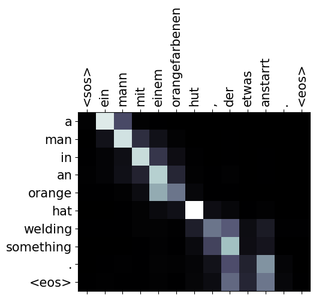

> 💡 З heatmap видно, що модель коректно «зіставляє» відповідні слова двох мов: «mann» → «man», «orangefarbenen» → «orange», «hut» → «hat». Це і є **інтерпретованість attention**.

#### Як читати теплову карту уваги

**Читаємо осі:**

```text
Вісь X (зверху):  German input-токени
Вісь Y (зліва):   English output-токени

Світліша клітинка = більший attention weight
(модель «дивилась» туди сильніше при генерації цього EN слова)
```

**Діагональна структура = вивчений alignment:**

Якщо уважно подивитися на heatmap, видно приблизну діагональ:

```text
German               English

ein       ──────→    a
mann      ──────→    man
mit/einem ──────→    in / an
orangefarbenen ─→    orange
hut       ──────→    hat
```

Наприклад, рядок `man`: найсвітліша клітинка майже точно під `mann`. Коли Decoder генерував `man`, він найбільше звертав увагу саме на `mann`. Це логічно і свідчить, що модель вивчила відповідності між словами.

**Помилка `anstarrt → welding` — ключовий момент:**

Рядок `welding` на heatmap: увага розмазана приблизно між `der`, `etwas`, `anstarrt`. Тобто модель **дивиться приблизно в правильну частину** речення (кінець, де стоїть дієслово), але все одно генерує неправильне слово.

```text
German: ... der etwas anstarrt  ("who stares at something")
                       ↑
              attention тут (правильно)

English: welding  ← НЕПРАВИЛЬНО (мало бути "starring" або "staring") — **у нашому запуску**
```

> 💡 **Ці приклади — результат нашого конкретного запуску** (10 епох, Multi30k, lr=1e-3). При повторному тренуванні результати можуть відрізнятись.

Цікаво, що `something` генерується правильно: там сильна увага до `etwas` (що і значить "something").

> ⚠️ **Attention ≠ переклад.** Attention відповідає лише на питання «які частини input зараз важливі для наступного output?» Але **слово обирають Decoder GRU + fc_out** — і вони можуть обрати неправильне, навіть якщо attention вказав у правильне місце. Правильний фокус уваги необхідний, але **не достатній** для правильного перекладу.

> 💡 **Що таке «світла клітинка» насправді.** Це не «модель на 90% переклала це слово отим словом». Це **attention weight** — відносна важливість конкретного encoder hidden state для конкретного кроку Decoder. Вся строчка attention weights для одного EN-слова сумується до 1.0.


---


## ЧАСТИНА 14. УВЕСЬ КОНВЕЄР ПРОСТИМИ СЛОВАМИ — ВІД РЕЧЕННЯ ДО ПЕРЕКЛАДУ


### Повна схема одним поглядом


> ⚠️ **Одна дрібна неточність у схемі:** підпис «Ваги Linear і параметри Softmax також навчаються» — Softmax параметрів не має (це фіксована нормалізувальна функція); навчаються лише ваги Linear-шару.

---


### Крок за кроком: що відбувається, коли ми перекладаємо «Ein Mann»?

**1. Токенізація**

```
"Ein Mann mit einem orangefarbenen Hut."
→ ["<sos>", "ein", "mann", "mit", "einem", "orangefarbenen", "hut", ".", "<eos>"]
```

**2. Нумералізація**

```
["<sos>", "ein", ...]  →  [2, 18, 47, 8, 22, 0, 198, 4, 3]
                                                 ↑
                                              <unk> = 0 (рідке слово)
```

**3. Ембединг в енкодері**

```
2  → [0.02, -0.13, ..., 0.07]   # вектор розміром 256
18 → [0.11,  0.03, ..., -0.05]
...
```

**4. Двонаправлена GRU (Encoder)**

```
→ (прямий прохід)  "ein" → "mann" → ... → "eos"  → h_fwd
← (зворотний)      "eos" → "hut"  → ... → "ein"  → h_bwd

Для кожного кроку t:  h_enc_t = [h_fwd_t ; h_bwd_t]  (розмір 512*2=1024)
Фінальний стан декодера:  h_dec_0 = tanh(W·[h_fwd_last; h_bwd_last])
```

**5. Всі стани енкодера — для attention**

```
encoder_outputs: (src_len=9, batch=1, 1024)
hidden:          (batch=1, 512)  ← початковий стан декодера
```

**6. Декодер: крок 1 (`<sos>` → «a»)**

```
Вхід: `<sos>` (index=2, **умовно** — реальний index залежить від SimpleVocab) → ембединг (розмір 256)
Увага: обчислюємо α для 9 станів енкодера
       α = [0.01, 0.40, 0.12, ...]  ← «ein» і «mann» привертають найбільше уваги
Контекст: c₁ = Σ αᵢ · h_enc_i
GRU: [ембединг_<sos>; c₁] → новий стан декодера h₁
fc_out: [h₁; c₁; ембединг_<sos>] → розподіл по ~5893 словах
argmax → «a» (або перший токен перекладу)
```

**7. Декодер: кроки 2...N**

```
Крок 2: "a"    → attention → «man»
Крок 3: "man"  → attention → «in»
...
Крок N: "something" → <eos> → зупинка
```

**8. Декодирований переклад**

```
[<sos>, "a", "man", "in", "an", "orange", "hat", "welding", "something", ".", <eos>]
```


### ASCII-ланцюжок усього pipeline

```
Вхідне речення (DE)
        │
        ▼
[Токенізація spaCy]  →  ["<sos>", "ein", "mann", ...]
        │
        ▼
[Нумералізація]  →  [2, 18, 47, ...]  → Tensor(src_len, 1)
        │
        ▼
[nn.Embedding (DE)]  →  (src_len, 1, 256)
        │
        ▼
[Bidirectional GRU Encoder]
        ├── encoder_outputs:  (src_len, 1, 1024)  → для Attention
        └── hidden:           (1, 512)             → початковий стан Decoder
                                    │
        ┌───────────────────────────┘
        │   Цикл t = 1 ... max_len
        ▼
[nn.Embedding (EN)]  ← input_t (попередній токен)
        │
        ▼
[Attention]  ← hidden_t-1 + encoder_outputs
        │
        ▼  α: (1, src_len)
[Weighted Sum]  →  c_t: (1, 1, 1024)
        │
        ▼
[GRU Decoder]  ← [embed(input_t); c_t]
        │  hidden_t
        ▼
[fc_out]  ← [h_t; c_t; embed(input_t)]
        │
        ▼
[Softmax]  →  розподіл (5893,)   ← концептуально; у коді — всередині CrossEntropyLoss
        │
      argmax
        │
        ▼
next_token  ──→  ["a", "man", "in", ..., "<eos>"]
```

> 💡 **Порівняйте з ДОДАТКОМ §32** — там той самий pipeline у вигляді технічного ASCII з реальними формами тензорів і назвами змінних коду. ЧАСТИНА 14 — педагогічний рівень; §32 — технічний.

---


## ПІДСУМКИ

Відмінна робота! 🚀

**Теорія:**

- **Seq2Seq** — архітектура «вхідна послідовність → вихідна послідовність»; застосовується у перекладі, сумаризації, QA, image captioning
- **Encoder** — читає вхід і стискає у контекстний вектор; декодер — генерує вихід з контексту
- **Context Vector** — «фотографія пам'яті» фіксованої розмірності; є вузьким місцем при довгих реченнях
- **Teacher Forcing** — під час тренування подаємо правильне слово замість передбаченого; ratio=0.5 — компроміс між швидкістю навчання і реалізмом
- **BPTT** — стандартний backprop на розгорнутій у часі RNN; exploding gradient → clip_grad_norm_
- **Attention (Bahdanau)** — динамічний контекстний вектор cₜ на кожному кроці: Score → Softmax → Weighted Sum
- **Bidirectional GRU** — читає вхід у двох напрямках; вихід 2× ширший → encoder_hidden_dim × 2

**Практика:**

- Завантаження датасету Multi30k (29k/1k/1k пар de↔en) через HuggingFace
- spaCy-токенізація з `<sos>`, `<eos>`; словник з `min_freq=2`, `<unk>`, `<pad>`
- `collate_fn` з `pad_sequence` → батч `(seq_len, batch_size)`
- Архітектура: `Encoder` (biGRU) → `Attention` (additive/Bahdanau) → `Decoder` (GRU + fc_out)
- 10 епох: train loss 5.0 → 1.5; valid loss досягає мінімуму ~3.29 на епосі 7
- Test Loss: 3.276, PPL ≈ 26.4
- Attention heatmap: явно показує відповідності слів між DE і EN

---


## EXAM / REVISION CHEAT SHEET


### 1) Seq2Seq — швидко

- Вхід: довільна послідовність; вихід: довільна послідовність (різна довжина!)
- Складається з Encoder і Decoder, з'єднаних Context Vector
- Encoder = читає весь вхід → Context Vector; Decoder = генерує вихід з Context Vector
- Застосування: машинний переклад, сумаризація, QA, image captioning, генерація коду


### 2) Context Vector — швидко

- Вектор фіксованої розмірності (256/512/1024) — стиснена пам'ять про весь вхід
- **Bottleneck:** при довгих реченнях не вміщає всю інформацію
- Ініціалізує початковий прихований стан декодера


### 3) Teacher Forcing — швидко

- **Тренування:** подаємо y_true на вхід декодера на кожному кроці
- **Тестування:** використовуємо власне передбачення y_pred
- **Ratio=0.5:** 50% кроків — teacher forcing, 50% — власні передбачення
- Навіщо: стабілізує навчання; без TF модель «ламається» від власних ранніх помилок


### 4) BPTT і Gradient Clipping — швидко

$$
\frac{\partial L}{\partial W} = \sum_{t=1}^{T} \frac{\partial L_t}{\partial W}
$$

- Gradient Clipping: `clip_grad_norm_(params, clip=1.0)` — норма градієнтів ≤ clip
- Exploding gradient: при великих T або поганій ініціалізації градієнти → ∞
- Vanishing gradient → **пом'якшується** LSTM/GRU (адитивне оновлення стану); gradient clipping допомагає лише від exploding, не від vanishing


### 5) Attention (Bahdanau) — швидко

$$
e_{t,i} = v^\top \tanh(W_a [s_{t-1}; h_i])
$$

$$
\alpha_{t,i} = \text{softmax}(e_{t,i})
$$

$$
c_t = \sum_i \alpha_{t,i} \cdot h_i
$$

- Score → Softmax → Weighted Sum
- cₜ різний для кожного кроку t → модель «перечитує» вхід динамічно
- Інтерпретованість: heatmap α показує, куди «дивилась» модель


### 6) Encoder (Bidirectional GRU) — швидко

- 2 GRU: прямий (→) і зворотний (←)
- `encoder_outputs`: (src_len, batch, enc_hid×2)
- `hidden = tanh(fc([h_fwd; h_bwd]))`: (batch, dec_hid)
- Навіщо bidirectional: кожен стан bачить контекст зліва і справа


### 7) Decoder — швидко

- На вхід: `[embed(prev_token); weighted_context]` → GRU → нова прихована стан
- Передбачення: `fc_out([h; c; embed])` → **logits** (сирі оцінки; Softmax концептуально → розподіл по словнику)
- При тренуванні: `fc_out` → **logits** → `CrossEntropyLoss` (Softmax захований всередині CE); `argmax` потрібен лише для teacher-forcing-рішення, не для loss
- При тестуванні: argmax → наступний токен → до `<eos>` або max_len


### 8) PPL (Perplexity) — швидко

$$
PPL = e^{loss} = e^{-\frac{1}{N}\sum \log P}
$$

- PPL=1 → ідеальна модель (знає правильну відповідь)
- PPL=5893 → модель нічому не навчилась (як випадковий вибір зі словника EN)
- Наша модель: PPL ≈ 26.4 — реалістичний результат для 10 епох без претренованих ембедингів


### 9) Порівняльна таблиця архітектур


|                   | Класичний Seq2Seq           | Seq2Seq + Attention                    |
| ----------------- | --------------------------- | -------------------------------------- |
| **Контекст**      | Один вектор (останній стан) | Динамічний вектор cₜ для кожного кроку |
| **Довгі речення** | Слабо                       | Добре                                  |
| **Параметри**     | Embedding + GRU + Linear    | + attn_fc (1536×512+512) + v_fc (512)  |
| **Інтерпретація** | Немає                       | Attention heatmap                      |
| **Складність**    | O(Tₓ) на крок decoder       | O(Tₓ · T_y) — attention для кожного з T_y кроків |
| **Приклади**      | Early NMT (2014)            | Google NMT (2016+)                     |


### 10) Bahdanau vs Luong Attention — швидко


|                   | Bahdanau (2014)   | Luong (2015)           |
| ----------------- | ----------------- | ---------------------- |
| **Назва**         | Additive / Concat | Multiplicative / Dot   |
| **Score**         | vᵀ tanh(Wₐ[s; h]) | sᵀ Wₐ h або просто sᵀh |
| **Стан декодера** | sₜ₋₁ (попередній) | sₜ (поточний)          |
| **Складність**    | Більше параметрів | Простіше               |
| **У нашому коді** | ✓                 | —                      |


---


## ДОДАТОК: ПОКРОКОВИЙ РОЗБІР ПРОЦЕСУ НАВЧАННЯ

> Інтуїтивне пояснення — від пари речень до оновлення ваг. Читати як послідовну розповідь.

---


### 1. Вхідна пара

```
src (DE): ["<sos>", "zwei", "junge", "männer", ".", "<eos>"]
trg (EN): ["<sos>", "two",  "young", "men",    ".", "<eos>"]
```

---


### 2. Нумералізація

```
src: [2, 18, 26, 30, 4, 3]
trg: [2, 16, 24, 40, 5, 3]
```

---


### 3. Padding у батчі

```
Батч з 3 прикладів різної довжини → pad до найдовшого:
src: [[2, 18, 26, 30, 4, 3],    ← рядки = timesteps (seq_len), стовпці = речення (batch)
      [2, 47, 1,  1,  1, 1],   ← <pad> = 1 (index 1 у SimpleVocab)
      [2, 12, 33, 18, 5, 3]]
Форма: (6, 3)  ← (seq_len, batch_size)  ← рядки = timesteps, НЕ речення
```

> 💡 **<eos> після pad?** Ні. Padding додається ПІСЛЯ <eos> — рядок `[2, 47, 1, 1, 1, 1]` означає: `<sos> два <eos> <pad> <pad> <pad>`. `<pad>` = 1, `<eos>` = 3.

---


### 4. Ембединг (Encoder)

```
src[0] = 2 (<sos>) → [0.02, -0.13, ..., 0.07]  (256 чисел)
src[1] = 18 (zwei) → [0.15,  0.04, ..., -0.11]
...
```

---


### 5. Bidirectional GRU — прямий прохід

```
→ Forward:  h̃₁, h̃₂, h̃₃, h̃₄, h̃₅, h̃₆   (кожен: розмір 512)
← Backward: h̄₆, h̄₅, h̄₄, h̄₃, h̄₂, h̄₁   (кожен: розмір 512)

Об'єднуємо: hᵢ = [h̃ᵢ; h̄ᵢ]  (розмір 1024)
encoder_outputs: (6, 3, 1024)
```

---


### 6. Початковий стан декодера

```
h_dec_0 = tanh( W · [h̃₆; h̄₁] )   ← last forward і last backward
h_dec_0: (3, 512)
```

---


### 7. Декодер — крок t=1 (вхід: `<sos>`)

```
embed(<sos>): (3, 256)
```

---


### 8. Attention — обчислення score

```
Для кожного кроку i енкодера:
  eᵢ = v · tanh( Wₐ · [h_dec_0; hᵢ] )   ← скаляр

e = [e₁, e₂, e₃, e₄, e₅, e₆]  (6 скалярів)
```

---


### 9. Softmax → ваги уваги α

```
α = softmax(e) = [0.02, 0.35, 0.28, 0.22, 0.08, 0.05]
Sum(α) = 1.0  ✓
```

---


### 10. Зважена сума → контекстний вектор c₁

```
c₁ = Σ αᵢ · hᵢ
   = 0.02·h₁ + 0.35·h₂ + 0.28·h₃ + 0.22·h₄ + 0.08·h₅ + 0.05·h₆
c₁: (3, 1024)
```

---


### 11. Вхід для GRU декодера

```
rnn_input = [embed(<sos>); c₁]   (конкатенація: 256 + 1024 = 1280)
rnn_input: (1, 3, 1280)
```

---


### 12. GRU декодера

```
output, h_dec_1 = GRU(rnn_input, h_dec_0.unsqueeze(0))
output:  (1, 3, 512)
h_dec_1: (1, 3, 512)
```

---


### 13. fc_out — передбачення

```
[output; c₁; embed(<sos>)]  →  Linear(1792, 5893)  →  logits: (3, 5893)
```

---


### 14. CrossEntropyLoss

```
pred_distribution: softmax(logits)   ← (3, 5893)
y_true: [16, 16, 47]   ← правильні токени для трьох прикладів у батчі

L₁ = -log(pred[16])    ← ймовірність слова "two"
L = average(L₁, L₂, ...)
```

---


### 15. Backward (BPTT)

```
∂L/∂W_fc_out → передається назад через GRU → через attention → до encoder_outputs →
→ через bidirectional GRU → до embedding
```

---


### 16. Gradient Clipping

```
norm = sqrt(Σ gᵢ²)
if norm > clip:
    g ← g · (clip / norm)
```

---


### 17. Optimizer step (Adam)

```
W ← W - η · m̂ₜ / (√v̂ₜ + ε)
де η — learning rate (α — learning rate у Bahdanau нотації; у Adam зазвичай пишуть η або lr)
    m̂ₜ, v̂ₜ — скориговані перший (mean) і другий (variance) моменти градієнту
```

---


### 18–20. Кроки t=2...T (teacher forcing)

> 💡 **Докладніше:** Повне пояснення teacher forcing, exposure bias і greedy decoding — у ЧАСТИНІ 11г «Як читати клас Seq2Seq». Таблиця порівняння train_fn/evaluate_fn — у ЧАСТИНІ 12 «Як читати train_fn».

```
З ймовірністю 0.5: вхід = y_true[t]     ← teacher forcing
З ймовірністю 0.5: вхід = argmax(pred)  ← власне передбачення
```

---


### 21. Epoch loss

```
epoch_loss = Σ loss_batch / n_batches
```

---


### 22. Validation epoch (без градієнтів, без teacher forcing)

```
model.eval()
with torch.no_grad():
    output = model(src, trg, 0)  ← teacher_forcing_ratio=0
```

---


### 23. Збереження кращої моделі

```
if valid_loss < best_valid_loss:
    best_valid_loss = valid_loss
    torch.save(model.state_dict(), 'saved_models/en_de.pt')
```

---


### 24. Тест після 10 епох

```
model.load_state_dict(torch.load('saved_models/en_de.pt'))
test_loss = evaluate_fn(...)  →  3.276
test_ppl  = exp(3.276)        →  26.4
```

---


### 25. Інференс (переклад одного речення)

```
1. Токенізація → нумералізація → Tensor(src_len, 1)
2. model.encoder(tensor) → encoder_outputs, hidden
3. inputs = [<sos>]
4. Цикл:
   a. inputs_tensor = Tensor([inputs[-1]])
   b. output, hidden, attn = model.decoder(inputs_tensor, hidden, encoder_outputs)
   c. predicted_token = output.argmax(-1).item()
   d. inputs.append(predicted_token)
   e. if predicted_token == <eos>: break
5. en_vocab.lookup_tokens(inputs) → ['<sos>', 'a', 'man', ..., '<eos>']
```

---


### 26. Attention heatmap

```
attentions: (n_output_tokens, 1, src_len)
→ squeeze → matshow → теплова карта яскравості
```

---


### 27. Bottleneck: чому attention краще?

```
Класичний: encoder → [0.11, 0.03, 0.81, -0.62]  ← ОДИН вектор для всього речення
Attention:  encoder → [h₁, h₂, ..., hₙ]          ← ВСІ стани
            decoder (крок t) → cₜ = Σ αₜᵢ · hᵢ  ← РІЗНИЙ контекст для кожного слова
```

---


### 28. Навіщо biGRU в Encoder, але однонаправлений GRU у Decoder?

```
Encoder: знає ВЕСЬ вхід → biGRU бачить і лівий, і правий контекст ✓
Decoder: генерує зліва направо → не може «дивитись вперед» → тільки однонаправлений ✓
```

---


### 29. Навіщо fc(cat(h[-2], h[-1]))?

```
biGRU останній шар:
  h[-2] = останній стан прямого GRU   (enc_hid,)
  h[-1] = останній стан зворотного GRU (enc_hid,)
cat:  (enc_hid * 2,)
fc:   Linear(enc_hid*2, dec_hid)
tanh: нормалізація в (-1, 1)
→ (dec_hid,) — початковий стан декодера
```

---


### 30. Навіщо output == hidden у Decoder?

```
Для одношарового, однонаправленого GRU на кожному кроці:
  output: (1, batch, dec_hid)   ← вихід поточного кроку
  hidden: (1, batch, dec_hid)   ← прихований стан для наступного кроку
Вони рівні, бо seq_len=1 і n_layers=1 і n_directions=1.
assert (output == hidden).all()  ← санітарна перевірка у коді
```

---


### 31. Навіщо output[1:] при обчисленні loss?

```
trg: [<sos>, "two", "young", "men", ".", <eos>]
         ↑
output[0] завжди нулі (ми не генеруємо нічого для <sos>)

output[1:] → передбачення для ["two", "young", "men", ".", <eos>]
trg[1:]    → правильні мітки  ["two", "young", "men", ".", <eos>]
```

---


### 32. Суцільний ASCII-ланцюжок

```
(DE) "zwei junge männer"
       │
[spaCy tokenize]
       │
["<sos>", "zwei", "junge", "männer", "<eos>"]
       │
[de_vocab.lookup_indices]
       │
[2, 18, 26, 30, 3]  → Tensor(5, 1)
       │
[nn.Embedding(7853, 256)]
       │
(5, 1, 256)
       │
[Bidirectional GRU(256, 512)]
       │
encoder_outputs: (5, 1, 1024)  ──────────────────┐
hidden:          (1, 512)  → [tanh(fc(cat))]      │
                              (1, 512)             │
       ┌──────────────────────────────────────────┘
       │  Цикл t = 1 → max_len
[nn.Embedding(5893, 256)]  ← prev_token
       │
[Attention]  ← hidden + encoder_outputs
       │ α: (1, 5)
[torch.bmm]  → weighted: (1, 1, 1024)
       │
[GRU(1280, 512)]  ← [embed; weighted]
       │
[Linear(1792, 5893)]  ← [output; weighted; embed]
       │
[Softmax] (концептуально; у коді Softmax всередині CE) → argmax → token_id
       │
[en_vocab.lookup_tokens]
       │
(EN) "two young men"
```

---


### Backpropagation — зворотне поширення помилки

Після forward pass Loss = CrossEntropyLoss(output[1:], trg[1:]):

```
∂L/∂fc_out.weight   — від Linear виходу (1792×5893)
      ↓
∂L/∂GRU_dec.weight  — від GRU декодера (через всі кроки t)
      ↓
∂L/∂Attention.attn_fc, ∂L/∂Attention.v_fc  — від attention-шарів
      ↓
∂L/∂encoder_outputs  — сигнал іде назад у всі стани енкодера
      ↓
∂L/∂GRU_enc.weight  — від bidirectional GRU (обидва напрямки)
      ↓
∂L/∂Embedding_enc    — до ваг ембедингу DE
∂L/∂Embedding_dec    — до ваг ембедингу EN
```

Після `loss.backward()`:

```python
torch.nn.utils.clip_grad_norm_(model.parameters(), clip=1.0)
optimizer.step()   # Adam оновлює ВСІ параметри
optimizer.zero_grad()
```

---


### Найголовніша картина


| Етап                   | Операція                             | Форма                                           | Що відбувається                    |
| ---------------------- | ------------------------------------ | ----------------------------------------------- | ---------------------------------- |
| **Forward: Encoder**   | Embed → biGRU                        | (src_len, B, emb_dim) → (src_len, B, enc_hid×2) | Читаємо вхід, будуємо контекст     |
| **Forward: Attention** | Score → Softmax → Sum                | α: (B, src_len), c: (B, enc_hid×2)              | Визначаємо, на що дивитись         |
| **Forward: Decoder**   | [embed;c] → GRU → fc_out             | (1, B, 1280) → (1, B, dec_hid) → (B, vocab)     | Генеруємо наступний токен          |
| **Loss**               | CrossEntropyLoss                     | scalar                                          | Порівнюємо з y_true, ігноруємо PAD |
| **Backward**           | BPTT через Decoder+Attention+Encoder | градієнти                                       | Оновлюємо всі ваги разом           |
| **Clip**               | clip_grad_norm_                      | scalar → норма ≤ 1.0                            | Захищаємо від exploding gradient   |
| **Optimizer**          | Adam.step()                          | —                                               | W ← W - lr · Adam(grad)            |


---


## ДОДАТОК 2. ВІД ДАТАСЕТУ ДО НАВЧЕНОЇ МОДЕЛІ: ПОВНИЙ МАРШРУТ

> Розбір від самого початку — від паралельного корпусу до inference — з акцентом на те, що відбувається на кожному етапі і хто за що відповідає.

---


### 33. Паралельний корпус і словники

> ⚠️ **Іграшковий приклад (EN→FR):** Нижче — спрощений EN→FR приклад для пояснення концепції. Наш код тренується на **DE→EN** (Multi30k, ~29k речень, 7853 DE + 5893 EN токени). Індекси словника умовні і не відповідають реальному коду.

Модель навчається на **parallel corpus** — парах речень двома мовами:

```text
English                     French
nice to meet you     →      ravi de vous rencontrer
how are you          →      comment allez-vous
I love cats          →      j'aime les chats
...
```

Словник будується **до encoder**, на етапі preprocessing — не encoder відповідає за vocabulary:

```text
Англійська (source):        Французька (target):
<PAD>  → 0                  <START> → 0
<UNK>  → 1                  <END>   → 1
nice   → 2                  ravi    → 2
to     → 3                  de      → 3
meet   → 4                  vous    → 4
you    → 5                  rencontrer → 5
...                         ...
```

> ⚠️ **Bag of Words тут не потрібен.** BoW втрачає порядок слів — а для Seq2Seq порядок критично важливий. LSTM читає токени послідовно, і «dog bites man» відрізняється від «man bites dog».

---


### 34. Два кроки токенізації: текст → токени → IDs

Токен — це не число. Це спочатку **текстовий елемент**:

```text
"Nice to meet you"
      ↓ tokenizer
["nice", "to", "meet", "you"]
```

Потім кожному токену зіставляється ID зі словника:

```text
nice → 2
to   → 3
meet → 4
you  → 5
      ↓
[2, 3, 4, 5]
```

---


### 35. Embedding: гіперпараметр і навчальна таблиця

LSTM не може працювати з цілими числами `[2, 3, 4, 5]` напряму — число `5` не означає, що `you` «у п'ять разів більше» за слово з ID=1.

Тому кожен ID → **щільний вектор** через `nn.Embedding`:

```text
nice = 2
       ↓
Embedding
       ↓
[0.17, -0.83, 0.02, ..., 0.41]   ← 256 чисел
```

Розмірність вектора (`embedding_dim`) — це **гіперпараметр**:

```python
nn.Embedding(vocab_size=10_000, embedding_dim=256)
```

Це означає: зберігати таблицю 10 000 × 256. Самі значення цих чисел модель **вчить під час тренування** — вони є trainable weights.

---


### 36. Encoder не зберігає слова — він оновлює стан

Encoder не будує словник або контейнер виду `{nice: ..., to: ...}`. Його стан **змінюється** з кожним новим словом:

```text
nice  → "побачив nice"        → h₁, c₁
  + to   → "побачив nice to"  → h₂, c₂
    + meet → "побачив nice to meet" → h₃, c₃
      + you → "обробив nice to meet you" → h₄, c₄
```

Це числове представлення — не словник Python, а вектор чисел, у якому LSTM навчилася зберігати те, що вважає корисним.

---


### 37. Вхідні дані / Параметри / Активації

Три різних типи тензорів у нейронній мережі:


|                              | Вхідні дані (input)                         | Параметри (weights/bias)         | Активації                        |
| ---------------------------- | ------------------------------------------- | -------------------------------- | -------------------------------- |
| **Що це**                    | Числа, які модель отримує ззовні            | Числа **всередині** шарів        | Проміжні результати forward pass |
| **Приклад**                  | Ембединг `nice → [0.2, -0.7, 0.1, 0.8]`    | Матриці W_enc, W_dec, Embedding  | `hidden` encoder/decoder GRU     |
| **Змінюються при навчанні?** | Ні — вхідні дані не «навчаються»            | **Так** — backprop їх оновлює    | Ні — обчислюються заново щоразу  |
| **Після inference**          | Нові речення кожного разу                   | Фіксовані (frozen, `.pt` файл)   | Нові для кожного прикладу        |
| **Наш код**                  | `src`, `trg` батч-тензори                   | `model.parameters()` → Adam      | `encoder_outputs`, `hidden`, `a` |


> ⚠️ **Поширена плутанина:** Embedding weights (таблиця 7853×256) — це **параметри** моделі, які навчаються, а не «вхідні дані». Вхідні дані — це token IDs (наприклад `18`); Embedding перетворює їх на вектори через свою trainable таблицю.

Спрощена схема одного кроку GRU (наш код):

```text
вектор слова [0.2, -0.7, 0.1, 0.8]
       ↓
     × ВАГИ  (матриці W, U)
     + bias
       ↓
  математика LSTM
       ↓
нові h, c
```

---


### 38. Групи параметрів у нашій GRU+Attention моделі

> ⚠️ Наша модель — **GRU** (не LSTM), з **Bidirectional Encoder** і **Attention**. GRU не має окремого cell state (c), лише hidden state (h). Нижче — реальні групи з приблизними розмірами (enc_hid=512, dec_hid=512, emb=256, vocab_de=7853, vocab_en=5893).

| Компонент | Шар PyTorch | Приблизні параметри |
| --- | --- | --- |
| DE Embedding | `Embedding(7853, 256)` | 7 853 × 256 ≈ **2.0M** |
| Encoder biGRU | `GRU(256, 512, bidirectional=True)` | ≈ **3.2M** (3 матриці × 2 напрямки) |
| Encoder fc (1024→512) | `Linear(1024, 512)` | ≈ **0.5M** |
| Attention attn_fc (1536→512) | `Linear(1536, 512)` | ≈ **0.8M** |
| Attention v_fc (512→1) | `Linear(512, 1, bias=False)` | 512 |
| EN Embedding | `Embedding(5893, 256)` | 5 893 × 256 ≈ **1.5M** |
| Decoder GRU (1280→512) | `GRU(1280, 512)` | ≈ **2.8M** |
| fc_out (1792→5893) | `Linear(1792, 5893)` | ≈ **10.6M** |
| **Разом** | — | **≈ 21M параметрів** |

```text
DE token IDs
 ↓
DE Embedding (7853×256)   ← навчається
 ↓
Encoder biGRU             ← навчається: 3 матриці ваг/напрямок
 ↓
encoder_outputs + hidden
 ↓
Attention (attn_fc + v_fc) ← навчається
 ↓
attention weights α
 ↓
weighted context C
 ↓
EN Embedding (5893×256)   ← навчається
 ↓
Decoder GRU               ← навчається
 ↓
fc_out (1792→5893)        ← навчається: найбільша матриця!
 ↓
logits → argmax → EN слово
```

Backpropagation оновлює **всі групи одночасно** через Adam — encoder вчиться краще кодувати DE, attention — знаходити релевантні токени, decoder — генерувати EN.

---


### 39. Bias: навчальний параметр, не константа

Bias — це додатковий параметр, який **теж змінюється** під час навчання:

$$
y = xW + b
$$


| Компонент | Що це                | Навчається? |
| --------- | -------------------- | ----------- |
| x         | Вхідні дані (вектор) | Ні          |
| W         | Матриця ваг          | Так         |
| b         | Вектор bias          | Так         |
| y         | Вихідні дані         | Ні          |


Без bias результат завжди прив'язаний до нуля при нульовому вході. Bias дає моделі свободу **зсунути результат** незалежно від входу.

У `nn.Linear(256, 20000)` є **20 000 bias-значень** — по одному на кожен вихідний нейрон.

---


### 40. LSTM: математика чотирьох воріт

LSTM на кожному кроці t отримує:

```text
xₜ    = вектор поточного токена (embedding)
hₜ₋₁  = попередній hidden state
cₜ₋₁  = попередній cell state
```

і обчислює 3 ворота + кандидат на нову пам'ять:

**Forget gate** — що забути зі старої пам'яті:

$$
f_t = \sigma(W_f x_t + U_f h_{t-1} + b_f)
$$

**Input gate** — що нового записати:

$$
i_t = \sigma(W_i x_t + U_i h_{t-1} + b_i)
$$

**Candidate values** — яка нова інформація потенційно корисна:

$$
\tilde{c}_t = \tanh(W_c x_t + U_c h_{t-1} + b_c)
$$

**Оновлення cell state** — поєднуємо «що забути» і «що додати»:

$$
c_t = f_t \odot c_{t-1} + i_t \odot \tilde{c}_t
$$

**Output gate** — що показати назовні:

$$
o_t = \sigma(W_o x_t + U_o h_{t-1} + b_o)
$$

$$
h_t = o_t \odot \tanh(c_t)
$$


| Символ         | Що означає                                                  |
| -------------- | ----------------------------------------------------------- |
| σ              | Sigmoid — стискає до (0, 1), працює як «скільки пропустити» |
| tanh           | Нелінійність — стискає до (−1, 1)                           |
| ⊙              | Поелементне множення (Hadamard product)                     |
| Wf, Wi, Wc, Wo | Матриці ваг для вхідного вектора xₜ                         |
| Uf, Ui, Uc, Uo | Матриці ваг для прихованого стану hₜ₋₁                      |
| bf, bi, bc, bo | Bias-вектори                                                |


Концептуальний сенс простіший за формули:

```text
новий вектор слова (xₜ)
+
попередня коротка пам'ять (hₜ₋₁)
+
попередня довга пам'ять (cₜ₋₁)
        ↓
   LSTM вирішує:
   fₜ  — що забути з довгої пам'яті
   iₜ  — що нового записати
   c̃ₜ  — яка нова інформація є
   oₜ  — що передати як «поточний стан»
        ↓
  нові cₜ і hₜ
```

Bias у кожному gate дозволяє тонко налаштовувати **поріг спрацювання**: наприклад, forget gate може мати bias, що за замовчуванням схиляє до «пам'ятати», а не «забувати».

---

---


## ЧАСТИНА 15. ТИПОВІ ПЛУТАНИНИ І ПАСТКИ

> 13 найчастіших помилок при вивченні Seq2Seq + Attention.

### 1. «Softmax у fc_out» — НІ
`fc_out` повертає **logits** (сирі оцінки). Softmax прихований всередині `CrossEntropyLoss`. При inference `argmax(logits)` = `argmax(softmax(logits))` — вибір найбільшого не потребує нормалізації.

### 2. «energy = score» — НІ
`energy` (після `attn_fc + tanh`) — тензор `(batch, src_len, dec_hid)`. Score eₜᵢ — скаляр, результат `v_fc(energy)`. Спочатку багатовимірний вектор, потім один скаляр на токен.

### 3. «LSTM у нашому коді» — НІ
Теорія в ЧАСТИНАХ 2–5 описує LSTM (pedagogical choice). **Код** (ЧАСТИНА 11) — GRU. GRU немає cₜ, лише hₜ. Дивіться §2.2.

### 4. «Padding не важливий для attention» — НІ
`CrossEntropyLoss(ignore_index=pad_index)` прибирає pad з **target** (EN). Але attention по **source** (DE) не маскує `<pad>` токени — вони отримують ненульові αᵢ. Це спрощення у нашій реалізації.

### 5. «model.train() / model.eval() вмикає/вимикає dropout» — НЕ У НАС
У нашій моделі немає Dropout шарів. Реальна різниця: `evaluate_fn` використовує `torch.no_grad()` і `teacher_forcing_ratio=0`.

### 6. «Teacher forcing — рішення для кожного токена» — НІ
`random.random() < 0.5` викликається **один раз** на timestep для всього батчу. Або всі приклади батчу отримують y_true, або всі — top1.

### 7. «Attention ваги = ймовірність перекладу» — НІ
Attention каже «звідки дивитися», а не «що сказати». Модель може дивитися на правильне місце, але все одно згенерувати неправильне слово (example: «starring» → «welding»).

### 8. «init_weights запобігає хибному мінімуму» — НЕ ТОЧНО
Головна причина random init — **порушення симетрії** між нейронами. Якщо всі ваги = 0, всі нейрони ідентичні і залишаться ідентичними після навчання.

### 9. «Embedding — це вхідні дані» — НІ
Embedding weights — **trainable параметри**, 7853×256 float чисел. Вхідні дані — token IDs (цілі числа). Embedding перетворює ID на вектори через свою навчальну таблицю.

### 10. «Encoder_outputs і hidden — одне й те саме» — НІ
`encoder_outputs` — ВСІ hᵢ, форма `(src_len, batch, enc_hid×2)`. `hidden` — ЛИШЕ фінальний, перетворений через `Linear + tanh`, форма `(1, batch, dec_hid)`. Attention використовує outputs, Decoder ініціалізується hidden.

### 11. «Bahdanau attention = те, що на схемах Alammar» — НЕ ТОЧНО
Схеми Alammar відповідають Luong-подібному порядку (attention після нового sₜ). Наш код — Bahdanau-порядок (attention від попереднього sₜ₋₁, context іде в GRU). Дивіться ⚠️ блок після §5.3.

### 12. «Test loss значно відрізняється від valid loss» — НЕ ДЛЯ MULTI30K
Multi30k test/valid — дуже схожий розподіл. Test ≈ Valid — нормально. Але не завжди вірно для інших датасетів (out-of-domain test).

### 13. «argmax завжди дає правильну відповідь» — НІ
argmax — жадібний. Beam Search (топ-k гіпотез) зазвичай якісніший, але повільніший. Наш код: лише greedy argmax при inference.

---


## ЧАСТИНА 16. ОБМЕЖЕННЯ РЕАЛІЗАЦІЇ І ЩО ДАЛІ

### Що НЕ реалізовано у нашому ноутбуці

| Обмеження | Що є зараз | Що можна покращити |
| --- | --- | --- |
| **Src Padding Mask** | Attention бачить `<pad>` у src | Передати `src_mask` → `-inf` перед softmax |
| **Greedy decoding** | `argmax` на кожному кроці | Beam Search (k=5) → кращий переклад |
| **Фіксований teacher forcing** | 0.5 на всіх епохах | Scheduled Sampling: зменшувати TF ratio |
| **BLEU метрика** | Лише perplexity | Додати `sacrebleu` для порівняння |
| **Кількість шарів GRU** | 1 шар | 2–4 шари → краще кодування |
| **Розмір моделі** | ~21M параметрів | Менший з Pre-LN + dropout |
| **Архітектура** | Bahdanau Attention | Transformer (Multi-Head Attention) |
| **Датасет** | Multi30k (~29k речень) | WMT (млн речень) для якісного NMT |

### Наступні кроки після цього ноутбуку

1. **Transformer** (тема 13+) — замінює RNN повністю; Multi-Head Attention + позиційне кодування
2. **Pre-trained моделі** — Helsinki-NLP/opus-mt-de-en (MarianMT) для DE→EN; M2M100 для 100 мов
3. **Оцінка якості** — BLEU, chrF, BERTScore
4. **Beam Search** — стандарт для production NMT

---


САМОПЕРЕВІРКА

---


## САМОПЕРЕВІРКА

> 15 запитань. Відповіді заховані під `<details>`. Спробуйте відповісти самостійно спочатку.

<details>
<summary><strong>1. Яка форма тензора `encoder_outputs`? Що в ньому?</strong></summary>

`(src_len, batch_size, enc_hid × 2)` — усі hidden states bidirectional GRU encoder для кожного timestep і кожного прикладу батчу. Використовуються в Attention на кожному кроці Decoder.
</details>

<details>
<summary><strong>2. Чому `fc_out` у Decoder не містить Softmax?</strong></summary>

`CrossEntropyLoss` застосовує `log_softmax` внутрішньо. Явний Softmax призвів би до подвійного застосування і чисельних проблем. `argmax(logits)` = `argmax(softmax(logits))`, тому для вибору токена нормалізація не потрібна.
</details>

<details>
<summary><strong>3. Що таке `energy` у класі Attention? Чим він відрізняється від score?</strong></summary>

`energy` — проміжний тензор `(batch, src_len, dec_hid)` після `attn_fc + tanh`. **Score** eₜᵢ — скалярний результат `v_fc(energy)`, форма `(batch, src_len)`. energy = багатовимірний вектор; score = один скаляр на кожен токен src.
</details>

<details>
<summary><strong>4. Чому у нашому коді немає `src_mask` в Attention?</strong></summary>

Це спрощення реалізації. `<pad>` токени у вхідній (DE) послідовності отримують ненульові attention weights. `ignore_index=pad_index` у `CrossEntropyLoss` прибирає pad лише з **цільового** (EN) боку. Додавання src_mask (→ `-inf` перед softmax) покращило б якість.
</details>

<details>
<summary><strong>5. Що таке teacher forcing і на якому рівні приймається рішення?</strong></summary>

Teacher forcing — підміна вхідного токена Decoder на справжній з y_true (замість власного prediction). Рішення `random.random() < 0.5` приймається **один раз** на timestep для **всього батчу**. Або всі приклади = y_true, або всі = top1.
</details>

<details>
<summary><strong>6. Яка різниця між LSTM і GRU? Що у нашому коді?</strong></summary>

LSTM: 4 ворота, 2 стани (h + c). GRU: 2 ворота (reset, update), 1 стан (h). **Наш код — GRU**. GRU менше параметрів (~33%), часто аналогічна якість на середніх датасетах.
</details>

<details>
<summary><strong>7. Навіщо Encoder bidirectional? Що concatenates?</strong></summary>

biGRU читає послідовність в обох напрямках → кожен стан `hᵢ` враховує і ліво-, і правосторонній контекст. `encoder_outputs` = cat(forward_h, backward_h) → `(src_len, batch, 1024)`. Фінальний hidden = `tanh(Linear(cat(fwd_last, bwd_last)))` → `(batch, 512)`.
</details>

<details>
<summary><strong>8. Що робить `clip_grad_norm_`? Чи вирішує він vanishing gradient?</strong></summary>

Масштабує всі градієнти пропорційно, якщо їх норма > clip. **Вирішує exploding gradient**, але НЕ vanishing. Vanishing gradient пом'якшується архітектурою GRU (адитивне оновлення стану), а не clipping.
</details>

<details>
<summary><strong>9. Чому `model.apply(init_weights)` важливо?</strong></summary>

Без random init всі ваги = 0 (або однакові). Всі нейрони отримують однакові градієнти → залишаються однаковими → увесь шар = один нейрон. Random N(0, 0.01) **порушує симетрію** → кожен нейрон іде своїм шляхом навчання.
</details>

<details>
<summary><strong>10. Яка різниця між Bahdanau і Luong attention? Який у нашому коді?</strong></summary>

Bahdanau (наш код): attention від **попереднього** sₜ₋₁; context Cₜ іде і в GRU, і в fc_out. Luong: attention від **поточного** sₜ; context лише в fc_out. Схеми Alammar — Luong-подібні. Обидва коректні.
</details>

<details>
<summary><strong>11. Що таке Exposure Bias і як він пов'язаний з teacher forcing?</strong></summary>

При тренуванні з teacher forcing модель ніколи не бачить власних помилок (завжди отримує правильний токен). При inference помилки накопичуються (cascade error). Exposure Bias = розрив між тренувальним і тестовим режимами. Рішення: Scheduled Sampling або Beam Search.
</details>

<details>
<summary><strong>12. Чому ми зберігаємо модель епохи 7 (best_valid), а не епохи 10 (last)?</strong></summary>

Після епохи 7 valid loss починає зростати (overfitting). Модель запам'ятала тренувальні дані, але гірше генералізується. Best model = найнижчий validation loss → найкраща здатність до генералізації.
</details>

<details>
<summary><strong>13. Що таке Perplexity і яке значення «добре» для нашого DE→EN?</strong></summary>

PPL = e^loss. PPL = 1 → ідеально. PPL = vocab_size → випадковий вибір. Для нашого Multi30k (~10 épochs): train PPL ≈ 27, valid PPL ≈ 27-30. «Добре» залежить від датасету; для WMT великих моделей: PPL < 10.
</details>

<details>
<summary><strong>14. Для чого `[1:]` при обчисленні loss у train_fn?</strong></summary>

`output[0]` — завжди нулі (модель не генерує для `<sos>`). `trg[0]` — `<sos>`, якому немає відповідного prediction. `output[1:]` і `trg[1:]` вирівнюють: prediction на кроці t порівнюється з правильним токеном на кроці t. Деталі — ДОДАТОК §31.
</details>

<details>
<summary><strong>15. Яке загальне число параметрів у нашій моделі? Яка найбільша матриця?</strong></summary>

Близько **~21M параметрів**. Найбільша матриця — `fc_out: Linear(1792, 5893)` ≈ 10.6M параметрів (більше половини всієї моделі!). Це типово для NMT: вихідний шар до vocabulary — домінуючий.
</details>

---


## НАВЧАЛЬНА КАРТА КЛЮЧОВИХ КОНЦЕПТІВ

> Для кожного концепту: **інтуїція → навіщо → вхід → що відбувається → вихід → форма → trainable? → формула → PyTorch → типова плутанина**.

---

### Embedding

| | |
| --- | --- |
| **Інтуїція** | Слова — це не числа. Embedding перетворює token ID на вектор, де схожі слова мають схожі вектори |
| **Навіщо** | GRU не може працювати з цілими числами; потрібні dense float вектори |
| **Вхід** | Token ID (ціле число, напр. 18) |
| **Що відбувається** | Lookup в таблиці (weight matrix), рядок 18 → вектор |
| **Вихід** | Вектор розмірності `emb_dim` (256) |
| **Форма** | `(seq_len, batch, emb_dim)` |
| **Trainable?** | ✅ Так — таблиця vocab×emb_dim навчається |
| **PyTorch** | `nn.Embedding(vocab_size, emb_dim)` |
| **Типова плутанина** | Embedding = вхідні дані ❌. Embedding weights = **параметри** (trainable) |

---

### Encoder (biGRU)

| | |
| --- | --- |
| **Інтуїція** | Читає DE послідовність і «стискає» зміст у набір векторів стану |
| **Навіщо** | Decoder потрібно знати, що було у вхідному реченні на кожному кроці |
| **Вхід** | `(src_len, batch, emb_dim)` після Embedding |
| **Що відбувається** | biGRU читає вперед і назад; конкатенує hidden states |
| **Вихід** | `encoder_outputs: (src_len, batch, enc_hid×2)` + `hidden: (1, batch, dec_hid)` |
| **Trainable?** | ✅ GRU weights + Linear fc |
| **Типова плутанина** | Encoder «зберігає слова» ❌. Encoder **оновлює стан** |

---

### GRU

| | |
| --- | --- |
| **Інтуїція** | Спрощений LSTM: менше воріт, один стан, схожа якість |
| **Навіщо** | Обробляти послідовності з пам'яттю |
| **Вхід** | xₜ (embedding), hₜ₋₁ (попередній стан) |
| **Формули** | rₜ = σ(Wᵣxₜ + Uᵣhₜ₋₁); zₜ = σ(Wᵤxₜ + Uᵤhₜ₋₁); hₜ = (1-zₜ)⊙hₜ₋₁ + zₜ⊙tanh(...) |
| **Вихід** | hₜ (новий hidden state) |
| **Trainable?** | ✅ 3 групи ваг (r, z, h) |
| **PyTorch** | `nn.GRU(input_size, hidden_size)` |
| **Типова плутанина** | GRU = LSTM ❌. GRU немає cell state cₜ |

---

### Attention (Bahdanau)

| | |
| --- | --- |
| **Інтуїція** | Decoder «дивиться» на різні частини вхідного речення на кожному кроці |
| **Навіщо** | Один context vector втрачає інформацію довгих речень |
| **Вхід** | `hidden: (batch, dec_hid)`, `encoder_outputs: (batch, src_len, enc_hid×2)` |
| **Що відбувається** | cat → attn_fc → tanh [=energy] → v_fc [=score] → softmax → weights α → weighted sum |
| **Вихід** | `a: (batch, 1, src_len)`, `weighted/Cₜ: (batch, 1, enc_hid×2)` |
| **Формула** | eₜᵢ = vᵀ tanh(Wₐ [sₜ₋₁; hᵢ]), αₜᵢ = softmax(eₜᵢ), Cₜ = Σ αₜᵢhᵢ |
| **Trainable?** | ✅ attn_fc + v_fc |
| **Типова плутанина** | `energy` = score ❌. energy = проміжний тензор; score = scalar після v_fc |

---

### Decoder

| | |
| --- | --- |
| **Інтуїція** | Генерує EN послідовність крок за кроком з допомогою Attention |
| **Вхід** | `trg_t: (batch)`, `hidden`, `encoder_outputs` |
| **Що відбувається** | embed(trg_t) + Cₜ → GRU → fc_out(cat(h, Cₜ, embed)) → logits |
| **Вихід** | `prediction: (batch, vocab_en)` (logits, не ймовірності) |
| **Trainable?** | ✅ Embedding + GRU + fc_out (домінує, ~10.6M) |
| **Inference** | teacher_forcing_ratio=0; argmax(logits) → наступний токен → до `<eos>` |
| **Типова плутанина** | fc_out → Softmax ❌. fc_out → **logits** |

---

### Teacher Forcing

| | |
| --- | --- |
| **Інтуїція** | При тренуванні давати правильне попереднє слово |
| **Навіщо** | Без TF ранні помилки каскадуються → навчання нестабільне |
| **Як** | `random.random() < teacher_forcing_ratio` (0.5 = 50%) |
| **Рівень рішення** | **Батч** цілком — не окремі приклади/токени |
| **Проблема** | Exposure Bias → cascade error на inference |
| **Backward** | Loss через правильні токени → gradient не враховує власних помилок |
| **Типова плутанина** | TF = рішення на рівні токена ❌. TF = рішення для всього батчу |

---

### CrossEntropyLoss

| | |
| --- | --- |
| **Інтуїція** | Карає тим сильніше, чим менша ймовірність правильного слова |
| **Формула** | Loss = -log(softmax(logits)[correct_token]) |
| **ignore_index** | Не враховує `<pad>` в target |
| **Усереднення** | По **не-pad токенах** |
| **PyTorch** | `nn.CrossEntropyLoss(ignore_index=pad_index)` |
| **Backward** | Автоматично через autograd → gradient по logits |
| **Типова плутанина** | CE не містить Softmax ❌. CE **містить** log_softmax |

---

### BPTT

| | |
| --- | --- |
| **Інтуїція** | Backprop через розгорнуту RNN |
| **Навіщо** | RNN має стан через часові кроки — gradient через них |
| **Проблема** | Vanishing + Exploding gradient |
| **Рішення** | GRU/LSTM (ванішинг); `clip_grad_norm_` (лише exploding) |
| **Формула** | ∂L/∂hₜ = ∂L/∂hₜ₊₁ · ∂hₜ₊₁/∂hₜ |
| **PyTorch** | `loss.backward()` → autograd |
| **Типова плутанина** | Clipping вирішує vanishing ❌. Тільки exploding |

---

### Adam

| | |
| --- | --- |
| **Інтуїція** | Адаптивний learning rate: великі градієнти → менший крок |
| **Формула** | W ← W - η · m̂ₜ / (√v̂ₜ + ε) |
| **m̂ₜ** | EMA градієнту (перший момент) |
| **v̂ₜ** | EMA квадрату градієнту (другий момент) |
| **PyTorch** | `optim.Adam(model.parameters(), lr=1e-3)` |
| **Inference** | Не потрібен — ваги фіксовані |
| **Типова плутанина** | η = α (learning rate symbol; у Bahdanau α = attention weight) |

---


---

## КОРИСНІ ПОСИЛАННЯ

- [Оригінальний notebook лекції (GitHub)](https://github.com/goitacademy/DEEP-LEARNING-FOR-COMPUTER-VISION-AND-NLP/blob/main/notebooks/Module_6_Lecture_12_Class.ipynb)
- [Jay Alammar — Visualizing Seq2Seq + Attention](https://jalammar.github.io/visualizing-neural-machine-translation-mechanics-of-seq2seq-models-with-attention/) — найкраща візуальна пояснялка
- [Bahdanau et al. (2014) — Neural Machine Translation by Jointly Learning to Align and Translate](https://arxiv.org/abs/1409.0473) — оригінальна стаття attention
- [Luong et al. (2015) — Effective Approaches to Attention-based Neural Machine Translation](https://arxiv.org/abs/1508.04025) — multiplicative attention
- [Sutskever et al. (2014) — Sequence to Sequence Learning with Neural Networks](https://arxiv.org/abs/1409.3215) — оригінальна seq2seq стаття
- [HuggingFace — bentrevett/multi30k](https://huggingface.co/datasets/bentrevett/multi30k) — датасет
- [TensorFlow seq2seq tutorial](https://www.tensorflow.org/text/tutorials/nmt_with_attention) — порівняльний TF-варіант

---


## СТРУКТУРА ФАЙЛІВ

```
тема_12/
├── 12_seq2seq_attention_notes.md   ← цей конспект
└── images/
    ├── seq2seq_black_box.png                    ← Input ABCD → Black Box → Output PQRS
    ├── encoder_decoder_context_vector.png       ← Encoder → Context Vector → Decoder
    ├── seq2seq_lstm_unrolled_full.png           ← Повна розгортка encoder+decoder LSTM
    ├── encoder_final_states_passed.png          ← Виходи енкодера → hₜ/cₜ у декодер
    ├── context_vector_size4.png                 ← Контекстний вектор [0.11, 0.03, 0.81, -0.62]
    ├── encoder_onehot_inputs_lstm.png           ← Енкодер з one-hot входами
    ├── decoder_training_teacher_forcing.png     ← Тренування: teacher forcing
    ├── decoder_inference_own_predictions.png    ← Тестування: власні передбачення
    ├── seq2seq_with_embedding_layers.png        ← Модель з двома Embedding-шарами
    ├── nmt_attention_overview.gif               ← NMT seq2seq з Attention (Je suis étudiant)
    ├── attention_timestep4_focus.gif            ← Attention at time step 4
    ├── attention_decoding_stage_steps.jpg       ← Кроки attention decoding
    ├── attention_scoring_encoder_hidden_states.gif  ← Оцінювання прихованих станів
    ├── attention_heatmap_de_en.png              ← Теплова карта attention (де→ен переклад)
    ├── seq2seq_full_pipeline_overview.jpg       ← Повний ланцюжок Seq2Seq (12 блоків): текст→токени→embedding→Encoder→контекст→Decoder→вихід + LSTM-ворота + teacher forcing + BPTT + inference
    └── full_model_architecture_training_inference.jpg  ← Повна схема (7 блоків): підготовка даних, Encoder, Attention, Decoder, train_fn, inference, матриця уваги
```

> **Нові розділи (аудит вер. 2):** §1.2 Від тексту до векторів, §2.2 LSTM і GRU, §2.3 Encoder, §2.6.5 ↔ ЧАСТИНА 3 крос-посилання, ⚠️ Bahdanau vs Luong (після 5.3), ЧАСТИНА 15 Типові плутанини, ЧАСТИНА 16 Обмеження реалізації, САМОПЕРЕВІРКА (15 питань), TL;DR, Таблиця нотацій.

