# КОНСПЕКТ ЛЕКЦІЇ: Transformers + BERT fine-tuning на SQuAD

> **Де виконувати:** Kaggle Notebook.
> **GPU: P100** (Settings → Accelerator → GPU P100). Час тренування: **3–5 годин** (3 епохи, batch 32, SQuAD 87 K).
> **Internet: ON** (Settings → Internet → увімкнути) — потрібно для `load_dataset("squad")` та завантаження `bert-base-cased`.
> **RAM: ≥ 13 GB** — якщо не вистачає, увімкніть семплінг (`p=0.4`, Крок 5-б).

---

## 📖 Як користуватися цим конспектом

1. **Теорія** (Частини 0–6.6) — читай до практики, звертайся під час написання коду.
2. **Практика** (Частини 7–13) — виконуй клітинки зверху вниз, кроки пронумеровані глобально 1–25.
3. **Додаток** — детальний покроковий розбір, backprop та ASCII-pipeline — для глибокого розуміння та підготовки до екзамену.
4. **Exam Cheat Sheet** — швидке повторення перед контрольним.

---

## 🗒 TL;DR (10 речень — суть конспекту)

1. Transformer (2017, «Attention Is All You Need») відмовився від рекуренції і використовує лише механізм self-attention + FFN — звідси паралелізм і масштабованість.
2. Архітектура складається зі стеку 6 енкодерів і 6 декодерів; кожен блок: Self-Attention → Add & Norm → FFN → Add & Norm.
3. Self-attention обчислює три проекції кожного токена — Query (Q), Key (K), Value (V) — і зважену суму значень: Attention(Q,K,V) = softmax(QKᵀ/√dₖ)·V.
4. Multi-Head Attention запускає 8 паралельних голів у різних підпросторах, конкатенує результати та проектує через W_O — модель одночасно «дивиться» на різні аспекти контексту.
5. Positional Encoding — sin/cos-вектори — додається до ембедингів перед подачею у стек; дозволяє модели знати позиції без рекуренції.
6. Декодер додає Masked Self-Attention (майбутні позиції = −∞) та Encoder-Decoder Attention (Q від декодера, K/V від енкодера).
7. BERT — тільки енкодер, двонаправлений, pretrain: MLM + NSP; GPT — тільки декодер, авторегресивний; T5/BART — encoder-decoder.
8. Extractive QA (SQuAD): модель BERT передбачає два логіти на токен — start і end — позицію відповіді в контексті.
9. Довгі контексти обробляються sliding window (stride=128): один приклад → кілька ознак (features) з перекриттям.
10. Fine-tuning BERT-base-cased на SQuAD дає EM ≈ 80.9% і F1 ≈ 88.2% за 3 епохи.

---

## 🔣 Таблиця нотацій і форм

| Позначення | Форма / значення | Простими словами |
|---|---|---|
| d_model | 512 | Розмір вектора ембедингу |
| dₖ, d_v | 64 | Розмір Q/K/V для однієї голови |
| h | 8 | Кількість голів multi-head attention |
| Q, K, V | (seq_len, dₖ) | Query, Key, Value матриці однієї голови |
| W_Q, W_K, W_V | (d_model, dₖ) | Матриці проекцій для однієї голови |
| W_O | (h·d_v, d_model) | Матриця проекції виходу multi-head |
| PE(pos,i) | скаляр | Positional encoding для позиції pos, виміру i |
| [CLS] | спец. токен | Перший токен BERT (classification token) |
| [SEP] | спец. токен | Роздільник питання і контексту |
| start_logit | (seq_len,) | Логіти початку відповіді для кожного токена |
| end_logit | (seq_len,) | Логіти кінця відповіді для кожного токена |
| offset_mapping | list[(int,int)] | Відображення токен → символьна позиція в тексті |
| overflow_to_sample_mapping | list[int] | Для кожної ознаки — індекс початкового прикладу |
| stride | 128 | Перекриття між sliding-window фрагментами |
| n_best | 20 | Скільки найкращих start/end пар перевіряємо |
| EM | % | Exact Match — повний збіг відповіді |
| F1 | % | F1-score по токенах між передбаченням і еталоном |
| MLM | — | Masked Language Model (pretraining BERT) |
| NSP | — | Next Sentence Prediction (pretraining BERT) |
| GSG | — | Gap-Sentence Generation (pretraining PEGASUS) |
| MHA | — | Multi-Head Attention |
| PE | — | Positional Encoding |
| LayerNorm | — | Layer Normalization |
| FFN | — | Feed-Forward Network (у блоці енкодера/декодера) |

---

## ЧАСТИНА 0. КОРОТКИЙ ОГЛЯД ТЕМИ

### Що ми будемо робити?

- Зрозуміємо, чому Transformer витіснив RNN/LSTM — паралелізм vs рекуренція.
- Розберемо структуру стеку 6 енкодерів + 6 декодерів і підшари кожного блоку.
- Вивчимо математику Self-Attention: Q/K/V, масштабування на √dₖ, softmax, зважена сума.
- Розберемо Multi-Head Attention: 8 голів у паралелі, concat + W_O.
- Зрозуміємо Positional Encoding: sin/cos-патерн, навіщо і як масштабується.
- Вивчимо роботу Декодера: Masked Self-Attention, Encoder-Decoder Attention, Linear + Softmax.
- Порівняємо BERT (encoder-only, MLM+NSP) і GPT (decoder-only, autoregressive LM); оглянемо T5, BART, PEGASUS.
- Розберемо задачу Extractive QA (SQuAD): start/end логіти, offset mapping, sliding window, метрики EM і F1.
- Зробимо повний Kaggle-pipeline: завантаження SQuAD → токенізація з ковзним вікном → `preprocess_training_examples` → fine-tuning BERT-base-cased → оцінка EM/F1.

### Розшифровка нових скорочень

| Символ / Скорочення | Повна назва | Простими словами | Навіщо |
|---|---|---|---|
| Q | Query | «Запит» — що шукаємо | Визначає, чим цікавиться поточний токен |
| K | Key | «Ключ» — що пропонуємо знайти | Визначає «оголошення» кожного токена |
| V | Value | «Значення» — що передаємо | Фактична інформація, що передається при збігу |
| MHA | Multi-Head Attention | Багатоголова увага | Паралельний аналіз кількох аспектів |
| PE | Positional Encoding | Позиційне кодування | Додає інформацію про позицію токена |
| LayerNorm | Layer Normalization | Нормалізація по шару | Стабілізує навчання (не Batch Norm!) |
| FFN | Feed-Forward Network | Пряма нейромережа | Нелінійна обробка після self-attention |
| MLM | Masked Language Model | Маскована мовна модель | Pretraining BERT: передбачення замаскованих токенів |
| NSP | Next Sentence Prediction | Передбачення наступного речення | Pretraining BERT: чи є речення-B продовженням речення-A |
| GSG | Gap-Sentence Generation | Генерація пропущених речень | Pretraining PEGASUS для сумаризації |
| SQuAD | Stanford Question Answering Dataset | Датасет QA Стенфорда | Еталон для задач витягування відповіді |
| EM | Exact Match | Точний збіг | Бінарна метрика: 1 якщо відповідь співпала дослівно |
| F1 | F1 Score (токен-рівень) | F1 по словах | Враховує часткові збіги precision/recall |
| offset_mapping | Offset Mapping | Відображення зміщень | Зв'язує позицію токена з позицією символу в тексті |
| stride | Stride | Крок ковзання | Перекриття між фрагментами при розбитті контексту |
| n_best | N-best | Топ-N варіантів | Перевіряємо N найкращих пар start/end |
| logits | Logits | «Сирі» оцінки | Вихід лінійного шару до softmax |
| [CLS] | Classification Token | Токен класифікації | Перший токен BERT; агрегує контекст усього речення |
| [SEP] | Separator Token | Роздільник | Розмежовує питання і контекст у вхідній послідовності |

---

## ЧАСТИНА 1. TRANSFORMER ЯК ЧОРНА СКРИНЬКА

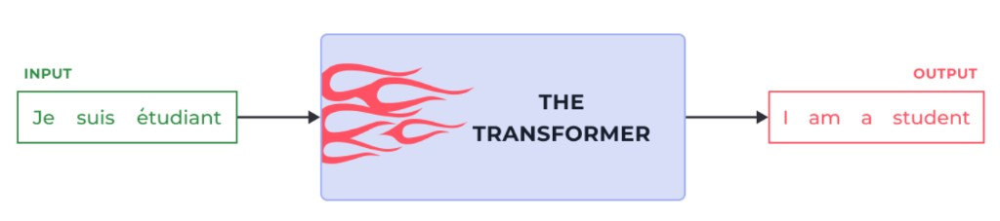

**Ідея:** на найвищому рівні Transformer — це та сама модель seq2seq (тема 12): бере вхідну послідовність і видає вихідну. Різниця — у тому, як він це робить усередині.

### Чому відмовились від RNN/LSTM?

Пригадаємо теми 11–12:

| Проблема RNN/LSTM | Наслідок | Рішення у Transformer |
|---|---|---|
| **Послідовне обчислення**: крок t залежить від t−1 | Неможливо паралелізувати по часу | Self-attention обробляє всі позиції одночасно |
| **Bottleneck контекстного вектора** (тема 12): одне число стискає весь контекст | Губиться інформація при довгих послідовностях | Attention до всіх прихованих станів |
| **Vanishing gradient** (тема 11): граідєнт зникає на довгих послідовностях | «Забуває» початок речення | Пряме з'єднання між будь-якими позиціями |
| **Складна архітектура** LSTM: 4 ворота | Багато параметрів, повільне навчання | Простіша структура (Q/K/V + FFN) |

> 💡 Transformer використовує attention до **всіх позицій одночасно** — звідси лінійна складність по позиціях, а не квадратична у порівнянні з BPTT.

### Transformer у сімействі seq2seq

```
RNN Seq2Seq   (тема 12): [Encoder RNN] → context vector → [Decoder RNN]
Attention     (тема 12): [biGRU Encoder] + attention → [GRU Decoder]
Transformer   (тема 13): [Self-Attention + FFN] × 6 + [Masked SA + Enc-Dec A + FFN] × 6
```

---

## ЧАСТИНА 2. СТЕК ЕНКОДЕРІВ І ДЕКОДЕРІВ

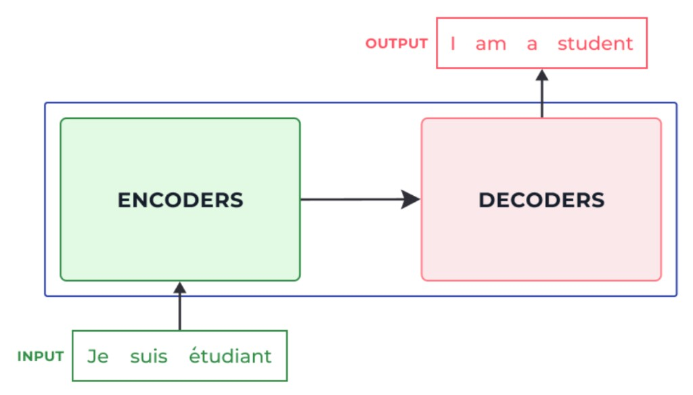

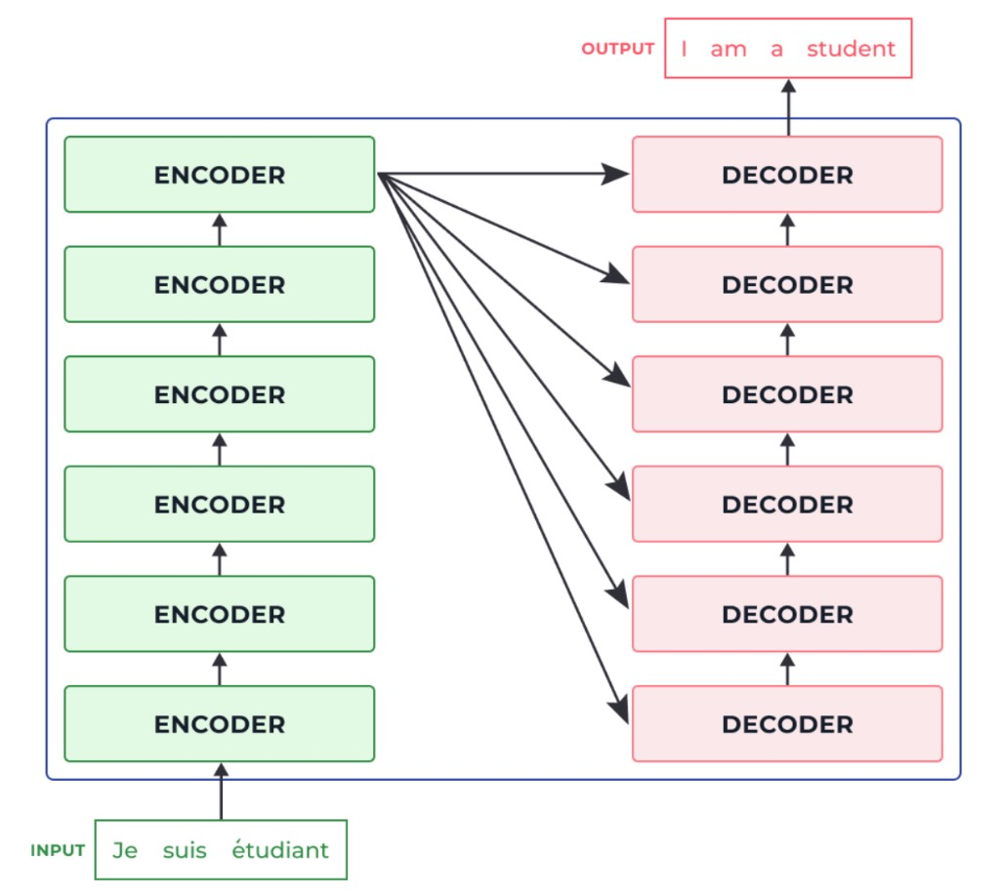

**Ідея:** всередині чорної скриньки Transformer = стек із 6 **Encoderів** і 6 **Decoderів**. Число 6 — не магія, це гіперпараметр (у BERT: 12, у GPT-3: 96).

### Ключові факти стеку

| | Encoder | Decoder |
|---|---|---|
| **Кількість блоків** | 6 (оригінал) | 6 (оригінал) |
| **Підшари** | Self-Attention + FFN | Masked SA + Enc-Dec Attention + FFN |
| **Чи ділять ваги?** | НІ — кожен блок має свої ваги | НІ |
| **Вхід першого блоку** | Word embeddings + PE | Попередні вихідні токени + PE |
| **Вихід останнього блоку** | K, V матриці → в кожен Decoder | Вектор для Linear + Softmax |

> ⚠️ «Однакова структура» означає однаковий **тип** підшарів, але **різні навчені ваги**. Encoder #0 і Encoder #5 — це різні нейронні мережі з різними параметрами.

---

## ЧАСТИНА 3. ТЕНЗОРИ В TRANSFORMER

### Вхідні ембединги

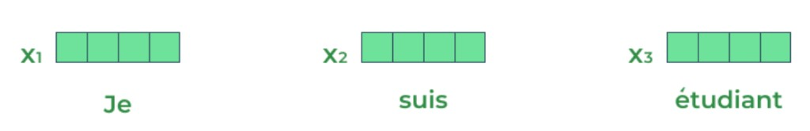

Текст перетворюється на вектори **один раз**, перед подачею у перший Encoder:

```
"Je suis étudiant"  →  токенізація  →  [Je, suis, étudiant]
                    →  Embedding   →  [x₁, x₂, x₃],  кожен ∈ ℝ^512
                    →  + PE         →  [x₁+t₁, x₂+t₂, x₃+t₃]
                    →  Encoder #0  →  [z₁, z₂, z₃],  кожен ∈ ℝ^512
```

**Розмір ембедингу 512** — гіперпараметр (у BERT-base: 768).

### Потік через Encoder

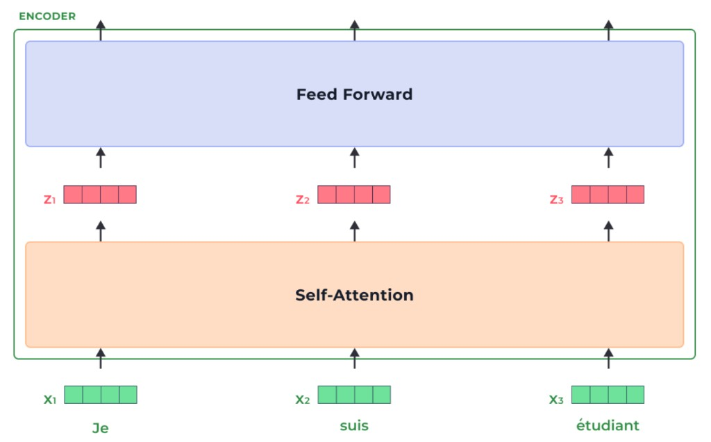

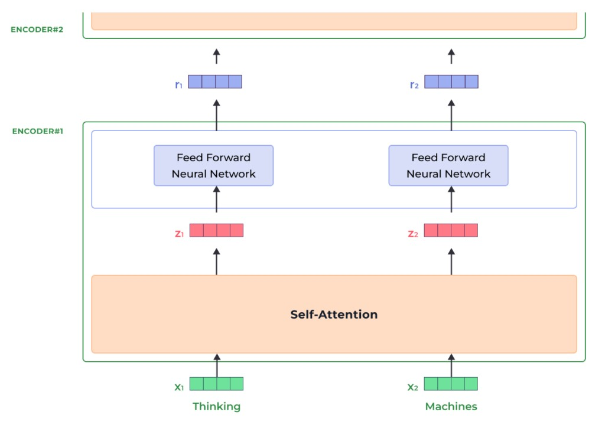

**Ключова властивість**: кожне слово проходить **власний шлях** через Encoder.

| Шар | Залежності між позиціями | Паралелізм |
|---|---|---|
| Self-Attention | ТАК — z₁ залежить від x₁, x₂, x₃ | Частковий (матрична операція) |
| FFN | НІ — кожен токен незалежно | Повний |

---

## ЧАСТИНА 4. SELF-ATTENTION

### 4.1 Інтуїція

**Проблема:** у реченні «The animal didn't cross the street because **it** was too tired» — що таке «it»? Вулиця чи тварина?


Self-Attention дозволяє моделі при кодуванні «it» **дивитися на всі інші позиції** і знаходити підказки. На 5-му шарі Encoder найбільша увага — на «The» і «animal».

> 💡 Це те саме, що Bahdanau Attention у темі 12 — але тепер застосовується **між токенами однієї і тієї ж послідовності** (звідси «self»), а не між encoder і decoder.

### 4.2 Q/K/V — покроково (6 кроків)

Для кожного токена xᵢ (вектор ∈ ℝ^d_model) навчена модель навчає три проекції:

$$q_i = x_i W_Q, \quad k_i = x_i W_K, \quad v_i = x_i W_V$$

| Символ | Розмір | Роль | Аналогія |
|---|---|---|---|
| qᵢ (Query) | (dₖ,) = (64,) | «Що шукаємо» | Запит у пошуковій системі |
| kᵢ (Key) | (dₖ,) = (64,) | «Що пропонуємо» | Тег/ключове слово документа |
| vᵢ (Value) | (d_v,) = (64,) | «Що повертаємо» | Сам вміст документа |
| W_Q | (512, 64) | Матриця проекції для Query | Навчається при тренуванні |
| W_K | (512, 64) | Матриця проекції для Key | Навчається при тренуванні |
| W_V | (512, 64) | Матриця проекції для Value | Навчається при тренуванні |

> 💡 Чому 64, а не 512? 512 / 8 голів = 64. Кожна голова працює у підпросторі розміром 64.

**Крок 1 — Обчислюємо Q, K, V** для кожного токена (множимо embedding × матриця ваг).

**Крок 2 — Обчислюємо score (raw attention):**

$$e_{ij} = q_i \cdot k_j$$

Для токена «Thinking» (i=1): рахуємо dot product з k₁, k₂, ... — наскільки «Thinking» має звертати увагу на кожний інший токен.

**Крок 3 — Масштабуємо на √dₖ:**

$$\tilde{e}_{ij} = \frac{q_i \cdot k_j}{\sqrt{d_k}}$$

**Крок 4 — Softmax → ваги уваги αᵢⱼ:**

$$\alpha_{ij} = \frac{\exp(\tilde{e}_{ij})}{\sum_j \exp(\tilde{e}_{ij})}$$

Усі αᵢⱼ > 0, Σⱼ αᵢⱼ = 1.

**Крок 5 — Зважена сума Values:**

$$z_i = \sum_j \alpha_{ij} \cdot v_j$$

**Крок 6 — Результат zᵢ** — нове представлення токена i, яке «вбирає» в себе інформацію від усіх інших токенів відповідно до ваг уваги.

### 4.3 Матрична форма Self-Attention

На практиці всі токени обробляються паралельно у матричній формі:

$$\text{Attention}(Q, K, V) = \text{softmax}\!\left(\frac{Q K^T}{\sqrt{d_k}}\right) V$$

**Розшифровка символів:**

| Символ | Форма | Що означає |
|---|---|---|
| Q | (n, dₖ) | Query-матриця: всі n токенів одночасно |
| K | (n, dₖ) | Key-матриця |
| Kᵀ | (dₖ, n) | Транспонована Key |
| QKᵀ | (n, n) | Raw scores: кожна пара токенів |
| √dₖ | скаляр | Масштабуючий знаменник (= 8 для dₖ=64) |
| softmax(·) | (n, n) → (n, n) | Нормалізує рядки (Σⱼ αᵢⱼ = 1) |
| V | (n, d_v) | Value-матриця |
| Attention(Q,K,V) | (n, d_v) | Нові представлення всіх токенів |

### 4.4 Чому ділимо на √dₖ, а не на dₖ?

**Проблема:** при великому dₖ dot products Q·Kᵀ стають дуже великими → softmax «насичується» → градієнти зникають (занадто маленькі).

**Чому √dₖ:** якщо компоненти Q і K — i.i.d. зі середнім 0 і дисперсією 1, то dot product має дисперсію dₖ, а значить стандартне відхилення √dₖ. Ділення на √dₖ нормалізує дисперсію до 1.

$$\text{Var}(q \cdot k) = d_k \cdot \sigma^2_q \cdot \sigma^2_k \xrightarrow{\text{ділимо}} 1$$

> ⚠️ Ділення на dₖ (а не √dₖ) занадто сильно масштабує вниз і уповільнює навчання.

### 4.5 Multi-Head Attention

**Ідея:** замість одного набору Q/K/V — запускаємо **h=8 паралельних голів**, кожна у своєму підпросторі. Потім конкатенуємо і проектуємо назад.

$$\text{MultiHead}(Q, K, V) = \text{Concat}(\text{head}_1, \ldots, \text{head}_h) \cdot W_O$$

де кожна голова:

$$\text{head}_i = \text{Attention}(Q W_{Q_i},\; K W_{K_i},\; V W_{V_i})$$

**Навіщо кілька голів?**

| Голова | Що може вивчити |
|---|---|
| head₁ | Синтаксичні залежності (підмет-присудок) |
| head₂ | Кореференцію (it → animal) |
| head₃ | Семантичну схожість слів |
| head₄-₈ | Інші аспекти контексту |

**Форми тензорів (dₖ = d_v = 64, h = 8, d_model = 512):**

| Параметр | Форма | Коментар |
|---|---|---|
| W_Qᵢ, W_Kᵢ, W_Vᵢ | (512, 64) | Для кожної з 8 голів |
| headᵢ | (n, 64) | Вихід однієї голови |
| Concat всіх голів | (n, 512) | 8 × 64 = 512 |
| W_O | (512, 512) | Проекція назад до d_model |
| Вихід MultiHead | (n, 512) | Новий контекстуалізований вектор |

### 4.6 Залишкове з'єднання + LayerNorm + FFN

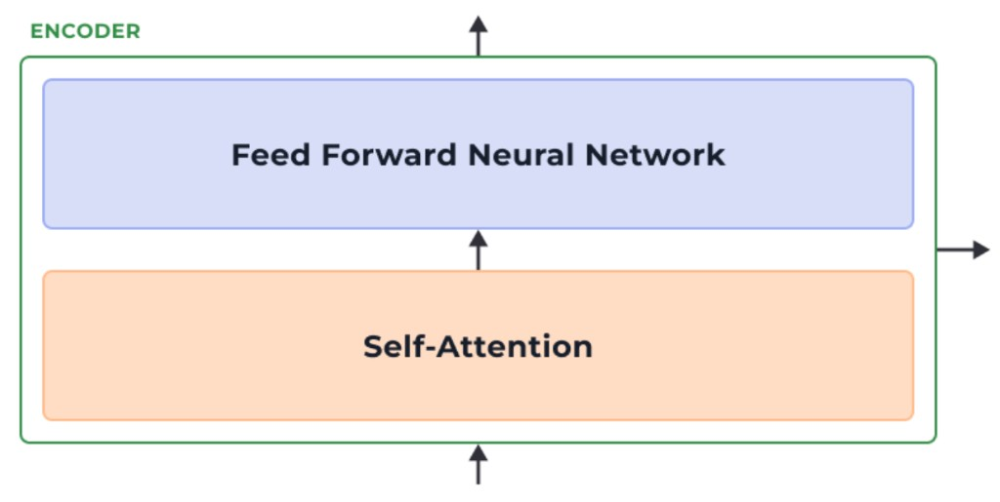

Кожен підшар Encoder'а обгорнутий **залишковим з'єднанням (residual connection)** і нормалізацією:

$$\text{SubLayer Output} = \text{LayerNorm}(x + \text{Sublayer}(x))$$

**Повна послідовність у блоці Encoder:**

```
x → [Self-Attention] → + x → LayerNorm → z
z → [FFN]            → + z → LayerNorm → r  (вихід блоку)
```

**FFN (Feed-Forward Network) — дві лінійні трансформації з ReLU:**

$$\text{FFN}(x) = \max(0,\; x W_1 + b_1) W_2 + b_2$$

| Параметр | Розмір | Коментар |
|---|---|---|
| W₁ | (512, 2048) | Розширення у 4 рази |
| W₂ | (2048, 512) | Стиснення назад |
| ReLU | — | Нелінійність між двома проекціями |

**Чому залишкове з'єднання?** Без нього глибокі мережі складно тренувати (vanishing gradient). `x + Sublayer(x)` дозволяє градієнту «протікати» напряму.

**Чому LayerNorm, а не BatchNorm?** LayerNorm нормалізує по вимірах одного зразка (а не по батчу) → стабільна при різних довжинах послідовностей.

### 4.7 Порівняльна таблиця: Bahdanau (тема 12) vs Self-Attention

| | Bahdanau (тема 12) | Self-Attention (тема 13) |
|---|---|---|
| **Між чим?** | Decoder прихований стан ↔ Encoder виходи | Токени однієї послідовності між собою |
| **Мета** | Decoder дивиться на Encoder при генерації | Encoder «розуміє» відносини між токенами |
| **Тип увага** | Cross-attention | Self-attention |
| **Формула score** | eᵢₜ = vᵀ tanh(W₁hₜ + W₂hᵢ) | eᵢⱼ = (qᵢ · kⱼ) / √dₖ |
| **Паралелізм** | Послідовний (крок за кроком) | Паралельний (матрична операція) |
| **Контекст** | Один вектор cₜ на крок декодера | n векторів zᵢ одночасно для всіх токенів |

---

## ЧАСТИНА 5. POSITIONAL ENCODING


**Проблема:** Self-Attention — це множення матриць, яке **не залежить від порядку**. Якщо переставити токени, результат attention той самий (переставляться лише рядки). Модель «не знає», де яке слово.

**Рішення:** перед подачею у Encoder додати до кожного ембедингу вектор-позицію:

$$x_i^{\text{input}} = \text{Embedding}(w_i) + \text{PE}(i)$$

**Формула Positional Encoding (sin/cos):**

$$\text{PE}(\text{pos}, 2k) = \sin\!\left(\frac{\text{pos}}{10000^{2k/d_{\text{model}}}}\right)$$

$$\text{PE}(\text{pos}, 2k+1) = \cos\!\left(\frac{\text{pos}}{10000^{2k/d_{\text{model}}}}\right)$$

**Розшифровка символів:**

| Символ | Що означає |
|---|---|
| pos | Позиція токена в послідовності (0, 1, 2, …) |
| k | Індекс виміру (0 ≤ k < d_model/2) |
| d_model | Розмірність ембедингу (512) |
| 10000 | База (гіперпараметр оригінальної статті) |
| 2k | Парні виміри → sin |
| 2k+1 | Непарні виміри → cos |

**Чому sin/cos?**

1. **Унікальність:** кожна позиція → унікальний вектор.
2. **Масштабованість:** модель може «узагальнити» на довжини послідовностей, яких не бачила під час навчання.
3. **Відносна позиція:** PE(pos+k) можна виразити як лінійну функцію від PE(pos) — модель може навчитися відстані між словами.

> 💡 BERT і більшість сучасних моделей використовують **навчені** позиційні ембединги замість фіксованих sin/cos. Ефект однаковий, але навчені краще адаптуються до даних.

---

## ЧАСТИНА 6. ДЕКОДЕР

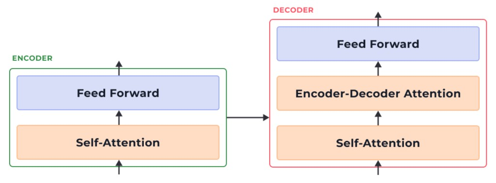

**Ідея:** Decoder генерує вихідну послідовність **токен за токеном**, автоматично звертаючись до виходів Encoder через Encoder-Decoder Attention.

### 6.1 Три підшари Decoder

1. **Masked Self-Attention** — як і у Encoder, але з маскуванням майбутніх позицій.
2. **Encoder-Decoder Attention** — Q від Decoder, K/V від останнього Encoder.
3. **FFN** — та сама Feed-Forward мережа.

Кожен підшар обгорнутий у `LayerNorm(x + Sublayer(x))`.

### 6.2 Masked Self-Attention

При **тренуванні** Decoder отримує всю вихідну послідовність одразу (Teacher Forcing — тема 12). Але токен на позиції t не повинен «бачити» токени t+1, t+2, ... — інакше задача тривіальна.

**Рішення:** маскування (Causal Masking):

$$\tilde{e}_{ij} = \begin{cases} q_i \cdot k_j / \sqrt{d_k} & \text{якщо } j \leq i \\ -\infty & \text{якщо } j > i \end{cases}$$

після softmax: exp(−∞) = 0 → нульові ваги для майбутніх токенів.

### 6.3 Encoder-Decoder Attention

Другий підшар Decoder — це **cross-attention**:
- **Q** (Query) приходить з виходу Masked Self-Attention Decoder'а
- **K, V** (Key, Value) приходять від **виходу останнього Encoder** (передаються до кожного з 6 Decoder-блоків)

Це відповідає Bahdanau Attention з теми 12: Decoder «дивиться» на весь вхід і вирішує, чому надати увагу.

```
Encoder вихід  ──► K, V ──►  Encoder-Decoder Attention Layer
                              ▲
Decoder (Masked SA) вихід ──► Q
```

### 6.4 Декодування — крок за кроком

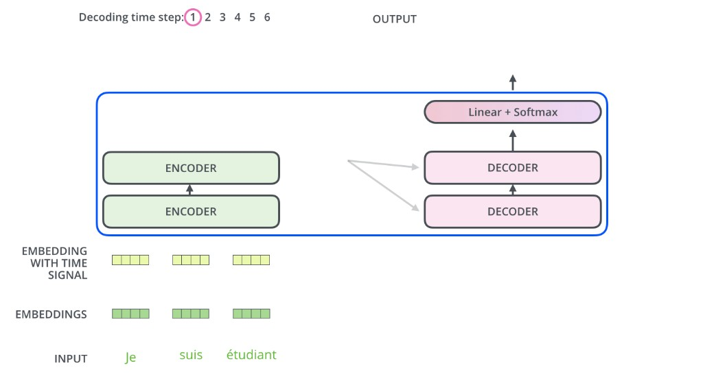

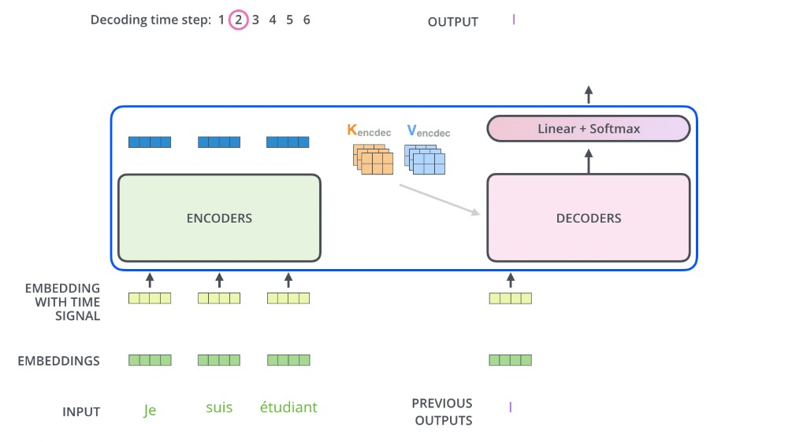

**Крок 1 (t=1):** Decoder отримує `[<BOS>]` (початок речення) + K/V від Encoder → генерує «I».

**Крок 2 (t=2):** Decoder отримує `[<BOS>, I]` + K/V від Encoder → генерує «am».

... і так далі до `[<EOS>]`.

### 6.5 Linear + Softmax → слово

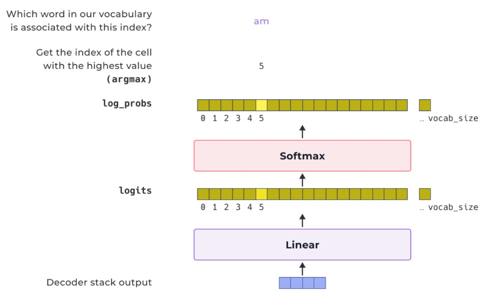

1. **Linear layer:** вектор (512,) → logits (vocab_size,) ≈ (30 000,)
2. **Softmax:** logits → ймовірності (всі > 0, сума = 1)
3. **Argmax (greedy decoding):** беремо слово з найвищою ймовірністю
4. **Beam search (альтернатива):** зберігаємо top-K гіпотез → краща якість, але повільніше

**Формула:**

$$P(w | \text{context}) = \text{softmax}(h_t W_{\text{out}} + b)_w$$

| Символ | Що означає |
|---|---|
| hₜ | Вихід Decoder на кроці t: (1, 512) |
| W_out | Матриця виходу: (512, vocab_size) |
| softmax(·)_w | Ймовірність w-го слова словника |

---

## ЧАСТИНА 6.5. BERT vs GPT І ІНШІ TRANSFORMER-АРХІТЕКТУРИ

### BERT vs GPT — порівняльна таблиця

| Характеристика | BERT | GPT |
|---|---|---|
| **Тип архітектури** | Encoder-only (тільки стек Encoder) | Decoder-only (тільки стек Decoder з masking) |
| **Напрямок контексту** | Двонаправлений (бачить обидва боки токена) | Однонаправлений (лише попередні токени) |
| **Pretraining (ціль 1)** | MLM: 15% токенів маскуються → модель передбачає їх | Autoregressive LM: передбачає наступний токен |
| **Pretraining (ціль 2)** | NSP: два речення A, B → чи B йде після A? | — |
| **Типові задачі** | Класифікація, NER, QA, заповнення пропусків | Генерація тексту, діалогові системи, переклад |
| **Вихідні дані** | Контекстуалізовані вектори всіх токенів | Наступний токен |
| **Переваги** | Повне розуміння контексту | Висока здатність до генерації |
| **Недоліки** | Не підходить для генеративних задач | Обмежений однобічний контекст |
| **Відома версія** | BERT-base (110M param), BERT-large (340M) | GPT-2 (1.5B), GPT-3 (175B), GPT-4 |

**MLM (Masked Language Model) — деталі:**
- 15% токенів замінюються на `[MASK]`
- 80% → `[MASK]`, 10% → випадковий токен, 10% → без змін
- Модель навчається відновлювати оригінальний токен

**NSP (Next Sentence Prediction):**
- 50% — реальна пара речень (IsNext = 1)
- 50% — випадкова пара (NotNext = 0)
- `[CLS]` вектор використовується для класифікації

**Autoregressive LM (GPT):**

$$P(x_1, x_2, \ldots, x_n) = \prod_{t=1}^{n} P(x_t | x_1, \ldots, x_{t-1})$$

### PEGASUS — для сумаризації

**Ідея:** Gap-Sentence Generation (GSG) — замість маскування окремих токенів, видаляються цілі **важливі речення** (відібрані за ROUGE-score з рештою тексту). Модель навчається відновлювати ці речення.

- Архітектура: encoder-decoder (як T5)
- Pretrain data: C4 або HugeNews (~1500 GB тексту)
- Особливість: gap sentences ≈ abstractive summary → pretrain безпосередньо готує до сумаризації
- HuggingFace: [`google/pegasus-large`](https://huggingface.co/google/pegasus-large)

### T5 — Text-to-Text Transfer Transformer

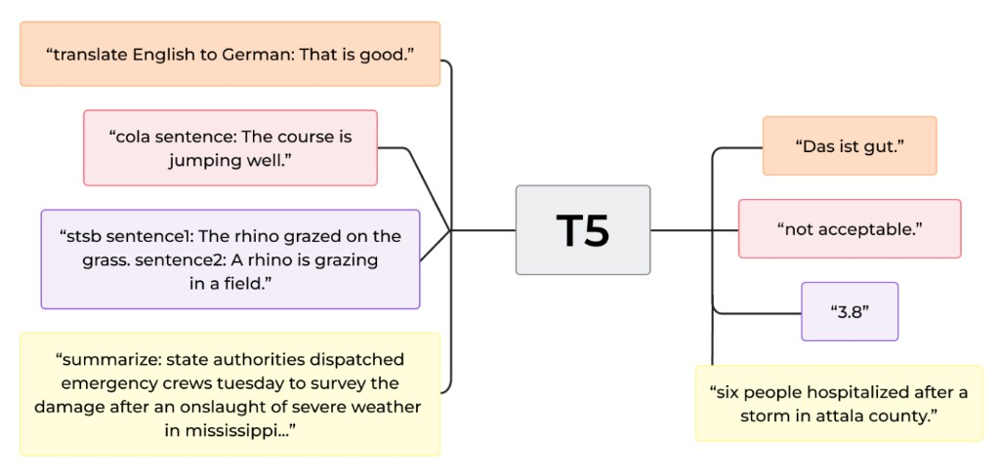

**Ідея:** **всі NLP-задачі — це текст → текст**. Класифікацію, переклад, сумаризацію, QA форматують як рядковий вхід → рядковий вихід.

```
Вхід:  "translate English to German: That is good."
Вихід: "Das ist gut."

Вхід:  "summarize: state authorities dispatched emergency crews..."
Вихід: "six people hospitalized after a storm in attala county."

Вхід:  "cola sentence: The course is jumping well."
Вихід: "not acceptable."
```

- Архітектура: encoder-decoder, pretrain: span corruption (маскування діапазонів токенів)
- Розміри: T5-small (60M), T5-base (220M), T5-large (770M), T5-3B, T5-11B
- HuggingFace: [`google-t5/t5-base`](https://huggingface.co/google-t5/t5-base)

### BART — Bidirectional and Auto-Regressive Transformers

**Ідея:** комбінація переваг BERT (двонаправлений encoder) і GPT (авторегресивний decoder).

- **Pretrain:** denoising autoencoder — вхід «зашумлюється» (видалення токенів, перестановка речень, token masking, text infilling), модель відновлює оригінал
- **Архітектура:** encoder-decoder (BERT encoder + GPT decoder)
- **Задачі:** абстрактна сумаризація, генерація тексту, переклад
- HuggingFace: [`facebook/bart-base`](https://huggingface.co/facebook/bart-base)

### Порівняльна таблиця архітектур

| Модель | Архітектура | Pretrain-ціль | Найкращий для | Pretrain data |
|---|---|---|---|---|
| BERT | Encoder-only | MLM + NSP | Розуміння тексту, QA, NER | Wikipedia + Books |
| GPT | Decoder-only | Autoregressive LM | Генерація тексту | WebText |
| T5 | Enc-Dec | Span corruption | Будь-яка NLP задача | C4 (750 GB) |
| BART | Enc-Dec | Denoising AE | Сумаризація, переклад | Books + Wikipedia |
| PEGASUS | Enc-Dec | GSG | Абстрактна сумаризація | C4 + HugeNews |

---

## ЧАСТИНА 6.6. EXTRACTIVE QUESTION ANSWERING — SQUAD

![BERT QA start/end logits: рядки токенів [CLS] This is the question [SEP] This is the context...; під кожним токеном два числа — Start і End логіти (0 або 1); токени «is» і «here» мають Start=1, End=1 відповідно](images/bert_qa_start_end_logits.png)

### Що таке Extractive QA?

**Ідея:** маємо контекстний текст і запитання → відповідь — це **фрагмент (span)** тексту в контексті. Модель **не генерує** нові слова, а знаходить початок і кінець відповіді.

```
Контекст: "...Virgin Mary reputedly appeared to Saint Bernadette Soubirous in 1858..."
Питання:  "To whom did the Virgin Mary allegedly appear in 1858?"
Відповідь: "Saint Bernadette Soubirous"  (span у контексті)
```

### SQuAD (Stanford Question Answering Dataset)

| | Train | Validation |
|---|---|---|
| Прикладів | 87 599 | 10 570 |
| Відповідей на питання | 1 (завжди) | 1–3 (кілька анотаторів) |
| Джерело | Статті Вікіпедії | Статті Вікіпедії |

**Формат даних:**

```python
{
  "id": "5733be284776f41900661182",
  "title": "University_of_Notre_Dame",
  "context": "Architecturally, the school has a Catholic character...",
  "question": "To whom did the Virgin Mary allegedly appear in 1858?",
  "answers": {
      "text": ["Saint Bernadette Soubirous"],
      "answer_start": [515]       # символьна позиція в context
  }
}
```

### Як BERT вирішує QA задачу?

BERT отримує **пару (питання + контекст)** як один рядок:

```
[CLS] питання [SEP] контекст [SEP]
```

На виході QA-head (два лінійних шари по одному нейрону на токен):
- **start_logit[i]** — оцінка, що i-й токен є початком відповіді
- **end_logit[i]** — оцінка, що i-й токен є кінцем відповіді

Відповідь = `context[offset_start : offset_end]`.

### Метрики SQuAD

**Exact Match (EM):**

$$EM = \mathbb{1}[\text{pred} = \text{gold}]$$

- 1 якщо передбачення дослівно збігається з еталоном (після нормалізації)
- 0 інакше
- При кількох відповідях — береться максимум по всіх золотих

**F1 Score (на рівні токенів/слів):**

$$\text{Precision} = \frac{|\text{pred} \cap \text{gold}|}{|\text{pred}|}$$

$$\text{Recall} = \frac{|\text{pred} \cap \text{gold}|}{|\text{gold}|}$$

$$F1 = \frac{2 \cdot \text{Precision} \cdot \text{Recall}}{\text{Precision} + \text{Recall}}$$

де ∩ — спільні слова між передбаченням і еталоном.

**Приклад:**

| Передбачення | Еталон | EM | F1 |
|---|---|---|---|
| "Saint Bernadette Soubirous" | "Saint Bernadette Soubirous" | 1.0 | 1.0 |
| "Bernadette Soubirous" | "Saint Bernadette Soubirous" | 0.0 | 0.8 |
| "Saint Bernadette" | "Saint Bernadette Soubirous" | 0.0 | 0.8 |
| "the animal" | "Saint Bernadette Soubirous" | 0.0 | 0.0 |

---

## ПРАКТИЧНА ЧАСТИНА — ПОВНИЙ PIPELINE (ЧАСТИНИ 7–13)

> Тут — весь код від встановлення бібліотек до fine-tuned BERT моделі. Виконуй кроки по порядку зверху вниз. Кроки пронумеровані глобально (1–25) через усі частини. Один «Практичний крок» може містити одну або кілька Kaggle-клітинок.

### Карта pipeline

| Блок | Що робимо | Навіщо | Кроки |
|---|---|---|---|
| **1 — Середовище** | pip install, імпорти, device | Підготовка інфраструктури | 1–4 |
| **2 — Дані SQuAD** | load_dataset, огляд прикладів, filter | Розуміємо формат і структуру | 5–7 |
| **3 — Модель і токенізатор** | bert-base-cased, AutoModelForQuestionAnswering | Завантажуємо предтреновану модель | 8–9 |
| **4 — Sliding window** | max_length, stride, overflow mapping, offsets demo | Розуміємо фрагментацію довгих контекстів | 10–13 |
| **5 — Препроцесинг** | preprocess_training/validation_examples | Формуємо train і validation datasets | 14–17 |
| **6 — Тренування** | metric, DataLoader, AdamW, compute_metrics | Визначаємо усі компоненти тренування | 18–21 |
| **7 — Fine-tuning** | 3 епохи, збереження, результати, inference | Fine-tuning і оцінка моделі | 22–25 |

---

## ЧАСТИНА 7. ПІДГОТОВКА СЕРЕДОВИЩА — KAGGLE

### Підключення на Kaggle

1. Відкрий [kaggle.com](https://www.kaggle.com) → **New Notebook**
2. Settings → Accelerator → **GPU P100**
3. Settings → Internet → **On** (потрібно для `load_dataset("squad")` і завантаження моделі)
4. Запусти клітинки по порядку

> ⚠️ Якщо RAM не вистачає (OOM) — використай `sample_n_examples(p=0.4)` у Кроці 5-б, щоб зменшити датасет.

---

> ### БЛОК 1 — Середовище (Кроки 1–4)
> **Що робимо:** встановлюємо бібліотеки, імпортуємо модулі, визначаємо device.
> **Навіщо:** без rouge_score і evaluate модель неможливо оцінити; без CUDA навчання займе дні.

### Практичний крок 1 — Знаходимо шляхи і створюємо директорії

```python
import os

# Переглядаємо структуру /kaggle/input (після Add Data)
for dirname, _, filenames in os.walk('/kaggle/input'):
    for filename in filenames:
        print(os.path.join(dirname, filename))

# Створюємо директорію для збереження моделей
os.makedirs('/kaggle/working/bert-finetuned-squad', exist_ok=True)
print("Директорії готові")
```

**Пояснення змінних:**

| Змінна | Тип | Що містить |
|---|---|---|
| dirname | str | Поточна директорія в os.walk |
| filenames | list | Файли у директорії |

**Очікуваний вивід:**

```
(порожньо або список файлів якщо є датасети)
Директорії готові
```

### Практичний крок 2 — Встановлюємо бібліотеки

```python
# rouge_score потрібна для evaluate при сумаризаційних задачах
!pip install rouge_score -q
# evaluate — сучасна бібліотека HuggingFace для метрик
!pip install evaluate -q
```

**Очікуваний вивід:**

```
Successfully installed rouge_score-...
Successfully installed evaluate-...
```

### Практичний крок 3 — Імпортуємо бібліотеки

```python
import warnings
warnings.filterwarnings('ignore')

import gc
import random
import collections  # потрібен для compute_metrics (defaultdict)

import numpy as np

from datasets import load_dataset
from datasets import DatasetDict

from tqdm.auto import tqdm  # автоматично вибирає notebook або terminal tqdm
# from tqdm import tqdm_notebook as tqdm  ← застарілий варіант (PyTorch < 1.9)

import torch
from torch.utils.data import DataLoader

from transformers import pipeline
from transformers import AutoModelForSeq2SeqLM, AutoTokenizer
from transformers import AutoModelForQuestionAnswering
from transformers import DataCollatorForSeq2Seq
from transformers import AdamW  # трохи застарілий, але ще підтримується
# from torch.optim import AdamW  ← рекомендований сучасний варіант (PyTorch 1.8+)
from transformers import default_data_collator

import evaluate

print("Всі бібліотеки завантажені!")
print(f"PyTorch version: {torch.__version__}")
```

**Пояснення змінних:**

| Модуль | Навіщо |
|---|---|
| collections | defaultdict для compute_metrics |
| tqdm.auto | Прогрес-бар, сумісний з Kaggle/Colab |
| DataLoader | Батч-завантаження тренувальних даних |
| AdamW | Оптимізатор з weight decay (рекомендований для BERT) |
| default_data_collator | Збирає батчи з torch-тензорів без padding |

**Очікуваний вивід:**

```
Всі бібліотеки завантажені!
PyTorch version: 2.x.x
```

### Практичний крок 4 — Визначаємо device

```python
# Використовуємо GPU якщо доступна; None = CPU
device = "cuda" if torch.cuda.is_available() else None
print(f"Device: {device}")
```

**Очікуваний вивід:**

```
Device: cuda
```

> ⚠️ Якщо `device: None` — перевір Settings → Accelerator → GPU P100.

---

> ### БЛОК 2 — Дані SQuAD (Кроки 5–7)
> **Що робимо:** завантажуємо датасет SQuAD, вивчаємо структуру полів, перевіряємо кількість відповідей.
> **Навіщо:** розуміємо вхідний формат і особливості (одна відповідь у train, кілька у validation).

### Практичний крок 5 — Завантажуємо SQuAD

```python
# Завантажуємо SQuAD з HuggingFace Hub (потрібен Internet ON)
raw_datasets = load_dataset("squad")
print(raw_datasets)
```

**Пояснення змінних:**

| Змінна | Тип | Що містить |
|---|---|---|
| raw_datasets | DatasetDict | {'train': Dataset, 'validation': Dataset} |

**Очікуваний вивід:**

```
DatasetDict({
    train: Dataset({
      features: ['id', 'title', 'context', 'question', 'answers'],
      num_rows: 87599
    })
    validation: Dataset({
      features: ['id', 'title', 'context', 'question', 'answers'],
      num_rows: 10570
    })
})
```

### Практичний крок 5-б — Опційний семплінг (якщо OOM)

```python
def sample_n_examples(dataset, p):
    """Вибираємо p-долю від датасету для швидшого навчання"""
    n = int(len(dataset) * p)
    indices = random.sample(range(len(dataset)), n)
    return dataset.select(indices)

# Розкоментуй якщо не вистачає RAM або часу:
# p = 0.4  # 40% від датасету
# sampled = {split: sample_n_examples(dataset, p)
#            for split, dataset in raw_datasets.items()}
# raw_datasets = DatasetDict(sampled)
# print("Семплований датасет:", raw_datasets)
```

### Практичний крок 6 — Переглядаємо перший приклад

```python
# Виводимо context, question і answer першого прикладу
print("Context: ", raw_datasets["train"][0]["context"])
print("Question: ", raw_datasets["train"][0]["question"])
print("Answer: ", raw_datasets["train"][0]["answers"])
```

**Очікуваний вивід:**

```
Context:  Architecturally, the school has a Catholic character. Atop the Main
Building's gold dome is a golden statue of the Virgin Mary...
Question:  To whom did the Virgin Mary allegedly appear in 1858 in Lourdes France?
Answer:  {'text': ['Saint Bernadette Soubirous'], 'answer_start': [515]}
```

### Практичний крок 7 — Перевіряємо кількість відповідей

```python
# У тренувальному наборі завжди одна відповідь — перевіряємо
result = raw_datasets["train"].filter(lambda x: len(x["answers"]["text"]) != 1)
print(f"Приклади з ≠ 1 відповіддю (train): {len(result)}")  # очікуємо 0

# У валідації — кілька відповідей (різні анотатори)
print("\nValidation answers[0]:", raw_datasets["validation"][0]["answers"])
print("Validation answers[2]:", raw_datasets["validation"][2]["answers"])
```

**Пояснення:**

| Поле | Що означає |
|---|---|
| answers["text"] | Список текстів відповіді (1 у train, 1–3 у validation) |
| answers["answer_start"] | Символьна позиція відповіді у context |

**Очікуваний вивід:**

```
Приклади з ≠ 1 відповіддю (train): 0

Validation answers[0]: {'text': ['Denver Broncos', 'Denver Broncos', 'Denver Broncos'],
                         'answer_start': [177, 177, 177]}
Validation answers[2]: {'text': ['Santa Clara, California', "Levi's Stadium",
                                  "Levi's Stadium in the San Francisco Bay Area..."],
                         'answer_start': [403, 355, 355]}
```

---

> ### БЛОК 3 — Модель і токенізатор (Кроки 8–9)
> **Що робимо:** завантажуємо bert-base-cased і відповідний токенізатор.
> **Навіщо:** BERT-base-cased — 12 шарів, 768-dim, case-sensitive; добре підходить для QA де регістр важливий.

### Практичний крок 8 — Завантажуємо модель і токенізатор

```python
# bert-base-cased: 12 блоків encoder, 768-dim, 12 голів, 110M параметрів
model_checkpoint = "bert-base-cased"

# AutoModelForQuestionAnswering: BERT + QA head (два лінійних виходи)
model = AutoModelForQuestionAnswering.from_pretrained(model_checkpoint).to(device)
tokenizer = AutoTokenizer.from_pretrained(model_checkpoint)

# Підраховуємо параметри
total_params = sum(p.numel() for p in model.parameters())
print(f"Параметрів: {total_params:,}")
print(f"Model: {model_checkpoint}")
```

**Пояснення змінних:**

| Змінна | Тип | Що містить |
|---|---|---|
| model_checkpoint | str | Назва моделі на HuggingFace Hub |
| model | BertForQuestionAnswering | BERT + QA-head; на GPU |
| tokenizer | BertTokenizerFast | Токенізатор WordPiece для bert-base-cased |

**Очікуваний вивід:**

```
Параметрів: 108,893,186
Model: bert-base-cased
```

### Практичний крок 9 — Демонстрація токенізації пари (question, context)

```python
# Токенізуємо першу пару
context = raw_datasets["train"][0]["context"]
question = raw_datasets["train"][0]["question"]

# Наївна токенізація (без sliding window — лише для демонстрації)
inputs = tokenizer(question, context)
decoded = tokenizer.decode(inputs["input_ids"])
print(decoded[:200], "...")
print(f"\nКількість токенів: {len(inputs['input_ids'])}")
```

**Очікуваний вивід:**

```
[CLS] To whom did the Virgin Mary allegedly appear in 1858 in Lourdes France?
[SEP] Architecturally, the school has a Catholic character...
...
Кількість токенів: 163
```

> 💡 BERT вставляє `[CLS]` на початку і `[SEP]` між питанням і контекстом та в кінці. `token_type_ids=0` для питання, `=1` для контексту.

---

> ### БЛОК 4 — Sliding Window і Offset Mapping (Кроки 10–13)
> **Що робимо:** демонструємо розбиття довгих контекстів на фрагменти і механізм offset_mapping.
> **Навіщо:** BERT має обмеження max_length=512; контексти SQuAD можуть бути довшими.

### Практичний крок 10 — Демонстрація sliding window (max_length=100)

```python
# Демонстраційні параметри (у реальному коді використовуємо max_length=384)
inputs_demo = tokenizer(
    question,
    context,
    max_length=100,
    truncation="only_second",      # обрізаємо лише контекст (не питання)
    stride=50,                     # 50 токенів перекриття між фрагментами
    return_overflowing_tokens=True,  # повертаємо всі фрагменти, не лише перший
)

print(f"Кількість фрагментів: {len(inputs_demo['input_ids'])}\n")
for i, ids in enumerate(inputs_demo["input_ids"]):
    print(f"--- Фрагмент {i} ---")
    print(tokenizer.decode(ids)[:300])
    print()
```

**Пояснення змінних:**

| Параметр | Значення | Що робить |
|---|---|---|
| max_length | 100 (demo) / 384 (real) | Максимальна довжина вхідного рядка у токенах |
| truncation="only_second" | — | Обрізаємо лише context (другий аргумент); питання — ніколи |
| stride | 50 (demo) / 128 (real) | Кількість токенів перекриття між сусідніми фрагментами |
| return_overflowing_tokens | True | Якщо context довший за max_length → створюємо кілька фрагментів |

**Очікуваний вивід (скорочено):**

```
Кількість фрагментів: 4

--- Фрагмент 0 ---
[CLS] To whom did the Virgin Mary allegedly appear in 1858 in Lourdes France?
[SEP] Architecturally, the school has a Catholic character. Atop the Main
Building's gold dome is a golden statue of the Virgin Mary. Immediately in
front of the Main Building and facing it, is a copper... [SEP]

--- Фрагмент 1 ---
[CLS] To whom... [SEP] the Main Building and facing it, is a copper statue of
Christ with arms upraised... [SEP]
...
```

> 💡 Відповідь «Saint Bernadette Soubirous» з'являється лише у фрагментах 2 і 3. Для фрагментів 0 і 1 мітки будуть (0, 0) — відповідь поза контекстом.

### Практичний крок 11 — Демонстрація overflow_to_sample_mapping

```python
# Для одного прикладу — всі фрагменти мають sample_idx = 0
inputs_demo2 = tokenizer(
    question, context,
    max_length=100, truncation="only_second", stride=50,
    return_overflowing_tokens=True, return_offsets_mapping=True,
)
print("overflow_to_sample_mapping:", inputs_demo2["overflow_to_sample_mapping"])
print("dict_keys:", list(inputs_demo2.keys()))
```

**Очікуваний вивід:**

```
overflow_to_sample_mapping: [0, 0, 0, 0]
dict_keys: ['input_ids', 'token_type_ids', 'attention_mask',
            'offset_mapping', 'overflow_to_sample_mapping']
```

### Практичний крок 12 — Overflow mapping для кількох прикладів

```python
# 4 приклади → 19 фрагментів
inputs_multi = tokenizer(
    raw_datasets["train"][2:6]["question"],
    raw_datasets["train"][2:6]["context"],
    max_length=100, truncation="only_second", stride=50,
    return_overflowing_tokens=True, return_offsets_mapping=True,
)

print(f"4 приклади дали {len(inputs_multi['input_ids'])} фрагментів.")
print(f"Звідки кожен: {inputs_multi['overflow_to_sample_mapping']}")
```

**Очікуваний вивід:**

```
4 приклади дали 19 фрагментів.
Звідки кожен: [0, 0, 0, 0, 1, 1, 1, 1, 2, 2, 2, 2, 3, 3, 3, 3, 3, 3, 3]
```

### Практичний крок 13 — Обчислення start/end позицій вручну (демо)

```python
# Демонструємо логіку для 4 прикладів
answers_demo = raw_datasets["train"][2:6]["answers"]
start_positions_demo = []
end_positions_demo = []

for i, offset in enumerate(inputs_multi["offset_mapping"]):
    sample_idx = inputs_multi["overflow_to_sample_mapping"][i]
    answer = answers_demo[sample_idx]
    start_char = answer["answer_start"][0]
    end_char = start_char + len(answer["text"][0])
    sequence_ids = inputs_multi.sequence_ids(i)

    # Знаходимо початок і кінець контексту (sequence_id == 1)
    idx = 0
    while sequence_ids[idx] != 1:
        idx += 1
    context_start = idx
    while sequence_ids[idx] == 1:
        idx += 1
    context_end = idx - 1

    # Якщо відповідь поза контекстом → мітка (0, 0)
    if offset[context_start][0] > start_char or offset[context_end][1] < end_char:
        start_positions_demo.append(0)
        end_positions_demo.append(0)
    else:
        # Знаходимо токени відповіді через offset
        idx = context_start
        while idx <= context_end and offset[idx][0] <= start_char:
            idx += 1
        start_positions_demo.append(idx - 1)

        idx = context_end
        while idx >= context_start and offset[idx][1] >= end_char:
            idx -= 1
        end_positions_demo.append(idx + 1)

# Перевіряємо перший фрагмент
sample_idx0 = inputs_multi["overflow_to_sample_mapping"][0]
gold_answer = answers_demo[sample_idx0]["text"][0]
s, e = start_positions_demo[0], end_positions_demo[0]
predicted = tokenizer.decode(inputs_multi["input_ids"][0][s:e+1])
print(f"Золото: {gold_answer}")
print(f"Мітки дають: {predicted}")
```

**Пояснення змінних:**

| Змінна | Тип | Що містить |
|---|---|---|
| start_char, end_char | int | Символьні позиції відповіді у context |
| sequence_ids | list[int|None] | 0=питання, 1=context, None=[CLS]/[SEP] |
| context_start, context_end | int | Індекси першого і останнього токена контексту |
| offset[idx] | tuple(int,int) | (символ_початку, символ_кінця) для токена idx |

**Очікуваний вивід:**

```
Золото: Denver Broncos
Мітки дають: Denver Broncos
```

---

> ### БЛОК 5 — Препроцесинг (Кроки 14–17)
> **Що робимо:** застосовуємо preprocess_training_examples і preprocess_validation_examples до всього датасету.
> **Навіщо:** формуємо PyTorch-ready Dataset з усіма токенами, масками, мітками start/end.

### Практичний крок 14 — Визначаємо гіперпараметри токенізації

```python
# Реальні параметри для BERT-base (max 512, але ефективно використовуємо 384)
max_length = 384
stride = 128
```

**Пояснення:**

| Параметр | Значення | Обґрунтування |
|---|---|---|
| max_length | 384 | Більшість контекстів вміщується; залишаємо буфер до 512 |
| stride | 128 | Достатнє перекриття щоб відповідь не «випала» між фрагментами |

### Практичний крок 15 — Функція препроцесингу тренувальних даних

```python
def preprocess_training_examples(examples):
    """
    Токенізуємо пари (question, context) з sliding window.
    Формуємо мітки start_positions і end_positions для кожного фрагмента.
    """
    # Видаляємо зайві пробіли на початку/кінці питань
    questions = [q.strip() for q in examples["question"]]

    # Токенізуємо з ковзним вікном
    inputs = tokenizer(
        questions,
        examples["context"],
        max_length=max_length,
        truncation="only_second",        # не обрізаємо питання
        stride=stride,
        return_overflowing_tokens=True,
        return_offsets_mapping=True,
        padding="max_length",            # падінг до max_length для батчів
    )

    # Витягуємо і видаляємо допоміжні поля (не потрібні моделі)
    offset_mapping = inputs.pop("offset_mapping")
    sample_map = inputs.pop("overflow_to_sample_mapping")
    answers = examples["answers"]
    start_positions = []
    end_positions = []

    for i, offset in enumerate(offset_mapping):
        sample_idx = sample_map[i]
        answer = answers[sample_idx]
        start_char = answer["answer_start"][0]
        end_char = start_char + len(answer["text"][0])
        sequence_ids = inputs.sequence_ids(i)

        # Знаходимо межі контексту у токенізованій послідовності
        idx = 0
        while sequence_ids[idx] != 1:
            idx += 1
        context_start = idx
        while sequence_ids[idx] == 1:
            idx += 1
        context_end = idx - 1

        # Якщо відповідь поза цим фрагментом → мітка (0, 0)
        if offset[context_start][0] > start_char or offset[context_end][1] < end_char:
            start_positions.append(0)
            end_positions.append(0)
        else:
            # Знаходимо токени початку і кінця відповіді
            idx = context_start
            while idx <= context_end and offset[idx][0] <= start_char:
                idx += 1
            start_positions.append(idx - 1)

            idx = context_end
            while idx >= context_start and offset[idx][1] >= end_char:
                idx -= 1
            end_positions.append(idx + 1)

    inputs["start_positions"] = start_positions
    inputs["end_positions"] = end_positions
    return inputs
```

**Пояснення змінних:**

| Змінна | Тип | Форма | Що містить |
|---|---|---|---|
| questions | list[str] | (batch_size,) | Питання без зайвих пробілів |
| offset_mapping | list[list[tuple]] | (n_features, seq_len, 2) | Символьні позиції кожного токена |
| sample_map | list[int] | (n_features,) | Для кожного фрагмента — індекс вхідного прикладу |
| start_positions | list[int] | (n_features,) | Індекс токена початку відповіді |
| end_positions | list[int] | (n_features,) | Індекс токена кінця відповіді |

### Практичний крок 16 — Застосовуємо до train датасету

```python
# Застосовуємо функцію до всього тренувального датасету
# batched=True — обробляємо пакетами для швидкості
# remove_columns — видаляємо оригінальні текстові поля
train_dataset = raw_datasets["train"].map(
    preprocess_training_examples,
    batched=True,
    remove_columns=raw_datasets["train"].column_names,
)
print(f"Train: {len(raw_datasets['train'])} → {len(train_dataset)} фрагментів")
```

**Очікуваний вивід:**

```
Train: 87599 → 88729 фрагментів
```

> 💡 87 599 → 88 729: sliding window додає ~1 130 додаткових фрагментів для довгих контекстів.

### Практичний крок 17 — Функція і застосування для validation

```python
def preprocess_validation_examples(examples):
    """
    Токенізуємо validation дані.
    Зберігаємо example_id і offset_mapping для постобробки.
    Offset питання замінюємо на None (їх не беремо в розрахунок).
    """
    questions = [q.strip() for q in examples["question"]]
    inputs = tokenizer(
        questions,
        examples["context"],
        max_length=max_length,
        truncation="only_second",
        stride=stride,
        return_overflowing_tokens=True,
        return_offsets_mapping=True,
        padding="max_length",
    )

    sample_map = inputs.pop("overflow_to_sample_mapping")
    example_ids = []

    for i in range(len(inputs["input_ids"])):
        sample_idx = sample_map[i]
        # Зберігаємо оригінальний ID прикладу для постобробки
        example_ids.append(examples["id"][sample_idx])

        sequence_ids = inputs.sequence_ids(i)
        offset = inputs["offset_mapping"][i]
        # Встановлюємо None для токенів питання і спеціальних токенів
        # щоб не вибрати їх як відповідь
        inputs["offset_mapping"][i] = [
            o if sequence_ids[k] == 1 else None
            for k, o in enumerate(offset)
        ]

    inputs["example_id"] = example_ids
    return inputs


# Застосовуємо до validation
validation_dataset = raw_datasets["validation"].map(
    preprocess_validation_examples,
    batched=True,
    remove_columns=raw_datasets["validation"].column_names,
)
print(f"Validation: {len(raw_datasets['validation'])} → {len(validation_dataset)} фрагментів")
```

**Очікуваний вивід:**

```
Validation: 10570 → 10822 фрагментів
```

---

> ### БЛОК 6 — Підготовка до тренування (Кроки 18–21)
> **Що робимо:** налаштовуємо метрику, DataLoader'и, оптимізатор, функцію обчислення метрик.
> **Навіщо:** без правильних DataLoader'ів і compute_metrics тренувальний цикл не запустить.

### Практичний крок 18 — Метрика SQuAD

```python
# Завантажуємо метрику squad (Exact Match + F1)
metric = evaluate.load("squad")
print("Метрика завантажена:", metric)
```

**Очікуваний вивід:**

```
Метрика завантажена: EvaluationModule(name="squad", ...)
```

### Практичний крок 19 — DataLoader'и

```python
# Конвертуємо у torch-тензори
train_dataset.set_format("torch")

# Для validation видаляємо поля, яких модель не очікує
validation_set = validation_dataset.remove_columns(["example_id", "offset_mapping"])
validation_set.set_format("torch")

# Train DataLoader: перемішуємо, batch_size=32
train_dataloader = DataLoader(
    train_dataset,
    shuffle=True,
    collate_fn=default_data_collator,  # збирає torch-тензори у батч без падінгу
    batch_size=32,
)

# Eval DataLoader: не перемішуємо
eval_dataloader = DataLoader(
    validation_set,
    collate_fn=default_data_collator,
    batch_size=32,
)

print(f"Train batches: {len(train_dataloader)}")
print(f"Eval batches:  {len(eval_dataloader)}")
```

**Пояснення змінних:**

| Змінна | Тип | Що містить |
|---|---|---|
| train_dataset | Dataset | torch-тензори: input_ids, attention_mask, token_type_ids, start/end_positions |
| validation_set | Dataset | те ж, без example_id та offset_mapping |
| default_data_collator | callable | Збирає список dict→dict; не додає padding (вже є) |

**Очікуваний вивід:**

```
Train batches: 2773
Eval batches:  338
```

### Практичний крок 20 — Оптимізатор і гіперпараметри

```python
# AdamW з weight decay — стандарт для fine-tuning BERT
optimizer = AdamW(model.parameters(), lr=2e-5)
# lr=2e-5 → стандартний для BERT fine-tuning (з оригінальної статті)
# Альтернатива: torch.optim.AdamW(model.parameters(), lr=2e-5, weight_decay=0.01)

# Гіперпараметри постобробки і тренування
n_best = 20               # топ-20 пар (start, end) для кожного прикладу
max_answer_length = 30    # відповідь не довша за 30 токенів
num_train_epochs = 3
num_update_steps_per_epoch = len(train_dataloader)
num_training_steps = num_train_epochs * num_update_steps_per_epoch

print(f"Кроків тренування: {num_training_steps}")
print(f"Епох: {num_train_epochs}")
```

**Пояснення змінних:**

| Змінна | Значення | Навіщо |
|---|---|---|
| lr=2e-5 | 0.00002 | Малий LR щоб не «зруйнувати» pretrained ваги |
| n_best | 20 | Перевіряємо 20 × 20 = 400 пар start/end → беремо найкращу |
| max_answer_length | 30 | Фільтруємо аномально довгі відповіді |
| num_training_steps | ≈8319 | 2773 кроки × 3 епохи |

**Очікуваний вивід:**

```
Кроків тренування: 8319
Епох: 3
```

### Практичний крок 21 — Функція обчислення метрик

```python
def compute_metrics(start_logits, end_logits, features, examples):
    """
    Постобробка логітів BERT → відповіді → EM/F1.
    
    start_logits: np.array (n_features, seq_len)
    end_logits:   np.array (n_features, seq_len)
    features:     validation_dataset (з offset_mapping та example_id)
    examples:     raw_datasets["validation"] (з context та answers)
    """
    # Групуємо фрагменти по example_id
    example_to_features = collections.defaultdict(list)
    for idx, feature in enumerate(features):
        example_to_features[feature["example_id"]].append(idx)

    predicted_answers = []
    for example in tqdm(examples):
        example_id = example["id"]
        context = example["context"]
        answers = []

        # Для кожного фрагмента цього прикладу
        for feature_index in example_to_features[example_id]:
            start_logit = start_logits[feature_index]
            end_logit = end_logits[feature_index]
            offsets = features[feature_index]["offset_mapping"]

            # Беремо топ-n_best початків і кінців за логітами
            start_indexes = np.argsort(start_logit)[-1: -n_best - 1: -1].tolist()
            end_indexes = np.argsort(end_logit)[-1: -n_best - 1: -1].tolist()

            for start_index in start_indexes:
                for end_index in end_indexes:
                    # Пропускаємо токени питання (offset == None)
                    if offsets[start_index] is None or offsets[end_index] is None:
                        continue
                    # Пропускаємо некоректні span (end < start або занадто довго)
                    if (end_index < start_index or
                            end_index - start_index + 1 > max_answer_length):
                        continue

                    answers.append({
                        "text": context[offsets[start_index][0]: offsets[end_index][1]],
                        "logit_score": start_logit[start_index] + end_logit[end_index],
                    })

        # Вибираємо відповідь з найвищим сумарним логітом
        if len(answers) > 0:
            best_answer = max(answers, key=lambda x: x["logit_score"])
            predicted_answers.append({
                "id": example_id,
                "prediction_text": best_answer["text"]
            })
        else:
            predicted_answers.append({"id": example_id, "prediction_text": ""})

    # Формуємо gold answers у форматі squad метрики
    theoretical_answers = [
        {"id": ex["id"], "answers": ex["answers"]}
        for ex in examples
    ]
    return metric.compute(predictions=predicted_answers, references=theoretical_answers)
```

**Пояснення ключових рядків:**

| Рядок | Що відбувається |
|---|---|
| `example_to_features` | Словник: example_id → [індекси фрагментів]; один приклад може мати кілька фрагментів |
| `np.argsort(...)[-1:-n_best-1:-1]` | Топ-n_best індексів у спадному порядку (найбільші логіти) |
| `offsets[idx] is None` | Токен належить питанню або є [CLS]/[SEP] → не може бути відповіддю |
| `logit_score = start + end` | Апроксимація log P(start, end) = log P(start) + log P(end) |
| `metric.compute(...)` | Обчислює EM і F1 по всіх парах передбачення/золото |

---

> ### БЛОК 7 — Fine-tuning і результати (Кроки 22–25)
> **Що робимо:** запускаємо 3 епохи тренування, оцінюємо після кожної, зберігаємо модель.
> **Навіщо:** fine-tuning адаптує предтреновані ваги BERT до конкретної задачі QA на SQuAD.

### Практичний крок 22 — Директорія збереження

```python
# Модель зберігається у /kaggle/working/ (persists між сесіями Kaggle)
output_dir = '/kaggle/working/bert-finetuned-squad'
os.makedirs(output_dir, exist_ok=True)
print(f"Модель буде збережена у: {output_dir}")
```

### Практичний крок 23 — Цикл тренування

```python
# Прогрес-бар для всього тренування
progress_bar = tqdm(range(num_training_steps))

for epoch in range(num_train_epochs):
    # ─── ТРЕНУВАННЯ ───────────────────────────────────────────
    model.train()  # вмикаємо dropout, BatchNorm у train-режим
    for step, batch in enumerate(train_dataloader):
        # Переносимо батч на GPU
        batch = {k: v.to(device) for k, v in batch.items()}
        # Forward pass: модель повертає loss + start/end logits
        outputs = model(**batch)
        loss = outputs.loss
        # Backward pass: обчислюємо градієнти
        loss.backward()
        # Оновлюємо ваги
        optimizer.step()
        # Обнуляємо градієнти для наступного кроку
        optimizer.zero_grad()
        progress_bar.update(1)

    # ─── ОЦІНКА ────────────────────────────────────────────────
    model.eval()  # вимикаємо dropout
    start_logits = []
    end_logits = []

    for batch in tqdm(eval_dataloader, desc=f"Epoch {epoch} eval"):
        with torch.no_grad():  # не обчислюємо градієнти при оцінці
            batch = {k: v.to(device) for k, v in batch.items()}
            outputs = model(**batch)
        # Збираємо логіти на CPU (numpy)
        start_logits.append(outputs.start_logits.cpu().numpy())
        end_logits.append(outputs.end_logits.cpu().numpy())

    # Конкатенуємо логіти всіх батчів
    start_logits = np.concatenate(start_logits)
    end_logits = np.concatenate(end_logits)
    # Відрізаємо зайві (padding від DataLoader)
    start_logits = start_logits[:len(validation_dataset)]
    end_logits = end_logits[:len(validation_dataset)]

    # Обчислюємо EM і F1
    metrics = compute_metrics(
        start_logits, end_logits,
        validation_dataset, raw_datasets["validation"]
    )
    print(f"Epoch {epoch}: {metrics}")

    # Зберігаємо модель після кожної епохи
    model.save_pretrained(output_dir)
    tokenizer.save_pretrained(output_dir)
```

**Пояснення змінних:**

| Змінна | Тип | Форма | Що містить |
|---|---|---|---|
| outputs.loss | Tensor scalar | () | CrossEntropy(start) + CrossEntropy(end) |
| outputs.start_logits | Tensor | (batch, seq_len) | Сирі оцінки початку відповіді |
| outputs.end_logits | Tensor | (batch, seq_len) | Сирі оцінки кінця відповіді |
| start_logits (concat) | np.array | (n_features, seq_len) | Логіти по всьому validation |

**Очікуваний вивід (реальні результати):**

```
Epoch 0: {'exact_match': 78.90255439924314, 'f1': 86.94589178605881}
Epoch 1: {'exact_match': 80.26490066225166, 'f1': 87.90139654290519}
Epoch 2: {'exact_match': 80.879848628193,   'f1': 88.15073444258866}
```

### Аналіз результатів

| Метрика | Epoch 0 | Epoch 1 | Epoch 2 | Δ (0→2) |
|---|---|---|---|---|
| Exact Match | 78.90% | 80.26% | 80.88% | +1.98% |
| F1 Score | 86.95% | 87.90% | 88.15% | +1.20% |

**Висновки:**
- Модель стабільно покращується з кожною епохою — немає ознак перенавчання після 3 епох.
- F1 > EM: модель знаходить правильні слова, але іноді неточно вирізає межу span.
- При наявності ресурсів варто тренувати ще 1–2 епохи (4–5 всього).

### Практичний крок 24 — Inference через pipeline

```python
# Завантажуємо натреновану модель для inference
qa_pipeline = pipeline(
    "question-answering",
    model=output_dir,
    tokenizer=output_dir,
    device=0 if device == "cuda" else -1,  # 0=GPU, -1=CPU
)

# Тестуємо на власному прикладі
test_context = """
Ukraine is a country in Eastern Europe. Kyiv is the capital and largest city of Ukraine.
The country has a population of approximately 44 million people.
Ukraine declared independence from the Soviet Union on August 24, 1991.
"""

test_question = "What is the capital of Ukraine?"
result = qa_pipeline(question=test_question, context=test_context)
print(f"Питання: {test_question}")
print(f"Відповідь: {result['answer']}")
print(f"Score: {result['score']:.4f}")
print(f"Start: {result['start']}, End: {result['end']}")
```

**Пояснення змінних:**

| Змінна | Тип | Що містить |
|---|---|---|
| qa_pipeline | Pipeline | Обгортка: токенізація + model + постобробка |
| result['answer'] | str | Витягнутий span відповіді |
| result['score'] | float | Ймовірність відповіді (від 0 до 1) |
| result['start'] / ['end'] | int | Символьні позиції відповіді у context |

**Очікуваний вивід:**

```
Питання: What is the capital of Ukraine?
Відповідь: Kyiv
Score: 0.9876
Start: 39, End: 43
```

### Практичний крок 25 — Збереження і завантаження

```python
# Зберігаємо (вже зроблено в кроці 23, але можна зберегти окремо)
model.save_pretrained(output_dir)
tokenizer.save_pretrained(output_dir)
print(f"Модель збережена у {output_dir}")

# Виводимо список збережених файлів
for f in os.listdir(output_dir):
    size_mb = os.path.getsize(os.path.join(output_dir, f)) / 1e6
    print(f"  {f}: {size_mb:.1f} MB")
```

**Очікуваний вивід:**

```
Модель збережена у /kaggle/working/bert-finetuned-squad
  config.json: 0.0 MB
  model.safetensors: 413.7 MB
  tokenizer.json: 0.2 MB
  vocab.txt: 0.2 MB
  ...
```

---

## ПІДСУМКИ

Ви виконали повний цикл роботи з Transformer-архітектурами! Перевірте себе:

✅ Зрозуміли архітектуру Transformer: стек 6 енкодерів + 6 декодерів, підшари Self-Attention, FFN, Residual + LayerNorm.

✅ Вивчили математику Self-Attention: Q/K/V, Attention(Q,K,V) = softmax(QKᵀ/√dₖ)·V, Multi-Head (8 голів).

✅ Зрозуміли Positional Encoding: sin/cos-формули, навіщо і як дозволяє масштабуватись.

✅ Порівняли BERT (encoder-only, MLM+NSP) і GPT (decoder-only, autoregressive LM); ознайомились із T5, BART і PEGASUS.

✅ Розібрались із SQuAD і Extractive QA: start/end логіти, offset mapping, sliding window, метрики EM і F1.

✅ Донавчили BERT-base-cased на SQuAD: EM ≈ 80.9%, F1 ≈ 88.2% за 3 епохи.

**Що далі:**
- Спробуйте **більшу модель**: `bert-large-uncased-whole-word-masking-finetuned-squad` (EM ≈ 86%)
- Спробуйте **інший checkpoint**: `roberta-base` або `distilbert-base-cased`
- Досліджуйте **генеративне QA** (T5 або GPT) замість extractive
- Вивчіть **RLHF** і **instruction tuning** — наступний крок від GPT до ChatGPT

---

## EXAM / REVISION CHEAT SHEET

### 1) Transformer — швидко
- seq2seq без рекуренції; паралелізм завдяки Self-Attention
- 6 encoder + 6 decoder; кожен блок: SA → Add & Norm → FFN → Add & Norm
- Encoder отримує всю вхідну послідовність одразу; Decoder — авторегресивно
- Лише Decoder має Masked SA і Enc-Dec Attention
- Formla: Attention(Q,K,V) = softmax(QKᵀ/√dₖ)V

### 2) Self-Attention — швидко
- Q = xW_Q, K = xW_K, V = xW_V (d_model=512, dₖ=64)
- Score = Q·Kᵀ / √dₖ → softmax → weights α → Σ αᵢⱼ vⱼ = z
- Ділимо на √dₖ для стабілізації градієнтів (дисперсія → 1)
- Самоувага = увага токена до **всіх інших токенів у тій самій послідовності**

### 3) Multi-Head Attention — швидко
- h=8 голів, кожна у підпросторі dₖ=64
- Кожна голова навчає свій W_Q, W_K, W_V (512→64)
- Concat → (n, 512) → × W_O → (n, 512)
- Різні голови = різні аспекти (синтаксис, кореференція, семантика)

### 4) Positional Encoding — швидко
- Transformer не знає порядку → додаємо PE до ембедингу
- PE(pos, 2k) = sin(pos / 10000^(2k/d_model)); PE(pos, 2k+1) = cos(...)
- BERT використовує **навчені** positional embeddings (не фіксовані sin/cos)
- Додається один раз перед першим Encoder

### 5) Masked Self-Attention (Decoder) — швидко
- При тренуванні Decoder бачить усю вихідну послідовність → треба маскувати
- Майбутні позиції встановлюємо в −∞ перед softmax → exp(−∞) = 0
- При inference Decoder генерує токен за токеном → masking не потрібен

### 6) BERT — швидко
- Encoder-only; 12 шарів (base) або 24 шари (large)
- Pretrain: MLM (15% токенів маскуються) + NSP (IsNext/NotNext)
- Вхід: `[CLS] + питання + [SEP] + контекст + [SEP]`
- Для QA: два лінійних виходи → start_logit і end_logit на кожен токен

### 7) GPT — швидко
- Decoder-only; авторегресивне LM: P(x_t | x_1,...,x_{t-1})
- Односпрямований контекст (лише попередні токени)
- Відмінно для генерації; не підходить для класифікації без fine-tuning
- GPT-2: 1.5B; GPT-3: 175B; GPT-4: ~1T (оцінка)

### 8) T5 / BART / PEGASUS — швидко
- T5: всі задачі → text-to-text; pretrain: span corruption
- BART: enc-dec; denoising autoencoder (зашумлення + відновлення)
- PEGASUS: enc-dec; GSG (gap-sentence generation) → ідеально для сумаризації

### 9) SQuAD Extractive QA — швидко
- Відповідь = span у контексті (не генерується)
- BERT: start_logit[i] + end_logit[i] на кожен токен
- Offset mapping: токен → символьна позиція → вирізаємо рядок з context
- Sliding window (stride=128) для довгих контекстів → кілька фрагментів на один приклад

### 10) EM та F1 — швидко
- EM = 1 якщо передбачення дослівно = золоту відповіді (після нормалізації)
- F1 = 2PR/(P+R), де P,R по спільних словах
- F1 ≥ EM завжди; F1 враховує часткові збіги
- BERT-base-cased на SQuAD: EM ≈ 80.9%, F1 ≈ 88.2%

### Таблиця-порівняння Transformer-архітектур

| Модель | Архітектура | Pretraining | Типові задачі | Переваги | Недоліки |
|---|---|---|---|---|---|
| BERT | Encoder | MLM + NSP | QA, NER, класифікація | Двонаправлений контекст | Не генерує |
| GPT | Decoder | Autoregressive LM | Генерація, чат-бот | Природна генерація | Однонаправлений |
| T5 | Enc-Dec | Span corruption | Будь-яка NLP задача | Уніфікований підхід | Великий обсяг |
| BART | Enc-Dec | Denoising AE | Сумаризація, переклад | BERT+GPT разом | Складний pretrain |
| PEGASUS | Enc-Dec | GSG | Абстрактна сумаризація | SOTA на сумаризації | Вузька спеціалізація |

---

## ДОДАТОК: ПОКРОКОВИЙ РОЗБІР ПРОЦЕСУ НАВЧАННЯ

Детальний розбір того, що відбувається **всередині** при fine-tuning BERT на SQuAD.

### 1. Вхідні дані

Є пара: `question = "To whom did the Virgin Mary appear?"`, `context = "...appeared to Saint Bernadette Soubirous in 1858..."`.

### 2. Форматування для BERT

```
[CLS] To whom did the Virgin Mary appear? [SEP] ...appeared to Saint Bernadette... [SEP]
 idx=0                                     idx=16 ...                                 idx=163
```

`token_type_ids`: 0 для питання+[CLS]+[SEP], 1 для контексту+[SEP].

### 3. Sliding Window (якщо context довгий)

Якщо context > max_length - len(question) - 3 токени (3 = [CLS] + [SEP] + [SEP]):
- Фрагмент 0: токени 0...383
- Фрагмент 1: токени (383-128)...383+256 = 255...638
- ... і так далі з кроком stride=128

### 4. Offset Mapping

Для кожного токена зберігаємо `(char_start, char_end)` у оригінальному тексті:
```
token[18] = "Saint"  → offset (497, 502)
token[19] = "Bern"   → offset (503, 507)  ← підслово WordPiece
```

### 5. Мітки start і end

`answer_start = 515` (символьна позиція) → шукаємо токен з `offset[i][0] <= 515 < offset[i][1]` → `start_position = 18`.

Аналогічно для `end_position`.

Якщо відповідь поза фрагментом → `start_position = end_position = 0`.

### 6. Embedding шар

Кожен токен-ID проходить через три embedding таблиці:
- **Token embeddings:** (vocab_size=28 996, 768) — векторне представлення токена
- **Segment embeddings:** (2, 768) — 0 для питання, 1 для контексту
- **Position embeddings:** (512, 768) — навчені positional embeddings

$$x_i = \text{TokenEmb}(w_i) + \text{SegEmb}(s_i) + \text{PosEmb}(i)$$

Результат: тензор (seq_len, 768).

### 7. Перший Encoder-блок — Self-Attention

Для кожного токена xᵢ обчислюємо:

$$q_i = x_i W^Q, \quad k_i = x_i W^K, \quad v_i = x_i W^V$$

де W^Q, W^K, W^V ∈ ℝ^{768×64} для кожної з 12 голів.

### 8. Score Matrix

$$S = \frac{Q K^T}{\sqrt{64}}, \quad S \in \mathbb{R}^{n \times n}$$

Кожен елемент S[i,j] = «наскільки токен i звертає увагу на токен j».

### 9. Softmax по рядках

$$A = \text{softmax}(S), \quad A[i,:] \geq 0, \quad \sum_j A[i,j] = 1$$

### 10. Зважена сума Values

$$Z = A \cdot V, \quad Z \in \mathbb{R}^{n \times 64}$$

Це вихід однієї голови.

### 11. Multi-Head Concat

12 голів дають 12 тензорів (n, 64) → конкатенація → (n, 768) → × W_O → (n, 768).

### 12. Add & Norm після Self-Attention

$$h = \text{LayerNorm}(x + Z_{\text{multi-head}})$$

Залишкове з'єднання запобігає vanishing gradient.

### 13. FFN

$$\text{FFN}(h) = \max(0, hW_1 + b_1)W_2 + b_2$$

де W₁ ∈ ℝ^{768×3072}, W₂ ∈ ℝ^{3072×768} (розширення в 4 рази).

### 14. Add & Norm після FFN

$$r = \text{LayerNorm}(h + \text{FFN}(h))$$

Вихід одного Encoder-блоку: (n, 768).

### 15. Повторення ×12

Кроки 7–14 виконуються 12 разів (12 Encoder-блоків у BERT-base). Кожен блок має свої ваги. Вихід 12-го блоку: (n, 768).

### 16. QA Head

На вихід 12-го Encoder накладається два незалежних лінійних шари (по одному нейрону):

$$\text{start\_logit}[i] = h_i^{(12)} \cdot w_{\text{start}}$$

$$\text{end\_logit}[i] = h_i^{(12)} \cdot w_{\text{end}}$$

де w_start, w_end ∈ ℝ^{768} — два вектори ваг (навчаються під час fine-tuning).

Результат: два вектори (seq_len,) — score початку і кінця для кожного токена.

### 17. Loss функція

Для тренувального прикладу з мітками start_position=s, end_position=e:

$$\mathcal{L} = \text{CrossEntropy}(\text{start\_logits}, s) + \text{CrossEntropy}(\text{end\_logits}, e)$$

CrossEntropy по seq_len класах:

$$\text{CE}(\text{logits}, y) = -\log\!\left(\frac{\exp(\text{logit}[y])}{\sum_i \exp(\text{logit}[i])}\right)$$

### 18. Backward Pass

PyTorch autograd обчислює ∂L/∂θ для всіх θ у моделі (через backpropagation by automatic differentiation).

Градієнти «течуть» від QA head → 12-й Encoder → … → 1-й Encoder → Embedding шар.

### 19. AdamW оновлення ваг

$$m_t = \beta_1 m_{t-1} + (1-\beta_1) g_t \quad \text{(перший момент)}$$

$$v_t = \beta_2 v_{t-1} + (1-\beta_2) g_t^2 \quad \text{(другий момент)}$$

$$\hat{m}_t = m_t / (1-\beta_1^t), \quad \hat{v}_t = v_t / (1-\beta_2^t) \quad \text{(корекція зміщення)}$$

$$\theta_{t+1} = \theta_t - \alpha \frac{\hat{m}_t}{\sqrt{\hat{v}_t} + \epsilon} - \alpha \lambda \theta_t \quad \text{(weight decay)}$$

| Символ | Значення | Що |
|---|---|---|
| α | 2×10⁻⁵ | Learning rate |
| β₁ | 0.9 | Decay для першого моменту |
| β₂ | 0.999 | Decay для другого моменту |
| ε | 10⁻⁸ | Числова стабільність |
| λ | 0.01 | Weight decay коефіцієнт |

### 20. Gradient Zero

`optimizer.zero_grad()` обнуляє всі накопичені градієнти перед наступним батчем.

### 21. Повторення ×2773 кроки на епоху

88 729 фрагментів / batch_size=32 ≈ 2773 кроки на одну епоху. ×3 епохи = 8319 кроків.

### 22. Validation: Inference

Після кожної епохи: `model.eval()` → `torch.no_grad()` → forward pass → start_logits, end_logits.

### 23. Постобробка: n_best

Для кожного прикладу:
1. Збираємо логіти з усіх фрагментів
2. Беремо топ-20 start і топ-20 end за логітами
3. Перебираємо 400 пар → фільтруємо (None, end<start, довжина>30)
4. Вибираємо пару з max(start_logit + end_logit)
5. Через offset_mapping вирізаємо рядок із context

### 24. EM і F1 обчислення

```
gold = "Saint Bernadette Soubirous"
pred = "Bernadette Soubirous"

gold_tokens = {"Saint", "Bernadette", "Soubirous"}
pred_tokens = {"Bernadette", "Soubirous"}

TP = {"Bernadette", "Soubirous"} → |TP| = 2
Precision = 2/2 = 1.0
Recall    = 2/3 = 0.667
F1 = 2×1.0×0.667 / (1.0+0.667) = 0.8
EM = 0 (не дослівний збіг)
```

### 25. Epoch loop → збереження

Після 3 епох: `model.save_pretrained(output_dir)` → зберігає `config.json`, `model.safetensors`.

### 26. Inference через pipeline

```python
qa_pipeline(question=q, context=c)
# Внутрішньо: tokenize → forward → постобробка → answer span
```

### 27. Чому CrossEntropy для QA, а не BCE?

QA — це класифікація **одного правильного** токена з seq_len можливих → CrossEntropy (multi-class). BCE використовується для бінарної класифікації.

### 28. Чому два незалежних CrossEntropy?

P(start, end) ≈ P(start) × P(end) — передбачаємо початок і кінець незалежно. Це наближення спрощує задачу і добре працює на практиці.

### 29. Чому offset_mapping питання = None?

При постобробці ми вирізаємо відповідь з `context` за символьними позиціями. Токени питання (`sequence_id == 0`) або `[CLS]`/`[SEP]` (`sequence_id == None`) не можуть бути відповіддю → ставимо `None`, щоб відфільтрувати їх у compute_metrics.

### 30. Навіщо padding до max_length?

`default_data_collator` не робить динамічний padding → усі послідовності у батчі мають бути однакової довжини. Тому токенізатор паддить до max_length=384. Padding токени мають `attention_mask=0`.

### 31. Чому stride=128, а не більше?

Збільшення stride зменшує кількість фрагментів (швидше), але збільшує ризик, що відповідь «випаде» між фрагментами. stride=128 ≈ max_length/3 — хороший баланс.

### 32. Суцільний ASCII-ланцюжок

```
Raw text: question + context
        ↓ WordPiece tokenization (bert-base-cased)
        ↓ [CLS] + Q-tokens + [SEP] + C-tokens + [SEP]
        ↓ + sliding window (max_length=384, stride=128)
        ↓ N features per example; offset_mapping; overflow_to_sample_mapping
        ↓ token_ids + attention_mask + token_type_ids
        ↓ + start_positions, end_positions (з offset_mapping + answer_start)
        ↓ DataLoader (batch_size=32, shuffle=True)
        ↓ Token Embeddings + Segment Embeddings + Position Embeddings
        ↓ [768-dim vectors for each of seq_len tokens]
        ↓ × 12 BERT Encoder blocks:
        |    Self-Attention (12 heads × 64-dim) → Q,K,V
        |    Attention(Q,K,V) = softmax(QKᵀ/√64)V
        |    Multi-Head Concat → ×W_O
        |    Add & LayerNorm
        |    FFN (768→3072→768, ReLU)
        |    Add & LayerNorm
        ↓ Output: (batch, seq_len, 768)
        ↓ QA Head: Linear(768→1) → start_logits, end_logits: (batch, seq_len)
        ↓ Loss = CE(start_logits, start_pos) + CE(end_logits, end_pos)
        ↓ loss.backward() → AdamW(lr=2e-5)
        ↓ [EVAL] start/end logits → n_best=20 postprocessing → offset_mapping
        ↓ Extract answer span from context
        ↓ metric.compute(predictions, references) → EM, F1
```

### Backpropagation — зворотне поширення помилки

**Загальна ідея:**

$$\frac{\partial \mathcal{L}}{\partial \theta} = \frac{\partial \mathcal{L}}{\partial z_{\text{out}}} \cdot \frac{\partial z_{\text{out}}}{\partial z_{\text{in}}} \cdot \frac{\partial z_{\text{in}}}{\partial \theta}$$

**Через Residual:** `∂L/∂x = ∂L/∂(x + Sublayer(x)) = ∂L/∂out · (1 + ∂Sublayer/∂x)` — одиниця забезпечує «пряму магістраль» для градієнта.

**Через Self-Attention:** градієнти течуть через softmax (chain rule) → через матричні добутки QKᵀ → до W_Q, W_K, W_V.

**Через FFN:** стандартний backprop через два лінійних шари з ReLU.

**Через Embedding:** градієнти накопичуються в рядках Token/Position embedding таблиць.

### Найголовніша картина

| Етап | Що відбувається | Параметри, що навчаються |
|---|---|---|
| **Forward** | x → Emb → 12× SA+FFN → QA head → logits | — |
| **Loss** | CE(start_logits, s) + CE(end_logits, e) | — |
| **Backprop** | ∂L/∂θ для всіх θ через autograd | — |
| **Optimizer** | AdamW: θ -= α × m̂ / (√v̂ + ε) - α·λ·θ | W_Q,W_K,W_V,W_O (×12 блоків), W_FFN (×12), W_emb, w_start, w_end |

---

## ЧАСТИНА 15. ТИПОВІ ПЛУТАНИНИ І ПАСТКИ

### 1. «Q, K, V — це різні дані» — НІ

Q, K, V — три різні **лінійні проекції одних і тих самих** вхідних векторів x. `Q = xW_Q`, `K = xW_K`, `V = xW_V`. Всі три беруться з одного й того самого x (звідси «self»-attention).

### 2. «[CLS] — це відповідь» — НІ

`[CLS]` у BERT — спеціальний токен для задач класифікації речення. Для QA відповідь шукається у **контексті** (sequence_id == 1). [CLS] отримує `offset_mapping = None` і не може бути відповіддю.

### 3. «stride — це batch size» — НІ

`stride` — кількість токенів **перекриття** між сусідніми фрагментами sliding window. `batch_size` — кількість фрагментів у одному батчі. Це зовсім різні параметри.

### 4. «EM = accuracy» — НЕ ТОЧНО

EM — бінарна метрика для **одного** питання. Accuracy зазвичай усереднюється по класах. Для SQuAD з кількома gold відповідями: EM = max по всіх gold відповідях. Крім того, відповіді нормалізуються (нижній регістр, без пунктуації) перед порівнянням.

### 5. «BERT генерує текст» — НІ

BERT — **encoder-only** модель. Вона перетворює вхід у контекстуалізовані вектори. Для генерації тексту потрібен авторегресивний декодер (GPT, T5, BART).

### 6. «Softmax у QA head» — НІ

У QA head застосовується `CrossEntropyLoss` до **logits** (не до softmax). PyTorch CrossEntropyLoss = log_softmax + NLLLoss всередині. Softmax при inference (або беремо просто argmax від логітів).

### 7. «validation_dataset і raw_datasets["validation"] — одне і те ж» — НІ

- `validation_dataset` — tokenized (після preprocess_validation_examples): містить input_ids, attention_mask, example_id, offset_mapping
- `raw_datasets["validation"]` — оригінальний: містить context, question, answers

`compute_metrics` потребує обидва: перший для offset_mapping, другий для gold answers і context.

### 8. «Усі 400 пар (start, end) однаково валідні» — НІ

Фільтруємо: `offsets[i] is None` (питання/спец. токени), `end < start`, `end - start + 1 > max_answer_length=30`. Лише валідні пари беруть участь у виборі відповіді.

---

## КОРИСНІ ПОСИЛАННЯ

- [Attention Is All You Need (arXiv:1706.03762)](https://arxiv.org/abs/1706.03762) — оригінальна стаття Transformer
- [Jay Alammar — The Illustrated Transformer](https://jalammar.github.io/illustrated-transformer/) — найкраща візуальна пояснялка
- [LLM Visualization (bbycroft.net/llm)](https://bbycroft.net/llm) — інтерактивна 3D-візуалізація LLM
- [SQuAD Explorer](https://rajpurkar.github.io/SQuAD-explorer/) — перегляд датасету та leaderboard
- [BERT: Pre-training of Deep Bidirectional Transformers (arXiv:1810.04805)](https://arxiv.org/abs/1810.04805) — оригінальна стаття BERT
- [HuggingFace — bert-base-cased](https://huggingface.co/bert-base-cased) — модель яку використовуємо
- [HuggingFace — google-t5/t5-base](https://huggingface.co/google-t5/t5-base) — T5-base
- [HuggingFace — google/pegasus-large](https://huggingface.co/google/pegasus-large) — PEGASUS-large
- [HuggingFace — facebook/bart-base](https://huggingface.co/facebook/bart-base) — BART-base
- [HuggingFace QA Tutorial](https://huggingface.co/docs/transformers/tasks/question_answering) — офіційна документація
- [Оригінальний notebook лекції (GitHub)](https://github.com/goitacademy/DEEP-LEARNING-FOR-COMPUTER-VISION-AND-NLP/blob/main/notebooks/Module_7_Lecture_13_Class_kaggle.ipynb)
- [Kaggle: Answering Questions from Product Reviews](https://www.kaggle.com/code/quackaddict7/answering-questions-from-product-reviews/) — альтернативний приклад QA

---

## СТРУКТУРА ФАЙЛІВ

```
тема_13/
├── 13_transformers_bert_qa_notes.md   ← цей конспект
└── images/
    ├── transformer_black_box.png
    │     ← Transformer як чорна скринька: Je suis étudiant → THE TRANSFORMER → I am a student
    ├── transformer_encoders_decoders_blocks.png
    │     ← Transformer: ENCODERS (зелений) → DECODERS (червоний); INPUT знизу, OUTPUT зверху
    ├── transformer_encoder_decoder_stack_6.png
    │     ← Стек 6 Encoder + 6 Decoder; від верхнього Encoder стрілки до всіх Decoder
    ├── encoder_selfattention_feedforward.png
    │     ← Один Encoder блок: Self-Attention → Feed Forward Neural Network
    ├── encoder_vs_decoder_sublayers.png
    │     ← Encoder (Self-Attention + FFN) vs Decoder (Masked SA + Enc-Dec A + FFN)
    ├── input_embeddings_x1_x2_x3.png
    │     ← Вхідні ембединги x1 (Je), x2 (suis), x3 (étudiant) — зелені вектори
    ├── encoder_selfattention_z_vectors.png
    │     ← Encoder обробляє x1/x2/x3 через Self-Attention → z1/z2/z3; потім через FFN
    ├── encoder_stack_thinking_machines.png
    │     ← ENCODER#1 з x1 (Thinking) і x2 (Machines) → z1/z2 → FFN → r1/r2 → ENCODER#2
    ├── selfattention_it_animal_layer5.png
    │     ← Self-Attention visualization: при кодуванні «it» найбільша увага на «The animal»
    ├── positional_encoding_added_to_embeddings.png
    │     ← Positional encoding (жовтий) + embedding (зелений) = embedding+PE; стек 2 Encoder+2 Decoder
    ├── transformer_decoding_step1.jpg
    │     ← Decoding time step 1: Encoder обробив вхід; Decoder ще не генерував
    ├── transformer_decoding_step2.jpg
    │     ← Decoding time step 2: K_encdec, V_encdec від Encoder; Decoder отримав «I» як PREVIOUS OUTPUT
    ├── linear_softmax_logits_argmax.png
    │     ← Decoder output → Linear → logits → Softmax → log_probs → argmax index 5 → «am»
    ├── t5_text_to_text_tasks.png
    │     ← T5 text-to-text: 4 різних входи (translate, cola, stsb, summarize) → 4 виходи
    └── bert_qa_start_end_logits.png
          ← BERT QA: [CLS]+питання+[SEP]+контекст; під кожним токеном Start/End логіти (0 або 1)
```
