# КОНСПЕКТ ЛЕКЦІЇ: Методи оптимізації та підбір гіперпараметрів (MNIST + Optuna)

> **Де виконувати:** Kaggle Notebook.
> **GPU:** T4 або P100 (Settings → Accelerator) — бажано, але не обов'язково (MNIST невеликий).
> **Internet: ON** (Settings → Internet → увімкнути) — потрібен `datasets.MNIST(download=True)` та `pip install optuna`.
> **Час Optuna:** 100 trials ≈ 3 год на CPU. Для швидкого тесту — `n_trials=20`.

---

## 📖 Як користуватися цим конспектом

1. **Теорія** (Частини 0–6.6) — читай до практики; повертайся під час написання коду.
2. **Практика** (Частини 7–16) — виконуй клітинки зверху вниз, кроки пронумеровані глобально 1–28.
3. **Додаток** — детальний покроковий розбір кожної операції, backprop і ASCII-pipeline — для глибокого розуміння та підготовки до екзамену.
4. **Exam Cheat Sheet** — швидке повторення перед контрольним.

---

## 🗒 TL;DR (10 речень — суть конспекту)

1. Перенавчання — це коли train loss низький, а val loss росте; причина — модель запам'ятала тренувальні дані замість закономірностей.
2. L1-регуляризація додає штраф λ·Σ|w| і зануляє частину ваг (розріджена матриця); L2 додає λ·Σw² і рівномірно зменшує всі ваги.
3. У PyTorch L2 вмикається параметром `weight_decay` в оптимізаторі; AdamW — правильна версія Adam з decoupled weight decay.
4. Early Stopping стежить за val loss і зупиняє тренування через `patience` епох без покращення; важливо зберігати найкращі ваги `best_state_dict`.
5. Dropout(p) на кожній ітерації тренування занулює нейрони з імовірністю p і масштабує решту на 1/(1−p); на інференсі всі нейрони активні.
6. BatchNorm нормалізує вихід кожного шару до mid=0, std=1 за мінібатчем, потім масштабує γ і зміщує β; прискорює навчання і дозволяє вищі LR.
7. Оптимізатори: SGD → Momentum (накопичення імпульсу) → RMSprop (адаптивний LR) → Adam (momentum + RMSprop) → AdamW (decoupled L2).
8. LR schedulers змінюють швидкість навчання під час тренування: StepLR, ExponentialLR, CosineAnnealing, ReduceLROnPlateau, OneCycleLR.
9. Автоматична оптимізація гіперпараметрів (Optuna): Study → 100 Trial → objective(trial) → повертає val accuracy → TPE sampler покращує наступний вибір.
10. Найкращий trial (98.26% точності) виявив: lr ≈ 0.00070, dropout ≈ 0.377, BatchNorm = True, batch_size = 32; LR і BatchNorm — найважливіші параметри.

---

## 🔣 Таблиця нотацій і форм

| Позначення | Значення / форма | Простими словами |
|---|---|---|
| L₁ | λ · Σ\|w\| | Сума абсолютних ваг, помножена на λ |
| L₂ | λ · Σw² | Сума квадратів ваг, помножена на λ |
| λ | скаляр ≥ 0 | Сила регуляризації (weight_decay) |
| w | (n,) тензор ваг | Параметри моделі |
| γ, β | (C,) навчувані | BatchNorm: масштаб і зміщення після нормалізації |
| μ_B, σ²_B | скаляри | Середнє і дисперсія по мінібатчу в BN |
| ε | 1e-5 | Захист від ділення на 0 в BN |
| p | (0, 1) | Ймовірність занулення нейрона в Dropout |
| patience | ціле число | Скільки «без покращення» епох терпимо |
| η (LR) | скаляр > 0 | Швидкість навчання (learning rate) |
| α_t | скаляр | LR на кроці t після scheduler |
| Study | об'єкт Optuna | Весь процес оптимізації гіперпараметрів |
| Trial | один прогін | Одна оцінка objective з фіксованим набором гіперпараметрів |
| Objective | функція | Повертає метрику, яку Optuna мінімізує/максимізує |
| TPE | — | Tree-structured Parzen Estimator — байєсівський sampler |
| CMA-ES | — | Covariance Matrix Adaptation Evolution Strategy |
| NSGA-II | — | Алгоритм для багатоцільової оптимізації |

---

## ЧАСТИНА 0. КОРОТКИЙ ОГЛЯД ТЕМИ

### Що ми будемо робити?

- Діагностуватимемо перенавчання за кривими train/val loss і accuracy.
- Застосуємо L2-регуляризацію через `weight_decay` і побачимо, як зменшується розрив між train і val.
- Реалізуємо Early Stopping з параметром `patience` і збережемо найкращу модель.
- Додамо шар `nn.Dropout` і побачимо, як випадкове вимкнення нейронів покращує генералізацію.
- Замінимо архітектуру на `NetWithBN` і поспостерігаємо за прискоренням початкового навчання.
- Дізнаємось, як працюють LR schedulers (StepLR, ReduceLROnPlateau, CosineAnnealing) і де правильно викликати `scheduler.step()`.
- Вивчимо концепції Optuna: Study, Trial, objective, samplers (TPE, Random, CMA-ES, Grid).
- Запустимо пошук з 100 trials і знайдемо оптимальний набір {lr, dropout, BatchNorm, batch_size}.
- Візуалізуємо результати Optuna: optimization history, parameter importances, parallel coordinates, slice plots.
- Порівняємо всі 6 підходів (baseline → L2 → early stop → dropout → BN → Optuna) у єдиній зведеній таблиці.

### Розшифровка нових скорочень

| Символ / Скорочення | Повна назва | Простими словами | Навіщо |
|---|---|---|---|
| L1 / Lasso | Least Absolute Shrinkage | Штраф абсолютних ваг | Розріджені ваги, відбір ознак |
| L2 / Ridge | Ridge Regularization | Штраф квадратів ваги | Рівномірне зменшення всіх ваг |
| weight_decay | Weight Decay | «Загасання» ваг | Назва λ L2 у PyTorch-оптимізаторах |
| Elastic Net | Elastic Net | L1 + L2 разом | Стабільність L2 + розрідженість L1 |
| patience | Patience | Терпіння | Кількість епох без поліпшення до зупинки |
| BN / BatchNorm | Batch Normalization | Нормалізація за батчем | Стабілізація, прискорення навчання |
| γ / β | Gamma / Beta | Масштаб і зміщення BN | Навчувані параметри нормалізованого виходу |
| running_mean | Running Mean | Ковзне середнє | BN під час інференсу (не батч) |
| p (Dropout) | Drop Probability | Ймовірність занулення | Контролює ступінь регуляризації |
| LR | Learning Rate | Швидкість навчання | Крок у просторі параметрів |
| StepLR | Step LR Scheduler | Ступінчастий планувальник | Зменшує LR кожні step_size епох |
| ReduceOnPlateau | Reduce LR On Plateau | Зниження на плато | Зменшує LR коли метрика не покращується |
| CosineAnnealing | Cosine Annealing | Косинусне згасання | Плавне зниження LR за cos-функцією |
| Study | Optuna Study | Оптимізаційне дослідження | Контейнер усіх trials |
| Trial | Optuna Trial | Окрема спроба | Один прогін objective з новими hp |
| Objective | Objective Function | Цільова функція | Те, що Optuna хоче мінімізувати/максимізувати |
| TPE | Tree-structured Parzen Estimator | Байєсівський оцінювач | Ефективний пошук у великих просторах |
| Pruner | Pruner | Обрізувач | Зупиняє безперспективні trials достроково |

---

## ЧАСТИНА 1. ПЕРЕНАВЧАННЯ VS НЕДОНАВЧАННЯ

### 1.1 Ідея: три зони

**Ідея:** під час навчання модель проходить три зони: недонавчання (underfitting) → оптимальна точка → перенавчання (overfitting). Ваше завдання — зупинитися в оптимальній точці.

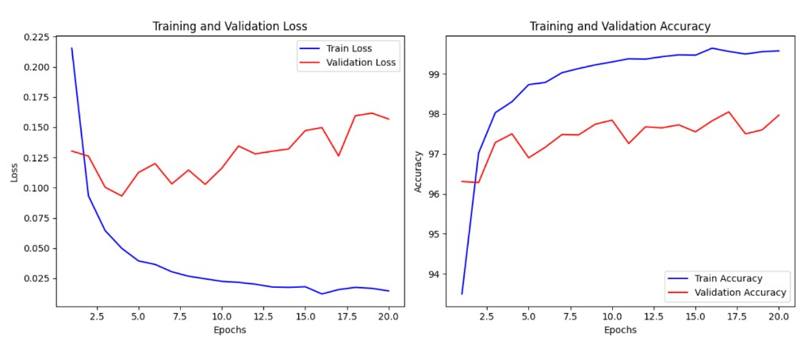

| Зона | Train loss | Val loss | Train acc | Val acc | Що робити |
|---|---|---|---|---|---|
| Underfitting | Висока | Висока | Низька | Низька | Більша модель, більше ознак |
| Оптимум | Низька | Низька | Висока | Висока | Зберегти модель |
| Overfitting | Дуже низька | Зростає | ≈100% | Нижча | Регуляризація, Dropout, Early stop |

### 1.2 Діагностика за кривими

**Ознаки перенавчання:**
- train loss → 0, val loss стабілізується або зростає.
- gap між train accuracy і val accuracy збільшується з епохами.
- Приклад з лекції: після 3-ї епохи train loss продовжує падати до 0.015, а val loss починає рости до 0.16.

**Ознаки недонавчання:**
- Обидві криві (train і val) залишаються на плато з великим loss.
- Модель занадто проста для задачі.

### 1.3 Bias-Variance Tradeoff

**Ідея:** кожна помилка моделі складається з двох частин: зміщення (bias) і дисперсії (variance).

$$
\text{Error} = \text{Bias}^2 + \text{Variance} + \text{IrreducibleNoise}
$$

| Компонент | Що означає | Прояв |
|---|---|---|
| Bias² | Систематична помилка (занадто проста модель) | Underfitting |
| Variance | Чутливість до тренувальних даних | Overfitting |
| Noise | Шум у даних (незменшуваний) | Завжди є |

> 💡 Регуляризація, Dropout і BN зменшують Variance ціною невеликого збільшення Bias — це корисний компроміс.

---

## ЧАСТИНА 2. L1 І L2 РЕГУЛЯРИЗАЦІЯ

### 2.1 Ідея: штраф за складність

**Ідея:** замість того щоб мінімізувати лише помилку на даних, мінімізуємо суму: помилка + штраф за великі ваги. Це змушує модель бути «скромнішою» у своїх параметрах.

### 2.2 L1 Регуляризація (Lasso)

$$
L_{\text{total}} = L_{\text{data}} + \lambda \cdot \sum_{i} |w_i|
$$

**Розшифровка:**

| Символ | Що означає | Простими словами |
|---|---|---|
| L_total | Повна функція втрат | Те, що мінімізує оптимізатор |
| L_data | Cross-Entropy (або інший loss) | Помилка на даних |
| λ | Коефіцієнт регуляризації | Сила штрафу; більше λ → сильніша регуляризація |
| \|w_i\| | Абсолютне значення ваги | Незалежно від знаку — «розмір» ваги |
| Σ | Сума по всіх вагах | Враховуємо всі параметри моделі |

**Градієнт L1 по w:**

$$
\frac{\partial L_1}{\partial w_i} = \lambda \cdot \text{sign}(w_i)
$$

де sign(wᵢ) = +1 якщо wᵢ > 0, −1 якщо wᵢ < 0, 0 якщо wᵢ = 0.

**Чому L1 дає розріджені ваги?** Градієнт sign(w) постійний за величиною незалежно від |w|. Якщо вага мала, але ненульова — її штрафують так само жорстко, як велику. Це «штовхає» малі ваги до нуля. Модель стає розрідженою (sparse).

### 2.3 L2 Регуляризація (Ridge)

$$
L_{\text{total}} = L_{\text{data}} + \lambda \cdot \sum_{i} w_i^2
$$

**Градієнт L2 по w:**

$$
\frac{\partial L_2}{\partial w_i} = 2\lambda \cdot w_i
$$

Штраф пропорційний до величини ваги. Великі ваги штрафуються сильно, малі — м'яко. Всі ваги зменшуються, але не зануляються.

### 2.4 Порівняльна таблиця L1 vs L2

| | L1 (Lasso) | L2 (Ridge) |
|---|---|---|
| Формула штрафу | λ · Σ\|w\| | λ · Σw² |
| Градієнт | λ · sign(w) | 2λ · w |
| Ефект на ваги | Зануляє малі ваги | Рівномірно зменшує |
| Розрідженість | Так (sparse model) | Ні |
| Коли використовувати | Мало важливих ознак | Всі ознаки потрібні |
| У PyTorch | Вручну або L1Loss | `weight_decay` в optimizer |

### 2.5 Elastic Net

$$
L_{\text{elastic}} = L_{\text{data}} + \lambda_1 \cdot \sum|w_i| + \lambda_2 \cdot \sum w_i^2
$$

Поєднує L1 (відбір ознак) і L2 (стабільність). Застосовується коли є кореляція між ознаками і хочеться зберегти групи пов'язаних ваг.

### 2.6 weight_decay в PyTorch: Adam vs AdamW

> ⚠️ **Важливо:** у стандартному Adam `weight_decay` реалізований некоректно — регуляризація додається до градієнту перед оновленням адаптивного кроку, що викривляє логіку Adam. **AdamW** (decoupled weight decay) розв'язує цю проблему: штраф застосовується **після** адаптивного кроку, прямо до ваг.

```python
# Стандартний Adam з weight_decay (L2 через градієнт — технічно некоректно)
optimizer = optim.Adam(model.parameters(), weight_decay=1e-3)

# AdamW — правильна реалізація L2 (рекомендовано для Transformers і не тільки)
optimizer = optim.AdamW(model.parameters(), weight_decay=1e-3)
```

| | Adam + weight_decay | AdamW |
|---|---|---|
| L2 застосовується | До градієнту | Прямо до ваг |
| Адаптивність | Порушується | Зберігається |
| Рекомендовано | Для простих MLP | Для Transformer, BERT |

---

## ЧАСТИНА 3. EARLY STOPPING — РАННЯ ЗУПИНКА

### 3.1 Ідея

**Ідея:** замість фіксованої кількості епох — зупиняємось тоді, коли модель перестає покращуватись на валідаційній вибірці. Зберігаємо найкращу знайдену модель.

```
val loss
  │
0.14┤           ★ найкращий момент (збережено)
  │       ╭───╮
0.10┤   ╭──╯   ╰────╮ ← лічильник patience=3 → STOP
  │  ╭──╯            ╰─────
  └──────────────────────── epochs
       3   5   7   9  11
```

### 3.2 Ключові параметри

| Параметр | Що робить | Типові значення |
|---|---|---|
| patience | Кількість «поганих» епох до зупинки | 2–10 |
| min_delta | Мінімальне покращення, яке рахується | 1e-4 |
| best_val_loss | Найкращий val loss, досягнутий досі | float('inf') спочатку |
| counter | Лічильник послідовних «поганих» епох | 0 спочатку |
| best_state_dict | Ваги моделі з найкращого моменту | `model.state_dict()` |

### 3.3 Правильна реалізація зі збереженням ваг

> ⚠️ **У коді лекції найкращі ваги НЕ зберігаються** — при зупинці ми отримуємо модель після останньої, не найкращої, епохи. Правильна реалізація нижче.

```python
import copy  # Потрібен для deepcopy стану моделі

best_val_loss = float('inf')   # Початкове значення — «нескінченно погано»
patience = 5                   # Терпимо 5 епох без покращення
counter = 0                    # Лічильник поспіль поганих епох
best_state = None              # Тут зберігатимемо найкращі ваги

for epoch in range(max_epochs):
    # ... тренувальний цикл ...

    if val_loss < best_val_loss - 1e-4:   # Є покращення (більше min_delta)
        best_val_loss = val_loss
        counter = 0
        best_state = copy.deepcopy(model.state_dict())  # Зберігаємо найкращий стан
    else:
        counter += 1
        if counter >= patience:
            print(f"Early stopping на епосі {epoch}")
            break

# Відновлюємо найкращу модель після зупинки
if best_state is not None:
    model.load_state_dict(best_state)
```

**Пояснення змінних:**

| Змінна | Тип | Значення | Що містить |
|---|---|---|---|
| best_val_loss | float | float('inf') → мін val_loss | Найкращий val loss, досягнутий досі |
| patience | int | 5 | Скільки поганих епох терпимо |
| counter | int | 0–patience | Лічильник поспіль поганих епох |
| best_state | dict або None | OrderedDict тензорів | Копія ваг моделі з найкращого моменту |

**Очікувана поведінка:**
```
Epoch 0: val_loss покращився → counter=0, best_state оновлено
Epoch 1: val_loss покращився → counter=0, best_state оновлено
Epoch 2: val_loss погіршився → counter=1
Epoch 3: val_loss погіршився → counter=2
...
Epoch N: counter=5 → Early stopping → завантажуємо best_state
```

---

## ЧАСТИНА 4. DROPOUT — ВИПАДКОВЕ ВИМКНЕННЯ НЕЙРОНІВ

### 4.1 Ідея

**Ідея:** на кожній ітерації тренування кожен нейрон «вимикається» з імовірністю p — його вихід стає 0. Це змушує мережу вчитися без «улюблених» нейронів і розподіляє навчання рівномірно.

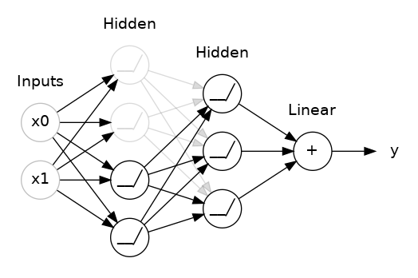

### 4.2 Математика: Inverted Dropout

**Train mode:** з імовірністю p занулюємо, решту масштабуємо на 1/(1−p):

$$
\tilde{h}_i = \begin{cases} 0 & \text{з імовірністю } p \\ h_i / (1-p) & \text{з імовірністю } 1-p \end{cases}
$$

**Навіщо масштабувати на 1/(1−p)?** Щоб **математичне сподівання виходу не змінилось**:

$$
\mathbb{E}[\tilde{h}_i] = p \cdot 0 + (1-p) \cdot \frac{h_i}{1-p} = h_i
$$

**Eval mode:** Dropout вимкнений, всі нейрони активні, масштабування не потрібне (вже враховано при тренуванні).

| Режим | Дія Dropout | Масштабування |
|---|---|---|
| model.train() | Занулює з імов. p | ×1/(1−p) |
| model.eval() | Нічого не робить | ×1 |

> ⚠️ **Типова помилка:** забути викликати `model.eval()` перед валідацією. Dropout залишиться активним і val metrics будуть некоректними.

### 4.3 Коли додавати Dropout

- Перед або після лінійних шарів (не після BatchNorm).
- Типові значення p: 0.2–0.5 для прихованих шарів, 0.1–0.2 після BatchNorm.
- Не додавати до вихідного шару (останній `nn.Linear`).

```python
# Демонстрація роботи Dropout на тензорі
import torch
import torch.nn as nn

m = nn.Dropout(p=0.2)     # 20% нейронів вимикаються при тренуванні
input_t = torch.randn(4, 5)
output_t = m(input_t)     # m у train mode за замовчуванням

print('Input:', input_t)
print('Output:', output_t)
# Деякі елементи output = 0.0; решта масштабовані на 1/0.8 = 1.25
```

**Пояснення змінних:**

| Змінна | Тип | Форма | Що містить |
|---|---|---|---|
| m | nn.Dropout | — | Шар Dropout з p=0.2 |
| input_t | Tensor | (4, 5) | Випадковий вхідний тензор |
| output_t | Tensor | (4, 5) | Вхід із зануленими і масштабованими елементами |

**Очікуваний вивід:**
```
Input: tensor([[-1.4468,  0.5646, -1.6534, -0.0165,  0.7820],
        [ 0.2796,  0.1479, -2.5517,  1.0827,  0.6909], ...])
Output: tensor([[-0.0000,  0.7057, -2.0668, -0.0206,  0.0000],
        [ 0.3495,  0.1848, -3.1896,  1.3534,  0.8637], ...])
# Нулі = вимкнені нейрони; ненулі = ×1.25 (масштабовані)
```

---

## ЧАСТИНА 5. BATCH NORMALIZATION (BATCHNORM)

### 5.1 Ідея

**Ідея:** нормалізуємо вхідні дані кожного шару за кожним мінібатчем — щоб середнє було ≈ 0, дисперсія ≈ 1. Потім модель сама навчається потрібному масштабу (γ) і зміщенню (β).

### 5.2 Формули

**Крок 1 — Нормалізація по мінібатчу:**

$$
\hat{x}_i = \frac{x_i - \mu_B}{\sqrt{\sigma_B^2 + \varepsilon}}
$$

| Символ | Що означає | Простими словами |
|---|---|---|
| xᵢ | Вхідний елемент | Один нейрон перед активацією |
| μ_B | Середнє по батчу | Центруємо дані |
| σ²_B | Дисперсія по батчу | Оцінюємо розкид |
| ε | 1e-5 (константа) | Захист від ділення на 0 |
| x̂ᵢ | Нормалізований вхід | mid=0, std≈1 |

**Крок 2 — Масштабування і зміщення (навчувані параметри):**

$$
y_i = \gamma \cdot \hat{x}_i + \beta
$$

| Символ | Тип | Що містить |
|---|---|---|
| γ | Навчуваний параметр (C,) | Масштаб; ініціалізується = 1 |
| β | Навчуваний параметр (C,) | Зміщення; ініціалізується = 0 |
| yᵢ | Вихід BN | Нормалізований + масштабований |

### 5.3 Train vs Eval у BatchNorm

| Режим | μ_B, σ²_B | running_mean/var |
|---|---|---|
| model.train() | Обчислюються з поточного батча | Оновлюються (EMA) |
| model.eval() | НЕ обчислюються | Використовуються накопичені |

> 💡 **Чому running_mean?** На інференсі може бути batch_size=1. Статистики одного зразка ненадійні — тому накопичуємо ковзне середнє за всіма тренувальними батчами.

### 5.4 Правильний порядок шарів

```
Linear → BatchNorm → ReLU → Dropout (якщо є)
```

**Чому саме цей порядок?**
- BN до активації — нормалізуємо «сирий» лінійний вихід.
- ReLU після BN — активація на вже нормалізованому виході.
- Dropout після ReLU — занулюємо вже активовані нейрони.

### 5.5 BN vs LayerNorm

| | BatchNorm | LayerNorm |
|---|---|---|
| Нормалізація по | Батчу (по N зразках) | Шару (по C каналах одного зразка) |
| Залежність від batch_size | Так — погано при batch=1 | Ні — стабільна при будь-якому розмірі |
| Застосовується в | CNN, MLP | Transformer, RNN (тема 13) |
| Параметри γ, β | Так | Так |

> ⚠️ **BatchNorm і перенавчання:** BN має слабкий регуляризаційний ефект (шум від статистик батчу виступає як регуляризація), але він менший за Dropout. Зазвичай їх комбінують.

---

## ЧАСТИНА 6. ОПТИМІЗАТОРИ — КОРОТКО

### 6.1 Еволюція оптимізаторів

**Ідея:** стандартний SGD оновлює ваги пропорційно до градієнту — це може бути нестабільним або повільним. Сучасні оптимізатори адаптують крок для кожного параметра.

**SGD (Stochastic Gradient Descent):**

$$
w_{t+1} = w_t - \eta \cdot \nabla L(w_t)
$$

**SGD з Momentum (накопичення імпульсу):**

$$
v_t = \beta \cdot v_{t-1} + (1 - \beta) \cdot \nabla L(w_t)
$$

$$
w_{t+1} = w_t - \eta \cdot v_t
$$

**RMSprop (адаптивний крок):**

$$
s_t = \rho \cdot s_{t-1} + (1 - \rho) \cdot (\nabla L)^2
$$

$$
w_{t+1} = w_t - \frac{\eta}{\sqrt{s_t + \varepsilon}} \cdot \nabla L
$$

**Adam (Adaptive Moment Estimation):**

$$
m_t = \beta_1 \cdot m_{t-1} + (1 - \beta_1) \cdot g_t \quad \text{(1-й момент, momentum)}
$$

$$
v_t = \beta_2 \cdot v_{t-1} + (1 - \beta_2) \cdot g_t^2 \quad \text{(2-й момент, RMSprop)}
$$

$$
\hat{m}_t = \frac{m_t}{1 - \beta_1^t}, \quad \hat{v}_t = \frac{v_t}{1 - \beta_2^t} \quad \text{(корекція зміщення)}
$$

$$
w_{t+1} = w_t - \frac{\eta}{\sqrt{\hat{v}_t} + \varepsilon} \cdot \hat{m}_t
$$

| Символ | Що означає | Типове значення |
|---|---|---|
| η | Learning rate | 1e-3 для Adam |
| β₁ | Decay для momentum | 0.9 |
| β₂ | Decay для RMSprop | 0.999 |
| ε | Числова стабільність | 1e-8 |
| mₜ, vₜ | 1-й і 2-й моменти | Накопичуються |
| m̂ₜ, v̂ₜ | Скориговані моменти | Компенсують зміщення на початку |

### 6.2 Порівняльна таблиця оптимізаторів

| Оптимізатор | Адаптивний LR | Momentum | Коли використовувати |
|---|---|---|---|
| SGD | Ні | Ні | Теоретичні вправи, Computer Vision (з momentum) |
| SGD + Momentum | Ні | Так | ResNet, ImageNet |
| RMSprop | Так | Ні | RNN, нестаціонарні задачі |
| Adam | Так | Так | Більшість задач за замовчуванням |
| AdamW | Так | Так | Transformer, BERT, задачі з L2 |

---

## ЧАСТИНА 6.5. ПЛАНУВАННЯ ШВИДКОСТІ НАВЧАННЯ (LR SCHEDULERS)

### 6.5.1 Навіщо змінювати LR під час навчання?

> 💡 На початку навчання потрібна більша LR для швидкого спуску. В кінці — менша LR для точного знаходження мінімуму. LR schedulers керують цим процесом автоматично.

### 6.5.2 Популярні планувальники

**StepLR** — ступінчасте зниження:

$$
\alpha_t = \alpha_0 \cdot \gamma^{\lfloor t / \text{step\_size} \rfloor}
$$

де γ — коефіцієнт зниження (наприклад 0.1), step_size — кожні скільки епох знижувати.

```
LR │ ─────╮      ╭─────╮      ╭─────
   │      ╰──────╯     ╰──────╯
   └────────────────────────── epochs
        10     20     30
```

**ExponentialLR** — експоненційне зниження:

$$
\alpha_t = \alpha_0 \cdot e^{-\lambda t}
$$

```
LR │ ╲
   │  ╲
   │   ╲___
   │       ╲___
   └────────────────── epochs
```

**CosineAnnealingLR** — косинусне згасання:

$$
\alpha_t = \alpha_{\min} + \frac{1}{2}(\alpha_0 - \alpha_{\min})\left(1 + \cos\frac{\pi t}{T_{\max}}\right)
$$

```
LR │ ╮       ╮       ╮
   │  ╰─╮   ╰─╮   ╰─╮
   │    ╰──╯   ╰──╯   ╰──
   └─────────────────────── epochs
```

**ReduceLROnPlateau** — зниження при «плато»:
- Стежить за метрикою (наприклад val_loss).
- Якщо за `patience` епох немає покращення — LR × factor.

**CyclicLR / OneCycleLR** — циклічні коливання LR між min і max:

```
LR │  ╱╲  ╱╲  ╱╲
   │ ╱  ╲╱  ╲╱  ╲
   └──────────────── epochs
```

### 6.5.3 Порівняльна таблиця планувальників

| Планувальник | Формула / поведінка | Де викликати step() | Коли використовувати |
|---|---|---|---|
| StepLR | α × γ кожні N епох | Після кожної епохи | Класичний підхід для CV |
| MultiStepLR | α × γ на заданих епохах | Після кожної епохи | Тонке налаштування |
| ExponentialLR | α × γ кожну епоху | Після кожної епохи | Монотонне зниження |
| CosineAnnealingLR | cos-функція | Після кожної епохи / батча | SOTA для CV і NLP |
| ReduceLROnPlateau | Зниження на плато | Після val_loss | Коли не знаєш, коли знижувати |
| OneCycleLR | Підйом + спуск за 1 цикл | Після кожного батча | Super-Convergence |

> ⚠️ **Де викликати `scheduler.step()`?**
> - Більшість — **після кожної епохи**: `scheduler.step()` у кінці epochloop.
> - `ReduceLROnPlateau` — **з метрикою**: `scheduler.step(val_loss)`.
> - `OneCycleLR` — **після кожного батча**: всередині batchloop.
> - **Завжди після** `optimizer.step()`, ніколи до.

---

## ЧАСТИНА 6.6. АВТОМАТИЧНА ОПТИМІЗАЦІЯ ГІПЕРПАРАМЕТРІВ

### 6.6.1 Проблема ручного підбору

**Ідея:** ручний Grid Search перебирає всі комбінації, що занадто повільно. Random Search ефективніший, але не навчається на попередніх результатах. Bayesian optimization (TPE) — навчається і фокусується на перспективних регіонах.

| Метод | Скільки оцінок потрібно | Навчається на попередніх | Рекомендовано |
|---|---|---|---|
| Grid Search | N₁ × N₂ × N₃ × ... | Ні | При ≤3 параметрах |
| Random Search | Фіксована кількість trials | Ні | Простий baseline |
| Bayesian (TPE) | Набагато менше | Так | Основний метод |
| CMA-ES | Менше для неперервних | Так | Тільки неперервні hp |
| NSGA-II | Залежить | Так | Багатоцільова |

### 6.6.2 Ключові концепції Optuna

**Study** — весь процес оптимізації:
```python
study = optuna.create_study(direction='maximize')  # або 'minimize'
```

**Trial** — одна спроба з конкретним набором гіперпараметрів:
```python
# кожен виклик objective(trial) — новий Trial
```

**Objective** — функція, яку оптимізуємо:
```python
def objective(trial):
    lr = trial.suggest_float('lr', 1e-5, 1e-1, log=True)
    # ... тренуємо модель ...
    return val_accuracy  # те, що Optuna максимізує
```

**Схема взаємодії:**

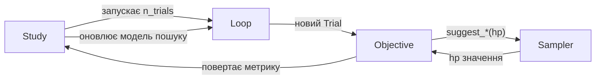

### 6.6.3 API suggest_*

| Метод | Приклад | Тип значення |
|---|---|---|
| suggest_float(name, low, high) | suggest_float('lr', 1e-5, 1e-1) | float |
| suggest_float(name, low, high, log=True) | suggest_float('lr', 1e-5, 1e-1, log=True) | float (log scale) |
| suggest_int(name, low, high) | suggest_int('n_layers', 1, 5) | int |
| suggest_categorical(name, choices) | suggest_categorical('opt', ['adam','sgd']) | будь-який тип |

> ⚠️ `suggest_loguniform` і `suggest_uniform` — **застарілі** (deprecated). Використовуй `suggest_float(..., log=True)` і `suggest_float(...)` відповідно.

### 6.6.4 Samplers

| Sampler | Клас | Коли використовувати |
|---|---|---|
| TPE (за замовчуванням) | TPESampler() | Більшість задач |
| Random | RandomSampler() | Baseline; першочергова розвідка |
| CMA-ES | CmaEsSampler() | Лише неперервні параметри |
| NSGA-II | NSGAIISampler() | Кілька цільових функцій |
| Grid | GridSampler(search_space) | Малий фіксований простір |

### 6.6.5 Pruners — дострокова зупинка невдалих trials

```python
study = optuna.create_study(
    direction='maximize',
    pruner=optuna.pruners.MedianPruner()  # Зупиняє trial гірше медіани
)
```

У `objective` потрібно повідомляти про проміжні результати:
```python
trial.report(val_accuracy, epoch)          # Повідомляємо поточну метрику
if trial.should_prune():                   # Optuna вирішує: зупинити?
    raise optuna.exceptions.TrialPruned()
```

---

## ПРАКТИЧНА ЧАСТИНА — ПОВНИЙ PIPELINE (ЧАСТИНИ 7–16)

> Тут — весь код від завантаження MNIST до пошуку оптимальних гіперпараметрів Optuna. Виконуй практичні кроки по порядку. Кроки пронумеровані глобально (1–28) через усі частини.

### Карта pipeline

| Блок | Що робимо | Навіщо | Кроки |
|---|---|---|---|
| **1 — Підготовка** | Kaggle, бібліотеки, директорії | Базове середовище | 1–2 |
| **2 — MNIST** | Трансформації, split, DataLoader | Дані для всіх експериментів | 3–4 |
| **3 — Baseline** | Net + train-loop без регуляризації | Точка відліку | 5–7 |
| **4 — L2** | weight_decay=1e-3 | Порівняти вплив L2 | 8–9 |
| **5 — Early Stopping** | patience=2, збереження ваг | Оптимальна точка зупинки | 10–11 |
| **6 — Dropout** | NetWithDropout + demo | Генералізація | 12–13 |
| **7 — BatchNorm** | NetWithBN + demo | Прискорення навчання | 14–15 |
| **8 — LR Scheduler** | StepLR, ReduceLROnPlateau | Правильне керування LR | 16–17 |
| **9 — Optuna** | 100 trials, 4+4 графіки | Автоматичний пошук hp | 18–26 |
| **10 — Фінал** | Найкращі hp + зведена таблиця | Підсумок усіх підходів | 27–28 |

---

## ЧАСТИНА 7. ПІДГОТОВКА СЕРЕДОВИЩА — KAGGLE

### Підключення на Kaggle

1. Створи новий **Notebook** на [kaggle.com/code](https://www.kaggle.com/code).
2. Settings → Accelerator → **GPU T4 x2** (або P100).
3. Settings → Internet → **ON** (потрібно для MNIST download і Optuna install).
4. Add Data → Search «MNIST» → додай якщо потрібен офлайн-варіант.

> ### БЛОК 1 — Підготовка середовища (Кроки 1–2)
> **Що робимо:** встановлюємо бібліотеки, перевіряємо шляхи, ставимо seed.
> **Навіщо:** забезпечуємо відтворюваність і доступ до файлів.

### Практичний крок 1 — Перевірка середовища і встановлення Optuna

```bash
# Встановлюємо Optuna (на Kaggle відсутня за замовчуванням)
pip install optuna --quiet
```

**Очікуваний вивід:**
```
Successfully installed optuna-X.X.X
```

### Практичний крок 2 — Імпорти, директорії, seed

```python
import os
import copy
import torch
import torch.nn as nn
import torch.optim as optim
from torchvision import datasets, transforms
from torch.utils.data import DataLoader, random_split
import matplotlib.pyplot as plt
import optuna

# Перевіряємо вміст /kaggle/input
for root, dirs, files in os.walk("/kaggle/input"):
    for file in files:
        print(os.path.join(root, file))

# Директорія для збереження моделей
os.makedirs('/kaggle/working/models', exist_ok=True)

# Визначаємо пристрій (GPU якщо доступний)
device = torch.device('cuda' if torch.cuda.is_available() else 'cpu')
print(f'Використовуємо: {device}')

# Фіксуємо зерно для відтворюваності
torch.manual_seed(42)
```

**Пояснення змінних:**

| Змінна | Тип | Форма | Що містить |
|---|---|---|---|
| device | torch.device | — | 'cuda' або 'cpu' |
| `/kaggle/working/models` | директорія | — | Тут збережемо best.pt |

**Очікуваний вивід:**
```
Використовуємо: cuda
```

---

## ЧАСТИНА 8. ЗАВАНТАЖЕННЯ MNIST І ПІДГОТОВКА ДАНИХ

> ### БЛОК 2 — Завантаження MNIST (Кроки 3–4)
> **Що робимо:** завантажуємо MNIST, нормалізуємо, розбиваємо 80/20, створюємо DataLoader'и.
> **Навіщо:** єдина база даних для всіх шести підходів — щоб порівняння було чесним.

### Практичний крок 3 — Трансформації і завантаження MNIST

```python
# Визначаємо трансформації: ToTensor + нормалізація до μ=0.1307, σ=0.3081
# Ці значення — статистики MNIST (вже обраховані)
transform = transforms.Compose([
    transforms.ToTensor(),
    transforms.Normalize((0.1307,), (0.3081,))
])

# Завантажуємо повний тренувальний набір (60 000 зображень)
full_dataset = datasets.MNIST(root='./data', train=True, download=True, transform=transform)

# Якщо Internet=OFF, можна вказати шлях до Kaggle-датасету:
# full_dataset = datasets.MNIST(root='/kaggle/input/mnist', train=True,
#                                download=False, transform=transform)
```

**Пояснення змінних:**

| Змінна | Тип | Форма | Що містить |
|---|---|---|---|
| transform | Compose | — | Послідовність трансформацій |
| full_dataset | Dataset | 60 000 зразків | (28×28) зображення + мітка 0–9 |
| Normalize(0.1307, 0.3081) | — | — | μ і σ MNIST; приводить до ≈N(0,1) |

### Практичний крок 4 — Розбивка даних і DataLoader'и

```python
# Розбиваємо тренувальний набір: 80% тренування, 20% валідація
train_size = int(0.8 * len(full_dataset))   # 48 000
val_size = len(full_dataset) - train_size    # 12 000
train_dataset, val_dataset = random_split(full_dataset, [train_size, val_size])

# Окремий тестовий набір (10 000 зображень, ніколи не використовується при навчанні)
test_dataset = datasets.MNIST(root='./data', train=False, download=True, transform=transform)

# Розмір батча
batch_size = 64

# DataLoader'и
train_loader = DataLoader(train_dataset, batch_size=batch_size, shuffle=True)
val_loader   = DataLoader(val_dataset,   batch_size=batch_size, shuffle=False)
test_loader  = DataLoader(test_dataset,  batch_size=batch_size, shuffle=False)

print(f"Train: {len(train_dataset)}")
print(f"Val:   {len(val_dataset)}")
print(f"Test:  {len(test_dataset)}")
print(f"Батчів у train_loader: {len(train_loader)}")
```

**Пояснення змінних:**

| Змінна | Тип | Розмір | Що містить |
|---|---|---|---|
| train_dataset | Subset | 48 000 | Тренувальні зразки |
| val_dataset | Subset | 12 000 | Валідаційні зразки |
| test_dataset | Dataset | 10 000 | Тестові зразки (тільки для фінальної оцінки) |
| train_loader | DataLoader | 750 батчів | Батчі (64, 1, 28, 28) |

**Очікуваний вивід:**
```
Train: 48000
Val:   12000
Test:  10000
Батчів у train_loader: 750
```

---

## ЧАСТИНА 9. BASELINE МОДЕЛЬ (БЕЗ РЕГУЛЯРИЗАЦІЇ)

> ### БЛОК 3 — Baseline (Кроки 5–7)
> **Що робимо:** тренуємо просту 3-шарову мережу без регуляризації протягом 20 епох.
> **Навіщо:** встановити точку відліку — побачити, як виглядає перенавчання.

### Практичний крок 5 — Архітектура базової мережі

```python
class Net(nn.Module):
    """Проста fully-connected мережа: 784 → 512 → 512 → 10"""
    def __init__(self):
        super(Net, self).__init__()
        self.fc1 = nn.Linear(784, 512)   # Перший прихований шар
        self.fc2 = nn.Linear(512, 512)   # Другий прихований шар
        self.fc3 = nn.Linear(512, 10)    # Вихідний шар (10 класів = цифри 0–9)

    def forward(self, x):
        x = torch.relu(self.fc1(x))      # ReLU після першого шару
        x = torch.relu(self.fc2(x))      # ReLU після другого шару
        return self.fc3(x)               # Без softmax — CrossEntropyLoss сам застосовує
```

**Пояснення змінних:**

| Шар | Вхід | Вихід | Параметрів |
|---|---|---|---|
| fc1 | (B, 784) | (B, 512) | 784×512 + 512 = 401 920 |
| fc2 | (B, 512) | (B, 512) | 512×512 + 512 = 262 656 |
| fc3 | (B, 512) | (B, 10) | 512×10 + 10 = 5 130 |
| **Всього** | | | **669 706** |

### Практичний крок 6 — Функція візуалізації

```python
def visualize_training_history(train_losses, train_accs, val_losses, val_accs):
    """Побудова кривих loss і accuracy для train і val наборів"""
    epochs = range(1, len(train_losses) + 1)
    plt.figure(figsize=(12, 5))

    # Графік втрат
    plt.subplot(1, 2, 1)
    plt.plot(epochs, train_losses, 'b-', label='Train Loss')
    plt.plot(epochs, val_losses, 'r-', label='Validation Loss')
    plt.title('Training and Validation Loss')
    plt.xlabel('Epochs')
    plt.ylabel('Loss')
    plt.legend()

    # Графік точності
    plt.subplot(1, 2, 2)
    plt.plot(epochs, train_accs, 'b-', label='Train Accuracy')
    plt.plot(epochs, val_accs, 'r-', label='Validation Accuracy')
    plt.title('Training and Validation Accuracy')
    plt.xlabel('Epochs')
    plt.ylabel('Accuracy')
    plt.legend()

    plt.tight_layout()
    plt.show()
```

### Практичний крок 7 — Тренування baseline (20 епох, без регуляризації)

```python
# Baseline: без жодної регуляризації
model = Net()
criterion = nn.CrossEntropyLoss()           # Функція втрат для класифікації
optimizer = optim.Adam(model.parameters())  # Стандартний Adam, LR=1e-3

num_epochs = 20
train_losses, train_accs = [], []
val_losses, val_accs = [], []

for epoch in range(num_epochs):
    # --- Тренувальна фаза ---
    model.train()   # Вмикаємо train-режим (Dropout, BN у train mode)
    train_loss = 0; train_correct = 0; train_total = 0

    for data, target in train_loader:
        optimizer.zero_grad()                          # Обнуляємо градієнти
        output = model(data.view(data.size(0), -1))    # (B,1,28,28) → (B,784) → logits (B,10)
        loss = criterion(output, target)               # CrossEntropy
        loss.backward()                                # Backpropagation
        optimizer.step()                               # Оновлення ваг

        train_loss += loss.item()
        _, predicted = output.max(1)                   # Клас з найбільшим logit
        train_total += target.size(0)
        train_correct += predicted.eq(target).sum().item()

    train_loss /= len(train_loader)
    train_acc = 100. * train_correct / train_total
    train_losses.append(train_loss); train_accs.append(train_acc)

    # --- Валідаційна фаза ---
    model.eval()    # Вимикаємо Dropout/BN train mode
    val_loss = 0; val_correct = 0; val_total = 0

    with torch.no_grad():   # Не рахуємо градієнти під час валідації
        for data, target in val_loader:
            output = model(data.view(data.size(0), -1))
            val_loss += criterion(output, target).item()
            _, predicted = output.max(1)
            val_total += target.size(0)
            val_correct += predicted.eq(target).sum().item()

    val_loss /= len(val_loader)
    val_acc = 100. * val_correct / val_total
    val_losses.append(val_loss); val_accs.append(val_acc)

    print(f'Epoch [{epoch+1}/{num_epochs}] '
          f'Train Loss: {train_loss:.4f}, Train Acc: {train_acc:.2f}% | '
          f'Val Loss: {val_loss:.4f}, Val Acc: {val_acc:.2f}%')

visualize_training_history(train_losses, train_accs, val_losses, val_accs)
```

**Пояснення змінних:**

| Змінна | Тип | Форма | Що містить |
|---|---|---|---|
| output | Tensor | (B, 10) | Logits по 10 класах |
| loss | Tensor | скаляр | CrossEntropy на батчі |
| predicted | Tensor | (B,) | Індекс класу з max logit |
| train_correct | int | — | Кількість правильних передбачень |

**Очікуваний вивід (скорочено):**
```
Epoch [1/20] Train Loss: 0.2154, Train Acc: 93.50% | Val Loss: 0.1303, Val Acc: 96.31%
...
Epoch [20/20] Train Loss: 0.0146, Train Acc: 99.58% | Val Loss: 0.1568, Val Acc: 97.97%
```


**Висновок:** розрив між train accuracy (99.58%) і val accuracy (97.97%) після 3-ї епохи свідчить про перенавчання. Переходимо до методів регуляризації.

---

## ЧАСТИНА 10. L2 РЕГУЛЯРИЗАЦІЯ

> ### БЛОК 4 — L2 Регуляризація (Кроки 8–9)
> **Що робимо:** додаємо `weight_decay=1e-3` до оптимізатора — єдина зміна.
> **Навіщо:** перевірити, як L2 зменшує розрив між train і val метриками.

### Практичний крок 8 — Тренування з L2

```python
# L2 регуляризація через weight_decay в Adam
model = Net()
criterion = nn.CrossEntropyLoss()
# weight_decay=1e-3 — це λ в L2; PyTorch додає λ·Σw² до loss при оновленні ваг
optimizer = optim.Adam(model.parameters(), weight_decay=1e-3)

num_epochs = 20
train_losses, train_accs, val_losses, val_accs = [], [], [], []

for epoch in range(num_epochs):
    model.train()
    train_loss = 0; train_correct = 0; train_total = 0

    for data, target in train_loader:
        optimizer.zero_grad()
        output = model(data.view(data.size(0), -1))
        loss = criterion(output, target)    # CrossEntropy (без явного L2 у loss)
        # weight_decay додає L2 всередині optimizer.step() — не потрібно вручну
        loss.backward()
        optimizer.step()

        train_loss += loss.item()
        _, predicted = output.max(1)
        train_total += target.size(0)
        train_correct += predicted.eq(target).sum().item()

    train_loss /= len(train_loader)
    train_acc = 100. * train_correct / train_total
    train_losses.append(train_loss); train_accs.append(train_acc)

    model.eval()
    val_loss = 0; val_correct = 0; val_total = 0
    with torch.no_grad():
        for data, target in val_loader:
            output = model(data.view(data.size(0), -1))
            val_loss += criterion(output, target).item()
            _, predicted = output.max(1)
            val_total += target.size(0)
            val_correct += predicted.eq(target).sum().item()

    val_loss /= len(val_loader)
    val_acc = 100. * val_correct / val_total
    val_losses.append(val_loss); val_accs.append(val_acc)

    print(f'Epoch [{epoch+1}/{num_epochs}] '
          f'Train: {train_loss:.4f}/{train_acc:.2f}% | '
          f'Val: {val_loss:.4f}/{val_acc:.2f}%')

visualize_training_history(train_losses, train_accs, val_losses, val_accs)
```

**Пояснення змінних:**

| Змінна | Тип | Значення | Що містить |
|---|---|---|---|
| weight_decay | float | 1e-3 | λ для L2; Adam множить ваги на (1 − η·λ) при кожному кроці |

**Очікуваний вивід:**
```
Epoch [1/20] Train: 0.2251/93.18% | Val: 0.1377/95.81%
...
Epoch [20/20] Train: 0.0434/98.57% | Val: 0.0955/97.19%
```

### Практичний крок 9 — Аналіз результатів L2

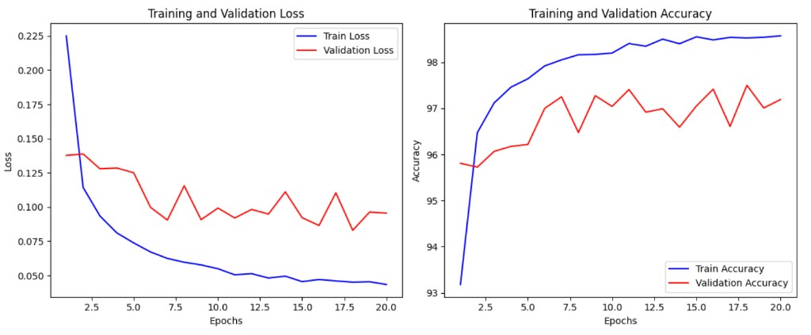

**Порівняння Baseline vs L2:**

| Метрика | Baseline | L2 (λ=1e-3) |
|---|---|---|
| Train Loss (ep.20) | 0.0146 | 0.0434 |
| Val Loss (ep.20) | 0.1568 | 0.0955 |
| Train Acc (ep.20) | 99.58% | 98.57% |
| Val Acc (ep.20) | 97.97% | 97.19% |
| Gap train−val acc | 1.61% | 1.38% |

**Висновок:** розрив між train і val зменшився. Val loss у L2 нижчий (0.0955 vs 0.1568). Ціна — трохи нижча train accuracy. Це типовий корисний компроміс.

---

## ЧАСТИНА 11. EARLY STOPPING

> ### БЛОК 5 — Early Stopping (Кроки 10–11)
> **Що робимо:** додаємо patience-лічильник; зупиняємо тренування, коли val loss не покращується 2 епохи поспіль.
> **Навіщо:** знайти точний момент, коли модель ще не перенавчилась.

### Практичний крок 10 — Early stopping зі збереженням найкращих ваг

```python
# Early stopping (version з лекції) + виправлення: зберігаємо найкращий state_dict
model = Net()
criterion = nn.CrossEntropyLoss()
optimizer = optim.Adam(model.parameters())

best_val_loss = float('inf')   # Починаємо з «нескінченно поганого» loss
patience = 2                   # 2 епохи без покращення → зупиняємо
counter = 0                    # Поточна кількість поспіль поганих епох
best_state = None              # Ваги найкращої епохи

train_losses, train_accs, val_losses, val_accs = [], [], [], []

for epoch in range(20):
    model.train()
    train_loss = 0; train_correct = 0; train_total = 0
    for data, target in train_loader:
        optimizer.zero_grad()
        output = model(data.view(data.size(0), -1))
        loss = criterion(output, target)
        loss.backward()
        optimizer.step()
        train_loss += loss.item()
        _, predicted = output.max(1)
        train_total += target.size(0)
        train_correct += predicted.eq(target).sum().item()

    train_loss /= len(train_loader)
    train_acc = 100. * train_correct / train_total
    train_losses.append(train_loss); train_accs.append(train_acc)

    model.eval()
    val_loss = 0; val_correct = 0; val_total = 0
    with torch.no_grad():
        for data, target in val_loader:
            output = model(data.view(data.size(0), -1))
            val_loss += criterion(output, target).item()
            _, predicted = output.max(1)
            val_total += target.size(0)
            val_correct += predicted.eq(target).sum().item()

    val_loss /= len(val_loader)
    val_acc = 100. * val_correct / val_total
    val_losses.append(val_loss); val_accs.append(val_acc)

    print(f'Epoch {epoch}: Train Loss: {train_loss:.4f}, Train Acc: {train_acc:.2f}%, '
          f'Val Loss: {val_loss:.4f}, Val Acc: {val_acc:.2f}%')

    # --- Early Stopping логіка ---
    if val_loss < best_val_loss:
        best_val_loss = val_loss
        counter = 0
        best_state = copy.deepcopy(model.state_dict())  # Зберігаємо найкращі ваги
    else:
        counter += 1
        if counter >= patience:
            print(f"Early stopping на епосі {epoch}")
            break

# Відновлюємо найкращу модель і зберігаємо на диск
if best_state is not None:
    model.load_state_dict(best_state)
    torch.save(best_state, '/kaggle/working/models/best_early_stop.pt')
    print("Найкращу модель збережено.")

visualize_training_history(train_losses, train_accs, val_losses, val_accs)
```

**Пояснення змінних:**

| Змінна | Тип | Значення | Що містить |
|---|---|---|---|
| best_val_loss | float | float('inf') → знижується | Найкращий val loss досі |
| patience | int | 2 | Максимум «поганих» епох поспіль |
| counter | int | 0 → patience | Лічильник поганих епох |
| best_state | dict | OrderedDict | Стан ваг моделі на найкращій епосі |

**Очікуваний вивід:**
```
Epoch 0: Train Loss: 0.2135, Train Acc: 93.56%, Val Loss: 0.1490, Val Acc: 95.60%
Epoch 1: Train Loss: 0.0922, Train Acc: 97.20%, Val Loss: 0.0948, Val Acc: 97.16%
Epoch 2: Train Loss: 0.0640, Train Acc: 97.96%, Val Loss: 0.0895, Val Acc: 97.62%
Epoch 3: Train Loss: 0.0487, Train Acc: 98.44%, Val Loss: 0.1044, Val Acc: 97.05%
Epoch 4: Train Loss: 0.0437, Train Acc: 98.53%, Val Loss: 0.0954, Val Acc: 97.58%
Early stopping на епосі 4
Найкращу модель збережено.
```

### Практичний крок 11 — Аналіз Early Stopping

**Висновок:** тренування зупинилось на 4-й епосі замість 20-ї. Ознаки перенавчання з'являються після 2-ї епохи. Early stopping ефективно запобіг цьому. Найкращий момент — epoch 2 (val loss = 0.0895).

> 💡 `patience=2` — дуже маленьке значення. У реальних задачах використовують patience=5–10, щоб не зупинитись через тимчасове плато.

---

## ЧАСТИНА 12. DROPOUT

> ### БЛОК 6 — Dropout (Кроки 12–13)
> **Що робимо:** додаємо два шари Dropout(0.2) в архітектуру і тренуємо 20 епох.
> **Навіщо:** порівняти з baseline — чи покращує генералізацію.

### Практичний крок 12 — Архітектура NetWithDropout + демо

```python
# Демонстрація роботи nn.Dropout на окремому тензорі
import torch
import torch.nn as nn

m_drop = nn.Dropout(p=0.2)            # Ймовірність занулення = 20%
demo_input = torch.randn(4, 5)
demo_output = m_drop(demo_input)       # m_drop у train mode: занулює і масштабує

print('Input:', demo_input)
print('Output:', demo_output)
# Де output=0 — нейрон вимкнено; де output≠0 — масштабовано × (1/0.8) = × 1.25


class NetWithDropout(nn.Module):
    """MLP з двома шарами Dropout(0.2) після кожного прихованого шару"""
    def __init__(self):
        super(NetWithDropout, self).__init__()
        self.fc1 = nn.Linear(784, 512)
        self.dropout1 = nn.Dropout(0.2)    # 20% нейронів вимикаються при тренуванні
        self.fc2 = nn.Linear(512, 512)
        self.dropout2 = nn.Dropout(0.2)
        self.fc3 = nn.Linear(512, 10)

    def forward(self, x):
        x = torch.relu(self.fc1(x))
        x = self.dropout1(x)               # Dropout після ReLU (відповідно до практики)
        x = torch.relu(self.fc2(x))
        x = self.dropout2(x)
        return self.fc3(x)                 # Вихід: logits (без активації)
```

**Пояснення змінних:**

| Змінна | Тип | Форма | Що містить |
|---|---|---|---|
| demo_input | Tensor | (4, 5) | Випадковий тензор |
| demo_output | Tensor | (4, 5) | Вхід + маска Dropout; нулі = вимкнені |
| dropout1/2 | nn.Dropout | — | Шари з p=0.2; авто-вимкнуті в eval() |

**Очікуваний вивід:**
```
Input: tensor([[-1.4468,  0.5646, ...]])
Output: tensor([[ 0.0000,  0.7057, ...]])
# 0.0000 = вимкнений нейрон; 0.7057 = 0.5646 × 1.25
```

### Практичний крок 13 — Тренування NetWithDropout

```python
# Dropout: тренуємо модель з двома шарами Dropout(0.2)
model = NetWithDropout()
criterion = nn.CrossEntropyLoss()
optimizer = optim.Adam(model.parameters())

train_losses, train_accs, val_losses, val_accs = [], [], [], []

for epoch in range(20):
    model.train()   # ВАЖЛИВО: вмикаємо train mode → Dropout активний
    train_loss = 0; train_correct = 0; train_total = 0
    for data, target in train_loader:
        optimizer.zero_grad()
        output = model(data.view(data.size(0), -1))
        loss = criterion(output, target)
        loss.backward()
        optimizer.step()
        train_loss += loss.item()
        _, predicted = output.max(1)
        train_total += target.size(0)
        train_correct += predicted.eq(target).sum().item()

    train_loss /= len(train_loader)
    train_acc = 100. * train_correct / train_total
    train_losses.append(train_loss); train_accs.append(train_acc)

    model.eval()    # ВАЖЛИВО: eval mode → Dropout вимкнений
    val_loss = 0; val_correct = 0; val_total = 0
    with torch.no_grad():
        for data, target in val_loader:
            output = model(data.view(data.size(0), -1))
            val_loss += criterion(output, target).item()
            _, predicted = output.max(1)
            val_total += target.size(0)
            val_correct += predicted.eq(target).sum().item()

    val_loss /= len(val_loader)
    val_acc = 100. * val_correct / val_total
    val_losses.append(val_loss); val_accs.append(val_acc)
    print(f'Epoch {epoch}: Train: {train_loss:.4f}/{train_acc:.2f}% | '
          f'Val: {val_loss:.4f}/{val_acc:.2f}%')

visualize_training_history(train_losses, train_accs, val_losses, val_accs)
```

**Очікуваний вивід:**
```
Epoch 0: Train: 0.2505/92.30% | Val: 0.1408/95.76%
...
Epoch 19: Train: 0.0361/99.02% | Val: 0.1139/98.05%
```

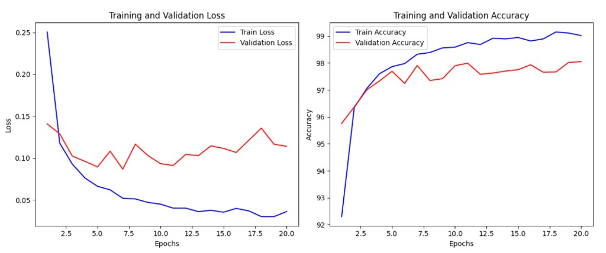

**Висновок:** Dropout сповільнив навчання, але дозволив моделі тренуватись довше без перенавчання. Val accuracy (98.05%) — найвища серед базових методів.

---

## ЧАСТИНА 13. BATCH NORMALIZATION

> ### БЛОК 7 — BatchNorm (Кроки 14–15)
> **Що робимо:** додаємо BatchNorm1d після кожного лінійного шару.
> **Навіщо:** прискорити початкове навчання і стабілізувати градієнти.

### Практичний крок 14 — Архітектура NetWithBN + демо BatchNorm1d

```python
# Демонстрація BatchNorm1d: нормалізує батч до mean≈0, std≈1
import torch.nn as nn

m_bn = nn.BatchNorm1d(5, affine=False)   # affine=False: без навчуваних γ і β
demo_input = torch.randn(4, 5)
demo_output = m_bn(demo_input)

print(f'Input mean: {demo_input.mean():.6f}, std: {demo_input.std():.4f}')
print(f'Output mean: {demo_output.mean():.8f}, std: {demo_output.std():.4f}')
# Output mean ≈ 0, std ≈ 1 — нормалізація спрацювала


class NetWithBN(nn.Module):
    """MLP з BatchNorm1d після кожного прихованого шару (до ReLU)"""
    def __init__(self):
        super(NetWithBN, self).__init__()
        self.fc1 = nn.Linear(784, 256)
        self.bn1 = nn.BatchNorm1d(256)     # 256 = кількість features (C)
        self.fc2 = nn.Linear(256, 256)
        self.bn2 = nn.BatchNorm1d(256)
        self.fc3 = nn.Linear(256, 10)

    def forward(self, x):
        x = torch.relu(self.bn1(self.fc1(x)))   # Linear → BN → ReLU
        x = torch.relu(self.bn2(self.fc2(x)))   # Linear → BN → ReLU
        return self.fc3(x)
```

**Пояснення змінних:**

| Змінна | Тип | Форма | Що містить |
|---|---|---|---|
| m_bn | BatchNorm1d | — | BN без навчуваних γ, β (affine=False) |
| demo_output | Tensor | (4, 5) | Нормалізований батч |
| bn1, bn2 | BatchNorm1d | — | Навчувані γ=(256,), β=(256,); running stats |

**Очікуваний вивід:**
```
Input mean: -0.000061, std: 1.1887
Output mean: -0.00000003, std: 1.0260
```

### Практичний крок 15 — Тренування NetWithBN

```python
# BatchNorm: тренуємо модель з двома шарами BatchNorm1d
model = NetWithBN()
criterion = nn.CrossEntropyLoss()
optimizer = optim.Adam(model.parameters())

train_losses, train_accs, val_losses, val_accs = [], [], [], []

for epoch in range(20):
    model.train()   # BatchNorm у train mode: обчислює batch stats, оновлює running stats
    train_loss = 0; train_correct = 0; train_total = 0
    for data, target in train_loader:
        optimizer.zero_grad()
        output = model(data.view(data.size(0), -1))
        loss = criterion(output, target)
        loss.backward()
        optimizer.step()
        train_loss += loss.item()
        _, predicted = output.max(1)
        train_total += target.size(0)
        train_correct += predicted.eq(target).sum().item()

    train_loss /= len(train_loader)
    train_acc = 100. * train_correct / train_total
    train_losses.append(train_loss); train_accs.append(train_acc)

    model.eval()    # BatchNorm у eval mode: використовує running_mean/var
    val_loss = 0; val_correct = 0; val_total = 0
    with torch.no_grad():
        for data, target in val_loader:
            output = model(data.view(data.size(0), -1))
            val_loss += criterion(output, target).item()
            _, predicted = output.max(1)
            val_total += target.size(0)
            val_correct += predicted.eq(target).sum().item()

    val_loss /= len(val_loader)
    val_acc = 100. * val_correct / val_total
    val_losses.append(val_loss); val_accs.append(val_acc)
    print(f'Epoch {epoch}: Train: {train_loss:.4f}/{train_acc:.2f}% | '
          f'Val: {val_loss:.4f}/{val_acc:.2f}%')

visualize_training_history(train_losses, train_accs, val_losses, val_accs)
```

**Очікуваний вивід:**
```
Epoch 0: Train: 0.2082/93.84% | Val: 0.1105/96.75%
Epoch 1: Train: 0.0872/97.30% | Val: 0.0936/97.26%
...
Epoch 19: Train: 0.0084/99.70% | Val: 0.0946/97.97%
```

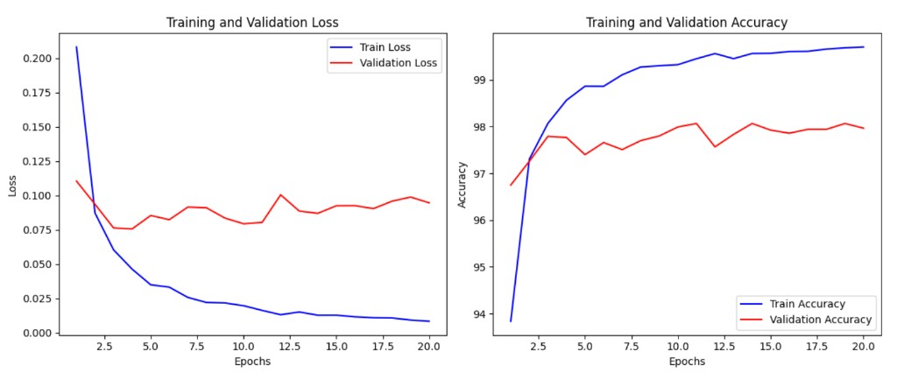

**Висновок:** BN прискорив початкове навчання (висока точність уже на epoch 0) та стабілізував криві. Train accuracy 99.70%, але розрив із val більший ніж у Dropout — легке перенавчання залишається.

---

## ЧАСТИНА 14. LR SCHEDULER НА ПРАКТИЦІ

> ### БЛОК 8 — LR Scheduler (Кроки 16–17)
> **Що робимо:** додаємо StepLR і ReduceLROnPlateau до тренувального циклу.
> **Навіщо:** показати, де правильно викликати `scheduler.step()`.

### Практичний крок 16 — StepLR

```python
# StepLR: зменшуємо LR у 10 разів кожні 7 епох
model = Net()
optimizer = optim.Adam(model.parameters(), lr=1e-3)
criterion = nn.CrossEntropyLoss()

# gamma=0.1 → LR × 0.1 кожні step_size епох
scheduler = optim.lr_scheduler.StepLR(optimizer, step_size=7, gamma=0.1)

for epoch in range(20):
    model.train()
    for data, target in train_loader:
        optimizer.zero_grad()
        output = model(data.view(data.size(0), -1))
        loss = criterion(output, target)
        loss.backward()
        optimizer.step()    # 1. Спочатку оновлюємо ваги

    scheduler.step()        # 2. Потім — крок планувальника (після epoche, не батча)

    current_lr = optimizer.param_groups[0]['lr']
    print(f'Epoch {epoch}: LR = {current_lr:.6f}')
```

**Очікуваний вивід:**
```
Epoch 0–6:  LR = 0.001000
Epoch 7–13: LR = 0.000100
Epoch 14–20: LR = 0.000010
```

### Практичний крок 17 — ReduceLROnPlateau

```python
# ReduceLROnPlateau: зменшуємо LR якщо val_loss не покращується 3 епохи
model = Net()
optimizer = optim.Adam(model.parameters(), lr=1e-3)
criterion = nn.CrossEntropyLoss()

# patience=3: 3 епохи без покращення → LR × factor=0.5
scheduler = optim.lr_scheduler.ReduceLROnPlateau(
    optimizer, mode='min', factor=0.5, patience=3, verbose=True
)

for epoch in range(20):
    model.train()
    for data, target in train_loader:
        optimizer.zero_grad()
        output = model(data.view(data.size(0), -1))
        loss = criterion(output, target)
        loss.backward()
        optimizer.step()

    # Рахуємо val_loss для ReduceLROnPlateau
    model.eval()
    val_loss = 0
    with torch.no_grad():
        for data, target in val_loader:
            output = model(data.view(data.size(0), -1))
            val_loss += criterion(output, target).item()
    val_loss /= len(val_loader)

    # ReduceLROnPlateau отримує val_loss (не epoch)
    scheduler.step(val_loss)    # ← Передаємо метрику!
```

> ⚠️ `scheduler.step()` для більшості планувальників — **після епохи** (в кінці epochloop). Для `ReduceLROnPlateau` — `scheduler.step(val_loss)`. Для `OneCycleLR` — **після кожного батча** (в batchloop). Ніколи — перед `optimizer.step()`.

---

## ЧАСТИНА 15. АВТОМАТИЧНА ОПТИМІЗАЦІЯ ГІПЕРПАРАМЕТРІВ З OPTUNA

> ### БЛОК 9 — Optuna (Кроки 18–26)
> **Що робимо:** запускаємо 100 trials Optuna для знаходження оптимальних {lr, dropout, BatchNorm, batch_size}.
> **Навіщо:** автоматизувати підбір гіперпараметрів і навчитись інтерпретувати результати.

### Практичний крок 18 — Параметризована модель

```python
import optuna

class Net(nn.Module):
    """MLP, що приймає dropout_rate і use_batchnorm як параметри конструктора"""
    def __init__(self, dropout_rate, use_batchnorm):
        super(Net, self).__init__()
        self.fc1 = nn.Linear(784, 512)
        self.fc2 = nn.Linear(512, 512)
        self.fc3 = nn.Linear(512, 10)
        self.dropout = nn.Dropout(dropout_rate)
        self.use_batchnorm = use_batchnorm
        if use_batchnorm:
            self.bn1 = nn.BatchNorm1d(512)    # Тільки якщо use_batchnorm=True
            self.bn2 = nn.BatchNorm1d(512)

    def forward(self, x):
        x = x.view(-1, 784)
        x = self.fc1(x)
        if self.use_batchnorm:
            x = self.bn1(x)                   # BN перед ReLU
        x = torch.relu(x)
        x = self.dropout(x)                   # Dropout після ReLU
        x = self.fc2(x)
        if self.use_batchnorm:
            x = self.bn2(x)
        x = torch.relu(x)
        x = self.dropout(x)
        return self.fc3(x)
```

**Пояснення змінних:**

| Параметр | Тип | Діапазон | Що визначає |
|---|---|---|---|
| dropout_rate | float | 0.1–0.5 | Ймовірність занулення нейрона |
| use_batchnorm | bool | True/False | Використовувати BN чи ні |

### Практичний крок 19 — Цільова функція objective

```python
def objective(trial):
    # Optuna пропонує значення гіперпараметрів для цього trial
    lr = trial.suggest_float('lr', 1e-5, 1e-1, log=True)
    # log=True: пошук у логарифмічній шкалі (1e-5...1e-1 рівномірно в лог-просторі)
    # suggest_loguniform — ЗАСТАРІЛИЙ, замінений на suggest_float(..., log=True)

    dropout_rate = trial.suggest_float('dropout_rate', 0.1, 0.5)
    use_batchnorm = trial.suggest_categorical('use_batchnorm', [True, False])
    batch_size = trial.suggest_categorical('batch_size', [32, 64, 128, 256])

    # Будуємо модель із запропонованими гіперпараметрами
    model = Net(dropout_rate, use_batchnorm)
    train_loader_trial = DataLoader(train_dataset, batch_size=batch_size, shuffle=True)
    optimizer = optim.Adam(model.parameters(), lr=lr)
    criterion = nn.CrossEntropyLoss()

    # Тренуємо 10 епох (обмежено для швидкості)
    model.train()
    prev_loss = None    # Для early stopping всередині trial

    for epoch in range(10):
        epoch_loss = 0
        n_batches = 0
        for data, target in train_loader_trial:
            optimizer.zero_grad()
            output = model(data)
            loss = criterion(output, target)
            loss.backward()
            optimizer.step()
            epoch_loss += loss.item()
            n_batches += 1

        # ВИПРАВЛЕННЯ: early stopping по середньому loss епохи, не по останньому батчу
        # (у коді лекції `loss` — лише останній батч, що може бути шумним)
        epoch_loss /= n_batches
        if prev_loss is not None and epoch > 2 and epoch_loss > prev_loss:
            break
        prev_loss = epoch_loss

    # Оцінюємо на ВАЛІДАЦІЙНІЙ вибірці (не тестовій!)
    # УВАГА: у коді лекції використовується test_dataset — це leakage (просочування тест-даних)
    # Правильно: val_loader, щоб тест залишався нетканим
    model.eval()
    correct = 0; total = 0
    with torch.no_grad():
        for data, target in val_loader:    # ← val_loader замість test
            output = model(data)
            _, predicted = torch.max(output.data, 1)
            total += target.size(0)
            correct += (predicted == target).sum().item()

    accuracy = correct / total
    return accuracy    # Optuna максимізує це значення
```

**Пояснення змінних:**

| Змінна | Тип | Що містить |
|---|---|---|
| trial | Trial | Об'єкт Optuna; через нього пропонуємо hp |
| lr | float | Логарифмічно розподілений LR у [1e-5, 1e-1] |
| dropout_rate | float | Рівномірно у [0.1, 0.5] |
| use_batchnorm | bool | True або False |
| batch_size | int | Один із {32, 64, 128, 256} |
| accuracy | float | val accuracy — те, що Optuna максимізує |

> ⚠️ **Два виправлення відносно коду лекції:**
> 1. Early stopping рахується по **середньому loss епохи** (не `loss` останнього батча — це шумно).
> 2. Оцінка на **val_loader** (не test_dataset) — щоб тест залишався справді held-out.

### Практичний крок 20 — Запуск оптимізації

```python
# Запускаємо пошук: максимізуємо val accuracy
study = optuna.create_study(direction='maximize')
study.optimize(objective, n_trials=100)

# Результати
print('Кількість завершених trials:', len(study.trials))
print('Найкращий trial:')
trial = study.best_trial
print(f'  Val accuracy: {trial.value:.4f}')
print('  Параметри:')
for key, value in trial.params.items():
    print(f'    {key}: {value}')
```

**Очікуваний вивід:**
```
[I] Trial 0 finished with value: 0.9702 and parameters: {'lr': 0.00122, 'dropout_rate': 0.388, 'use_batchnorm': False, 'batch_size': 64}
...
[I] Trial 84 finished with value: 0.9826 ...  Best is trial 84 with value: 0.9826.
...
Кількість завершених trials: 100
Найкращий trial:
  Val accuracy: 0.9826
  Параметри:
    lr: 0.0006988109922201878
    dropout_rate: 0.3771853219519784
    use_batchnorm: True
    batch_size: 32
```

### Практичний крок 21 — Matplotlib: Optimization History

```python
# Графік 1: Optimization History (matplotlib)
plt.figure(figsize=(10, 6))
optuna.visualization.matplotlib.plot_optimization_history(study)
plt.title("Optimization History")
plt.show()
```

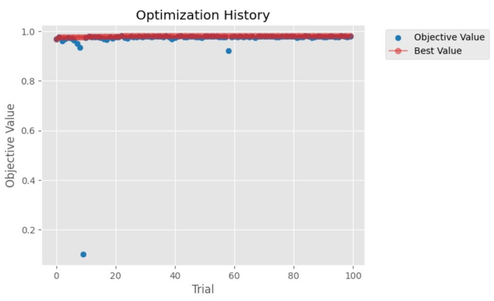

**Інтерпретація:** Optuna ефективно знайшла оптимальні гіперпараметри на ранніх стадіях (≈перші 10 trials). Подальші trials підтверджують стабільність і лише незначно покращують результат. Два outlier-trials (trials ≈8 і ≈59) з низьким value — результат «несприятливих» комбінацій hp.

### Практичний крок 22 — Matplotlib: Parameter Importances

```python
# Графік 2: Parameter Importances (matplotlib)
plt.figure(figsize=(10, 6))
optuna.visualization.matplotlib.plot_param_importances(study)
plt.title("Parameter Importances")
plt.show()
```

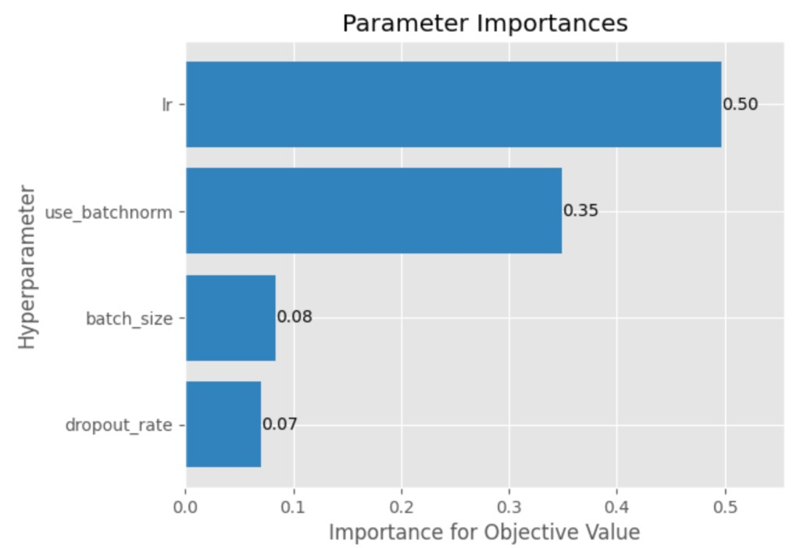

**Інтерпретація:** Швидкість навчання (lr) найважливіша (50% важливості). BatchNorm — другий за важливістю (35%). Розмір батча і dropout мають значно менший вплив. Висновок: **спочатку налаштовуй lr і BatchNorm**.

### Практичний крок 23 — Matplotlib: Parallel Coordinates

```python
# Графік 3: Parallel Coordinate Plot (matplotlib)
plt.figure(figsize=(10, 6))
optuna.visualization.matplotlib.plot_parallel_coordinate(study)
plt.title("Parallel Coordinate Plot")
plt.show()
```

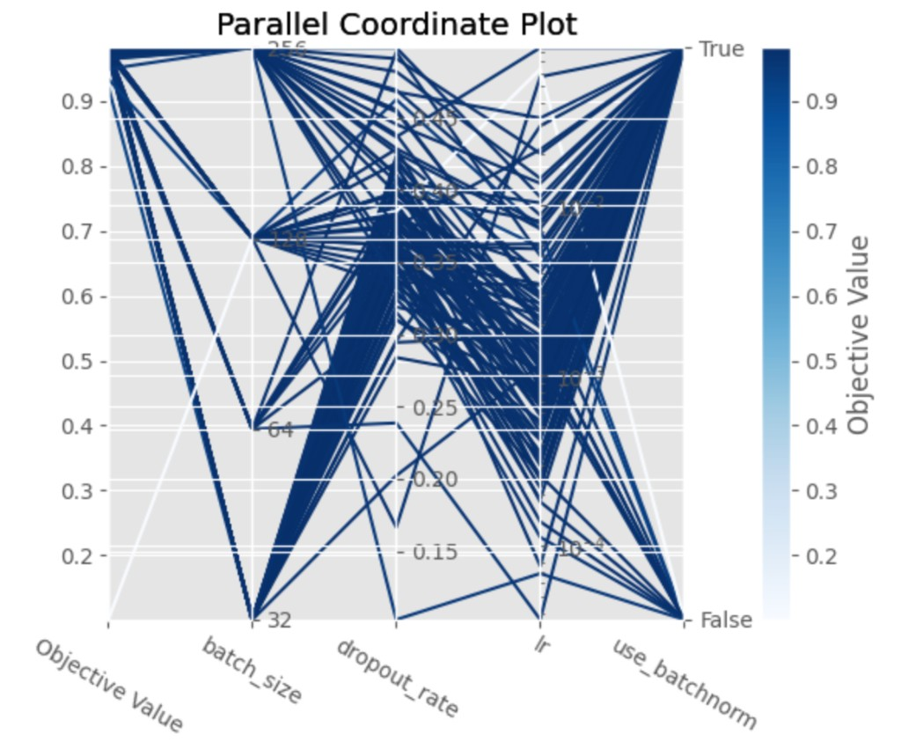

**Інтерпретація:** Темно-сині лінії (кращий objective) проходять через низький lr (10⁻⁴–10⁻³) і use_batchnorm=True. Різноманітні значення batch_size і dropout — менш важливі.

### Практичний крок 24 — Matplotlib: Slice Plot

```python
# Графік 4: Slice Plot (matplotlib)
plt.figure(figsize=(10, 6))
optuna.visualization.matplotlib.plot_slice(study)
plt.title("Slice Plot")
plt.show()
```

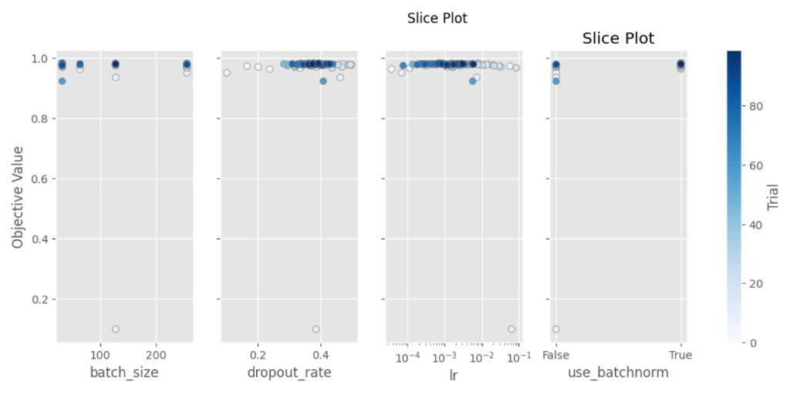

**Інтерпретація:** Підтверджує важливість lr: найкращі результати (точки зверху) зосереджені при lr ∈ [10⁻⁴, 10⁻²]. use_batchnorm=True значно стабільніший від False.

### Практичний крок 25 — Plotly: Інтерактивні версії (4 графіки)

```python
# Графік 5: Optimization History (Plotly, інтерактивний)
fig = optuna.visualization.plot_optimization_history(study)
fig.show()
```

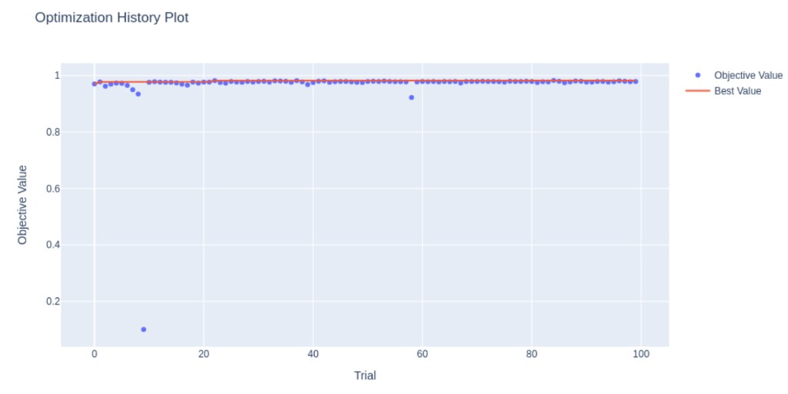

```python
# Графік 6: Parameter Importances (Plotly)
fig = optuna.visualization.plot_param_importances(study)
fig.show()
```

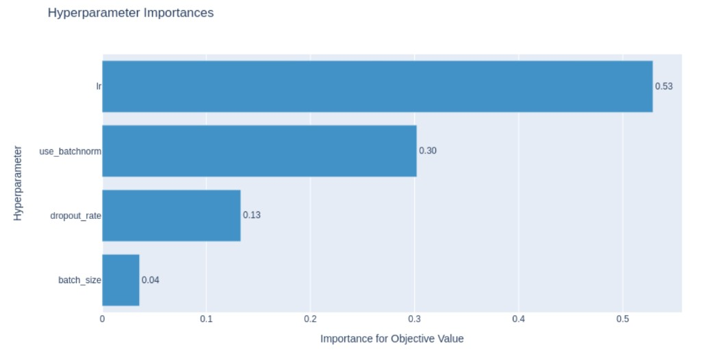

```python
# Графік 7: Parallel Coordinates (Plotly)
fig = optuna.visualization.plot_parallel_coordinate(study)
fig.show()
```

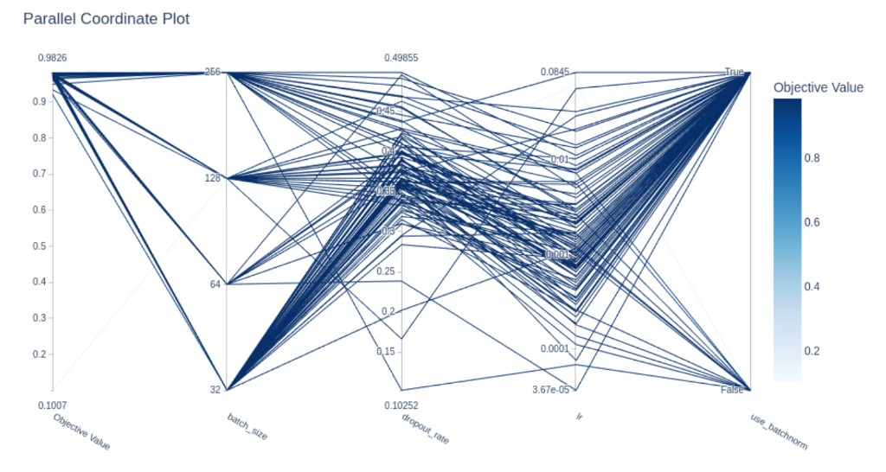

```python
# Графік 8: Slice Plot (Plotly)
fig = optuna.visualization.plot_slice(study)
fig.show()
```

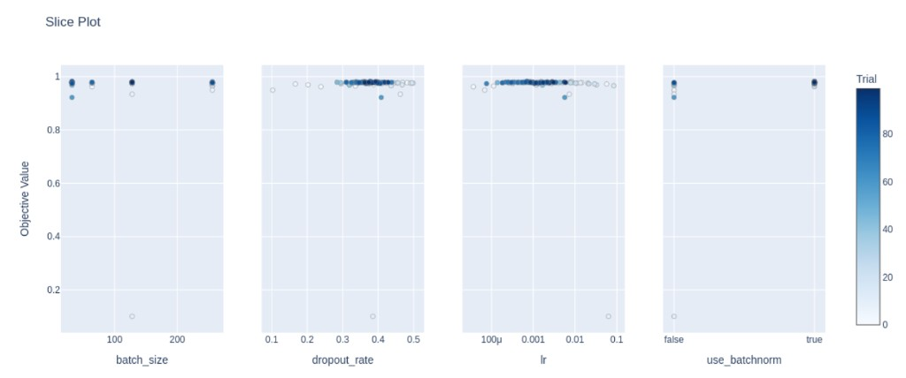

### Практичний крок 26 — Підсумок Optuna

**Ключові результати:**
- Найкращий trial: **val accuracy 98.26%** (trial №84)
- Оптимальні параметри: `lr=0.000699, dropout=0.377, BatchNorm=True, batch_size=32`
- Пошук тривав ≈3 год (100 trials на CPU)
- TPE сам знаходить перспективний регіон: низькі lr + BatchNorm

| Параметр | Найкраще значення | Діапазон пошуку | Важливість |
|---|---|---|---|
| lr | 0.000699 | [1e-5, 1e-1] | 50–53% |
| use_batchnorm | True | {True, False} | 30–35% |
| dropout_rate | 0.377 | [0.1, 0.5] | 7–13% |
| batch_size | 32 | {32, 64, 128, 256} | 4–8% |

---

## ЧАСТИНА 16. ФІНАЛЬНА МОДЕЛЬ ТА ПОРІВНЯННЯ РЕЗУЛЬТАТІВ

> ### БЛОК 10 — Фінальна модель і зведена таблиця (Кроки 27–28)
> **Що робимо:** тренуємо модель з найкращими Optuna-параметрами та зводимо всі результати.
> **Навіщо:** побачити повну картину — що дав кожен метод.

### Практичний крок 27 — Тренування фінальної моделі

```python
# Тренування фінальної моделі з найкращими Optuna-параметрами
best_params = study.best_trial.params
print("Найкращі гіперпараметри:", best_params)

# Будуємо фінальну модель
final_model = Net(
    dropout_rate=best_params['dropout_rate'],
    use_batchnorm=best_params['use_batchnorm']
)
final_optimizer = optim.Adam(final_model.parameters(), lr=best_params['lr'])
final_criterion = nn.CrossEntropyLoss()
final_loader = DataLoader(train_dataset, batch_size=best_params['batch_size'], shuffle=True)

train_losses, train_accs, val_losses, val_accs = [], [], [], []

for epoch in range(20):
    final_model.train()
    train_loss = 0; train_correct = 0; train_total = 0
    for data, target in final_loader:
        final_optimizer.zero_grad()
        output = final_model(data)
        loss = final_criterion(output, target)
        loss.backward()
        final_optimizer.step()
        train_loss += loss.item()
        _, predicted = output.max(1)
        train_total += target.size(0)
        train_correct += predicted.eq(target).sum().item()

    train_loss /= len(final_loader)
    train_acc = 100. * train_correct / train_total
    train_losses.append(train_loss); train_accs.append(train_acc)

    final_model.eval()
    val_loss = 0; val_correct = 0; val_total = 0
    with torch.no_grad():
        for data, target in val_loader:
            output = final_model(data)
            val_loss += final_criterion(output, target).item()
            _, predicted = output.max(1)
            val_total += target.size(0)
            val_correct += predicted.eq(target).sum().item()

    val_loss /= len(val_loader)
    val_acc = 100. * val_correct / val_total
    val_losses.append(val_loss); val_accs.append(val_acc)
    print(f'Epoch [{epoch+1}/20]: Train {train_acc:.2f}% | Val {val_acc:.2f}%')

# Зберігаємо фінальну модель
torch.save(final_model.state_dict(), '/kaggle/working/models/final_best.pt')
print("Фінальну модель збережено.")

visualize_training_history(train_losses, train_accs, val_losses, val_accs)
```

### Практичний крок 28 — Зведена таблиця всіх підходів

| Підхід | Train Acc | Val Acc | Val Loss | Розрив | Висновок |
|---|---|---|---|---|---|
| Baseline | 99.58% | 97.97% | 0.157 | 1.61% | Перенавчання після 3-ї епохи |
| L2 (λ=1e-3) | 98.57% | 97.19% | 0.096 | 1.38% | Менший gap, нижчий val loss |
| Early Stop (pat=2) | 98.53% | 97.58% | 0.095 | 0.95% | Ефективна зупинка, мало епох |
| Dropout (p=0.2) | 99.02% | **98.05%** | 0.114 | 0.97% | Найкраща val acc без Optuna |
| BatchNorm | 99.70% | 97.97% | 0.095 | 1.73% | Найшвидше навчання |
| **Optuna (best)** | — | **98.26%** | — | — | **Найкраща val acc загалом** |

**Загальні висновки:**
1. **L2** зменшила val loss (0.096 vs 0.157) ціною невеликого зниження val accuracy.
2. **Early Stopping** — найпростіший метод, але обмежує кількість епох навчання.
3. **Dropout** дав найкращу val accuracy серед «ручних» методів (98.05%).
4. **BatchNorm** прискорив навчання, але не запобіг легкому перенавчанню.
5. **Optuna** поєднала всі методи і знайшла оптимальний баланс (98.26%).
6. Комбінування методів (Dropout + BN + правильний LR) дає кращий результат, ніж кожен окремо.

---

## ПІДСУМКИ

Ви виконали повний цикл від baseline до автоматичного пошуку гіперпараметрів! Перевірте себе:

✅ Зрозуміли, як читати криві train/val loss і accuracy — діагностика перенавчання.

✅ Застосували L1 і L2 регуляризацію: формули штрафу, градієнти, `weight_decay` в Adam, різниця Adam vs AdamW.

✅ Реалізували Early Stopping з patience і збереженням `best_state_dict`.

✅ Додали Dropout і зрозуміли inverted dropout (масштабування 1/(1−p)), train vs eval режими.

✅ Додали BatchNorm: формули нормалізації, γ/β, running stats, порядок шарів Linear → BN → ReLU.

✅ Ознайомились з оптимізаторами: SGD → Momentum → RMSprop → Adam → AdamW.

✅ Вивчили LR schedulers: StepLR, ExponentialLR, CosineAnnealing, ReduceLROnPlateau, OneCycleLR; правильне місце `scheduler.step()`.

✅ Вивчили концепції Optuna: Study, Trial, objective, samplers (TPE, Random, CMA-ES, NSGA-II), pruners.

✅ Запустили 100-trial пошук і знайшли оптимальні гіперпараметри (val acc 98.26%).

✅ Проінтерпретували 8 Optuna-графіків: history, importances, parallel coordinates, slice plots.

**Що далі:**
- Спробуйте **більшу кількість trials** (n_trials=200) або **CMA-ES sampler** для точнішого пошуку.
- Додайте до простору пошуку **кількість шарів і нейронів** (`suggest_int('n_layers', 1, 4)`).
- Спробуйте **MedianPruner** для дострокової зупинки невдалих trials (значно прискорює пошук).
- Вивчіть **Optuna Dashboard** для реального часу моніторингу (`pip install optuna-dashboard`).
- Застосуйте здобуті навички до фінального проєкту курсу.

---

## EXAM / REVISION CHEAT SHEET

### 1) L1 Регуляризація (Lasso) — швидко
- Штраф: λ · Σ|w|; градієнт: λ · sign(w)
- Зануляє малі ваги → розріджена (sparse) модель
- Корисна коли мало важливих ознак
- У PyTorch: вручну або через `L1Loss`
- Формула повної функції втрат: L_total = L_data + λ · Σ|w|

### 2) L2 Регуляризація (Ridge) — швидко
- Штраф: λ · Σw²; градієнт: 2λ · w
- Рівномірно зменшує всі ваги (не до нуля)
- У PyTorch: `optimizer = Adam(..., weight_decay=λ)`
- AdamW = Adam з decoupled weight decay (краще для Transformer)
- Формула: L_total = L_data + λ · Σw²

### 3) Early Stopping — швидко
- Зупинка коли val loss не покращується `patience` епох
- Зберігати `best_state = copy.deepcopy(model.state_dict())`
- Відновити після зупинки: `model.load_state_dict(best_state)`
- patience=2 — дуже мале; реально: 5–10

### 4) Dropout — швидко
- Зануляє нейрони з імов. p; масштабує решту × 1/(1−p)
- Train: активний; Eval: вимкнено → `model.eval()` перед val
- Formla: E[h̃ᵢ] = hᵢ (математичне сподівання незмінне)
- Типові значення p: 0.2–0.5 для прихованих шарів
- Найкращий метод для регуляризації глибоких мереж

### 5) Batch Normalization — швидко
- x̂ = (x − μ_B) / √(σ²_B + ε); y = γ·x̂ + β
- Train: batch stats; Eval: running_mean / running_var
- Порядок: Linear → BN → ReLU → (Dropout)
- BN vs LayerNorm: BN по батчу (CV/MLP), LN по каналах (Transformer)
- Прискорює навчання, дозволяє більші LR

### 6) Оптимізатори — швидко
- SGD: w ← w − η·∇L (простий, повільний)
- Momentum: накопичує v = β·v + g; w ← w − η·v
- Adam: m = β₁·m + g; v = β₂·v + g²; w ← w − η·m̂/√v̂
- AdamW: те саме, але weight decay окремо від gradient update
- Типовий вибір: Adam/AdamW, lr=1e-3, β₁=0.9, β₂=0.999

### 7) LR Schedulers — швидко
- StepLR: α × γ кожні N епох
- ExponentialLR: α × γ кожну епоху (α_t = α₀ · γᵗ)
- CosineAnnealing: α по cos-кривій від α₀ до α_min
- ReduceLROnPlateau: α × factor якщо немає покращення за patience епох
- `scheduler.step()` — після epoch; ReduceOnPlateau — `step(val_loss)`

### 8) Grid / Random / Bayesian (TPE) — швидко
- Grid: перебирає всі комбінації; O(N₁×N₂×...); тільки для ≤3 параметрів
- Random: рандомний вибір; кращий за Grid при ≥4 параметрах
- TPE: будує модель (KDE) для «хороших» і «поганих» значень; вибирає де EI найбільша
- Optuna TPE набагато ефективніший за Random при великому просторі

### 9) Optuna API — швидко
- `study = optuna.create_study(direction='maximize')`
- `study.optimize(objective, n_trials=100)`
- `trial.suggest_float('lr', 1e-5, 1e-1, log=True)` — float у лог-шкалі
- `trial.suggest_int('n_layers', 1, 5)` — ціле число
- `trial.suggest_categorical('opt', ['adam', 'sgd'])` — категоріальне
- `study.best_trial.value`, `study.best_trial.params` — результат

### 10) Діагностика кривих — швидко
- train loss ↓, val loss ↓ — хороше навчання
- train loss ↓, val loss стабілізується → починається overfitting
- train loss ↓, val loss ↑ — явне перенавчання; потрібна регуляризація
- Обидва loss плато при великих значеннях → underfitting; складніша модель
- Gap train−val acc > 2% → підозра на overfitting

### Таблиця-порівняння методів регуляризації

| Метод | Val Accuracy | Переваги | Недоліки |
|---|---|---|---|
| Baseline | 97.97% | Простота | Перенавчання |
| L2 | 97.19% | Проста реалізація (weight_decay) | Не найкраща val acc |
| Early Stopping | 97.58% | Зупиняє в правильний момент | Мало епох, треба зберігати ваги |
| Dropout | **98.05%** | Найкраща val acc без Optuna | Сповільнює навчання |
| BatchNorm | 97.97% | Прискорення навчання | Легке перенавчання |
| Optuna (комбо) | **98.26%** | Автоматичний пошук оптимуму | Довго (≈3 год на 100 trials) |

---

## ДОДАТОК: ПОКРОКОВИЙ РОЗБІР ПРОЦЕСУ НАВЧАННЯ

Детальний розбір того, що відбувається **всередині** при тренуванні моделі з Dropout і BatchNorm на MNIST.

### 1. Вхідний батч

DataLoader формує батч розміром (64, 1, 28, 28) — 64 зображення розміром 1×28×28 пікселів.

### 2. Flatten: (64, 1, 28, 28) → (64, 784)

```
data.view(data.size(0), -1)  →  (64, 784)
```
Зображення «розгортається» в один вектор 784 чисел.

### 3. Перший лінійний шар: fc1

```
(64, 784) × W₁(784, 512) + b₁(512)  =  (64, 512)
```
Кожен з 64 зразків стає вектором 512 чисел. Матриця W₁ має 784×512 = 401 920 параметрів.

### 4. BatchNorm1d (якщо use_batchnorm=True)

$$
\hat{x}_{ij} = \frac{x_{ij} - \mu_j}{\sqrt{\sigma_j^2 + \varepsilon}}
$$

де j = 1..512 (кожен з 512 нейронів нормалізується окремо), μ_j і σ_j — статистики по батчу 64 зразків.

Потім: y_ij = γ_j · x̂_ij + β_j (γ і β — навчувані для кожного з 512 нейронів).

### 5. ReLU активація

$$
\text{ReLU}(x) = \max(0, x)
$$

Всі від'ємні значення стають 0. Форма тензора залишається (64, 512).

### 6. Dropout маска

При train mode: формується випадкова маска M ∈ {0, 1}^(64×512), де кожен елемент = 0 з імовірністю p.
```
output = input * M / (1 - p)
```
Форма залишається (64, 512). В середньому dropout_rate×512 ≈ 0.37×512 ≈ 189 нейронів вимкнено.

### 7. Другий лінійний шар: fc2

```
(64, 512) × W₂(512, 512) + b₂(512)  =  (64, 512)
```

### 8. Знову BN + ReLU + Dropout (якщо є)

Повторення кроків 4–6 для другого шару.

### 9. Вихідний шар: fc3

```
(64, 512) × W₃(512, 10) + b₃(10)  =  (64, 10)
```

Результат — logits: 10 чисел для кожного зразка, де індекс = клас цифри (0–9).

### 10. CrossEntropyLoss

$$
L_{\text{CE}} = -\frac{1}{N} \sum_{i=1}^{N} \log \frac{e^{z_{y_i}}}{\sum_{j=1}^{C} e^{z_{ij}}}
$$

де z_{ij} — logit для зразка i та класу j; y_i — правильний клас.

Простіше: CrossEntropy = LogSoftmax + NLLLoss. PyTorch `nn.CrossEntropyLoss` робить це в один крок.

### 11. L2 штраф (якщо weight_decay > 0)

При `optimizer.step()` Adam додатково зменшує ваги на λ·w (AdamW) або додає 2λ·w до градієнту (стандартний Adam).

### 12. Backpropagation: ланцюгове правило

`loss.backward()` обчислює ∂L/∂w для кожного параметра через ланцюгове правило:

$$
\frac{\partial L}{\partial W_1} = \frac{\partial L}{\partial z^{(3)}} \cdot \frac{\partial z^{(3)}}{\partial h^{(2)}} \cdot \frac{\partial h^{(2)}}{\partial z^{(2)}} \cdot \frac{\partial z^{(2)}}{\partial h^{(1)}} \cdot \frac{\partial h^{(1)}}{\partial z^{(1)}} \cdot \frac{\partial z^{(1)}}{\partial W_1}
$$

### 13. Як BN пропускає градієнт

BN диференційований: градієнт проходить через нормалізацію і через навчувані γ, β.

$$
\frac{\partial L}{\partial \hat{x}} = \gamma \cdot \frac{\partial L}{\partial y}
$$

### 14. Як Dropout пропускає градієнт

При backward Dropout просто анулює градієнти там, де маска M=0:

$$
\frac{\partial L}{\partial x_i} = \frac{\partial L}{\partial \tilde{h}_i} \cdot \frac{M_i}{1-p}
$$

### 15. optimizer.step() — оновлення ваг

Adam обчислює адаптивний крок для кожного параметра:
```
m = β₁·m + (1-β₁)·grad
v = β₂·v + (1-β₂)·grad²
w -= lr · m̂ / (√v̂ + ε)
```

### 16. optimizer.zero_grad() — обнулення градієнтів

Перед наступним батчем PyTorch не обнуляє градієнти автоматично — треба явно `optimizer.zero_grad()`.

### 17. Валідаційна фаза

`model.eval()` перемикає:
- Dropout: не застосовується (маска = 1 для всіх).
- BatchNorm: замість batch stats використовує накопичені running_mean / running_var.

`torch.no_grad()` відключає обчислення графа обчислень — економить пам'ять.

### 18. Early Stopping логіка

```
if val_loss < best_val_loss:
    оновлюємо best_val_loss, зберігаємо ваги
else:
    counter += 1
    if counter >= patience: STOP
```

### 19. Зовнішній цикл Optuna (Trial → objective)

Optuna TPE sampler будує модель:
- L(x): KDE для «хороших» hp (де objective > поріг).
- G(x): KDE для «поганих» hp.
- Наступне значення hp обирається там, де L(x)/G(x) максимальне (Expected Improvement).

### 20. Після n_trials: study.best_trial

Optuna повертає trial з найвищим (або найнижчим) значенням objective.

---

### Суцільна картина — ASCII-ланцюжок повного pipeline

```
[MNIST DataLoader]
        │
        ▼ батч (64, 1, 28, 28)
    view(-1, 784)
        │
        ▼ (64, 784)
    fc1: Linear(784→512)
        │
        ▼ (64, 512)
    BN1: BatchNorm1d(512)  ← normalize per neuron, update running stats
        │
        ▼ (64, 512)  mean≈0, std≈1
    ReLU
        │
        ▼ (64, 512)  negatives=0
    Dropout(p)  ← mask random neurons, scale × 1/(1-p)
        │
        ▼ (64, 512)
    fc2: Linear(512→512)
        │
    BN2 → ReLU → Dropout
        │
        ▼ (64, 512)
    fc3: Linear(512→10)
        │
        ▼ (64, 10)  logits
    CrossEntropyLoss
        │
        ▼  scalar loss
    + L2 penalty (weight_decay в optimizer)
        │
    loss.backward()
        │
        ▼ градієнти ∂L/∂w для кожного параметра
    optimizer.step()  ← Adam: адаптивний крок
        │
        ▼  оновлені ваги
    scheduler.step()  ← StepLR / ReduceOnPlateau / ...
        │
        ▼  оновлений LR
    [наступний батч]

    === Optuna (зовнішній цикл) ===
    Study.optimize(objective, n_trials=100)
        │
        ▼ для кожного trial:
    TPE sampler → пропонує {lr, dropout, BN, batch}
        │
    objective(trial) → тренує модель 10 епох → повертає val_acc
        │
    TPE оновлює KDE для L(x) і G(x)
        │
    ▼ після 100 trials: study.best_trial
```

---

### Backpropagation — зворотне поширення помилки

**1.** `loss.backward()` запускає ланцюгове правило від scalar loss до всіх листових вузлів графа.

**2.** Для вихідного шару (fc3):

$$
\frac{\partial L}{\partial W_3} = \frac{\partial L}{\partial z^{(3)}} \cdot (h^{(2)})^T
$$

де ∂L/∂z⁽³⁾ — градієнт від CrossEntropy до logits (у PyTorch: softmax_output − one_hot_target).

**3.** Для кожного шару нижче — множимо на транспоновану матрицю ваг:

$$
\frac{\partial L}{\partial h^{(k-1)}} = (W_k)^T \cdot \frac{\partial L}{\partial z^{(k)}}
$$

**4.** ReLU відсікає градієнт там, де вхід < 0 (gate):

$$
\frac{\partial \text{ReLU}(z)}{\partial z} = \begin{cases} 1 & z > 0 \\ 0 & z \leq 0 \end{cases}
$$

**5.** L2 додає 2λ·w до кожного ∂L/∂w (або в AdamW — пряме зменшення ваги).

**6.** BN пропускає градієнт з поправками на γ і статистики батчу.

**7.** Dropout обнуляє градієнт для вимкнених нейронів (маска M = 0).

---

### Найголовніша картина

| Крок | Операція | Вхід → Вихід | Що навчається |
|---|---|---|---|
| **Forward** | view → fc1 → BN → ReLU → Dropout → fc2 → BN → ReLU → Dropout → fc3 | (B,784) → (B,10) | — |
| **Loss** | CrossEntropy + L2 penalty | (B,10), (B,) → scalar | — |
| **Backward** | Chain rule: ∂L/∂W₃ → ∂L/∂W₂ → ∂L/∂W₁ | scalar → градієнти для всіх w | — |
| **Optimizer** | Adam: adagrad step по кожному w | градієнти → нові значення w | W₁, W₂, W₃, b, γ, β |
| **Scheduler** | Оновлення LR після епохи | старий LR → новий LR | — |
| **Optuna** | TPE: нові hp → objective → KDE update | — → {lr,p,BN,bs} | — |

---

## КОРИСНІ ПОСИЛАННЯ

- [Optuna — офіційний сайт](https://optuna.org/) — фреймворк оптимізації гіперпараметрів, документація і приклади
- [Optuna: Pythonic Search Space](https://optuna.readthedocs.io/en/stable/tutorial/10_key_features/002_configurations.html) — всі методи `suggest_*` з прикладами
- [Kaggle: Overfitting and Underfitting](https://www.kaggle.com/code/ryanholbrook/overfitting-and-underfitting) — практичний notebook Kaggle курсу
- [Kaggle: Dropout and Batch Normalization](https://www.kaggle.com/code/ryanholbrook/dropout-and-batch-normalization) — практичний notebook Kaggle курсу
- [PyTorch lr_scheduler](https://pytorch.org/docs/stable/optim.html#how-to-adjust-learning-rate) — офіційна документація по всіх планувальниках LR
- [Dropout: A Simple Way to Prevent Neural Networks from Overfitting (2014)](http://jmlr.org/papers/v15/srivastava14a.html) — оригінальна стаття Srivastava та ін.
- [Batch Normalization: Accelerating Deep Network Training (2015)](https://arxiv.org/abs/1502.03167) — оригінальна стаття Ioffe & Szegedy
- [Decoupled Weight Decay Regularization (AdamW, 2019)](https://arxiv.org/abs/1711.05101) — стаття Loshchilov & Hutter про AdamW
- [Оригінальний notebook лекції (GitHub)](https://github.com/goitacademy/DEEP-LEARNING-FOR-COMPUTER-VISION-AND-NLP/blob/main/notebooks/Module_7_Lecture_14_Class.ipynb) — вихідний код до цього заняття

---

## СТРУКТУРА ФАЙЛІВ

```
тема_14/
├── 14_optimization_hyperparameters_notes.md   ← цей конспект
└── images/
    ├── overfitting_baseline_curves.png
    │     ← Baseline: train loss (синя) знижується до 0.015; val loss (червона) стабілізується
    │       та починає рости після 3-ї епохи до 0.16 — класичний приклад перенавчання
    ├── l2_regularization_curves.png
    │     ← L2 (weight_decay=1e-3): повільніше падіння train loss (до 0.043), менший gap
    │       між train і val, val loss 0.095 — краща генералізація ніж baseline
    ├── dropout_neurons_random_off.gif
    │     ← Анімація Dropout: нейромережа з двома прихованими шарами; сірі нейрони
    │       (вимкнені) на кожній ітерації випадково змінюються
    ├── dropout_training_curves.png
    │     ← Dropout(0.2): train loss падає повільніше (0.036), val loss стабільний (0.114);
    │       val accuracy 98.05% — найкраща серед ручних методів
    ├── batchnorm_training_curves.png
    │     ← BatchNorm: швидке початкове навчання (висока val accuracy вже на epoch 0);
    │       train accuracy 99.70%; стабільні криві
    ├── optuna_optimization_history_mpl.png
    │     ← Matplotlib: Objective Value (сині точки) і Best Value (червона) по 100 trials;
    │       швидке досягнення ≈0.97 і стабільність; два outlier-trials
    ├── optuna_param_importances_mpl.png
    │     ← Matplotlib: горизонтальний bar chart важливості; lr=0.50, use_batchnorm=0.35,
    │       batch_size=0.08, dropout_rate=0.07
    ├── optuna_parallel_coordinate_mpl.png
    │     ← Matplotlib: паралельні координати; темно-сині лінії (кращий objective) при
    │       низьких lr і use_batchnorm=True
    ├── optuna_slice_plot_mpl.png
    │     ← Matplotlib: 4 панелі; найкращі результати при lr ∈ [1e-4, 1e-2] і BN=True
    ├── optuna_optimization_history_plotly.png
    │     ← Plotly інтерактивний: синя лінія Best Value стабілізується після ≈20 trials
    ├── optuna_param_importances_plotly.png
    │     ← Plotly інтерактивний: lr=0.53, use_batchnorm=0.30, dropout_rate=0.13, batch=0.04
    ├── optuna_parallel_coordinate_plotly.png
    │     ← Plotly інтерактивний: можна фільтрувати trials; кластер кращих при низькому lr
    └── optuna_slice_plot_plotly.png
          ← Plotly інтерактивний: batchnorm=true дає стабільно ≥0.95 objective
```
