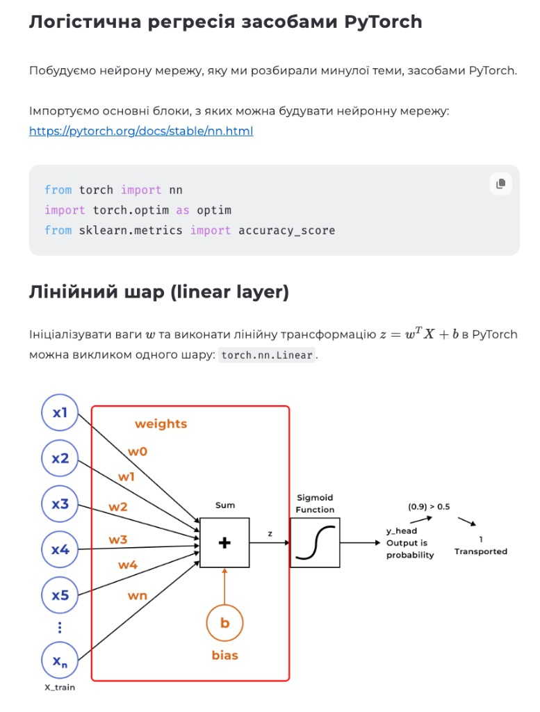
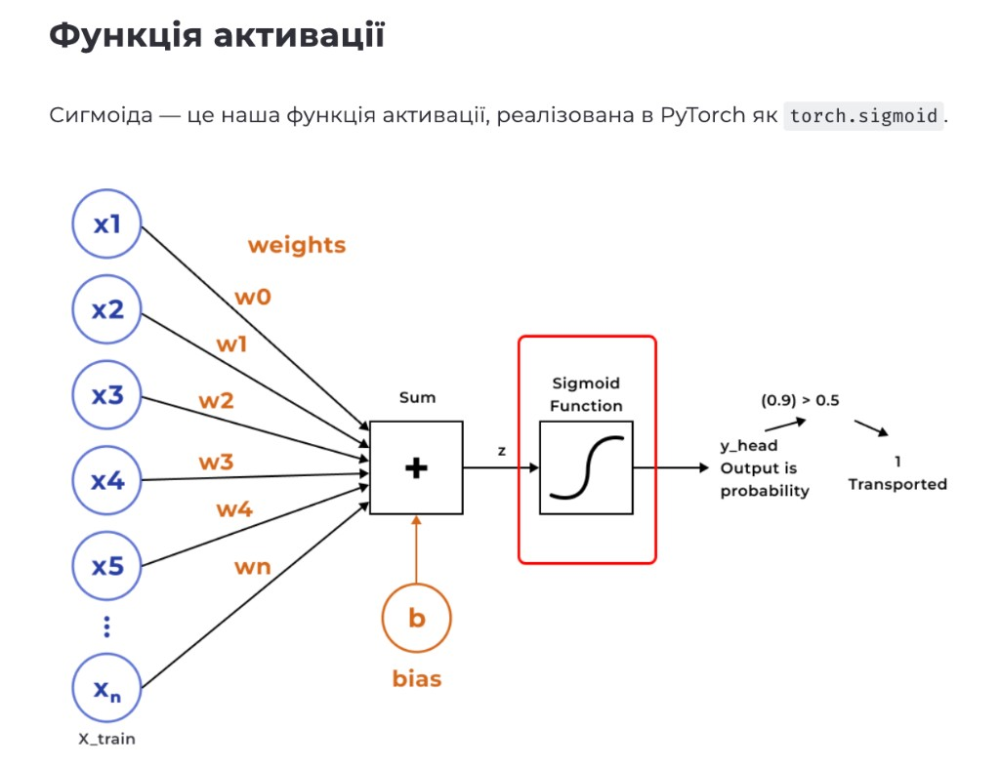

# КОНСПЕКТ ЛЕКЦІЇ: Логістична регресія засобами PyTorch — Знайомство з тензорами

> **Де виконувати:** [Google Colab](https://colab.research.google.com) — відкрий посилання в браузері, натисни **"New notebook"**, і починай виконувати кроки по черзі. Кожен блок коду вставляй в окрему клітинку і запускай кнопкою ▶ або клавішами **Shift + Enter**.
>
> **Альтернатива:** локальний Jupyter Notebook. Встанови: `pip install jupyterlab torch numpy pandas scikit-learn`, запусти `jupyter lab`. Документація: [jupyter.org/install](https://jupyter.org/install)
>
> **Для macOS (Apple Silicon):** PyTorch підтримує MPS-прискорення. Встанови: `pip install torch torchvision torchaudio`. Перевір: `torch.backends.mps.is_available()`. Інструкція: [pytorch.org/get-started/locally](https://pytorch.org/get-started/locally/)

---

## ЧАСТИНА 0. ТЕОРІЯ — НАВІЩО ФРЕЙМВОРКИ

### Що таке фреймворк глибокого навчання?

Уяви, що ти будуєш будинок. Можна все робити вручну — самому виготовляти цеглу, пиляти дошки. А можна взяти готові блоки. **Фреймворк** — набір таких «готових блоків» для побудови нейронних мереж.

Минулої теми ми будували логістичну регресію на NumPy «руками». Тепер відтворимо те саме за допомогою **PyTorch** — і побачимо, наскільки це простіше.

### Чому PyTorch, а не NumPy?

| Проблема з NumPy | Як вирішує PyTorch |
|---|---|
| Градієнти рахуємо вручну (формули) | Автоматична диференціація — `loss.backward()` і все |
| Працює лише на CPU | Підтримує GPU (NVIDIA CUDA, Apple MPS) |
| Потрібно писати кожну операцію | Готові шари: `nn.Linear`, `nn.Sigmoid`, оптимізатори |
| Складно масштабувати | Батч-обробка, DataLoader, розподілені обчислення |

### Три головні фреймворки

| Фреймворк | Розробник | Граф обчислень | Головна сила |
|---|---|---|---|
| **PyTorch** | Meta | Динамічний (на льоту) | Зручність, дебаг, дослідження |
| **TensorFlow** | Google | Статичний (описується заздалегідь) | Продакшн, оптимізація |
| **Keras** | Google | Високорівневий API над TF | Простота коду |

**Ми використовуємо PyTorch** — він найбільш «пітонічний», легко дебажиться, тісно інтегрований з NumPy.

### Розшифровка всіх скорочень

| Символ / Скорочення | Що означає | Простими словами |
|---|---|---|
| `tensor` | тензор | багатовимірний масив (вектор, матриця, стос матриць) |
| `nn.Module` | Neural Network Module | базовий «цеглинка» для будівництва мереж |
| `nn.Linear(in, out)` | лінійний шар | множення на ваги + зміщення: z = wᵀX + b |
| `nn.Sigmoid()` | функція активації | перетворює число в ймовірність [0, 1] |
| `nn.BCELoss()` | Binary Cross-Entropy Loss | формула помилки для задач «так/ні» |
| `optim.SGD` | Stochastic Gradient Descent | оптимізатор — оновлює ваги за градієнтом |
| `lr` | learning rate | швидкість навчання (розмір кроку) |
| `epoch` | епоха | одне повне проходження всіх даних |
| `forward pass` | пряме проходження | дані йдуть від входу до виходу |
| `backward pass` | зворотне поширення | обчислення градієнтів від виходу до входу |
| `grad` | gradient (градієнт) | напрямок + величина найшвидшого зростання помилки |
| `.squeeze()` | стиснути | видалити вимір розміру 1 |
| `.unsqueeze()` | розтиснути | додати вимір розміру 1 |
| `batch` | батч | група зразків, що обробляються разом |
| `broadcasting` | трансляція | «розтягування» маленького тензора при операціях |

---

## ЧАСТИНА 1. ПІДГОТОВКА — ІМПОРТ БІБЛІОТЕК

### Крок 1. Імпорт

**Що робимо:** підключаємо всі інструменти, які будемо використовувати.

```python
import numpy as np
import pandas as pd

from sklearn.impute import SimpleImputer
from sklearn.model_selection import train_test_split
from sklearn.metrics import accuracy_score

import torch
import torch.nn as nn
import torch.optim as optim

import warnings
warnings.filterwarnings('ignore')
```

**Пояснення кожного рядка:**

- `import numpy as np` — бібліотека числових обчислень. `np` — короткий псевдонім.
- `import pandas as pd` — бібліотека для таблиць (DataFrame). `pd` — псевдонім.
- `from sklearn.impute import SimpleImputer` — заповнювач пропусків у даних (замінює порожні клітинки медіаною).
- `from sklearn.model_selection import train_test_split` — ділить дані на тренувальну і тестову частини.
- `from sklearn.metrics import accuracy_score` — рахує відсоток правильних відповідей моделі.
- `import torch` — **PyTorch** — головний фреймворк глибокого навчання. Працює з тензорами.
- `import torch.nn as nn` — модуль **neural networks**: готові шари (`Linear`), функції активації (`Sigmoid`), функції втрат (`BCELoss`).
- `import torch.optim as optim` — модуль **оптимізаторів**: алгоритми оновлення ваг (`SGD`, `Adam`).
- `warnings.filterwarnings('ignore')` — ховаємо непотрібні попередження.

---

## ЧАСТИНА 2. ТЕНЗОРИ — ОСНОВА PyTorch

### Що таке тензор?

**Тензор** — основна структура даних PyTorch. Це як NumPy-масив, але з суперздібностями:

| Вимірів | Назва | Приклад |
|---|---|---|
| 0 | Скаляр | одне число: `5` |
| 1 | Вектор | рядок чисел: `[1, 2, 3]` |
| 2 | Матриця | таблиця: `[[1,2],[3,4]]` |
| 3+ | Тензор | стос таблиць (кольорове зображення: висота × ширина × 3 канали) |

**Суперздібності** порівняно з NumPy:
- Працює на GPU → обчислення в десятки разів швидші
- Автоматичне диференціювання → не потрібно вручну рахувати градієнти

---

### Функція, метод, атрибут — у чому різниця?

Перш ніж рухатись далі, розберемось із трьома термінами, які постійно зустрічатимуться в коді.

| Що | Як виглядає | Пояснення |
|---|---|---|
| **Функція** | `torch.rand(3, 4)` | Самостійна команда. Викликається через ім'я бібліотеки/модуля. Не «прив'язана» до конкретного об'єкта. |
| **Метод** | `tensor.reshape(2, 6)` | Функція, яка «належить» об'єкту (тензору). Викликається через крапку після об'єкта. Працює з даними цього об'єкта. |
| **Атрибут** | `tensor.shape` | Властивість об'єкта — просто значення, **без дужок `()`**. Нічого не виконує, лише повертає інформацію. |

**Приклади на тензорах:**

```python
import torch

# Функція — створює новий тензор (не прив'язана до існуючого)
t = torch.rand(2, 3)          # torch.rand — функція модуля torch

# Атрибут — запитуємо властивість (БЕЗ дужок)
print(t.shape)                 # torch.Size([2, 3]) — форма
print(t.dtype)                 # torch.float32 — тип даних
print(t.device)                # cpu — де зберігається

# Метод — виконуємо дію над тензором (З дужками)
r = t.reshape(3, 2)            # змінює форму
n = t.numpy()                  # перетворює в NumPy масив
t.add_(1)                      # додає 1 in-place
```

**Як відрізнити:**
- Є `()` в кінці → **функція** або **метод** (щось виконується)
- Немає `()` → **атрибут** (просто читаємо значення)
- Перед крапкою стоїть об'єкт (`t.reshape(...)`) → **метод**
- Перед крапкою стоїть модуль (`torch.rand(...)`) → **функція**

> **Аналогія:** уяви телефон. `phone.color` — атрибут (колір просто є). `phone.call("мама")` — метод (телефон виконує дію). А `make_phone("iPhone")` — функція (створює новий телефон ззовні).

---

### Крок 2. Створення тензорів

```python
import torch
import numpy as np
```

#### Порожній тензор

```python
x = torch.empty(3, 4)
print(type(x))
print(x)
```

**Що робимо:** виділяємо пам'ять під тензор 3×4, але не заповнюємо. Отримуємо «сміття» з пам'яті.

**Результат:**
```
<class 'torch.Tensor'>
tensor([[ 0.0000e+00,  0.0000e+00, ...]])
```

- `torch.empty(3, 4)` — 3 рядки, 4 стовпці
- Тип `torch.Tensor` = `torch.FloatTensor` = 32-бітні дробові числа за замовчуванням

#### Тензори з конкретними значеннями

```python
zeros = torch.zeros(2, 3)     # заповнений нулями
print(zeros)

ones = torch.ones(2, 3)       # заповнений одиницями
print(ones)

torch.manual_seed(1729)       # фіксуємо «випадковість» для відтворюваності
random = torch.rand(2, 3)     # випадкові числа від 0 до 1
print(random)
```

**Що робимо:** створюємо тензори 2×3 (2 рядки, 3 стовпці), заповнені різними значеннями.

**Результат:**
```
tensor([[0., 0., 0.],
        [0., 0., 0.]])
tensor([[1., 1., 1.],
        [1., 1., 1.]])
tensor([[0.3126, 0.3791, 0.3087],
        [0.0736, 0.4216, 0.0691]])
```

### Крок 3. Відтворюваність — manual_seed

**Навіщо:** щоб «випадкові» числа були однаковими при кожному запуску — для повторюваності результатів.

```python
torch.manual_seed(1729)
random1 = torch.rand(2, 3)
print(random1)

random2 = torch.rand(2, 3)
print(random2)

torch.manual_seed(1729)       # скидаємо seed назад
random3 = torch.rand(2, 3)
print(random3)                # отримуємо ті самі числа, що й random1!
```

**Що отримуємо:** `random1 == random3`, `random2 == random4`. Seed «скидає» генератор у відоме положення.

### Крок 4. Методи `*_like()` — копіювання форми

**Навіщо:** створити тензор такої ж форми, як інший.

```python
x = torch.empty(2, 2, 3)     # 3D тензор: 2 шари × 2 рядки × 3 стовпці
print(x.shape)                # torch.Size([2, 2, 3])

zeros_like_x = torch.zeros_like(x)   # та сама форма, заповнено нулями
ones_like_x = torch.ones_like(x)     # та сама форма, заповнено одиницями
rand_like_x = torch.rand_like(x)     # та сама форма, випадкові числа
```

**Що робимо:** `.shape` — показує розміри тензора. `*_like()` — створює новий тензор з тією ж формою.

### Крок 5. Створення з конкретних даних

```python
some_constants = torch.tensor([[3.1415926, 2.71828], [1.61803, 0.0072897]])
print(some_constants)

some_integers = torch.tensor((2, 3, 5, 7, 11, 13, 17, 19))
print(some_integers)
```

**Що робимо:** `torch.tensor(дані)` — створює тензор з переданого списку/кортежу. Тип визначається автоматично (дробові → float32, цілі → int64). Завжди створює **копію**.

### Крок 6. Типи даних тензора

**Навіщо:** різні задачі потребують різної точності. Наприклад, ваги мережі — float32, а мітки класів — int64.

```python
a = torch.ones((2, 3), dtype=torch.int16)
print(a)

b = torch.rand((2, 3), dtype=torch.float64) * 20.
print(b)

c = b.to(torch.int32)
print(c)
```

**Що робимо:** створюємо тензори з різними типами даних і перетворюємо між ними.

**Отримуємо:**
```
tensor([[1, 1, 1],
        [1, 1, 1]], dtype=torch.int16)
tensor([[ 0.9956,  1.4148,  5.8364],
        [11.2406, 11.2083, 11.6692]], dtype=torch.float64)
tensor([[ 0,  1,  5],
        [11, 11, 11]], dtype=torch.int32)
```

**Два способи встановити тип:**
1. `dtype=torch.int16` — при створенні тензора (аргумент `dtype`)
2. `.to(torch.int32)` — перетворення вже існуючого тензора

> **Зверни увагу:** при перетворенні float → int дробова частина просто відкидається (не округлюється).

**Доступні типи даних PyTorch:**

| dtype | Що зберігає | Приклад | Коли використовувати |
|---|---|---|---|
| `torch.bool` | True/False | `True` | Маски, логічні умови |
| `torch.int8` | маленькі цілі | `-100` | Квантизація моделей |
| `torch.uint8` | невід'ємні цілі | `255` | Пікселі зображень (0–255) |
| `torch.int16` | цілі | `30000` | Рідко |
| `torch.int32` | більші цілі | `100000` | Індекси, мітки класів |
| `torch.int64` | дуже великі цілі | `10^12` | За замовчуванням для цілих |
| `torch.float16` (half) | дробові, менша точність | `3.14` | Прискорення на GPU (менше пам'яті) |
| `torch.float32` (float) | дробові, стандарт DL | `3.14159` | **Стандарт для нейромереж** |
| `torch.float64` (double) | дробові, висока точність | `3.1415926535` | Наукові обчислення (рідко потрібна) |
| `torch.bfloat16` | дробові для ML | `3.14` | Тренування великих моделей |

### Крок 7. Атрибути тензора

**Навіщо:** перевірити форму, тип і пристрій тензора — базова діагностика.

```python
tensor = torch.rand(3, 4)

print(f"Shape of tensor: {tensor.shape}")
print(f"Datatype of tensor: {tensor.dtype}")
print(f"Device tensor is stored on: {tensor.device}")
```

**Отримуємо:**
```
Shape of tensor: torch.Size([3, 4])
Datatype of tensor: torch.float32
Device tensor is stored on: cpu
```

**Три головні атрибути:**
- `.shape` — розміри (форма) тензора
- `.dtype` — тип даних (float32, int64 тощо)
- `.device` — де зберігається: `cpu` або `cuda:0` (GPU)

### Крок 8. Арифметика з тензорами

**Що робимо:** базові математичні операції — виконуються **поелементно**.

```python
ones = torch.zeros(2, 2) + 1
twos = torch.ones(2, 2) * 2
threes = (torch.ones(2, 2) * 7 - 1) / 2
fours = twos ** 2
sqrt2s = twos ** 0.5

print(ones)     # [[1, 1], [1, 1]]
print(twos)     # [[2, 2], [2, 2]]
print(threes)   # [[3, 3], [3, 3]]
print(fours)    # [[4, 4], [4, 4]]
print(sqrt2s)   # [[1.4142, 1.4142], [1.4142, 1.4142]]
```

**Пояснення:** додавання, віднімання, множення, ділення та піднесення до степеня — все розподіляється по кожному елементу тензора. Можна комбінувати операції в одному виразі (пріоритет як у звичайній математиці).

**Операції між двома тензорами** (однакової форми):

```python
powers2 = twos ** torch.tensor([[1, 2], [3, 4]])
print(powers2)   # [[2, 4], [8, 16]]

fives = ones + fours
print(fives)     # [[5, 5], [5, 5]]

dozens = threes * fours
print(dozens)    # [[12, 12], [12, 12]]
```

**А якщо форми різні?**

```python
a = torch.rand(2, 3)
b = torch.rand(3, 2)
print(a * b)   # ПОМИЛКА!
```

**Отримуємо:** `RuntimeError: The size of tensor a (3) must match the size of tensor b (2) at non-singleton dimension 1`

> **Правило:** не можна виконувати поелементні операції над тензорами різної форми, навіть якщо вони мають однакову кількість елементів (2×3 = 6 і 3×2 = 6, але форми не збігаються). Виняток — broadcasting (трансляція), коли один із вимірів = 1.

---

## ЧАСТИНА 3. ІНДЕКСУВАННЯ, ОБ'ЄДНАННЯ, ТРАНСЛЯЦІЯ

### Крок 9. Індексування (як у NumPy)

```python
tensor = torch.ones(4, 4)
print(f"Перший рядок: {tensor[0]}")
print(f"Перший стовпець: {tensor[:, 0]}")
print(f"Останній стовпець: {tensor[..., -1]}")
tensor[:,1] = 0
print(tensor)
```

**Що робимо:** вибираємо частини тензора. Змінюємо весь другий стовпець на нулі.

**Отримуємо:**
```
tensor([[1., 0., 1., 1.],
        [1., 0., 1., 1.],
        [1., 0., 1., 1.],
        [1., 0., 1., 1.]])
```

**Пояснення синтаксису:**
- `tensor[0]` — перший рядок
- `tensor[:, 0]` — `:` = усі рядки, `0` = перший стовпець
- `tensor[..., -1]` — `...` = усі виміри, `-1` = останній елемент
- `tensor[:,1] = 0` — весь стовпець 1 → нулі

### Крок 10. Об'єднання тензорів

#### `torch.cat` — конкатенація вздовж існуючого виміру

```python
x = torch.tensor([[1, 2], [3, 4]])
y = torch.tensor([[5, 6]])
result = torch.cat((x, y), dim=0)
print(result)
```

**Що робимо:** «приклеюємо» y знизу до x вздовж рядків (dim=0). Отримуємо матрицю 3×2.

**Отримуємо:**
```
tensor([[1, 2],
        [3, 4],
        [5, 6]])
```

#### `torch.stack` — створення нового виміру (вимагає однаковий розмір!)

```python
x = torch.tensor([[1, 2], [3, 4]])   # розмір [2, 2]
y = torch.tensor([[5, 6]])            # розмір [1, 2]
result = torch.stack((x, y), dim=0)   # ПОМИЛКА!
```

**Що отримуємо:** `RuntimeError: stack expects each tensor to be equal size, but got [2, 2] at entry 0 and [1, 2] at entry 1`

**Пояснення:** `stack` складає тензори «один на одний» як аркуші паперу — вони мають бути однакового розміру. `cat` — «склеює» їх, тому розміри можуть відрізнятись вздовж одного виміру.

### Крок 11. Трансляція (Broadcasting)

**Що це:** PyTorch «розтягує» маленький тензор, щоб він збігся з великим при поелементних операціях.

```python
rand = torch.rand(2, 4)
doubled = rand * (torch.ones(1, 4) * 2)
print(rand)
print(doubled)
```

**Що робимо:** множимо тензор 2×4 на тензор 1×4. PyTorch «розтягує» 1×4 на 2 рядки. Отримуємо кожен елемент подвоєний.

**Правила трансляції** (порівнюємо виміри від останнього до першого):
1. Розміри рівні — OK
2. Один із розмірів = 1 — «розтягується» — OK
3. Вимір відсутній — OK

```python
a = torch.ones(4, 3, 2)

# Приклади, що ПРАЦЮЮТЬ:
b = a * torch.rand(3, 2)     # (4,3,2) × (3,2): вимір 1 відсутній → OK
c = a * torch.rand(3, 1)     # (4,3,2) × (3,1): останній = 1 → розтягується
d = a * torch.rand(1, 2)     # (4,3,2) × (1,2): середній = 1 → розтягується

# Приклади, що НЕ працюють:
# a * torch.rand(4, 3)       # ПОМИЛКА! останній: 2 vs 3 — не збігається
# a * torch.rand(2, 3)       # ПОМИЛКА! останній: 2 vs 3
# a * torch.rand((0,))       # ПОМИЛКА! порожній тензор
```

---

## ЧАСТИНА 4. ІНШІ ОПЕРАЦІЇ З ТЕНЗОРАМИ

### Крок 12. Одноелементний тензор → Python-число

```python
agg = tensor.sum()
agg_item = agg.item()
print(agg_item, type(agg_item))
```

**Що робимо:** підсумовуємо всі елементи → отримуємо тензор з одним числом. `.item()` перетворює його у звичайний Python `float`.

**Отримуємо:** `12.0 <class 'float'>`

### Крок 13. Локальні операції (суфікс `_`)

```python
print(tensor)
tensor.add_(5)
print(tensor)
```

**Що робимо:** `add_(5)` додає 5 до кожного елемента **прямо на місці** (не створюючи копію). Суфікс `_` = in-place.

**Отримуємо:** кожен елемент збільшився на 5.

> **Увага:** in-place операції економлять пам'ять, але «затирають» попередні значення — це може зламати обчислення градієнтів при тренуванні. Тому при навчанні їх краще уникати.

### Крок 14. Поєднання з NumPy

**Навіщо:** PyTorch тісно інтегрований з NumPy. Можна перетворювати тензори ↔ масиви без копіювання даних.

**Тензор → NumPy масив:**

```python
t = torch.ones(5)
print(f"t: {t}")
n = t.numpy()
print(f"n: {n}")
```

**Отримуємо:**
```
t: tensor([1., 1., 1., 1., 1.])
n: [1. 1. 1. 1. 1.]
```

**Спільна пам'ять!** Зміна тензора змінить і масив NumPy:

```python
t.add_(1)
print(f"t: {t}")
print(f"n: {n}")
```

**Отримуємо:**
```
t: tensor([2., 2., 2., 2., 2.])
n: [2. 2. 2. 2. 2.]
```

**NumPy масив → тензор:**

```python
n = np.ones(5)
t = torch.from_numpy(n)
```

Зміна масиву NumPy також відображається в тензорі:

```python
np.add(n, 1, out=n)
print(f"t: {t}")
print(f"n: {n}")
```

**Параметри `np.add(n, 1, out=n)`:**
- `n` — перший доданок (наш масив)
- `1` — другий доданок (скаляр, додається до кожного елемента)
- `out=n` — результат записується назад у той самий масив `n` (in-place), а не створюється новий

> Чому саме `np.add(..., out=n)`, а не `n = n + 1`? Бо `n = n + 1` створить **новий** масив і розірве спільну пам'ять з тензором. А `out=n` змінює дані **на місці** — зв'язок зберігається.

**Отримуємо:**
```
t: tensor([2., 2., 2., 2., 2.], dtype=torch.float64)
n: [2. 2. 2. 2. 2.]
```

> **Правило:** `.numpy()` і `torch.from_numpy()` створюють **спільну пам'ять** (на CPU). Зміна одного змінить інше. Для незалежної копії: `torch.tensor(n)` (завжди копіює).

### Крок 15. Виконання операцій на GPU

**Навіщо:** GPU виконує паралельні обчислення набагато швидше за CPU — це критично при тренуванні нейронних мереж.

```python
if torch.cuda.is_available():
    tensor = tensor.to("cuda")
```

**Пояснення:**
- За замовчуванням тензори створюються на CPU
- `.to("cuda")` — переносить тензор на GPU (NVIDIA)
- `torch.cuda.is_available()` — перевіряє, чи доступний GPU

> **Увага:** копіювання великих тензорів між CPU і GPU може бути затратним за часом і пам'яттю. Тому дані переносять на GPU один раз на початку і працюють з ними там.

---

## ЧАСТИНА 5. РОБОТА З РОЗМІРНІСТЮ

### Навіщо це потрібно?

Моделі PyTorch очікують дані у вигляді **батчу** (групи зразків). Наприклад, для зображень:
- Одне зображення: `[3, 226, 226]` (3 канали, 226×226 пікселів)
- Модель очікує: `[N, 3, 226, 226]` (N = кількість зображень у батчі)

### Крок 16. `unsqueeze()` — додати вимір

```python
a = torch.rand(3, 226, 226)
b = a.unsqueeze(0)
print(a.shape)    # torch.Size([3, 226, 226])
print(b.shape)    # torch.Size([1, 3, 226, 226])
```

**Що робимо:** додаємо «обгортку» батчу. `unsqueeze(0)` — вставити вимір розміру 1 на позицію 0.

### Крок 17. `squeeze()` — видалити вимір розміру 1

```python
a = torch.rand(1, 20)
b = a.squeeze(0)
print(a.shape)    # torch.Size([1, 20])
print(b.shape)    # torch.Size([20])

c = torch.rand(2, 2)
d = c.squeeze(0)
print(d.shape)    # torch.Size([2, 2]) — нічого не змінилось! Вимір 0 має розмір 2, а не 1
```

**Що робимо:** видаляємо «зайвий» вимір розміру 1. Якщо вимір ≠ 1 — нічого не станеться.

### Крок 18. `reshape()` — зміна форми

```python
output3d = torch.rand(6, 20, 20)
input1d = output3d.reshape(6 * 20 * 20)
print(output3d.shape)    # torch.Size([6, 20, 20])
print(input1d.shape)     # torch.Size([2400])
```

**Що робимо:** «розплющуємо» 3D тензор (6×20×20 = 2400 елементів) у 1D вектор (2400).

**Коли потрібно:** на переході від згорткового шару (видає 3D) до лінійного (очікує 1D).

> **Важливо:** `reshape()` може повернути посилання на ту саму пам'ять. Зміна оригіналу змінить і reshape-версію! Для незалежної копії: `.clone()`.

---

## ЧАСТИНА 6. ЛОГІСТИЧНА РЕГРЕСІЯ — ПОБУДОВА МОДЕЛІ

Тепер переходимо до головного: побудуємо ту саму модель, що й у минулій темі, але засобами PyTorch.

### Крок 19. Завантаження та обробка даних

**Що робимо:** завантажуємо датасет «Spaceship Titanic», обробляємо пропуски, кодуємо категорії.

```python
# Завантажуємо дані з GitHub (для Colab без Drive):
df = pd.read_csv('https://raw.githubusercontent.com/goitacademy/DEEP-LEARNING-FOR-COMPUTER-VISION-AND-NLP/main/data/Module_1_Lecture_2_Class_Spaceship_Titanic.csv')
df = df.set_index('PassengerId')

TARGET = 'Transported'
FEATURES = [col for col in df.columns if col != TARGET]
```

```python
# Заповнюємо пропуски числових змінних медіаною
imputer_cols = ["Age", "FoodCourt", "ShoppingMall", "Spa", "VRDeck", "RoomService"]
imputer = SimpleImputer(strategy='median')
imputer.fit(df[imputer_cols])
df[imputer_cols] = imputer.transform(df[imputer_cols])

# Заповнюємо пропуски категоріальних змінних
df["HomePlanet"].fillna('Gallifrey', inplace=True)
df["Destination"].fillna('Skaro', inplace=True)

# Зберігаємо інформацію «де був пропуск»
df['CryoSleep_is_missing'] = df['CryoSleep'].isna().astype(int)
df['VIP_is_missing'] = df['VIP'].isna().astype(int)

# Заповнюємо логічні змінні
df["CryoSleep"].fillna(False, inplace=True)
df["VIP"].fillna(False, inplace=True)
df["CryoSleep"] = df["CryoSleep"].astype(int)
df["VIP"] = df["VIP"].astype(int)

# One-Hot Encoding категорій
dummies = pd.get_dummies(df.loc[:, ['HomePlanet', 'Destination']], dtype=int)
df = pd.concat([df, dummies], axis=1)
df.drop(columns=['HomePlanet', 'Destination'], inplace=True)

# Перетворення цільової змінної
df[TARGET] = df[TARGET].astype(int)
df.drop(["Name", "Cabin"], axis=1, inplace=True)
```

**Пояснення:** це та сама обробка, що й у минулій темі — заповнення пропусків, кодування категорій, видалення тексту. Детальне пояснення кожного рядка — у [конспекті теми 2](../2_logistic_regression_notes.md).

### Крок 20. Розбиття та перетворення в тензори

```python
# Розбиваємо на train/test
X = df.drop(TARGET, axis=1).values
y = df[TARGET].values
X_train, X_test, y_train, y_test = train_test_split(X, y, random_state=42, test_size=0.33, stratify=y)

# Перетворюємо NumPy масиви → тензори PyTorch
X_train = torch.tensor(X_train, dtype=torch.float32)
y_train = torch.tensor(y_train, dtype=torch.float32)
X_test = torch.tensor(X_test, dtype=torch.float32)
y_test = torch.tensor(y_test, dtype=torch.float32)
```

**Що робимо:** ділимо дані 67%/33%, потім перетворюємо в тензори PyTorch (float32 — стандартний тип для нейромереж).

**Навіщо `.values`:** `df.drop(...)` повертає DataFrame (таблицю pandas). `.values` перетворює її у NumPy масив, з якого можна створити тензор.

---

### Крок 21. Лінійний шар — `nn.Linear`



**Що робить лінійний шар?**

Виконує операцію:

$$z = w^T X + b$$

де:
- **X** — вхідні дані (ознаки пасажира)
- **w** — ваги (weights) — числа, які модель «вивчає» під час тренування
- **b** — зміщення (bias) — додаткове число для точнішого підбору
- **z** — результат лінійної трансформації (ще не ймовірність!)

**Синтаксис:**

```
torch.nn.Linear(in_features, out_features, bias=True)
```

| Параметр | Тип | Що означає |
|---|---|---|
| `in_features` | int | кількість вхідних ознак (скільки чисел приходить) |
| `out_features` | int | кількість виходів (скільки чисел на виході) |
| `bias` | bool | чи використовувати зміщення b (за замовчуванням True) |

**Ініціалізація ваг:** автоматично з рівномірного розподілу:

$$w \sim U\left(-\sqrt{k},\; \sqrt{k}\right), \quad k = \frac{1}{\text{in\_features}}$$

Зміщення **b** ініціалізується з того ж розподілу.

**Приклад:**

```python
m = nn.Linear(5, 3)
input = torch.randn(4, 5)
output = m(input)

print('Input:', input, f'shape {input.shape}', sep='\n')
print('\nOutput:', output, f'shape {output.shape}', sep='\n')
```

**Що робимо:** створюємо шар (5 входів → 3 виходи), подаємо 4 зразки по 5 ознак. Отримуємо 4 зразки по 3 виходи.

**Як перетворюються розміри:**
```
Вхід X:      [4, 5]   — 4 зразки × 5 ознак
Ваги w:      [3, 5]   → wᵀ: [5, 3]
X × wᵀ:     [4, 5] × [5, 3] = [4, 3]
Додаємо b:   [4, 3] + [3] = [4, 3]
Результат:   [4, 3]   — 4 зразки × 3 виходи
```

---

### Крок 22. Функція активації — Sigmoid



**Навіщо:** без функції активації мережа — це просто лінійне перетворення. Сигмоїда додає **нелінійність** і перетворює будь-яке число в **ймовірність** від 0 до 1.

**Формула:**

$$\sigma(z) = \frac{1}{1 + e^{-z}}$$

**Синтаксис:**

```
torch.sigmoid(input)
```

| Параметр | Що означає |
|---|---|
| `input` | тензор будь-якої форми |
| Повертає | тензор тієї ж форми, значення ∈ [0, 1] |

**Приклад:**

```python
t = torch.randn(4)
print('Input: ', t)
print('Applying sigmoid: ', torch.sigmoid(t))
```

**Що робимо:** подаємо 4 випадкові числа. Отримуємо 4 ймовірності.

**Отримуємо:**
```
Input:  tensor([-0.6804, -0.4604,  2.6781, -0.0905])
Applying sigmoid:  tensor([0.3362, 0.3869, 0.9357, 0.4774])
```

**Як трактувати:**
- Від'ємне число → ймовірність < 0.5 (ближче до «ні»)
- Додатне число → ймовірність > 0.5 (ближче до «так»)
- Якщо > 0.5 → передбачаємо клас 1 (Transported)

---

### Крок 23. Модель — клас LogisticRegression

**Що робимо:** описуємо архітектуру мережі як Python-клас.

```python
class LogisticRegression(nn.Module):
    def __init__(self, input_dim):
        super(LogisticRegression, self).__init__()
        self.linear = nn.Linear(input_dim, 1)
        self.sigmoid = nn.Sigmoid()

    def forward(self, x):
        out = self.linear(x)
        out = self.sigmoid(out)
        return out
```

**Пояснення рядок за рядком:**

| Рядок | Що робить |
|---|---|
| `class LogisticRegression(nn.Module):` | створюємо клас, який наслідує від `nn.Module` (базовий клас усіх моделей PyTorch) |
| `def __init__(self, input_dim):` | конструктор — виконується при створенні моделі |
| `super().__init__()` | ініціалізуємо батьківський клас (обов'язково!) |
| `self.linear = nn.Linear(input_dim, 1)` | лінійний шар: input_dim ознак → 1 вихід (бінарна класифікація) |
| `self.sigmoid = nn.Sigmoid()` | функція активації |
| `def forward(self, x):` | описуємо пряме проходження (як дані йдуть через мережу) |
| `out = self.linear(x)` | z = wᵀX + b |
| `out = self.sigmoid(out)` | ŷ = σ(z) = 1/(1+e⁻ᶻ) |
| `return out` | повертаємо ймовірність |

**Схема потоку даних:**

```
X [N, 18] → nn.Linear(18, 1) → z [N, 1] → Sigmoid → ŷ [N, 1] (ймовірність 0..1)
```

---

### Крок 24. Створення моделі, функції втрат та оптимізатора

```python
input_dim = X_train.shape[1]          # кількість ознак = 18
model = LogisticRegression(input_dim)

criterion = nn.BCELoss()
optimizer = optim.SGD(model.parameters(), lr=0.01)
```

**Що робимо:**

1. **Створюємо модель** — `LogisticRegression(18)` → лінійний шар 18 → 1 + сигмоїда.

2. **Визначаємо функцію втрат** — `nn.BCELoss()` = Binary Cross-Entropy:

$$\text{BCE} = -\frac{1}{N}\sum_{i=1}^{N}\left[y_i \cdot \log(\hat{y}_i) + (1 - y_i) \cdot \log(1 - \hat{y}_i)\right]$$

   Вимірює, наскільки «погано» модель передбачає. Чим менше — тим краще.

3. **Визначаємо оптимізатор** — `optim.SGD` = Стохастичний Градієнтний Спуск:

$$w_{\text{новий}} = w_{\text{старий}} - \text{lr} \times \text{градієнт}$$

| Параметр `optim.SGD` | Що означає |
|---|---|
| `model.parameters()` | які ваги оновлювати (усі ваги моделі) |
| `lr=0.01` | learning rate — розмір кроку (занадто великий → «перескочить», занадто малий → повільно) |

Документація: [torch.optim.SGD](https://docs.pytorch.org/docs/2.13/generated/torch.optim.SGD.html)

---

### Крок 25. Тренування моделі

```python
num_epochs = 50
for epoch in range(num_epochs):
    # Пряме проходження: модель робить передбачення
    outputs = model(X_train)
    loss = criterion(outputs.squeeze(), y_train)
    
    # Зворотне проходження: обчислюємо градієнти та оновлюємо ваги
    optimizer.zero_grad()
    loss.backward()
    optimizer.step()
    
    if (epoch+1) % 5 == 0:
        print(f'Epoch [{epoch+1}/{num_epochs}], Loss: {loss.item():.4f}')
```

**Пояснення кожного рядка:**

| Рядок | Що робимо | Аналогія |
|---|---|---|
| `outputs = model(X_train)` | Модель передбачає ŷ для всіх тренувальних даних | Учень відповідає на всі запитання |
| `loss = criterion(outputs.squeeze(), y_train)` | Вимірюємо помилку (BCE між передбаченням і правильною відповіддю) | Вчитель перевіряє |
| `optimizer.zero_grad()` | Обнуляємо градієнти (інакше вони **накопичуються** з минулої епохи!) | Стираємо попередні підрахунки |
| `loss.backward()` | Обчислюємо градієнти — backpropagation | Визначаємо, де учень помилився |
| `optimizer.step()` | Оновлюємо ваги: w = w - lr × grad | Учень виправляє знання |

**Що таке `.squeeze()` тут:** `outputs` має форму [N, 1], а `y_train` — [N]. Видаляємо зайвий вимір, щоб форми збіглися.

**Очікуваний результат:**
```
Epoch [5/50], Loss: 12.7780
Epoch [10/50], Loss: 11.1068
...
Epoch [50/50], Loss: 10.2938
```

**Як трактувати:** Loss загалом зменшується → модель навчається. Може «стрибнути» вгору — це нормально для SGD.

---

### Крок 26. Тестування моделі

```python
with torch.no_grad():
    y_pred = model(X_test).squeeze().numpy().round()

accuracy_score(y_test, y_pred)
```

**Пояснення ланцюжка:**

| Метод | Що робить |
|---|---|
| `torch.no_grad()` | Вимикаємо обчислення градієнтів (при тесті тренування не потрібне → економимо пам'ять) |
| `model(X_test)` | Модель передбачає ймовірності для тестових даних |
| `.squeeze()` | Видаляємо вимір: [N, 1] → [N] |
| `.numpy()` | Перетворюємо тензор → NumPy масив (бо `accuracy_score` з sklearn) |
| `.round()` | Округлюємо: >0.5 → 1, ≤0.5 → 0 |
| `accuracy_score(y_test, y_pred)` | Порівнюємо передбачення з правильними відповідями |

**Отримуємо:**
```
0.7988846287905194
```

**Висновок:** модель правильно передбачає **~80%** випадків. Це збігається з результатом NumPy-реалізації з минулої теми — ми успішно відтворили ту саму архітектуру засобами PyTorch.

---

## ЧАСТИНА 7. ПОВНИЙ КОД — СКОПІЮЙ І ЗАПУСТИ

### Для Google Colab (без Drive)

```python
import numpy as np
import pandas as pd
from sklearn.impute import SimpleImputer
from sklearn.model_selection import train_test_split
from sklearn.metrics import accuracy_score
import torch
import torch.nn as nn
import torch.optim as optim
import warnings
warnings.filterwarnings('ignore')

# --- ДАНІ ---
url = "https://raw.githubusercontent.com/goitacademy/DEEP-LEARNING-FOR-COMPUTER-VISION-AND-NLP/main/data/Module_1_Lecture_2_Class_Spaceship_Titanic.csv"
df = pd.read_csv(url)
df = df.set_index('PassengerId')
TARGET = 'Transported'

# --- ОБРОБКА ---
imputer_cols = ["Age", "FoodCourt", "ShoppingMall", "Spa", "VRDeck", "RoomService"]
imputer = SimpleImputer(strategy='median')
imputer.fit(df[imputer_cols])
df[imputer_cols] = imputer.transform(df[imputer_cols])

df["HomePlanet"].fillna('Gallifrey', inplace=True)
df["Destination"].fillna('Skaro', inplace=True)
df['CryoSleep_is_missing'] = df['CryoSleep'].isna().astype(int)
df['VIP_is_missing'] = df['VIP'].isna().astype(int)
df["CryoSleep"].fillna(False, inplace=True)
df["VIP"].fillna(False, inplace=True)
df["CryoSleep"] = df["CryoSleep"].astype(int)
df["VIP"] = df["VIP"].astype(int)

dummies = pd.get_dummies(df.loc[:, ['HomePlanet', 'Destination']], dtype=int)
df = pd.concat([df, dummies], axis=1)
df.drop(columns=['HomePlanet', 'Destination'], inplace=True)
df[TARGET] = df[TARGET].astype(int)
df.drop(["Name", "Cabin"], axis=1, inplace=True)

# --- TRAIN/TEST ---
X = df.drop(TARGET, axis=1).values
y = df[TARGET].values
X_train, X_test, y_train, y_test = train_test_split(X, y, random_state=42, test_size=0.33, stratify=y)

X_train = torch.tensor(X_train, dtype=torch.float32)
y_train = torch.tensor(y_train, dtype=torch.float32)
X_test = torch.tensor(X_test, dtype=torch.float32)
y_test = torch.tensor(y_test, dtype=torch.float32)

# --- МОДЕЛЬ ---
class LogisticRegression(nn.Module):
    def __init__(self, input_dim):
        super(LogisticRegression, self).__init__()
        self.linear = nn.Linear(input_dim, 1)
        self.sigmoid = nn.Sigmoid()

    def forward(self, x):
        out = self.linear(x)
        out = self.sigmoid(out)
        return out

# --- ТРЕНУВАННЯ ---
model = LogisticRegression(X_train.shape[1])
criterion = nn.BCELoss()
optimizer = optim.SGD(model.parameters(), lr=0.01)

for epoch in range(50):
    outputs = model(X_train)
    loss = criterion(outputs.squeeze(), y_train)
    optimizer.zero_grad()
    loss.backward()
    optimizer.step()
    if (epoch+1) % 5 == 0:
        print(f'Epoch [{epoch+1}/50], Loss: {loss.item():.4f}')

# --- ТЕСТ ---
with torch.no_grad():
    y_pred = model(X_test).squeeze().numpy().round()
print(f'\nAccuracy: {accuracy_score(y_test, y_pred):.4f}')
```

### Для локального Jupyter (дані з папки)

Замініть рядок завантаження:
```python
df = pd.read_csv('data/Module_1_Lecture_2_Class_Spaceship_Titanic.csv')
```

---

## ПІДСУМОК — ВЕСЬ ПАЙПЛАЙН ОДНИМ ПОГЛЯДОМ

```
1. Імпорт бібліотек              → torch, nn, optim, pandas, sklearn
2. Завантажити дані               → pd.read_csv(url)
3. Обробити пропуски              → SimpleImputer, fillna
4. Закодувати категорії           → get_dummies
5. Розбити на train/test          → train_test_split
6. Перетворити в тензори          → torch.tensor(X, dtype=torch.float32)
7. Визначити модель               → class ... (nn.Module) з linear + sigmoid
8. Визначити loss + optimizer     → BCELoss + SGD
9. Тренувальний цикл              → forward → loss → zero_grad → backward → step
10. Тестування                    → torch.no_grad() → predict → accuracy_score
```

---

## КОРИСНІ ПОСИЛАННЯ

- **Репозиторій курсу:** [github.com/goitacademy/DEEP-LEARNING-FOR-COMPUTER-VISION-AND-NLP](https://github.com/goitacademy/DEEP-LEARNING-FOR-COMPUTER-VISION-AND-NLP)
- **Ноутбук теми:** [Module_2_Lecture_3_Class.ipynb](https://github.com/goitacademy/DEEP-LEARNING-FOR-COMPUTER-VISION-AND-NLP/blob/main/notebooks/Module_2_Lecture_3_Class.ipynb)
- **PyTorch nn docs:** [pytorch.org/docs/stable/nn.html](https://pytorch.org/docs/stable/nn.html)
- **torch.optim.SGD:** [docs.pytorch.org/docs/2.13/generated/torch.optim.SGD.html](https://docs.pytorch.org/docs/2.13/generated/torch.optim.SGD.html)
- **PyTorch встановлення:** [pytorch.org/get-started/locally](https://pytorch.org/get-started/locally/)
- **Jupyter встановлення:** [jupyter.org/install](https://jupyter.org/install)
- **Google Colab:** [colab.research.google.com](https://colab.research.google.com/)
- **CUDA (Windows):** [docs.nvidia.com/cuda/cuda-installation-guide-microsoft-windows](https://docs.nvidia.com/cuda/cuda-installation-guide-microsoft-windows/index.html)
- **CUDA (Linux):** [docs.nvidia.com/cuda/cuda-installation-guide-linux](https://docs.nvidia.com/cuda/cuda-installation-guide-linux/index.html)
- **CUDA step-by-step:** [medium.com/virtual-force-inc/a-step-by-step-guide-to-install-nvidia-drivers-and-cuda-toolkit](https://medium.com/virtual-force-inc/a-step-by-step-guide-to-install-nvidia-drivers-and-cuda-toolkit-855c75efcdb6)

---

## СТРУКТУРА ФАЙЛІВ

```
тема_3/
├── 3_deepl_tensor_notes.md              ← Цей конспект
├── 3_deepl_tensor_notebook.ipynb        ← Ноутбук з коментарями
├── data/
│   └── Module_1_Lecture_2_Class_Spaceship_Titanic.csv
└── images/
    ├── linear_layer_diagram.png
    └── activation_function_diagram.png
```
