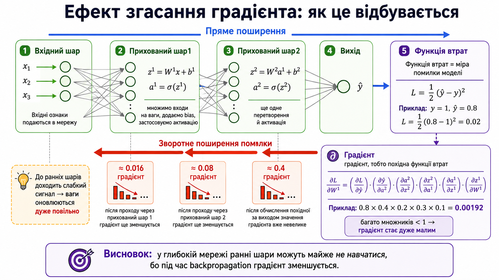

# КОНСПЕКТ ЛЕКЦІЇ: Багатокласова класифікація та регресія в PyTorch

> **Де виконувати:** [Google Colab](https://colab.research.google.com) — відкрий посилання в браузері, натисни **"New notebook"**, і починай виконувати кроки по черзі. Кожен блок коду вставляй в окрему клітинку і запускай кнопкою ▶ або клавішами **Shift + Enter**.
>
> **Альтернатива:** локальний Jupyter Notebook. Встанови: `pip install jupyterlab torch numpy pandas scikit-learn seaborn matplotlib`, запусти `jupyter lab`. Документація: [jupyter.org/install](https://jupyter.org/install)

---

## ЧАСТИНА 0. ТЕОРІЯ — КОРОТКИЙ ОГЛЯД

### Що ми будемо робити?

У цій темі ми вирішимо дві основні задачі:

| Задача | Що передбачаємо | Приклад | Метрика |
|---|---|---|---|
| **Багатокласова класифікація** | Один клас із кількох можливих | Вид пінгвіна: Adelie / Gentoo / Chinstrap | Accuracy |
| **Регресія** | Числове значення | Обсяг продажів магазину | RMSE |

### Чим відрізняються ці задачі?

| Аспект | Класифікація | Регресія |
|---|---|---|
| Цільова змінна | Категорія (0, 1, 2…) | Число (3735.14, 443.42…) |
| Останній шар | Softmax (перетворює в ймовірності) | Лінійний (повертає число «як є») |
| Функція втрат | Cross-Entropy Loss | MSE Loss |
| Метрика | Accuracy (% правильних) | RMSE (середня помилка) |

### Розшифровка нових скорочень

| Символ / Скорочення | Що означає | Простими словами | Навіщо використовувати |
|---|---|---|---|
| `nn.ReLU()` | Rectified Linear Unit | функція активації: max(0, x) | Додає нелінійність між шарами мережі, щоб мережа могла моделювати складні залежності. Стандарт для прихованих шарів |
| `nn.Softmax()` | Softmax | перетворює логіти в ймовірності (сума = 1) | Використовується в останньому шарі для багатокласової класифікації, щоб отримати ймовірність кожного класу |
| `nn.CrossEntropyLoss()` | Cross-Entropy Loss | функція втрат для багатокласової класифікації | Вимірює, наскільки передбачені ймовірності відрізняються від справжніх міток. Саме її мінімізуємо під час навчання |
| `nn.MSELoss()` | Mean Squared Error | функція втрат для регресії | Вимірює середній квадрат різниці між передбаченням і справжнім значенням. Стандартна loss-функція для задач регресії |
| `optim.Adam` | Adam optimizer | «розумніший» оптимізатор (адаптивний lr) | Автоматично підлаштовує learning rate для кожного параметра. Працює краще за SGD на складних задачах з великою кількістю параметрів |
| `Dataset` | набір даних | PyTorch-обгортка для даних | Стандартизує доступ до даних: дозволяє отримувати зразки по індексу і знати розмір набору. Необхідний для DataLoader |
| `DataLoader` | завантажувач | ітерує по Dataset батчами | Автоматично розбиває дані на батчі, перемішує їх, завантажує паралельно — без цього довелось би писати логіку батчів вручну |
| `batch_size` | розмір батчу | скільки зразків (рядків) обробляється за раз | Контролює баланс між швидкістю (великий батч) та стабільністю градієнтів (малий батч). Типове значення: 32–512 |
| `epoch` | епоха | один повний прохід по **всіх** тренувальних даних | Якщо 6800 зразків і batch_size=200, то одна епоха = 34 батчі. Типово навчання йде 10–1000 епох |
| `logits` | логіти | «сирі» виходи мережі до Softmax | Це необроблені числа з останнього шару. Їх передають у Softmax для отримання ймовірностей або напряму в CrossEntropyLoss |
| `converged` | зійшлася | модель перестала покращуватись | Ознака того, що навчання завершено: loss стабілізувався, подальші епохи не дають покращення |
| `vanishing gradient` | згасання градієнта | градієнти стають нулями в глибоких мережах | Головна проблема sigmoid/tanh у глибоких мережах: перші шари перестають навчатись. Вирішується використанням ReLU |

---

## ЧАСТИНА 1. ЗАДАЧА БАГАТОКЛАСОВОЇ КЛАСИФІКАЦІЇ — EDA

### Крок 1. Імпорт бібліотек

**Що робимо:** підключаємо всі інструменти для роботи.

```python
from dataclasses import dataclass

import pandas as pd
import numpy as np

from sklearn.impute import SimpleImputer
from sklearn.preprocessing import TargetEncoder, StandardScaler, LabelEncoder
from sklearn.metrics import root_mean_squared_error as RMSE
from sklearn.metrics import accuracy_score
from sklearn.model_selection import train_test_split

import torch
from torch import nn
from torch.utils.data import Dataset, DataLoader

import matplotlib.pyplot as plt
import seaborn as sns

import warnings
warnings.filterwarnings('ignore')
```

**Пояснення кожного рядка:**

| Рядок | Що робить | Навіщо потрібно |
|---|---|---|
| `from dataclasses import dataclass` | Імпорт декоратора для створення класів-контейнерів даних | Зручний спосіб зберігати налаштування (гіперпараметри) в одному місці |
| `import pandas as pd` | Бібліотека для роботи з таблицями (DataFrame) | Завантаження CSV, фільтрація, групування, попередній аналіз даних |
| `import numpy as np` | Бібліотека числових обчислень (масиви, матриці) | Швидкі математичні операції над масивами, основа для PyTorch-тензорів |
| `from sklearn.impute import SimpleImputer` | Заповнювач пропусків у даних | Замінює порожні клітинки середнім (числові) або модою (категоріальні) |
| `from sklearn.preprocessing import TargetEncoder` | Кодувальник категорій через середнє значення таргету | Перетворює текстові категорії (назви магазинів) у числа на основі середнього продажу |
| `from sklearn.preprocessing import StandardScaler` | Масштабує ознаки: середнє = 0, стд = 1 | Вирівнює масштаб ознак, щоб мережа не «думала», що більші числа важливіші |
| `from sklearn.preprocessing import LabelEncoder` | Кодує текстові мітки у числа (0, 1, 2…) | Перетворює назви класів у цілі числа для використання в моделі |
| `from sklearn.metrics import root_mean_squared_error as RMSE` | Метрика RMSE — корінь середнього квадрата помилки | Оцінює якість регресії: показує, на скільки в середньому помиляється модель |
| `from sklearn.metrics import accuracy_score` | Рахує відсоток правильних відповідей | Оцінює якість класифікації: яка частка зразків класифікована правильно |
| `from sklearn.model_selection import train_test_split` | Ділить дані на тренувальну та тестову частини | Щоб оцінити модель на даних, які вона не бачила під час навчання |
| `import torch` | Головний фреймворк глибокого навчання (тензори, автоградієнти) | Основа для побудови та тренування нейронних мереж |
| `from torch import nn` | Модуль нейронних мереж: шари, функції активації, loss-функції | Готові «цеглинки» для побудови архітектури мережі |
| `from torch.utils.data import Dataset, DataLoader` | Інструменти для батчевої обробки даних | Dataset визначає формат даних, DataLoader ітерує по них батчами |
| `import matplotlib.pyplot as plt` | Бібліотека для побудови графіків | Візуалізація loss-кривих, accuracy, розподілів ознак |
| `import seaborn as sns` | Бібліотека статистичних графіків (надбудова над matplotlib) | Красиві графіки для EDA: countplot, pairplot, heatmap |
| `warnings.filterwarnings('ignore')` | Приховує попередження Python | Прибирає непотрібний «шум» у виведенні, щоб бачити тільки результати |

---

### Крок 2. Завантаження даних

**Що робимо:** завантажуємо датасет [Palmer Penguins](https://github.com/allisonhorst/palmerpenguins) — дані про пінгвінів трьох видів з Антарктиди.

```python
url = 'https://raw.githubusercontent.com/goitacademy/DEEP-LEARNING-FOR-COMPUTER-VISION-AND-NLP/main/data/Module_2_Lecture_2_Class_penguins.csv'
df = pd.read_csv(url)

df.sample(5, random_state=42)
```

**Пояснення:**
- `pd.read_csv(url)` — завантажує CSV-файл у DataFrame (таблицю pandas). Приймає як локальний шлях, так і URL — зручно для Google Colab, де локальних файлів немає
- `df.sample(5, random_state=42)` — виводить 5 **випадкових** рядків з таблиці. `random_state=42` фіксує «випадковість», щоб при кожному запуску отримувати ті самі рядки

**Навіщо `sample`, а не `head`?** `head()` показує перші рядки, які можуть бути однотипними (наприклад, всі Adelie). `sample()` показує рядки з різних частин таблиці — так краще видно різноманітність даних.

**Отримуємо:**

| | species | island | bill_length_mm | bill_depth_mm | flipper_length_mm | body_mass_g | sex |
|---|---|---|---|---|---|---|---|
| 194 | Gentoo | Biscoe | 45.3 | 13.7 | 210.0 | 4300.0 | female |
| 157 | Gentoo | Biscoe | 46.5 | 13.5 | 210.0 | 4550.0 | female |
| 225 | Gentoo | Biscoe | 46.5 | 14.8 | 217.0 | 5200.0 | female |
| 208 | Gentoo | Biscoe | 43.8 | 13.9 | 208.0 | 4300.0 | female |
| 318 | Chinstrap | Dream | 50.9 | 19.1 | 196.0 | 3550.0 | male |

**Що ми бачимо:**
- `species` — вид пінгвіна (Adelie, Gentoo, Chinstrap) — **це наш таргет**
- `island` — острів (Torgersen, Biscoe, Dream)
- `bill_length_mm`, `bill_depth_mm` — довжина та глибина дзьобу
- `flipper_length_mm` — довжина плавця
- `body_mass_g` — маса тіла
- `sex` — стать

---

### Крок 3. Базова інформація

**Навіщо:** перед будь-яким моделюванням потрібно зрозуміти структуру даних — скільки рядків, які типи, де є пропуски.

```python
df.info()
```

**Що робить `df.info()`:** виводить зведену інформацію про DataFrame — назви стовпців, кількість ненульових значень у кожному, типи даних та використання пам'яті.

**Отримуємо:**

```
<class 'pandas.core.frame.DataFrame'>
RangeIndex: 344 entries, 0 to 343
Data columns (total 7 columns):
 #   Column             Non-Null Count  Dtype
---  ------             --------------  -----
 0   species            344 non-null    object
 1   island             344 non-null    object
 2   bill_length_mm     342 non-null    float64
 3   bill_depth_mm      342 non-null    float64
 4   flipper_length_mm  342 non-null    float64
 5   body_mass_g        342 non-null    float64
 6   sex                333 non-null    object
```

**Що бачимо:**
- 344 рядки, 7 стовпців
- `Non-Null Count` — лише кілька рядків мають пропуски (342 з 344 у числових, 333 у `sex`)
- Пропусків мало → можемо просто видалити рядки з пропусками

```python
df = df.dropna().reset_index(drop=True)
```

**Що робимо:** `dropna()` — видаляє рядки, де є хоча б один пропуск. `reset_index(drop=True)` — скидає індекс на послідовні числа 0, 1, 2…

---

### Крок 4. Розподіл цільової змінної

**Що робимо:** дивимось, скільки прикладів кожного виду пінгвіна є в даних.

**Навіщо:** перед навчанням моделі потрібно перевірити **баланс класів**. Якщо один клас домінує (наприклад, 95% проти 5%), модель може просто завжди передбачати цей клас і мати високу accuracy, але бути марною.

```python
plt.figure(figsize=(4, 3))
ax = sns.countplot(data=df, x='species')
for i in ax.containers:
    ax.bar_label(i)
    ax.set_xlabel("value")
    ax.set_ylabel("count")

plt.suptitle("Target feature distribution")
plt.tight_layout()
plt.show()
```

**Пояснення кожного рядка:**

| Рядок | Що робить |
|---|---|
| `plt.figure(figsize=(4, 3))` | Створює полотно для графіка розміром 4×3 дюйми (ширина × висота) |
| `sns.countplot(data=df, x='species')` | Будує стовпчасту діаграму: рахує кількість рядків для кожного унікального значення `species` |
| `for i in ax.containers:` | Ітерується по групах стовпців (у нашому випадку — одна група) |
| `ax.bar_label(i)` | Додає числові підписи зверху кожного стовпця (146, 119, 68) |
| `ax.set_xlabel("value")` | Підпис осі X |
| `ax.set_ylabel("count")` | Підпис осі Y |
| `plt.suptitle(...)` | Заголовок графіка |
| `plt.tight_layout()` | Автоматично підлаштовує відступи, щоб елементи не накладались |
| `plt.show()` | Відображає графік |

**Отримуємо:**
- Adelie: **146**
- Gentoo: **119**
- Chinstrap: **68**

**Аналіз:** розподіл не ідеально збалансований, але класи відносно близькі за розміром.

> **💡 Чому accuracy?** Коли класи не сильно дисбалансовані (немає ситуації 95% проти 5%), **accuracy** (частка правильних відповідей) — підходяща метрика. Якби один клас домінував (наприклад, 95%), модель могла б завжди передбачати цей клас і мати 95% accuracy, але це було б марно. У нашому випадку — ОК.

#### Довідка: метрики класифікації — коли яку використовувати

| Метрика | Коли добре використовувати | На що відповідає |
|---|---|---|
| **Accuracy** | Класи приблизно збалансовані, FP і FN приблизно однаково небажані | Яка частка всіх прогнозів правильна? |
| **Precision** | Особливо небезпечні **False Positive** (наприклад, спам-фільтр: краще пропустити спам, ніж видалити важливий лист) | Із тих, кого модель назвала позитивними, скільки справді позитивні? |
| **Recall / Sensitivity** | Особливо небезпечні **False Negative** (наприклад, діагностика раку: краще зайвий раз перевірити, ніж пропустити хворобу) | Із усіх справді позитивних скільки модель знайшла? |
| **Specificity** | Важливо правильно відкидати негативні випадки | Із усіх справді негативних скільки модель розпізнала як негативні? |
| **F1-score** | Класи незбалансовані і важливі одночасно Precision та Recall | Наскільки добре збалансовані Precision і Recall? (гармонічне середнє) |
| **ROC-AUC** | Хочемо порівнювати здатність моделей розділяти два класи при різних thresholds | Наскільки модель загалом розрізняє positive та negative? |
| **PR-AUC** | Дуже сильний дисбаланс, positive class рідкісний (наприклад, шахрайство: 0.1% транзакцій) | Наскільки добре модель знаходить позитивний клас без великої кількості FP? |

> **👉🏻** У нашій задачі (3 види пінгвінів, класи приблизно збалансовані) — **accuracy** цілком достатньо. Але в реальних проєктах завжди обирайте метрику з огляду на бізнес-ціну помилки.

---

### Крок 5. Розподіл змінної `island`

**Навіщо:** аналізуємо вхідну категоріальну ознаку `island`, щоб зрозуміти, чи є дисбаланс між островами. Це допоможе оцінити, наскільки рівномірно розподілені дані і чи потрібна додаткова обробка.

```python
plt.figure(figsize=(4, 3))
ax = sns.countplot(data=df, x='island')
for i in ax.containers:
    ax.bar_label(i)
    ax.set_xlabel("value")
    ax.set_ylabel("count")

plt.suptitle("Island feature distribution")
plt.tight_layout()
plt.show()
```

**Пояснення параметрів:**

| Рядок | Що робить |
|---|---|
| `plt.figure(figsize=(4, 3))` | Створює нове полотно 4×3 дюйми. `figsize` — кортеж (ширина, висота) в дюймах |
| `sns.countplot(data=df, x='island')` | Стовпчаста діаграма: `data` — DataFrame з даними, `x='island'` — рахує кількість рядків для кожного унікального значення стовпця `island` |
| `ax.containers` | Список контейнерів зі стовпцями графіка. Кожен контейнер — група стовпців |
| `ax.bar_label(i)` | Додає числовий підпис зверху кожного стовпця (47, 163, 123), щоб бачити точні значення |
| `ax.set_xlabel("value")` | Встановлює підпис осі X (горизонтальної). Показує, що по осі — значення ознаки |
| `ax.set_ylabel("count")` | Встановлює підпис осі Y (вертикальної). Показує, що по осі — кількість рядків |
| `plt.suptitle("Island feature distribution")` | Додає заголовок графіка зверху. `suptitle` = «super title» — заголовок для всієї фігури |
| `plt.tight_layout()` | Автоматично коригує відступи між елементами графіка, щоб нічого не обрізалось |
| `plt.show()` | Відображає готовий графік на екрані |

**Отримуємо:**
- Torgersen: **47**
- Biscoe: **163**
- Dream: **123**

**Аналіз:** Biscoe має найбільше спостережень (163), Torgersen — найменше (47). Це нерівномірний розподіл.

> **💡** Дисбаланс може відображати реальний розподіл даних у природі (на деяких островах справді живе менше пінгвінів). Не потрібно штучно видаляти записи або надлишково їх дискретизувати (oversample) — це може внести зміщення (bias) в модель і спотворити результати.

---

### Крок 6. Попарний розподіл числових ознак

**Що робимо:** будуємо pairplot — графік, де кожна пара ознак зображується на окремому підграфіку. На діагоналі — розподіл кожної ознаки окремо.

```python
plt.figure(figsize=(6, 6))
sns.pairplot(data=df, hue='species').fig.suptitle('Numeric features distribution', y=1)
plt.show()
```

**Пояснення параметрів:**

| Параметр | Що робить |
|---|---|
| `data=df` | DataFrame з даними для побудови графіків |
| `hue='species'` | Розфарбовує точки за значенням `species` (кожен вид — свій колір). Це дозволяє візуально побачити, чи розділяються класи |
| `.fig.suptitle('...', y=1)` | Додає заголовок до всієї фігури. `y=1` — розміщує заголовок точно зверху (щоб не накладався на графіки) |

**Що таке pairplot:** це матриця графіків, де кожна пара числових ознак зображується на окремому підграфіку. На **діагоналі** — розподіл кожної ознаки окремо (щільність), **поза діагоналлю** — точкові графіки (scatter plot) пар ознак. Якщо точки різних кольорів утворюють окремі групи — ознаки добре розрізняють класи.

**Що бачимо:**
- За деякими парами ознак (наприклад, `bill_length_mm` + `bill_depth_mm`) три види **чітко розділяються** на кластери
- За іншими парами кластери **перетинаються** — лінійний класифікатор не впорається
- Тому потрібна нейронна мережа з **нелінійними перетвореннями** (ReLU)

---

## ЧАСТИНА 2. ПІДГОТОВКА ОЗНАК

### Крок 7. Відбір числових ознак

**Що робимо:** для простоти залишаємо лише числові змінні.

**Навіщо:** нейронна мережа працює тільки з числами. Категоріальні змінні (`island`, `sex`) потрібно спочатку закодувати в числа (One-Hot або Label Encoding). Для спрощення ми їх відкидаємо — але модель все одно добре працює, бо числові ознаки (розміри дзьоба, плавця, маса) вже достатньо інформативні.

```python
features = ['species', 'bill_length_mm', 'bill_depth_mm', 'flipper_length_mm', 'body_mass_g']
df = df.loc[:, features]
```

**Пояснення:** `df.loc[:, features]` — вибираємо всі рядки (`:`) і тільки вказані стовпці.

> **💡 Завдання із зірочкою:** можете залишити усі ознаки (island, sex) та закодувати їх числово (One-Hot Encoding або Label Encoding), щоб покращити модель.

---

### Крок 8. Кодування таргету

**Що робимо:** перетворюємо текстові мітки класів у числа.

**Навіщо:** PyTorch і `CrossEntropyLoss` вимагають, щоб мітки класів були **цілими числами** (0, 1, 2), а не текстом ('Adelie', 'Gentoo', 'Chinstrap'). Кожному класу присвоюємо унікальний індекс.

```python
df.loc[df['species'] == 'Adelie', 'species'] = 0
df.loc[df['species'] == 'Gentoo', 'species'] = 1
df.loc[df['species'] == 'Chinstrap', 'species'] = 2
df = df.apply(pd.to_numeric)

df.head(2)
```

**Отримуємо:**

| | species | bill_length_mm | bill_depth_mm | flipper_length_mm | body_mass_g |
|---|---|---|---|---|---|
| 0 | 0 | 39.1 | 18.7 | 181.0 | 3750.0 |
| 1 | 0 | 39.5 | 17.4 | 186.0 | 3800.0 |

**Пояснення рядок за рядком:**
- `df.loc[df['species'] == 'Adelie', 'species'] = 0` — де species = 'Adelie', замінюємо на 0
- `df.apply(pd.to_numeric)` — перетворюємо всі стовпці у числові типи (рядки '0', '1', '2' → числа)

---

### Крок 9. Формування X та y

**Навіщо:** для навчання моделі потрібно чітко розділити **вхідні дані** (ознаки, за якими модель буде робити передбачення) від **правильних відповідей** (таргету, який модель має навчитись передбачувати).

```python
X = df.drop('species', axis=1).values
y = df['species'].values
```

**Що робимо:**
- `df.drop('species', axis=1)` — видаляємо стовпець `species` з таблиці. `axis=1` означає «видалити стовпець» (axis=0 — рядок)
- `.values` — перетворюємо DataFrame → NumPy масив (бо PyTorch і sklearn працюють з масивами, а не таблицями)
- `X` — матриця ознак: кожен рядок = один пінгвін, кожен стовпець = одна ознака
- `y` — вектор таргетних значень (0, 1 або 2) — правильна відповідь для кожного пінгвіна

---

### Крок 10. Стандартизація ознак

**Навіщо:** ознаки мають дуже різний масштаб:
- `bill_length_mm` ≈ 30–60
- `body_mass_g` ≈ 2700–6300

Якщо не масштабувати, нейрони будуть «бачити» `body_mass_g` як набагато важливішу ознаку, просто через більші числа.

```python
scaler = StandardScaler()
X = scaler.fit_transform(X)

X
```

**Отримуємо:**

```
array([[-0.89604189,  0.7807321 , -1.42675157, -0.56847478],
       [-0.82278787,  0.11958397, -1.06947358, -0.50628618],
       ...])
```

**Що робить StandardScaler:**

Для кожної ознаки:

```
              x - μ
x_scaled  =  ─────
                σ
```

де **μ** — середнє значення ознаки, **σ** — стандартне відхилення. Після цього кожна ознака має середнє ≈ 0 і стандартне відхилення ≈ 1.

> **Аналогія:** це як переведення різних валют в одну — тепер всі ознаки «говорять однією мовою».

---

### Крок 11. Розділення на train/test

**Навіщо:** щоб оцінити, наскільки добре модель узагальнює на **нових** даних, які вона не бачила під час навчання. Якщо тренувати та тестувати на тих самих даних — модель може «завчити» відповіді напам'ять (overfitting) і показувати хороші результати, які не відповідають реальності.

```python
X_train, X_test, y_train, y_test = train_test_split(
    X, y, random_state=42, test_size=0.33, stratify=y
)
```

**Параметри:**

| Параметр | Значення | Що робить | Навіщо |
|---|---|---|---|
| `X, y` | наші дані | Що ділимо: ознаки та таргет | Розділяються синхронно, щоб рядки X та y відповідали один одному |
| `test_size=0.33` | 33% | Частка даних для тестової вибірки | Типово 20–33%. Більше тестових = точніша оцінка, але менше даних для навчання |
| `random_state=42` | 42 | Фіксує «випадковість» | Щоб при кожному запуску отримувати однаковий розподіл — для відтворюваності |
| `stratify=y` | y | Зберігає пропорції класів в обох вибірках | Без цього в тесті може випадково опинитись 0 Chinstrap — оцінка буде неадекватною |

---

### Крок 12. Перетворення в тензори

**Навіщо:** PyTorch працює з **тензорами**, а не з NumPy-масивами. Тензори підтримують автоматичне диференціювання (`autograd`) і можуть працювати на GPU — без них навчання нейромережі неможливе.

```python
X_train = torch.Tensor(X_train).float()
y_train = torch.Tensor(y_train).long()

X_test = torch.Tensor(X_test).float()
y_test = torch.Tensor(y_test).long()

print(X_train[:1])
print(y_train[:10])
```

**Отримуємо:**

```
tensor([[ 1.2650,  0.9842, -0.3549, -0.8172]])
tensor([2, 0, 1, 1, 1, 2, 0, 1, 1, 0])
```

**Що означають ці числа:**

Перший рядок — `X_train[:1]` — це **ознаки одного пінгвіна** (перший зразок тренувальної вибірки) після стандартизації:

| Позиція | Ознака | Значення | Що це означає |
|---|---|---|---|
| 0 | bill_length_mm | 1.2650 | Довжина дзьобу **вища за середню** на 1.27 стандартних відхилення |
| 1 | bill_depth_mm | 0.9842 | Глибина дзьобу **вища за середню** на 0.98 стд |
| 2 | flipper_length_mm | -0.3549 | Довжина плавця **трохи нижча** за середню |
| 3 | body_mass_g | -0.8172 | Маса тіла **нижча за середню** на 0.82 стд |

> Після StandardScaler усі значення — це «скільки стандартних відхилень від середнього». Додатне = вище за середнє, від'ємне = нижче.

Другий рядок — `y_train[:10]` — це **мітки класів перших 10 пінгвінів** тренувальної вибірки:

| Значення | Вид |
|---|---|
| 0 | Adelie |
| 1 | Gentoo |
| 2 | Chinstrap |

Тобто `[2, 0, 1, 1, 1, 2, 0, 1, 1, 0]` = Chinstrap, Adelie, Gentoo, Gentoo, Gentoo, Chinstrap, Adelie, Gentoo, Gentoo, Adelie.

**Чому різні типи:**

| Дані | Тип | Навіщо |
|---|---|---|
| X (ознаки) | `.float()` = float32 | Стандартний тип для обчислень у нейромережі |
| y (мітки класів) | `.long()` = int64 | `CrossEntropyLoss` вимагає цілочисельні мітки |

> **💡** `.long()` — це те саме, що `.to(torch.int64)`.

---

## ЧАСТИНА 3. ФУНКЦІЇ АКТИВАЦІЇ — ТЕОРІЯ

### Навіщо потрібні функції активації?

Без функції активації нейронна мережа — це просто набір лінійних перетворень. А **композиція лінійних функцій = ще одна лінійна функція**. Тобто скільки б шарів не було — мережа зводиться до одного лінійного шару.

**Функція активації** додає **нелінійність**, що дозволяє мережі моделювати складні залежності.

> **Аналогія:** лінійна мережа — це як рух лише по прямих вулицях. Функція активації — можливість повертати. Без неї ви ніколи не дістанетеся до пункту, що не лежить на одній прямій.

---

### 3.1. Порогова (ступінчаста) функція

Найпростіша функція: «увімкнено» або «вимкнено».

```
         ⎧ 0,  якщо x < threshold
z(x) =  ⎨
         ⎩ 1,  якщо x ≥ threshold
```

```python
x = np.linspace(-5, 5, 1000)
threshold = np.where(x >= 0, 1, 0)

plt.figure(figsize=(6, 4))
plt.plot(x, threshold, linewidth=2, label='Threshold')
plt.title('Activation Functions')
plt.xlabel('x')
plt.ylabel('Activation')
plt.legend()
plt.grid(True)
plt.show()
```

**Пояснення коду:**

| Рядок | Що робить |
|---|---|
| `np.linspace(-5, 5, 1000)` | Створює 1000 рівномірно розподілених точок від -5 до 5 — вісь X для графіка |
| `np.where(x >= 0, 1, 0)` | Для кожної точки: якщо x ≥ 0 → повертає 1, інакше → 0. Це і є порогова функція |
| `plt.plot(x, threshold, linewidth=2, label='Threshold')` | Малює лінію: `x` по горизонталі, `threshold` по вертикалі. `linewidth=2` — товщина лінії, `label` — підпис у легенді |
| `plt.legend()` | Відображає легенду з підписами ліній |
| `plt.grid(True)` | Додає сітку на фон графіка для зручності читання |

**Дві критичні проблеми:**

| Проблема | Пояснення |
|---|---|
| **Недиференційованість** | Функція має «стрибок». Неможливо обчислити похідну → backpropagation не працює |
| **Стрибки** | Навіть маленька зміна входу (наприклад, від -0.001 до +0.001) спричиняє різкий стрибок виходу з 0 на 1. Мережа «застрягає» — малі зміни ваг не дають поступових змін виходу |

**Що таке градієнт і чому тут він не працює:**

Градієнт — це по суті **нахил функції**: наскільки зміниться вихід, якщо ми трішки змінимо вхід.

У порогової функції майже всюди графік **горизонтальний**:

- Для всіх `x < 0`: f(x) = 0. Тобто хоч бери x = -5, x = -2, x = -0.1 — вихід не змінюється. Нахил: `f'(x) = 0`
- Для всіх `x > 0`: f(x) = 1. Теж: `f'(x) = 0`
- У точці `x = 0` — різкий стрибок з 0 до 1. Нормального нахилу немає, похідна **не визначена**

Отже:
- майже всюди градієнт = 0
- у точці порогу градієнт не існує

І це погано для навчання, бо backpropagation отримує `gradient = 0` і фактично **не знає, як змінити ваги** — немає сигналу, в якому напрямку рухатись.

**Порівняй із ReLU:** `f(x) = max(0, x)`. Для `x > 0` нахил `f'(x) = 1` — тобто є сигнал: «якщо змінити x, вихід теж зміниться». Backpropagation отримує ненульовий градієнт і може оновити ваги.

> **Висновок:** в глибокому навчанні **майже не використовується**.

---

### 3.2. Лінійна функція

Зміни входу пропорційно передаються на вихід:

```
z(x) = x
```

```python
linear = x

plt.figure(figsize=(6, 4))
plt.plot(x, linear, linewidth=2, label='Linear')
plt.title('Activation Functions')
plt.xlabel('x')
plt.ylabel('Activation')
plt.legend()
plt.grid(True)
plt.show()
```

**Проблема:** композиція лінійних функцій = ще одна лінійна функція. Мережа з будь-якою кількістю лінійних шарів зводиться до одного.

**Де використовується:**
- **Заключний шар** у задачах регресії — коли потрібно вивести число «як є»
- Як самостійна функція активації — **непридатна** для прихованих шарів

---

### 3.3. Сигмоїдна (логістична) функція

Стискає будь-яке число в діапазон від 0 до 1:

```
                 1
σ(x)  =  ───────────
           1 + e⁻ˣ
```

**Розбираємо формулу по частинах:**

| Символ | Як читається | Що означає |
|---|---|---|
| **σ** | «сигма» (грецька літера) | Загальноприйнята назва для сигмоїдної функції. Пишуть σ(x) замість sigmoid(x) — просто коротше |
| **x** | «ікс» | Вхідне значення — те, що приходить у нейрон (може бути будь-яким числом від -∞ до +∞) |
| **e** | «е», число Ейлера | Математична константа ≈ 2.71828. Це основа натурального логарифма — спеціальне число, яке часто з'являється в природних процесах (зростання, розпад, ймовірності). У формулі воно потрібне для створення плавної S-подібної кривої |
| **e⁻ˣ** | «е в ступені мінус ікс» | Експонента від'ємного x. Коли x зростає → e⁻ˣ прямує до 0. Коли x зменшується → e⁻ˣ стрімко зростає |
| **1 + e⁻ˣ** | | Знаменник — завжди більший за 1 (бо e⁻ˣ > 0 для будь-якого x) |
| **1 / (1 + e⁻ˣ)** | | Ділимо 1 на число, яке завжди > 1 → результат завжди між 0 і 1 |

**Чому формула саме така — покрокова інтуїція:**

Нам потрібна функція, яка:
1. Приймає **будь-яке** число (від -∞ до +∞)
2. Повертає число **від 0 до 1** (щоб інтерпретувати як ймовірність)
3. Робить це **плавно** (щоб можна було обчислити градієнт)

Подивимось, як формула це забезпечує:

| Вхід x | e⁻ˣ | 1 + e⁻ˣ | 1 / (1 + e⁻ˣ) | Результат |
|---|---|---|---|---|
| x = -10 | e¹⁰ ≈ 22026 | 22027 | 1/22027 | ≈ **0.00005** (майже 0) |
| x = -2 | e² ≈ 7.39 | 8.39 | 1/8.39 | ≈ **0.12** |
| x = 0 | e⁰ = 1 | 2 | 1/2 | = **0.5** (рівно посередині!) |
| x = 2 | e⁻² ≈ 0.14 | 1.14 | 1/1.14 | ≈ **0.88** |
| x = 10 | e⁻¹⁰ ≈ 0.00005 | 1.00005 | 1/1.00005 | ≈ **0.99995** (майже 1) |

**Чому степінь від'ємний (e⁻ˣ, а не eˣ)?**

Мінус у степені — це те, що **перевертає** поведінку експоненти. Порівняємо:

| | eˣ (без мінуса) | e⁻ˣ (з мінусом) |
|---|---|---|
| x = 10 | e¹⁰ ≈ 22026 (величезне!) | e⁻¹⁰ ≈ 0.00005 (крихітне!) |
| x = 0 | e⁰ = 1 | e⁰ = 1 |
| x = -10 | e⁻¹⁰ ≈ 0.00005 | e¹⁰ ≈ 22026 |

Що було б **без** мінуса — формула `1 / (1 + eˣ)`:
- x = 10 → 1 / (1 + 22026) ≈ **0.00005** — великий вхід дає майже 0
- x = -10 → 1 / (1 + 0.00005) ≈ **0.99995** — малий вхід дає майже 1

Це **навпаки** від того, що нам потрібно! Ми хочемо, щоб більший вхід → більший вихід (більша впевненість = «так»).

Мінус **виправляє напрямок**: коли x зростає → e⁻ˣ зменшується → знаменник (1 + e⁻ˣ) наближається до 1 → весь дріб 1/(1 + e⁻ˣ) наближається до 1. Саме те, що потрібно.

> **Коротко:** `e⁻ˣ = 1/eˣ`. Мінус у степені — це просто «перевернути» число. Великий eˣ стає крихітним e⁻ˣ, і навпаки. Без мінуса функція працювала б задом наперед.

> **Аналогія:** σ(x) — це як «впевненість». Велике додатне x → «майже впевнені, що так» (≈1). Велике від'ємне x → «майже впевнені, що ні» (≈0). x ≈ 0 → «50 на 50» (= 0.5).

```python
sigmoid = 1 / (1 + np.exp(-x))

plt.figure(figsize=(6, 4))
plt.plot(x, sigmoid, linewidth=2, label='Sigmoid')
plt.title('Activation Functions')
plt.xlabel('x')
plt.ylabel('Activation')
plt.legend()
plt.grid(True)
plt.show()
```

**Де використовується:** задачі **бінарної класифікації** (два класи: так/ні).

**Як працює:**
- Велике додатне число → вихід ≈ 1 (впевненість у класі «так»)
- Велике від'ємне число → вихід ≈ 0 (впевненість у класі «ні»)
- Число ≈ 0 → вихід ≈ 0.5 (невизначеність)

**Недолік: проблема згасання градієнта (vanishing gradient)**

При великих |x| крива стає майже горизонтальною (плато) → похідна σ'(x) стає дуже малою (близькою до 0). Під час backpropagation малі градієнти множаться один на одного через шари → градієнти «зникають» → початкові шари не навчаються.

---

### 3.4. Що таке похідна та як її рахувати — математична база

Перш ніж розбирати згасання градієнта, розберемо саме поняття **похідної**, бо саме на ній побудовано все навчання нейромереж.

#### Що таке похідна?

Похідна відповідає на питання:

> **Наскільки зміниться результат функції, якщо трохи змінити вхід?**

Наприклад, маємо функцію `y = x²`. Її похідна:

```
dy
── = 2x
dx
```

Чому саме 2x? Є базове правило степенів:

```
xⁿ  →  n · xⁿ⁻¹
```

Тобто:
- x² → 2x
- x³ → 3x²
- x⁴ → 4x³

**Приклад:** якщо y = x² і x = 3, то:

```
dy/dx = 2x = 2 · 3 = 6
```

Це означає: біля точки x = 3, якщо ми трохи збільшимо x, то y буде змінюватися приблизно **у 6 разів швидше**, ніж x.

#### Базові правила похідних

| Функція | Похідна | Пояснення |
|---|---|---|
| c (константа) | 0 | Константа не змінюється → похідна = 0 |
| x | 1 | x змінюється з тією ж швидкістю, що й сам x |
| x² | 2x | Квадрат змінюється вдвічі швидше за x (при x > 0) |
| x³ | 3x² | Куб змінюється втричі швидше |
| xⁿ | n·xⁿ⁻¹ | Загальне правило степенів |
| a·x + b | a | Лінійна функція змінюється з постійною швидкістю a |

#### Застосовуємо до функції втрат

Наша функція втрат:

```
L = ½ · (ŷ - y)²
```

Ми хочемо знайти ∂L/∂ŷ — наскільки зміниться loss, якщо трохи змінити прогноз ŷ. Тут y (правильна відповідь) — це константа.

Розбираємо по кроках:

```
1. Маємо:     L = ½ · u²      де u = ŷ - y

2. Похідна u²:  u² → 2u

3. Підставляємо: ∂L/∂ŷ = ½ · 2 · (ŷ - y)

4. Двійки скорочуються:

   ∂L/∂ŷ = ŷ - y
```

**Приклад:** y = 1 (правильна відповідь), ŷ = 0.8 (прогноз моделі):

```
∂L/∂ŷ = 0.8 - 1 = -0.2
```

Градієнт = **-0.2**. Мінус означає напрямок: щоб зменшити loss, прогноз ŷ треба **збільшувати** (бо зараз 0.8 < 1). Це логічно — модель недостатньо «впевнена», потрібно наблизити прогноз до 1.

#### Аналогія з таксі — навіщо потрібні w та b

Формула лінійного шару нейромережі:

```
z = w · x + b
```

Це дуже схоже на вартість поїздки в таксі:

```
y = a · x + b
```

| Таксі | Нейромережа | Що це |
|---|---|---|
| y — загальна вартість | z — вихід нейрона | Результат |
| x — кількість кілометрів | x — вхідне значення (ознака) | Вхід |
| a — ціна за 1 км | w — вага (weight) | Наскільки сильно вхід впливає на вихід |
| b — стартова плата | b — зміщення (bias) | Базовий рівень виходу навіть при x = 0 |

**Приклад:** y = 3x + 5 — це 3 грн за кілометр + 5 грн за посадку.

Проїхали 10 км: y = 3·10 + 5 = 35 грн.

Похідна dy/dx = **3** — показує, **на скільки збільшується ціна при збільшенні x на 1 км**. А b = 5 — це те, що ми платимо навіть при x = 0.

У нейромережі: **навчання** — це процес підбору правильних w і b, щоб модель давала прогнози, близькі до правильних відповідей. Backpropagation використовує **похідні**, щоб зрозуміти, як саме змінити w і b.

#### Chain rule — правило ланцюга

Коли результат залежить від входу **через кілька проміжних функцій** (як у нейромережі з кількома шарами), ми множимо похідні на кожному кроці ланцюжка. Саме це правило використовується для обчислення ∂L/∂w₁ у backpropagation — і саме через нього виникає проблема згасання градієнта, яку ми розберемо далі.

---

### 3.5. Ефект згасання градієнта (Vanishing Gradient) — детально

Це одна з ключових проблем глибокого навчання. Розберемо покроково.



#### Пряме поширення (Forward Pass) — зліва направо

Дані проходять через мережу послідовно:

```
Вхід x₁,x₂,x₃  →  Прихований шар 1  →  Прихований шар 2  →  Вихід ŷ  →  Loss L
```

На кожному прихованому шарі відбуваються дві операції:

| Операція | Формула | Що робить |
|---|---|---|
| Лінійне перетворення | z = W·x + b | Множить входи на ваги, додає зміщення (bias) |
| Активація | a = σ(z) | Застосовує нелінійну функцію (наприклад, sigmoid) |

**Приклад з діаграми:**
- Шар 1: z¹ = W¹·x + b¹, потім a¹ = σ(z¹)
- Шар 2: z² = W²·a¹ + b², потім a² = σ(z²)
- Вихід: ŷ = a² (результат останньої активації)

#### Функція втрат — вимірюємо помилку

```
L = ½ · (ŷ - y)²
```

Приклад: якщо правильна відповідь y = 1, а модель передбачила ŷ = 0.8:

```
L = ½ · (0.8 - 1)² = ½ · 0.04 = 0.02
```

#### Зворотне поширення (Backpropagation) — справа наліво

**Задача:** знайти, як змінити ваги W¹ першого шару, щоб зменшити loss. Для цього обчислюємо ∂L/∂W¹ — «наскільки зміниться loss, якщо ми трішки змінимо W¹».

Проблема: W¹ впливає на loss **не напряму**, а через довгий ланцюжок: W¹ → z¹ → a¹ → z² → a² → ŷ → L. Тому використовуємо **ланцюгове правило (chain rule)** — перемножуємо похідні на кожному кроці:

```
∂L       ∂L     ∂ŷ     ∂a²    ∂z²    ∂a¹    ∂z¹
──── = ──── · ──── · ──── · ──── · ──── · ────
∂W¹      ∂ŷ     ∂a²    ∂z²    ∂a¹    ∂z¹    ∂W¹
```

**Що означає кожний множник:**

| Множник | Що обчислює | Числове значення (приклад) |
|---|---|---|
| ∂L/∂ŷ | Як loss залежить від виходу | ŷ - y (= -0.2) |
| ∂ŷ/∂a² | Як вихід залежить від активації (ŷ = a², тому = 1) | 1 |
| ∂a²/∂z² | Похідна sigmoid на шарі 2: σ'(z²) | ≈ 0.2 (малий множник!) |
| ∂z²/∂a¹ | Як z² залежить від a¹ (= W²) | ≈ 0.3 |
| ∂a¹/∂z¹ | Похідна sigmoid на шарі 1: σ'(z¹) | ≈ 0.2 (ще один малий!) |
| ∂z¹/∂W¹ | Як z¹ залежить від W¹ (= x) | ≈ 0.1 |

**Перемножуємо:** 0.8 × 0.4 × 0.2 × 0.3 × 0.1 = **0.00192**

#### Чому це проблема

Кожна похідна σ'(z) ≤ 0.25 (максимум sigmoid). Кожен шар **зменшує** градієнт. Чим більше шарів — тим менший градієнт доходить до перших шарів:

```
Після виходу:              gradient ≈ 0.4
Після прихованого шару 2:  gradient ≈ 0.08       (× ~0.2)
Після прихованого шару 1:  gradient ≈ 0.016      (× ~0.2)
```

У глибокій мережі з 10 шарами:

```
Шар 10 (останній): gradient = 1.0
Шар 9:  gradient ≈ 0.25
Шар 8:  gradient ≈ 0.0625
Шар 7:  gradient ≈ 0.0156
...
Шар 1 (перший):  gradient ≈ 0.000001  ← практично нуль!
```

#### Результат

- Останні шари навчаються нормально (великий градієнт → суттєві оновлення ваг)
- Перші шари **майже не оновлюються** → мережа не вивчає глибокі закономірності
- Мережа не може ефективно навчитись

#### Де особливо критично

- Рекурентні нейронні мережі (RNN) — довгі послідовності = багато шарів
- Глибокі згорткові мережі (CNN) з багатьма шарами

> **Рішення:** використовувати функції активації, що не мають цієї проблеми — **ReLU** та її модифікації (похідна ReLU = 1 для x > 0, тому градієнт не зменшується).

---

### 3.6. Гіперболічний тангенс (Tanh)

Схожий на sigmoid, але «зміщений» — виходи від -1 до +1:

```
            eˣ - e⁻ˣ
tanh(x) =  ─────────
            eˣ + e⁻ˣ
```

Зв'язок із sigmoid:

```
tanh(x) = 2 · σ(2x) - 1
```

```python
tanh = np.tanh(x)

plt.figure(figsize=(6, 4))
plt.plot(x, tanh, linewidth=2, label='Tanh')
plt.title('Activation Functions')
plt.xlabel('x')
plt.ylabel('Activation')
plt.legend()
plt.grid(True)
plt.show()
```

**Переваги порівняно з sigmoid:**
- Центричність навколо нуля (від -1 до +1, а не від 0 до 1) → кращі градієнти
- Помітніший градієнт поблизу нуля
- Корисний для даних із симетричним розподілом та негативними значеннями

**Недолік:** проблема згасання градієнта **залишається** (хоча менш виражена, ніж у sigmoid).

---

### 3.7. Функція активації ReLU

**ReLU** (Rectified Linear Unit) — найпопулярніша функція активації в сучасному глибокому навчанні:

```
f(x) = max(0, x)
```

Простими словами: якщо число додатне — залишаємо як є, якщо від'ємне — замінюємо на 0.

```python
relu = np.maximum(0, x)

plt.figure(figsize=(6, 4))
plt.plot(x, relu, linewidth=2, label='ReLU')
plt.title('Activation Functions')
plt.xlabel('x')
plt.ylabel('Activation')
plt.legend()
plt.grid(True)
plt.show()
```

**Переваги ReLU:**

| Перевага | Пояснення |
|---|---|
| **Усуває згасання градієнта** | Для x > 0 похідна = 1 → градієнт передається без втрат |
| **Обчислювальна ефективність** | Проста операція порівняння (max), без експонент |
| **Розрідженість** | Частина нейронів «вимкнена» (вихід = 0) → менше обчислень, менший ризик перенавчання |
| **Універсальність** | Підходить для більшості задач |

**Недоліки ReLU:**

| Недолік | Пояснення |
|---|---|
| **Ненормалізованість** | Вихід у діапазоні [0, +∞). Рішення: нормалізувати дані перед ReLU |
| **«Мертві нейрони»** | Якщо вхід завжди від'ємний, нейрон завжди виводить 0 і перестає навчатись |

> **Аналогія для ReLU:** уяви вентиль на трубі. Якщо вода тече в правильному напрямку (> 0) — пропускаємо. Якщо в зворотному (< 0) — блокуємо.

---

### 3.8. Модифікації ReLU

Для боротьби з проблемою «мертвих нейронів» створені модифікації:

**Leaky ReLU** — додає невеликий нахил для від'ємних значень:

```
         ⎧ x,       якщо x > 0
f(x) =  ⎨
         ⎩ 0.01·x,  якщо x ≤ 0
```

**ELU** (Exponential Linear Unit) — експоненційна залежність для від'ємних значень:

```
         ⎧ x,            якщо x > 0
f(x) =  ⎨
         ⎩ α · (eˣ - 1),  якщо x ≤ 0
```

```python
leaky_relu = np.where(x > 0, x, 0.01 * x)
alpha = 1.0
elu = np.where(x > 0, x, alpha * (np.exp(x) - 1))

plt.figure(figsize=(6, 4))
plt.plot(x, relu, linewidth=2, label='ReLU')
plt.plot(x, leaky_relu, linewidth=2, label='Leaky ReLU')
plt.plot(x, elu, linewidth=2, label='ELU')
plt.title('Activation Functions')
plt.xlabel('x')
plt.ylabel('Activation')
plt.legend()
plt.grid(True)
plt.show()
```

### Порівняння всіх функцій активації

Диференційована функція — це функція, для якої можна обчислити похідну.
А похідна показує наскільки і в який бік зміниться результат, якщо трохи змінити вхід.

| Функція | Діапазон | Диференційована? | Згасання градієнта? | Де використовувати |
|---|---|---|---|---|
| Порогова | {0, 1} | Ні | — | Ніде (історична) |
| Лінійна | (-∞, +∞) | Так | — | Вихідний шар регресії |
| Sigmoid | (0, 1) | Так | Так | Вихідний шар бінарної класифікації |
| Tanh | (-1, 1) | Так | Частково | Рідко, RNN (Recurrent Neural Network) |
| **ReLU** | [0, +∞) | Так (крім 0) | **Ні** | **Приховані шари (за замовчуванням)** |
| Leaky ReLU | (-∞, +∞) | Так | Ні | Приховані шари |
| ELU | (-α, +∞) | Так | Ні | Приховані шари |

### Як обирати функцію активації, loss та метрику

Не існує однієї «найкращої» функції активації для всього. Вибір залежить від **типу задачі, даних і того, де саме в мережі стоїть функція**:

- **ReLU** — найчастіше в прихованих шарах (за замовчуванням)
- **Sigmoid** — на виході для бінарної класифікації (2 класи: так/ні)
- **Softmax** — на виході, коли класів кілька (3+)
- **Linear** (без активації) — на виході для регресії (передбачення числа)
- **Tanh** — може використовуватись у прихованих шарах, часто зустрічається в RNN (Recurrent Neural Network) / LSTM (Long Short-Term Memory)

Можна думати так — від задачі до метрики:

```
задача → архітектура мережі → функції активації → функція втрат → метрика
```

**Приклад 1: класифікуємо пінгвінів на 3 види**

| Компонент | Вибір | Чому |
|---|---|---|
| Приховані шари | ReLU | Стандарт, немає згасання градієнта |
| Вихідний шар | Softmax | Перетворює виходи в ймовірності 3 класів (сума = 1) |
| Функція втрат | Cross-Entropy Loss (CE) | Стандарт для багатокласової класифікації |
| Метрика | Accuracy | Класи приблизно збалансовані — частка правильних відповідей підходить |

**Приклад 2: прогнозуємо ціну квартири**

| Компонент | Вибір | Чому |
|---|---|---|
| Приховані шари | ReLU | Стандарт |
| Вихідний шар | Linear (без активації) | Ціна — будь-яке додатне число, не потрібно обмежувати діапазон |
| Функція втрат | MSE (Mean Squared Error) | Стандарт для регресії — штрафує великі помилки |
| Метрика | MAE (Mean Absolute Error) / RMSE (Root Mean Squared Error) | Показує середню помилку в одиницях таргету (грн, $) |

#### Повна довідкова таблиця: задача → архітектура → активація → loss → метрика

| Задача | Тип мережі | Активація (hidden) | Активація (вихід) | Loss | Метрика |
|---|---|---|---|---|---|
| Прогноз ціни квартири | MLP (Multilayer Perceptron) | ReLU | Linear | MSE або MAE | MAE, RMSE |
| Так / ні: спам чи не спам | MLP / інша | ReLU | Sigmoid | BCE (Binary Cross-Entropy) | Accuracy, Precision, Recall, F1 |
| Вид пінгвіна: 3 класи | MLP | ReLU | Softmax | CE (Cross-Entropy) | Accuracy, F1 |
| Незбалансовані класи | MLP / інша | ReLU | Sigmoid або Softmax | Weighted BCE / Weighted CE | Precision, Recall, F1, PR-AUC |
| Розпізнавання зображень | CNN (Convolutional Neural Network) | ReLU / її варіанти | Softmax або Sigmoid | CE / BCE | Accuracy, F1 |
| Текст або часові ряди | RNN (Recurrent Neural Network), LSTM (Long Short-Term Memory), GRU (Gated Recurrent Unit) | tanh, sigmoid всередині механізмів | залежить від задачі | CE, BCE, MSE тощо | залежить від задачі |
| Прогноз температури | RNN / LSTM / MLP | ReLU / tanh | Linear | MSE / MAE | MAE, RMSE |

#### Як усі компоненти пов'язані між собою

| Компонент | Питання, на яке він відповідає |
|---|---|
| **Архітектура** (MLP, CNN, RNN…) | Як побудована мережа? |
| **Activation function** (ReLU, Sigmoid…) | Як нейрон перетворює отримане значення? |
| **Loss function** (CE, MSE…) | Наскільки модель помилилася під час навчання? |
| **Gradient** (похідна loss по вагах) | Як треба змінити ваги, щоб loss став меншим? |
| **Optimizer** (SGD, Adam…) | Як саме оновлювати ваги, використовуючи gradient? |
| **Metric** (Accuracy, RMSE…) | Наскільки хороша модель з точки зору нашої задачі? |

---

## ЧАСТИНА 4. МОДЕЛЮВАННЯ ЗАДАЧІ КЛАСИФІКАЦІЇ

### Крок 13. Архітектура мережі

**Що будуємо:** нейронну мережу з двох шарів для класифікації пінгвінів на 3 види.

```python
class LinearModel(torch.nn.Module):
    def __init__(self, in_dim, hidden_dim=20, out_dim=3):
        super().__init__()

        self.features = torch.nn.Sequential(
            nn.Linear(in_dim, hidden_dim),
            torch.nn.ReLU(),
            nn.Linear(hidden_dim, out_dim),
            nn.Softmax(dim=1)
        )

    def forward(self, x):
        output = self.features(x)
        return output
```

**Пояснення рядок за рядком:**

| Рядок | Що робить |
|---|---|
| `class LinearModel(torch.nn.Module):` | Наш клас наслідує від базового класу моделей PyTorch |
| `torch.nn.Sequential(...)` | Контейнер, який послідовно виконує перераховані шари |
| `nn.Linear(in_dim, hidden_dim)` | Перший лінійний шар: 4 ознаки → 20 прихованих нейронів |
| `torch.nn.ReLU()` | Нелінійна активація — max(0, x) |
| `nn.Linear(hidden_dim, out_dim)` | Другий лінійний шар: 20 нейронів → 3 виходи (по одному на кожен клас) |
| `nn.Softmax(dim=1)` | Перетворює 3 «сирі» числа у 3 ймовірності (сума = 1) |

**Схема потоку даних:**

```
X [N, 4] → Linear(4→20) → ReLU → Linear(20→3) → Softmax → ŷ [N, 3] (ймовірності 3 класів)
```

Приклад: вхід [39.1, 18.7, 181.0, 3750.0] → вихід [0.85, 0.10, 0.05] → клас 0 (Adelie).

---

### Крок 14. Функція Softmax — детально

**Навіщо:** перетворює вектор «сирих» виходів мережі (логітів) у вектор ймовірностей.

Для вхідного вектору логітів z = [z₁, z₂, …, zₙ]:

```
                    e^(zᵢ)
softmax(zᵢ) = ──────────────────
               e^(z₁) + e^(z₂) + … + e^(zₙ)
```

**Приклад:** логіти = [2.0, 1.0, 0.1]

```
e^2.0 = 7.389
e^1.0 = 2.718
e^0.1 = 1.105
Сума = 11.212

softmax = [7.389/11.212, 2.718/11.212, 1.105/11.212]
        = [0.659,        0.242,         0.099]
Сума = 1.0 ✓
```

**Властивості:**

| Властивість | Пояснення |
|---|---|
| **Нормалізація** | Сума ймовірностей завжди = 1 |
| **Порівнянність** | Легко порівняти ймовірності різних класів |
| **Диференційованість** | Працює з градієнтним спуском |

**Недоліки:**
- Великі логіти → дуже малі градієнти для інших класів
- Потрібне масштабування для числової стабільності

---

### Крок 15. Ініціалізація моделі, loss та оптимізатора

```python
model = LinearModel(X_train.shape[1], 20, 3)
```

**Параметри:**
- `X_train.shape[1]` = 4 (кількість ознак)
- `20` — кількість нейронів у прихованому шарі
- `3` — кількість класів (Adelie, Gentoo, Chinstrap)

**Чому `shape[1]`, а не просто `shape`?**

`shape` повертає **кортеж** з розмірами масиву по кожній осі:

```
X_train.shape  →  (222, 4)
                    ↑   ↑
                  [0]  [1]
```

| Індекс | Що означає | Значення |
|---|---|---|
| `shape[0]` = 222 | Кількість **рядків** (зразків / пінгвінів) | Скільки прикладів у тренувальній вибірці |
| `shape[1]` = 4 | Кількість **стовпців** (ознак) | bill_length, bill_depth, flipper_length, body_mass |

Нам потрібне саме `[1]` — кількість ознак, бо це визначає скільки входів матиме перший шар мережі. Кількість зразків `[0]` для архітектури мережі не важлива — мережа обробляє один зразок за раз (або батч), незалежно від їх загальної кількості.

> **💡** Виходячи з EDA, для цієї задачі достатньо невеликої мережі з невеликою кількістю шарів.

---

### Крок 16. Функція втрат Cross-Entropy Loss — детально

```python
criterion = nn.CrossEntropyLoss()
```

**Формула:** для задачі з N класами:

```
Loss = -( y₁·log(p₁) + y₂·log(p₂) + … + yₙ·log(pₙ) )
```

де:
- **yᵢ** — істинна мітка класу (1 для правильного класу, 0 для всіх інших — one-hot кодування)
- **pᵢ** — передбачена ймовірність класу i
- **log** — натуральний логарифм (ln)

**Що таке логарифм і як він рахується?**

Логарифм — це операція, **зворотна до піднесення у степінь**. Він відповідає на питання:

> **В яку степінь потрібно піднести основу, щоб отримати дане число?**

```
Якщо:   eˣ = y
То:     log(y) = x       ← «в яку степінь піднести e, щоб отримати y?»
```

У машинному навчанні `log` зазвичай означає **натуральний логарифм** (основа e ≈ 2.718).

**Приклад:** log(0.9) = -0.105. Перевіримо — піднесемо e у степінь -0.105:

```
                   1
e⁻⁰·¹⁰⁵  =  ─────────  ≈  0.9    ✓
              e⁰·¹⁰⁵
```

Тобто log і exp — взаємно зворотні операції: log «розпаковує» число назад у степінь.

Найважливіші значення для розуміння Cross-Entropy:

| Вхід p | log(p) | Що це означає |
|---|---|---|
| 1.0 | 0 | Модель ідеально впевнена і правильна → штраф = 0 |
| 0.9 | -0.105 | Майже впевнена → малий штраф |
| 0.5 | -0.693 | 50/50 → помірний штраф |
| 0.1 | -2.302 | Майже не вірить у правильний клас → великий штраф |
| 0.01 | -4.605 | Сильно помиляється → дуже великий штраф |
| → 0 | → -∞ | Повна впевненість у НЕПРАВИЛЬНОМУ класі → нескінченний штраф |

**Ключова властивість:** log(p) завжди від'ємний для p від 0 до 1 (бо e в будь-яку степінь > 0, а щоб отримати число менше 1, потрібна від'ємна степінь). Тому у формулі стоїть **мінус** перед сумою — щоб loss був додатним.

> **Навіщо саме логарифм у формулі?** Він створює «нелінійний штраф»: різниця між p = 0.9 і p = 1.0 штрафується слабо (0.105), а різниця між p = 0.01 і p = 0.1 — дуже сильно (2.303). Це змушує модель особливо уникати впевнених НЕПРАВИЛЬНИХ передбачень.

**Приклад:**

Істинний клас: Adelie (клас 0) → one-hot: [1, 0, 0]

| Передбачення моделі | Loss | Коментар |
|---|---|---|
| [0.9, 0.05, 0.05] | -log(0.9) = 0.105 | Добре! Малий loss |
| [0.5, 0.3, 0.2] | -log(0.5) = 0.693 | Так собі |
| [0.1, 0.8, 0.1] | -log(0.1) = 2.302 | Погано! Великий loss |

**Переваги Cross-Entropy:**

| Перевага | Пояснення |
|---|---|
| **Чутливість до ймовірностей** | Враховує не лише правильність, а й *впевненість* передбачення |
| **«Штрафування»** | Сильно карає за високу впевненість у *неправильному* класі |
| **Стабільність** | Добре працює в парі з Softmax |

> **👉🏻 Що таке «штрафування»?** Функція втрат присвоює **високе значення** (штраф) прогнозам, далеким від справжніх, і **низьке** — близьким. Це спонукає модель робити точніші прогнози. Великі помилки штрафуються непропорційно більше — завдяки логарифму.

---

### Крок 17. Оптимізатор та гіперпараметри

```python
optimizer = torch.optim.SGD(model.parameters(), lr=0.01)
num_epoch = 400
```

| Параметр | Значення | Що робить |
|---|---|---|
| `SGD` | Stochastic Gradient Descent | Оновлює ваги за формулою: w = w - lr × grad |
| `model.parameters()` | усі ваги моделі | Які параметри оптимізувати |
| `lr=0.01` | 0.01 | Швидкість навчання (розмір кроку) |
| `num_epoch=400` | 400 | Скільки разів модель побачить всі дані |

```python
train_loss = []
test_loss = []
train_accs = []
test_accs = []
```

Списки для збереження значень loss та accuracy на кожній епосі — для побудови графіків.

---

### Крок 18. Цикл навчання та тестування — детально

Кожна епоха складається з двох фаз: **тренування** і **тестування**.

#### Фаза тренування (Train)

```python
model.train()
```

Переводимо модель в режим навчання. Це:
- Дозволяє обчислювати градієнти
- Активує шари Dropout та BatchNormalization (якщо вони є в мережі)

**Що таке Dropout і BatchNormalization?**

**Dropout** — під час навчання **випадково «вимикає»** частину нейронів (наприклад, 20% або 50%). На кожному батчі вимикаються різні нейрони.

```
Без Dropout:     [○ ○ ○ ○ ○]  — всі нейрони працюють
З Dropout(0.2):  [○ ✕ ○ ○ ✕]  — 20% випадково вимкнені (кожен раз різні)
```

| | Під час train | Під час eval |
|---|---|---|
| Dropout | Випадково вимикає нейрони | Всі нейрони працюють (але виходи масштабуються) |

Навіщо: запобігає **перенавчанню** (overfitting). Мережа не може «покластись» на один нейрон — вона змушена розподіляти знання між усіма нейронами. Це як підготовка команди: якщо кожен тренується виконувати роботу інших — команда стійкіша.

**BatchNormalization (BatchNorm)** — **нормалізує виходи шару** так, щоб вони мали середнє ≈ 0 і стандартне відхилення ≈ 1 (як StandardScaler, але всередині мережі і на кожному батчі).

| | Під час train | Під час eval |
|---|---|---|
| BatchNorm | Нормалізує по **поточному батчу** (обчислює середнє і стд цього батчу) | Використовує **збережені** середнє і стд з усього навчання |

Навіщо: без нормалізації виходи шарів можуть «дрейфувати» (ставати дуже великими або малими) — це сповільнює навчання. BatchNorm стабілізує значення між шарами, що дозволяє використовувати більший learning rate і пришвидшує навчання.

> **💡** Саме тому `model.train()` і `model.eval()` такі важливі: Dropout і BatchNorm **поводяться по-різному** в цих режимах. Якщо забути переключити — модель даватиме неправильні результати на тесті.

```python
outputs = model(X_train)                  # Forward pass — подаємо дані в мережу, отримуємо передбачення
loss = criterion(outputs, y_train)        # Обчислюємо loss — наскільки передбачення відрізняються від правильних відповідей
train_loss.append(loss.cpu().detach().numpy())  # Зберігаємо значення loss для побудови графіка

optimizer.zero_grad()                     # Обнуляємо градієнти (PyTorch їх накопичує, а не замінює!)
loss.backward()                           # Backward pass — обчислюємо градієнти: як змінити ваги, щоб loss зменшився
optimizer.step()                          # Оновлюємо ваги — робимо «крок» у напрямку зменшення loss
```

> **💡 Навіщо `zero_grad()`?** PyTorch за замовчуванням **додає** нові градієнти до старих. Якщо не обнулити, градієнти будуть акумулюватись з попередніх ітерацій — ваги оновлюватимуться на основі суми градієнтів за кілька кроків, а не за поточний.

**Пояснення ланцюжка збереження loss:**

| Метод | Що робить |
|---|---|
| `.cpu()` | Переносить тензор з GPU на CPU (якщо GPU використовувався) |
| `.detach()` | Від'єднує тензор від графу обчислень (градієнти більше не потрібні) |
| `.numpy()` | Перетворює тензор в число NumPy |

**Обчислення accuracy:**

```python
acc = 100 * torch.sum(y_train == torch.max(outputs.data, 1)[1]).double() / len(y_train)
train_accs.append(acc)
```

Розберемо:
- `torch.max(outputs.data, 1)` — знаходить максимальну ймовірність для кожного зразка вздовж dim=1 (по класах)
- `[1]` — повертає **індекс** максимуму (= передбачений клас)
- `y_train == ...` — порівнює з правильними мітками → тензор True/False
- `torch.sum(...)` — рахує кількість True (правильних передбачень)
- `/ len(y_train)` — ділимо на загальну кількість → отримуємо частку
- `* 100` — переводимо у відсотки

#### Фаза тестування (Eval)

```python
model.eval()
with torch.no_grad():
    outputs = model(X_test)
    loss = criterion(outputs, y_test)
    test_loss.append(loss.cpu().detach().numpy())

    acc = 100 * torch.sum(y_test == torch.max(outputs.data, 1)[1]).double() / len(y_test)
    test_accs.append(acc)
```

**Ключові відмінності від тренування:**

| Аспект | Train | Eval |
|---|---|---|
| `model.train()` / `model.eval()` | Активує Dropout, BatchNorm | Деактивує їх |
| `torch.no_grad()` | Не використовується | Вимикає обчислення градієнтів → економія пам'яті |
| `optimizer.step()` | Оновлює ваги | **Не робимо!** Тестові дані не впливають на модель |
| `loss.backward()` | Обчислює градієнти | **Не робимо!** |

> **💡** Чому не оновлюємо ваги на тестових даних? Бо тестова вибірка — це «іспит». Модель має показати свої знання, а не «підглядати» відповіді.

---

### Крок 19. Повний цикл

```python
for epoch in range(num_epoch):

    # === Тренування ===
    model.train()

    outputs = model(X_train)
    loss = criterion(outputs, y_train)
    train_loss.append(loss.cpu().detach().numpy())

    optimizer.zero_grad()
    loss.backward()
    optimizer.step()

    acc = 100 * torch.sum(y_train == torch.max(outputs.data, 1)[1]).double() / len(y_train)
    train_accs.append(acc)

    if (epoch + 1) % 10 == 0:
        print('Epoch [%d/%d] Loss: %.4f   Acc: %.4f'
              % (epoch + 1, num_epoch, loss.item(), acc.item()))

    # === Тестування ===
    model.eval()
    with torch.no_grad():
        outputs = model(X_test)
        loss = criterion(outputs, y_test)
        test_loss.append(loss.cpu().detach().numpy())

        acc = 100 * torch.sum(y_test == torch.max(outputs.data, 1)[1]).double() / len(y_test)
        test_accs.append(acc)
```

---

### Крок 20. Аналіз результатів класифікації

**Навіщо:** графіки loss і accuracy — головний інструмент діагностики навчання. Вони показують, чи модель навчається, чи є overfitting, і чи варто продовжувати навчання.

```python
plt.figure(figsize=(4, 3))
plt.plot(train_loss, label='Train')
plt.plot(test_loss, label='Validation')
plt.legend(loc='best')
plt.xlabel('Epochs')
plt.ylabel('Cross-Entropy Loss')
plt.title('Training vs Validation Loss')
plt.show()

plt.figure(figsize=(4, 3))
plt.plot(train_accs, label='Train')
plt.plot(test_accs, label='Validation')
plt.legend(loc='best')
plt.xlabel('Epochs')
plt.ylabel('Accuracy')
plt.title('Training vs Validation Metric')
plt.show()
```

**Пояснення параметрів:**

| Рядок | Що робить |
|---|---|
| `plt.plot(train_loss, label='Train')` | Малює криву loss для тренувальних даних. `label` — підпис у легенді |
| `plt.legend(loc='best')` | Відображає легенду. `loc='best'` — matplotlib сам обирає найкраще місце, щоб не перекривати графік |
| `plt.xlabel('Epochs')` | Підпис осі X — номер епохи |
| `plt.ylabel('Cross-Entropy Loss')` | Підпис осі Y — значення функції втрат |

**Що бачимо на графіках:**
- **Loss рівномірно спадає** протягом тренування
- Графіки для train та validation **майже ідентичні** → немає пере- чи недонавчання (overfitting/underfitting)
- **Accuracy ≈ 90%** — висока точність для такої простої мережі

**Як розпізнати проблеми:**

| Ситуація | Що на графіку | Що робити |
|---|---|---|
| **Нормально** | Train ≈ Validation, loss спадає | Все ОК! |
| **Overfitting** | Train loss ↓, Validation loss ↑ | Більше даних, Dropout, регуляризація |
| **Underfitting** | Обидва loss високі, accuracy низька | Більше шарів/нейронів, більше епох |

**Висновки:**
- Для цієї задачі достатньо невеликої мережі з двох шарів
- Модель **зійшлась** (converged) за 400 епох — loss перестав суттєво зменшуватися

> **👉🏼** «Модель зійшлась» = процес навчання досяг стабільного стану, де loss перестав значно зменшуватися, і модель перестала покращувати передбачення.

---

## ЧАСТИНА 5. ЗАДАЧА РЕГРЕСІЇ — ПІДГОТОВКА ДАНИХ

### Крок 21. Завантаження BigMart Sales

**Що робимо:** переходимо до задачі регресії — передбачення обсягу продажів магазину.

**Навіщо інша задача:** після класифікації (передбачення категорії) вивчаємо регресію (передбачення числового значення). Це дві основні задачі supervised learning, і різниця в підході (loss-функція, останній шар, метрика) — ключове знання для побудови будь-якої нейромережі.

```python
url_bigmart = 'https://raw.githubusercontent.com/goitacademy/DEEP-LEARNING-FOR-COMPUTER-VISION-AND-NLP/main/data/Module_2_Lecture_2_Class_bigmart_data.csv'
data = pd.read_csv(url_bigmart)
data.head(3)
```

Набір даних [BigMart Sales](https://www.analyticsvidhya.com/datahack/contest/practice-problem-big-mart-sales-iii/) — містить інформацію про товари, магазини та обсяги продажів.

---

### Крок 22. Попередня обробка даних

**Що робимо:** відтворюємо підготовку даних з курсу «Machine Learning: Fundamentals and Applications».

**Навіщо:** реальні дані завжди «брудні» — містять пропуски, дублікати, несумісні формати, неінформативні ознаки. Мережа не може навчатись на таких даних: NaN-значення спричинять помилки, текстові категорії не підтримуються, а необроблені ознаки можуть ввести модель в оману.

```python
data['Outlet_Establishment_Year'] = 2013 - data['Outlet_Establishment_Year']
data['Item_Visibility'] = (
    data['Item_Visibility'].mask(data['Item_Visibility'].eq(0), np.nan)
)
data['Item_Visibility_Avg'] = (
    data.groupby(['Item_Type', 'Outlet_Type'])['Item_Visibility'].transform('mean')
)
data['Item_Visibility'] = (
    data['Item_Visibility'].fillna(data['Item_Visibility_Avg'])
)
data['Item_Visibility_Ratio'] = (
    data['Item_Visibility'] / data['Item_Visibility_Avg']
)
data['Item_Fat_Content'] = data['Item_Fat_Content'].replace({
    'low fat': 'Low Fat', 'LF': 'Low Fat', 'reg': 'Regular'
})
data['Item_Identifier_Type'] = data['Item_Identifier'].str[:2]

data_num = data.select_dtypes(include=np.number)
data_cat = data.select_dtypes(include='object')
```

**Пояснення кожного перетворення:**

| Рядок | Що робить | Навіщо |
|---|---|---|
| `2013 - data['Outlet_Establishment_Year']` | Обчислює вік магазину (наприклад, 2013 - 1999 = 14 років) | Вік магазину інформативніший за рік заснування — старші магазини мають стабільнішу клієнтуру |
| `.mask(data['Item_Visibility'].eq(0), np.nan)` | Замінює нульову видимість на NaN (пропуск) | Нульова видимість — це помилка в даних (товар не може бути невидимим), тому позначаємо як пропуск |
| `.groupby([...])['Item_Visibility'].transform('mean')` | Обчислює середню видимість по групах (тип товару + тип магазину) | Середня видимість стане заміною для пропусків — точніше, ніж загальне середнє |
| `.fillna(data['Item_Visibility_Avg'])` | Заповнює пропуски у видимості середнім для групи | Замінюємо помилкові нулі на осмислені значення |
| `Item_Visibility / Item_Visibility_Avg` | Обчислює відношення видимості до середньої | Нова ознака: показує, чи товар видніший або менш видний за середній у своїй групі |
| `.replace({'low fat': 'Low Fat', ...})` | Уніфікує назви жирності | У даних є дублікати: 'low fat', 'LF', 'reg' — це ті самі категорії, записані по-різному |
| `data['Item_Identifier'].str[:2]` | Виділяє перші 2 символи з ідентифікатора товару | Створює нову ознаку «тип товару» (FD=їжа, DR=напої, NC=непродовольчі) |
| `select_dtypes(include=np.number)` | Вибирає тільки числові стовпці | Числові та категоріальні ознаки обробляються по-різному (імпутація, кодування) |
| `select_dtypes(include='object')` | Вибирає тільки текстові (категоріальні) стовпці | Потрібно окремо закодувати їх у числа |

**Чому обробка видимості йде у три кроки, а не в один?**

Послідовність `.mask → .transform('mean') → .fillna` — не випадкова. Справа в тому, що групове середнє (`group_mean`) обчислюється **з тих самих даних**, і нулі спотворили б це середнє:

1. **Спочатку позначити нулі як NaN** — щоб вони **не враховувались** при обчисленні середнього
2. **Обчислити середнє** — `.transform('mean')` автоматично ігнорує NaN, тому отримуємо «чисте» середнє лише з реальних значень
3. **Заповнити NaN цим «чистим» середнім** — тепер пропуски мають осмислені значення

Якби ми не зробили крок 1, а просто рахували середнє з нулями — воно було б **занижене** (бо нулі тягнуть середнє вниз), і ми заповнили б пропуски неправильним значенням.

---

### Крок 23. Розділення та кодування

```python
X_train_num, X_test_num, X_train_cat, X_test_cat, y_train, y_test = (
    train_test_split(
        data_num.drop(['Item_Outlet_Sales', 'Item_Visibility_Avg'], axis=1).values,
        data_cat.drop('Item_Identifier', axis=1).values,
        data['Item_Outlet_Sales'].values,
        test_size=0.2,
        random_state=42
    )
)

# Імпутація пропусків
num_imputer = SimpleImputer().set_output(transform='pandas')
X_train_num = num_imputer.fit_transform(X_train_num)
X_test_num = num_imputer.transform(X_test_num)

cat_imputer = SimpleImputer(strategy='most_frequent').set_output(transform='pandas')
X_train_cat = cat_imputer.fit_transform(X_train_cat)
X_test_cat = cat_imputer.transform(X_test_cat)

# Target Encoding категоріальних ознак
enc_auto = TargetEncoder(random_state=42).set_output(transform='pandas')
X_train_cat = enc_auto.fit_transform(X_train_cat, y_train)
X_test_cat = enc_auto.transform(X_test_cat)

# Об'єднання
X_train = pd.concat([X_train_num, X_train_cat], axis=1)
X_test = pd.concat([X_test_num, X_test_cat], axis=1)
```

**Пояснення ключових кроків:**

| Крок | Що робить | Навіщо |
|---|---|---|
| `train_test_split(..., test_size=0.2, random_state=42)` | Ділить дані на 80% train / 20% test | Тестова вибірка — «іспит» для моделі. `random_state=42` — фіксує розбиття |
| `data_num.drop(['Item_Outlet_Sales', 'Item_Visibility_Avg'], axis=1)` | Видаляє таргет і допоміжну колонку з числових ознак | `Item_Outlet_Sales` — це те, що ми передбачаємо (таргет). `Item_Visibility_Avg` — допоміжна, вже використана для обчислення ratio |
| `data_cat.drop('Item_Identifier', axis=1)` | Видаляє ідентифікатор товару з категоріальних ознак | Ідентифікатор унікальний для кожного товару — він не несе корисної інформації для прогнозування |
| `SimpleImputer()` | Заповнює пропуски числових ознак **середнім** (стратегія за замовчуванням — `strategy='mean'`) | Нейромережа не може працювати з NaN — пропуски потрібно заповнити |
| `SimpleImputer(strategy='most_frequent')` | Заповнює пропуски категоріальних ознак **модою** (найчастішим значенням) | Для тексту «середнє» не має сенсу — використовуємо найчастіше значення |
| `.set_output(transform='pandas')` | Результат трансформації — DataFrame (а не NumPy масив) | Зберігаємо назви стовпців, щоб потім зручно об'єднувати з `pd.concat` |
| `TargetEncoder(random_state=42)` | Замінює категорії на середнє значення таргету для кожної категорії | Наприклад, якщо магазин типу «Supermarket Type1» має середні продажі 2500, категорія замінюється на 2500 |
| `.fit_transform(X_train_cat, y_train)` | Навчається на тренувальних даних **і** трансформує їх | `fit` обчислює середні значення для кожної категорії, `transform` застосовує заміну |
| `.transform(X_test_cat)` | Трансформує тестові дані за правилами, вивченими на train | Використовує ті самі середні, що обчислені на train — **без доступу до тестового таргету** |
| `pd.concat([X_train_num, X_train_cat], axis=1)` | Об'єднує числові та закодовані категоріальні ознаки горизонтально | `axis=1` означає «додати стовпці праворуч». Модель отримає всі ознаки в одній таблиці |

> **Важливо:** `fit` виконуємо **тільки на train**, `transform` — на обох. Інакше виникає **data leakage** — модель «підглядає» інформацію з тестових даних, і оцінка якості буде завищеною.

---

## ЧАСТИНА 6. ПРЕДСТАВЛЕННЯ ДАНИХ У PyTorch — DATASET І DATALOADER

### Навіщо потрібна батчева обробка?

У минулому прикладі (пінгвіни) ми подавали **усі** тренувальні дані одразу. Це працює для малих наборів (333 рядки), але для великих даних (тисячі, мільйони рядків):

| Проблема | Як вирішує батчева обробка |
|---|---|
| Не вміщається в пам'ять | Обробляємо порціями по 200-512 зразків |
| Нестабільні градієнти | Міні-батчі дають «шумніший», але стабільніший градієнт |
| Повільне навчання | GPU ефективніше обробляє батчі фіксованого розміру |

> **💡 Batch processing** — метод обробки даних, за якого навчання моделі виконується на підмножині даних (батч/міні-батч), замість обробки всього набору за один раз.

**Важливо: батч — це пачка рядків (зразків), а не шарів і не нейронів.**

```
Весь датасет: 6800 рядків (зразків)
batch_size = 200

Батч 1:  рядки   1–200   → forward → loss → backward → оновлення ваг
Батч 2:  рядки 201–400   → forward → loss → backward → оновлення ваг
Батч 3:  рядки 401–600   → forward → loss → backward → оновлення ваг
...
Батч 34: рядки 6601–6800 → forward → loss → backward → оновлення ваг
                                                         ↑
                                              Одна епоха завершена
```

Тобто мережа (всі її шари та нейрони) залишається тією самою — змінюється лише **порція даних**, яку вона бачить за один крок.

---

### Крок 24. Клас Dataset

**Що це:** абстракція PyTorch для представлення набору даних. Визначає, як отримувати окремі зразки.

**Що потрібно реалізувати:**

| Метод | Що повертає | Приклад |
|---|---|---|
| `__len__()` | Кількість зразків | `len(dataset)` → 6800 |
| `__getitem__(idx)` | i-й зразок та мітку | `dataset[42]` → (tensor_X, tensor_y) |

**Чому подвійне підкреслення `__`?** Це конвенція Python для **спеціальних (магічних) методів** (називаються **dunder** — від "double underscore"). Їх не викликають напряму — вони спрацьовують автоматично через стандартний синтаксис:

| Ти пишеш | Python викликає |
|---|---|
| `len(dataset)` | `dataset.__len__()` |
| `dataset[42]` | `dataset.__getitem__(42)` |

Тобто коли DataLoader робить `len(dataset)` — Python автоматично викликає наш метод `__len__()`. А коли бере зразок `dataset[i]` — викликає `__getitem__(i)`. Подвійне підкреслення — сигнал: «цей метод працює за лаштунками».

```python
# Створюємо свій клас набору даних, наслідуючи від PyTorch Dataset
class BigmartDataset(Dataset):

    # Конструктор — викликається при створенні: BigmartDataset(X_train, y_train)
    def __init__(self, X, y, scale=True):
        self.X = X.values       # DataFrame → NumPy масив (швидший доступ по індексу)
        self.y = y              # таргет залишаємо як є (вже NumPy масив)

        if scale:                           # якщо потрібно масштабувати ознаки
            sc = StandardScaler()           # створюємо масштабувальник
            self.X = sc.fit_transform(self.X)  # середнє → 0, стд → 1

    # Викликається через len(dataset) — DataLoader використовує, щоб знати скільки батчів
    def __len__(self):
        return len(self.y)      # кількість рядків = кількість зразків

    # Викликається через dataset[i] — DataLoader бере зразки по одному і збирає в батч
    def __getitem__(self, idx):
        X = torch.tensor(self.X[idx], dtype=torch.float32)  # i-й рядок ознак → тензор
        y = torch.tensor(self.y[idx], dtype=torch.float32)  # i-й таргет → тензор
        return X, y             # повертаємо кортеж (ознаки, таргет)
```

**Пояснення рядок за рядком:**

| Рядок | Що робить | Навіщо |
|---|---|---|
| `class BigmartDataset(Dataset):` | Наслідуємо від PyTorch `Dataset` | DataLoader вимагає об'єкт Dataset — потрібно реалізувати `__len__` та `__getitem__` |
| `def __init__(self, X, y, scale=True):` | Конструктор. `X` — ознаки (DataFrame), `y` — таргет (масив), `scale` — чи масштабувати | Ініціалізація: приймає та зберігає дані при створенні об'єкта |
| `self.X = X.values` | Перетворює DataFrame → NumPy масив | NumPy масив — швидший доступ по індексу, менше накладних витрат |
| `sc = StandardScaler()` | Створює масштабувальник | Нормалізація ознак — щоб всі мали середнє 0 і стд 1 |
| `self.X = sc.fit_transform(self.X)` | Масштабує всі ознаки | Різні масштаби ознак (ціна 100, вага 5000) сповільнюють навчання |
| `def __len__(self):` | Повертає кількість зразків (рядків) | DataLoader використовує це для визначення кількості батчів |
| `def __getitem__(self, idx):` | Повертає кортеж (X, y) для i-го зразка як тензори | DataLoader викликає цей метод для кожного зразка при формуванні батчу |
| `dtype=torch.float32` | Тип даних для ознак | Стандартний тип для обчислень у нейромережі |

```python
train_dataset = BigmartDataset(X_train, y_train)
test_dataset = BigmartDataset(X_test, y_test)
```

---

### Крок 25. Клас DataLoader

**Що це:** інструмент для ітерації по Dataset у вигляді батчів.

```python
train_dataloader = DataLoader(train_dataset, batch_size=200, num_workers=4)
test_dataloader = DataLoader(test_dataset, batch_size=200, num_workers=4)
```

**Параметри:**

| Параметр | Значення | Що робить | Навіщо |
|---|---|---|---|
| `train_dataset` | наш Dataset | Перший аргумент — об'єкт Dataset, з якого DataLoader буде брати дані | DataLoader працює тільки з об'єктами, що мають `__len__` та `__getitem__` |
| `batch_size=200` | 200 | Скільки зразків у кожному батчі | Менший батч = більше оновлень ваг за епоху (шумніший градієнт). Більший = стабільніший, але повільніше навчання |
| `num_workers=4` | 4 | Скільки паралельних процесів для завантаження даних | Прискорює підготовку наступного батчу, поки GPU обробляє поточний. 0 = один процес |
| `shuffle=True` (не задано тут) | — | Перемішувати дані перед кожною епохою | Запобігає тому, щоб модель запам'ятовувала порядок даних. Для тесту shuffle не потрібен |

**Перевірка:**

```python
next(iter(train_dataloader))
```

**Що робить:** `iter()` створює ітератор по батчах, `next()` повертає перший батч. Повертає кортеж `(X_batch, y_batch)`:
- `X_batch` — тензор розміру `[200, N_features]` (200 зразків × кількість ознак)
- `y_batch` — тензор розміру `[200]` (200 значень таргету)

> **👉🏼** Важливо переконатись, що DataLoader коректно повертає дані перед тим, як починати навчання. Якщо є помилки в Dataset (наприклад, невідповідність розмірів X і y), вони виявляться тут, а не під час тренування.

> **Аналогія:** `Dataset` — це книга. `DataLoader` — це бібліотекар, який видає книгу сторінками (батчами) по 200 рядків за раз.

---

## ЧАСТИНА 7. МОДЕЛЮВАННЯ ЗАДАЧІ РЕГРЕСІЇ

### Крок 26. Архітектура мережі для регресії

**Навіщо глибша мережа:** ця задача складніша за класифікацію пінгвінів — більше ознак (11 проти 4), більший датасет (8500+ рядків проти 333), складніші залежності між ознаками та цільовою змінною. Глибша мережа з більшою кількістю нейронів може вивчити більш складні закономірності.

```python
# Наслідуємо від nn.Module — базовий клас для всіх моделей PyTorch
class LinearModel(torch.nn.Module):

    # Конструктор: in_dim — кількість вхідних ознак, out_dim — кількість виходів (1 для регресії)
    def __init__(self, in_dim, out_dim=1):
        super().__init__()              # ініціалізуємо батьківський клас nn.Module

        # Sequential — контейнер, який виконує шари послідовно, один за одним
        self.features = torch.nn.Sequential(
            nn.Linear(in_dim, 256),     # Шар 1: 11 ознак → 256 нейронів (множимо на ваги + bias)
            torch.nn.ReLU(),            # Активація: від'ємні → 0, додатні → без змін
            nn.Linear(256, 128),        # Шар 2: 256 → 128 нейронів (звужуємо мережу)
            torch.nn.ReLU(),            # Активація
            nn.Linear(128, 64),         # Шар 3: 128 → 64 нейрони (ще звужуємо)
            torch.nn.ReLU(),            # Активація
            nn.Linear(64, out_dim),     # Шар 4 (вихідний): 64 → 1 число (прогноз продажів)
                                        # БЕЗ активації — бо регресія повертає число «як є»
        )

    # Forward pass — як дані проходять через мережу
    def forward(self, x):
        output = self.features(x)       # пропускаємо вхід через всі шари послідовно
        return output                   # повертаємо результат
```

**Схема мережі:**

```
X [N, 11] → Linear(11→256) → ReLU → Linear(256→128) → ReLU → Linear(128→64) → ReLU → Linear(64→1) → ŷ [N, 1]
```

**Ключові відмінності від класифікаційної мережі:**

| Аспект | Класифікація (пінгвіни) | Регресія (BigMart) |
|---|---|---|
| Кількість шарів | 2 (маленька мережа) | 4 (глибша мережа) |
| Нейрони | 4 → 20 → 3 | 11 → 256 → 128 → 64 → 1 |
| Останній шар | Softmax (ймовірності) | **Лінійний** (число «як є») |
| Вихід | Вектор ймовірностей [N, 3] | Одне число [N, 1] |

> **💡** Зверніть увагу: останнім є **лінійний шар без функції активації**. Це тому, що для регресії ми передбачаємо фактичне значення цільової змінної (обсяг продажів), а не клас. Будь-яка функція активації обмежила б діапазон виходу.

---

### Крок 27. Ініціалізація моделі, loss та оптимізатора

```python
# Створюємо модель: in_dim = кількість ознак (стовпців), out_dim = 1 число на виході (прогноз продажів)
model = LinearModel(in_dim=X_train.shape[1], out_dim=1)

# Функція втрат: MSE = середній квадрат різниці між прогнозом і реальним значенням
criterion = nn.MSELoss()

# Оптимізатор Adam: оновлює ваги моделі, lr=1e-4 (0.0001) — розмір кроку навчання
optimizer = torch.optim.Adam(model.parameters(), lr=1e-4)

# Списки для збереження результатів кожної епохи — потім побудуємо графіки
train_losses = []       # loss на тренувальних даних
train_rmses = []        # RMSE на тренувальних даних
test_losses = []        # loss на тестових даних
test_rmses = []         # RMSE на тестових даних
```

**Пояснення параметрів ініціалізації:**

| Рядок | Що робить | Навіщо |
|---|---|---|
| `LinearModel(in_dim=X_train.shape[1], out_dim=1)` | Створює мережу: `in_dim` = кількість ознак, `out_dim=1` = одне число на виході | Регресія передбачає одне число (обсяг продажів), а не вектор ймовірностей |
| `nn.MSELoss()` | Функція втрат: середній квадрат помилки | Стандарт для регресії — штрафує великі помилки квадратично |
| `torch.optim.Adam(model.parameters(), lr=1e-4)` | Оптимізатор Adam з learning rate 0.0001 | Adam автоматично адаптує lr для кожного параметра — зазвичай працює краще за SGD |
| `lr=1e-4` | 0.0001 | Менший lr, ніж для SGD (0.01), бо Adam сам контролює величину кроку |

**Відмінності від класифікації:**

| Аспект | Класифікація | Регресія | Чому |
|---|---|---|---|
| Функція втрат | `CrossEntropyLoss` | `MSELoss` | CE порівнює ймовірності класів, MSE — числові значення |
| Оптимізатор | `SGD` | `Adam` | Adam краще підходить для складних задач з великою кількістю параметрів |
| Learning rate | 0.01 | 0.0001 | Adam сам адаптує lr, тому початковий можна менший |
| Метрика | Accuracy | RMSE | Accuracy — відсоток правильних класів, RMSE — середня помилка в одиницях таргету |

**Що таке MSE Loss:**

```
        1
MSE = ───── · [ (y₁ - ŷ₁)² + (y₂ - ŷ₂)² + … + (yₙ - ŷₙ)² ]
        N
```

Простими словами: середнє квадрата різниці між передбаченням і правильною відповіддю. Чим менше — тим краще.

---

### Крок 28. Цикл навчання з батчами

```python
num_epochs = 100                        # скільки разів модель побачить ВСІ дані

for epoch in range(num_epochs):         # зовнішній цикл: по епохах

    # ═══════════════ ТРЕНУВАННЯ ═══════════════
    model.train()                       # вмикаємо режим навчання (Dropout, BatchNorm активні)
    y_pred_train = []                   # список для збору передбачень з усіх батчів

    for data_batch in train_dataloader:             # внутрішній цикл: по батчах (по 200 рядків)
        inputs, targets = data_batch                # розпаковуємо батч на ознаки та таргет
        inputs, targets = inputs.float(), targets.float()  # приводимо до float32
        targets = targets.reshape((targets.shape[0], 1))   # [200] → [200, 1] щоб збігалось з виходом моделі

        outputs = model(inputs)                     # forward pass — прогноз моделі
        loss = criterion(outputs, targets)          # рахуємо MSE між прогнозом і правильною відповіддю

        optimizer.zero_grad()                       # обнуляємо старі градієнти
        loss.backward()                             # backpropagation — рахуємо нові градієнти
        optimizer.step()                            # оновлюємо ваги: W = W - lr · gradient

        y_pred_train.extend(outputs.cpu().detach().numpy())  # зберігаємо прогнози цього батчу

    # --- після всіх батчів (епоха завершена) ---
    if (epoch + 1) % 10 == 0:           # кожні 10 епох друкуємо прогрес
        print(f'Epoch [{epoch+1}/{num_epochs}], Loss: {loss.item():.4f}, RMSE: {RMSE(y_train, y_pred_train)}')
    train_rmses.append(RMSE(y_train, y_pred_train))         # RMSE за всю епоху → для графіка
    train_losses.append(loss.cpu().detach().numpy())         # loss останнього батчу → для графіка

    # ═══════════════ ТЕСТУВАННЯ ═══════════════
    model.eval()                        # вимикаємо Dropout, BatchNorm переходить на збережені статистики
    y_pred_test = []                    # список для збору тестових передбачень

    with torch.no_grad():               # вимикаємо обчислення градієнтів — економимо пам'ять
        for data_batch in test_dataloader:              # ітеруємось по тестових батчах
            inputs, targets = data_batch
            inputs, targets = inputs.float(), targets.float()
            targets = targets.reshape((targets.shape[0], 1))

            outputs = model(inputs)                     # тільки forward pass — без backward!
            loss = criterion(outputs, targets)          # рахуємо loss (для графіка)
                                                        # НЕ робимо zero_grad, backward, step!

            y_pred_test.extend(outputs.cpu().detach().numpy())

        test_rmses.append(RMSE(y_test, y_pred_test))    # тестовий RMSE → для графіка
        test_losses.append(loss.cpu().detach().numpy())  # тестовий loss → для графіка
```

**Ключова відмінність: цикл у циклі**

У класифікації (пінгвіни) ми подавали всі дані одразу: `model(X_train)`.

Тут ми ітеруємось **батчами**:

```
Зовнішній цикл: по епохах (100 разів)
    Внутрішній цикл: по батчах (наприклад, 6800 / 200 = 34 батчі)
        На кожному батчі: forward → loss → backward → step
```

Одна епоха завершується, коли модель побачить **усі** тренувальні дані (всі батчі).

**Пояснення ключових рядків:**

| Рядок | Що робить | Навіщо |
|---|---|---|
| `for data_batch in train_dataloader:` | Ітеруємось по батчах (кожен — 200 зразків) | Дані занадто великі для обробки цілком — подаємо частинами |
| `inputs, targets = data_batch` | Розпаковуємо батч на ознаки та таргет | DataLoader повертає кортеж (X, y) — розпаковуємо для зручності |
| `inputs.float(), targets.float()` | Приводимо до типу float32 | Нейромережа вимагає float32, а дані можуть бути в іншому типі |
| `targets.reshape((targets.shape[0], 1))` | [200] → [200, 1] | Вихід моделі має форму [200, 1], таргет [200] — форми повинні збігатись для обчислення loss |
| `outputs = model(inputs)` | Forward pass — подаємо батч в мережу | Отримуємо передбачення моделі для цього батчу |
| `loss = criterion(outputs, targets)` | Обчислюємо MSE між передбаченням і правильною відповіддю | Значення loss визначає, наскільки модель помилилась |
| `optimizer.zero_grad()` | Обнуляємо накопичені градієнти | PyTorch **додає** градієнти, а не замінює. Без обнуління — градієнти акумулюються |
| `loss.backward()` | Backpropagation — обчислюємо градієнти | Знаходимо, в якому напрямку змінити ваги, щоб зменшити loss |
| `optimizer.step()` | Оновлюємо ваги моделі | Робимо «крок» у напрямку зменшення loss. Розмір кроку = lr |
| `y_pred_train.extend(...)` | Додаємо передбачення батчу до загального списку | Збираємо всі передбачення за епоху, щоб потім порахувати RMSE |
| `.cpu().detach().numpy()` | GPU → CPU, відключити від графу градієнтів, тензор → масив | Для збереження результатів у звичайний список Python |
| `RMSE(y_train, y_pred_train)` | Обчислюємо RMSE на всіх тренувальних даних після епохи | RMSE показує середню помилку в одиницях таргету (грошових одиницях продажів) |

---

### Крок 29. Аналіз результатів регресії

**Навіщо:** аналогічно до класифікації, графіки loss та RMSE допомагають діагностувати якість навчання, виявити overfitting та визначити, чи потрібні додаткові епохи.

```python
# === Графік 1: Loss (функція втрат) ===
plt.figure(figsize=(4, 3))              # створюємо полотно 4×3 дюйми
plt.plot(train_losses, label='Train')   # крива loss на тренувальних даних (по епохах)
plt.plot(test_losses, label='Validation')  # крива loss на тестових даних
plt.legend(loc='best')                  # легенда — matplotlib сам обирає місце, де не перекриває графік
plt.xlabel('Epochs')                    # підпис осі X — номер епохи
plt.ylabel('MAE')                       # підпис осі Y — значення loss
plt.title('Training vs Validation Loss')  # заголовок графіка
plt.show()                              # відображаємо

# === Графік 2: RMSE (метрика точності) ===
plt.figure(figsize=(4, 3))              # нове полотно для другого графіка
plt.plot(train_rmses, label='Train')    # крива RMSE на тренувальних даних
plt.plot(test_rmses, label='Validation')  # крива RMSE на тестових даних
plt.legend(loc='best')
plt.xlabel('Epochs')
plt.ylabel('RMSE')                      # середня помилка в одиницях продажів
plt.title('Training vs Validation Metric - RMSE')
plt.show()
```

**Що бачимо на графіках:**
- **Loss рівномірно спадає** — модель навчається
- **RMSE зменшується** — передбачення стають точнішими
- Train та Validation близькі — немає overfitting

**Висновки:**
- Навчання пройшло успішно
- Модель демонструє покращену здатність до прогнозування
- Зниження RMSE — очікуваний результат для задачі регресії

---

## ПІДСУМОК — ВЕСЬ ПАЙПЛАЙН ОДНИМ ПОГЛЯДОМ

### Класифікація (без батчів)

```
1. Завантажити дані           → pd.read_csv()
2. EDA                        → countplot, pairplot
3. Підготувати ознаки          → dropna, кодування таргету, StandardScaler
4. Розбити train/test          → train_test_split(stratify=y)
5. Перетворити в тензори       → torch.Tensor().float() / .long()
6. Визначити модель            → Linear → ReLU → Linear → Softmax
7. Визначити loss + optimizer  → CrossEntropyLoss + SGD
8. Тренувальний цикл           → forward → loss → zero_grad → backward → step
9. Тестування                  → model.eval() + torch.no_grad()
10. Аналіз графіків            → loss ↓, accuracy ↑
```

### Регресія (з батчами)

```
1. Завантажити дані            → pd.read_csv()
2. Підготувати ознаки          → Imputer, TargetEncoder, concat
3. Створити Dataset             → __len__ + __getitem__
4. Створити DataLoader          → batch_size, num_workers
5. Визначити модель             → Linear → ReLU → ... → Linear (без активації!)
6. Визначити loss + optimizer   → MSELoss + Adam
7. Тренувальний цикл (батчі!)  → for batch in dataloader: forward → loss → backward → step
8. Тестування (батчі!)         → model.eval() + torch.no_grad() + for batch in dataloader
9. Аналіз графіків             → loss ↓, RMSE ↓
```

---

## КОРИСНІ ПОСИЛАННЯ

- **Репозиторій курсу:** [github.com/goitacademy/DEEP-LEARNING-FOR-COMPUTER-VISION-AND-NLP](https://github.com/goitacademy/DEEP-LEARNING-FOR-COMPUTER-VISION-AND-NLP)
- **Palmer Penguins dataset:** [github.com/allisonhorst/palmerpenguins](https://github.com/allisonhorst/palmerpenguins)
- **BigMart Sales:** [analyticsvidhya.com/datahack/contest/practice-problem-big-mart-sales-iii](https://www.analyticsvidhya.com/datahack/contest/practice-problem-big-mart-sales-iii/)
- **PyTorch nn.CrossEntropyLoss:** [pytorch.org/docs/stable/generated/torch.nn.CrossEntropyLoss.html](https://pytorch.org/docs/stable/generated/torch.nn.CrossEntropyLoss.html)
- **PyTorch nn.MSELoss:** [pytorch.org/docs/stable/generated/torch.nn.MSELoss.html](https://pytorch.org/docs/stable/generated/torch.nn.MSELoss.html)
- **PyTorch Dataset & DataLoader:** [pytorch.org/tutorials/beginner/basics/data_tutorial.html](https://pytorch.org/tutorials/beginner/basics/data_tutorial.html)
- **PyTorch optim.Adam:** [pytorch.org/docs/stable/generated/torch.optim.Adam.html](https://pytorch.org/docs/stable/generated/torch.optim.Adam.html)
- **Функції активації (візуалізація):** [dashee87.github.io/deep%20learning/visualising-activation-functions-in-neural-networks](https://dashee87.github.io/deep%20learning/visualising-activation-functions-in-neural-networks/)

---

## СТРУКТУРА ФАЙЛІВ

```
тема_4/
├── 4_deepl_classification_regression_notes.md        ← Цей конспект
├── 4_deepl_classification_regression_notebook.ipynb   ← Ноутбук з кодом
└── data/
    ├── Module_2_Lecture_2_Class_penguins.csv           ← Датасет пінгвінів
    └── Module_2_Lecture_2_Class_bigmart_data.csv       ← Датасет BigMart Sales
```
