# КОНСПЕКТ ЛЕКЦІЇ: Трансферне навчання та архітектури CNN

> **Де виконувати:** [Google Colab](https://colab.research.google.com) — відкрий посилання в браузері, натисни **"New notebook"**, і починай виконувати кроки по черзі. Кожен блок коду вставляй в окрему клітинку і запускай кнопкою ▶ або клавішами **Shift + Enter**.
>
> **Альтернатива:** локальний Jupyter Notebook. Встанови: `pip install jupyterlab torch numpy torchvision matplotlib pillow`, запусти `jupyter lab`. Документація: [jupyter.org/install](https://jupyter.org/install)

---

## КРОК 0. ПІДГОТОВКА СЕРЕДОВИЩА (виконати перед усім іншим)


### Для Google Colab

1. Відкрий [Google Colab](https://colab.research.google.com) → **"New notebook"**
2. Виконай наступну клітинку — вона клонує репозиторій з GitHub та переходить у директорію теми 6:

```python
# Видаляємо стару копію (якщо вже клонували раніше)
!rm -rf deep

# Клонуємо репозиторій з даними та конспектами
!git clone https://github.com/PetraStill/deep.git

# Переходимо в директорію теми 6
%cd deep/тема_6
```

1. Після цього всі шляхи в коді нижче працюватимуть автоматично.


### Для локального запуску

Відкрийте Jupyter Notebook з директорії `тема_6/` та встановіть залежності:

```python
# !pip install torch torchvision matplotlib pillow numpy
```

---


## ЧАСТИНА 0. ТЕОРІЯ — КОРОТКИЙ ОГЛЯД


### Що ми будемо робити?

У цій темі ми познайомимося з **трансферним навчанням** (Transfer Learning) та основними **архітектурами згорткових нейронних мереж** (CNN), а потім застосуємо трансферне навчання для класифікації зображень мурашок і бджіл.


| Задача                             | Що передбачаємо            | Приклад                          | Метрика  |
| ---------------------------------- | -------------------------- | -------------------------------- | -------- |
| **Бінарна класифікація зображень** | Один клас із двох можливих | Комаха на фото: мурашка / бджола | Accuracy |


### Розшифровка нових скорочень


| Символ / Скорочення               | Що означає                                        | Простими словами                                                   | Навіщо використовувати                                                |
| --------------------------------- | ------------------------------------------------- | ------------------------------------------------------------------ | --------------------------------------------------------------------- |
| `Transfer Learning`               | Трансферне навчання                               | Перенесення знань з однієї задачі на іншу                          | Замість навчання з нуля — використовуємо вже навчену модель як основу |
| `Pre-trained model`               | Попередньо навчена модель                         | Модель, яка вже навчилась на великому датасеті                     | Зберегла знання про ознаки зображень — краї, текстури, форми          |
| `Fine-tuning`                     | Тонке налаштування                                | Донавчання попередньо навченої моделі на нових даних               | Адаптує загальні знання моделі до конкретної задачі                   |
| `Feature extractor`               | Екстрактор ознак                                  | Згорткові шари, що витягують ознаки із зображення                  | Виділяє краї, кути, текстури — все, що потрібно для класифікації      |
| `Frozen layers`                   | Заморожені шари                                   | Шари, ваги яких не оновлюються під час навчання                    | Зберігають знання претренованої моделі без змін                       |
| `requires_grad`                   | Потрібен градієнт                                 | Прапорець: чи обчислювати градієнт для параметра                   | `False` = шар заморожений, `True` = шар навчається                    |
| `ImageNet`                        | ImageNet                                          | Великий датасет: >1 000 000 зображень, 1000 класів                 | Стандарт для претренування моделей комп'ютерного зору                 |
| `ILSVRC`                          | ImageNet Large Scale Visual Recognition Challenge | Змагання з розпізнавання зображень                                 | Рушійна сила розвитку архітектур CNN (2010–2017)                      |
| `Skip connections`                | Зв'язки пропуску                                  | Пряме з'єднання між непослідовними шарами                          | Вирішують проблему затухання градієнта в глибоких мережах             |
| `Bottleneck`                      | Вузьке місце                                      | Шар, що зменшує розмірність перед обчисленнями                     | Зменшує кількість параметрів і обчислень                              |
| `Depthwise separable convolution` | Роздільна згортка по глибині                      | Згортка окремо по каналах + згортка 1×1                            | Значно менше параметрів при збереженні якості                         |
| `Cardinality`                     | Кардинальність                                    | Кількість паралельних шляхів у блоці                               | Чим більше шляхів — тим різноманітніші ознаки                         |
| `Dense connections`               | Щільні зв'язки                                    | Кожен шар отримує вхід від УСІХ попередніх шарів                   | Максимальне перевикористання ознак, менше параметрів                  |
| `Squeeze-and-Excitation (SE)`     | Стиснення та збудження                            | Блок перекалібровки ознак по каналах                               | Мережа «навчається», які канали важливіші                             |
| `Compound Scaling`                | Комбіноване масштабування                         | Одночасне масштабування глибини, ширини, роздільної здатності      | Оптимальний баланс ресурсів для максимальної точності                 |
| `SOTA`                            | State-of-the-Art                                  | Найкращий результат на даний момент                                | Еталон, з яким порівнюють нові моделі                                 |
| `Top-1 / Top-5 accuracy`          | Метрики точності                                  | Top-1: правильний клас — перший; Top-5: правильний клас у п'ятірці | Стандартні метрики для оцінки на ImageNet                             |
| `Negative transfer`               | Негативне перенесення                             | Трансферне навчання погіршує результат                             | Виникає, коли вихідний і цільовий домени не пов'язані                 |
| `Catastrophic forgetting`         | Катастрофічне забування                           | Мережа забуває старі знання при навчанні на нових даних            | Проблема при fine-tuning усіх шарів                                   |
| `state_dict`                      | Словник стану моделі                              | Словник {ім'я параметра: тензор ваг}                               | Рекомендований спосіб збереження/завантаження моделі                  |


---


## ЧАСТИНА 1. ТЕОРІЯ — ТРАНСФЕРНЕ НАВЧАННЯ


### Що таке трансферне навчання?

Як людям, нам легко застосовувати знання, отримані від одного завдання, в іншому. Наприклад, якщо ви добре знаєте Python і захочете вивчити Rust — ваші базові знання Python допоможуть вивчити Rust швидше, ніж якби ви ніколи не програмували. Це тому, що концепції (ООП, цикли, змінні) мають подібність у різних мовах.

**Трансферне навчання** працює за тим самим принципом:

> **Трансферне навчання** — це техніка, за якої ми використовуємо модель, попередньо навчену для завдання **A**, для розв'язання іншого, але схожого завдання **B**. Наприклад, нейронна мережа, навчена на ImageNet (1 000 000+ зображень, 1000 категорій), переносить отримані знання на задачу класифікації порід собак.


### Традиційне навчання vs Трансферне навчання


| Аспект                    | Традиційне (класичне) ML                    | Трансферне навчання                                        |
| ------------------------- | ------------------------------------------- | ---------------------------------------------------------- |
| **Підхід**                | Для кожного завдання — окрема модель з нуля | Одна модель навчається, знання переносяться на нові задачі |
| **Дані**                  | Потрібні великі обсяги для кожного завдання | Достатньо невеликого набору для нового завдання            |
| **Обчислювальні ресурси** | Великі витрати на кожне завдання            | Значно менші — навчаємо лише частину моделі                |
| **Час навчання**          | Тривалий для кожної задачі                  | Швидкий — модель вже «знає» базові ознаки                  |
| **Аналогія**              | Кожну мову програмування вчимо з нуля       | Знаєш Python → швидше вивчиш Rust                          |


**Візуалізація відмінностей:**

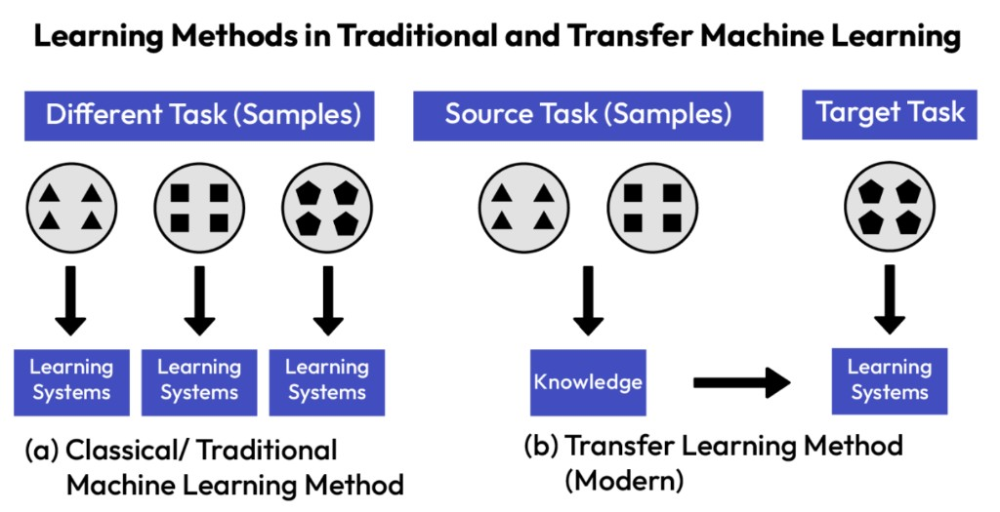

- **(a) Класичне ML:** три різні набори даних (трикутники, квадрати, п'ятикутники) → три окремі моделі → три незалежні навчальні системи.
- **(b) Трансферне навчання:** модель навчається на базових даних (трикутники, квадрати) → отримані знання → переносяться на нову задачу (п'ятикутники) з мінімальним донавчанням.


### Де застосовується трансферне навчання?

Трансферне навчання **не обмежується** класифікацією зображень. Його також можна застосувати до:


| Галузь                           | Приклад                                                                                                                                                       |
| -------------------------------- | ------------------------------------------------------------------------------------------------------------------------------------------------------------- |
| **Класифікація зображень**       | ImageNet → класифікація порід собак                                                                                                                           |
| **Обробка природної мови (NLP)** | BERT (Bidirectional Encoder Representations from Transformers — двонаправлені кодувальні представлення на основі трансформерів) → аналіз тональності відгуків |
| **Розпізнавання мови**           | Pretrained ASR (Automatic Speech Recognition — автоматичне розпізнавання мовлення) → розпізнавання діалектів                                                  |
| **Виявлення об'єктів**           | COCO (Common Objects in Context — поширені об'єкти в контексті) → детекція дефектів на виробництві                                                            |


> **COCO vs ImageNet:**
>
> **ImageNet** — датасет для класифікації: одна мітка на зображення («що на фото?»). 1000 класів, 1.2M+ зображень.
>
> **COCO** — датасет для складніших задач: **330K+ зображень**, **80 категорій** (люди, машини, тварини, меблі тощо). На одному зображенні може бути **багато об'єктів одночасно** — тому «Objects in Context». Містить анотації для object detection (рамки), semantic/instance segmentation (маски пікселів), keypoint detection (пози людей) і image captioning (текстові описи).
>
> Коротко: ImageNet → «**що** на фото?» | COCO → «**що де** знаходиться?»


### Переваги трансферного навчання

1. **Скорочення часу навчання** — fine-tuning швидше, ніж навчання з нуля
2. **Менше даних** — достатньо невеликого набору для нового завдання
3. **Вища точність** — попередньо навчені ознаки допомагають краще узагальнювати
4. **Швидша конвергенція** — модель починає не з випадкових ваг, а з «осмислених»


### Негативне перенесення (Negative Transfer)

> **Увага:** якщо вихідний і цільовий домени **не пов'язані** між собою, трансферне навчання може не тільки не спрацювати, а й **зашкодити** виконанню цільового завдання через нерелевантні вивчені ознаки. Це явище відоме як **негативне перенесення** (negative transfer).

**Приклад:** модель, навчена розпізнавати автомобілі, може бути поганою основою для класифікації клітин під мікроскопом — домени занадто різні.

---


## ЧАСТИНА 2. ТИПИ ТРАНСФЕРНОГО НАВЧАННЯ У CNN

Виокремлюють **два основні підходи** до трансферного навчання у згорткових мережах.

Типова структура CNN — згорткові шари (Feature-Extraction Layer) витягують ознаки, а класифікаційний шар (Classification Layer) робить передбачення:

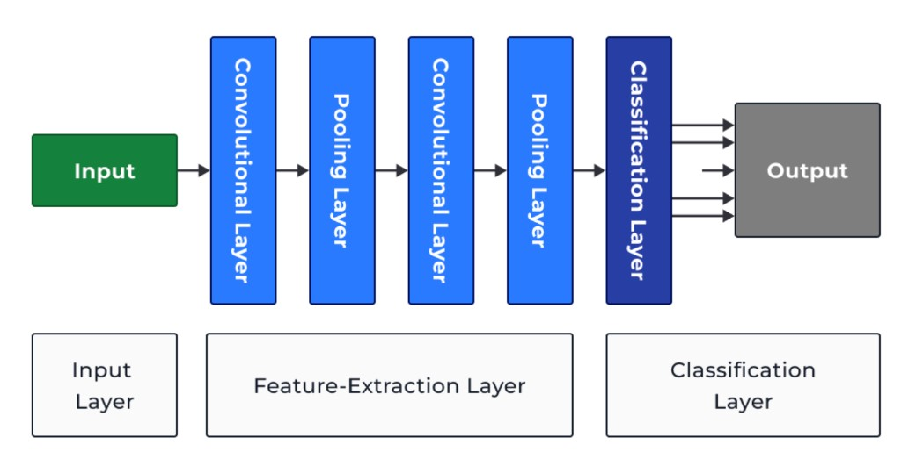

### Підхід 1. CNN як екстрактор ознак (Feature Extractor)

**Ідея:** заморожуємо ваги згорткових шарів (зберігаємо знання з вихідного завдання) і додаємо **новий класифікатор**, який навчається для нового завдання.

```
[Input] → [Pre-trained Conv layers (FROZEN)] → [New Classification layer (TRAINABLE)] → [Output]
           ↑ Generic Feature Detection              ↑ Task-specific classification
           (краї, кути, текстури)                   (мурашки vs бджоли)
```

**Чому це працює:** згорткові шари вивчають **низькорівневі ознаки** (краї, кути, текстури), які є **загальними** для будь-яких зображень. Класифікаційний шар довивчає **високорівневі** деталі для конкретної задачі.

При трансферному навчанні попередньо навчені шари (Pre-trained) зберігають загальні ознаки, шари для тонкого налаштування (Fine-tuned) адаптуються до специфічних ознак, а класифікаційний шар (New Layer) навчається з нуля:

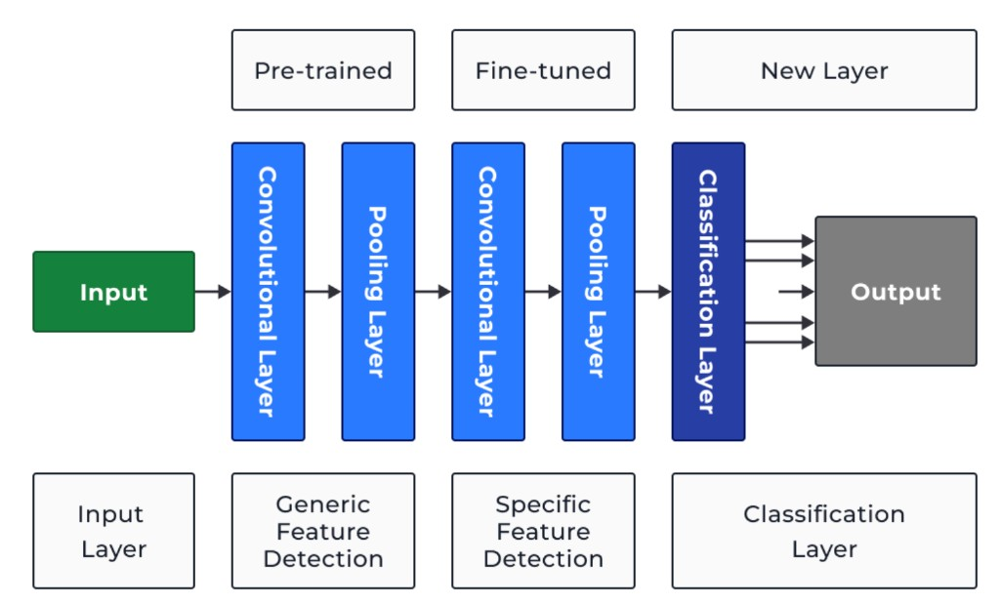

### Підхід 2. Fine-tuning (тонке налаштування)

**Ідея:** розморожуємо **деякі шари** попередньо навченої моделі та додаємо класифікатор. Розморожені шари і класифікатор навчаються **разом**.

```
[Input] → [Pre-trained layers (FROZEN)] → [Fine-tuned layers (TRAINABLE)] → [New Classifier (TRAINABLE)] → [Output]
           ↑ Generic features                ↑ Specific features                ↑ Task-specific
```

**Коли що обирати:**


| Ситуація                                     | Рекомендований підхід            | Чому                            |
| -------------------------------------------- | -------------------------------- | ------------------------------- |
| Маленький датасет, схожий на вихідний        | Екстрактор ознак (заморожування) | Менше ризик перенавчання        |
| Великий датасет, відрізняється від вихідного | Fine-tuning (розморожування)     | Потрібна адаптація ознак        |
| Дуже маленький датасет                       | Екстрактор ознак                 | Мінімум параметрів для навчання |
| Достатньо даних і ресурсів                   | Повне навчання всіх ваг          | Максимальна гнучкість           |


---


## ЧАСТИНА 2.5. SKIP CONNECTIONS (ЗʼЄДНАННЯ ПРОПУСКУ)

**Skip connection** — це додатковий шлях, яким сигнал з більш раннього шару передається далі, **минаючи один або кілька проміжних шарів**. Найвідоміший приклад — **ResNet**.

### Звичайна мережа vs мережа зі skip connection

**Звичайна мережа** — сигнал проходить лише послідовно:

```
x
↓
Conv
↓
ReLU
↓
Conv
↓
output
```

**Мережа зі skip connection (ResNet)** — додається обхідний шлях:

```
x ───────────────┐
↓                │
Conv             │
↓                │
ReLU             │
↓                │
Conv             │
↓                │
F(x) + x  ←──────┘
```

Тобто блок обчислює:

```
y = F(x) + x
```

де:

- **x** — початковий сигнал
- **F(x)** — результат проходження через кілька шарів
- **y** — їх сума


### Навіщо це потрібно?

**Причина 1: vanishing gradient (затухання градієнта)**

У дуже глибоких мережах градієнту під час backpropagation треба пройти через багато шарів. Він може ставати дуже маленьким.

Skip connection дає градієнту **коротший шлях** назад:

```
Звичайний шлях:          Додатковий шлях через skip:

Loss                      Loss
 ↑                         ↑
Conv                      ──────────
 ↑                         ↑
Conv                       x
 ↑
 x
```

Тому ранні шари **легше навчаються** — градієнт доходить до них без суттєвих втрат.

**Причина 2: residual learning (залишкове навчання)**

Шару не потрібно повністю заново створювати нове представлення. Він може просто навчитися: «Що потрібно **додати або виправити** до того, що вже є?»

Саме тому це називається **residual** (залишкове) learning.

### Простий приклад

Уявімо, що `x` вже досить хороший набір ознак:

```
x    = інформація "є кругла форма"

F(x) = додаткова інформація "є текстура ока"

x + F(x) = більш повне представлення об'єкта
```

Замість того щоб мережа вчила «побудуй усе заново», вона вчить «до існуючих ознак додай ось цю невелику поправку».

### Де використовується?


| Архітектура          | Як використовує skip connections                                 |
| -------------------- | ---------------------------------------------------------------- |
| **ResNet**           | Класичний приклад residual connections (додавання: F(x) + x)     |
| **Inception-ResNet** | Поєднання Inception modules і residual connections               |
| **DenseNet**         | Skip через конкатенацію (а не додавання) до всіх наступних шарів |
| **U-Net**            | Skip через конкатенацію між encoder і decoder                    |
| **Transformers**     | Residual connections навколо attention і feed-forward блоків     |


У Transformer приблизно:

```
x
↓
Self-Attention
↓
+ x                ← skip connection
↓
Feed Forward
↓
+ попередній сигнал  ← skip connection
```

Ідея та сама: **не втрачати старий сигнал і дати інформації короткий шлях через мережу**.

### Skip connection ≠ завжди додавання

Skip connection — це **загальна ідея** передачі сигналу в обхід шарів. Але **спосіб об'єднання** може бути різним:


| Спосіб                         | Операція                              | Приклад архітектури  |
| ------------------------------ | ------------------------------------- | -------------------- |
| **Add (додавання)**            | y = F(x) + x — поелементна сума       | ResNet, Transformers |
| **Concatenate (конкатенація)** | y = [x, F(x)] — об'єднання по каналах | U-Net, DenseNet      |


```
ResNet:   skip → ADD           (значення додаються)
U-Net:    skip → CONCATENATE   (канали складаються поруч)
```

---


## ЧАСТИНА 2.6. ЩО ТАКЕ КАНАЛИ (CHANNELS)?

Термін «канали» зустрічається в описі кожної архітектури. Розберемося, що це таке.

### Канали у вхідному зображенні

Кольорове зображення складається з **трьох каналів** — червоного (R), зеленого (G) і синього (B):

```
Зображення 224×224 у кольорі:

224 × 224 × 3
 ↑     ↑    ↑
 H     W    C (channels = 3: Red, Green, Blue)
```

Кожен канал — це окрема матриця (карта) значень від 0 до 255. Три карти разом дають кольорове зображення. Чорно-біле зображення має лише **1 канал**.

### Канали після згорткових шарів (feature maps)

Коли зображення проходить через згортковий шар, **кількість каналів змінюється**. Тепер канали — це вже не кольори, а **карти ознак (feature maps)**, кожна з яких відповідає за виявлення певного патерну:

```
Вхід:  224×224×3     (3 канали: кольори)
         ↓
       Conv2d (32 фільтри)
         ↓
Вихід: 224×224×32    (32 канали: карти ознак)
```

Кожен з 32 фільтрів «навчився» виявляти свій патерн:

```
Канал 1:  вертикальні лінії     ░░█░░
Канал 2:  горизонтальні лінії   █████
Канал 3:  діагоналі             █░░░░
Канал 4:  кути                  █░░░█
...
Канал 32: текстура хутра        ░█░█░
```


### Як змінюється кількість каналів

У міру просування мережі вглиб каналів стає **більше**, а ширина/висота (spatial dimensions) — **менше**:

```
Вхід:          224 × 224 × 3       (великий, але мало каналів)
                    ↓ Conv + Pool
Після шару 1:  112 × 112 × 64      (менший, більше каналів)
                    ↓ Conv + Pool
Після шару 2:   56 ×  56 × 128     (ще менший, ще більше каналів)
                    ↓ Conv + Pool
Після шару 3:   28 ×  28 × 256     (компактний, багато каналів)
                    ↓ ...
Перед класифікатором:  7 × 7 × 512 (маленький, дуже багато каналів)
```

**Чому так?** Перші шари виявляють прості ознаки (краї, лінії) — їх не так багато. Глибші шари комбінують прості ознаки в складніші (очі, вуха, обличчя) — потрібно більше каналів для різноманітних комбінацій.

### Що означає «зменшити кількість каналів»

Коли в описі архітектур написано «1×1 згортка зменшує розмірність» — мається на увазі зменшення **каналів**, а не ширини/висоти:

```
28×28×256  → conv 1×1 (64 фільтри) →  28×28×64
 H   W  C                              H   W  C
 ↑   ↑  ↑                              ↑   ↑  ↑
 те саме                                те саме, але каналів менше
```

Ширина і висота (28×28) **не змінюються**. Зменшується лише кількість каналів (256 → 64).

### Підсумок


| Що                       | Де                     | Скільки каналів           | Що вони означають                                |
| ------------------------ | ---------------------- | ------------------------- | ------------------------------------------------ |
| **Вхідне зображення**    | Перед мережею          | 3 (RGB) або 1 (grayscale) | Кольори                                          |
| **Feature maps**         | Після згорткових шарів | 32, 64, 128, 256, 512…    | Виявлені ознаки (краї, текстури, форми, об'єкти) |
| **Після 1×1 conv**       | Між шарами             | Менше, ніж було           | Стиснуті комбінації ознак                        |
| **Перед класифікатором** | Кінець мережі          | Залежить від архітектури  | Високорівневі абстрактні ознаки                  |


---


## ЧАСТИНА 2.7. ЯК CNN ОБРОБЛЯЄ ЗОБРАЖЕННЯ — ПОКРОКОВО

Розберемо **весь шлях** від вхідного зображення до фінального передбачення. Використовуємо **один послідовний приклад** з конкретними числами.

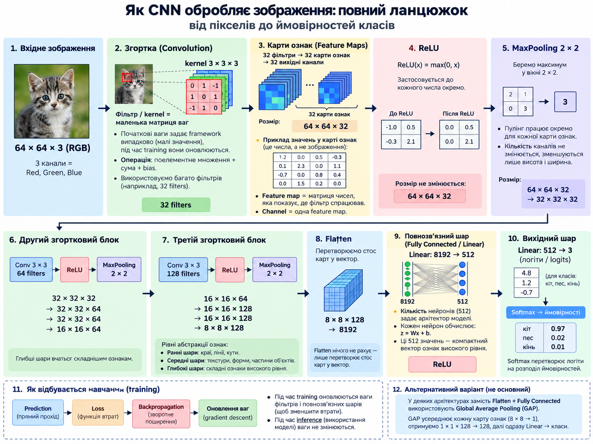

---


### Крок 1. Вхідне зображення

Наприклад, кольорове зображення котика:

```
64 × 64 × 3
 H     W    C (channels: Red, Green, Blue)
```

Це три матриці 64×64 — по одній для кожного кольору.

---


### Крок 2. Convolution — згортковий шар

Шар має **фільтри (kernels)** — це набори ваг, які шукають патерни у зображенні.

```python
Conv2d(in_channels=3, out_channels=32, kernel_size=3)
```

Це означає:

- на вході **3 канали** (RGB)
- шар має **32 фільтри**
- кожен фільтр працює з областю **3×3**

**Як працює один фільтр:**

1. Бере маленьку область зображення (3×3)
2. Робить **поелементне множення** пікселів на ваги фільтра
3. **Додає** всі результати → отримує **одне число**
4. Зсувається далі і повторює

```
▣ → ▣ → ▣ → ...
↓
одне число для кожної позиції
↓
FEATURE MAP (карта ознак)
```

Результат роботи одного фільтра — одна **feature map** (карта ознак) розміром 64×64.

**Але фільтрів 32**, тому кожен створює свою карту:

```
фільтр 1  → feature map 1  (64×64)
фільтр 2  → feature map 2  (64×64)
...
фільтр 32 → feature map 32 (64×64)
```

Результат шару — **стос із 32 матриць**:

```
64 × 64 × 32
```


#### Що таке filter, feature map, channel?


| Термін              | Що це                                                                | Аналогія                         |
| ------------------- | -------------------------------------------------------------------- | -------------------------------- |
| **Filter (kernel)** | Набір ваг, який шукає один патерн                                    | «Детектор вертикальних ліній»    |
| **Feature map**     | Матриця чисел — результат роботи одного фільтра по всьому зображенню | Карта: «де цей патерн присутній» |
| **Channel**         | Один «шар» у вихідному тензорі = одна feature map                    | Одна сторінка у стосі            |


```
32 filters → 32 feature maps → 32 output channels
```


#### Що містить feature map?

Це **матриця чисел**, наприклад:

```
0.1   0.0   1.8   2.1
0.0   0.4   3.2   2.7
0.0   0.1   0.3   0.0
1.2   2.0   0.4   0.1
```

Велике число → фільтр «відгукнувся» (тут є шуканий патерн). Мале число → патерну немає. Якщо намалювати ці числа як grayscale-зображення, побачимо **де саме** фільтр знайшов свій патерн (наприклад, контури вух котика).

#### Хто задає ваги фільтрів?

- **Початкові ваги** — framework (PyTorch) ініціалізує автоматично: маленькі випадкові значення за спеціальною схемою
- **Кінцеві ваги** — модель вивчає під час training через backpropagation
- **Pretrained модель** — ваги вже навчені на великому датасеті (наприклад ImageNet)


#### Чому саме 32 фільтри?

Це **гіперпараметр** — його задає автор архітектури. Можна поставити 16, 32, 64, 128. Більше фільтрів → модель може вивчити більше різних ознак, але буде важчою і повільнішою.

#### Як convolution змішує канали

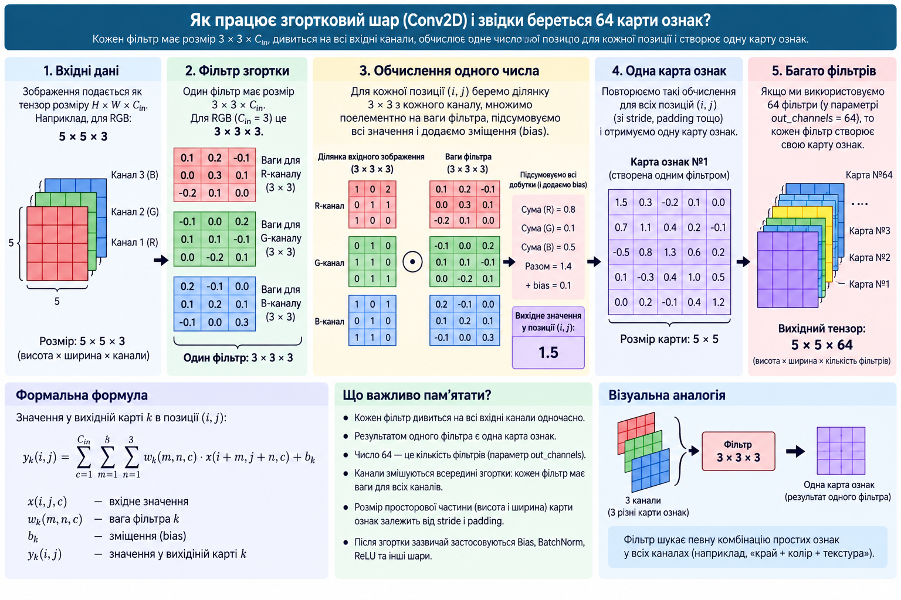

Звичайний Conv2d **не працює з одним каналом окремо**. Кожен фільтр дивиться на **всі вхідні канали одночасно**.

Тому справжня форма фільтра не просто `3×3`, а:

```
3 × 3 × 32  (якщо на вході 32 канали)
```

Він бере маленьку область 3×3 **з кожної** з 32 карт, множить на свої ваги, додає все разом → отримує **одне нове число**. Потім проходить по всій площині й створює одну нову feature map.

Якщо таких фільтрів 64:

```
32 вхідні карти
     ↓ Conv (64 фільтри, кожен 3×3×32)
64 нові карти
```

Кожна нова карта є **комбінацією інформації з усіх попередніх карт**.

**Де саме відбувається змішування?** Всередині одного фільтра, коли він одночасно дивиться на всі вхідні канали. Наприклад, для входу 5×5×3 (RGB) один фільтр має розмір 3×3×3:

```
3×3 ваг для R
3×3 ваг для G
3×3 ваг для B
```

Для однієї позиції він робить:

```
R-ділянка 3×3 × R-ваги  →  Сума(R) = 0.8
G-ділянка 3×3 × G-ваги  →  Сума(G) = 0.1
B-ділянка 3×3 × B-ваги  →  Сума(B) = 0.5
                            ─────────────
              Разом: 0.8 + 0.1 + 0.5 + bias(0.1) = 1.5
```

До моменту складання канали ще окремі. **В момент сумування вони стають одним числом** у новій feature map. Потім фільтр проходить по всьому зображенню й створює одну карту ознак.

А якщо фільтрів 64 — кожен **по-своєму** змішує всі вхідні канали → 64 нові feature maps.

**Навіщо змішувати канали?** Окремі канали містять різні ознаки:

```
channel 1 → краї
channel 2 → текстури
channel 3 → округлі форми
channel 4 → темні області
```

Наступний шар комбінує їх:

```
"край + текстура + округла форма"  →  можливо, частина ока
```

Ще глибше:

```
"око + вухо + шерсть"  →  можливо, морда кота
```

Саме через змішування каналів прості ознаки складаються у складніші.

> **Ключове:** у звичайній CNN convolution одночасно шукає просторові патерни **і** комбінує інформацію між каналами. MobileNet (Depthwise Separable Conv) розділяє це на два кроки: spatial analysis + channel mixing.

---


### Крок 2.5. Batch Normalization (нормалізація батчу)

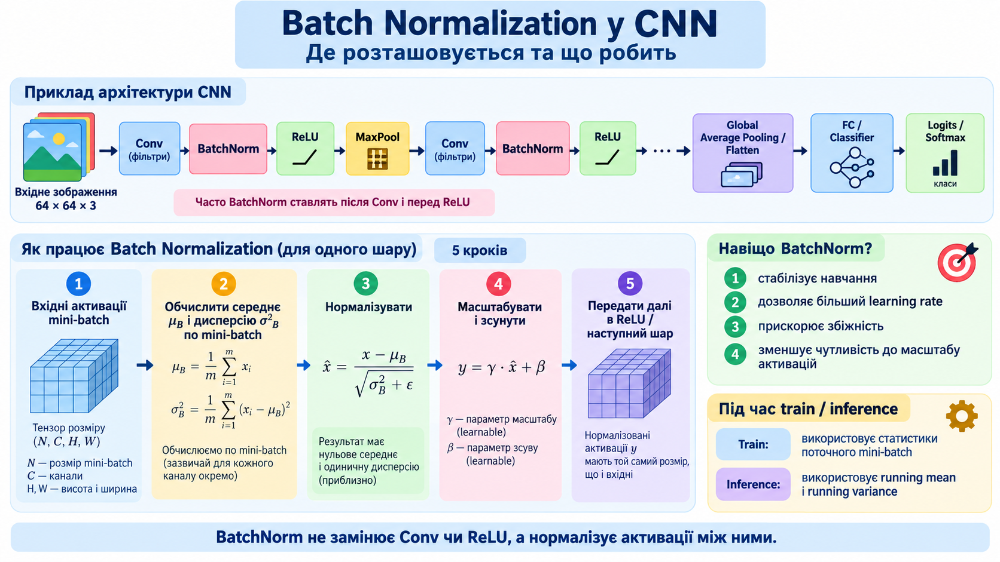

Зазвичай ставиться **після Conv і перед ReLU**:

```
Conv → BatchNorm → ReLU
```


#### Проблема без BatchNorm

Під час навчання значення між шарами можуть «розповзатися»:

```
Шар 1  → значення: [0.5, 1.2, 0.8]
Шар 5  → значення: [245, -180, 412]
Шар 10 → значення: [50000, -72000, ...]
```

Або навпаки — все стискається до нуля. Це називається **internal covariate shift** — розподіл значень між шарами постійно змінюється, і наступним шарам важко «пристосуватися».

#### Як працює BatchNorm

Припустимо, batch_size = 32 (одночасно обробляємо 32 зображення).

**Крок 1 — Статистика по батчу.** Для кожного каналу окремо:

```
μ  = середнє значень по всьому батчу
σ² = дисперсія значень по всьому батчу
```

**Крок 2 — Нормалізація:**

```
x̂ = (x − μ) / √(σ² + ε)
```

де `ε` — маленьке число (напр. 10⁻⁵), щоб не ділити на нуль. Після цього значення мають середнє ≈ 0 і дисперсію ≈ 1.

**Крок 3 — Масштабування (learnable):**

```
y = γ · x̂ + β
```

`γ` і `β` — **ваги, які навчаються**. Мережа сама вирішує, який розподіл їй зручніший.

#### Числовий приклад

Для одного каналу в батчі з 4 зображень:

```
зобр. 1:  8.0     →  (8−9)/√5  ≈ −0.45
зобр. 2: 12.0     →  (12−9)/√5 ≈  1.34
зобр. 3:  6.0     →  (6−9)/√5  ≈ −1.34
зобр. 4: 10.0     →  (10−9)/√5 ≈  0.45

μ = 9.0, σ² = 5.0
```

Значення «зібралися» навколо нуля з помірним розкидом.

#### Навіщо BatchNorm?


| Ефект                     | Пояснення                                         |
| ------------------------- | ------------------------------------------------- |
| **Стабілізує навчання**   | Значення між шарами не «розповзаються»            |
| **Більший learning rate** | Градієнти стабільніші                             |
| **Швидша збіжність**      | Мережа навчається швидше                          |
| **Легка регуляризація**   | Шум від статистики по батчу діє як м'який dropout |


#### Training vs Inference


| Режим                          | Що використовує для μ і σ²                                    |
| ------------------------------ | ------------------------------------------------------------- |
| **Training** (`model.train()`) | Статистику **по поточному батчу** (щоразу різна)              |
| **Inference** (`model.eval()`) | **Running average**, накопичений за весь тренінг (фіксований) |


Саме тому `model.eval()` важливий — BatchNorm перестає рахувати статистику по батчу і використовує збережені значення.

#### У PyTorch

```python
nn.Conv2d(32, 64, kernel_size=3, padding=1)
nn.BatchNorm2d(64)   # 64 = кількість каналів (нормалізує кожен канал окремо)
nn.ReLU()
```

> 📎 Аналогія: конвеєр, де кожен працівник передає деталі наступному. Без BatchNorm деталі можуть приходити різного розміру. **BatchNorm — калібрувальна станція**, яка приводить усі деталі до стандартного розміру перед передачею далі.

---


### Крок 3. Activation — функція активації (ReLU)

```
Conv → 64×64×32 → ReLU → 64×64×32
```

ReLU **не робить жодних множень**. Вона просто проходить по **кожному числу** у тензорі:

```
було:   -4   7  -1   3
стало:   0   7   0   3
```

Формула: **ReLU(x) = max(0, x)**

ReLU **не змінює розмір** тензора — тільки значення. Це додає мережі **нелінійність** (без неї всі шари зводилися б до одного лінійного перетворення).

---


### Крок 4. Ще один Conv + ReLU (за потреби)

> **Важливо:** pooling не обов'язково після кожної convolution. Може бути кілька Conv підряд:

```
Conv → ReLU → Conv → ReLU → Pooling
```

Після другого Conv кількість фільтрів може залишитися такою ж або змінитися — залежить від архітектури. У нашому прикладі залишимо 32:

```
64 × 64 × 32  (після першого Conv + ReLU)
     ↓ Conv + ReLU
64 × 64 × 32  (після другого Conv + ReLU)
```

---


### Крок 5. Pooling — зменшення розмірності

**MaxPool 2×2** бере маленькі області 2×2 і залишає лише максимум:

```
1  7 | 2  3          7  9
3  4 | 9  5    →
-----------          6  8
6  1 | 8  0
2  3 | 4  7
```

Це відбувається **для кожного каналу окремо**:

```
64 × 64 × 32
     ↓ MaxPool 2×2
32 × 32 × 32
```

Ширина і висота зменшились **вдвічі**. Кількість каналів — **не змінилася**.

**Average Pooling** — те саме, але замість максимуму бере **середнє** у вікні.

#### Хто вирішує, що буде 2×2?

Автор архітектури. Це **гіперпараметр**:

```python
nn.MaxPool2d(kernel_size=2, stride=2)
```

`2×2` — найпоширеніший вибір, бо зручно зменшує розмір вдвічі. Але може бути 3×3 або інший.

---


### Крок 6. Повторення — багато блоків Conv / ReLU / Pool

```
64×64×32      (після першого блоку Conv + ReLU)
     ↓ MaxPool 2×2
32×32×32
     ↓ Conv + ReLU
32×32×32
     ↓ MaxPool 2×2
16×16×32
```

На **ранніх** рівнях мережа реагує на прості речі:

```
краї, лінії, кути
```

**Глибше** — на складніші:

```
текстури, форми, частини об'єктів
```

**Ще глибше:**

```
очі, вуха, морда, колеса
```

---


### Крок 7. Global Average Pooling або Flatten

Тепер потрібно перетворити 3D-тензор у 1D-вектор для класифікатора. Є два способи:

#### Спосіб A: Flatten

Просто «розгортає» тензор у довгий вектор. **Flatten нічого не рахує** — лише змінює форму:

```
16 × 16 × 32 = 8192 числа

[0.4, 0.2, 1.7, 0.0, 0.8, ...]  ← вектор довжиною 8192
```


#### Спосіб B: Global Average Pooling (GAP)

Для **кожної** з 32 карт бере середнє усіх чисел:

```
карта 1: 16×16 → середнє 256 чисел → 1 число
карта 2: 16×16 → середнє 256 чисел → 1 число
...
карта 32: 16×16 → середнє 256 чисел → 1 число
```

Результат — вектор довжиною **32** (замість 8192).

```
16×16×32  → GAP →  вектор із 32 чисел
```

GAP значно компактніший і використовується в сучасних архітектурах (Inception, ResNet, EfficientNet).

#### Детальніше: як GAP працює з каналами

Тут **канал = одна карта ознак (feature map)**.

Наприклад, перед Global Average Pooling у ResNet-50 може бути тензор:

```
7 × 7 × 2048
```

Це означає:

- висота карти: 7
- ширина карти: 7
- каналів: 2048

Тобто фактично є **2048 окремих матриць 7×7**:

```
channel 1    → карта 7×7
channel 2    → карта 7×7
...
channel 2048 → карта 7×7
```

Кожен канал містить числа-активації певної вивченої ознаки.

GAP робить так: **для кожної feature map окремо бере середнє всіх її значень**:

```
кожна карта 7×7  (49 чисел)
       ↓
  середнє 49 чисел
       ↓
    1 число

7 × 7 × 2048  →  GAP  →  вектор із 2048 чисел
```

І вже цей вектор із 2048 значень іде у фінальний Linear layer для класифікації.

Коротко: **filter → створює feature map → ця feature map є output channel → GAP стискає кожен channel до одного числа.**

#### Приклад: 5 feature maps 7×7

У реальній ResNet-50 таких перед GAP буде 2048. Для наочності — 5:

**Channel 1 / Feature map 1:**

```
0.0  0.1  0.2  0.0  0.0  0.1  0.0
0.1  0.8  1.4  0.4  0.1  0.0  0.0
0.0  1.2  2.7  1.5  0.2  0.0  0.1
0.1  0.7  2.1  1.8  0.3  0.1  0.0
0.0  0.2  0.8  0.5  0.1  0.0  0.0
0.0  0.0  0.1  0.0  0.0  0.0  0.0
0.0  0.0  0.0  0.0  0.1  0.0  0.0
```

**Channel 2 / Feature map 2:**

```
0.2  0.3  0.1  0.0  0.0  0.0  0.0
0.5  1.1  0.4  0.0  0.1  0.0  0.0
1.4  2.3  0.8  0.1  0.0  0.0  0.0
1.2  1.9  0.6  0.0  0.0  0.1  0.0
0.4  0.7  0.2  0.0  0.0  0.0  0.0
0.1  0.1  0.0  0.0  0.0  0.0  0.0
0.0  0.0  0.0  0.0  0.0  0.0  0.0
```

**Channel 3 / Feature map 3:**

```
0.0  0.0  0.0  0.1  0.2  0.3  0.1
0.0  0.0  0.1  0.3  0.8  1.1  0.4
0.0  0.1  0.3  0.9  1.8  2.4  0.8
0.0  0.0  0.2  0.7  1.5  1.9  0.6
0.0  0.0  0.1  0.2  0.6  0.7  0.2
0.0  0.0  0.0  0.1  0.1  0.0  0.0
0.0  0.0  0.0  0.0  0.0  0.0  0.0
```

**Channel 4 / Feature map 4:**

```
0.0  0.0  0.1  0.2  0.1  0.0  0.0
0.0  0.2  0.5  0.9  0.4  0.1  0.0
0.1  0.6  1.3  2.0  1.1  0.3  0.0
0.2  0.8  1.7  2.6  1.5  0.4  0.1
0.0  0.4  0.9  1.3  0.7  0.2  0.0
0.0  0.1  0.2  0.4  0.2  0.0  0.0
0.0  0.0  0.0  0.1  0.0  0.0  0.0
```

**Channel 5 / Feature map 5:**

```
0.0  0.1  0.0  0.0  0.1  0.0  0.0
0.1  0.3  0.2  0.1  0.4  0.2  0.0
0.0  0.6  1.1  0.8  0.7  0.3  0.1
0.1  0.9  1.8  2.2  1.4  0.5  0.0
0.0  0.5  1.0  1.3  0.8  0.2  0.0
0.0  0.1  0.3  0.4  0.2  0.0  0.0
0.0  0.0  0.0  0.1  0.0  0.0  0.0
```

Велике число означає: відповідна вивчена ознака сильно проявилася в цій ділянці.

Вся структура виглядає буквально як стос:

```
       ┌─────────┐
       │ карта 5 │  7×7
     ┌─────────┐
     │ карта 4 │    7×7
   ┌─────────┐
   │ карта 3 │      7×7
 ┌─────────┐
 │ карта 2 │        7×7
┌─────────┐
│ карта 1 │          7×7
└─────────┘
```

**Global Average Pooling** робить із кожної матриці одне число:

```
map 1 (49 чисел) → average → 0.42
map 2 (49 чисел) → average → 0.31
map 3 (49 чисел) → average → 0.29
map 4 (49 чисел) → average → 0.47
map 5 (49 чисел) → average → 0.40
```

Із 5 карт вийшов вектор:

```
[0.42, 0.31, 0.29, 0.47, 0.40]
```

А в ResNet-50 аналогічно: **2048 карт → 2048 чисел → Linear → logits → Softmax**.

---


### Крок 8. Fully Connected layer (повнозв'язний шар)

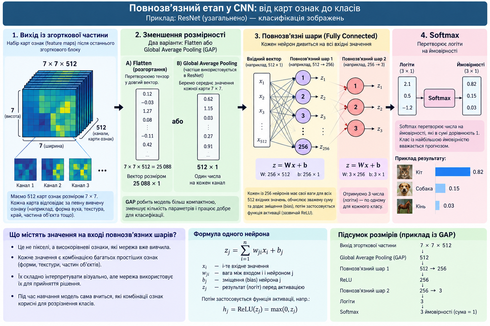

Тут знову є **множення на ваги**. Наприклад (після Flatten):

```python
nn.Linear(8192, 512)
```

Кожен із 512 нейронів бере **всі** 8192 входів, множить на свої ваги, додає bias:

```
z = W · x + b
```

```
8192 вхідних ознак
       ↓
    × матриця ваг (512 × 8192)
    + bias
       ↓
512 нових значень
       ↓
     ReLU
       ↓
512 значень
```


#### Звідки беруться входи?

Входи — це **автоматичний результат** усіх попередніх шарів (Conv, ReLU, Pool, Flatten). Ми не знаємо **які саме значення** там будуть (це залежить від конкретного зображення), але знаємо **скільки їх буде** (це визначається архітектурою).

#### Звідки беруться ваги?

- **Кількість нейронів** (512) — задає автор архітектури (гіперпараметр)
- **Початкові ваги** — ініціалізує framework (PyTorch)
- **Кінцеві ваги** — модель вивчає під час training


#### Що містять ці 512 значень?

Це вже **не пікселі і не карти ознак**, а компактний **вектор ознак високого рівня**. Кожне число — результат змішування багатьох попередніх ознак. Один нейрон може реагувати на комбінацію «є шерсть + загострені вуха + певна форма морди» і дати, наприклад, 2.7. Але ми зазвичай **не можемо точно сказати**, що означає кожне конкретне число.

```
feature maps  → "що я бачу"
512 значень   → "які складні ознаки я зібрав"
```

---


### Крок 9. Останній Linear layer → logits

Якщо класів 3 (кіт, пес, кінь):

```python
nn.Linear(512, 3)
```

Кожен із 3 нейронів бере всі 512 входів, множить на ваги, додає bias:

```
512 ознак
     ↓
  × ваги + bias
     ↓
3 числа: [4.8, 1.2, -0.7]
```

Ці 3 числа називаються **logits** — це «сирі оцінки класів». Це ще **НЕ ймовірності**.

---


### Крок 10. Softmax → ймовірності → передбачення

Softmax перетворює logits у **розподіл ймовірностей** (сума = 1.0):

```
logits:        [4.8,   1.2,    -0.7]

softmax:       [0.97,  0.027,  0.003]

                cat     dog     horse
```

Модель обирає клас з найвищою ймовірністю: **cat (97%)**.

---


### Весь CNN-ланцюжок одним поглядом

```
IMAGE                          64×64×3
  ↓
CONVOLUTION (32 фільтри)       кожен фільтр шукає свій патерн
  ↓
FEATURE MAPS                   64×64×32  (стос із 32 матриць)
  ↓
RELU                           max(0, x) для кожного числа
  ↓
CONV + RELU                    ще складніші ознаки
  ↓
POOLING (MaxPool 2×2)          зменшуємо ширину і висоту вдвічі
  ↓
                               32×32×32
  ↓
ще Conv / ReLU / Pool блоки
  ↓
                               16×16×32
  ↓
FLATTEN або GAP                8192 чисел або 32 числа
  ↓
FULLY CONNECTED                8192 → 512 (множення на ваги)
  ↓
RELU
  ↓
FULLY CONNECTED                512 → 3 (множення на ваги)
  ↓
LOGITS                         [4.8, 1.2, -0.7]
  ↓
SOFTMAX                        [0.97, 0.027, 0.003]
  ↓
PREDICTION                     cat 🐱
```

---


### Підсумок: що робить кожна операція


| Операція        | Що робить                                       | Чи навчається?       | Змінює розмір?           |
| --------------- | ----------------------------------------------- | -------------------- | ------------------------ |
| **Conv**        | Множить ваги фільтрів на пікселі → шукає ознаки | ✅ Так, ваги фільтрів | Змінює кількість каналів |
| **ReLU**        | max(0, x) для кожного числа                     | ❌ Ні                 | Ні                       |
| **MaxPool**     | Бере максимум у вікні 2×2                       | ❌ Ні                 | Зменшує H і W вдвічі     |
| **GAP**         | Середнє по всій карті → 1 число на канал        | ❌ Ні                 | H×W×C → C                |
| **Flatten**     | Розгортає 3D-тензор у 1D-вектор                 | ❌ Ні                 | H×W×C → H·W·C            |
| **Linear (FC)** | Множить вектор на матрицю ваг + bias            | ✅ Так, ваги і bias   | Змінює довжину вектора   |
| **Softmax**     | Перетворює logits у ймовірності (сума = 1)      | ❌ Ні                 | Ні                       |


> **Ключове:** тільки **Conv** і **Linear** мають ваги, що навчаються. Все інше — це фіксовані операції без параметрів.

Сучасні CNN (Inception, ResNet, EfficientNet) можуть замінити `Flatten → FC → FC` на `Global Average Pooling → classifier`, уникаючи величезних fully connected шарів.

---


## ЧАСТИНА 3. ОГЛЯД АРХІТЕКТУР CNN

> **Зверніть увагу** на ключові особливості кожної архітектури. Спробуйте знайти ключову відмінність кожної з них.


### Умовні позначення для схем архітектур


| Позначення                      | Що означає                                 | Колір                        |
| ------------------------------- | ------------------------------------------ | ---------------------------- |
| `conv K*K`                      | Згорткова операція з ядром K×K             | Червоний                     |
| `avg-pool K*K` / `max-pool K*K` | Операція пулінгу                           | Сірий                        |
| `concat` / `add`                | Операція злиття (конкатенація / додавання) | Фіолетовий                   |
| Dense layer                     | Повністю з'єднаний шар                     | Синій                        |
| **T**                           | Функція активації Tanh                     | Жовтий кружок                |
| **R**                           | Функція активації ReLU                     | Жовтий кружок                |
| **B**                           | Batch Normalisation                        | Кремовий кружок              |
| **S**                           | Softmax                                    | Кремовий кружок              |
| Module A / B / C                | Модуль (група операцій)                    | Жовтий / Зелений / Оранжевий |


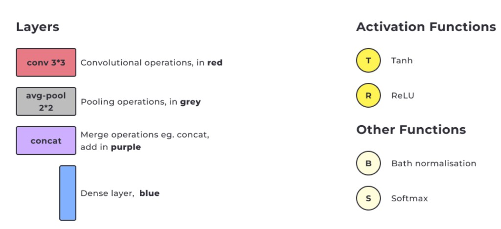

Модулі (групи операцій згортки, об'єднання чи злиття) позначаються кольором. Нижче показано приклади модулів та як позначаються повторювані блоки:

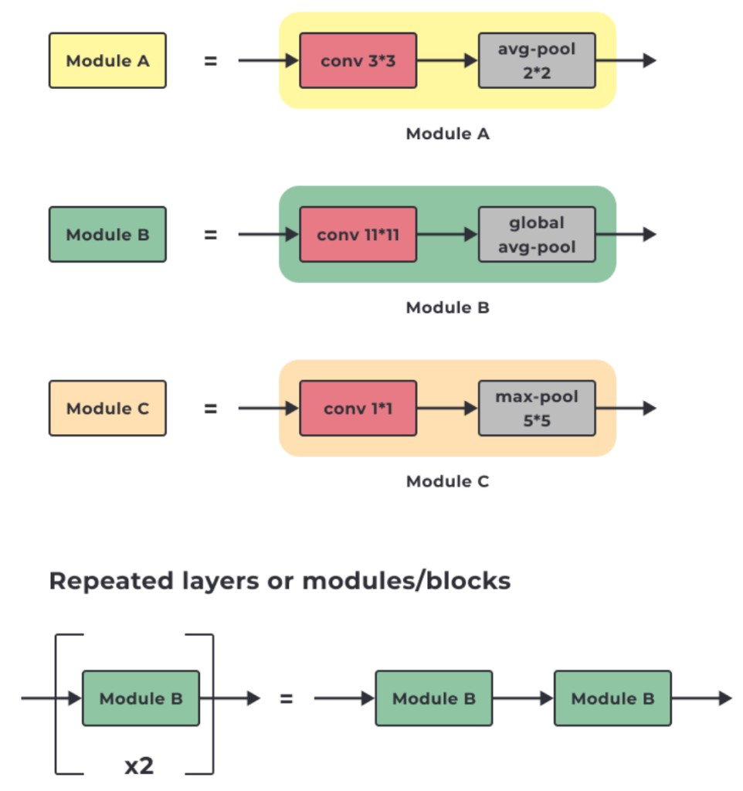

---


### 3.1. AlexNet (2012)

**Стаття:** [ImageNet Classification with Deep Convolutional Neural Networks](тема_6/NIPS-2012-imagenet-classification-with-deep-convolutional-neural-networks-Paper.pdf) (Krizhevsky et al., 2012)

**Ключова особливість:** одна з **перших глибоких CNN**, яка досягла значних результатів на ILSVRC-2012 і розширила галузь комп'ютерного зору.

**Архітектура:**

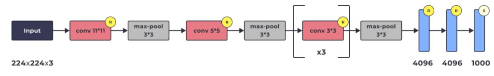

```
Input (224×224×3) → conv 11*11 [R] → max-pool 3*3 [R] → conv 5*5 [R] → max-pool 3*3
                  → [conv 3*3 [R]] ×3 → max-pool 3*3 → FC 4096 [R] → FC 4096 [R] → FC 1000 [S]
```

> **[R]** — ReLU (функція активації), **[S]** — Softmax (перетворення в ймовірності)


| Компонент             | Деталі                                                         |
| --------------------- | -------------------------------------------------------------- |
| **Вхід**              | Зображення 224×224×3                                           |
| **Згорткові шари**    | Фільтри різних розмірів (11×11, 5×5, 3×3)                      |
| **Активація**         | ReLU після кожного згорткового шару                            |
| **Пулінг**            | Max Pooling 3×3 для зменшення розмірності                      |
| **Повнозв'язні шари** | 3 FC-шари (Fully Connected — повнозв'язні): 4096 → 4096 → 1000 |
| **Вихід**             | Softmax на 1000 класів                                         |


**Коли використовувати:** завдання класифікації великомасштабних зображень, що вимагають високої точності та великого набору даних.

---


### 3.2. VGG-16 (2014)

**Стаття:** [Very Deep Convolutional Networks for Large-Scale Image Recognition](тема_6/VGG.pdf) (Simonyan & Zisserman, 2014)

**Ключова особливість:** глибша структура з використанням **виключно 3×3 згорток** і **2×2 пулінгу** — однорідність спрощує архітектуру.

**Архітектура:**

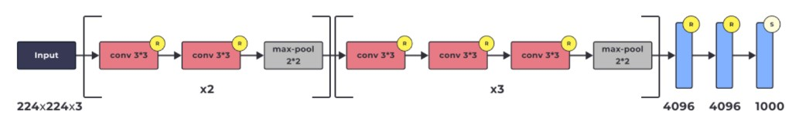

```
Input (224×224×3) → [conv 3*3 [R] → conv 3*3 [R] → max-pool 2*2] ×2
                  → [conv 3*3 [R] → conv 3*3 [R] → conv 3*3 [R] → max-pool 2*2] ×3
                  → FC 4096 [R] → FC 4096 [R] → FC 1000 [S]
```

> **[R]** — ReLU (функція активації), **[S]** — Softmax (перетворення в ймовірності)

**Основні особливості:**


| Особливість                   | Деталі                                                                                                  |
| ----------------------------- | ------------------------------------------------------------------------------------------------------- |
| **Глибина**                   | 16 шарів (13 згорткових + 3 повнозв'язних) — одна з перших глибоких CNN                                 |
| **Конволюційні блоки**        | Послідовності згорток 3×3 + пулінг 2×2 — однорідна архітектура                                          |
| **Малий розмір ядра**         | Всюди тільки 3×3 — менше параметрів у згорткових шарах порівняно з 5×5 / 7×7                            |
| **Більше параметрів загалом** | ~138M параметрів — але переважна більшість припадає не на згортки, а на величезні FC-шари (4096 → 4096) |
| **Повнозв'язні шари**         | 3 FC-шари в кінці для класифікації — саме вони є «вузьким місцем» за кількістю параметрів               |
| **Активація**                 | ReLU після кожного шару — нелінійність + уникнення згасання градієнта                                   |


**Чому 3×3 замість більших ядер?** Два послідовних шари 3×3 мають таке саме рецептивне поле, як один шар 5×5, але з **меншою кількістю параметрів** (2 × 3² = 18 vs 5² = 25) та **більшою нелінійністю** (2 ReLU замість 1).

**Коли використовувати:** класифікація з **невеликою кількістю даних** (ідентифікація порід собак, типів квітів).

---


### 3.3. Inception-v1 / GoogLeNet (2014)

**Стаття:** [Going Deeper with Convolutions](тема_6/Inception.pdf) (Szegedy et al., 2014)

**Ключова особливість:** **модулі Inception** — паралельне застосування згорток різних розмірів ядер (1×1, 3×3, 5×5) з наступною конкатенацією результатів. Головна ідея: «не знаю, який розмір фільтра буде найкращим — спробую кілька одночасно».

**Архітектура (високий рівень):**

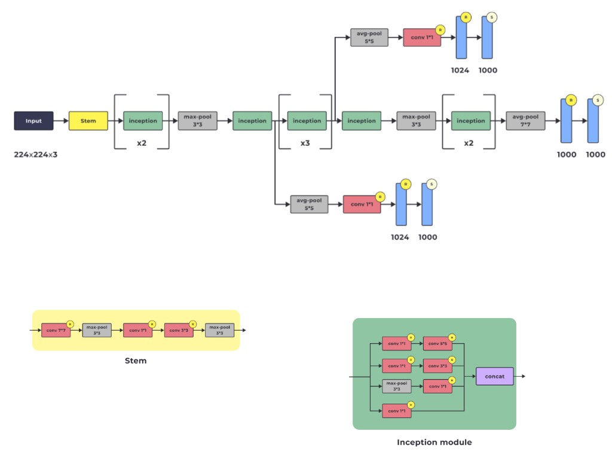

```
Input (224×224×3) → Stem → [Inception module] ×2 → max-pool 3*3
                  → [Inception module] ×3 → max-pool 3*3
                  → [Inception module] ×2 → avg-pool 7*7 → FC 1000 [S]
```

> **[R]** — ReLU (функція активації), **[S]** — Softmax (перетворення в ймовірності)

**Stem (вхідний блок):**

```
conv 7*7 [R] → max-pool 3*3 → conv 1*1 [R] → conv 3*3 [R] → max-pool 3*3
```

**Inception module (паралельні шляхи + конкатенація):**

```
input ─┬─→ conv 1*1 [R] → conv 5*5 [R] ──────────────┐
       ├─→ conv 1*1 [R] → conv 3*3 [R] ──────────────┤
       ├─→ max-pool 3*3 → conv 1*1 [R] ──────────────┤ → concat → output
       └─→ conv 1*1 [R] ─────────────────────────────┘
```

Різні ядра бачать **різний масштаб**: `1×1` — дуже локальна інформація; `3×3` — трохи більші патерни; `5×5` — ще більші структури; pooling — найбільш узагальнена інформація. Потім усе це **конкатенується** (об'єднується по каналах).

**Основні особливості:**


| Особливість                            | Деталі                                                                                                |
| -------------------------------------- | ----------------------------------------------------------------------------------------------------- |
| **Модулі Inception**                   | Паралельні згортки 1×1, 3×3, 5×5 + конкатенація результатів                                           |
| **1×1 згортки для зменшення каналів**  | Зменшують **кількість каналів** (не ширину/висоту) перед дорогими 3×3 та 5×5 — значно менше обчислень |
| **Global Average Pooling замість FC**  | У кінці мережі — значно менше параметрів, запобігає перенавчанню                                      |
| **Три виходи (auxiliary classifiers)** | Допоміжні класифікатори для стабілізації навчання глибокої мережі                                     |


> ⚠️ **Важливо:** Inception-v1 **НЕ має skip connections / residual connections** у сенсі ResNet. Те, що на схемі виглядає як «бокові гілки» — це **допоміжні класифікатори (auxiliary classifiers)**, а не зв'язки пропуску. Справжні skip connections з'явилися пізніше в ResNet (2015), а комбінація Inception + residual — в архітектурі **Inception-ResNet**.

**Що таке конкатенація (concat)?**

Якщо 4 гілки Inception module створили карти однакового розміру 28×28, але з різною кількістю каналів:

```
branch 1 → 28×28×64
branch 2 → 28×28×128
branch 3 → 28×28×32
branch 4 → 28×28×32
```

Конкатенація складає **канали один за одним**: 64 + 128 + 32 + 32 = 256 → результат **28×28×256**. Це **не додавання значень** (як у ResNet), а збереження результатів усіх гілок поруч у channel dimension. Аналогія: один кухар оцінює запах, другий — текстуру, третій — колір, четвертий — форму. Потім ми не вибираємо одного — ми беремо **всі спостереження разом**.

**Навіщо 1×1 згортка перед 3×3 і 5×5?**

`1×1` згортка **не змінює** ширину та висоту — вона зменшує **кількість каналів**:

```
28×28×256  → conv 1×1 →  28×28×64  → conv 5×5 → ...
  (H, W не змінюються; channels: 256 → 64)
```

Без `1×1`: ядро 5×5 працює з 256 каналами — дуже дорого. З `1×1`: спочатку стискаємо до 64 каналів, потім 5×5 працює лише з 64 — **значно дешевше**. По суті, `1×1` каже: «У нас 256 видів інформації. Стиснімо їх до 64 корисних комбінацій, а вже потім запускай дорогий 5×5».

**Навіщо Global Average Pooling замість FC-шарів?**

VGG-подібний підхід з FC-шарами потребує величезної кількості параметрів:

```
7×7×1024  → flatten → 50 176 → FC 4096 →  більше 200M ваг!
```

Global Average Pooling для кожної з 1024 карт ознак (7×7) бере **середнє** значення → одне число:

```
7×7×1024  → GAP → вектор 1024 → classifier
```

Замість 200M+ ваг — лише 1024 входи для класифікатора. Значно менше параметрів → менше ризик перенавчання.

**Три виходи — auxiliary classifiers (допоміжні класифікатори):**

```
рання частина мережі
     ↓
auxiliary classifier #1 → prediction  (loss × 0.3)
     ↓
мережа йде далі
     ↓
auxiliary classifier #2 → prediction  (loss × 0.3)
     ↓
ще далі
     ↓
main classifier → prediction  (основний loss)
```


| Вихід                       | Призначення                                      |
| --------------------------- | ------------------------------------------------ |
| **Auxiliary classifier #1** | Допоміжний класифікатор з ранньої частини мережі |
| **Auxiliary classifier #2** | Допоміжний класифікатор із середини мережі       |
| **Main classifier**         | Основний класифікатор у кінці мережі             |


**Навіщо?** У глибокій мережі головний loss далеко від ранніх шарів — градієнту треба пройти через багато шарів назад. Auxiliary classifiers створюють **коротший шлях** для градієнта, щоб ранні шари теж отримували хороший навчальний сигнал. Загальний loss при навчанні:

```
L = L_main + 0.3 · L_aux₁ + 0.3 · L_aux₂
```

де:

- **L** — загальний loss (функція втрат), який мережа мінімізує під час навчання
- **L_main** — loss від основного класифікатора в кінці мережі (головний сигнал)
- **L_aux₁** — loss від першого допоміжного класифікатора (auxiliary — допоміжний)
- **L_aux₂** — loss від другого допоміжного класифікатора
- **0.3** — вага допоміжних losses (менша за 1, бо головний loss важливіший)

> **На inference** (при використанні навченої моделі) auxiliary classifiers **не потрібні** — використовується тільки main classifier. У PyTorch вони контролюються параметром `aux_logits=True/False`.

**Аналогія:** auxiliary classifiers — як викладач, який не чекає лише фінального іспиту, а перевіряє студента **посеред курсу**, щоб ранні етапи навчання теж отримували зворотний зв'язок.

**Ключова відмінність від VGG:**


| VGG                              | Inception                                                               |
| -------------------------------- | ----------------------------------------------------------------------- |
| Один послідовний шлях            | На кожному рівні дивимось на картинку **кількома способами паралельно** |
| Великі FC-шари (138M параметрів) | Global Average Pooling (значно менше параметрів)                        |
| Тільки 3×3                       | 1×1, 3×3, 5×5, pooling — одночасно                                      |


**Коли використовувати:** великомасштабна класифікація зображень, виявлення об'єктів (object detection) і сегментація (segmentation).

---


### 3.4. ResNet-50 (2015)

**Стаття:** [Deep Residual Learning for Image Recognition](тема_6/ResNet.pdf) (He et al., 2015)

**Ключова особливість:** **зв'язки пропуску (skip connections)** — дозволяють тренувати дуже глибокі мережі (50+ шарів) без затухання градієнта.

**Архітектура (високий рівень):**

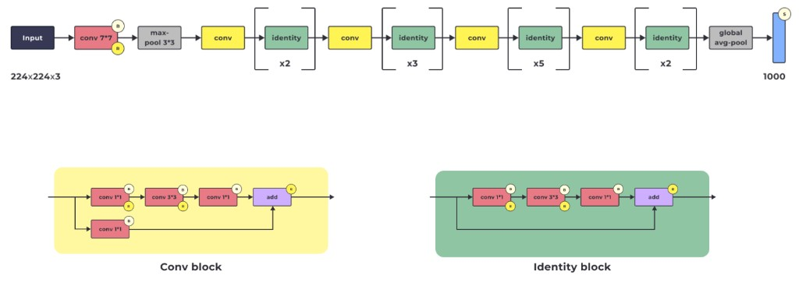

```
Input (224×224×3) → conv 7*7 [R,B] → max-pool 3*3
                  → [conv + identity ×2] → [conv + identity ×3]
                  → [conv + identity ×5] → [conv + identity ×2]
                  → global avg-pool → FC 1000 [S]
```

> **[R]** — ReLU (функція активації), **[B]** — Batch Normalization (нормалізація батчу), **[S]** — Softmax (перетворення в ймовірності), **(+)** — поелементне додавання (skip connection)

**Conv block (зі зміною розмірності):**

```
input ─┬─→ conv 1*1 [R,B] → conv 3*3 [R,B] → conv 1*1 [B] → (+) → [R] → output
       └─→ conv 1*1 [B] ──────────────────────────────────→  ↑
                              skip connection
```

**Identity block (без зміни розмірності):**

```
input ─┬─→ conv 1*1 [R,B] → conv 3*3 [R,B] → conv 1*1 [B] → (+) → [R] → output
       └────────────────────────────────────────────────────→  ↑
                              skip connection
```

**Основні особливості:**


| Особливість                | Деталі                                                                    |
| -------------------------- | ------------------------------------------------------------------------- |
| **Skip connections**       | Передача інформації напряму від входу до виходу блоку — ключова інновація |
| **50 шарів**               | Згорткові шари + блоки ResNet + повнозв'язний шар                         |
| **Згортки 1×1**            | Зменшують розмірність перед 3×3 згорткою (bottleneck)                     |
| **Global Average Pooling** | Фіксований вектор ознак перед класифікаційним шаром                       |
| **Два типи блоків**        | Conv block (зі зміною розмірності) + Identity block (без зміни)           |


**Чому skip connections працюють?** Вихід блоку: **output = F(x) + x**. Навіть якщо F(x) → 0 через затухання градієнта, мережа все одно передає x далі. Це гарантує, що глибша мережа працює **не гірше** за мілкішу.

**Коли використовувати:** завдання, що вимагають **дуже глибокої мережі** — розпізнавання дрібних деталей на зображеннях.

#### Bottleneck block — детальніше

У ResNet-50 головний тип блоку — **bottleneck block**:

```
Input
  │
  ├──────────── skip connection ──────────────┐
  ↓                                           │
Conv 1×1    ← зменшує кількість каналів       │
  ↓                                           │
Conv 3×3    ← витягує просторові ознаки       │
  ↓                                           │
Conv 1×1    ← збільшує кількість каналів      │
  ↓                                           │
ADD  ←────────────────────────────────────────┘
  ↓
ReLU
```

Назва **bottleneck** (вузьке горлечко) — бо ми стискаємо інформацію (зменшуємо канали), обробляємо її дешевше (3×3 згортка на меншій кількості каналів), а потім розширюємо назад.

#### Як 1×1 Conv стискає та розширює канали

Розмір `1×1` описує лише **просторовий розмір kernel**, але не каже, скільки буде фільтрів. Саме `out_channels` визначає кількість вихідних карт ознак.

```python
Conv2d(256, 64, kernel_size=1)   # 256 каналів → 64 канали (стиснення)
Conv2d(64, 256, kernel_size=1)   # 64 канали → 256 каналів (розширення)
```

Тобто:

- `kernel_size=1` → кожен фільтр дивиться лише на **одну spatial-позицію** за раз
- `out_channels=64` або `256` → скільки нових карт ознак ми хочемо отримати

**Розбір параметрів** `Conv2d(64, 256, kernel_size=1)`**:**


| Параметр       | Значення | Що означає                                              |
| -------------- | -------- | ------------------------------------------------------- |
| `in_channels`  | 64       | Скільки каналів (карт ознак) приходить на вхід          |
| `out_channels` | 256      | Скільки фільтрів → скільки нових feature maps на виході |
| `kernel_size`  | 1        | Розмір ядра: 1×1                                        |


```
вхід:  28 × 28 × 64
           ↓
  Conv2d(64, 256, kernel_size=1)
           ↓
вихід: 28 × 28 × 256
```

Якщо `stride=1` і padding не змінює розмір — висота й ширина залишаються ті самі.

Повний запис із додатковими параметрами:

```python
nn.Conv2d(
    in_channels=64,
    out_channels=256,
    kernel_size=1,
    stride=1,       # на скільки позицій пересувається kernel
    padding=0,      # скільки пікселів додаємо по краях
    bias=True       # чи додається зміщення до кожного вихідного каналу
)
```

> **Важливо:** `1×1 Conv` не просто «обрізає» старі карти. Він **змішує інформацію з усіх вхідних каналів** і створює новий набір каналів.

**Числовий приклад bottleneck у ResNet:**

```
28×28×256        вхід: 256 каналів
     ↓
1×1, 64 filters  стиснення: 256 → 64
     ↓
28×28×64         «вузьке горлечко»
     ↓
3×3, 64 filters  просторова згортка (дешева, бо лише 64 канали)
     ↓
28×28×64
     ↓
1×1, 256 filters розширення: 64 → 256
     ↓
28×28×256        вихід: знову 256 каналів (збігається з входом для ADD)
```

Без bottleneck довелося б робити `3×3` згортку на всіх 256 каналах — це **в 16 разів** дорожче за обчисленнями.

#### Два варіанти residual-блоків


| Тип блоку                   | Коли використовується                      | Skip connection                                     |
| --------------------------- | ------------------------------------------ | --------------------------------------------------- |
| **Identity block**          | Розмір входу = розмір виходу               | Просто передає x напряму                            |
| **Projection (Conv) block** | Треба змінити розмір або кількість каналів | На skip-шляху стоїть `1×1 Conv`, щоб форми збіглися |


**Identity block** — вхід і вихід мають **однаковий розмір**, тому skip connection просто переносить x напряму:

```
28×28×64
   │
   ├───────────────┐
   ↓               │
 Conv 1×1          │
   ↓               │
 Conv 3×3          │
   ↓               │
 Conv 1×1          │
   ↓               │
28×28×64           │
   │               │
   └────── + ──────┘
          ↓
      28×28×64
```

`28×28×64 + 28×28×64` — форми однакові, можна додати без проблем.

> 📎 Аналогія: ти редагуєш текст, але зберігаєш оригінал. Потім додаєш до оригіналу свої покращення — не переписуєш усе з нуля.

---

**Projection block** — розмір **змінився**, тому skip-шлях теж потрібно перетворити через `1×1 Conv`:

```
28×28×64
   │
   ├── 1×1 Conv ──→ 14×14×256    (перехідник)
   │
   ↓
 Conv 1×1
   ↓
 Conv 3×3
   ↓
 Conv 1×1
   ↓
14×14×256
   │
   └────── + ──────┘
          ↓
      14×14×256
```

Без перетворення `28×28×64 + 14×14×256` неможливо — форми різні. Тому `1×1 Conv` на skip-шляху працює як **перехідник**.

> 📎 Аналогія: старий документ у форматі A, новий результат у форматі B. Перед об'єднанням старий документ треба конвертувати у формат B.

**Коротко:**

```
Identity block         Projection block
форма не змінилась     форма змінилась
→ skip іде напряму     → skip проходить через 1×1 Conv
```


#### Семантична сегментація

ResNet широко використовується як backbone (основа) для задач **семантичної сегментації** — задачі, де модель класифікує **кожен піксель зображення**.

Наприклад, є фото дороги. Для кожного пікселя модель вирішує:

```
цей піксель → дорога
цей → машина
цей → людина
цей → небо
цей → будинок
```

На виході — не просто «на фото є машина», а **ціла маска**, де кожна область має свій клас.

**Різниця між задачами комп'ютерного зору:**


| Задача                    | Що робить                                       | Вихід                         |
| ------------------------- | ----------------------------------------------- | ----------------------------- |
| **Classification**        | Один клас на все зображення                     | «кіт»                         |
| **Object Detection**      | Класи + рамки навколо об'єктів                  | рамка + «кіт», рамка + «пес»  |
| **Semantic Segmentation** | Клас для **кожного пікселя**                    | маска: кожен піксель має клас |
| **Instance Segmentation** | Те саме + розрізняє окремі об'єкти одного класу | «людина 1», «людина 2»        |


---


### 3.5. ResNeXt-50 (2017)

**Стаття:** [Aggregated Residual Transformations for Deep Neural Networks](тема_6/ResNeXt.pdf) (Xie et al., 2017)

**Ключова особливість:** **кардинальність** — множина паралельних шляхів (наприклад, 32) у кожному блоці замість одного, як у ResNet.

**Архітектура (високий рівень):**

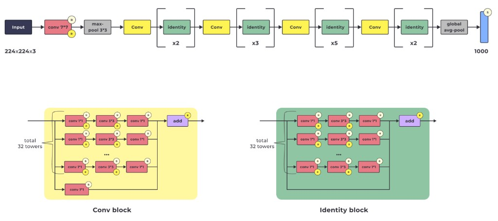

```
Input (224×224×3) → conv 7*7 [R,B] → max-pool 3*3
                  → [Conv + identity ×2] → [Conv + identity ×3]
                  → [Conv + identity ×5] → [Conv + identity ×2]
                  → global avg-pool → FC 1000 [S]
```

> **[R]** — ReLU (функція активації), **[B]** — Batch Normalization (нормалізація батчу), **[S]** — Softmax (перетворення в ймовірності), **(+)** / **add** — поелементне додавання (skip connection)

**Conv block (з 32 паралельними шляхами):**

```
input ─┬─→ ┌ conv 1*1 [R] → conv 3*3 [R] → conv 1*1 ┐
       │   ├ conv 1*1 [R] → conv 3*3 [R] → conv 1*1 ┤
       │   ├ ...                                      ├→ (+) → add → [R] → output
       │   └ conv 1*1 [R] → conv 3*3 [R] → conv 1*1 ┘   ↑
       │        (total 32 towers)                          │
       └─→ conv 1*1 ──────────────────────────────────────┘
                              skip connection
```

**Основні особливості:**


| Особливість                      | Деталі                                                     |
| -------------------------------- | ---------------------------------------------------------- |
| **Кардинальність (cardinality)** | 32 паралельних шляхи в кожному блоці — ключова відмінність |
| **Skip connections**             | Як і в ResNet — зберігають градієнт                        |
| **Глибина 50 шарів**             | Згорткові шари, блоки ResNeXt, повнозв'язні шари           |
| **Згортки 1×1**                  | Зменшення розмірності каналів (bottleneck)                 |


#### Головна різниця між ResNet і ResNeXt

**ResNet** каже: «Я пропущу інформацію коротким шляхом через skip connection».

**ResNeXt** каже: «Добре, але всередині блока я ще розіб'ю обробку на багато паралельних маленьких шляхів».

```
ResNet bottleneck:               ResNeXt bottleneck:

Input                            Input
  │                                │
  ├──── skip ────┐                 ├──── skip ──────────────┐
  ↓              │                 │                        │
1×1 Conv         │                 ├→ branch 1: 1×1→3×3→1×1 ─┐
  ↓              │                 ├→ branch 2: 1×1→3×3→1×1 ─┤
3×3 Conv         │                 ├→ ...                     ├→ sum
  ↓              │                 └→ branch 32:1×1→3×3→1×1 ─┘
1×1 Conv         │                                             │
  ↓              │                                             + skip
ADD ←────────────┘                                             ↓
  ↓                                                         Output
Output
```


#### Що таке cardinality = 32

**32 паралельні шляхи всередині блока** — не 32 шари послідовно, а 32 «маленькі команди», які працюють паралельно над різними підпросторами ознак.

Cardinality — це **не кількість шарів** і не кількість каналів. Це ще одна «вісь складності» моделі:


| Вісь            | Що регулює               | Приклад         |
| --------------- | ------------------------ | --------------- |
| **Depth**       | Скільки шарів            | 50 шарів        |
| **Width**       | Скільки каналів          | 64, 128, 256... |
| **Cardinality** | Скільки паралельних груп | 32 групи        |


Схематично:

```
Input
  │
  ├─ group 1  ─┐
  ├─ group 2  ─┤
  ├─ group 3  ─┤
  │    ...     ├─→ об'єднання
  └─ group 32 ─┘
```

> 📎 Аналогія: ResNet — одна велика команда аналізує задачу. ResNeXt — ту саму задачу ділять між 32 маленькими командами, а потім їхні результати об'єднують.

**ResNeXt-50 32×4d** означає:

- `50` — глибина мережі (depth)
- `32` — cardinality (32 паралельні групи)
- `4d` — ширина кожної групи (4 канали на групу)


#### Grouped convolution — як це реалізовано

У реальних реалізаціях не створюють буквально 32 окремі гілки. Це ефективно реалізують через **grouped convolution**:

```
вхідні канали
     ↓
ділимо на 32 групи
     ↓
кожна група обробляється окремо (3×3 Conv)
     ↓
результати об'єднуються
```


#### Навіщо cardinality

Замість просто робити мережу ширшою або глибшою, можна збільшити **cardinality**. Автори показали кращий баланс між якістю, кількістю параметрів і обчислювальними витратами:

```
ResNet:  глибина + ширина
ResNeXt: глибина + ширина + cardinality
```

**1×1 Conv** тут працює так само, як у ResNet — стискає канали перед дорогою `3×3` згорткою і розширює назад.

**Skip connection** нікуди не зникає — ResNeXt це **ResNet + grouped/parallel transformations** усередині residual block.

---


### 3.6. DenseNet-121 (2017)

**Стаття:** [Densely Connected Convolutional Networks](тема_6/DenseNet.pdf) (Huang et al., 2017)

**Ключова особливість:** **щільні зв'язки (dense connections)** — кожен шар отримує вхід від **усіх попередніх шарів** блоку через конкатенацію.

**Архітектура (високий рівень):**

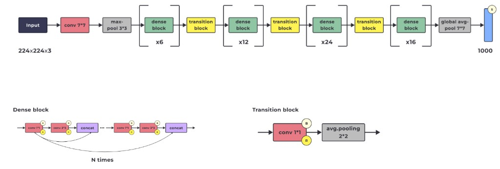

```
Input (224×224×3) → conv 7*7 → max-pool 3*3
                  → [dense block ×6] → transition block
                  → [dense block ×12] → transition block
                  → [dense block ×24] → transition block
                  → [dense block ×16] → global avg-pool 7*7 → FC 1000 [S]
```

> **[R]** — ReLU (функція активації), **[B]** — Batch Normalization (нормалізація батчу), **[S]** — Softmax (перетворення в ймовірності), **concat** — конкатенація (об'єднання тензорів по каналах)

**Dense block (N разів):**

```
input → conv 1*1 [R,B] → conv 3*3 [R,B] → concat ─→ conv 1*1 [R,B] → conv 3*3 [R,B] → concat → ...
  │                                          ↑          │                                  ↑
  └──────────────────────────────────────────┘          └──────────────────────────────────┘
                 dense connection                                   dense connection
```

Кожен наступний шар отримує **конкатенацію** виходів усіх попередніх шарів блоку.

**Transition block (між dense-блоками):**

```
conv 1*1 [B, R] → avg-pool 2*2
```

Зменшує розмірність між блоками.

**Основні особливості:**


| Особливість                          | Деталі                                                            |
| ------------------------------------ | ----------------------------------------------------------------- |
| **Dense connections**                | Кожен шар отримує вхід від УСІХ попередніх шарів блоку            |
| **Конкатенація**                     | Виходи попередніх шарів з'єднуються (а не додаються, як у ResNet) |
| **Менше параметрів**                 | Завдяки перевикористанню ознак — ефективніше, ніж ResNet          |
| **Dense blocks + Transition blocks** | Dense — витягують ознаки; Transition — зменшують розмірність      |
| **Global Average Pooling**           | У кінці мережі перед класифікацією                                |


**ResNet (add) vs DenseNet (concat):**

- **ResNet:** output = F(x) + x — додавання (може втрачати інформацію)
- **DenseNet:** output = [x, F₁(x), F₂(x, F₁(x)), ...] — конкатенація (зберігає всю інформацію)


#### Як працюють dense connections — детальніше

У звичайній CNN кожен шар бачить тільки результат попереднього:

```
Layer 1 → Layer 2 → Layer 3 → Layer 4
```

У DenseNet **кожен новий шар отримує результати всіх попередніх шарів** у цьому dense block:

```
Layer 1 ───────────────┐
  ↓                    │
Layer 2 ───────────┐   │
  ↓                │   │
Layer 3 ───────┐   │   │
  ↓            │   │   │
Layer 4 ←──────┴───┴───┘
```

І вони **не додаються** (як у ResNet), а **concatenate** — складаються поруч:

```
Layer 1 output: H×W×32
Layer 2 output: H×W×32
Layer 3 output: H×W×32
                        → concat → H×W×96  (32+32+32 = 96 каналів)
```

Тобто DenseNet **нарощує кількість каналів** у межах dense block.

> 📎 Аналогія: у звичайній мережі кожен аналітик отримує тільки висновок попереднього. У ResNet — новий висновок + старий сигнал. У DenseNet — **кожен новий аналітик отримує всі попередні нотатки від усіх людей**. Тому нічого важливого не губиться.


#### Що таке `×6`, `×12`, `×24`, `×16`?

Кількість повторів dense-layer усередині кожного dense block:

```
Dense block 1 → 6 layers
Dense block 2 → 12 layers
Dense block 3 → 24 layers
Dense block 4 → 16 layers
```

Разом: 6 + 12 + 24 + 16 = 58 dense layers + інші шари = **121 шар** у DenseNet-121.

#### Transition block — навіщо?

Проблема: усередині Dense block кількість каналів **постійно росте** через concatenation. Тому між dense blocks ставлять transition block:

```
56×56×512       (після dense block — багато каналів)
     ↓
1×1 Conv        зменшує кількість каналів
     ↓
56×56×256
     ↓
AvgPool 2×2     зменшує ширину і висоту
     ↓
28×28×256       (готово до наступного dense block)
```


#### Чому менше параметрів?

Кожен окремий шар створює **відносно небагато нових feature maps** (наприклад, лише 32 нові канали замість 256). Але він отримує старі feature maps через concatenation, тому не мусить «перевчати» ті самі ознаки знову. Це називається **feature reuse** (повторне використання ознак).

#### Що в кінці?

```
останній Dense block
     ↓
Global Average Pooling
     ↓
одне число на кожен канал
     ↓
Linear / FC → logits → Softmax
```

**Коли використовувати:** завдання з тонкими візуальними патернами, наприклад **аналіз медичних зображень**. DenseNet добре передає градієнт, повторно використовує ознаки та ефективно працює з обмеженими даними.

---


### 3.7. MobileNet (2017)

**Стаття:** [MobileNets: Efficient Convolutional Neural Networks for Mobile Vision Applications](тема_6/MobileNets.pdf) (Howard et al., 2017)

**Ключова особливість:** **Depthwise Separable Convolution** — розділення стандартної згортки на згортку по каналах + 1×1 згортку, що **значно зменшує** кількість параметрів і обчислень.

**Архітектура (високий рівень):**

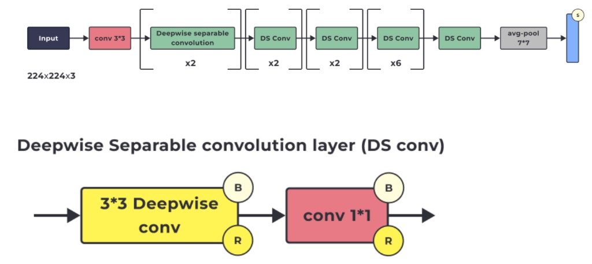

```
Input (224×224×3) → conv 3*3
                  → [DS Conv] ×2 → [DS Conv] ×2 → [DS Conv] ×2
                  → [DS Conv] ×2 → DS Conv → DS Conv
                  → avg-pool 7*7 → FC [S]
```

> **[B]** — Batch Normalization (нормалізація батчу), **[R]** — ReLU (функція активації), **[S]** — Softmax (перетворення в ймовірності)

**Depthwise Separable Convolution (DS Conv):**

```
input → 3*3 Depthwise conv [B, R] → conv 1*1 [B, R] → output
```


| Крок                   | Що робить                         | Деталі                                     |
| ---------------------- | --------------------------------- | ------------------------------------------ |
| **Depthwise conv 3×3** | Згортка окремо для кожного каналу | Кожен фільтр працює тільки з одним каналом |
| **Pointwise conv 1×1** | Лінійне комбінування каналів      | Об'єднує результати depthwise згортки      |


**Основні особливості:**


| Особливість                          | Деталі                                                         |
| ------------------------------------ | -------------------------------------------------------------- |
| **Depthwise Separable Conv**         | Розділення згортки на 2 етапи — значно менше параметрів        |
| **Width Multiplier**                 | Зменшує кількість каналів у всіх шарах — адаптація під ресурси |
| **Resolution Multiplier**            | Зменшує розмір вхідного зображення — менше обчислень           |
| **Pointwise 1×1 Conv**               | Змішує інформацію між каналами після depthwise згортки         |
| **Global Average Pooling + Softmax** | Фіксований вектор ознак → класифікація                         |


**Стандартна згортка vs Depthwise Separable:**


| Аспект                       | Стандартна conv   | Depthwise Separable conv |
| ---------------------------- | ----------------- | ------------------------ |
| Параметри (K×K, C_in, C_out) | K² × C_in × C_out | K² × C_in + C_in × C_out |
| Приклад: 3×3, 64→128         | 73 728            | 8 768 (~8.4× менше)      |


#### Як працює Depthwise Separable Convolution — детальніше

Головна ідея MobileNet: **не робити «дорогу» звичайну згортку одразу по всіх каналах**, а розділити її на 2 дешевші кроки.

**Звичайна convolution** бере всі канали разом — кожен фільтр працює одразу з усіма. Це обчислювально дорого.

**Крок 1 — Depthwise convolution:** обробити кожен канал **окремо**:

```
64×64×32 (вхід: 32 канали)

channel 1  → свій 3×3 kernel → channel 1 оброблений
channel 2  → свій 3×3 kernel → channel 2 оброблений
...
channel 32 → свій 3×3 kernel → channel 32 оброблений

64×64×32 (вихід: все ще 32 канали)
```

Depthwise добре аналізує **просторові патерни** (де ознака), але канали між собою ще не змішані.

**Крок 2 — Pointwise convolution (1×1):** змішати інформацію **між каналами**:

```
64×64×32
     ↓ 1×1 Conv (64 фільтри)
64×64×64
```

1×1 дивиться в одну spatial-позицію, але одразу на **всі канали** → створює нові комбінації.

```
Depthwise 3×3  → "де шукати ознаку" (spatial)
Pointwise 1×1  → "як змішати інформацію між каналами" (channel)
```

> 📎 Аналогія: 32 експерти. Звичайна convolution — усі 32 сідають разом і кожну проблему аналізують спільно. MobileNet: **Depthwise** — кожен спочатку аналізує свою частину самостійно. **Pointwise** — потім їхні висновки швидко об'єднуються в одну спільну картину. Менше хаосу й дешевше обчислювально.


#### Width Multiplier і Resolution Multiplier

**Width Multiplier** — регулює кількість каналів:

```
Width Multiplier = 1.0  →  128 каналів (повна модель)
Width Multiplier = 0.5  →   64 канали  (легша модель)
```

Менше каналів → менша й швидша модель.

**Resolution Multiplier** — регулює розмір вхідного зображення:

```
Resolution = 224×224  (стандарт)
Resolution = 160×160  (менше обчислень)
```

Менше пікселів → менше обчислень.

#### ⚠️ Поправка: bottleneck vs MobileNetV1

**MobileNetV1** (ця архітектура) використовує саме `Depthwise 3×3 → Pointwise 1×1`. **Bottleneck / inverted residual blocks** — це вже **MobileNetV2**:

```
MobileNetV1:  Depthwise + Pointwise
MobileNetV2:  Inverted residual + linear bottleneck
```


#### Повний шлях MobileNetV1

```
Image
  ↓
звичайний Conv 3×3
  ↓
Depthwise Conv 3×3 → Pointwise Conv 1×1
  ↓
ще багато таких DS-блоків
  ↓
Global Average Pooling
  ↓
FC → logits → Softmax
```

**Коли використовувати:** класифікація зображень **у реальному часі** на мобільних пристроях та інших ресурсообмежених платформах.

---


### 3.8. EfficientNet-B0 (2019)

**Стаття:** [EfficientNet: Rethinking Model Scaling for Convolutional Neural Networks](тема_6/EfficientNet-B0.pdf) (Tan & Le, 2019)

**Ключова особливість:** **Compound Scaling** — одночасне масштабування глибини, ширини та роздільної здатності для оптимального балансу ефективності й точності.

**Архітектура (високий рівень):**

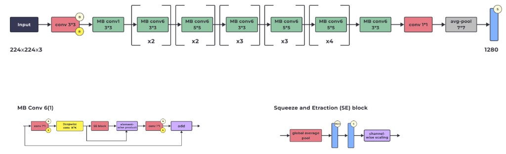

```
Input (224×224×3) → conv 3*3 [B, R]
                  → MB conv1 3*3 → [MB conv6 3*3] ×2 → [MB conv6 5*5] ×2
                  → [MB conv6 3*3] ×3 → [MB conv6 5*5] ×3
                  → [MB conv6 5*5] ×3 → [MB conv6 3*3] ×4
                  → conv 1*1 → avg-pool 7*7 → FC 1280 [S]
```

> **[B]** — Batch Normalization (нормалізація батчу), **[R]** — ReLU (функція активації), **[S]** — Softmax (перетворення в ймовірності), **(+)** — поелементне додавання (skip connection), **SE** — Squeeze-and-Excitation (блок перекалібровки каналів)

**MBConv block (Mobile Inverted Bottleneck Convolution):**

```
input → conv 1*1 [R] → Depthwise conv K*K → SE block → element-wise product → conv 1*1 [R] → (+) → output
                                                                                               ↑
input ────────────────────────────────────────────────────────────────────────────────────────→ ┘
                                              skip connection
```

**Squeeze-and-Excitation (SE) block:**

```
input → global average pool → FC (squeeze) [ReLU] → FC (excitation) [Sigmoid] → channel-wise scaling → output
```

**Основні особливості:**


| Особливість                      | Деталі                                                                        |
| -------------------------------- | ----------------------------------------------------------------------------- |
| **Compound Scaling**             | Одночасне масштабування глибини, ширини, роздільної здатності                 |
| **MBConv (Inverted Bottleneck)** | Спочатку кількість каналів збільшується, потім зменшується                    |
| **Depthwise convolution**        | Згортка окремо для кожного каналу — менше параметрів                          |
| **Squeeze-and-Excitation**       | Адаптивна перекалібровка ваг каналів — мережа «вчиться», які канали важливіші |
| **Pointwise conv 1×1**           | Лінійне комбінування каналів                                                  |
| **Сімейство B0–B7**              | B0 — найлегша/найшвидша; B7 — найточніша/найважча                             |


**Стандартний vs Інвертований ботлнек:**


| Bottleneck       | Потік каналів                       | Де використовується       |
| ---------------- | ----------------------------------- | ------------------------- |
| **Стандартний**  | Зменшення → Обчислення → Збільшення | ResNet                    |
| **Інвертований** | Збільшення → Обчислення → Зменшення | MobileNetV2, EfficientNet |


Інвертована структура зберігає **більше інформації** під час обчислень.

#### Compound Scaling — детальніше

Є три способи зробити модель потужнішою:

- **глибша** → більше шарів
- **ширша** → більше каналів
- **більша картинка** → вища resolution

Раніше часто збільшували щось одне. EfficientNet каже: краще збільшувати все **збалансовано**:

```
Не:   тільки 50 → 100 шарів

А:    трохи більше шарів
    + трохи більше каналів
    + трохи більша resolution
```

Це і є **compound scaling**.

#### MBConv — головний блок EfficientNet (детальніше)

MBConv = **Mobile Inverted Bottleneck Convolution**:

```
Input (мало каналів, напр. 32)
  │
  ├──────────── skip connection ──────────────┐
  ↓                                           │
1×1 Conv — розширити канали (32 → 192)        │
  ↓                                           │
Depthwise 3×3 або 5×5 (192 канали)            │
  ↓                                           │
Squeeze-and-Excitation                        │
  ↓                                           │
1×1 Conv — зменшити канали (192 → 32)         │
  ↓                                           │
ADD ←─────────────────────────────────────────┘
  ↓
Output (знову 32 канали)
```

Це **inverted** bottleneck, бо:

```
Звичайний bottleneck (ResNet):   багато → мало → багато
Inverted bottleneck (EfficientNet): мало → багато → мало
```


#### Що означає MBConv6?

`6` = **expansion ratio**. Якщо на вході 32 канали:

```
32 каналів
     ↓ ×6 (expansion)
192 канали  ← depthwise conv працює тут (у багатому просторі)
     ↓
32 канали   ← знову стиснення
```

Навіщо розширювати? Щоб depthwise convolution працювала в **більш багатому просторі ознак**.

#### Squeeze-and-Excitation (SE) — детальніше

SE block відповідає на питання: **які з каналів зараз важливіші** для цього конкретного зображення?

**Squeeze** — стиснути кожну feature map до одного числа:

```
192 карти ознак
     ↓ Global Average Pooling
192 числа
```

**Excitation** — маленька мережа створює ваги важливості:

```
192 числа
     ↓ FC → ReLU → FC → Sigmoid
192 коефіцієнти: [0.9, 0.1, 0.7, ...]
```

Потім кожну карту множимо на її коефіцієнт:

```
feature map 1 × 0.9   ← підсилити (важлива ознака)
feature map 2 × 0.1   ← приглушити (нерелевантна)
feature map 3 × 0.7   ← помірно важлива
```

Модель ніби каже: «ця ознака зараз важлива — підсилю, ця майже не потрібна — приглушу». Це називається **channel attention**.

> 📎 Аналогія: 192 експерти. Depthwise conv — кожен аналізує свою область. Pointwise conv — висновки комбінують. SE block — ще є керівник, який каже: «сьогодні експерт №17 дуже важливий — слухаємо його сильніше; експерт №42 зараз нерелевантний — зменшуємо його вплив».


#### B0, B1, ... B7

B0 — базова модель. Далі масштабують через compound scaling:

```
B0 → B1 → B2 → ... → B7
        ↑
 збільшують depth + width + resolution
```

Більші версії — точніші, але повільніші й важчі.

#### Skip connection в EfficientNet

Так, вона тут теж є — але тільки якщо форми входу й виходу **сумісні** (однакова кількість каналів і spatial розмір).

**Коли використовувати:** завдання, що потребують **високої точності та обчислювальної ефективності** одночасно — класифікація зображень (computer vision).

---


### 3.9. Порівняння архітектур CNN


#### Метрики Top-1 та Top-5


| Метрика            | Формула                                                    | Що означає                                           |
| ------------------ | ---------------------------------------------------------- | ---------------------------------------------------- |
| **Top-1 accuracy** | кількість правильно класифікованих / загальна кількість    | Правильний клас — **перший** у списку передбачень    |
| **Top-5 accuracy** | кількість, де правильний клас у топ-5 / загальна кількість | Правильний клас — **серед п'яти перших** передбачень |


#### Результати на ImageNet (базові версії моделей)

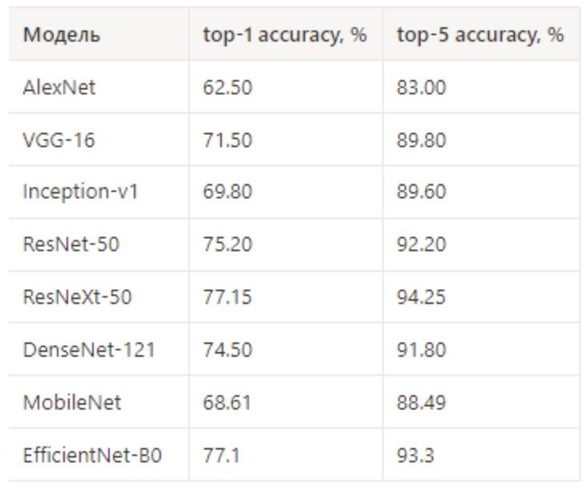


| Модель              | Рік  | Top-1 accuracy, % | Top-5 accuracy, % | Ключова ідея                       |
| ------------------- | ---- | ----------------- | ----------------- | ---------------------------------- |
| **AlexNet**         | 2012 | 62.50             | 83.00             | Перша глибока CNN                  |
| **VGG-16**          | 2014 | 71.50             | 89.80             | Тільки 3×3 згортки                 |
| **Inception-v1**    | 2014 | 69.80             | 89.60             | Паралельні згортки різних розмірів |
| **ResNet-50**       | 2015 | 75.20             | 92.20             | Skip connections                   |
| **ResNeXt-50**      | 2017 | 77.15             | 94.25             | Кардинальність (32 шляхи)          |
| **DenseNet-121**    | 2017 | 74.50             | 91.80             | Dense connections (конкатенація)   |
| **MobileNet**       | 2017 | 68.61             | 88.49             | Depthwise Separable conv           |
| **EfficientNet-B0** | 2019 | 77.10             | 93.30             | Compound Scaling + SE block        |


> **Зверніть увагу:** це **базові** версії моделей. Одна й та сама архітектура з більшою кількістю параметрів може мати значно кращі результати (наприклад, EfficientNet-B7 досягає ~84% Top-1).

> **SOTA (State-of-the-Art)** — найсучасніший підхід, що демонструє **найвищу продуктивність** за обраною метрикою. Це еталон, з яким порівнюють нові методи.
>
> ⚠️ SOTA завжди варто читати як: найкращий результат **на конкретний момент**, **на конкретному benchmark** і **за конкретною метрикою**. Наприклад, ResNet був SOTA у 2015 на ImageNet по Top-5 accuracy — але це давно не так. Модель може бути SOTA на ImageNet, але не на COCO. SOTA по точності ≠ SOTA по швидкості inference.


#### Підсумкова таблиця-шпаргалка архітектур CNN

Кожен рядок читається окремо — бачиш архітектуру і відразу розумієш її терміни:


| Архітектура      | Рік  | Ключова ідея                                        | Структура / терміни                            | Пояснення термінів                                                                                                                                                                                                                   |
| ---------------- | ---- | --------------------------------------------------- | ---------------------------------------------- | ------------------------------------------------------------------------------------------------------------------------------------------------------------------------------------------------------------------------------------ |
| **AlexNet**      | 2012 | Показала ефективність глибоких CNN для класифікації | Conv → ReLU → Pooling → FC, Dropout            | **Conv** = згортковий шар. **ReLU** = max(0,x), функція активації. **Pooling** = зменшення H/W карт ознак. **FC** = Fully Connected, повнозв'язний шар. **Dropout** = випадково вимикає нейрони під час training проти перенавчання. |
| **VGG-16**       | 2014 | Багато маленьких `3×3` згорток замість великих      | Блоки `Conv 3×3 → Conv 3×3 → Pool`             | `3×3` = розмір kernel. Маленькі kernels дають менше параметрів і дозволяють ставити кілька Conv підряд. **Pooling** стискає feature maps: `64×64 → 32×32`.                                                                           |
| **Inception-v1** | 2014 | Паралельні kernels різних розмірів                  | `1×1`, `3×3`, `5×5`, pooling → **concatenate** | **Concatenate** = склеїти канали поруч: `[32] + [64] → [96 каналів]`. `1×1 Conv` зменшує канали перед дорогими `3×3` і `5×5`.                                                                                                        |
| **ResNet-50**    | 2015 | **Skip connections** (residual)                     | Bottleneck: `1×1 → 3×3 → 1×1` + skip           | **Skip connection** = передає x напряму: `F(x) + x`. **Bottleneck** = стиснення каналів: `багато → мало → багато`.                                                                                                                   |
| **ResNeXt-50**   | 2017 | ResNet + паралельна обробка груп                    | Grouped conv, cardinality                      | **Grouped conv** = канали ділять на групи, кожна обробляється окремо. **Cardinality** = кількість груп (напр. 32).                                                                                                                   |
| **DenseNet-121** | 2017 | Кожен шар отримує feature maps від усіх попередніх  | Dense connections + concat + transition        | **Dense connections** = усі попередні feature maps → наступному шару. **Feature map** = матриця активацій, 1 channel = 1 feature map. **Transition block** = `1×1 Conv + AvgPool`, зменшує канали і розмір між dense blocks.         |
| **MobileNet**    | 2017 | Розділяє згортку на два дешевші кроки               | Depthwise + pointwise `1×1`                    | **Depthwise conv** = кожен канал окремо (без змішування). **Pointwise conv** = `1×1 Conv`, змішує канали й може змінити їх кількість.                                                                                                |
| **EfficientNet** | 2019 | Збалансоване масштабування                          | MBConv + SE + compound scaling                 | **MBConv** = inverted bottleneck: `мало → багато → мало`. **SE** = Squeeze-and-Excitation, визначає важливість каналів. **Compound scaling** = одночасне масштабування depth + width + resolution.                                   |


#### Додаткові терміни


| Термін          | Значення                                                                                          |
| --------------- | ------------------------------------------------------------------------------------------------- |
| **Feature map** | Одна матриця активацій після filter. Наприклад `64×64`. Стос із 32 таких матриць = `64×64×32`.    |
| **Channel**     | Один шар у тензорі = одна feature map на виході Conv.                                             |
| **GAP**         | **Global Average Pooling** — бере середнє по всій feature map → 1 число на канал.                 |
| **BN**          | **Batch Normalization** — нормалізує активації між шарами для стабільного навчання.               |
| **SOTA**        | **State of the Art** — найкращий результат на конкретному benchmark за певною метрикою.           |
| **COCO**        | **Common Objects in Context** — датасет для detection, segmentation (330K+ зображень, 80 класів). |


#### Найкоротше — різниця одним рядком

```
VGG         → багато 3×3
Inception   → parallel kernels + concat
ResNet      → skip connections
ResNeXt     → skip + grouped conv + cardinality
DenseNet    → всі попередні feature maps → concat
MobileNet   → depthwise + pointwise
EfficientNet → balanced scaling + MBConv + SE
```

---


## ЧАСТИНА 4. ПРАКТИКА — ЗНАЙОМСТВО З ДАНИМИ


### 🤔 Навіщо брати чужу модель? Хіба не простіше створити свою з нуля?

**Можна.** Але ось що це означає на практиці:

#### 1. Проблема даних

ResNet-18, яку ми будемо використовувати, навчалася на **ImageNet — 1.2 мільйона зображень, 1000 класів**.

У нас — **244 фото мурашок і бджіл**. Це в **5000 разів менше**.

Модель з нуля на 244 фото просто **не навчиться** нічого корисного — вона перенавчиться (запам'ятає конкретні картинки замість того, щоб зрозуміти закономірності).

#### 2. Час і ресурси


|                | Своя модель з нуля          | Transfer Learning                   |
| -------------- | --------------------------- | ----------------------------------- |
| Дані           | Потрібні мільйони зображень | Достатньо сотень                    |
| Час тренування | Дні/тижні на GPU            | 1–5 хвилин                          |
| Обладнання     | Кластер GPU ($$$)           | Звичайний ноутбук / Colab           |
| Якість         | ~50–60% на малих даних      | **93–95%** на тих самих малих даних |


#### 3. Що вже "знає" pretrained модель?

Перші шари ResNet вже навчилися розпізнавати **універсальні візуальні ознаки**, корисні для будь-яких зображень:

```
Шар 1-2:   краї, лінії, кути
Шар 3-5:   текстури, патерни
Шар 6-10:  частини об'єктів (очі, крила, лапки)
Шар 11+:   цілі об'єкти та їх комбінації
```

Ці знання **універсальні** — вони підходять і для мурашок, і для котів, і для рентгенівських знімків. Навіщо вчити це заново?

#### 4. Аналогія

> Уяви, що тобі треба навчитися розрізняти **два види грибів**:
>
> **Варіант А (з нуля):** Народитися заново, навчитися бачити, розрізняти кольори, форми, текстури — і лише потім вивчати гриби.
>
> **Варіант Б (transfer learning):** Ти вже вмієш бачити і розрізняти тисячі об'єктів. Тепер просто подивись на 100 фото грибів і зрозумій різницю.
>
> Transfer Learning — це **Варіант Б**.


#### 5. А як щодо катастрофічного забування?

При тренуванні з оновленням усіх ваг є ризик **катастрофічного забування** — втрати знань, здобутих на попередніх завданнях. Саме тому існують **два підходи**:


| Підхід                          | Що відбувається         | Ризик забування                               |
| ------------------------------- | ----------------------- | --------------------------------------------- |
| **Fine-tuning** (Крок 8)        | Оновлюємо **всі** ваги  | ⚠️ Є ризик — тому `lr=1e-05` (дуже маленький) |
| **Feature extraction** (Крок 9) | Оновлюємо **тільки FC** | ✅ Нульовий ризик — базові знання заморожені   |


Маленький `lr` при fine-tuning — це як сказати моделі: *"Ти вже майже все знаєш, просто трішки підлаштуйся під нову задачу, але не забувай основне"*.

---


### Крок 1. Постановка задачі

Ми будемо класифікувати зображення **мурашок (ants)** і **бджіл (bees)**:

- **Навчальний набір:** ~120 зображень кожного класу (244 разом)
- **Тестовий набір:** ~75 зображень кожного класу (153 разом)

> **Важливо:** це дуже малий набір даних для якісного узагальнення при навчанні з нуля. Саме тому ми використовуємо **трансферне навчання** — і навіть на такому обсязі отримаємо хороші результати.


### Крок 2. Імпорт бібліотек

```python
import torch                                    # Основний фреймворк: тензори, GPU, автоградієнти
import torch.nn as nn                           # Шари мережі (Linear, Conv2d), функції втрат
import torch.optim as optim                     # Оптимізатори (SGD, Adam) для оновлення ваг
from torch.optim import lr_scheduler            # Планувальник: зменшує learning rate за розкладом
import torch.backends.cudnn as cudnn            # CUDA бекенд для оптимізації обчислень на GPU
import numpy as np                              # Масиви та математичні операції
import torchvision                              # Інструменти для роботи із зображеннями
from torchvision import datasets, models, transforms  # Датасети, pretrained моделі, аугментації
import matplotlib.pyplot as plt                 # Бібліотека для побудови графіків і відображення зображень
import time                                     # Вимірювання часу тренування
import os                                       # Робота з файловою системою (шляхи, папки)
from PIL import Image                           # Бібліотека для завантаження та обробки зображень
from tempfile import TemporaryDirectory         # Тимчасова папка для збереження чекпоінтів

cudnn.benchmark = True   # Автотюнер CUDA: знаходить найшвидший алгоритм для вашого GPU

plt.ion()                # Інтерактивний режим matplotlib: графіки оновлюються без блокування коду

import warnings
warnings.filterwarnings('ignore')  # Приховати попередження (для чистішого виводу)
```

> **Очікуваний результат:** жодного виводу — це лише імпорт бібліотек. Якщо виникає помилка `ModuleNotFoundError`, потрібно встановити відповідний пакет (`pip install torch torchvision matplotlib`).


| Рядок                                                  | Що робить                             | Навіщо потрібно                               |
| ------------------------------------------------------ | ------------------------------------- | --------------------------------------------- |
| `import torch`                                         | Основний фреймворк глибокого навчання | Тензори, автоградієнти, GPU-підтримка         |
| `import torch.nn as nn`                                | Модуль нейронних мереж                | Шари (Linear, Conv2d), функції втрат          |
| `import torch.optim as optim`                          | Оптимізатори                          | SGD, Adam — алгоритми оновлення ваг           |
| `from torch.optim import lr_scheduler`                 | Планувальник learning rate            | Зменшує lr під час навчання за розкладом      |
| `import torch.backends.cudnn as cudnn`                 | CUDA DNN бекенд                       | Оптимізація обчислень на GPU                  |
| `from torchvision import datasets, models, transforms` | Інструменти для зображень             | Датасети, претреновані моделі, аугментації    |
| `from tempfile import TemporaryDirectory`              | Тимчасова директорія                  | Збереження чекпоінтів моделі під час навчання |
| `cudnn.benchmark = True`                               | Автотюнер CUDA                        | Знаходить найкращий алгоритм для вашого GPU   |
| `plt.ion()`                                            | Інтерактивний режим matplotlib        | Графіки оновлюються без блокування коду       |


---


### Крок 3. Визначення аугментацій

**Аугментації (augmentations)** — штучні зміни зображень під час тренування. У нас лише 244 фото — без аугментацій модель може «завчити» їх напам'ять (перенавчання). Аугментації створюють варіації: те саме фото кожну епоху виглядає трохи інакше (обрізане інакше, віддзеркалене чи ні), тому модель вчить **патерни**, а не конкретні пікселі. Застосовуються **тільки до train** — на val оцінка має бути стабільною.

> 📎 Аналогія: вчитель показує ту саму задачу, але щоразу трохи змінює числа. Студент вчиться розв'язувати принцип, а не запам'ятовує конкретну відповідь.

```python
data_transforms = {
    'train': transforms.Compose([          # Ланцюжок трансформацій для тренувальних даних:
        transforms.RandomResizedCrop(224),  # Випадково обрізає і масштабує до 224×224 (аугментація)
        transforms.RandomHorizontalFlip(), # Випадково віддзеркалює горизонтально (аугментація)
        transforms.ToTensor(),             # PIL Image → тензор з діапазоном [0, 1]
        transforms.Normalize(              # Нормалізація за статистиками ImageNet:
            [0.485, 0.456, 0.406],         #   mean для R, G, B каналів
            [0.229, 0.224, 0.225])         #   std для R, G, B каналів
    ]),
    'val': transforms.Compose([            # Ланцюжок трансформацій для валідаційних даних:
        transforms.Resize(256),            # Масштабує менший бік до 256 (без випадковості!)
        transforms.CenterCrop(224),        # Вирізає центральну частину 224×224
        transforms.ToTensor(),             # PIL Image → тензор [0, 1]
        transforms.Normalize(              # Та сама нормалізація ImageNet
            [0.485, 0.456, 0.406],
            [0.229, 0.224, 0.225])
    ]),
}
```

> **Очікуваний результат:** словник з двома ключами (`'train'`, `'val'`), кожен містить pipeline трансформацій. Жодного виводу — це лише визначення. Аугментації для train додають варіативність (модель бачить різні версії одного зображення). Для val — фіксовані трансформації, щоб результат був стабільним.


| Трансформація            | Що робить                                 | Train / Val |
| ------------------------ | ----------------------------------------- | ----------- |
| `RandomResizedCrop(224)` | Випадково обрізає та масштабує до 224×224 | Train       |
| `RandomHorizontalFlip()` | Випадкове горизонтальне відображення      | Train       |
| `Resize(256)`            | Масштабує менший бік до 256               | Val         |
| `CenterCrop(224)`        | Вирізає центральну частину 224×224        | Val         |
| `ToTensor()`             | Перетворює PIL Image → тензор [0, 1]      | Обидва      |
| `Normalize(mean, std)`   | Нормалізує за статистиками ImageNet       | Обидва      |


**Чому розмір 224×224?** Це конвенція ML-спільноти, прийнята для стандартизації попередньої обробки зображень. Більшість претренованих моделей очікують саме такий розмір вхідних даних.

**Чому** `mean=[0.485, 0.456, 0.406]` **і** `std=[0.229, 0.224, 0.225]`**?** Це **статистики набору ImageNet** — середнє та стандартне відхилення по кожному каналу (R, G, B). Оскільки ми використовуємо модель, навчену на ImageNet, ми підготовлюємо наші дані так, щоб вони були **максимально схожими** на зображення з ImageNet.

**Формула нормалізації:** для кожного каналу:

```
output[channel] = (input[channel] - mean[channel]) / std[channel]
```

---


### Крок 4. Створення Dataset та DataLoader

```python
data_dir = '.'  # Шлях до папки з даними (train/ і val/ лежать прямо в тема_6/)

# Створюємо Dataset для train і val:
# ImageFolder автоматично визначає класи за назвами підпапок (ants/, bees/)
image_datasets = {x: datasets.ImageFolder(os.path.join(data_dir, x),  # шлях: data_dir/train або data_dir/val
                                          data_transforms[x])         # застосовуємо відповідні трансформації
                  for x in ['train', 'val']}
```

> **Очікуваний результат:** словник з двома Dataset-об'єктами. Кожне зображення буде автоматично завантажуватись, трансформуватись і мати мітку (0 = ants, 1 = bees).


| Рядок                                   | Що робить                          | Деталі                                          |
| --------------------------------------- | ---------------------------------- | ----------------------------------------------- |
| `datasets.ImageFolder(path, transform)` | Створює Dataset із структури папок | Кожна підпапка = один клас. Назва папки → мітка |


```python
# DataLoader видає дані батчами (пачками) під час тренування:
dataloaders = {x: torch.utils.data.DataLoader(
    image_datasets[x],   # Dataset, з якого брати дані
    batch_size=4,         # По 4 зображення за раз
    shuffle=True,         # Перемішувати дані кожну епоху (для кращого навчання)
    num_workers=4)        # 4 паралельних потоки для завантаження (швидше)
    for x in ['train', 'val']}
```

> **Очікуваний результат:** словник з двома DataLoader-об'єктами. Кожен ітерує по даних батчами по 4 зображення. Один батч = тензор `[4, 3, 224, 224]` (4 зображення × 3 канали × 224×224 пікселів) + тензор міток `[4]`.


| Параметр      | Значення | Що означає                                  |
| ------------- | -------- | ------------------------------------------- |
| `batch_size`  | 4        | Обробляємо по 4 зображення за раз           |
| `shuffle`     | True     | Перемішуємо дані кожну епоху                |
| `num_workers` | 4        | 4 паралельних потоки для завантаження даних |


```python
dataset_sizes = {x: len(image_datasets[x]) for x in ['train', 'val']}  # Кількість зображень
class_names = image_datasets['train'].classes  # Назви класів (з назв папок)

print(dataset_sizes)  # {'train': 244, 'val': 153}
print(class_names)    # ['ants', 'bees']

# Вибираємо пристрій: GPU (якщо доступний) або CPU
device = torch.device("cuda:0" if torch.cuda.is_available() else "cpu")
```

> **Очікуваний результат:**
>
> ```
> {'train': 244, 'val': 153}
> ['ants', 'bees']
> ```
>
> **Інтерпретація:** 244 зображення для тренування, 153 для валідації. Два класи — мурашки та бджоли. Це дуже малий датасет, тому трансферне навчання тут критично важливе.

---


### Крок 5. Візуалізація даних

```python
def imshow(inp, title=None):
    """Відображає тензор як зображення, скасовуючи нормалізацію ImageNet."""
    inp = inp.numpy().transpose((1, 2, 0))       # Тензор [C,H,W] → масив [H,W,C] для matplotlib
    mean = np.array([0.485, 0.456, 0.406])        # Середнє ImageNet (R, G, B)
    std = np.array([0.229, 0.224, 0.225])          # Стд. відхилення ImageNet (R, G, B)
    inp = std * inp + mean                         # Зворотна нормалізація: повертаємо оригінальні кольори
    inp = np.clip(inp, 0, 1)                       # Обмежуємо [0, 1] — запобігаємо артефактам
    plt.imshow(inp)                                # Відображаємо зображення
    if title is not None:
        plt.title(title)                           # Додаємо заголовок (назви класів)
    plt.pause(0.001)                               # Коротка пауза для оновлення графіка
```

> **Очікуваний результат:** визначення функції (без виводу). Функція потрібна, бо наші зображення **нормалізовані** — без зворотної нормалізації вони виглядатимуть як кольоровий шум.


| Рядок                              | Що робить                          | Навіщо                                   |
| ---------------------------------- | ---------------------------------- | ---------------------------------------- |
| `inp.numpy().transpose((1, 2, 0))` | Тензор [C,H,W] → масив [H,W,C]     | matplotlib очікує формат [H,W,C]         |
| `std * inp + mean`                 | Зворотна нормалізація              | Повертаємо оригінальні значення пікселів |
| `np.clip(inp, 0, 1)`               | Обмежує значення діапазоном [0, 1] | Запобігає артефактам при відображенні    |


---


#### 📌 Що таке mean і std у цьому коді?

Це **стандартні статистики ImageNet** — середнє (`mean`) і стандартне відхилення (`std`) піксельних значень окремо для трьох RGB-каналів:

```python
mean = [0.485, 0.456, 0.406]
#        R      G      B

std  = [0.229, 0.224, 0.225]
#        R      G      B
```

Ці числа були обчислені за великою кількістю зображень ImageNet після приведення значень пікселів до діапазону `[0, 1]`.

**⚠️ Головне: ці шість чисел не модель сама придумала і не цей код їх обчислює. Це заздалегідь відомі mean/std для ImageNet, які використовують тому, що pretrained-модель навчалася з такою нормалізацією.**

#### Як працює нормалізація?

Під час підготовки картинки для pretrained-моделі виконується **нормалізація** — окремо для кожного каналу:

> x_norm = (x − mean) / std

Наприклад, для червоного каналу:

```
R pixel = 0.70

(0.70 − 0.485) / 0.229 ≈ 0.94
```


#### Навіщо imshow робить зворотну операцію?

Функція `imshow()` робить **зворотну нормалізацію**:

```python
inp = std * inp + mean
```

тобто:

> x = x_norm · std + mean

Навіщо? Бо tensor перед цим був нормалізований для нейромережі, а `imshow` хоче показати картинку в **нормальному вигляді** — з оригінальними кольорами.

А `np.clip(inp, 0, 1)` просто гарантує, що після зворотного перетворення значення не вилізуть за допустимий для відображення діапазон `[0, 1]`.

#### Повний цикл перетворення

```
ОРИГІНАЛЬНА КАРТИНКА
RGB values [0...1]
        ↓ Normalize
  (x − ImageNet mean) / ImageNet std
        ↓
нормалізований tensor → його отримує pretrained CNN

коли хочемо ПОКАЗАТИ картинку:

нормалізований tensor
        ↓
  x · std + mean
        ↓
  RGB [0...1]
        ↓
  plt.imshow()
```

---

```python
inputs, classes = next(iter(dataloaders['train']))    # Беремо один батч: 4 зображення + 4 мітки
out = torchvision.utils.make_grid(inputs)             # Об'єднуємо 4 зображення в одну сітку
imshow(out, title=[class_names[x] for x in classes])  # Відображаємо з підписами класів
```

> **Очікуваний результат:** сітка з 4 зображень мурашок та/або бджіл з підписами. Кожного разу зображення будуть різними (бо `shuffle=True` і аугментації випадкові). Це дозволяє візуально перевірити, що дані завантажені правильно.


| Рядок                                 | Що робить                                  |
| ------------------------------------- | ------------------------------------------ |
| `next(iter(dataloaders['train']))`    | Отримує один батч (4 зображення + 4 мітки) |
| `torchvision.utils.make_grid(inputs)` | Об'єднує зображення батчу в одну сітку     |
| `imshow(out, title=...)`              | Відображає сітку з підписами класів        |


**Виведення:**

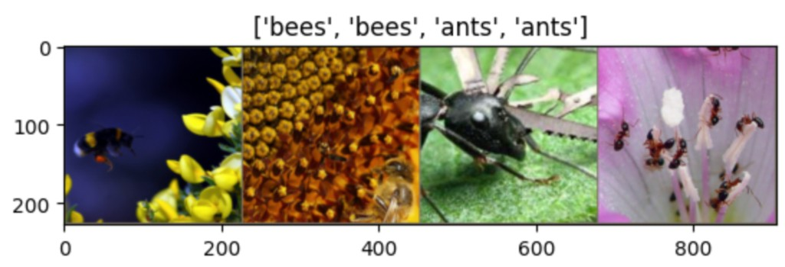

---


## ЧАСТИНА 5. ТРЕНУВАННЯ ТА ВАЛІДАЦІЯ МОДЕЛІ


### Крок 6. Функція тренування

> **Підхід:** відстежуємо точність на валідації кожну епоху і зберігаємо модель з **найвищою** точністю. Рекомендований метод збереження — `torch.save(model.state_dict())`.

```python
def train_model(model, criterion, optimizer, scheduler, num_epochs=25):
    since = time.time()                          # Запам'ятовуємо час початку

    with TemporaryDirectory() as tempdir:        # Створюємо тимчасову папку для чекпоінтів
        best_model_params_path = os.path.join(tempdir, 'best_model_params.pt')

        torch.save(model.state_dict(), best_model_params_path)  # Зберігаємо початкові ваги
        best_acc = 0.0                           # Найкраща точність на валідації (поки 0)

        for epoch in range(num_epochs):          # Цикл по епохах
            print(f'Epoch {epoch+1}/{num_epochs}')
            print('-' * 10)

            for phase in ['train', 'val']:       # Кожна епоха: спочатку train, потім val
                if phase == 'train':
                    model.train()                # Режим тренування: BatchNorm і Dropout активні
                else:
                    model.eval()                 # Режим оцінки: BatchNorm і Dropout вимкнені

                running_loss = 0.0               # Накопичувач loss за епоху
                running_corrects = 0             # Накопичувач правильних передбачень

                for inputs, labels in dataloaders[phase]:  # Цикл по батчах
                    inputs = inputs.to(device)   # Переносимо зображення на GPU/CPU
                    labels = labels.to(device)   # Переносимо мітки на GPU/CPU

                    optimizer.zero_grad()        # Обнулюємо градієнти (інакше накопичуються!)

                    with torch.set_grad_enabled(phase == 'train'):  # Градієнти тільки для train
                        outputs = model(inputs)              # Forward pass: зображення → logits
                        _, preds = torch.max(outputs, 1)     # Передбачення: клас з найвищим logit
                        loss = criterion(outputs, labels)    # Обчислюємо loss (CrossEntropy)

                        if phase == 'train':     # Тільки для тренування:
                            loss.backward()      #   Backpropagation: обчислюємо градієнти
                            optimizer.step()     #   Оновлюємо ваги на основі градієнтів

                    running_loss += loss.item() * inputs.size(0)      # Додаємо loss за батч
                    running_corrects += torch.sum(preds == labels.data)  # Рахуємо правильні

                epoch_loss = running_loss / dataset_sizes[phase]          # Середній loss за епоху
                epoch_acc = running_corrects.double() / dataset_sizes[phase]  # Точність за епоху

                print(f'{phase} Loss: {epoch_loss:.4f} Acc: {epoch_acc:.4f}')

                if phase == 'val' and epoch_acc > best_acc:  # Якщо нова найкраща точність на val:
                    best_acc = epoch_acc                      #   оновлюємо найкращу точність
                    torch.save(model.state_dict(), best_model_params_path)  # зберігаємо ваги

            print()

        time_elapsed = time.time() - since       # Скільки часу минуло
        print(f'Training complete in {time_elapsed // 60:.0f}m {time_elapsed % 60:.0f}s')
        print(f'Best val Acc: {best_acc:4f}')

        model.load_state_dict(torch.load(best_model_params_path))  # Завантажуємо найкращі ваги
    return model                                 # Повертаємо модель з найкращою точністю
```

> **Очікуваний результат (при виклику):** для кожної епохи виводиться train Loss/Acc та val Loss/Acc. В кінці — загальний час і найкращу точність на валідації.
>
> **Як інтерпретувати:**
>
> - **Loss зменшується** → модель навчається (добре)
> - **train Acc росте, val Acc росте** → модель узагальнює (добре)
> - **train Acc росте, val Acc падає** → перенавчання (погано — модель «завчила» тренувальні дані)
> - **Best val Acc** — фінальна метрика якості моделі

**Ключові елементи функції:**


| Елемент                                    | Що робить                                 | Навіщо                                                  |
| ------------------------------------------ | ----------------------------------------- | ------------------------------------------------------- |
| `TemporaryDirectory()`                     | Створює тимчасову директорію              | Зберігає чекпоінти моделі, видаляється після завершення |
| `model.train()` / `model.eval()`           | Перемикає режим моделі                    | Train: Dropout + BatchNorm активні; Eval: деактивовані  |
| `torch.set_grad_enabled(phase == 'train')` | Контролює обчислення градієнтів           | Градієнти потрібні тільки при тренуванні                |
| `optimizer.zero_grad()`                    | Обнулює градієнти                         | Без цього градієнти накопичуються з попередніх батчів   |
| `torch.max(outputs, 1)`                    | Передбачення: клас з найвищою ймовірністю | `_` — значення, `preds` — індекси класів                |
| `loss.item() * inputs.size(0)`             | Сумарний loss за батч                     | `loss.item()` — середній loss; множимо на розмір батчу  |
| `torch.save(model.state_dict(), ...)`      | Зберігає найкращу модель                  | Зберігаємо тільки якщо точність на val покращилась      |
| `model.load_state_dict(...)`               | Завантажує найкращі ваги                  | Повертаємо модель з найвищою точністю на val            |


---


### Крок 7. Функція візуалізації результатів

```python
def visualize_model(model, num_images=6):
    was_training = model.training        # Запам'ятовуємо поточний режим (train чи eval)
    model.eval()                         # Переводимо в режим оцінки
    images_so_far = 0
    fig = plt.figure()

    with torch.no_grad():               # Вимикаємо градієнти (економимо пам'ять)
        for i, (inputs, labels) in enumerate(dataloaders['val']):  # Беремо валідаційні дані
            inputs = inputs.to(device)   # Переносимо на GPU/CPU
            labels = labels.to(device)

            outputs = model(inputs)              # Forward pass: зображення → logits
            _, preds = torch.max(outputs, 1)     # Передбачення: клас з найвищим logit

            for j in range(inputs.size()[0]):    # Для кожного зображення в батчі:
                images_so_far += 1
                ax = plt.subplot(num_images//2, 2, images_so_far)  # Розміщуємо на сітці
                ax.axis('off')                   # Прибираємо осі
                ax.set_title(f'predicted: {class_names[preds[j]]}')  # Підпис: передбачений клас
                imshow(inputs.cpu().data[j])     # Відображаємо зображення

                if images_so_far == num_images:  # Показали достатньо — зупиняємось
                    model.train(mode=was_training)  # Повертаємо попередній режим
                    return
        model.train(mode=was_training)
```

> **Очікуваний результат:** сітка з 6 валідаційних зображень, кожне з підписом `predicted: ants` або `predicted: bees`. Це дозволяє візуально перевірити, чи модель правильно класифікує. Якщо бачимо неправильні підписи — модель помиляється на цих прикладах.


| Рядок                            | Що робить                                              |
| -------------------------------- | ------------------------------------------------------ |
| `was_training = model.training`  | Запам'ятовує поточний режим моделі                     |
| `model.eval()`                   | Переводить у режим оцінки (вимикає Dropout, BatchNorm) |
| `torch.no_grad()`                | Вимикає обчислення градієнтів → менше пам'яті          |
| `model.train(mode=was_training)` | Повертає попередній режим моделі                       |


---


## ЧАСТИНА 6. ПІДХОДИ ДО ТРАНСФЕРНОГО НАВЧАННЯ


### Порівняння двох підходів


| Аспект                              | Навчання всіх ваг                          | Заморожування ваг (тільки класифікатор) |
| ----------------------------------- | ------------------------------------------ | --------------------------------------- |
| **Що тренуємо**                     | Всі шари: згорткові + класифікаційний      | Тільки останній FC-шар                  |
| **Гнучкість**                       | Висока — модель адаптується до нових ознак | Обмежена — початкові ознаки незмінні    |
| **Дані**                            | Потрібно більше                            | Працює з малими наборами                |
| **Швидкість навчання**              | Повільніше                                 | Швидше                                  |
| **Ризик перенавчання**              | Вищий                                      | Нижчий                                  |
| **Ризик катастрофічного забування** | Так                                        | Ні                                      |
| **Найкраще підходить**              | Великі датасети, інший домен               | Малі датасети, схожий домен             |


### Катастрофічне забування (Catastrophic Forgetting)

> При навчанні нейронної мережі на нових даних вона може **забути** попередні знання. Ваги переструктуруються для нових завдань, і модель втрачає здатність розв'язувати попередні.

**Методи боротьби:**

- Додавання невеликої кількості даних попередніх задач під час навчання
- Регуляризація моделі
- Збереження ваг (заморожування шарів)

---


### Крок 8. Підхід 1 — Навчання всіх ваг моделі

**Крок 8.1. Завантаження претренованої моделі:**

```python
# Завантажуємо ResNet-18 з вагами, навченими на ImageNet (1000 класів, >1M зображень)
model_ft = models.resnet18(weights='IMAGENET1K_V1')
```

> **Очікуваний результат:** завантажується pretrained модель. Може з'явитися повідомлення про завантаження ваг. Модель вже «знає» базові візуальні ознаки (краї, текстури, форми) з ImageNet.


| Параметр                  | Значення                  | Що означає                                                   |
| ------------------------- | ------------------------- | ------------------------------------------------------------ |
| `models.resnet18`         | ResNet-18 (18 шарів)      | Невелика версія ResNet — підходить для малого обсягу даних   |
| `weights='IMAGENET1K_V1'` | Ваги, навчені на ImageNet | 1000 класів, >1M зображень — модель вже «знає» базові ознаки |


**Крок 8.2. Заміна останнього шару:**

```python
num_ftrs = model_ft.fc.in_features   # Дізнаємось кількість входів останнього FC-шару (512 для ResNet-18)
model_ft.fc = nn.Linear(num_ftrs, 2) # Замінюємо FC: 512 → 2 (замість 1000 класів ImageNet — 2: ants, bees)
```

> **Очікуваний результат:** останній шар моделі замінено. Тепер модель видає 2 logits замість 1000. Нові ваги цього шару — випадкові (їх треба навчити).


| Рядок                     | Що робить                                  | Навіщо                                              |
| ------------------------- | ------------------------------------------ | --------------------------------------------------- |
| `model_ft.fc.in_features` | Кількість вхідних ознак останнього FC-шару | ResNet-18: 512                                      |
| `nn.Linear(num_ftrs, 2)`  | Новий FC-шар: 512 → 2                      | Замість 1000 класів ImageNet — 2 класи (ants, bees) |


**Крок 8.3. Переведення на пристрій:**

```python
model_ft = model_ft.to(device)  # Переносимо модель на GPU (або CPU, якщо GPU немає)
```

**Крок 8.4. Визначення loss та оптимізатора:**

```python
criterion = nn.CrossEntropyLoss()                    # Функція втрат для класифікації
optimizer_ft = optim.Adam(model_ft.parameters(),     # Оптимізуємо ВСІ параметри моделі
                          lr=1e-05)                   # Маленький lr: обережно оновлюємо pretrained ваги
```

> **Очікуваний результат:** визначено loss і оптимізатор (без виводу). `model_ft.parameters()` — ключовий момент: оптимізуються **всі** ваги — і згорткові (вже навчені), і новий FC-шар.


| Елемент                 | Значення                 | Деталі                                                  |
| ----------------------- | ------------------------ | ------------------------------------------------------- |
| `CrossEntropyLoss`      | Функція втрат            | Для багатокласової класифікації (працює і для бінарної) |
| `model_ft.parameters()` | **Всі** параметри моделі | Оптимізуються ваги всіх шарів — і згорткових, і FC      |
| `lr=1e-05`              | Learning rate 0.00001    | Маленький lr — обережно оновлюємо претреновані ваги     |


> **Зверніть увагу:** `model_ft.parameters()` означає, що оптимізуються **всі** параметри моделі — і згорткові шари, і класифікатор.

**Крок 8.5. Scheduler (планувальник learning rate):**

```python
exp_lr_scheduler = lr_scheduler.StepLR(optimizer_ft,   # Планувальник для оптимізатора
                                        step_size=7,    # Кожні 7 епох —
                                        gamma=0.1)      # — множимо lr на 0.1 (зменшуємо в 10 разів)
```

> **Очікуваний результат:** визначено scheduler (без виводу). Кожні 7 епох learning rate автоматично зменшується: `1e-05 → 1e-06 → ...` — це допомагає моделі спочатку швидко вчитися, а потім «тонко налаштовуватися».


| Елемент       | Значення      | Деталі                               |
| ------------- | ------------- | ------------------------------------ |
| `StepLR`      | Тип scheduler | Зменшує lr через фіксовані інтервали |
| `step_size=7` | Інтервал      | Кожні 7 епох                         |
| `gamma=0.1`   | Множник       | lr × 0.1 (зменшення в 10 разів)      |


#### Як працює StepLR?

`StepLR` — це планувальник, який зменшує learning rate за **фіксованим розкладом**. Кожні `step_size` епох learning rate множиться на `gamma`:

```
lr_new = lr_current × gamma
```

**Приклад:** якщо `lr = 1e-05`, `step_size = 7`, `gamma = 0.1`:


| Епохи | Learning rate |
| ----- | ------------- |
| 1–7   | 1e-05         |
| 8–14  | 1e-06 (× 0.1) |
| 15–21 | 1e-07 (× 0.1) |
| …     | …             |


**Навіщо це потрібно?**

На початку навчання великий lr допомагає швидко рухатись у правильному напрямку. Але ближче до мінімуму loss великий крок може «перестрибувати» оптимум. `StepLR` автоматично зменшує крок, щоб модель могла «допрацювати» деталі:

```
Великий lr → швидке навчання → StepLR зменшує lr → точне донавчання
```

**Як використовується у циклі навчання:**

Після кожної епохи (після тренування та валідації) викликаємо `scheduler.step()` — без аргументів. Scheduler сам рахує епохи і зменшує lr, коли лічильник досягає `step_size`.

**Крок 8.6. Тренування:**

```python
model_ft = train_model(model_ft, criterion, optimizer_ft, exp_lr_scheduler,
                       num_epochs=5)  # Тренуємо 5 епох з усіма вагами
```

**Результат:**

```
Epoch 1/5 — train Acc: 0.8607, val Acc: 0.9216
Epoch 2/5 — train Acc: 0.8730, val Acc: 0.9216
Epoch 3/5 — train Acc: 0.8484, val Acc: 0.9150
Epoch 4/5 — train Acc: 0.8730, val Acc: 0.9216
Epoch 5/5 — train Acc: 0.8648, val Acc: 0.9281

Training complete in 2m 4s
Best val Acc: 0.9281
```

> **Інтерпретація:** точність на валідації ~92.8%. Тренування тривало 2 хвилини. train Acc коливається навколо 86% — модель обережно оновлює pretrained ваги (lr дуже маленький). val Acc стабільно ~92% — модель узагальнює добре, перенавчання немає.

---


### Крок 9. Підхід 2 — Навчання тільки класифікаційного шару

**Крок 9.1. Завантаження претренованої моделі:**

```python
# Завантажуємо ту саму pretrained ResNet-18
model_conv = torchvision.models.resnet18(weights='IMAGENET1K_V1')
```

**Крок 9.2. Заморожування всіх шарів:**

```python
# Вимикаємо градієнти для ВСІХ параметрів — ваги не оновлюватимуться
for param in model_conv.parameters():
    param.requires_grad = False  # Цей параметр "заморожений"
```

> **Очікуваний результат:** без виводу. Усі ~11M параметрів ResNet-18 тепер заморожені. Вони зберігають знання з ImageNet і не змінюватимуться під час тренування.


| Рядок                         | Що робить                                   | Навіщо                                            |
| ----------------------------- | ------------------------------------------- | ------------------------------------------------- |
| `param.requires_grad = False` | Вимикає обчислення градієнтів для параметра | Ваги шару не оновлюватимуться — шар «заморожений» |


> **Зверніть увагу:** зараз модель ще **не має** останнього класифікаційного шару. Обрахунок градієнта вимкнено тільки для шарів, що виокремлюють ознаки.

**Крок 9.3. Додавання нового класифікаційного шару:**

```python
num_ftrs = model_conv.fc.in_features     # 512 входів (як і раніше)
model_conv.fc = nn.Linear(num_ftrs, 2)   # Новий FC-шар: 512 → 2
```

> Новостворені шари **за замовчуванням** мають `requires_grad = True` — тобто тільки цей шар буде навчатися. Усі інші залишаються замороженими.

**Крок 9.4. Налаштування та оптимізатор:**

```python
model_conv = model_conv.to(device)           # Переносимо на GPU/CPU

criterion = nn.CrossEntropyLoss()            # Та сама функція втрат

optimizer_conv = optim.Adam(
    model_conv.fc.parameters(),              # Оптимізуємо ТІЛЬКИ параметри FC-шару (не всієї моделі!)
    lr=1e-03)                                # Більший lr: новий шар навчається з нуля
```

> **Очікуваний результат:** без виводу. Ключова відмінність від підходу 1: `model_conv.fc.parameters()` замість `model_conv.parameters()` — оптимізуються лише ~1K параметрів (512×2 ваг + 2 bias) замість ~11M.


| Елемент                      | Значення                 | Ключова відмінність                                                   |
| ---------------------------- | ------------------------ | --------------------------------------------------------------------- |
| `model_conv.fc.parameters()` | Тільки параметри FC-шару | Оптимізуються тільки ваги класифікатора (не всієї моделі!)            |
| `lr=1e-03`                   | Learning rate 0.001      | Більший lr — новий шар навчається з нуля, потрібні сильніші оновлення |


> **Ключова відмінність:** в оптимізатор передаємо `model_conv.fc.parameters()` — **тільки** параметри повнозв'язного шару, а не `model_conv.parameters()` (всі параметри).

**Крок 9.5. Scheduler та тренування:**

```python
exp_lr_scheduler_conv = lr_scheduler.StepLR(optimizer_conv,  # Планувальник для FC-оптимізатора
                                             step_size=7,     # Кожні 7 епох —
                                             gamma=0.1)       # — множимо lr на 0.1

model_conv = train_model(model_conv, criterion, optimizer_conv, exp_lr_scheduler_conv,
                         num_epochs=5)  # Тренуємо 5 епох (тільки FC-шар)
```

**Результат:**

```
Epoch 1/5 — train Acc: 0.6762, val Acc: 0.8301
Epoch 2/5 — train Acc: 0.8074, val Acc: 0.9412
Epoch 3/5 — train Acc: 0.8115, val Acc: 0.9085
Epoch 4/5 — train Acc: 0.8361, val Acc: 0.9477
Epoch 5/5 — train Acc: 0.8648, val Acc: 0.9542

Training complete in 0m 54s
Best val Acc: 0.9542
```

> **Інтерпретація:** точність на валідації **95.4%** — вище, ніж при навчанні всіх ваг (92.8%)! Час — лише 54 секунди (вдвічі швидше). train Acc стрімко зростає від 67% до 86% — FC-шар швидко навчається використовувати pretrained ознаки. Вищий val Acc означає, що заморожені ознаки ImageNet добре підходять для задачі ants/bees.

---


### Крок 10. Порівняння результатів двох підходів


| Метрика                               | Навчання всіх ваг         | Заморожування (тільки FC) |
| ------------------------------------- | ------------------------- | ------------------------- |
| **Best val Accuracy**                 | 0.9281 (92.8%)            | **0.9542 (95.4%)**        |
| **Час тренування**                    | 2m 4s                     | **0m 54s**                |
| **Кількість параметрів для навчання** | ~11M (всі шари ResNet-18) | ~1K (тільки FC-шар)       |
| **Learning rate**                     | 1e-05 (обережний)         | 1e-03 (агресивний)        |


**Висновки:**

1. **Заморожування шарів** дало **вищу точність** (95.4% vs 92.8%) — pretrained ознаки ImageNet добре підходять для задачі ants/bees
2. **Навчання тривало вдвічі менше** — оновлюється значно менше параметрів
3. **Менший ризик перенавчання** — менше параметрів = модель краще узагальнює на малому датасеті
4. Для **малого датасету** (244 зображення) та **схожого домену** (зображення тварин ← ImageNet) заморожування шарів — оптимальний вибір

---


## ПІДСУМОК — ВЕСЬ ПАЙПЛАЙН ОДНИМ ПОГЛЯДОМ


### Трансферне навчання з CNN

```
1. Імпортувати бібліотеки           → torch, torchvision, models, transforms
2. Визначити аугментації            → RandomResizedCrop, Normalize(ImageNet stats)
3. Створити Dataset                 → datasets.ImageFolder (структура папок = класи)
4. Створити DataLoader              → batch_size=4, shuffle=True
5. Завантажити pretrained модель    → models.resnet18(weights='IMAGENET1K_V1')
6. Замінити класифікаційний шар     → nn.Linear(in_features, num_classes)
7. (Опціонально) Заморозити ваги   → param.requires_grad = False
8. Визначити loss + optimizer       → CrossEntropyLoss + Adam
9. Тренувальний цикл                → train/val фази, збереження найкращої моделі
10. Порівняти результати             → Frozen vs Full fine-tuning
```


### Ключові відмінності від теми 5


| Аспект                | Тема 5 (CNN з нуля)                 | Тема 6 (Transfer Learning)                 |
| --------------------- | ----------------------------------- | ------------------------------------------ |
| **Модель**            | Побудована вручну (Conv2d + Linear) | Pretrained ResNet-18 з ImageNet            |
| **Ваги на початку**   | Випадкові                           | Вже навчені на 1M+ зображень               |
| **Дані для навчання** | 1080 зображень                      | 244 зображення                             |
| **Час навчання**      | Десятки хвилин                      | 1–2 хвилини                                |
| **Точність**          | ~90%                                | ~95%                                       |
| **Підхід**            | Все з нуля                          | Використовуємо готову модель + fine-tuning |
| **Нормалізація**      | Довільна                            | ImageNet mean/std (обов'язково!)           |


### Як обрати правильний підхід?

```
Маленький датасет + схожий домен?
  └─→ Заморожування шарів (Feature Extractor)

Великий датасет + інший домен?
  └─→ Fine-tuning (розморожування деяких шарів)

Великий датасет + великі ресурси?
  └─→ Тренування всіх ваг

Дуже маленький датасет + інший домен?
  └─→ Подумайте про збільшення датасету або зміну pretrained моделі
```

---


## КОРИСНІ ПОСИЛАННЯ

- **ImageNet:** [image-net.org](https://www.image-net.org/) — датасет 14M+ зображень, стандарт для претренування CNN
- **AlexNet paper:** [ImageNet Classification with Deep CNNs](тема_6/NIPS-2012-imagenet-classification-with-deep-convolutional-neural-networks-Paper.pdf)
- **VGG paper:** [Very Deep Convolutional Networks](тема_6/VGG.pdf)
- **Inception paper:** [Going Deeper with Convolutions](тема_6/Inception.pdf)
- **ResNet paper:** [Deep Residual Learning](тема_6/ResNet.pdf)
- **ResNeXt paper:** [Aggregated Residual Transformations](тема_6/ResNeXt.pdf)
- **DenseNet paper:** [Densely Connected CNNs](тема_6/DenseNet.pdf)
- **MobileNet paper:** [MobileNets](тема_6/MobileNets.pdf)
- **EfficientNet paper:** [Rethinking Model Scaling](тема_6/EfficientNet-B0.pdf)
- **PyTorch Transfer Learning Tutorial:** [pytorch.org/tutorials/beginner/transfer_learning_tutorial.html](https://pytorch.org/tutorials/beginner/transfer_learning_tutorial.html)
- **PyTorch pretrained models:** [pytorch.org/vision/stable/models.html](https://pytorch.org/vision/stable/models.html)
- **Transfer Learning (Wikipedia):** [en.wikipedia.org/wiki/Transfer_learning](https://en.wikipedia.org/wiki/Transfer_learning)
- **Traditional ML vs Transfer Learning (ResearchGate):** [researchgate.net/figure/Traditional-Classical-ML-vs-TL](https://www.researchgate.net/figure/Traditional-Classical-ML-vs-TL-3_fig1_364641146)

---


## СТРУКТУРА ФАЙЛІВ

```
тема_6/
├── 6_transfer_learning_cnn_architectures_notes.md  ← Цей конспект
├── train/                                           ← Тренувальні зображення
│   ├── ants/                                        ← ~120 зображень мурашок
│   └── bees/                                        ← ~120 зображень бджіл
├── val/                                             ← Валідаційні зображення
│   ├── ants/                                        ← ~75 зображень мурашок
│   └── bees/                                        ← ~75 зображень бджіл
├── images/                                          ← Ілюстрації до конспекту
│   ├── traditional_ml_vs_transfer_learning.png      ← Традиційне ML vs Трансферне навчання
│   ├── cnn_feature_extraction_classification.png    ← Структура CNN: Feature Extraction + Classification
│   ├── transfer_learning_cnn_layers.png             ← Pre-trained / Fine-tuned / New Layer
│   ├── architecture_legend.png                      ← Умовні позначення для схем архітектур
│   ├── architecture_modules.png                     ← Модулі A, B, C та повторювані блоки
│   ├── alexnet_architecture.png                     ← Архітектура AlexNet
│   ├── vgg16_architecture.png                       ← Архітектура VGG-16
│   ├── inception_v1_architecture.png                ← Архітектура Inception-v1 / GoogLeNet
│   ├── resnet50_architecture.png                    ← Архітектура ResNet-50
│   ├── resnext50_architecture.png                   ← Архітектура ResNeXt-50
│   ├── densenet121_architecture.png                 ← Архітектура DenseNet-121
│   ├── mobilenet_architecture.png                   ← Архітектура MobileNet
│   ├── efficientnet_b0_architecture.png             ← Архітектура EfficientNet-B0
│   ├── cnn_models_comparison_table.png              ← Таблиця порівняння моделей
│   └── sample_batch_ants_bees.png                   ← Приклад батчу: мурашки та бджоли
├── NIPS-2012-imagenet-classification-with-deep-...  ← AlexNet paper
├── VGG.pdf                                          ← VGG paper
├── Inception.pdf                                    ← Inception/GoogLeNet paper
├── ResNet.pdf                                       ← ResNet paper
├── ResNeXt.pdf                                      ← ResNeXt paper
├── DenseNet.pdf                                     ← DenseNet paper
├── MobileNets.pdf                                   ← MobileNet paper
└── EfficientNet-B0.pdf                              ← EfficientNet paper
```

