# КОНСПЕКТ ЛЕКЦІЇ: Детекція об'єктів (Object Detection)

> **Де виконувати:** [Google Colab](https://colab.research.google.com) — відкрий посилання в браузері, натисни **"New notebook"**, і починай виконувати кроки по черзі. Кожен блок коду вставляй в окрему клітинку і запускай кнопкою ▶ або клавішами **Shift + Enter**.
>
> **Альтернатива:** локальний Jupyter Notebook. Встанови залежності (дивись КРОК 0 нижче), запусти `jupyter lab`. Документація: [jupyter.org/install](https://jupyter.org/install)
>
> **Тренування великих моделей:** рекомендується платформа [Kaggle](https://www.kaggle.com/) або [Google Colab Pro](https://colab.research.google.com/signup) з GPU. Інструкції — у КРОЦІ 0.

---

## КРОК 0. ПІДГОТОВКА СЕРЕДОВИЩА (виконати перед усім іншим)

### Для Google Colab

1. Відкрий [Google Colab](https://colab.research.google.com) → **"New notebook"**
2. Виконай наступну клітинку — вона клонує репозиторій і переходить у директорію теми 7:

```python
# Видаляємо стару копію (якщо вже клонували раніше)
!rm -rf deep

# Клонуємо особистий репозиторій з конспектами і матеріалами
# (репозиторій курсу goitacademy — лише для довідки, всі матеріали вже у PetraStill/deep)
!git clone https://github.com/PetraStill/deep.git deep

# Переходимо в директорію репозиторію
%cd deep
```

1. Підключи GPU: **Runtime → Change runtime type → T4 GPU → Save**
2. Встанови залежності:

```python
# Встановлюємо основну бібліотеку для роботи з YOLO
!pip install --upgrade ultralytics

# ray[tune] — для підбору гіперпараметрів (знадобиться в темі 14)
!pip install --upgrade -U "ray[tune]"
```

### Для локального запуску

```bash
# Створюємо і активуємо окреме Python-середовище
python -m venv od_env
source od_env/bin/activate  # macOS/Linux
# od_env\Scripts\activate  # Windows

# Встановлюємо всі необхідні бібліотеки
pip install ultralytics opencv-python pillow matplotlib seaborn pandas numpy pyyaml "ray[tune]"

# Запускаємо Jupyter Lab
jupyter lab
```

> **Що потрібно локально:**
>
> - Python 3.9+
> - GPU не обов'язковий для тестування, але потрібен для тренування (CUDA 11.8+)
> - Мінімум 8 ГБ RAM для тренування; 4 ГБ — для inference

### Для тренування на Kaggle (рекомендовано)

1. Зареєструйся на [kaggle.com](https://www.kaggle.com)
2. Створи новий ноутбук: **"+ New"** → **"Notebook"**
3. Імпортуй ноутбук: **File → Import Notebook** → завантаж файл з репозиторію
4. Активуй GPU: у правому меню **"Notebook options" → Accelerator → "GPU T4 x2"**
5. Натисни **"Save Version"** і спостерігай за виконанням 5–10 хвилин — переконайся, що помилок немає
6. Тренування займає кілька годин — можна залишити на ніч

---

## ЧАСТИНА 0. ТЕОРІЯ — КОРОТКИЙ ОГЛЯД

### Що ми будемо робити?

У цій темі ми:

- розберемо, чим детекція об'єктів відрізняється від класифікації
- вивчимо двоетапні архітектури: R-CNN, Fast R-CNN, Faster R-CNN
- вивчимо одноетапні архітектури: YOLO, RetinaNet
- ознайомимося з ключовими метриками (IoU, mAP) та прийомами (NMS, ROI Pooling, FPN)
- натренуємо YOLOv9 на реальному датасеті з фото будівельних майданчиків


| Задача                | Що передбачаємо                                | Приклад                                         | Метрика                      |
| --------------------- | ---------------------------------------------- | ----------------------------------------------- | ---------------------------- |
| **Детекція об'єктів** | Клас об'єкта + координати рамки (bounding box) | Особа в касці / без каски на фото будмайданчика | mAP (mean Average Precision) |


### Розшифровка нових скорочень


| Символ / Скорочення   | Що означає                    | Простими словами                               | Навіщо використовувати                                     |
| --------------------- | ----------------------------- | ---------------------------------------------- | ---------------------------------------------------------- |
| `OD`                  | Object Detection              | Детекція об'єктів                              | Знайти об'єкти на зображенні й обвести їх рамками          |
| `Bounding Box (bbox)` | Обмежувальна рамка            | Прямокутник навколо знайденого об'єкта         | Задає положення та розмір об'єкта на зображенні            |
| `Ground Truth`        | Еталонна мітка                | Правильна відповідь, задана людиною-анотатором | Використовується для порівняння з прогнозом моделі         |
| `IoU`                 | Intersection over Union       | Перетин / Об'єднання двох рамок                | Метрика якості збігу передбаченої та реальної рамки        |
| `NMS`                 | Non-Maximum Suppression       | Небажане пригнічення — видалення зайвих рамок  | Залишає лише найкращу рамку для кожного об'єкта            |
| `mAP`                 | Mean Average Precision        | Середня точність по всіх класах                | Стандартна метрика оцінки якості детектора                 |
| `Selective Search`    | Вибіркове дослідження         | Алгоритм генерації областей-кандидатів         | Знаходить ~2000 потенційних місць розташування об'єктів    |
| `RPN`                 | Region Proposal Network       | Мережа пропозицій областей                     | Нейронна мережа замість Selective Search у Faster R-CNN    |
| `ROI Pooling`         | Region of Interest Pooling    | Пулінг для областей інтересу                   | Нормалізує регіони різних розмірів до фіксованого розміру  |
| `ROI`                 | Region of Interest            | Область інтересу                               | Ділянка зображення, яку модель вважає потенційним об'єктом |
| `Anchor Box`          | Блок-якір                     | Попередньо визначена рамка-шаблон              | Задає різні форми і розміри можливих об'єктів              |
| `Objectness Score`    | Оцінка об'єктності            | Ймовірність наявності об'єкта в якорі          | Допомагає відфільтрувати фонові регіони                    |
| `Backbone`            | Основа (хребет)               | Базова CNN для виділення ознак                 | VGG, ResNet, Darknet — загальна частина детектора          |
| `FPN`                 | Feature Pyramid Network       | Мережа піраміди ознак                          | Дозволяє виявляти об'єкти різних масштабів одночасно       |
| `Focal Loss`          | Фокальна втрата               | Модифікована крос-ентропія                     | Фокусує навчання на складних прикладах, а не на фоні       |
| `YOLO`                | You Only Look Once            | «Дивишся лише раз»                             | Одноетапний детектор у реальному часі                      |
| `SSD`                 | Single Shot MultiBox Detector | Однопрохідний детектор                         | Ще один одноетапний підхід (як YOLO)                       |
| `SVM`                 | Support Vector Machine        | Метод опорних векторів                         | Класифікатор, що шукає гіперплощину між класами            |
| `ONNX`                | Open Neural Network Exchange  | Відкритий формат обміну нейромережами          | Дозволяє перенести модель між PyTorch/TF/іншими            |
| `Ultralytics`         | —                             | Python-бібліотека для роботи з YOLO            | Спрощує завантаження, навчання і inference YOLO            |
| `COCO`                | Common Objects in Context     | Стандартний датасет для детекції               | 80 класів, ~330K зображень — еталон для порівняння моделей |
| `CNN`                 | Convolutional Neural Network  | Згорткова нейронна мережа                      | Основний інструмент для роботи із зображеннями у DL        |
| `R-CNN`               | Regions with CNN              | Детектор, що окремо обробляє запропоновані регіони | Перший популярний CNN-детектор                         |
| `Fast R-CNN`          | Fast Region-based CNN         | Швидша версія R-CNN                            | CNN рахується один раз + ROI Pooling                       |
| `Faster R-CNN`        | Faster Region-based CNN       | Версія з RPN замість Selective Search          | Повністю end-to-end двоетапний детектор                    |
| `CE`                  | Cross Entropy                 | Крос-ентропія                                  | Стандартна функція втрат для класифікації                  |
| `BCE`                 | Binary Cross Entropy          | Бінарна крос-ентропія                          | Cross Entropy для двох класів / binary classification      |
| `FL`                  | Focal Loss                    | Фокальна втрата                                | Зменшує вагу легких прикладів (фону) під час навчання      |
| `FC`                  | Fully Connected               | Повнозв'язний шар                              | Кожен нейрон з'єднаний з усіма нейронами попереднього шару |
| `ReLU`                | Rectified Linear Unit         | Функція активації                              | `max(0, x)` — найпопулярніша активація в CNN               |
| `SGD`                 | Stochastic Gradient Descent   | Стохастичний градієнтний спуск                 | Алгоритм оновлення ваг мережі                              |
| `ResNet`              | Residual Network              | CNN з residual connections                     | Дозволяє навчати дуже глибокі мережі (50, 101+ шарів)      |
| `VGG`                 | Visual Geometry Group         | Класична CNN-архітектура (Oxford)              | Проста і глибока — VGG-16, VGG-19                          |
| `FAIR`                | Facebook AI Research          | Дослідницька AI-команда Meta/Facebook          | Автори RetinaNet, Detectron, PyTorch                       |
| `FPS`                 | Frames Per Second             | Кадрів на секунду                              | Міра швидкості детектора у реальному часі                  |
| `AP`                  | Average Precision             | Середня точність                               | Якість детекції для одного класу або умови                 |
| `TP`                  | True Positive                 | Правильно знайдений об'єкт                     | Модель знайшла об'єкт, і він там є                         |
| `FP`                  | False Positive                | Хибне спрацювання                              | Модель «побачила» об'єкт, якого насправді нема             |
| `FN`                  | False Negative                | Пропущений об'єкт                              | Модель пропустила реальний об'єкт                          |
| `TN`                  | True Negative                 | Правильний негатив                             | Модель правильно вирішила, що об'єкта нема                 |

**Терміни без скорочень, які часто зустрічаються:**

| Термін | Що це |
|---|---|
| **feature map** | Карта ознак — числова матриця після згорткового шару |
| **head / detection head** | Частина мережі, яка робить фінальні прогнози (клас + bbox) |
| **confidence** | Впевненість моделі в наявності об'єкта у рамці |
| **class score** | Оцінка конкретного класу = confidence × P(class\|object) |
| **box regression** | Уточнення координат рамки відносно якоря |
| **proposal** | Запропонована область з потенційним об'єктом |
| **grid cell** | Клітинка сітки у YOLO |
| **easy/hard example** | Легкий/складний приклад для поточної моделі (за впевненістю pₜ) |


---

## ЧАСТИНА 1. ОДНО- ТА ДВОЕТАПНІ ПІДХОДИ

### Що таке детекція об'єктів?

**Детекція об'єктів** (Object Detection) — це задача комп'ютерного зору, яка поєднує:

- **класифікацію** — «що це?» (людина, машина, каска тощо)
- **локалізацію** — «де це?» (координати bounding box)

Тобто на відміну від класифікації (один клас на всє зображення), детектор знаходить **усі** об'єкти на зображенні й окреслює кожен прямокутником.


| Задача       | Вхід       | Вихід                | Складність |
| ------------ | ---------- | -------------------- | ---------- |
| Класифікація | Зображення | 1 клас               | Нижча      |
| Детекція     | Зображення | N рамок + N класів   | Вища       |
| Сегментація  | Зображення | Клас кожного пікселя | Найвища    |


### Двоетапні підходи (Two-Stage)

```
Зображення → [ЕТАП 1: Генерація регіонів-кандидатів] → [ЕТАП 2: Класифікація кожного регіону]
```

**Як це працює:**

- **Етап 1** — алгоритм (Selective Search або RPN) пропонує ~2000 зон, де можуть бути об'єкти
- **Етап 2** — CNN аналізує кожну зону, класифікує й уточнює рамку

**Приклади:** R-CNN, Fast R-CNN, Faster R-CNN


| Переваги                                   | Недоліки                                      |
| ------------------------------------------ | --------------------------------------------- |
| Висока точність детекції                   | Повільні — два окремих етапи                  |
| Гнучкість: кожен етап можна вдосконалювати | Складна архітектура і налаштування            |
| Добре працюють зі складними сценами        | Не підходять для застосувань у реальному часі |


### Одноетапні підходи (Single-Stage)

```
Зображення → [Один прохід через CNN → одночасно: регіони + класи + рамки]
```

**Як це працює:**

- Зображення ділиться на **сітку** комірок
- Кожна комірка одночасно прогнозує наявність об'єкта, його клас і координати рамки
- Не потрібен окремий етап генерації регіонів

**Приклади:** YOLO, SSD, RetinaNet


| Переваги                                     | Недоліки                                              |
| -------------------------------------------- | ----------------------------------------------------- |
| Дуже швидкі — підходять для реального часу   | Нижча точність на складних сценах                     |
| Простіша архітектура                         | Проблеми з виявленням дуже малих або великих об'єктів |
| Легко інтегруються в пристрої (edge devices) | Схильність до дисбалансу класів (багато фону)         |


### Як обрати підхід?


| Вимога                                           | Рекомендація              |
| ------------------------------------------------ | ------------------------- |
| Реальний час (відеоспостереження, авто)          | YOLO, SSD (одноетапні)    |
| Максимальна точність (медицина, контроль якості) | Faster R-CNN (двоетапний) |
| Обмежені ресурси (мобільний пристрій)            | YOLOv8n / MobileNet SSD   |
| Дисбаланс класів + точність                      | RetinaNet з Focal Loss    |


---

## ЧАСТИНА 2. ДВОЕТАПНІ АРХІТЕКТУРИ

### 2.1 R-CNN (Region-based Convolutional Neural Network)

**R-CNN** — перша архітектура, що об'єднала пропозиції регіонів з CNN для детекції. Представлена **Россом Гіршиком** та колегами у **2014 році**.

- Оригінальна стаття: [тема_7/R_CNN.pdf](R_CNN.pdf)
- Детальний опис: [GeeksforGeeks: R-CNN](https://www.geeksforgeeks.org/machine-learning/r-cnn-region-based-cnns/)

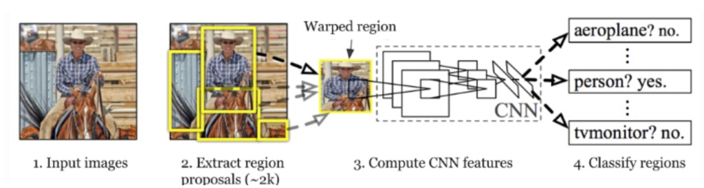

*Чотири кроки R-CNN: вхідне зображення → ~2000 регіонів → CNN-ознаки → класифікація*

---

#### Крок 1. Генерація регіонів-кандидатів (Selective Search)

Перший крок — знайти потенційні місця, де можуть бути об'єкти. Для цього використовується алгоритм **Selective Search**.

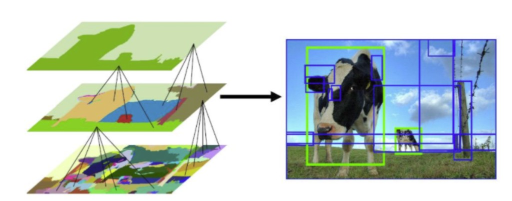

*Selective Search групує пікселі в регіони (ліворуч) і генерує bounding boxes (праворуч)*

**Як працює Selective Search — детальна схема (англ.):**

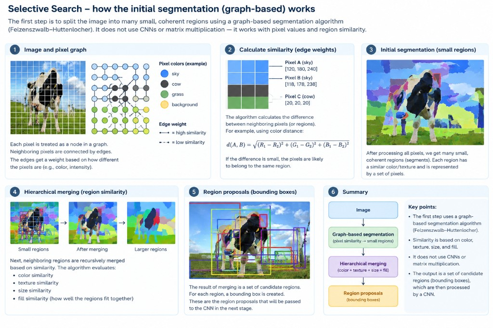

**Той самий алгоритм українською:**

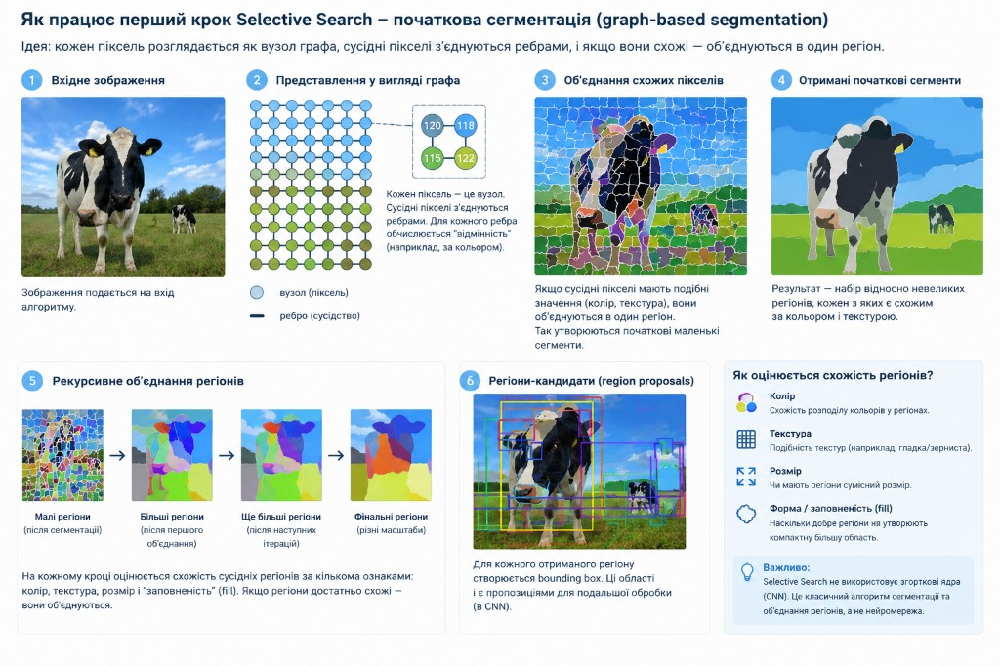

**Як працює Selective Search:**

**Крок 1. Початкова сегментація (graph-based segmentation)**

Зображення ділиться на багато маленьких однорідних областей за допомогою алгоритму **Felzenszwalb–Huttenlocher**:

- Кожен піксель → вузол графа
- Сусідні пікселі з'єднані ребрами; для кожного ребра рахується «відмінність» між пікселями (наприклад, кольорова відстань)
- Якщо сусідні пікселі достатньо схожі → їх об'єднують в один регіон

Приклад для двох пікселів:

```
pixel A = [120, 80, 60]
pixel B = [125, 82, 58]
distance = sqrt((120-125)² + (80-82)² + (60-58)²)  # ≈ 5.7 → мала відмінність → один регіон
```

> **Важливо:** це **не CNN**. Selective Search не використовує trainable weights і не виконує матричне множення. Він працює з числовими значеннями пікселів через класичні алгоритми сегментації.
>
> Порівняння:
>
> - **CNN** — ядро ковзає по зображенню і рахує feature maps через навчені ваги
> - **Selective Search** — ділить зображення на сегменти, потім об'єднує схожі сусідні сегменти

**Крок 2. Рекурсивне об'єднання сусідніх регіонів**

Алгоритм оцінює схожість сусідніх регіонів за **чотирма критеріями**:


| Критерій               | Що оцінює                                                     |
| ---------------------- | ------------------------------------------------------------- |
| **Color similarity**   | Схожість розподілів кольорів у регіонах                       |
| **Texture similarity** | Схожість текстур (гладка/зерниста тощо)                       |
| **Size similarity**    | Чи мають регіони сумісний розмір                              |
| **Fill similarity**    | Наскільки добре два регіони разом утворюють компактну область |


Якщо регіони достатньо схожі — вони об'єднуються:

```
[небо₁] [небо₂] → [небо]
[корова₁] [корова₂] → [тулуб корови] → [вся корова]
[трава₁] [трава₂] [трава₃] → [трава]
```

Алгоритм повторює це ітеративно:

```
маленькі сегменти → більші сегменти → ще більші → різні можливі групи
```

**Крок 3. Генерація region proposals**

Selective Search **не вибирає одну правильну сегментацію**. Він зберігає багато варіантів на різних рівнях злиття:

```
[голова корови]
[тулуб корови]
[голова + тулуб]
[вся корова]
[корова + трохи трави]
...
```

Для кожної такої області будується bounding box → це і є **region proposals**.

> **Ключова ідея Selective Search:**
>
> Він не каже «О, це корова». Він каже: «Ось ця область візуально цілісна і може містити якийсь об'єкт — передамо її CNN».
>
> Мета — згенерувати достатньо розумних кандидатів, щоб серед них майже напевно був прямокутник навколо справжнього об'єкта. А вже CNN питає: «Що тут — корова, машина чи фон?»

**Повна схема:**

```
IMAGE
  ↓
graph-based segmentation (маленькі однорідні регіони)
  ↓
оцінка схожості сусідніх регіонів (color + texture + size + fill)
  ↓
об'єднання схожих → більші регіони
  ↓
збереження багатьох варіантів злиття
  ↓
bounding boxes для кожного варіанту
  ↓
REGION PROPOSALS (~2000)
  ↓
CNN класифікує кожен proposal
```

> **Чому так багато рамок на зображенні?** Це навмисно — алгоритм генерує кандидатів різного розміру, щоб не пропустити жодного реального об'єкта.

> **Результат:** ~2000 регіонів на одне зображення, які охоплюють більшість реальних об'єктів.

---

#### Крок 2. Виділення ознак за допомогою CNN

Кожен із ~2000 регіонів **нормалізується** до розміру 227×227 і передається через попередньо навчену CNN (AlexNet, навчену на ImageNet).

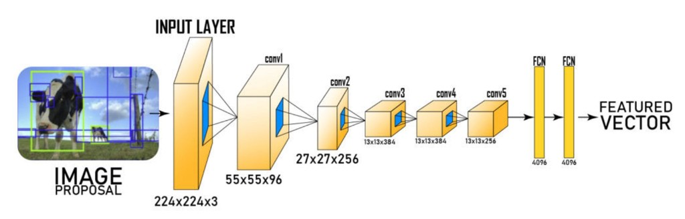

*Кожна область пропозиції → AlexNet → вектор ознак розміром 4096*

- Останній повнозв'язний шар (`fc7`) видаляється → залишається вектор розміром **4096**
- Цей вектор є компактним представленням вмісту регіону

> **Примітка щодо ефективності:** кожне з ~2000 зображень обробляється окремо → це **дуже повільно** (~49 сек на зображення).

---

#### Крок 3. Класифікація за допомогою SVM

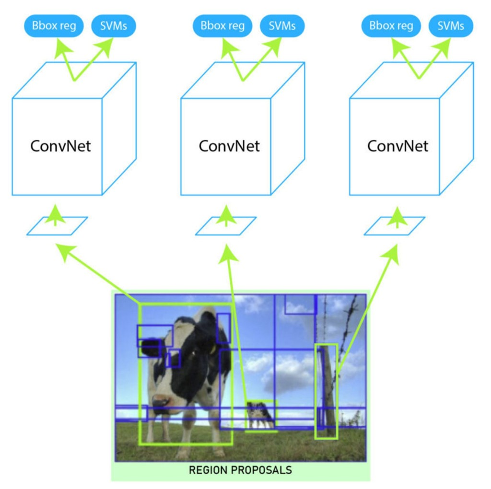

*Для кожного регіону-кандидата запускається свій ConvNet, після чого SVM класифікує об'єкт*

Вектор ознак розміром 4096 передається в набір **бінарних SVM-класифікаторів** — окремий для кожного класу.

##### Що таке SVM?

> **SVM (Support Vector Machine)** — алгоритм машинного навчання, який шукає **гіперплощину** (лінію, площину або гіперплощину у n-вимірному просторі), яка **якнайкраще розділяє** точки двох класів.
>
> **Ключові поняття:**
>
> - **Опорні вектори (support vectors)** — найближчі до межі точки з кожного класу. Саме вони визначають положення гіперплощини.
> - **Маржа (margin)** — відстань між гіперплощиною та найближчими опорними векторами. SVM максимізує цю відстань.
> - **Ядро (kernel)** — трюк для роботи з нелінійно роздільними даними: `linear`, `poly`, `rbf` тощо.
> - `**class_weight='balanced'**` — автоматично підвищує вагу рідшого класу при дисбалансі.
>
> У контексті R-CNN для кожного класу (наприклад, «людина», «машина») навчається **окремий бінарний SVM**: «є об'єкт цього класу» / «немає об'єкта».
>
> Детальний розбір SVM з кодом: [neo/ml/topic8_svm_petfinder.md](/Users/cordial/Documents/neo/ml/topic8_svm_petfinder.md)

---

#### Крок 4. Корекція рамок (Bounding Box Regression)

Окрім класифікації, для кожного регіону навчається **лінійна регресійна модель**, яка уточнює координати bounding box.

Модель отримує 4 значення `(x, y, w, h)` — центр і розміри рамки — і прогнозує **поправки**, що наближають рамку до реального об'єкта.

> **Навіщо:** алгоритм Selective Search не дає точних рамок — регресія покращує mAP на 3–4%.

---

#### Крок 5. Non-Maximum Suppression (NMS)

Після класифікації всіх ~2000 регіонів маємо багато рамок з різними оцінками впевненості. **NMS** прибирає зайві.

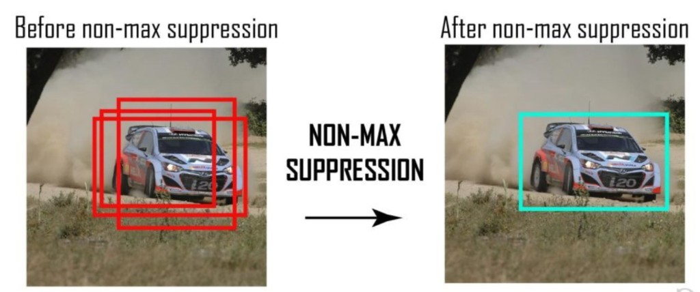

*До NMS — багато рамок; після NMS — одна найкраща*

**Алгоритм NMS:**

1. Відкинути всі рамки з оцінкою впевненості (confidence score) нижче порогу (наприклад, 0.5)
2. Серед рамок, що залишились для одного класу, обрати **найвпевненішу**
3. Порівняти її з усіма іншими: якщо IoU > 0.5 — вважати їх дублікатами і видалити
4. Повторити з наступною за впевненістю рамкою

**Покроковий приклад:**

Модель знайшла одну корову трьома рамками:

```
Box A: confidence = 0.95
Box B: confidence = 0.88
Box C: confidence = 0.71
```

Крок 1 — беремо Box A (найвищий confidence).

Крок 2 — рахуємо IoU між Box A і рештою:

```
IoU(A, B) = 0.82   →   0.82 > 0.5   →   Box B — дублікат, видаляємо
IoU(A, C) = 0.20   →   0.20 < 0.5   →   Box C — інший об'єкт, залишаємо
```

Результат: залишились **Box A** і **Box C** — два різних об'єкти.

> **Важливо:** IoU > 0.5 не означає «50% однієї рамки всередині іншої». Це саме відношення Intersection / Union. Дві рамки, що дуже сильно перекриваються, мають IoU близько 1, навіть якщо жодна не повністю всередині іншої.

---

#### Переваги та обмеження R-CNN


| Переваги                                        | Обмеження                                                              |
| ----------------------------------------------- | ---------------------------------------------------------------------- |
| Висока точність завдяки CNN                     | Дуже повільно: ~49 сек/зображення                                      |
| Модульність: кожен компонент можна вдосконалити | ~2000 CNN-проходів на одне зображення                                  |
| Перший крок до сучасних детекторів              | Три окремих компоненти (CNN, SVM, bbox regressor) навчаються незалежно |


---

### 2.2 Метрика Intersection over Union (IoU)

Джерело: [pyimagesearch.com/2016/11/07/intersection-over-union-iou-for-object-detection](https://pyimagesearch.com/2016/11/07/intersection-over-union-iou-for-object-detection/)

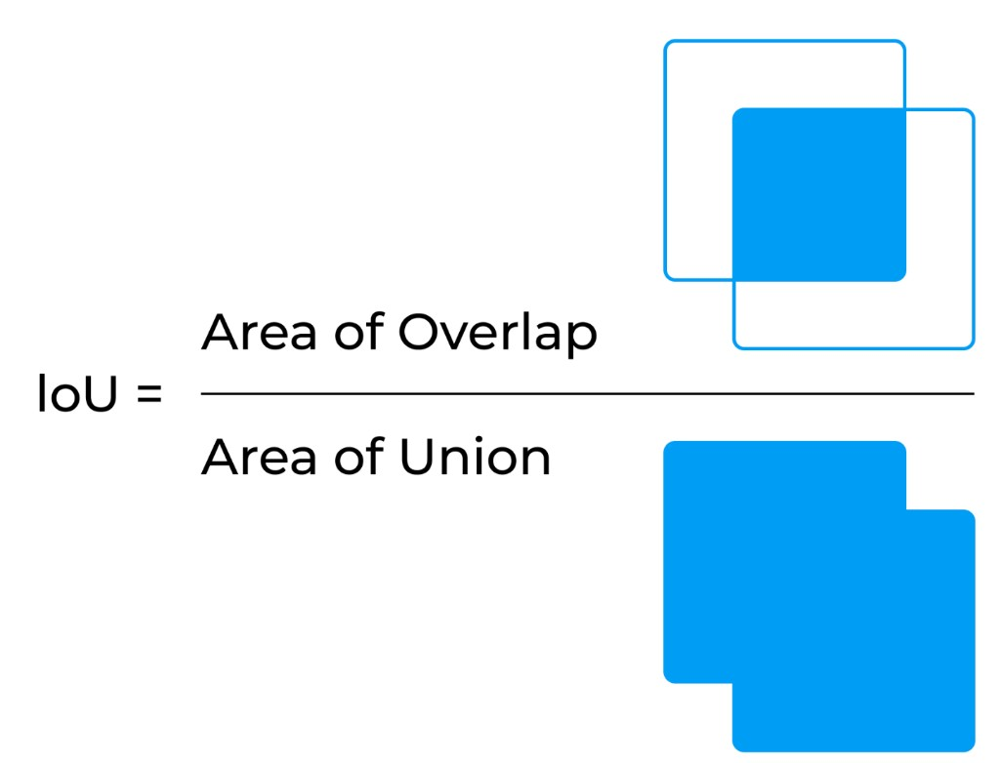

**IoU** вимірює, наскільки добре передбачена рамка збігається з еталонною.

```
IoU = площа перетину / площа об'єднання
    = Intersection / Union
```

- **Intersection (перетин)** — площа, яка одночасно належить обом рамкам
- **Union (об'єднання)** — загальна площа, яку покривають обидві рамки разом (без подвійного рахунку перетину)

**Приклад:** площа перетину = 40, площа об'єднання = 100 → IoU = 40/100 = **0.4**


| Значення IoU | Інтерпретація                                 |
| ------------ | --------------------------------------------- |
| = 0          | Рамки не перетинаються взагалі                |
| = 0.3        | Невелике перекриття                           |
| = 0.5        | Поріг «правильного» виявлення (True Positive) |
| = 0.8        | Дуже сильне перекриття — ймовірно, дублікат   |
| = 1.0        | Рамки повністю збігаються                     |


> **Правило:** IoU > 0.5 — «правильне» виявлення (True Positive). Саме цей поріг використовується у більшості задач.

**Детальна схема IoU з числовим прикладом:**

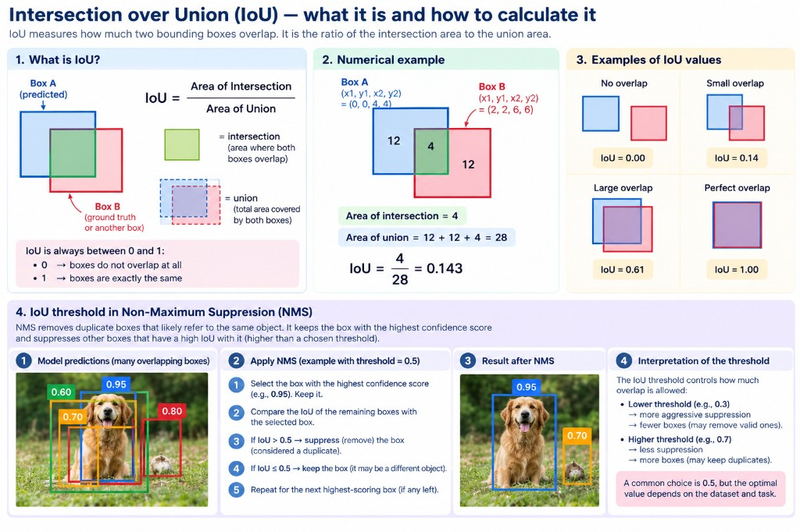

*Схема: формула IoU (1), числовий розрахунок (2), приклади значень 0–1 (3), IoU threshold у NMS (4)*

**IoU і NMS — як вони пов'язані:**

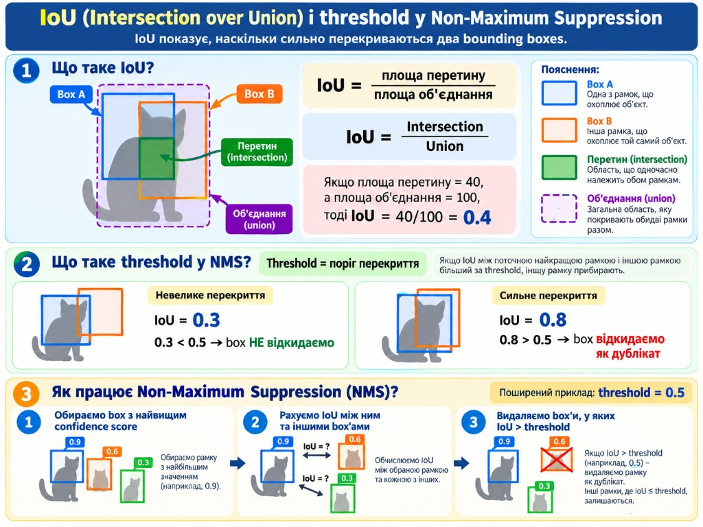

*Схема: що таке IoU (1), threshold у NMS (2) і як NMS крок за кроком прибирає дублікати (3)*

> **Нюанс:** IoU > threshold у NMS означає «ця рамка сильно перекривається з найкращою → вважаємо її дублікатом → видаляємо». IoU < threshold → рамки мало перекриваються → це, мабуть, **інший об'єкт** → залишаємо.

**Звідки назва «Non-Maximum Suppression»?**

> - **maximum** = рамка з **найвищим confidence score** — її залишаємо
> - **non-maximum** = всі інші рамки з меншим confidence
> - **suppression** = їхнє **пригнічення / видалення**
>
> Тобто: «залишити максимум і прибрати близькі до нього не-максимальні результати».
>
> Важливо: NMS видаляє **не всі** рамки з меншим confidence, а лише ті, що **сильно перекриваються** з кращою рамкою (IoU > threshold). Рамки, що слабо перекриваються, залишаються — вони можуть позначати інший об'єкт.

#### Реалізація IoU на Python

```python
def bb_intersection_over_union(boxA, boxB):
    """
    Обчислює IoU між двома bounding boxes.
    
    boxA, boxB: списки або кортежі формату [x_min, y_min, x_max, y_max]
    де (x_min, y_min) — лівий верхній кут, (x_max, y_max) — правий нижній.
    """
    # Координати перетину: беремо максимальні ліво/верхні і мінімальні право/нижні кути
    xA = max(boxA[0], boxB[0])
    yA = max(boxA[1], boxB[1])
    xB = min(boxA[2], boxB[2])
    yB = min(boxA[3], boxB[3])
    
    # Площа перетину: max(0, ...) захищає від від'ємних значень (рамки не перетинаються)
    interArea = max(0, xB - xA + 1) * max(0, yB - yA + 1)
    
    # Площі кожної рамки окремо
    boxAArea = (boxA[2] - boxA[0] + 1) * (boxA[3] - boxA[1] + 1)
    boxBArea = (boxB[2] - boxB[0] + 1) * (boxB[3] - boxB[1] + 1)
    
    # IoU = перетин / об'єднання. Від суми площ віднімаємо перетин (щоб не рахувати двічі)
    iou = interArea / float(boxAArea + boxBArea - interArea)
    
    return iou


# Приклад використання
boxA = [39, 63, 203, 112]   # еталонна рамка (ground truth)
boxB = [54, 66, 198, 114]   # передбачена рамка (prediction)

score = bb_intersection_over_union(boxA, boxB)
print(f"IoU: {score:.4f}")  # Очікуємо ~0.7980
```


| Параметр     | Тип         | Опис                                        |
| ------------ | ----------- | ------------------------------------------- |
| `boxA`       | `list[int]` | Перша рамка: `[x_min, y_min, x_max, y_max]` |
| `boxB`       | `list[int]` | Друга рамка: `[x_min, y_min, x_max, y_max]` |
| **Повертає** | `float`     | Значення IoU від 0.0 до 1.0                 |


> **Очікуваний вивід:** `IoU: 0.7980` — значення > 0.5, тобто це «хороше» передбачення.

---

### 2.3 Fast R-CNN

Оригінальна стаття: [тема_7/R_CNN.pdf](R_CNN.pdf)

**Fast R-CNN** (2015, Росс Гіршик) вирішує головну проблему R-CNN: замість того, щоб пропускати кожен з ~2000 регіонів через CNN окремо, зображення проходить через CNN **лише один раз**.

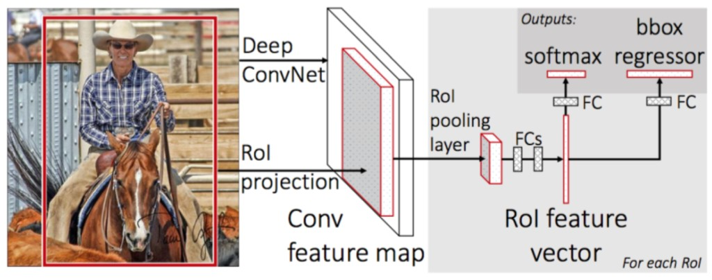

*Fast R-CNN: зображення + ROI проекція → спільна CNN → ROI Pooling → класифікація і регресія*

#### Кроки Fast R-CNN

**Крок 1. Виділення ознак для всього зображення**

Вхідне зображення передається через **одну** базову CNN (VGG-16 або ResNet) → отримуємо **карту ознак** (feature map) для всього зображення.

> **Що таке VGG-16 і ResNet?**
>
> Це архітектури CNN, що використовуються як **backbone** — мережа, яка витягує ознаки із зображення.
>
> - **VGG-16** — Visual Geometry Group (Oxford). Число 16 = кількість шарів із навчуваними параметрами. Проста і надійна архітектура з послідовними Conv-шарами 3×3.
> - **ResNet** — Residual Network («залишкова мережа»). Ключова ідея: **skip connections** — сигнал може «перестрибувати» через кілька шарів. Це дозволяє будувати дуже глибокі мережі без деградації градієнтів.
>
> ```
> Image → VGG-16 / ResNet → feature map
> ```
>
> У Fast R-CNN backbone обробляє зображення **один раз** → feature map передається далі для всіх ROI.

**Крок 2. Генерація пропозицій регіонів**

Паралельно, використовуючи **Selective Search** (так само як у R-CNN), генеруються ~2000 регіонів-кандидатів. Їх координати проектуються на карту ознак.

> **Ключова відмінність від R-CNN:** регіони не обробляються CNN окремо — їх координати просто відображаються на вже готову feature map.

**Крок 3. ROI Pooling**

> **ROI = Region of Interest** — «область інтересу».
> Це конкретна ділянка зображення, яку Selective Search вважає потенційним об'єктом.

**ROI Pooling** перетворює регіон **довільного розміру** на тензор **фіксованого розміру** (наприклад, 7×7).

**Навіщо потрібен фіксований розмір?**

Region proposals мають різні розміри — одна рамка 50×30, інша 200×150. Але Fully Connected шари після ROI Pooling очікують вхід **однакового розміру**. ROI Pooling вирішує це:

```
ROI  50× 30 ──┐
ROI 200×150 ──┼──→ ROI Pooling → 7×7 (однаковий розмір)
ROI  90× 60 ──┘
```

**Що таке pooling?**

Pooling бере групу чисел і стискає її до меншого розміру. Для **max pooling** — залишається лише найбільше значення:

```
1  5       max pooling
3  2   →      5
```

Мета: зменшити розмір даних, зберегти найсильніші активації, здешевити подальші обчислення.

**Що є виходом ROI Pooling?**

Це **тензор числових ознак** (не нове зображення!). У реальному Fast R-CNN — тензор розміром **7 × 7 × 256**, де:

- `7` — висота після pooling
- `7` — ширина після pooling
- `256` — кількість **каналів** (feature maps)

Уяви це як стопку з 256 карт ознак, кожна розміром 7×7:

```
feature map 1   → 7 × 7
feature map 2   → 7 × 7
...
feature map 256 → 7 × 7
─────────────────────────
Разом: 7 × 7 × 256 = 12 544 числових значень
```

> **Звідки береться 256?** Не від ROI Pooling — він лише змінює просторові розміри (висоту і ширину). Кількість каналів приходить із попереднього CNN/RPN шару, який має **256 filters** → кожен filter створює одну feature map → **256 filters = 256 channels**.
>
> ```
> 256 filters → 256 feature maps → 256 channels
> ```
>
> В іншій архітектурі це може бути 512, 1024 тощо.

Спрощений приклад для 2×2 виходу:

```
Input ROI (частина feature map):    Output після ROI Pooling 2×2:

1  3  7  2                               6  7
4  6  2  1     →  ROI Pooling  →         9  6
8  5  3  4
2  9  6  1
```

Ці числа — активації, які backbone CNN вже знайшов у feature map.

##### Як працює ROI Pooling — покроковий приклад

Маємо карту ознак розміром **8×8** і хочемо отримати вихід розміром **2×2**.

**Вхідна карта ознак (Input Activation):**

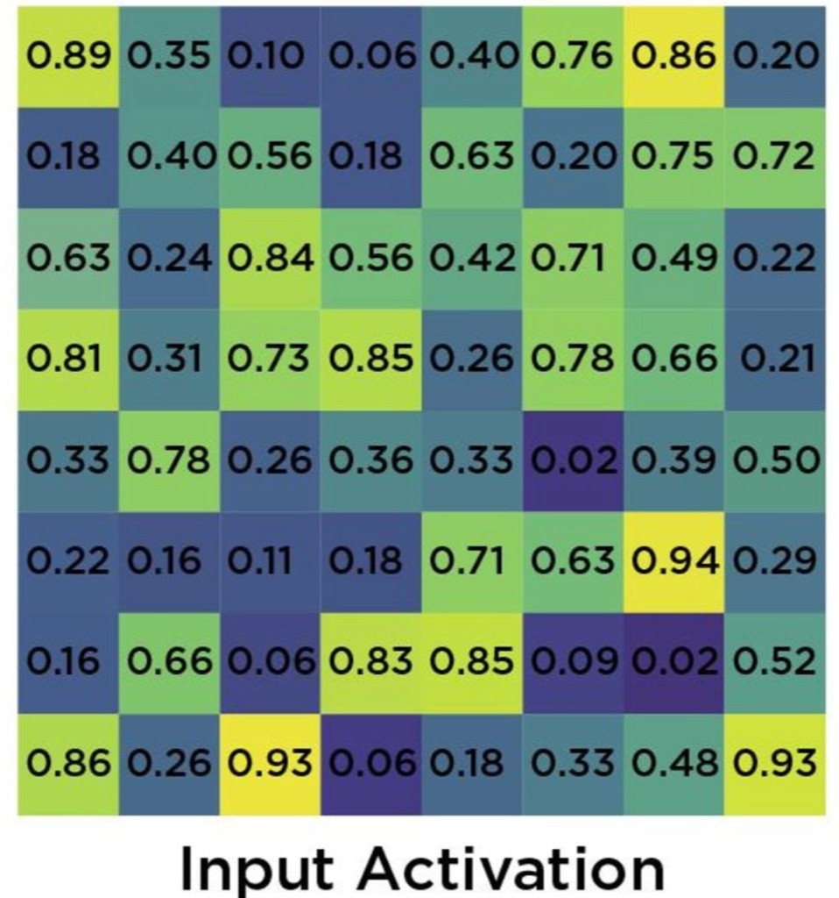

**Регіон пропозиції (Region Proposal):**

Координати: лівий верхній кут `(0, 3)`, висота = 5, ширина = 7 (рядки 3–7, колонки 0–6).

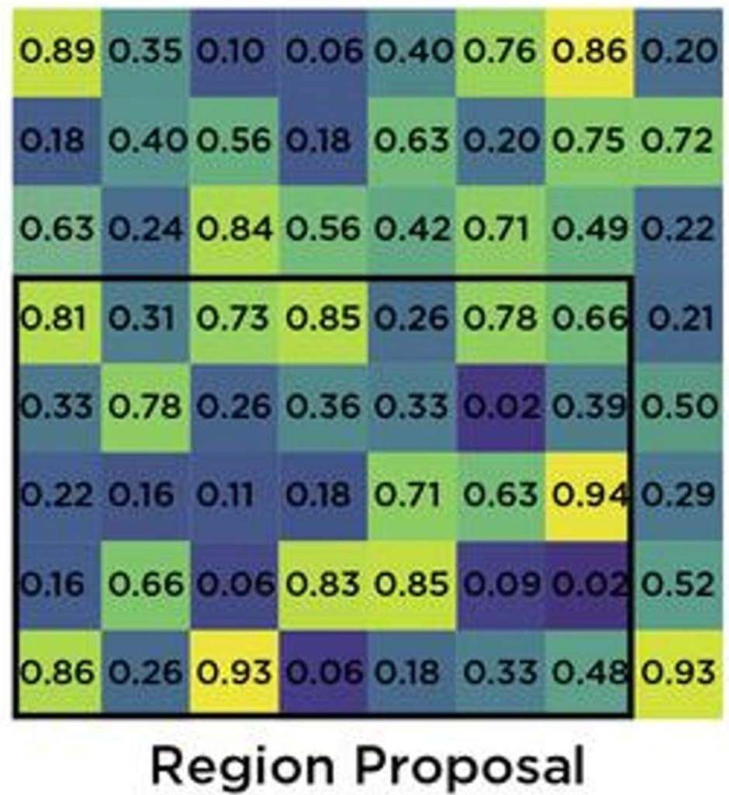

**Ділення на секції для пулінгу (Pooling Sections):**

Регіон 5×7 ділиться на **2×2 = 4** приблизно однакові частини:

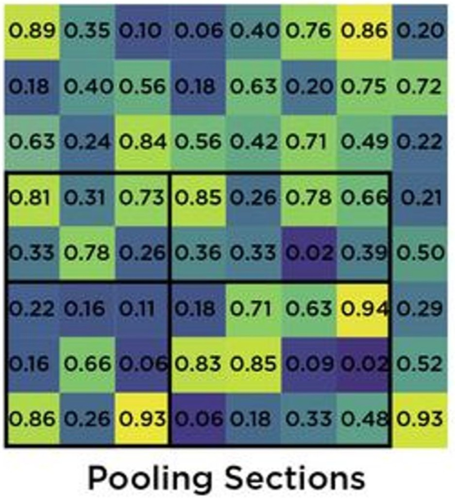

**Результат після max pooling (вихід 2×2):**

З кожної секції обирається максимальне значення:

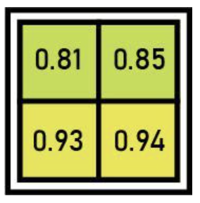

*Результат: 0.81 | 0.85 / 0.93 | 0.94 — чотири максимуми зі своїх секцій*

> **Чому це важливо:** незалежно від того, чи регіон 50×30 пікселів, чи 200×100 — після ROI Pooling ми завжди отримуємо тензор **7×7** (або будь-який фіксований розмір). Це дозволяє обробляти всі регіони однаковим FC-шаром.

**Крок 4. Класифікація та регресія (паралельно)**

Після ROI Pooling два паралельних виходи:

- **Classification head** — softmax по всіх класах + фон
- **Regression head** — поправки `(dx, dy, dw, dh)` до bounding box

**Крок 5. NMS**

Аналогічно R-CNN — видалення дублікатів рамок (алгоритм описаний у розділі 2.1).

**Повна схема Fast R-CNN:**

```
IMAGE
   ↓
CNN backbone (VGG-16 / ResNet)  ←─── обробляє зображення ОДИН РАЗ
   ↓
FEATURE MAP
   ↑
Selective Search
(~2000 region proposals)
   ↓
ROI Pooling
(усі ROI → однаковий фіксований розмір)
   ↓
Fully Connected layers
   ↓
       ┌──────────────────┐
       │                  │
 Classification      Bounding box
   (softmax)          regression
       │                  │
       └────────┬─────────┘
                ↓
               NMS
                ↓
       FINAL DETECTIONS
```

> **Головна відмінність від R-CNN:** у R-CNN CNN запускалась **окремо для кожного з ~2000 region proposals**. У Fast R-CNN CNN обробляє **все зображення один раз**, а різні ROI беруться вже з готової feature map.

#### Що покращив Fast R-CNN


| Аспект                     | R-CNN                | Fast R-CNN                    |
| -------------------------- | -------------------- | ----------------------------- |
| CNN-проходів на зображення | ~2000                | 1                             |
| Класифікатор               | Окремий SVM          | Softmax в мережі (end-to-end) |
| Тренування                 | Три незалежних кроки | Одне наскрізне тренування     |
| Час inference              | ~49 сек/зображення   | ~2 сек/зображення             |


> **Залишкова проблема:** Selective Search все ще виконується поза мережею — це **вузьке місце** (bottleneck). Faster R-CNN вирішує і цю проблему.

---

### 2.4 Faster R-CNN

Оригінальна стаття: [тема_7/Fast_R_CNN.pdf](Fast_R_CNN.pdf)

**Faster R-CNN** (2015) усуває останній недолік Fast R-CNN: замість зовнішнього **Selective Search** вводить **Region Proposal Network (RPN)** — частину нейромережі, яка сама знаходить потенційні області з об'єктами.

> **Простіше кажучи:**
>
> `Faster R-CNN = RPN + Fast R-CNN`
>
> - **RPN** — знаходить, *де можуть бути об'єкти*
> - **Fast R-CNN** — визначає, *що це за об'єкти*, і уточнює bounding boxes

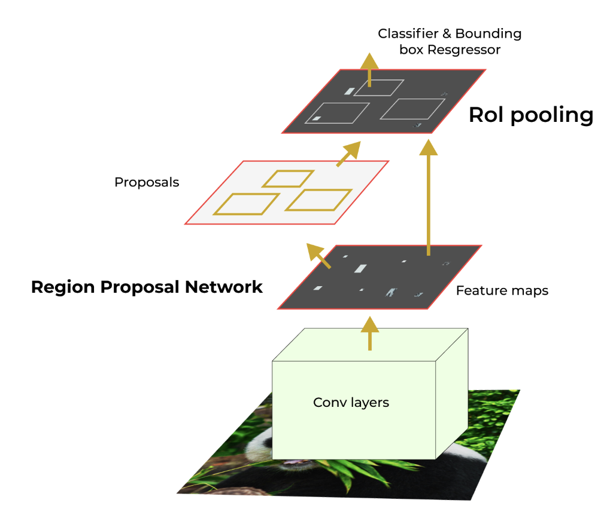

*Faster R-CNN: Conv layers → Feature maps → RPN (пропозиції) + ROI Pooling → класифікатор*

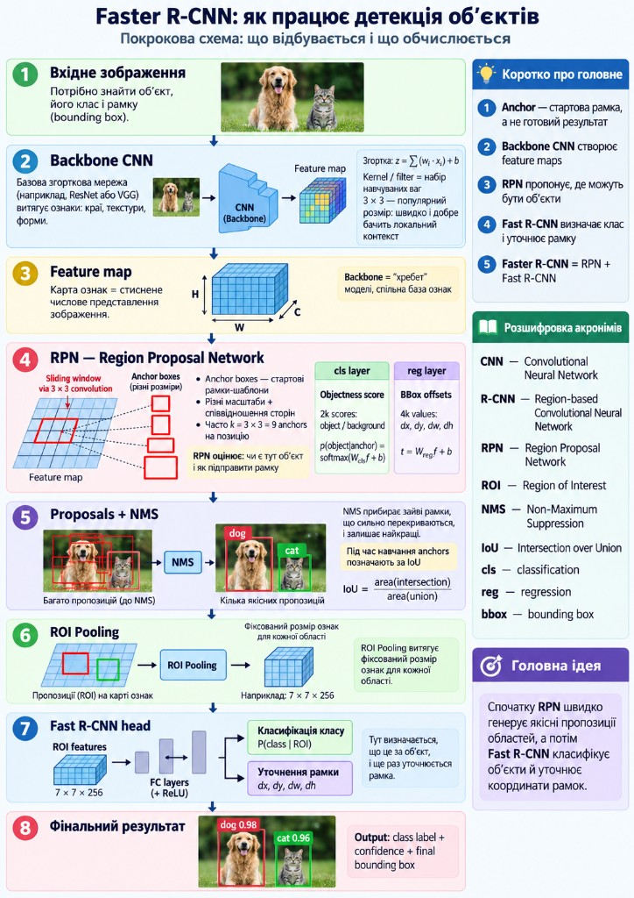

*Покрокова схема Faster R-CNN: Backbone CNN → Feature map → RPN (anchor boxes, NMS) → ROI Pooling (7×7×256) → Fast R-CNN head → клас + bounding box*

#### Архітектура Faster R-CNN

```
Зображення
     ↓
Backbone CNN (ResNet, VGG)   ← витягує ознаки
     ↓
Feature Map (спільна для RPN і детектора)
   ↙                    ↘
RPN                     ROI Pooling
(де об'єкти?)               ↓
     ↓               FC layers
  Proposals          ↙           ↘
     └──────→  Classification  BBox Regressor
                    ↓
                   NMS
                    ↓
            FINAL DETECTIONS
```

---

#### Backbone CNN — що це?

**Backbone** (буквально «хребет») — основна CNN, на якій «тримається» вся архітектура.

```
         RPN
        ↗
Backbone
        ↘
       Detector (Fast R-CNN)
```

Backbone приймає зображення і перетворює його на **feature maps** — числові матриці, що кодують:

- краї і текстури (ранні шари)
- форми і частини об'єктів (середні шари)
- складні патерни (глибокі шари)

Задача backbone — не сказати «це собака», а витягти корисні ознаки, якими скористаються і RPN, і детектор. Типові backbone: **ResNet-50, ResNet-101, VGG-16**.

---

#### Region Proposal Network (RPN)

RPN — легка нейромережа, яка **ковзає** по feature map і для кожної позиції прогнозує набір потенційних об'єктів.

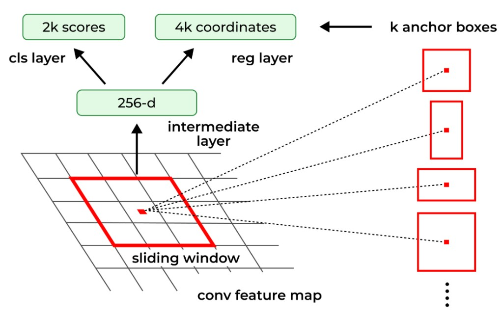

*Ковзне вікно по feature map → 256-d вектор → cls layer (2k балів) і reg layer (4k координат) для k якорів*

---

**1. Anchor Boxes (якорі)**

**Anchor box — заздалегідь заданий прямокутник-шаблон**, що ставиться в кожній точці feature map.

Anchor — це ще **не знайдений об'єкт**, а гіпотеза:

> «А раптом тут є об'єкт приблизно такого розміру і форми?»

У кожній позиції RPN «примірює» k різних якорів:

```
□   маленький квадрат (1:1)
▯   вертикальний прямокутник (1:2)
▭   горизонтальний прямокутник (2:1)
... і ще кілька масштабів
```

У класичному Faster R-CNN:

- Масштаби: 128², 256², 512² пікселів
- Пропорції: 1:1, 1:2, 2:1

**3 масштаби × 3 пропорції = 9 якорів** у кожній позиції.

Якорі задаються вручну. Далі RPN передбачає **поправки** до кожного якоря:

```
anchor → regression offsets (dx, dy, dw, dh) → proposal
```

---

**2. Sliding Window = згорткове ядро 3×3**

**Sliding window** у контексті RPN — це сам процес руху ядра по feature map.

```
feature map              ядро 3×3 рухається:

[ ][ ][ ][ ]         [ ][ ][ ][ ]
[ ][■][■][ ]    →    [ ][ ][■][■]
[ ][■][■][ ]         [ ][ ][■][■]
[ ][ ][ ][ ]         [ ][ ][ ][ ]
```

RPN застосовує **згорткове ядро 3×3** до feature map — це і є ковзне вікно. Один крок:

```
вікно 3×3 на feature map
        ↓
z = w₁x₁ + w₂x₂ + ... + w₉x₉ + b   (навчувані ваги)
        ↓
256-d feature vector
```

**Чому 3×3?** Це хороший компроміс: бачить локальний контекст і сусідні значення, мало параметрів, швидко рахується. Важливо: хоча ядро лише 3×3 **на feature map**, його **receptive field на оригінальному зображенні** значно більший — backbone вже кілька разів застосував convolution і pooling.

---

**3. Дві гілки: cls layer і reg layer**

Для кожної позиції ковзного вікна 256-d вектор надходить у дві паралельні гілки:

```
256-d feature vector
     ↓
  ┌──────────────────┐
  │                  │
cls layer         reg layer
  │                  │
2k scores         4k coordinates
```

**Classification branch (cls layer):**

Для кожного з k якорів — два числа: object vs background:

```
anchor 1 → 0.92 (object)    0.08 (background)
anchor 2 → 0.15 (object)    0.85 (background)
anchor 3 → 0.73 (object)    0.27 (background)
```

Це і є **objectness score**.

Тому загальний вихід: **2 × k scores**.

**Regression branch (reg layer):**

Для кожного якоря — 4 поправки до координат:

```
dx  (зміщення центру по x)
dy  (зміщення центру по y)
dw  (зміна ширини)
dh  (зміна висоти)
```

Тому загальний вихід: **4 × k coordinates**.

Для стандартного k=9:

```
cls layer:  2 × 9 = 18 значень
reg layer:  4 × 9 = 36 значень
```

---

**4. Як навчається RPN?**

Під час тренування кожен anchor порівнюється з ground truth bounding boxes через IoU:

```
IoU великий (> 0.7)  →  positive anchor  →  тут є об'єкт
IoU маленький (< 0.3) → negative anchor  →  фон
```

Loss навчає ваги так, щоб позитивні якорі мали високий objectness score, а поправки координат наближали якір до реального об'єкта.

---

**5. Objectness Score (оцінка об'єктності)**

Objectness score — ймовірність того, що якір містить об'єкт (будь-який, незалежно від класу). Якорі з високим score передаються далі як proposals.

> **Важливо:** RPN **не розпізнає клас** об'єкта — лише каже «тут щось є» або «тут фон». Клас визначає вже Fast R-CNN на наступному кроці.

---

**6. NMS у RPN**

Після генерації тисяч proposals (всі позиції × 9 якорів) NMS залишає топ-**300** найкращих за objectness score.

---

**Повна схема RPN:**

```
IMAGE
  ↓
BACKBONE CNN
  ↓
FEATURE MAP
  ↓
3×3 sliding convolution (для кожної точки feature map)
  ↓
256-d feature vector  ← 256 = кількість filters у проміжному conv шарі RPN
  ↓                         (не від ROI Pooling; звідси ж береться "256" у 7×7×256)
для кожного з k anchors:
   ├─ objectness score (object / background)
   └─ 4 поправки координат (dx, dy, dw, dh)
  ↓
тисячі proposals
  ↓
NMS → топ-300 найкращих
  ↓
REGION PROPOSALS → Fast R-CNN
```

> **Ключова ідея:** anchor — це не результат, а **стартова рамка**, яку RPN оцінює і коригує.

---

#### Що покращив Faster R-CNN


| Аспект                   | Fast R-CNN                              | Faster R-CNN                  |
| ------------------------ | --------------------------------------- | ----------------------------- |
| Генерація пропозицій     | Selective Search (~2 сек, поза мережею) | RPN (< 10 мс, частина мережі) |
| Чи навчається генерація? | Ні                                      | Так — разом з детектором      |
| Час inference            | ~2 сек/зображення                       | ~0.1–0.2 сек/зображення       |
| Архітектура              | Частково end-to-end                     | Повністю end-to-end           |


---

## ЧАСТИНА 3. ОДНОЕТАПНІ АРХІТЕКТУРИ

### 3.1 YOLO (You Only Look Once)

Оригінальна стаття: [тема_7/YOLO.pdf](YOLO.pdf)

**YOLO** — перший масово популярний одноетапний детектор. Все зображення обробляється **одним проходом** через мережу, яка одночасно передбачає і класи, і координати рамок для всіх об'єктів.

> **Головна ідея одним реченням:**
> подивився на все зображення **один раз** → одразу сказав, **де об'єкти і що це за об'єкти**.

Порівняй з Faster R-CNN:

```
Faster R-CNN:              YOLO:
  image                      image
    ↓                          ↓
  backbone                    CNN
    ↓                          ↓
  RPN                       feature map
    ↓                          ↓
  proposals              одразу все:
    ↓                    - bounding boxes
  ROI Pooling            - confidence
    ↓                    - classes
  classifier                   ↓
    ↓                         NMS
  result                       ↓
                            result
```

Тому він і називається **You Only Look Once** — один прохід, одразу детекція.

#### Ідея: S×S сітка

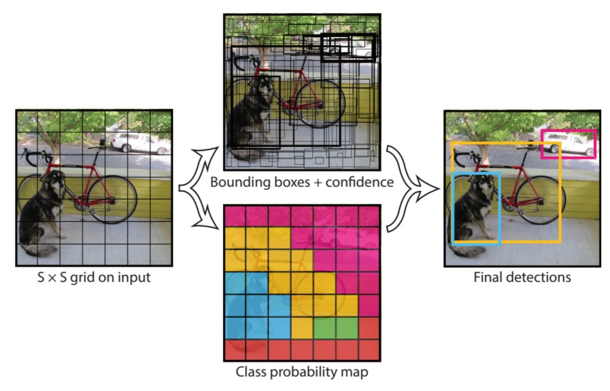

*YOLO: зображення → S×S сітка → bounding boxes + confidence → class probability map → фінальні детекції*

**Алгоритм:**

1. Зображення масштабується до фіксованого розміру (448×448 або 416×416)
2. CNN витягує ознаки (краї, текстури, форми, частини об'єктів) — так само як backbone у Faster R-CNN
3. Ділиться на **S×S** сітку (наприклад, 7×7)
4. Кожна комірка сітки відповідає за виявлення об'єктів, центр яких знаходиться в цій комірці

```
┌───┬───┬───┬───┐
│   │   │   │   │
├───┼───┼───┼───┤
│   │ 🐶│   │   │   ← центр собаки тут → ця клітинка "відповідає" за собаку
├───┼───┼───┼───┤
│   │   │   │🐱 │   ← центр кота тут → ця клітинка "відповідає" за кота
└───┴───┴───┴───┘
```

> **Ключове правило:** за об'єкт відповідає та клітинка, в якій знаходиться **центр** об'єкта. Сам об'єкт може виходити за межі клітинки — рамка це дозволяє.

#### Структура передбачень

**Кожна комірка сітки** передбачає:

- **B** bounding boxes, кожна описується 5 числами: x, y, w, h, confidence
- **C** ймовірностей класів: P(Classᵢ | Object)

```
Confidence = P(Object) × IoU(pred, truth)
```

де IoU(pred, truth) — значення IoU між передбаченою і реальною рамкою.

**Числовий приклад — що видає одна клітинка:**

```
Bounding box:
  x = 0.6    ← центр рамки по горизонталі (відносно клітинки, 0–1)
  y = 0.4    ← центр рамки по вертикалі
  w = 0.3    ← ширина рамки (відносно всього зображення)
  h = 0.5    ← висота рамки
  confidence = 0.92   ← модель впевнена, що тут є об'єкт і рамка хороша

Class probabilities (окремо від bbox):
  dog    0.85
  cat    0.05
  person 0.02
  ...
```

**Фінальний score класу** = confidence × P(class | object):

```
dog score = 0.92 × 0.85 ≈ 0.78  →  "dog 78%"
```

**Confidence детально:**

- Якщо об'єкта немає → `confidence ≈ 0`
- Якщо є об'єкт і рамка ідеальна (IoU=1) → `confidence = P(object) × 1.0` → максимум
- Тобто confidence штрафує одночасно за відсутність об'єкта і за погану рамку

#### Формат bounding box


| Параметр   | Опис                                                                  |
| ---------- | --------------------------------------------------------------------- |
| x, y       | Координати центру рамки відносно меж комірки (від 0 до 1)             |
| w, h       | Ширина і висота рамки відносно розміру всього зображення (від 0 до 1) |
| confidence | P(Object) × IoU — впевненість в наявності об'єкта                     |


#### Формат вихідного тензора

```
Output shape = S × S × (B × 5 + C)
```

Для оригінального YOLO v1: S=7, B=2, C=20 (Pascal VOC) → вихід **7×7×30**


| Символ | Значення             | Пояснення                           |
| ------ | -------------------- | ----------------------------------- |
| S      | 7                    | Розмір сітки                        |
| B      | 2                    | Кількість bounding boxes на комірку |
| 5      | фіксовано            | x, y, w, h, confidence              |
| C      | 20 (VOC) / 80 (COCO) | Кількість класів                    |


**Розгорнуто — що є у тих 30 числах однієї клітинки:**

```
2 bounding boxes × 5 параметрів = 10 чисел
  box 1: x, y, w, h, confidence
  box 2: x, y, w, h, confidence
+
20 class probabilities (dog, cat, car, person ...)
= 30 чисел
```

Отже весь вихід: **49 клітинок × 30 = 1470 чисел** в тензорі `7 × 7 × 30`.

> **Навіщо дві bounding boxes (B=2)?**
> Одна клітинка може запропонувати кілька варіантів рамки. Після навчання предиктори **спеціалізуються**: один може краще ловити широкі горизонтальні об'єкти, інший — вузькі вертикальні. Під час навчання за кожний ground truth відповідає той bbox, у якого вищий IoU. Решта вважається "no object".

#### Архітектура мережі (YOLOv1)

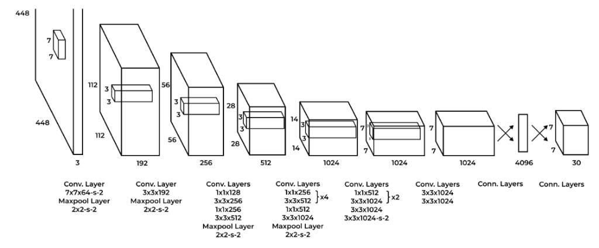

*YOLOv1 backbone: 24 згорткових шари + 2 повнозв'язних. Вхід 448×448 → вихід 7×7×30*

**Блоки архітектури:**

- Conv Layer 7×7×64, stride=2 → MaxPool 2×2, stride=2 → `112×112×192`
- Conv Layer 3×3×192 → MaxPool 2×2, stride=2 → `56×56×256`
- Блоки 1×1 + 3×3 (зменшення розміру + виявлення ознак) → `28×28×512`
- ... → `14×14×1024` → `7×7×1024`
- FC 4096 → FC 7×7×30 (вихід)

> **Нагадування — Inception та натхнення YOLOv1:**
> YOLOv1 **натхненний** архітектурою **GoogLeNet/Inception** від Google, але не копіює її один в один. В оригінальній статті YOLO блоки `1×1 + 3×3` запозичені саме з ідеї Inception — паралельна обробка feature map фільтрами різного розміру:
>
> ```
> input feature map
>    ├─ 1×1 conv   ← дрібні деталі, зменшення глибини
>    ├─ 3×3 conv   ← середній масштаб
>    ├─ 5×5 conv   ← великий контекст
>    └─ pooling
>         ↓
>    concatenate   ← модель одночасно бачить ознаки різного масштабу
> ```
>
> Ідея: замість вибору «який розмір фільтра кращий?» — застосувати всі й об'єднати результати.

#### Функція втрат YOLO

YOLO мінімізує суму трьох компонентів:

`L = L_coord + L_obj + L_class`


| Компонент | Що вимірює                                   |
| --------- | -------------------------------------------- |
| `L_coord` | Точність координат (x, y, w, h) bounding box |
| `L_obj`   | Точність confidence (чи є об'єкт у рамці)    |
| `L_class` | Точність ймовірностей класів                 |


Схематично:

```
неправильна рамка          неправильний confidence       неправильний клас
(x, y, w, h)                 (є/немає об'єкт)
       ↓                            ↓                            ↓
  L_coord                       L_obj                       L_class
       └────────────────────────────┴────────────────────────────┘
                                   ↓
                              загальний L
                                   ↓
                           backpropagation
                                   ↓
                         оновлення weights
```

> **Важливо:** координати √w і √h — корінь з ширини і висоти. Це зменшує вплив великих рамок і дозволяє однаково штрафувати за помилки в маленьких і великих об'єктах.

#### NMS після YOLO

YOLO може знайти один об'єкт кількома рамками (від різних клітинок або bbox):

```
┌────────────┐
│ ┌────────┐ │
│ │  🐶    │ │   box A → dog 0.95
│ └────────┘ │   box B → dog 0.89  ← перекривається з A
└────────────┘   box C → dog 0.72  ← теж перекривається
```

NMS дивиться на IoU між рамками і вирішує: "це один і той самий об'єкт" → залишає найкращу:

```
box A → 0.95  ✓  залишається
box B → 0.89  ✗  пригнічується (IoU з A > порогу)
box C → 0.72  ✗  пригнічується (IoU з A > порогу)
```

Після прогнозу S×S×(B×5+C) тензора:

1. Відфільтрувати рамки з confidence < порогу (наприклад, 0.5)
2. Для кожного класу застосувати NMS (алгоритм описаний вище)
3. Залишаються лише рамки з найвищими confidence і мінімальним перекриттям

#### Еволюція YOLO


| Версія | Рік  | Ключові нововведення                                                      |
| ------ | ---- | ------------------------------------------------------------------------- |
| YOLOv1 | 2016 | Перший одноетапний YOLO, сітка S×S                                        |
| YOLOv2 | 2017 | Darknet-19, anchor boxes, Batch Normalization, багатомасштабне тренування |
| YOLOv3 | 2018 | Darknet-53, багаторівнева детекція (3 масштаби), резидуальні зв'язки      |
| YOLOv4 | 2020 | CSPDarknet, Mosaic аугментація, CIoU loss                                 |
| YOLOv5 | 2020 | PyTorch-реалізація Ultralytics, простота розгортання                      |
| YOLOv8 | 2023 | Нова архітектура Ultralytics, декілька задач (detect/segment/pose)        |
| YOLOv9 | 2024 | GELAN архітектура, PGI (Programmable Gradient Information)                |


**Ключові покращення між версіями:**

- **Anchor boxes** (v2+) — попередньо задані форми рамок замість прямого прогнозу → краща локалізація
- **Batch Normalization** (v2+) — стабілізує навчання, зменшує потребу в Dropout
- **Backbone Darknet-53** (v3) — глибша і точніша основа з residual зв'язками
- **Мульти-масштабна детекція** (v3+) — три різні масштаби для виявлення об'єктів різних розмірів
- **Mosaic аугментація** (v4+) — комбінація 4 зображень в одне → більше різноманіття для навчання
- **IoU-based loss** (v4+) — GIoU / DIoU / CIoU замість MSE для координат

> **Нагадування — що таке Darknet:**
> **Darknet** — це не окремий шар, а **CNN-архітектура (backbone)**, спеціально розроблена для YOLO. Різні версії YOLO мають різні backbone:
>
>
> | Версія YOLO | Backbone                                                    |
> | ----------- | ----------------------------------------------------------- |
> | YOLOv2      | Darknet-19 (19 convolutional layers)                        |
> | YOLOv3      | Darknet-53 (53 convolutional layers + residual connections) |
> | YOLOv4      | CSPDarknet                                                  |
>
>
> Наприклад, **Darknet-53** — глибока мережа з residual зв'язками, схожа за ідеєю на ResNet. Загальний пайплайн:
>
> ```
> Image
>   ↓
> Darknet backbone   ← витягує ознаки (те саме, що ResNet у Faster R-CNN)
>   ↓
> Feature maps
>   ↓
> YOLO detection head
>   ↓
> boxes + classes
> ```
>
> Починаючи з YOLOv5/v8, Ultralytics перейшов з Darknet на власні backbone на базі PyTorch.

---

### 3.2 RetinaNet

Оригінальна стаття: [тема_7/Retina_Net.pdf](Retina_Net.pdf)

**RetinaNet** (2017, Facebook AI Research) — одноетапний детектор, який вирішує головний недолік одноетапних підходів: **дисбаланс класів**.

#### Проблема дисбалансу класів

В одному зображенні може бути **тисячі** фонових регіонів і **лише 3–5** об'єктів. При стандартній крос-ентропії модель «ліниво» вчиться класифікувати все як фон — це дає низький loss, але марну модель.


| Наслідок дисбалансу   | Що відбувається                                                     |
| --------------------- | ------------------------------------------------------------------- |
| Переважання фону      | Більшість градієнтів — від «легкого» фону, а не від важких об'єктів |
| Необ'єктивне навчання | Модель оптимізує loss за рахунок фону, ігноруючи рідкісні класи     |
| Зниження точності     | Пропускає важливі об'єкти або дає хибні спрацювання                 |


**Рішення RetinaNet:** Focal Loss.

#### Архітектура RetinaNet

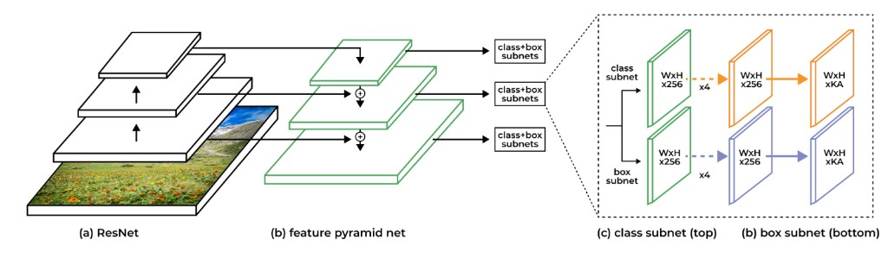

*RetinaNet: (a) ResNet backbone → (b) FPN → (c) classification subnet + (d) box subnet*

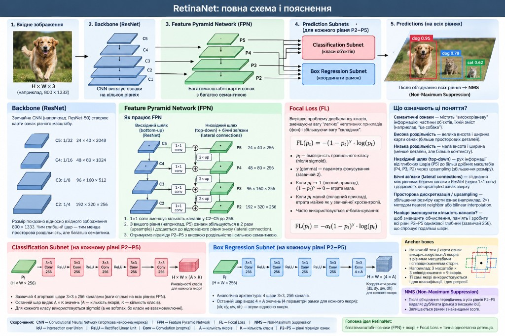

*Повна покрокова схема RetinaNet: вхідне зображення → ResNet (C2–C5) → FPN (P2–P5) → Classification Subnet + Box Regression Subnet → NMS → фінальні детекції*

> **Примітка про схему:** в оригінальній статті RetinaNet використовує рівні **P3–P7** (P6 і P7 додаються зверху P5 через strided convolution). Схема спрощено показує P2–P5 — архітектурна логіка однакова.

**Компоненти:**

**1. Backbone: ResNet**

ResNet-50 або ResNet-101 для виділення ознак на різних рівнях. Для вхідного зображення 800×1333 (H×W×3):


| Рівень | Розмір карти ознак | Channels | Масштаб відносно входу                              |
| ------ | ------------------ | -------- | --------------------------------------------------- |
| C2     | 192 × 320          | 256      | 1/4 — висока роздільна здатність, мало семантики    |
| C3     | 96 × 160           | 512      | 1/8                                                 |
| C4     | 48 × 80            | 1024     | 1/16                                                |
| C5     | 24 × 40            | 2048     | 1/32 — низька роздільна здатність, багато семантики |


> **Зв'язок з backbone:** чим глибший шар → тим менша карта ознак, але тим більше каналів і багатша семантика (модель «розуміє» складніші ознаки).

**2. Feature Pyramid Network (FPN)**

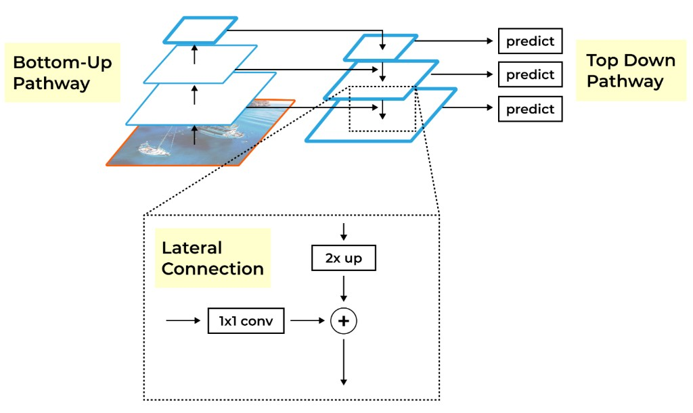

*FPN: знизу вверх (низькорівневі ознаки) + зверху вниз (семантичні ознаки) + бокові зв'язки*

Оригінальна стаття FPN: [тема_7/Feature_Pyramid_Network.pdf](Feature_Pyramid_Network.pdf)

**FPN (Feature Pyramid Network)** вирішує проблему виявлення об'єктів різних масштабів.

**Bottom-Up Pathway (висхідний шлях):**

- Звичайне проходження через ResNet
- На кожному рівні отримуємо карту ознак з різною роздільною здатністю
- Нижні рівні = висока роздільна здатність + слабка семантика
- Верхні рівні = низька роздільна здатність + сильна семантика

**Top-Down Pathway (низхідний шлях) + Lateral Connections:**

- Починаємо з верхнього (семантично сильного) рівня C5
- `1×1 conv` зменшує кількість каналів у C2–C5 до **256**
- З вищого рівня (наприклад, P5) ознаки збільшуються у 2 рази (upsampling)
- Поелементно додаються (`⊕`) до lateral connection з відповідного нижнього рівня
- Результат: карта ознак з **семантикою** (зверху) + **деталями** (знизу)

```
C5 → 1×1 conv → P5 (24×40×256)
                    ↓ 2× up
C4 → 1×1 conv → ⊕ → P4 (48×80×256)
                    ↓ 2× up
C3 → 1×1 conv → ⊕ → P3 (96×160×256)
                    ↓ 2× up
C2 → 1×1 conv → ⊕ → P2 (192×320×256)
```

**Результат:** карти ознак P2–P5, кожна **256 channels**, різна роздільна здатність, кожна семантично сильна → виявлення об'єктів усіх розмірів.

> **Навіщо 1×1 conv зменшує канали?** Щоб зробити всі рівні P2–P5 однакової глибини (256), що спрощує подальші шари.

**3. Anchor Boxes**

На кожній точці карт ознак — A якорів з різними масштабами і співвідношеннями сторін:

- 3 масштаби × 3 співвідношення сторін = **9 якорів на позицію**
- Ці самі якорі використовуються для classification і regression subnets

**4. Classification Subnet (підмережа класифікації)**

```
Pᵢ (H × W × 256)
   ↓
4 × Conv 3×3, 256ch, ReLU
   ↓
Conv 3×3, A×K ch
   ↓
H × W × (A × K)   ← ймовірності класів для кожного якоря
```

- Однакова архітектура (спільні ваги) на **всіх рівнях** FPN
- Останній шар видає A×K значень (A — кількість якорів, K — кількість класів)
- Активація — **sigmoid** (не softmax), бо класи **не взаємовиключні** (один об'єкт може бути і "dog" і "animal")

**5. Box Regression Subnet (підмережа регресії)**

```
Pᵢ (H × W × 256)
   ↓
4 × Conv 3×3, 256ch, ReLU
   ↓
Conv 3×3, 4×A ch
   ↓
H × W × (4 × A)   ← координати рамок (dx, dy, dw, dh) для кожного якоря
```

Аналогічна архітектура: 4 шари 3×3, 256. Останній шар — 4×A координати (зсуви відносно якоря).

#### Focal Loss

Головна інновація RetinaNet — функція втрат **Focal Loss**.

> **Назва:** "focal" = **focus / зосередження** (не геометричний фокус). Ідея: функція втрат **фокусується** на складних прикладах і майже ігнорує легкі.

---

##### Крок 0. Що таке Cross-Entropy (CE)

Перш ніж розуміти Focal Loss, потрібно зрозуміти Cross-Entropy — вона є його основою.

**Cross-entropy** вимірює, наскільки передбачені моделлю ймовірності відрізняються від правильної відповіді. Для правильного класу:

```
CE = -log(pₜ)
```

де `pₜ` — ймовірність, яку модель дала **правильному** класу.

**Числовий приклад.** Правильний клас — `cat`:

```
Приклад A (модель впевнена):        Приклад B (модель плутається):
cat = 0.9                            cat = 0.1
dog = 0.07                           dog = 0.8
car = 0.03                           car = 0.1

CE = -log(0.9) ≈ 0.105  ← малий    CE = -log(0.1) ≈ 2.303  ← великий
```

Тобто CE великий, коли модель **помиляється або сумнівається**, і малий — коли **впевнена і права**.

---

##### Крок 0.5. Що таке логарифм у цьому контексті

Логарифм відповідає на питання: **до якого степеня треба піднести основу, щоб отримати це число?**

У ML зазвичай натуральний логарифм (основа `e ≈ 2.718`). Для ймовірностей від 0 до 1 — він завжди **від'ємний**, тому перед ним стоїть мінус:

```
-log(0.99) ≈ 0.01   ← дуже малий: модель майже ідеальна
-log(0.9)  ≈ 0.105
-log(0.5)  ≈ 0.693
-log(0.1)  ≈ 2.303
-log(0.01) ≈ 4.605  ← дуже великий: модель впевнено помилилась
```

Саме тому CE добре **карає впевнені помилки** — чим менше `pₜ`, тим більший loss.

---

##### Крок 1. Формула Focal Loss

**Базова форма:**
```
FL(pₜ) = -(1 - pₜ)^γ · log(pₜ)
```

**З α-балансуванням (використовується на практиці):**
```
FL(pₜ) = -αₜ · (1 - pₜ)^γ · log(pₜ)
```

де:
- **pₜ** — ймовірність правильного класу (після sigmoid)
- **γ (gamma)** — **гіперпараметр** фокусування, зазвичай γ=2 (задається вручну, не вчиться)
- **(1-pₜ)^γ** — **штучно введений weighting factor** (модулюючий множник)
- **αₜ** — ваговий коефіцієнт для балансування позитивних/негативних прикладів (часто α=0.25)

Focal Loss — це Cross-Entropy, до якої **додали** множник `(1-pₜ)^γ`:
```
FL = (1 - pₜ)^γ  ×  CE
         ↑               ↑
  зменшує легкі    звична cross-entropy
```

---

##### Крок 2. Як працює модулюючий множник

**Легкий приклад** (модель вже добре його класифікує, `pₜ` велике):
```
pₜ = 0.95, γ = 2:
(1 - 0.95)² = 0.05² = 0.0025   ← множник дуже малий
```
Loss цього прикладу множиться на `0.0025` → майже не впливає на навчання.

**Складний приклад** (модель плутається, `pₜ` мале):
```
pₜ = 0.20, γ = 2:
(1 - 0.20)² = 0.80² = 0.64   ← множник великий
```
Loss майже не пригнічується → приклад залишається важливим.

**Підсумок:**
```
pₜ близьке до 1  →  (1-pₜ)^γ → 0  →  loss "гаситься"    →  легкий приклад ігнорується
pₜ мале          →  (1-pₜ)^γ → 1  →  loss майже не змінюється  →  складний залишається важливим
```

> **Важливе уточнення:** γ **зменшує вагу легких прикладів**, а не напряму "збільшує штраф" за складні. Складні приклади залишаються важливими тому, що їх НЕ пригнічують.

---

##### Крок 3. Easy і Hard examples

| | Що це | Приклад у детекції |
|---|---|---|
| **Easy example** | Модель впевнена і права (`pₜ ≈ 0.99`) | Чисте небо → "background", стіна без об'єктів → "background" |
| **Hard example** | Модель сумнівається або помиляється (`pₜ ≈ 0.1–0.3`) | Дрібний об'єкт, частково перекритий, або незвичний кут |

У RetinaNet є тисячі **easy background** ділянок. При звичайній CE їхня сумарна помилка **домінує** просто через кількість, і модель «лінується» на складних об'єктах. Focal Loss вирішує це:

> «Не витрачай стільки уваги на фон, який ти вже добре розпізнаєш. Зосередься на складних об'єктах.»

---

##### Крок 4. Роль γ

| γ | Ефект |
|---|---|
| γ = 0 | FL ≡ Cross Entropy (множник = 1, нічого не змінюється) |
| γ = 1 | Легкі приклади приглушуються помірно |
| γ = 2 | Легкі приглушуються суттєво — **рекомендоване значення** у RetinaNet |
| γ > 2 | Ще сильніше ігнорує легкі; ризик пропустити деякі корисні сигнали |

---

**Порівняння CE Loss та Focal Loss:**

| | Cross Entropy | Focal Loss (γ=2) |
|---|---|---|
| Легкий фоновий приклад (pₜ=0.9) | Все ще вносить loss | Loss ≈ 0 |
| Складний об'єкт (pₜ=0.1) | Вносить loss | Вносить ще більший відносний loss |
| **Результат** | Домінує фон | Фокус на важких прикладах |


#### Переваги RetinaNet


| Перевага                      | Пояснення                                          |
| ----------------------------- | -------------------------------------------------- |
| Focal Loss                    | Ефективно справляється з дисбалансом класів        |
| FPN (Feature Pyramid Network) | Виявляє об'єкти різних масштабів на одному проході |
| Одноетапний                   | Швидший за двоетапні при порівнянній точності      |


---

---

## ПІДСУМОК ЧАСТИН 1–3. ПОРІВНЯННЯ АРХІТЕКТУР

### Загальна порівняльна таблиця

| Архітектура | Тип | Основна структура | Як знаходить області | Що особливого | Сильна сторона | Слабка сторона |
|---|---|---|---|---|---|---|
| **R-CNN** | двоетапна | Selective Search → CNN для кожної області → classifier + box regressor | Selective Search | Кожен proposal окремо проганяється через CNN | Історично важлива, точніша за старі методи | Дуже повільна |
| **Fast R-CNN** | двоетапна | Image → CNN → feature map → proposals → ROI Pooling → classifier + box regressor | Selective Search | CNN рахується один раз для всього зображення | Значно швидша за R-CNN | Selective Search все ще bottleneck |
| **Faster R-CNN** | двоетапна | Image → backbone CNN → feature map → **RPN** → ROI Pooling → Fast R-CNN head | **RPN + anchors** | Генерація proposals стала частиною нейромережі | Висока точність | Зазвичай повільніша за one-stage моделі |
| **YOLO** | одноетапна | Image → CNN/backbone → detection head → boxes + classes → NMS | Без окремого proposal stage | Все прогнозує за один прохід | Дуже швидка, real-time | Ранні YOLO гірше працювали з малими/щільними об'єктами |
| **RetinaNet** | одноетапна | Image → ResNet backbone → **FPN** → classification subnet + box regression subnet → NMS | Anchors на рівнях FPN | **Focal Loss** + FPN | Хороший баланс швидкість/точність, добре при дисбалансі background/object | Складніша за базовий YOLO |

---

### Що в них спільного

Майже всі сучасні детектори мають одну базову ідею:

```
IMAGE
  ↓
CNN / BACKBONE        ← витягує ознаки (краї, текстури, форми)
  ↓
FEATURE MAPS
  ↓
визначити:
- де об'єкт?          ← localization / box regression
- що це за об'єкт?   ← classification
  ↓
BOUNDING BOX + CLASS
```

Тобто всі вони роблять дві задачі:
1. **Classification** — що це?
2. **Localization / Box regression** — де це?

**Backbone у всіх виконує одну функцію:**

```
pixels → edges → textures → shapes → higher-level features
```

Перетворити зображення на **feature maps**. Конкретна архітектура (ResNet, VGG, Darknet) — деталь реалізації.

---

### Головна різниця: one-stage vs two-stage

```
Two-stage (Faster R-CNN):        One-stage (YOLO, RetinaNet):

Image                             Image
  ↓                                 ↓
Backbone                          CNN / Backbone
  ↓                                 ↓
RPN                              Feature maps
  ↓                                 ↓
Region proposals               boxes + classes (одразу)
  ↓
Classifier + box regression
```

- **Two-stage**: спочатку «де приблизно є об'єкти?», потім «що це?» → точніше, але повільніше
- **One-stage**: один прохід, все одразу → швидше, але складніше збалансувати точність

---

### Еволюція R-CNN → Fast R-CNN → Faster R-CNN

Найпростіша мнемоніка:

```
R-CNN
  CNN запускається окремо для кожного з ~2000 proposals
  → дуже повільно
       ↓
Fast R-CNN
  CNN рахується один раз для всього зображення
  Але Selective Search залишився (зовнішній, повільний)
       ↓
Faster R-CNN
  Прибрали Selective Search
  Замінили на RPN — нейромережа сама знаходить proposals
  → повністю end-to-end
```

---

### Хто що додав — коротка шпаргалка

| Модель | Головна ідея |
|---|---|
| **R-CNN** | CNN для region proposals |
| **Fast R-CNN** | CNN один раз + ROI Pooling |
| **Faster R-CNN** | RPN замість Selective Search |
| **YOLO** | усе детектувати за один прохід |
| **RetinaNet** | one-stage + FPN + Focal Loss |

---

### Якщо вибирати концептуально

| Потреба | Типовий вибір |
|---|---|
| Максимальна точність важливіша за швидкість | **Faster R-CNN** |
| Real-time / швидка детекція | **YOLO** |
| One-stage + хороший баланс accuracy/speed | **RetinaNet / YOLO-сімейство** |
| Багато об'єктів різного масштабу | **RetinaNet з FPN** |
| Вивчити еволюцію object detection | **R-CNN → Fast → Faster** |

---

## ЧАСТИНА 4. ПОРІВНЯННЯ МОДЕЛЕЙ

### Еталонний датасет: COCO

**COCO (Common Objects in Context)** — стандартний датасет для порівняння детекторів:

- ~330,000 зображень, 80 класів
- Кожне зображення — кілька об'єктів різних розмірів
- Анотації: bounding boxes, маски сегментації, ключові точки

### Метрика: mAP (mean Average Precision)

**mAP = mean Average Precision** — загальна назва метрики для object detection. Залежно від того, що оцінюється:

- **Box mAP** — якість bounding boxes (стандарт для детекції)
- **Mask mAP** — якість segmentation masks (наприклад, у Mask R-CNN)

> Якщо модель робить лише детекцію рамок — `mAP` і `Box mAP` фактично означають одне й те саме.

**Коротко:** Box mAP = наскільки добре модель одночасно **знаходить правильні класи** об'єктів і **правильно ставить навколо них bounding boxes**.

---

#### Рівень 1. Чи правильна конкретна детекція — IoU і threshold

Для кожної передбаченої рамки рахуємо **IoU** з ground truth:

```
IoU = intersection / union
```

Якщо встановлений поріг `IoU ≥ 0.5`:
- перекриття достатнє → **True Positive (TP)**
- перекриття замале → **False Positive (FP)**

---

#### Рівень 2. Precision і Recall для одного класу

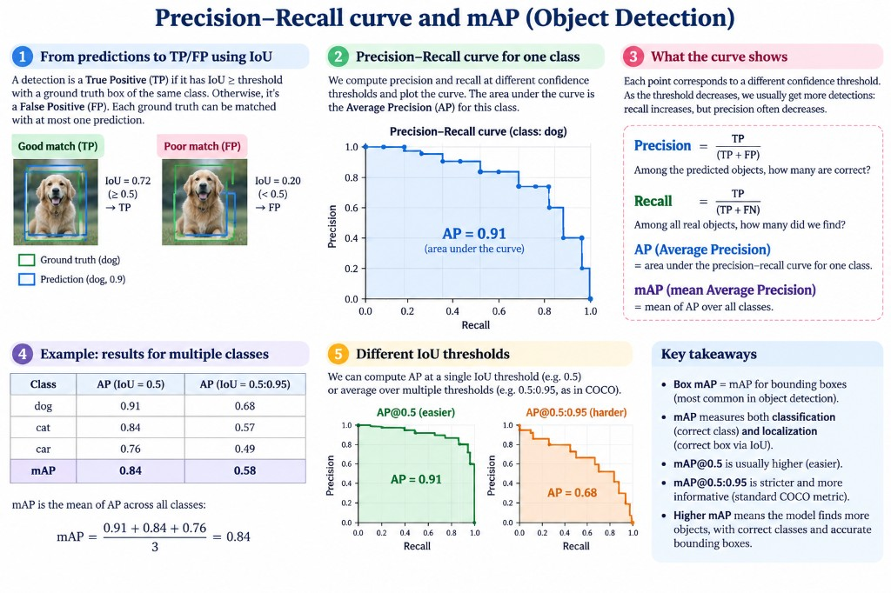

*Повна схема: IoU → TP/FP → Precision-Recall крива → AP (площа під кривою) → mAP по класах → різні IoU пороги*

| Термін | Формула | Значення |
|---|---|---|
| **True Positive (TP)** | IoU ≥ поріг, правильний клас | Модель правильно знайшла об'єкт |
| **False Positive (FP)** | Рамка є, але IoU < порогу або неправильний клас | Хибне спрацювання |
| **False Negative (FN)** | Об'єкт є, але модель його пропустила | Пропуск об'єкта |

```
Precision = TP / (TP + FP)
```
> Серед того, що модель назвала собакою — скільки справді собак?

```
Recall = TP / (TP + FN)
```
> Серед усіх реальних собак — скільки модель знайшла?

**Як зміна confidence threshold впливає на Precision і Recall:**
- Знижуємо поріг → модель знаходить більше об'єктів → **Recall** зростає, але більше хибних → **Precision** падає
- Підвищуємо поріг → модель обережніша → **Precision** зростає, але пропускає більше → **Recall** падає

Precision і Recall рахуються при **різних confidence thresholds** → будується **Precision–Recall крива**.

**AP (Average Precision)** для одного класу = **площа під цією кривою**.

---

#### AP як інтеграл (і як він рахується на практиці)

Концептуально AP — це інтеграл:

```
AP = ∫₀¹ Precision(Recall) dRecall
```

Але крива складається з дискретних точок (по одній на кожен confidence threshold), тому на практиці площу рахують **чисельно** — як суму прямокутних ділянок:

```
AP ≈ Σ Precisionᵢ × (Recallᵢ - Recallᵢ₋₁)
```

де `(Recallᵢ - Recallᵢ₋₁)` — **ширина** ділянки по осі Recall, `Precisionᵢ` — **висота**.

**Числовий приклад:**

| Recall | Precision | Ширина ділянки (ΔRecall) | Внесок у AP |
|---|---|---|---|
| 0.2 | 1.0 | 0.2 - 0 = **0.2** | 1.0 × 0.2 = 0.200 |
| 0.5 | 0.9 | 0.5 - 0.2 = **0.3** | 0.9 × 0.3 = 0.270 |
| 0.8 | 0.7 | 0.8 - 0.5 = **0.3** | 0.7 × 0.3 = 0.210 |
| 1.0 | 0.5 | 1.0 - 0.8 = **0.2** | 0.5 × 0.2 = 0.100 |
| | | **Сума** | **AP ≈ 0.78** |

> **AP ≈ 0.78** — модель знаходить об'єкти добре, але не ідеально.

> **Важливий нюанс:** COCO використовує інтерпольовану Precision–Recall криву і оцінює precision у **101 recall point** від 0 до 1 — тому значення можуть трохи відрізнятись від наївного підрахунку.

---

#### Рівень 3. mAP — середнє AP по всіх класах

```
AP per class:
  dog → AP = 0.91
  cat → AP = 0.84
  car → AP = 0.76

mAP = (0.91 + 0.84 + 0.76) / 3 = 0.84  →  mAP = 84%
```

```
mAP = (1/C) × (AP₁ + AP₂ + ... + APc)
```

Назва буквально розкладається:
> **Precision → Average Precision для одного класу → mean Average Precision по класах**

---

#### mAP@0.5 vs mAP@0.5:0.95

| Метрика | Що означає | Суворість |
|---|---|---|
| **mAP@0.5** | Детекція правильна, якщо IoU ≥ 0.5 | М'який критерій |
| **mAP@0.5:0.95** | AP усереднюється по IoU від 0.50 до 0.95 з кроком 0.05 | Суворий критерій COCO |

**mAP@0.5:0.95** рахується при 10 різних порогах IoU: `0.50, 0.55, 0.60, ..., 0.95` — потім усереднюється. Модель має не лише знайти клас, а й **дуже точно поставити bounding box**.

**Числовий приклад з таблицею по класах (@0.5 vs @0.5:0.95):**

| Клас | AP (IoU = 0.5) | AP (IoU = 0.5:0.95) |
|---|---|---|
| dog | 0.91 | 0.68 |
| cat | 0.84 | 0.57 |
| car | 0.76 | 0.49 |
| **mAP** | **0.84** | **0.58** |

Різниця між `0.84` і `0.58` — цілком нормальна: перша каже «об'єкти знаходить добре», друга «але рамки не завжди дуже точні».

---

### Тенденції розвитку

З виходом нових архітектур:

- **Точність** (mAP) стабільно зростає від покоління до покоління
- **Швидкість** (FPS) покращується за рахунок ефективніших backbone і архітектурних рішень
- **YOLO-сімейство** залишається лідером у балансі швидкість/точність для edge-застосувань
- **Двоетапні підходи** (Cascade R-CNN та ін.) домінують у точності там, де швидкість не критична

---

## ЧАСТИНА 5. ПРАКТИКА — ВСТАНОВЛЕННЯ ТА КОНФІГУРАЦІЯ

### Встановлення залежностей

```python
# Встановлюємо бібліотеку ultralytics для роботи з YOLO
# --upgrade гарантує встановлення останньої версії
!pip install --upgrade ultralytics

# ray[tune] — бібліотека для розподіленого підбору гіперпараметрів (потрібна в темі 14)
!pip install --upgrade -U "ray[tune]"
```

> **Що встановлюється:** разом з `ultralytics` автоматично встановлюються `torch`, `torchvision`, `opencv-python`, `pyyaml` та інші залежності.

### Імпорт бібліотек

```python
import warnings
warnings.filterwarnings("ignore")  # Вимикаємо попередження — щоб вивід був чистішим

import os       # Робота з файловою системою (шляхи, папки)
import re       # Регулярні вирази
import glob     # Пошук файлів за маскою
import random   # Генерація випадкових чисел (для відтворюваності)
import yaml     # Читання і запис YAML-конфігурацій

import numpy as np           # Числові операції, масиви
import pandas as pd          # Табличні дані, DataFrame

import matplotlib.pyplot as plt          # Візуалізація
from matplotlib.patches import Rectangle # Малювання прямокутників на графіках
import seaborn as sns                    # Розширена статистична візуалізація

from PIL import Image  # Завантаження і обробка зображень (Python Imaging Library)
import cv2             # OpenCV — зчитування, запис та обробка зображень

from ultralytics import YOLO  # Клас для завантаження і тренування YOLO-моделей

# Відображати графіки inline (у Jupyter/Colab)
%matplotlib inline

# Вимикаємо логування Weights & Biases (якщо wandb встановлено)
!wandb disabled
```


| Бібліотека              | Призначення                                                   |
| ----------------------- | ------------------------------------------------------------- |
| `ultralytics`           | Головний інструмент: завантаження, тренування, inference YOLO |
| `opencv-python` (`cv2`) | Читання зображень, малювання рамок, конвертація кольорів      |
| `PIL / Pillow`          | Завантаження і відображення зображень                         |
| `yaml`                  | Читання і запис конфігураційних файлів для YOLO               |
| `seaborn`               | Гарні статистичні графіки (barplot, heatmap тощо)             |


### Датасет: Construction Site Safety

Ми будемо працювати з датасетом **[Construction Site Safety](https://www.kaggle.com/datasets/snehilsanyal/construction-site-safety-image-dataset-roboflow)** — зображення будівельних майданчиків з анотаціями для детекції засобів безпеки.

**Класи (10 штук):**


| ID  | Клас           | Опис                 |
| --- | -------------- | -------------------- |
| 0   | Hardhat        | Каска (є)            |
| 1   | Mask           | Маска (є)            |
| 2   | NO-Hardhat     | Без каски            |
| 3   | NO-Mask        | Без маски            |
| 4   | NO-Safety Vest | Без захисного жилета |
| 5   | Person         | Людина               |
| 6   | Safety Cone    | Конус безпеки        |
| 7   | Safety Vest    | Захисний жилет (є)   |
| 8   | machinery      | Техніка              |
| 9   | vehicle        | Транспортний засіб   |


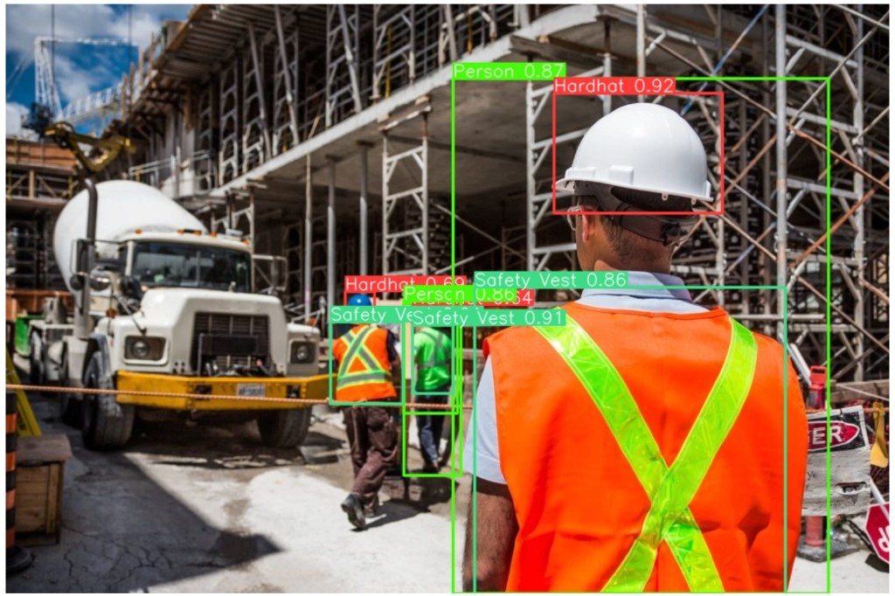

*Реальний приклад детекції: особи з касками (Hardhat), захисними жилетами (Safety Vest) та без*

**Формат анотацій (YOLO format):**

Кожна рядок у `.txt` файлі: `class_id center_x center_y width height`

де всі координати нормалізовані від 0 до 1 відносно розміру зображення.

```
5 0.512 0.348 0.256 0.620   # Person: центр (0.512, 0.348), ширина 0.256, висота 0.620
0 0.483 0.172 0.148 0.215   # Hardhat: менший об'єкт у верхній частині
```

**Структура директорій:**

```
тема_7/
├── train/
│   ├── images/    ← 2605 зображень для навчання
│   └── labels/    ← анотації у форматі YOLO
├── valid/
│   ├── images/    ← 114 зображень для валідації
│   └── labels/
└── test/
    ├── images/    ← 82 зображення для фінального тестування
    └── labels/
```

### Клас конфігурацій CFG

```python
class CFG:
    """
    Клас-контейнер для всіх гіперпараметрів і налаштувань тренування.
    Зберігання конфігурацій в одному місці полегшує відтворюваність і зміну параметрів.
    """
    
    # --- Режим дебагу ---
    DEBUG = False  # True: швидкі тести на малій частині датасету; False: повне тренування
    FRACTION = 0.05 if DEBUG else 1.0  # Частка датасету для тренування (5% у debug)
    SEED = 42  # Зафіксований seed для відтворюваності результатів
    
    # --- Класи ---
    CLASSES = [
        'Hardhat', 'Mask', 'NO-Hardhat', 'NO-Mask',
        'NO-Safety Vest', 'Person', 'Safety Cone',
        'Safety Vest', 'machinery', 'vehicle'
    ]  # Список назв класів у порядку відповідно до анотацій
    NUM_CLASSES_TO_TRAIN = len(CLASSES)  # 10 — кількість класів
    
    # --- Параметри тренування ---
    EPOCHS = 3 if DEBUG else 70  # Кількість епох; 70 — для повного тренування
    BATCH_SIZE = 8   # Кількість зображень в одному батчі; 16 при більшій GPU-пам'яті
    
    # --- Модель ---
    BASE_MODEL = 'yolov9e'  # Вибір архітектури: yolov8n/s/m/l/x, yolov9c/e
    BASE_MODEL_WEIGHTS = f'{BASE_MODEL}.pt'  # Файл ваг: автозавантажується при першому запуску
    EXP_NAME = f'ppe_css_{EPOCHS}_epochs'  # Назва експерименту для збереження результатів
    
    # --- Оптимізатор та навчання ---
    OPTIMIZER = 'auto'     # auto: ultralytics обирає оптимізатор; або SGD/Adam/AdamW тощо
    LR = 1e-3              # Початковий learning rate (lr0)
    LR_FACTOR = 0.01       # Кінцевий lr = LR * LR_FACTOR → поступове зменшення
    WEIGHT_DECAY = 5e-4    # L2-регуляризація: штраф за великі ваги (запобігає overfitting)
    DROPOUT = 0.0          # Dropout rate: 0.0 — вимкнено
    PATIENCE = 20          # Early stopping: зупинити якщо 20 епох без покращення
    PROFILE = False        # Профілювання швидкості шарів (для дебагу)
    LABEL_SMOOTHING = 0.0  # Label smoothing: розм'якшення міток (0.0 — вимкнено)
    
    # --- Шляхи ---
    CUSTOM_DATASET_DIR = './тема_7/'
    OUTPUT_DIR = './'  # Куди зберігати data.yaml і результати тренування
```


| Параметр       | Тип     | Значення | Навіщо                                            |
| -------------- | ------- | -------- | ------------------------------------------------- |
| `DEBUG`        | `bool`  | `False`  | Швидке тестування на 5% даних                     |
| `EPOCHS`       | `int`   | 70       | Кількість повних проходів по датасету             |
| `BATCH_SIZE`   | `int`   | 8        | Скільки зображень оновлюють ваги одночасно        |
| `OPTIMIZER`    | `str`   | `'auto'` | Алгоритм оптимізації (SGD, Adam тощо)             |
| `LR`           | `float` | `1e-3`   | Крок навчання — наскільки сильно оновлювати ваги  |
| `PATIENCE`     | `int`   | 20       | Early stopping — зупинка при відсутності прогресу |
| `WEIGHT_DECAY` | `float` | `5e-4`   | L2-регуляризація проти overfitting                |


### Створення data.yaml

YOLO потребує конфігураційний файл у форматі YAML, де вказані шляхи до даних і класи.

```python
# Формуємо словник з усіма необхідними полями для YOLO
dict_file = {
    'train': os.path.join(CFG.CUSTOM_DATASET_DIR, 'train'),  # Шлях до train зображень
    'val':   os.path.join(CFG.CUSTOM_DATASET_DIR, 'valid'),  # Шлях до validation зображень
    'test':  os.path.join(CFG.CUSTOM_DATASET_DIR, 'test'),   # Шлях до test зображень
    'nc':    CFG.NUM_CLASSES_TO_TRAIN,                        # Кількість класів (nc = num_classes)
    'names': CFG.CLASSES                                      # Список назв класів
}

# Записуємо словник у файл data.yaml у директорії виводу
with open(os.path.join(CFG.OUTPUT_DIR, 'data.yaml'), 'w+') as file:
    yaml.dump(dict_file, file)
```

> **Що зберігається:** файл `data.yaml` містить всю необхідну метаінформацію для YOLO. Ultralytics автоматично зчитає цей файл при тренуванні.

```python
# Функція для зчитування YAML файлу
def read_yaml_file(file_path=CFG.CUSTOM_DATASET_DIR):
    with open(file_path, 'r') as file:
        try:
            data = yaml.safe_load(file)  # safe_load — безпечна альтернатива yaml.load()
            return data
        except yaml.YAMLError as e:
            print("Error reading YAML:", e)
            return None

# Функція для красивого виведення YAML
def print_yaml_data(data):
    formatted_yaml = yaml.dump(data, default_style=False)  # default_style=False → читабельний формат
    print(formatted_yaml)

# Зчитуємо і виводимо створений файл
file_path = os.path.join(CFG.OUTPUT_DIR, 'data.yaml')
yaml_data = read_yaml_file(file_path)

if yaml_data:
    print_yaml_data(yaml_data)
```

**Очікуваний вивід:**

```yaml
names:
- Hardhat
- Mask
- NO-Hardhat
- NO-Mask
- NO-Safety Vest
- Person
- Safety Cone
- Safety Vest
- machinery
- vehicle
nc: 10
test: ./тема_7/test
train: ./тема_7/train
val: ./тема_7/valid
```

**Як інтерпретувати:** `nc: 10` — модель навчатиметься розрізняти 10 класів. Шляхи `train/val/test` вказують, де шукати зображення і анотації.

---

## ЧАСТИНА 6. ПРАКТИКА — ДОСЛІДЖЕННЯ ДАНИХ (EDA)

### Завантаження і відображення прикладу зображення

```python
def display_image(image, print_info=True, hide_axis=False):
    """
    Відображає зображення — приймає як шлях до файлу, так і NumPy-масив.
    
    image:      str (шлях) або np.ndarray (масив пікселів)
    print_info: bool — виводити тип і розмір зображення
    hide_axis:  bool — приховати осі координат на графіку
    """
    if isinstance(image, str):       # Якщо передано шлях до файлу
        img = Image.open(image)       # Відкриваємо зображення через Pillow
        plt.imshow(img)               # Відображаємо на графіку
    elif isinstance(image, np.ndarray):  # Якщо передано масив NumPy (наприклад, від OpenCV)
        image = image[..., ::-1]      # Конвертуємо BGR → RGB (OpenCV зберігає в BGR!)
        img = Image.fromarray(image)  # Перетворюємо масив у PIL Image
        plt.imshow(img)
    else:
        raise ValueError("Unsupported image format")  # Невідомий формат

    if print_info:
        print('Type: ', type(img), '\n')
        print('Shape: ', np.array(img).shape, '\n')  # (висота, ширина, канали)

    if hide_axis:
        plt.axis('off')  # Вимикаємо осі — для чистішого відображення
    
    plt.show()


# Відображаємо конкретне тренувальне зображення
example_image_path = (
    CFG.CUSTOM_DATASET_DIR +
    'train/images/-2297-_png_jpg.rf.9fff3740d864fbec9cda50d783ad805e.jpg'
)
display_image(example_image_path, print_info=True, hide_axis=False)
```


| Параметр     | Тип                    | Опис                                                |
| ------------ | ---------------------- | --------------------------------------------------- |
| `image`      | `str` або `np.ndarray` | Шлях до файлу або вже завантажений масив зображення |
| `print_info` | `bool`                 | Якщо `True` — виводить тип і форму масиву           |
| `hide_axis`  | `bool`                 | Якщо `True` — прибирає осі з графіка                |


**Очікуваний вивід:**

```
Type:  <class 'PIL.JpegImagePlugin.JpegImageFile'>

Shape:  (640, 640, 3)
```

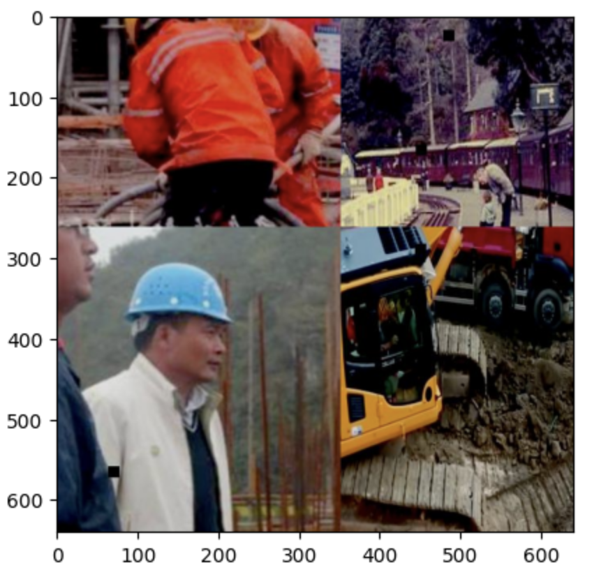

**Як інтерпретувати:** зображення 640×640 пікселів, 3 канали (RGB). Всі зображення однакового розміру (640×640) — стандарт для YOLO.

---

### Зчитування властивостей зображення

```python
def get_image_properties(image_path):
    """
    Повертає словник із властивостями зображення.
    
    image_path: str — шлях до файлу зображення
    Повертає: dict з ключами width, height, channels, dtype
    """
    img = cv2.imread(image_path)  # cv2 зчитує зображення як NumPy масив BGR

    if img is None:
        raise ValueError("Could not read image file")  # Файл не знайдено або пошкоджено

    properties = {
        "width":    img.shape[1],                                 # Ширина в пікселях
        "height":   img.shape[0],                                 # Висота в пікселях
        "channels": img.shape[2] if len(img.shape) == 3 else 1,  # 3 для RGB, 1 для grayscale
        "dtype":    img.dtype,                                    # Тип даних (uint8: 0–255)
    }
    return properties

img_properties = get_image_properties(example_image_path)
print(img_properties)
```

**Очікуваний вивід:**

```python
{'width': 640, 'height': 640, 'channels': 3, 'dtype': dtype('uint8')}
```

**Як інтерпретувати:**

- `width=640, height=640` — квадратне зображення, готове до подачі в YOLO
- `channels=3` — RGB (кольорове)
- `dtype=uint8` — кожен піксель кодується числом від 0 до 255

---

### Випадкова візуалізація зображень

```python
def plot_random_images_from_folder(folder_path, num_images=20, seed=CFG.SEED):
    """
    Відображає сітку випадково обраних зображень з теки.
    
    folder_path: str — шлях до теки із зображеннями
    num_images:  int — скільки зображень показати
    seed:        int — seed для відтворюваності вибірки
    """
    random.seed(seed)  # Фіксуємо seed — завжди отримуємо однакову вибірку

    # Збираємо всі файли зображень у теці за відомими розширеннями
    image_files = [
        f for f in os.listdir(folder_path)
        if f.endswith(('.jpg', '.png', '.jpeg', '.gif'))
    ]

    if len(image_files) < num_images:
        raise ValueError("Not enough images in the folder")

    # Випадково обираємо num_images файлів (без повторення)
    selected_files = random.sample(image_files, num_images)

    # Розраховуємо розміри сітки: 5 стовпців, решта — рядки
    num_cols = 5
    num_rows = (num_images + num_cols - 1) // num_cols  # Округлення вгору
    fig, axes = plt.subplots(num_rows, num_cols, figsize=(12, 8))

    for i, file_name in enumerate(selected_files):
        img = Image.open(os.path.join(folder_path, file_name))

        # Вибираємо правильну вісь залежно від кількості рядків
        if num_rows == 1:
            ax = axes[i % num_cols]
        else:
            ax = axes[i // num_cols, i % num_cols]

        ax.imshow(img)
        ax.axis('off')  # Прибираємо осі — зображення без зайвих елементів

    # Видаляємо порожні підграфіки (якщо кількість не кратна num_cols)
    for i in range(num_images, num_rows * num_cols):
        if num_rows == 1:
            fig.delaxes(axes[i % num_cols])
        else:
            fig.delaxes(axes[i // num_cols, i % num_cols])

    plt.tight_layout()  # Автоматично підлаштовує відступи між підграфіками
    plt.show()


# Показуємо 20 випадкових зображень з тренувальної вибірки
plot_random_images_from_folder(
    folder_path=CFG.CUSTOM_DATASET_DIR + 'train/images/',
    num_images=20
)
```

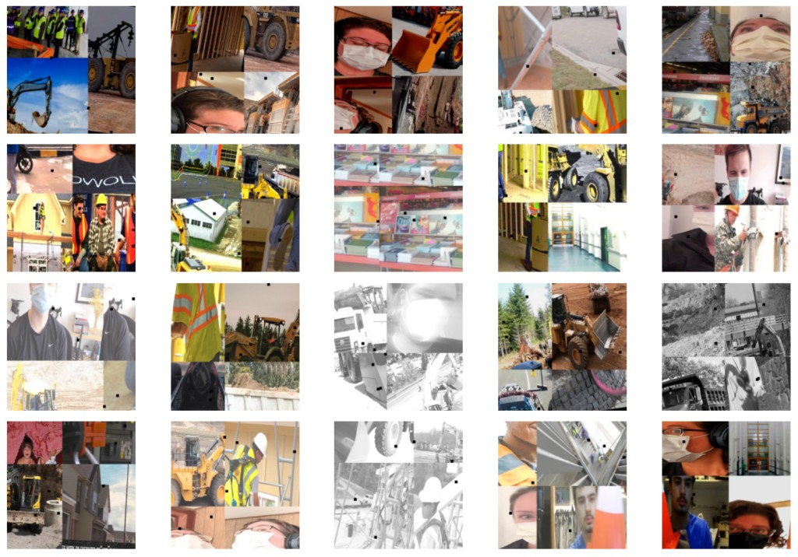

**Як інтерпретувати:** бачимо різноманітність датасету — різні кути, умови освітлення, типи об'єктів. Це важливо: чим різноманітніші тренувальні дані, тим краще модель узагальнює.

---

### Статистика класів

```python
# Словник: рядковий індекс → назва класу
class_idx = {str(i): CFG.CLASSES[i] for i in range(CFG.NUM_CLASSES_TO_TRAIN)}

class_stat = {}   # Статистика по класах для кожної вибірки
data_len = {}     # Кількість файлів у кожній вибірці
class_info = []   # Зберігаємо для DataFrame

for mode in ['train', 'valid', 'test']:
    # Ініціалізуємо лічильник по кожному класу
    class_count = {CFG.CLASSES[i]: 0 for i in range(CFG.NUM_CLASSES_TO_TRAIN)}
    
    path = os.path.join(CFG.CUSTOM_DATASET_DIR, mode, 'labels')

    for file in os.listdir(path):
        with open(os.path.join(path, file)) as f:
            lines = f.readlines()  # Кожна рядок = один об'єкт на зображенні
            
            # line[0] — перший символ рядка = клас (YOLO формат: клас x y w h)
            # set() — уникаємо повторного рахунку одного класу двічі на одному зображенні
            for cls in set([line[0] for line in lines]):
                class_count[class_idx[cls]] += 1

    data_len[mode] = len(os.listdir(path))
    class_stat[mode] = class_count
    class_info.append({'Mode': mode, **class_count, 'Data_Volume': data_len[mode]})

# Зберігаємо у DataFrame для зручного аналізу
dataset_stats_df = pd.DataFrame(class_info)

with pd.option_context('display.max_columns', None):  # Показуємо всі стовпці
    display(dataset_stats_df)
```

**Очікуваний вивід:**

```
   Mode  Hardhat  Mask  NO-Hardhat  NO-Mask  NO-Safety Vest  Person  Safety Cone  Safety Vest  machinery  vehicle  Data_Volume
0  train     1314  1096        1380     1531            1864    2526          631         1319       2101      744         2605
1  valid       42    19          37       44              56      84           13           28         26       16          114
2  test        30    16          25       30              36      59            8           22         22       15           82
```

**Як інтерпретувати:**

- Найбільший клас: `Person` (2526 зображень) — на більшості фото є люди
- Найменший клас: `Safety Cone` (631) — конуси рідкісні
- Дисбаланс: `Person` у 4 рази більше за `Safety Cone` → це вплине на якість

---

### Візуалізація розподілу класів

```python
fig, axes = plt.subplots(1, 3, figsize=(15, 5))  # 3 графіки в ряд (train/valid/test)

for i, mode in enumerate(['train', 'valid', 'test']):
    sns.barplot(
        data=dataset_stats_df[dataset_stats_df['Mode'] == mode].drop(columns='Mode'),
        orient='v',      # Вертикальні стовпці
        ax=axes[i],      # Малюємо на i-й осі
        palette='Set2'   # Палітра кольорів
    )
    
    axes[i].set_title(f'{mode.capitalize()} Class Statistics')  # Заголовок
    axes[i].set_xlabel('Classes')   # Підпис осі X
    axes[i].set_ylabel('Count')     # Підпис осі Y
    axes[i].tick_params(axis='x', rotation=90)  # Назви класів вертикально (не перекриваються)

    # Додаємо числові підписи над кожним стовпцем
    for p in axes[i].patches:
        axes[i].annotate(
            f"{int(p.get_height())}",  # Значення: висота стовпця = кількість
            (p.get_x() + p.get_width() / 2., p.get_height()),  # Позиція підпису
            ha='center', va='center', fontsize=8,
            color='black', xytext=(0, 5), textcoords='offset points'
        )

plt.tight_layout()
plt.show()
```

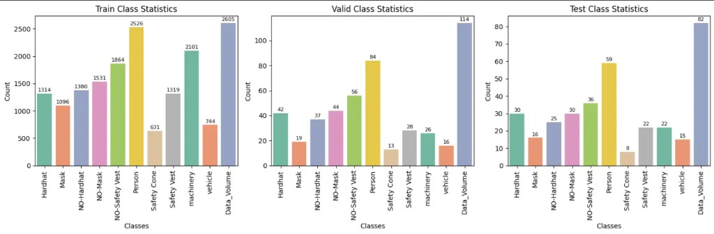

**Як інтерпретувати:**

- Дисбаланс між класами добре видно на графіку — `Person` і `machinery` домінують
- `Safety Cone` і `Mask` — найрідкісніші класи; модель матиме гірші показники по них
- Валідація та тест пропорційно менші, але з аналогічним розподілом

> **Висновок:** дисбаланс класів потрібно враховувати при аналізі метрик — загальна mAP може бути висока, але по `Safety Cone` — низька. Дивись mAP **по класах**, а не тільки загальну.

---

## ЧАСТИНА 7. ПРАКТИКА — ТЕСТУВАННЯ І ТРЕНУВАННЯ

### Тестування базової (попередньо навченої) моделі

Перш ніж тренувати, перевіримо, як поводиться YOLOv9, навчений на COCO.

```python
# Завантажуємо попередньо навчену модель YOLOv9e
# При першому запуску файл .pt автоматично завантажується з ultralytics servers
model = YOLO(CFG.BASE_MODEL_WEIGHTS)

# Запускаємо inference на тестовому зображенні
results = model.predict(
    source=example_image_path,  # Шлях до вхідного зображення
    classes=[0],                # Детектуємо тільки клас 0: Person (з COCO)
    conf=0.30,                  # Поріг впевненості: відкидаємо рамки з confidence < 0.30
    device=None,                # None = CPU; [0] = перша GPU; [0, 1] = дві GPU
    imgsz=(                     # Розмір входу для моделі (висота, ширина)
        img_properties['height'],
        img_properties['width']
    ),
    save=True,                  # Зберегти зображення з намальованими рамками
    save_txt=True,              # Зберегти анотації у форматі YOLO .txt
    save_conf=True,             # Додати confidence score до збережених анотацій
    exist_ok=True,              # Не кидати помилку, якщо директорія вже існує
)

# Відображаємо результат inference
example_image_inference_output = example_image_path.split('/')[-1]
display_image(f'runs/detect/predict/{example_image_inference_output}')
```


| Параметр   | Тип           | Значення     | Опис                                                           |
| ---------- | ------------- | ------------ | -------------------------------------------------------------- |
| `source`   | `str`         | шлях або URL | Вхідне зображення, відео або директорія                        |
| `classes`  | `list[int]`   | `[0]`        | Яким класам відповідати (за індексами COCO); `None` = всі      |
| `conf`     | `float`       | `0.30`       | Поріг впевненості; рамки нижче — відкидаються                  |
| `device`   | `None`/`list` | `None`       | Пристрій для inference; `None` = CPU                           |
| `imgsz`    | `tuple`       | `(640, 640)` | Розмір входу моделі (може відрізнятись від розміру зображення) |
| `save`     | `bool`        | `True`       | Зберігати зображення з рамками                                 |
| `save_txt` | `bool`        | `True`       | Зберігати анотації у YOLO `.txt`                               |
| `exist_ok` | `bool`        | `True`       | Не перезаписувати, якщо файли вже є                            |


**Очікуваний результат:**

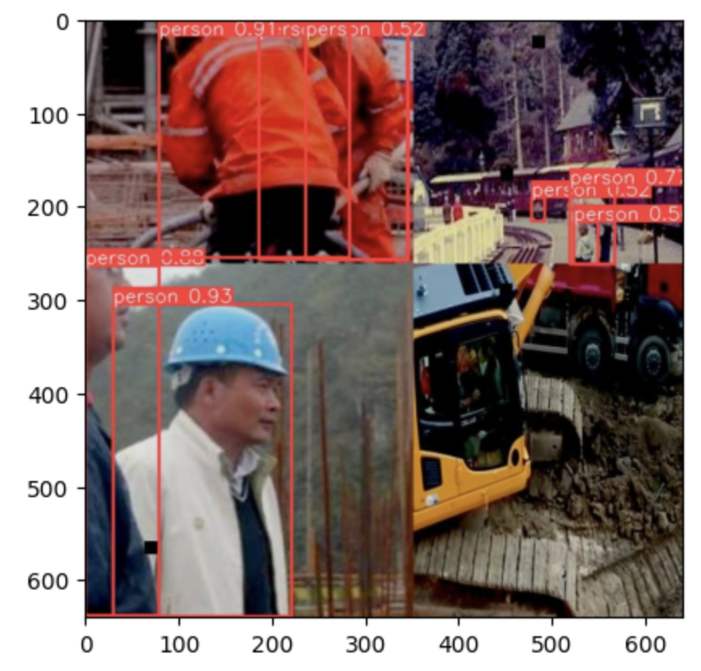

**Як інтерпретувати:** базова модель YOLOv9 (навчена на COCO) добре розпізнає клас `Person`. Але вона **не знає** про специфічні класи нашого датасету (`Hardhat`, `NO-Mask` тощо) — для цього потрібне тренування на наших даних.

---

### Тренування моделі

> **Увага:** тренування займає кілька годин. Рекомендується запускати на Kaggle або Colab з GPU. Результати зберігаються у `runs/detect/`.

```python
# Завантажуємо базову модель з претренованими вагами COCO
model = YOLO(CFG.BASE_MODEL_WEIGHTS)
```

```python
%%time   # Виміряємо час виконання тренування

model.train(
    # --- Дані ---
    data=os.path.join(CFG.OUTPUT_DIR, 'data.yaml'),  # Шлях до конфігурації датасету
    task='detect',  # Задача: 'detect' (bounding boxes), або 'segment', 'classify', 'pose'
    
    # --- Розмір вхідного зображення ---
    imgsz=(img_properties['height'], img_properties['width']),  # (640, 640)
    
    # --- Параметри навчання ---
    epochs=CFG.EPOCHS,           # Кількість епох (70 для повного тренування)
    batch=CFG.BATCH_SIZE,        # Розмір батчу (зменшити при нестачі GPU-пам'яті)
    optimizer=CFG.OPTIMIZER,     # 'auto': ultralytics підбирає автоматично
    lr0=CFG.LR,                  # Початковий learning rate: 0.001
    lrf=CFG.LR_FACTOR,           # Кінцевий lr = lr0 * lrf: 0.001 * 0.01 = 0.00001
    weight_decay=CFG.WEIGHT_DECAY,   # L2-регуляризація: 0.0005
    dropout=CFG.DROPOUT,             # Dropout: 0.0 (вимкнено)
    fraction=CFG.FRACTION,           # Частка датасету: 1.0 = всі дані
    patience=CFG.PATIENCE,           # Early stopping через 20 епох без покращення
    profile=CFG.PROFILE,             # Профілювання швидкості (False — вимкнено)
    label_smoothing=CFG.LABEL_SMOOTHING,  # Розм'якшення міток (0.0 — вимкнено)
    
    # --- Метадані ---
    name=f'{CFG.BASE_MODEL}_{CFG.EXP_NAME}',  # Назва директорії для збереження результатів
    seed=CFG.SEED,    # Seed для відтворюваності
    
    # --- Додаткові параметри ---
    val=True,         # Валідувати після кожної епохи
    amp=True,         # AMP (Automatic Mixed Precision): прискорює тренування на GPU
    exist_ok=True,    # Перезаписати директорію результатів, якщо вже існує
    resume=False,     # False = починати з нуля; True = продовжити з checkpoint
    device=[0],       # [0] — перша GPU; [0, 1] — дві GPU; None — CPU
    verbose=False,    # False — мінімальний вивід у консоль
)
```


| Параметр   | Значення        | Опис                                          |
| ---------- | --------------- | --------------------------------------------- |
| `data`     | шлях до `.yaml` | Конфігурація датасету                         |
| `task`     | `'detect'`      | Тип задачі                                    |
| `epochs`   | 70              | Кількість епох навчання                       |
| `batch`    | 8               | Батч-розмір (↓ при Out of Memory)             |
| `lr0`      | 0.001           | Початковий learning rate                      |
| `lrf`      | 0.01            | Коефіцієнт фінального lr (лінійний scheduler) |
| `patience` | 20              | Early stopping                                |
| `amp`      | `True`          | Mixed precision (FP16) — прискорення на GPU   |
| `device`   | `[0]`           | Номер GPU; `None` = CPU                       |
| `resume`   | `False`         | Продовжити перерване тренування               |


**Де знайти результати тренування:**

```
runs/detect/
└── yolov9e_ppe_css_70_epochs/
    ├── weights/
    │   ├── best.pt    ← Найкращі ваги (за val mAP)
    │   └── last.pt    ← Ваги з останньої епохи
    ├── results.csv    ← Метрики по епохах
    ├── confusion_matrix.png
    ├── PR_curve.png
    └── ...
```

> **Де знайти більше параметрів:** [docs.ultralytics.com/modes/train/](https://docs.ultralytics.com/modes/train/)

---

### Збереження моделі у форматі ONNX

```python
# Після тренування — завантажуємо найкращі ваги
model = YOLO('runs/detect/yolov9e_ppe_css_70_epochs/weights/best.pt')

# Експортуємо модель у формат ONNX
model.export(
    format='onnx',   # Цільовий формат: onnx, openvino, engine (TensorRT), tflite тощо
    imgsz=(img_properties['height'], img_properties['width']),  # Розмір входу
    half=False,      # False: FP32 (повна точність); True: FP16 (менший розмір, швидше)
    int8=False,      # False: не квантизувати до INT8
    simplify=False,  # False: не спрощувати граф ONNX (зберегти повну структуру)
    nms=False,       # False: NMS виконується поза ONNX (у постобробці)
)
```


| Параметр   | Опис                 | Коли змінювати                                           |
| ---------- | -------------------- | -------------------------------------------------------- |
| `format`   | Цільовий формат      | `'engine'` для NVIDIA (швидше), `'tflite'` для мобільних |
| `half`     | FP16 замість FP32    | Якщо GPU підтримує FP16 і важливий розмір файлу          |
| `int8`     | INT8 квантизація     | Для edge-пристроїв з обмеженнями                         |
| `simplify` | Спрощення ONNX-графу | Для оптимізації перед деплоєм                            |


**Що таке ONNX?**

**ONNX (Open Neural Network Exchange)** — відкритий формат обміну моделями машинного навчання. Він дозволяє:

- Навчити модель у **PyTorch** (Ultralytics/YOLO)
- Розгорнути у **TensorFlow, TensorRT, OpenVINO, CoreML** та інших фреймворках
- Запустити на різних платформах: сервер, мобільний пристрій, IoT-пристрій, браузер

```
PyTorch (навчання) → .pt → [model.export()] → .onnx → будь-який runtime
```

> **Після тренування** — у наступній темі ми розберемо результати та метрики якості детекції.

---

## ПІДСУМКИ

### Що ми вивчили

- **Детекція об'єктів** — задача, що поєднує класифікацію (що?) і локалізацію (де?). Вихід: набір bounding boxes з класами і координатами.
- **Двоетапні підходи:**
  - **R-CNN** — Selective Search + окрема CNN для кожного регіону + SVM. Точно, але повільно.
  - **Fast R-CNN** — одна CNN для всього зображення + ROI Pooling. Значно швидше.
  - **Faster R-CNN** — заміна Selective Search на RPN. Повністю end-to-end.
- **Одноетапні підходи:**
  - **YOLO** — S×S сітка, один прохід, формат виходу S × S × (B × 5 + C). Реальний час.
  - **RetinaNet** — FPN + Focal Loss. Вирішує дисбаланс класів в одноетапному підході.
- **Ключові компоненти:**
  - **IoU** — метрика перекриття рамок: IoU = Overlap / Union
  - **Loss YOLO** = `L_coord + L_obj + L_class`
  - **NMS** — прибирає дублікати рамок, залишає найвпевненіші
  - **ROI Pooling** — нормалізує регіони різних розмірів до фіксованого тензора
  - **Anchor Boxes** — шаблони рамок різних форм і розмірів
  - **FPN** — піраміда ознак для виявлення об'єктів різних масштабів
  - **Focal Loss** — фокусує навчання на складних прикладах, а не на фоні
- **Практика:** налаштування YOLOv9 на датасеті будівельного майданчика — 10 класів засобів безпеки.

---

## КОРИСНІ ПОСИЛАННЯ

- **Репозиторій курсу:** [github.com/goitacademy/DEEP-LEARNING-FOR-COMPUTER-VISION-AND-NLP](https://github.com/goitacademy/DEEP-LEARNING-FOR-COMPUTER-VISION-AND-NLP)
- **Датасет:** [Construction Site Safety (Kaggle)](https://www.kaggle.com/datasets/snehilsanyal/construction-site-safety-image-dataset-roboflow)
- **R-CNN paper:** [тема_7/R_CNN.pdf](R_CNN.pdf)
- **Fast R-CNN paper:** [тема_7/Fast_R_CNN.pdf](Fast_R_CNN.pdf)
- **Faster R-CNN paper:** [тема_7/Faster_R_CNN.pdf](Faster_R_CNN.pdf)
- **YOLO paper:** [тема_7/YOLO.pdf](YOLO.pdf)
- **RetinaNet paper:** [тема_7/Retina_Net.pdf](Retina_Net.pdf)
- **FPN paper:** [тема_7/Feature_Pyramid_Network.pdf](Feature_Pyramid_Network.pdf)
- **IoU for Object Detection:** [pyimagesearch.com](https://pyimagesearch.com/2016/11/07/intersection-over-union-iou-for-object-detection/)
- **GeeksforGeeks: R-CNN:** [geeksforgeeks.org/r-cnn-region-based-cnns](https://www.geeksforgeeks.org/machine-learning/r-cnn-region-based-cnns/)
- **Ultralytics Docs (тренування):** [docs.ultralytics.com/modes/train/](https://docs.ultralytics.com/modes/train/)
- **COCO Dataset:** [cocodataset.org](https://cocodataset.org/)
- **SVM конспект:** [neo/ml/topic8_svm_petfinder.md](/Users/cordial/Documents/neo/ml/topic8_svm_petfinder.md)

---

## СТРУКТУРА ФАЙЛІВ

```
тема_7/
├── 7_object_detection_notes.md     ← Цей конспект
├── R_CNN.pdf                        ← Оригінальна стаття R-CNN та Fast R-CNN
├── Fast_R_CNN.pdf                   ← Стаття Faster R-CNN
├── Faster_R_CNN.pdf                 ← Додаткові матеріали Faster R-CNN
├── YOLO.pdf                         ← Оригінальна стаття YOLO
├── Retina_Net.pdf                   ← Стаття RetinaNet
├── Feature_Pyramid_Network.pdf      ← Стаття FPN
└── images/
    ├── r_cnn_pipeline.png           ← R-CNN: 4 кроки детекції
    ├── selective_search.png         ← Selective Search: сегментація (оригінал)
    ├── selective_search_en.jpg      ← Selective Search: покрокова схема (англ.)
    ├── selective_search_uk.jpg      ← Selective Search: покрокова схема (укр.)
    ├── selective_search_en.jpg      ← Selective Search: покрокова схема (англ.)
    ├── r_cnn_alexnet.png            ← AlexNet для виділення ознак
    ├── r_cnn_region_proposals.jpg   ← ConvNet + SVM + BBox reg для регіонів
    ├── nms.png                      ← Non-Maximum Suppression до/після
    ├── iou_formula.png              ← Формула та візуалізація IoU
    ├── iou_calculation_en.jpg       ← IoU: числовий приклад + зв'язок з NMS (англ.)
    ├── iou_nms_explained.jpg        ← IoU + NMS: покрокова схема (укр.)
    ├── fast_rcnn_architecture.png   ← Архітектура Fast R-CNN
    ├── roi_input_activation.jpg     ← ROI Pooling: вхідна карта ознак 8×8
    ├── roi_region_proposal.jpg      ← ROI Pooling: виділений регіон
    ├── roi_pooling_sections.jpg     ← ROI Pooling: розбиття на секції
    ├── roi_pooling_output.png       ← ROI Pooling: вихід 2×2
    ├── faster_rcnn_architecture.png ← Архітектура Faster R-CNN з RPN
    ├── rpn_sliding_window.png       ← RPN: sliding window + anchor boxes
    ├── yolo_architecture_1.png      ← YOLO: Darknet архітектура
    ├── yolo_detection_pipeline.jpg  ← YOLO: сітка + confidence + class map
    ├── retinanet_architecture.png   ← RetinaNet: ResNet + FPN + subnets
    ├── retinanet_full_pipeline.jpg      ← RetinaNet: повна схема з розмірами, FPN, Focal Loss, subnets
    ├── precision_recall_map_explained.jpg ← Precision-Recall крива, AP, mAP, IoU thresholds
    ├── fpn_architecture.png             ← FPN: Bottom-Up + Top-Down
    ├── yolo_detection_example.jpg   ← Детекція на будмайданчику
    ├── dataset_example_images.png   ← 4 приклади зображень датасету
    ├── dataset_random_images.jpg    ← Сітка 20 випадкових зображень
    ├── dataset_class_statistics.png ← Розподіл класів (train/valid/test)
    └── yolo_base_model_prediction.png ← YOLOv9 inference до тренування
```

