# КОНСПЕКТ ЛЕКЦІЇ: Аналіз результатів детекції та Автокодери (Autoencoders)

> **Де виконувати:** [Google Colab](https://colab.research.google.com) — відкрий посилання в браузері, натисни **"New notebook"**, і починай виконувати кроки по черзі. Кожен блок коду вставляй в окрему клітинку і запускай кнопкою ▶ або клавішами **Shift + Enter**.
>
> **Альтернатива:** локальний Jupyter Notebook. Встанови залежності (дивись КРОК 0 нижче), запусти `jupyter lab`. Документація: [jupyter.org/install](https://jupyter.org/install)
>
> **Для автокодерів:** GPU не обов'язковий — 30 епох навчання реально виконуються за 5–10 хвилин на CPU. Якщо хочеш швидше — Kaggle або Colab з GPU.

---

## КРОК 0. ПІДГОТОВКА СЕРЕДОВИЩА (виконати перед усім іншим)

### Для Google Colab

1. Відкрий [Google Colab](https://colab.research.google.com) → **"New notebook"**
2. Виконай наступну клітинку — вона клонує репозиторій і переходить у директорію теми 8:

```python
# Видаляємо стару копію (якщо вже клонували раніше)
!rm -rf deep

# Клонуємо особистий репозиторій з конспектами і матеріалами
!git clone https://github.com/PetraStill/deep.git deep

# Переходимо в директорію репозиторію
%cd deep
```

3. Підключи GPU: **Runtime → Change runtime type → T4 GPU → Save** *(опціонально для автокодера)*
4. Встанови залежності:

```python
# Основні бібліотеки для тренування і візуалізації
!pip install --upgrade ultralytics

# Для автокодерів: torch і torchvision вже вбудовані у Colab, але оновимо:
!pip install --upgrade torch torchvision tqdm plotly
```

### Для роботи на Kaggle (аналіз YOLO — продовження теми 7)

Частина 1 цього конспекту продовжує роботу з ноутбуком теми 7. Відкрий той самий ноутбук на Kaggle і дописуй клітинки аналізу після КРОКУ 8 (ONNX-експорт):

- Ноутбук теми 7: [тема_7/deep-learning-topic-7.ipynb](../тема_7/deep-learning-topic-7.ipynb)
- Усі необхідні змінні (`CFG`, `display_image`, `glob`) вже визначені раніше

### Для локального запуску

```bash
# Створюємо і активуємо окреме Python-середовище
python -m venv ae_env
source ae_env/bin/activate  # macOS/Linux
# ae_env\Scripts\activate  # Windows

# Встановлюємо всі необхідні бібліотеки
pip install ultralytics torch torchvision matplotlib seaborn plotly tqdm pandas numpy

# Запускаємо Jupyter Lab
jupyter lab
```

> **Що потрібно локально:**
>
> - Python 3.9+
> - GPU не обов'язковий для автокодера; потрібен для аналізу та виводу YOLO
> - Мінімум 4 ГБ RAM

---

## ЧАСТИНА 0. КОРОТКИЙ ОГЛЯД ТЕМИ

### Що ми будемо робити?

У цій темі ми:

- завершимо роботу з детекцією об'єктів: **проаналізуємо результати тренування** YOLO — F1, PR-криву, confusion matrix, learning curves
- розберемо нову архітектуру: **автокодери (Autoencoders)** — визначення, принцип роботи, застосування
- вивчимо **згорткові автокодери (CAE)** і операцію **транспонованої згортки**
- на практиці побудуємо та навчимо автокодер на **Fashion-MNIST**: стиснемо 28×28 зображення до 4 чисел і відновимо їх назад
- спробуємо **генерувати нові зображення** із латентного простору

### Розшифровка нових скорочень

| Символ / Скорочення | Що означає | Простими словами | Навіщо |
| ------------------- | ---------- | ---------------- | ------- |
| `AE` | Autoencoder | Автокодер | Мережа, що стискає і відновлює дані |
| `CAE` | Convolutional Autoencoder | Згортковий автокодер | AE зі згортковими шарами для зображень |
| `VAE` | Variational Autoencoder | Варіаційний автокодер | AE з регулярним латентним простором; краще для генерації |
| `encoder` | Encoder | Кодер, енкодер | Частина мережі, що стискає вхід у latent code |
| `decoder` | Decoder | Декодер | Частина мережі, що відновлює вхід з latent code |
| `latent space` | Latent space / code | Прихований простір / код | Компактне числове представлення вхідних даних |
| `reconstruction loss` | Reconstruction Loss | Похибка реконструкції | Різниця між оригіналом і відновленим зображенням |
| `MSE` | Mean Squared Error | Середньоквадратична похибка | Loss для дійсних значень: `mean((y - ŷ)²)` |
| `BCE` | Binary Cross Entropy | Бінарна крос-ентропія | Loss для бінарних / нормалізованих до [0,1] входів |
| `ConvTranspose2d` | Transposed Convolution | Транспонована згортка | Збільшує просторовий розмір (upsampling) у декодері |
| `deconvolution` | Deconvolution | Деконволюція | Неточна назва транспонованої згортки |
| `upsampling` | Upsampling | Збільшення роздільної здатності | Операція збільшення розміру feature map |
| `Fashion-MNIST` | Fashion-MNIST | — | Датасет 70K зображень одягу 28×28 від Zalando |
| `DataLoader` | DataLoader | — | PyTorch клас для завантаження батчів даних |
| `batch` | Batch | Батч | Мінігрупа прикладів, що обробляється за один крок |
| `epoch` | Epoch | Епоха | Повний прохід по всьому тренувальному датасету |
| `unsupervised learning` | Unsupervised Learning | Навчання без учителя | Немає міток — модель вивчає структуру даних |
| `DFL` | Distribution Focal Loss | — | Компонент loss у YOLOv8/v9 для регресії bbox |
| `AP` | Average Precision | Середня точність | Площа під PR-кривою для одного класу |
| `mAP` | Mean Average Precision | Середня AP по класах | Головна метрика оцінки детекторів |
| `F1` | F1-score | F1-міра | Гармонічне середнє Precision і Recall |
| `conf / confidence threshold` | Confidence Threshold | Поріг впевненості | Мінімальна впевненість для прийняття детекції |

---

## ЧАСТИНА 1. АНАЛІЗ РЕЗУЛЬТАТІВ ДЕТЕКЦІЇ (продовження теми 7)

> **Контекст:** у темі 7 ми натренували YOLOv9 на датасеті будівельного майданчика (10 класів, 70 епох). YOLO автоматично зберігає результати тренування у папку `runs/detect/<model>_<exp>/`. Тепер ми читаємо і аналізуємо ці результати.

### Якщо сесія Kaggle згасла: що запускати, щоб не тренувати заново

Якщо бачиш помилку `NameError: name 'CFG' is not defined`, це означає, що пам'ять сесії очищена, і потрібно відновити змінні.

**Важливо:** якщо файли `best.pt`, `last.pt`, `best.onnx` вже є у `/kaggle/working/`, **повторно запускати `model.train(...)` не потрібно**.

Запусти **тільки ці клітинки у такому порядку** в `тема_7/deep-learning-topic-7.ipynb`:

1. Клітинка з імпортами (`import os`, `glob`, `random`, `cv2`, `numpy`, `pandas`, `matplotlib`, `YOLO` тощо)
2. Клітинка з класом `CFG` (всі шляхи і параметри експерименту)
3. Клітинки службових функцій:
   - `display_image(...)`
   - `get_image_properties(...)`
   - за потреби інші helper-функції з теми 7
4. Клітинка завантаження моделі з готових ваг:

```python
# Якщо є скопійовані ваги в /kaggle/working:
model = YOLO('/kaggle/working/best.pt')
```

5. Після цього запускай клітинки аналізу з цієї теми:
   - `results_paths = [...]`
   - цикл `for file in sorted(results_paths): ...`
   - `model.val(...)`
   - перегляд `val_batch`

**Що НЕ запускати повторно після згасання сесії (щоб не втратити час):**

- `model.train(...)` на 70 епох
- блоки повторного копіювання ваг, якщо `best.pt` вже на місці
- повторний ONNX-експорт, якщо `best.onnx` уже створений

**Швидка перевірка перед аналізом:**

```python
!ls -lh /kaggle/working/*.pt
!ls -lh /kaggle/working/*.onnx
```

Якщо бачиш `best.pt` і `best.onnx`, можна безпечно переходити до блоку `results_paths`.

### 1.1 Де зберігаються результати і як їх переглянути

**Структура папки результатів:**

```
runs/detect/yolov9e_ppe_css_70_epochs/
├── results.png             ← learning curves (всі loss + метрики по епохах)
├── F1_curve.png            ← F1 від confidence threshold
├── PR_curve.png            ← Precision-Recall крива
├── P_curve.png             ← Precision від confidence threshold
├── R_curve.png             ← Recall від confidence threshold
├── confusion_matrix.png    ← абсолютна confusion matrix
├── confusion_matrix_normalized.png  ← нормалізована (долі)
├── labels.jpg              ← статистика датасету (кількість об'єктів, форми bbox)
├── labels_correlogram.jpg  ← попарна кореляція параметрів bbox
├── weights/
│   ├── best.pt             ← найкращі ваги (за мAP на val)
│   └── last.pt             ← ваги після останньої епохи
└── val_batch*.jpg          ← приклади детекцій на val вибірці
```

**Код для збору і відображення результатів:**

```python
import glob  # Пошук файлів за патерном (glob = "global" в Unix)
import random  # Для випадкового вибору

# Збираємо шляхи до всіх зображень результатів,
# крім train_batch/val_batch (їх подивимось окремо нижче)
results_paths = [
    i for i in
    # Шукаємо всі .png файли в папці результатів
    glob.glob(f'{CFG.OUTPUT_DIR}runs/detect/{CFG.BASE_MODEL}_{CFG.EXP_NAME}/*.png') +
    # Шукаємо всі .jpg файли в папці результатів
    glob.glob(f'{CFG.OUTPUT_DIR}runs/detect/{CFG.BASE_MODEL}_{CFG.EXP_NAME}/*.jpg')
    # Виключаємо файли з "batch" в назві (це зображення батчів, не метрики)
    if 'batch' not in i
]

# Переглянемо список знайдених файлів
results_paths
```

**Очікуваний вивід:**

```
['./runs/detect/yolov9e_ppe_css_70_epochs/P_curve.png',
 './runs/detect/yolov9e_ppe_css_70_epochs/R_curve.png',
 './runs/detect/yolov9e_ppe_css_70_epochs/results.png',
 './runs/detect/yolov9e_ppe_css_70_epochs/PR_curve.png',
 './runs/detect/yolov9e_ppe_css_70_epochs/confusion_matrix.png',
 './runs/detect/yolov9e_ppe_css_70_epochs/confusion_matrix_normalized.png',
 './runs/detect/yolov9e_ppe_css_70_epochs/F1_curve.png',
 './runs/detect/yolov9e_ppe_css_70_epochs/labels_correlogram.jpg',
 './runs/detect/yolov9e_ppe_css_70_epochs/labels.jpg']
```

**Як читати:** YOLO автоматично генерує ці файли після тренування. Якщо список порожній — тренування ще не завершилось або `CFG.OUTPUT_DIR`/`CFG.EXP_NAME` не збігаються з реальною назвою папки.

```python
# Відображаємо всі результуючі графіки по черзі в алфавітному порядку
for file in sorted(results_paths):
    print(file)  # Друкуємо назву файлу як заголовок
    display_image(file, print_info=False, hide_axis=True)  # Виводимо зображення
    print('\n')  # Порожній рядок для кращого вигляду
```

---

### 1.2 Метрики Average Precision і Mean Average Precision

Перш ніж аналізувати графіки, потрібно зрозуміти метрику **mAP**, яка є головним показником якості детектора.

#### Average Precision (AP)

**Average Precision** — площа під кривою Precision-Recall (PR-кривою) для одного класу.

**Як будується PR-крива:**

1. Сортуємо всі передбачення (для одного класу) за спаданням confidence score
2. Послідовно «включаємо» кожне передбачення в множину результатів
3. На кожному кроці обчислюємо поточні Precision і Recall:
   - `Precision = TP / (TP + FP)` — з усіх наших знахідок, яка частка правильна
   - `Recall = TP / (TP + FN)` — з усіх реальних об'єктів, яку частку ми знайшли
4. Малюємо криву: вісь X — Recall (від 0 до 1), вісь Y — Precision (від 0 до 1)

```
Precision
  1 |*..               ← При низькому Recall (суворий поріг) Precision висока
    |   *..
0.5 |       *..
    |           *..
  0 |_______________
    0   0.5   1   Recall
```

**AP** = площа під цією кривою (обчислюється методом трапецій або в 101 точці по Recall).

> **Інтерпретація:** AP від 0 до 1. AP = 1.0 — ідеальна детекція для цього класу при будь-якому порозі. Чим більше і «заповнена» крива — тим вищий AP.

#### Mean Average Precision (mAP)

Коли в датасеті є **N класів**, обчислюємо AP для кожного класу окремо, а потім усереднюємо:

$$\text{mAP} = \frac{1}{N} \sum_{i=1}^{N} AP_i$$

де `N` — кількість класів, `APᵢ` — Average Precision для i-го класу.

**Два варіанти mAP у YOLO:**

| Метрика | Що означає | Характеристика |
| ------- | ---------- | -------------- |
| `mAP@0.5` | AP при IoU threshold = 0.5 | «Легкий» варіант: достатньо 50% перекриття |
| `mAP@0.50:0.95` | AP усереднений по IoU 0.50–0.95 з кроком 0.05 | Суворий COCO-критерій (11 значень IoU) |

> **Увага:** `mAP@0.5` означає, що детекція вважається правильною (TP), якщо IoU між передбаченою і реальною рамкою ≥ 0.5. Це **не** єдиний правильний поріг — просто один із поширених evaluation protocols. Детальніше про вибір порогу IoU — у темі 7.

#### Поля у виводі YOLO val

YOLO виводить таку таблицю після тренування/валідації:

| Поле | Що означає |
| ---- | ---------- |
| `Class` | Назва класу |
| `Images` | Кількість зображень у val, де є цей клас |
| `Instances` | Кількість анотованих об'єктів цього класу у val |
| `P` (Precision) | Частка правильних детекцій з усіх виявлених (при оптимальному threshold) |
| `R` (Recall) | Частка знайдених реальних об'єктів з усіх реальних |
| `mAP50` | mAP при IoU = 0.5 |
| `mAP50-95` | mAP при IoU 0.50:0.95 |

---

### 1.3 Розбір кожного графіка

#### F1-Confidence Curve

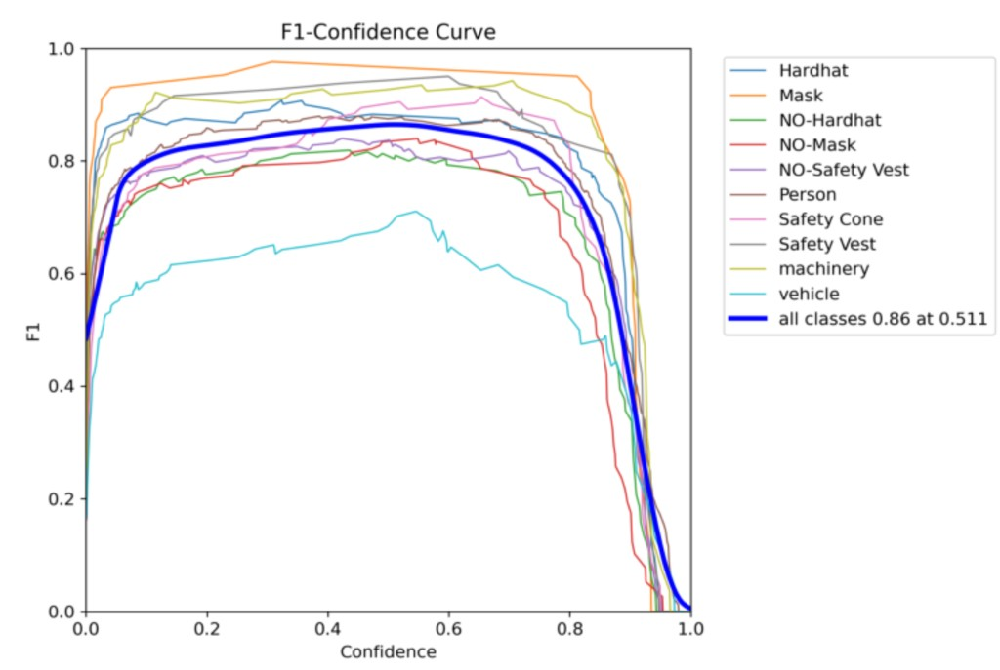

*Крива F1-міри від порогу впевненості. Синя жирна лінія — усі класи. Максимум: F1 = 0.87 при conf = 0.457.*

**Що на осях:**
- Вісь X: `Confidence threshold` — мінімальна впевненість, яку модель має мати, щоб «повідомити» про об'єкт. Нижче порогу — детекція відкидається.
- Вісь Y: `F1-score` = `2 · Precision · Recall / (Precision + Recall)` — гармонічне середнє між Precision і Recall.

**Як читати:**
- Ліворуч (conf → 0): порог дуже низький → модель «повідомляє» про всі можливі рамки → Recall = 1, але Precision низька → F1 нижня.
- Праворуч (conf → 1): порог дуже високий → модель повідомляє лише про «найвпевненіші» рамки → Precision = 1, але Recall низька → F1 нижня.
- **Оптимум** — там де F1 максимальний. Для нашої моделі: `F1 = 0.87` при `conf = 0.457`.

**Висновок:** якщо встановити `conf=0.457` при inference, модель матиме F1 ≈ 87% по всіх класах — хороший баланс між «не пропустити об'єкт» і «не вигадати зайвого».

**Що робити якщо погано:** якщо F1 < 0.5 або пік дуже вузький — модель потребує більше даних, більше епох або кращої аугментації.

---

#### Precision-Recall Curve

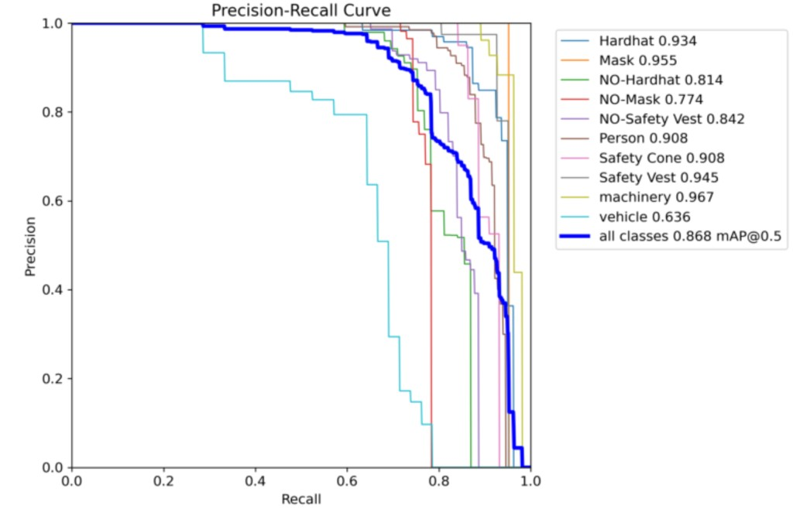

*PR-криві для 10 класів + загальна жирна синя лінія. mAP@0.5 = 0.874.*

**Що на осях:**
- Вісь X: `Recall` — яку частину реальних об'єктів знайшла модель (від 0 до 1).
- Вісь Y: `Precision` — яка частка з усіх знайдених об'єктів справді правильна (від 0 до 1).

**Як читати:**
- Чим «вище і правіше» крива — тим краще. Ідеальна крива: горизонтальна лінія на рівні Precision = 1.
- **AP** = площа під цією кривою (зазначено у легенді поряд з назвою класу).
- `mAP@0.5 = 0.874` (синя жирна лінія) — середнє AP по всіх 10 класах.

**Результати по класах:**

| Клас | AP@0.5 | Висновок |
| ---- | ------- | -------- |
| machinery | 0.984 | Відмінний результат |
| Mask | 0.963 | Відмінний результат |
| Hardhat | 0.927 | Відмінний результат |
| Safety Vest | 0.909 | Відмінний результат |
| Safety Cone | 0.906 | Відмінний результат |
| Person | 0.905 | Відмінний результат |
| NO-Safety Vest | 0.855 | Добре |
| NO-Hardhat | 0.798 | Задовільно |
| NO-Mask | 0.776 | Задовільно |
| **vehicle** | **0.720** | **Найслабший клас** |

**Чому vehicle слабкий:** клас представлений значно менше за інші (дивись `labels.png`). Рамки автомобілів також часто частково перекриті або виходять за межі кадру.

**Що робити:** зібрати більше зображень з автомобілями, або застосувати зважену loss для цього класу (`class_weights` у YOLO).

---

#### Precision-Confidence Curve

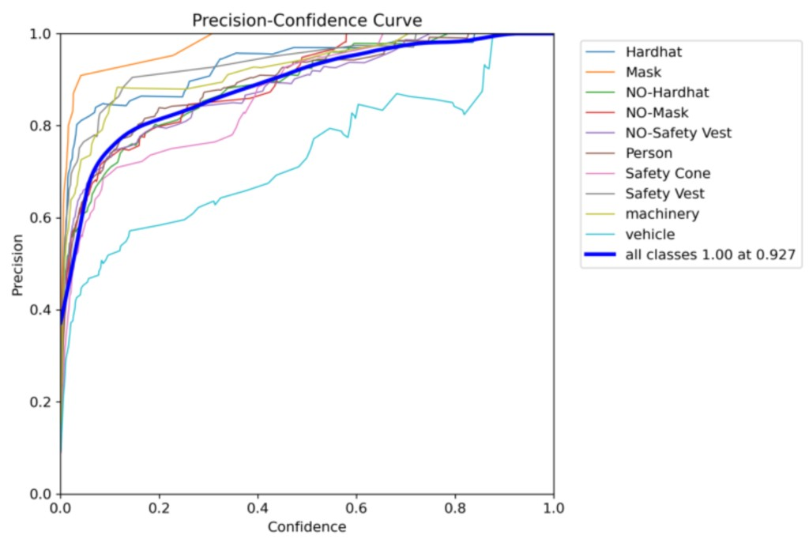

*Precision від порогу впевненості. Загальна лінія: Precision = 1.00 при conf ≥ 0.939.*

**Що на осях:**
- Вісь X: `Confidence threshold` (від 0 до 1).
- Вісь Y: `Precision` (від 0 до 1).

**Як читати:**
- Зростання вправо: чим вищий поріг впевненості → тим «чистіші» залишаються детекції → Precision наближається до 1.
- **all classes 1.00 at 0.939**: при conf = 0.939 модель повідомляє лише про ті об'єкти, у яких вона дуже впевнена, і всі вони правильні.

> **Нюанс:** висока Precision при conf = 0.939 — це не обов'язково добре, бо Recall при цьому буде дуже низький (модель пропускає більшість об'єктів). Дивись наступний графік.

---

#### Recall-Confidence Curve

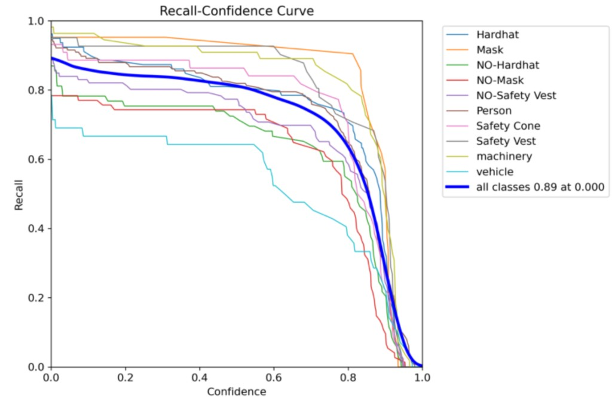

*Recall від порогу впевненості. Загальна лінія: Recall = 0.89 при conf = 0.000.*

**Що на осях:**
- Вісь X: `Confidence threshold`.
- Вісь Y: `Recall`.

**Як читати:**
- Спадання вправо: чим вищий поріг → тим більше детекцій відкидаємо → Recall падає.
- При conf = 0: приймаємо абсолютно всі детекції → максимальний Recall ≈ 0.89 (11% реальних об'єктів модель не знаходить взагалі).

**Зв'язок Precision і Recall:**

```
Низький conf →  Recall = MAX,    Precision = LOW
Оптимальний → Recall та Precision збалансовані (саме тут F1 максимальний)
Високий conf → Recall = LOW,    Precision = MAX
```

---

#### Confusion Matrix (абсолютна)

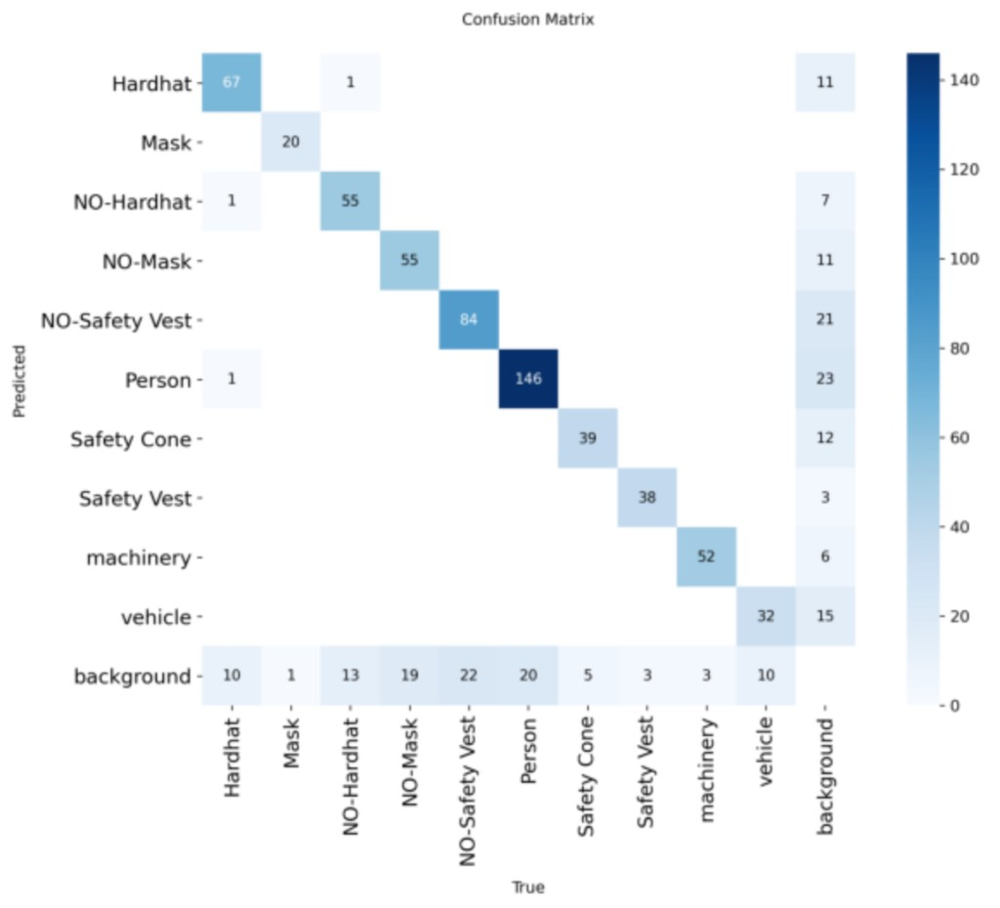

*По осі X — реальний клас (True), по осі Y — передбачений клас (Predicted). Остання колонка і рядок — background (фон).*

**Що таке confusion matrix у детекції:**
На відміну від класифікації, в детекції є ще рядок/колонка **background**:
- Рядок `background` (останній знизу): скільки разів модель **знайшла** щось на фоні, де насправді нічого немає (False Positive по класах).
- Колонка `background` (остання справа): скільки разів модель **не знайшла** реальний об'єкт (False Negative, «пропуск», відправлено в background).

**Як читати діагональ:**
- Діагональ — правильні детекції (True Positive для кожного класу).
- `Person: 143` — модель правильно знайшла 143 екземпляри Person. Це найчисленніший клас.
- `Mask: 20`, `Hardhat: 89` тощо.

**Що насторожує:**
- Колонка `background`: у рядку `vehicle` — 16 → 16 автомобілів модель класифікувала як background (пропустила).
- `Safety Vest → background: 2`, `NO-Safety Vest → background: 10`.

---

#### Confusion Matrix Normalized (нормалізована)

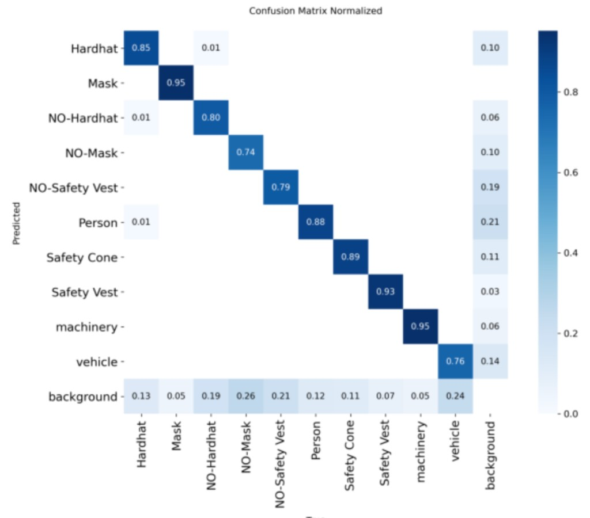

*Нормалізована confusion matrix: кожен рядок ділиться на кількість реальних об'єктів цього класу. Значення від 0 до 1.*

**Навіщо нормалізована версія:**
В абсолютній matrix класи з більшою кількістю об'єктів (Person = 143) виглядають «темнішими» і маскують реальну якість. Нормалізована показує **частку** правильних детекцій від загальної кількості реальних об'єктів.

**Ключові висновки:**

| Клас | Precision (діагональ) | Найчастіша помилка |
| ---- | --------------------- | ------------------- |
| machinery | 0.98 | 0.04 → background |
| Mask | 0.95 | 0.01 → NO-Mask |
| Safety Vest | 0.93 | 0.03 → background |
| Safety Cone | 0.91 | 0.31 → background |
| Person | 0.86 | 0.20 → background |
| **vehicle** | **0.69** | **0.22 → background** |
| NO-Hardhat | 0.72 | 0.25 → background |
| NO-Mask | 0.74 | 0.24 → background |

**Висновки:**
- `vehicle` — найгірший: 22% автомобілів пропускаються як background, 69% правильних детекцій.
- Класи `NO-Mask` і `NO-Hardhat` (відсутність ЗІЗ) складніші, ніж `Mask` і `Hardhat` — модель частіше пропускає порушення, ніж засоби захисту.
- `Safety Cone` — попри добрий AP@0.5 (0.906), 31% конусів потрапляє в background при суворіших метриках.

> **Практичний висновок для safety-задачі:** для виявлення порушень (відсутність каски, маски) важливіший **Recall**, ніж Precision. Краще помилково «побачити» порушення, ніж пропустити реальне. Можна знизити `conf` для класів `NO-Hardhat` і `NO-Mask`.

---

#### Labels (статистика датасету)

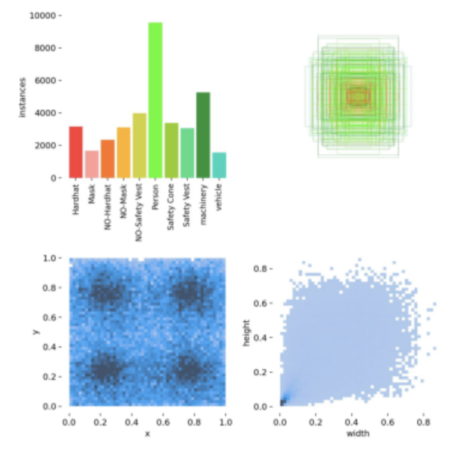

*Верхній лівий: кількість об'єктів по класах. Верхній правий: накладені форми bbox. Нижній лівий: розподіл центрів (x, y). Нижній правий: ширина vs висота bbox.*

**Що містить цей графік (4 панелі):**

1. **Верхній лівий (bar chart) — кількість об'єктів по класах:**
   - `Person` — найбільший клас (~9500 об'єктів у train)
   - `machinery` — теж багато (~5000)
   - `vehicle` — найменший (~1500) → причина слабких метрик
   - Сильний дисбаланс між класами

2. **Верхній правий — накладені bbox:**
   - Відображає «типову» форму рамок: більшість квадратна або вертикальна (люди)
   - Зеленим — частіші форми, червоним — рідкісні

3. **Нижній лівий — розподіл центрів (x, y):**
   - «Гарячі точки» (темніші плями) — де найчастіше розташовані об'єкти
   - Люди розташовані скрізь; техніка — частіше внизу кадру

4. **Нижній правий — ширина vs висота bbox:**
   - Більшість об'єктів мають ширину і висоту до 0.3 (нормалізовано відносно зображення) — відносно малі об'єкти

> **Навіщо це аналізувати:** дисбаланс класів і особливості форм bbox впливають на ефективність навчання. Якщо один клас має 10× більше прикладів, модель може «ліниво» ігнорувати рідкісні класи.

---

#### Learning Curves (results.png)

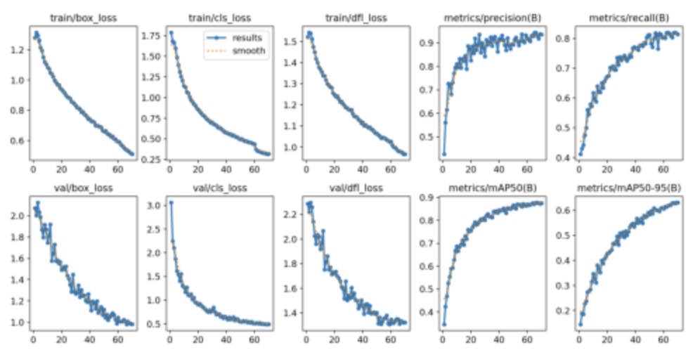

*Верхній рядок: train loss (box/cls/dfl). Нижній рядок: val loss (box/cls/dfl) + метрики (precision, recall, mAP50, mAP50-95).*

**Три компоненти loss у YOLOv8/v9:**

> **Увага:** у YOLOv8/v9 loss складається з `box_loss + cls_loss + dfl_loss`, а не з `L_coord + L_obj + L_class` (це було у YOLOv1). DFL — Distribution Focal Loss — замінив objectness loss і покращує точність регресії рамок.

| Компонент | Що вимірює | Очікувана динаміка |
| --------- | ---------- | ------------------- |
| `box_loss` | Точність координат bounding box | Спадає, досягає ~0.6 |
| `cls_loss` | Точність класифікації об'єктів | Спадає найшвидше |
| `dfl_loss` | Distribution Focal Loss для bbox регресії | Спадає, досягає ~1.0 |

**Що показують метрики:**

| Метрика | Значення після 70 епох | Інтерпретація |
| ------- | ---------------------- | ------------- |
| `precision` | ≈ 0.90 | З 10 знайдених об'єктів 9 правильні |
| `recall` | ≈ 0.80 | З 10 реальних об'єктів 8 знайдено |
| `mAP@50` | ≈ 0.87 | Дуже хороший результат |
| `mAP@50-95` | ≈ 0.62 | Суворий критерій; є куди покращувати |

**Як читати кривi:**
- Усі три loss мають спадати і вирівнюватись — це ознака успішного навчання.
- `train_loss` і `val_loss` мають бути близькими — якщо `val_loss` ростиме при спаданні `train_loss`, це перенавчання.
- Метрики мають зростати і стабілізуватись — що і відбулось.

**Висновок:** криві виглядають здорово: loss спадає, метрики зростають, переnavчання немає. `mAP@50-95 ≈ 0.62` вказує, що при суворіших IoU порогах є похибки в локалізації — норма для моделей цього класу.

---

#### Labels Correlogram

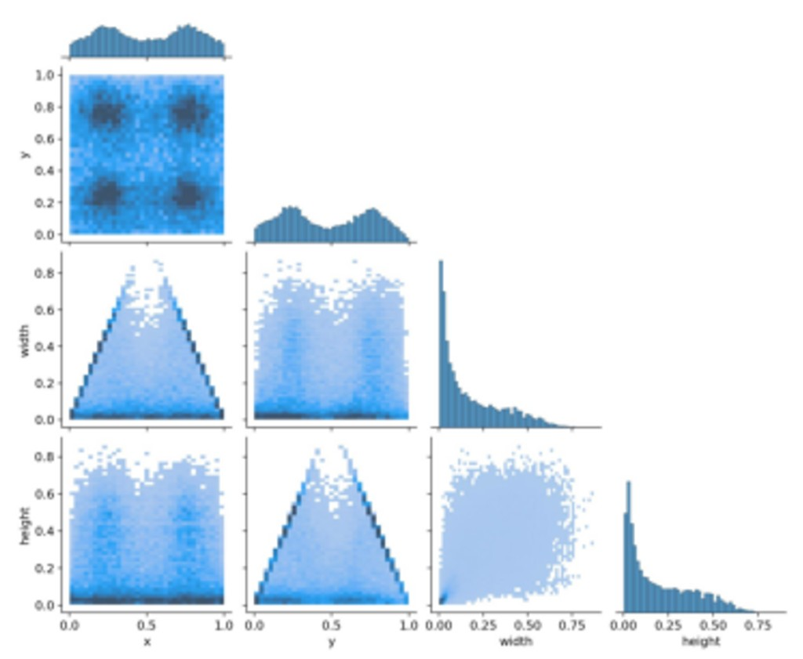

*Матриця попарних розподілів параметрів bbox: центр X, центр Y, ширина, висота.*

**Що показує correlogram:**
- **Діагональ** — гістограми розподілу кожного параметра окремо.
- **Нижній трикутник** — scatter-plot пар параметрів (де «скупчення» — там є кореляція).
- **Верхній трикутник** — та сама інформація у вигляді hex density.

**Ключові спостереження:**
- `x` і `y`: двомодальний розподіл — об'єкти є по всьому зображенню, але є «гарячі зони».
- `width` і `height`: обидві мають важкий хвіст праворуч — більшість об'єктів малі (w, h < 0.2), але є й великі (техніка, vehicle).
- `width vs height`: трикутна форма scatter-plot — висота зазвичай ≥ ширини (вертикальні об'єкти — люди). Немає об'єктів з width > 0.5 та height < 0.1 (немає широких горизонтальних смуг).

> **Навіщо це потрібно:** correlogram допомагає розуміти, чи є в датасеті «аномальні» форми bbox, нерівномірне розташування об'єктів або незбалансованість за розміром.

---

#### Приклади детекцій на валідаційних зображеннях

```python
# Збираємо шляхи до зображень з прикладами детекцій на validation батчах
validation_results_paths = [
    i for i in
    glob.glob(f'{CFG.OUTPUT_DIR}runs/detect/{CFG.BASE_MODEL}_{CFG.EXP_NAME}/*.png') +
    glob.glob(f'{CFG.OUTPUT_DIR}runs/detect/{CFG.BASE_MODEL}_{CFG.EXP_NAME}/*.jpg')
    if 'val_batch' in i  # Відбираємо тільки файли з val_batch
]

# Якщо є хоч одне зображення — виводимо випадкове
if len(validation_results_paths) >= 1:
    val_img_path = random.choice(validation_results_paths)  # Випадковий батч
    display_image(val_img_path, print_info=False, hide_axis=True)
```

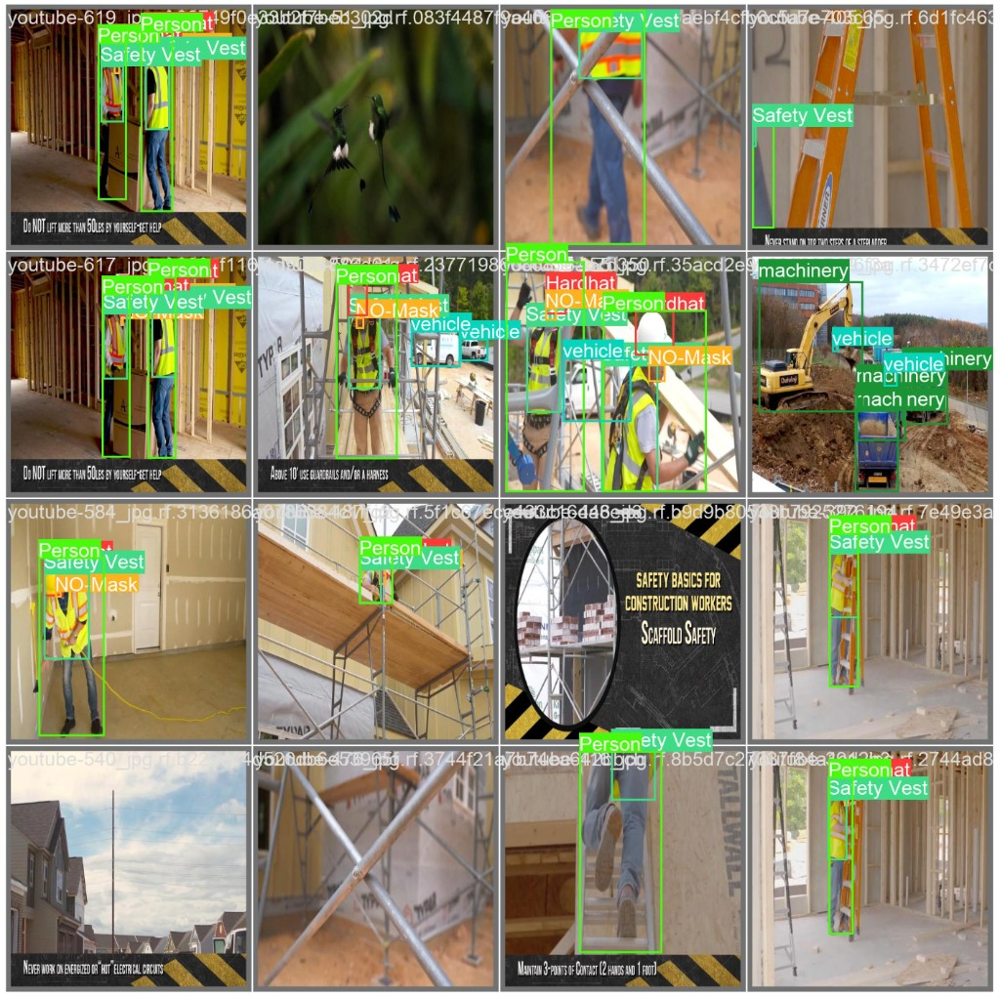

*Приклади детекцій YOLOv9 на validation батчі: зелені рамки з підписами класів і confidence score.*

**Як читати:**
- Зелені рамки — детекції моделі з підписами `ClassName confidence`
- Видно, що модель правильно знаходить людей, жилети безпеки, відсутність масок
- На зображеннях без людей модель не генерує хибних детекцій
- Деякі рамки перекриваються (тут NMS вже застосований — це різні об'єкти)

---

### 1.4 Підсумки аналізу

| Метрика | Значення | Оцінка |
| ------- | -------- | ------ |
| mAP@0.5 | 0.874 | Дуже добре |
| mAP@0.5:0.95 | 0.62 | Добре, є куди рости |
| Precision | ≈ 0.90 | Дуже добре |
| Recall | ≈ 0.80 | Добре |
| F1 max | 0.87 at conf=0.457 | Оптимальний поріг |
| Найслабший клас | vehicle (AP=0.720) | Потребує більше даних |

**Що можна покращити:**
1. **Більше даних для vehicle** — клас найменший і найслабший
2. **Знизити conf для NO-Hardhat/NO-Mask** при inference для кращого Recall (безпека важливіша)
3. **Більше епох або data augmentation** для покращення mAP@0.5:0.95
4. **Class weights** при тренуванні для балансування дисбалансу класів

---

## ЧАСТИНА 2. АВТОКОДЕРИ: ТЕОРІЯ

### 2.1 Що таке автокодер?

**Autoencoder (автокодер)** — це архітектура глибокого навчання, яка **стискає вхідні дані** у компактне представлення і **відновлює** їх назад.

На відміну від більшості нейромереж, автокодер:
- Навчається **без міток** (unsupervised learning)
- **Вхід = Вихід** — мета не класифікація, а якомога точніше відновлення вхідних даних
- «Корисний ефект»: по дорозі крізь вузьке місце (latent space) мережа вивчає компактне представлення даних

#### Схема архітектури

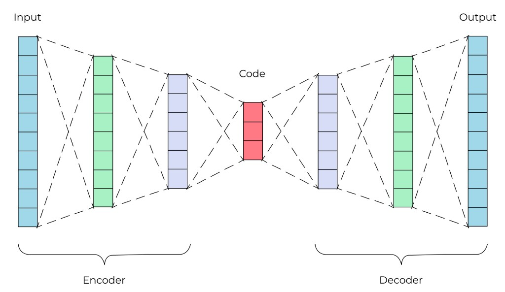

*Автокодер: вхідний шар → Encoder (зменшення розмірності) → Code / Latent Space → Decoder (збільшення розмірності) → вихідний шар.*

```
Вхід (велика розмірність)   →   Code (мала розмірність)   →   Вихід (велика розмірність)
  28×28 = 784 числа       →        4 числа              →      28×28 = 784 числа

        ENCODER                   LATENT SPACE                    DECODER
  (стискає дані)             (прихований простір)             (відновлює дані)
```

**Три основні компоненти:**

| Компонент | Роль | Аналогія |
| --------- | ---- | -------- |
| **Encoder** | Стискає вхід `X` → код `z` низької розмірності | «Переказ» довгого тексту у короткий конспект |
| **Code / Latent Space** | Вектор `z` — компактне числове представлення | Сам конспект |
| **Decoder** | Відновлює код `z` → реконструкцію `X̂` | «Розгортання» конспекту назад у повний текст |

#### Reconstruction Loss

Автокодер навчається мінімізуючи **похибку реконструкції** між вхідним `X` і відновленим `X̂`:

**Для дійсних значень (зображення, нормалізовані до [0,1]):**
```
MSE = (1/n) · Σ (X - X̂)²
```

**Для бінарних / категоріальних даних:**
```
BCE = -Σ [ X · log(X̂) + (1-X) · log(1-X̂) ]
```

> **В нашому практичному прикладі** з Fashion-MNIST: зображення нормалізовані до [0,1] → використовуємо `MSELoss`. Чим менший MSE — тим ближче реконструкція до оригіналу.

---

### 2.2 Де застосовуються автокодери

| Задача | Як використовується автокодер |
| ------ | ----------------------------- |
| **Видалення шуму (denoising)** | Навчаємо на парах «шумне → чисте»; encoder ігнорує шум, decoder відновлює чисте зображення |
| **Підвищення роздільної здатності (super-resolution)** | Decoder навчається генерувати більший вихід, ніж вхід encoder |
| **Розфарбовування (colorization)** | Encoder обробляє ч/б зображення; decoder генерує кольоровий варіант |
| **Видалення водяних знаків** | Аналогічно до denoising: encoder «не помічає» watermark |
| **Стиснення даних** | Зберігаємо тільки `z` (latent code) — набагато менший за оригінал |
| **Зниження розмірності** | Latent space з 4–64 вимірів замість 784 — зручно для візуалізації та аналізу |
| **Виявлення аномалій** | Модель погано відновлює аномальні приклади → великий MSE = аномалія |
| **Кластеризація** | Точки в latent space можна кластеризувати (K-means, DBSCAN тощо) |
| **Генерація нових даних** | Семплюємо з latent space і декодуємо (краще для VAE, ніж для звичайного AE) |

---

### 2.3 Властивості і гіперпараметри

**Дві ключові властивості автокодерів:**

1. **Залежність від даних (data-specific):** автокодер ефективно стискає тільки дані, схожі на тренувальні. AE, навчений на одязі, погано стиснить обличчя.

2. **Кодування з втратами (lossy compression):** реконструкція `X̂` завжди гірша за оригінал `X`. Чим менший latent space — тим більші втрати.

**Основні гіперпараметри:**

| Гіперпараметр | Що впливає | Типові значення |
| ------------- | ---------- | --------------- |
| **Розмір code (dim)** | Ступінь стиснення; чим менший — тим більше втрат | 4, 16, 64, 128 |
| **Кількість шарів** | Глибина encoder/decoder | 2–5 шарів |
| **Кількість вузлів/фільтрів** | Ємність мережі | 8, 16, 32, 64, 128, 256 |
| **Функція втрат** | Залежить від типу даних | MSE, BCE |
| **Learning rate** | Швидкість навчання | 1e-3, 1e-4 |
| **Batch size** | Стабільність градієнта | 64, 128, 256 |

> **Правило:** decoder зазвичай симетричний до encoder за структурою (ті самі кількості шарів, але у зворотному порядку). Це не суворе правило, але є поширеною практикою.

---

## ЧАСТИНА 3. ЗГОРТКОВІ АВТОКОДЕРИ ТА ТРАНСПОНОВАНА ЗГОРТКА

### 3.1 Конволюційний автокодер (CAE)

**Convolutional Autoencoder (CAE)** — автокодер, де і encoder, і decoder використовують **згорткові шари** замість лише повнозв'язних. Це ефективніше для зображень, бо:

- Зберігає **просторову структуру** (локальні залежності пікселів)
- Параметрів значно менше, ніж у повнозв'язному AE
- Backbone CNN вивчає **ієрархічні ознаки**: краї → форми → частини об'єктів

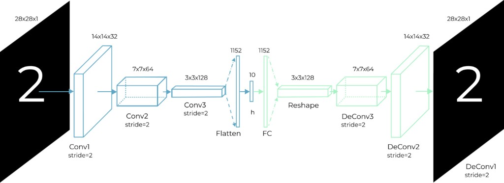

*Zgörтковий автокодер: вхідне зображення → Conv шари зі stride (зменшення) → latent code → FC шар → Unflatten → ConvTranspose шари (збільшення) → реконструкція.*

**Архітектура нашого CAE (Fashion-MNIST, dim=4):**

```
ENCODER:
28×28×1
  ↓ Conv2d(1→8,  3×3, stride=2, padding=1) + ReLU        → 14×14×8
  ↓ Conv2d(8→16, 3×3, stride=2, padding=1) + BN + ReLU   → 7×7×16
  ↓ Conv2d(16→32,3×3, stride=2, padding=0) + ReLU        → 3×3×32
  ↓ Flatten                                               → 288 (= 3×3×32)
  ↓ Linear(288→128) + ReLU                                → 128
  ↓ Linear(128→4)                                         → 4   ← latent code

DECODER:
4
  ↓ Linear(4→128) + ReLU                                  → 128
  ↓ Linear(128→288) + ReLU                                → 288
  ↓ Unflatten(32, 3, 3)                                   → 3×3×32
  ↓ ConvTranspose2d(32→16, 3×3, stride=2) + BN + ReLU    → 7×7×16
  ↓ ConvTranspose2d(16→8, 3×3, stride=2, p=1, op=1) + BN+ReLU → 14×14×8
  ↓ ConvTranspose2d(8→1, 3×3, stride=2, p=1, op=1) + Sigmoid  → 28×28×1
```

> **Чому stride=2 замість MaxPool?** MaxPool відкидає просторову інформацію безповоротньо. Stride=2 у Conv2d — це trainable downsampling: мережа сама вчиться, яку інформацію зберігати.

> **Чому Sigmoid на виході декодера?** Fashion-MNIST нормалізований до [0,1]. Sigmoid притискає вихід до [0,1] — піксельні значення залишаються коректними. MSELoss очікує значення в тому ж діапазоні, що і вхід (також [0,1] після `ToTensor()`).

---

### 3.2 Транспонована згортка (ConvTranspose2d)

**Транспонована згортка** — ключова операція для декодера: вона **збільшує** просторовий розмір feature map. Також відома як «деконволюція» або «upsampling convolution».

> **Важливо:** «деконволюція» — популярна, але технічно неточна назва. Транспонована згортка — **не** математична обернена операція до згортки. Вона просто збільшує розмір за допомогою навчених фільтрів.

#### Анімація механізму

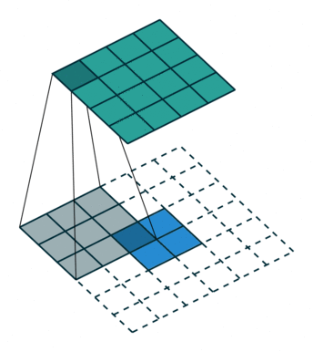

*Транспонована згортка (no padding, no strides, kernel 3×3): синій — 2×2 вхід, блакитний — 4×4 вихід. Кожен піксель вхідного «розширюється» через фільтр, результати в областях перекриття додаються.*

#### Покроковий механізм

```
Вхідний піксель = a               Фільтр 3×3:
                                   [ w1 w2 w3 ]
Множимо піксель a на фільтр:       [ w4 w5 w6 ]
                                   [ w7 w8 w9 ]

Результат для пікселя a:
[ a·w1  a·w2  a·w3 ]    ← записуємо у відповідні позиції виходу
[ a·w4  a·w5  a·w6 ]
[ a·w7  a·w8  a·w9 ]

Те саме для пікселів b, c, d → де результати накладаються — додаємо
```

#### Формула вихідного розміру

```
output_size = (input_size - 1) × stride - 2 × padding + kernel_size + output_padding
```

**Приклади з нашого декодера:**

| Шар | input | stride | padding | kernel | output_padding | output |
| --- | ----- | ------ | ------- | ------ | -------------- | ------ |
| ConvTranspose2d(32→16) | 3 | 2 | 0 | 3 | 0 | (3-1)×2 - 0 + 3 + 0 = **7** |
| ConvTranspose2d(16→8) | 7 | 2 | 1 | 3 | 1 | (7-1)×2 - 2 + 3 + 1 = **14** |
| ConvTranspose2d(8→1) | 14 | 2 | 1 | 3 | 1 | (14-1)×2 - 2 + 3 + 1 = **28** |

> **Навіщо `output_padding`:** при певних комбінаціях `stride` і `input_size` вихідний розмір може бути неоднозначним (наприклад, і 13, і 14 дають однаковий вхід при stride=2). `output_padding` додає 0 або 1 піксель на правому/нижньому краю виходу, щоб отримати точний розмір.

**Корисний ресурс:** інтерактивні анімації всіх конфігурацій:
[conv_arithmetic](https://github.com/vdumoulin/conv_arithmetic/blob/master/README.md)

---

### 3.3 ConvTranspose2d vs Upsample + Conv

Два поширені підходи до upsampling у декодерах:

| Підхід | Як працює | Плюси | Мінуси |
| ------ | --------- | ----- | ------- |
| `ConvTranspose2d` | Trainable upsampling | Гнучкий, навчається | Може давати «шахівний» артефакт (checkerboard) |
| `Upsample(scale=2) + Conv2d` | Білінійний upsampling + звичайна згортка | Менше артефактів | Дещо більше параметрів |

У нашому автокодері використовується `ConvTranspose2d` — класичний та поширений підхід.

---

## ЧАСТИНА 4. ПРАКТИКА — ЗНАЙОМСТВО З ДАНИМИ (Fashion-MNIST)

### 4.1 Про датасет

**Fashion-MNIST** — набір зображень товарів одягу від Zalando:
- 60 000 зображень у тренувальній вибірці
- 10 000 зображень у тестовій вибірці
- Кожне зображення: **28×28 пікселів**, відтінки сірого (1 канал)
- 10 класів одягу

| ID | Клас |
| -- | ---- |
| 0 | T-shirt/top |
| 1 | Trouser |
| 2 | Pullover |
| 3 | Dress |
| 4 | Coat |
| 5 | Sandal |
| 6 | Shirt |
| 7 | Sneaker |
| 8 | Bag |
| 9 | Ankle boot |

**Навіщо саме цей датасет:** Fashion-MNIST — стандартний бенчмарк, простіший за ImageNet, але складніший за цифри MNIST. Зображення невеликі (28×28) → модель навчається швидко навіть на CPU. Ідеально для демонстрації автокодерів.

### 4.2 Імпорти і завантаження даних

```python
import os           # Операції з файловою системою (шляхи, папки)
import random       # Генерація випадкових чисел (для відтворюваності)
from tqdm import tqdm  # Прогрес-бар під час навчання

import pandas as pd     # Таблиці і датафрейми (тут майже не використовується)
import numpy as np      # Числові операції і масиви

import matplotlib.pyplot as plt   # Побудова графіків і відображення зображень
import plotly.express as px       # Інтерактивні графіки

import torch                          # Основна бібліотека PyTorch
import torchvision                    # Датасети і трансформації для зображень
from torchvision import transforms    # Препроцесинг: ToTensor, Normalize тощо
from torch.utils.data import DataLoader, random_split  # Завантажувачі і розбиття датасету
from torch import nn                  # Модулі для побудови нейромереж
import torch.nn.functional as F       # Функції активації, loss-функції
import torch.optim as optim           # Оптимізатори (Adam, SGD тощо)
```

```python
# Шлях до директорії для збереження/завантаження датасету
# При першому запуску FashionMNIST завантажується автоматично (~30 MB)
data_dir = 'data'

# Завантажуємо тренувальний датасет (60 000 зображень)
train_dataset = torchvision.datasets.FashionMNIST(data_dir, train=True, download=True)

# Завантажуємо тестовий датасет (10 000 зображень)
test_dataset = torchvision.datasets.FashionMNIST(data_dir, train=False, download=True)

print(train_dataset)   # Виводимо мета-інформацію
type(train_dataset)    # Перевіряємо тип об'єкта
```

**Пояснення параметрів `FashionMNIST`:**

| Параметр | Тип | Значення у нас | Опис |
| -------- | --- | -------------- | ---- |
| `root` | `str` | `'data'` | Директорія для збереження датасету |
| `train` | `bool` | `True` / `False` | `True` = train split (60K), `False` = test split (10K) |
| `download` | `bool` | `True` | Завантажити якщо відсутній |
| `transform` | `callable` | `None` спочатку | Трансформації для зображень (додаємо нижче) |

> **Kaggle:** якщо запускаєш у Kaggle, використовуй `data_dir = '../data'` — бо файл `data.yaml` лежить в іншому місці відносно ноутбука.

**Очікуваний вивід:**

```
Dataset FashionMNIST
    Number of datapoints: 60000
    Root location: data
    Split: Train

torchvision.datasets.mnist.FashionMNIST
```

**Як читати:** `60000` — кількість тренувальних зображень. Тип `FashionMNIST` успадковує `torch.utils.data.Dataset`, тобто підтримує `dataset[i]`, `len(dataset)` і `DataLoader`.

---

### 4.3 Візуалізація прикладів

```python
fig, axs = plt.subplots(5, 5, figsize=(6, 6))  # Сітка 5×5 = 25 зображень

for ax in axs.flatten():  # Ітеруємо по кожному з 25 осей
    img, label = random.choice(train_dataset)  # Вибираємо випадкове зображення з датасету
    ax.imshow(np.array(img), cmap='gist_gray')  # Відображаємо як сіре зображення
    ax.set_title('Label: %d' % label)           # Встановлюємо заголовок = числова мітка
    ax.set_xticks([])  # Прибираємо мітки по осі X
    ax.set_yticks([])  # Прибираємо мітки по осі Y

plt.tight_layout()  # Автоматично регулюємо відступи між зображеннями
```

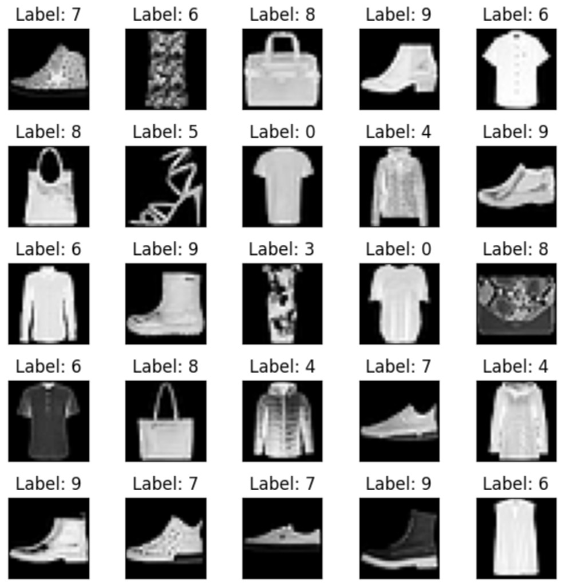

*25 випадкових зображень Fashion-MNIST з числовими мітками (0 = T-shirt, 6 = Shirt, 9 = Ankle boot тощо).*

**Як читати:** кожне зображення — 28×28 пікселів у відтінках сірого. Мітки — числа від 0 до 9 (дивись таблицю класів вище).

> **Нюанс:** на цьому етапі `train_dataset` повертає `(PIL.Image, int)` — ще не тензор. Тому використовуємо `np.array(img)` для `imshow`. Після додавання `ToTensor()` нижче — зображення стане тензором `[C, H, W]` зі значеннями в `[0, 1]`.

---

### 4.4 Перетворення на тензори і створення DataLoader

```python
# --- Трансформації ---
# ToTensor() конвертує PIL Image або numpy array:
# - пікселі з [0, 255] → [0.0, 1.0]  (нормалізація)
# - форма HxW → CxHxW  (додає канальний вимір)
# Для Fashion-MNIST: 28×28 → tensor[1, 28, 28]

train_transform = transforms.Compose([
    transforms.ToTensor(),  # Конвертуємо у тензор і нормалізуємо до [0, 1]
])
test_transform = transforms.Compose([
    transforms.ToTensor(),
])

# Прив'язуємо трансформації до датасетів
train_dataset.transform = train_transform
test_dataset.transform = test_transform
```

```python
# Розбиваємо тренувальний датасет на train (80%) і validation (20%)
m = len(train_dataset)  # 60 000

# random_split: розбиває датасет на підмножини без перетину
# [int(m*0.8), int(m*0.2)] = [48000, 12000]
train_data, val_data = random_split(
    train_dataset,
    [int(len(train_dataset) * 0.8), int(m * 0.2)]
)
```

```python
# --- DataLoader ---
# DataLoader вирішує три задачі:
# 1. Розбиття на батчі (batch_size=256)
# 2. Перемішування (shuffle=True за замовчуванням для train)
# 3. Паралельне завантаження (num_workers)

batch_size = 256  # 256 зображень в одному батчі

# Завантажувач для навчання
train_loader = torch.utils.data.DataLoader(train_data, batch_size=batch_size)

# Завантажувач для валідації (перемішування не потрібне)
valid_loader = torch.utils.data.DataLoader(val_data, batch_size=batch_size)

# Завантажувач для тестування (shuffle=True для різноманітності при виведенні)
test_loader = torch.utils.data.DataLoader(test_dataset, batch_size=batch_size, shuffle=True)
```

**Пояснення ключових класів:**

| Клас / метод | Параметри | Що робить |
| ------------ | --------- | --------- |
| `transforms.Compose(list)` | список трансформацій | Об'єднує кілька трансформацій в ланцюжок |
| `transforms.ToTensor()` | — | PIL/numpy → тензор, нормалізує до [0,1] |
| `random_split(dataset, lengths)` | `lengths`: список розмірів частин | Розбиває датасет випадково без перетину |
| `DataLoader(dataset, batch_size)` | `batch_size`, `shuffle` | Ітератор по батчах; перемішування при кожній епосі |

---

## ЧАСТИНА 5. ПРАКТИКА — ВИЗНАЧЕННЯ МОДЕЛІ

### 5.1 Клас Encoder

```python
class Encoder(nn.Module):
    """
    Encoder: стискає зображення 28×28×1 → latent vector розміру encoded_space_dim.
    Складається з трьох Conv2d шарів (зменшення просторового розміру) +
    двох Linear шарів (перехід до latent code).
    """

    def __init__(self, encoded_space_dim, fc2_input_dim):
        """
        encoded_space_dim: розмір latent code (у нас = 4)
        fc2_input_dim:     розмір проміжного FC шару (у нас = 128, але не використовується
                           напряму як параметр у цій реалізації)
        """
        super().__init__()

        # --- Згорткова частина ---
        self.encoder_cnn = nn.Sequential(
            # Шар 1: 1 канал → 8 каналів, ядро 3×3, stride=2, padding=1
            # Розмір: 28×28×1 → 14×14×8
            nn.Conv2d(1, 8, 3, stride=2, padding=1),
            # nn.BatchNorm2d(8),  ← закоментовано навмисно (не симетрично до decoder)
            nn.ReLU(True),  # inplace=True — економить пам'ять, змінює тензор на місці

            # Шар 2: 8 каналів → 16 каналів, stride=2, padding=1
            # Розмір: 14×14×8 → 7×7×16
            nn.Conv2d(8, 16, 3, stride=2, padding=1),
            nn.BatchNorm2d(16),  # BatchNorm: стабілізує навчання, прискорює збіжність
            nn.ReLU(True),

            # Шар 3: 16 каналів → 32 канали, stride=2, padding=0
            # Розмір: 7×7×16 → 3×3×32 (без padding: (7-3)/2 + 1 = 3)
            nn.Conv2d(16, 32, 3, stride=2, padding=0),
            # nn.BatchNorm2d(32),  ← закоментовано навмисно
            nn.ReLU(True)
        )

        # --- Flatten шар ---
        # Перетворює тензор [batch, 32, 3, 3] → [batch, 288]
        # start_dim=1: починаємо flatten з першого (не batch) виміру
        self.flatten = nn.Flatten(start_dim=1)

        # --- Лінійна частина ---
        self.encoder_lin = nn.Sequential(
            # Шар 1: 288 → 128
            nn.Linear(3 * 3 * 32, 128),  # 3*3*32 = 288
            nn.ReLU(True),
            # Шар 2: 128 → encoded_space_dim (4)
            nn.Linear(128, encoded_space_dim)
            # Немає активації на виході — latent code може бути будь-яким числом
        )

    def forward(self, x):
        x = self.encoder_cnn(x)    # Застосовуємо Conv шари: [B,1,28,28] → [B,32,3,3]
        x = self.flatten(x)        # Flatten: [B,32,3,3] → [B,288]
        x = self.encoder_lin(x)    # Linear: [B,288] → [B,4]
        return x
```

---

### 5.2 Клас Decoder

```python
class Decoder(nn.Module):
    """
    Decoder: відновлює зображення з latent vector (encoded_space_dim) → 28×28×1.
    Симетричний до Encoder: спочатку Linear шари (розширення),
    потім ConvTranspose2d шари (збільшення просторового розміру).
    """

    def __init__(self, encoded_space_dim, fc2_input_dim=128):
        """
        encoded_space_dim: розмір latent code (= 4, такий самий як у Encoder)
        fc2_input_dim:     розмір проміжного FC шару (за замовчуванням 128)
        """
        super().__init__()

        # --- Лінійна частина ---
        self.decoder_lin = nn.Sequential(
            # Шар 1: encoded_space_dim (4) → 128
            nn.Linear(encoded_space_dim, 128),
            nn.ReLU(True),
            # Шар 2: 128 → 288 (= 3×3×32)
            nn.Linear(128, 3 * 3 * 32),
            nn.ReLU(True)
        )

        # --- Unflatten шар ---
        # Перетворює [batch, 288] → [batch, 32, 3, 3]
        # dim=1: розгортаємо перший (не batch) вимір
        # unflattened_size=(32, 3, 3): цільова форма
        self.unflatten = nn.Unflatten(dim=1, unflattened_size=(32, 3, 3))

        # --- Транспонована згорткова частина ---
        self.decoder_conv = nn.Sequential(
            # Шар 1: 32 → 16, stride=2
            # Розмір: 3×3×32 → 7×7×16
            # Формула: (3-1)×2 - 2×0 + 3 + 0 = 7 ✓
            nn.ConvTranspose2d(32, 16, 3, stride=2, output_padding=0),
            nn.BatchNorm2d(16),
            nn.ReLU(True),

            # Шар 2: 16 → 8, stride=2, padding=1, output_padding=1
            # Розмір: 7×7×16 → 14×14×8
            # Формула: (7-1)×2 - 2×1 + 3 + 1 = 14 ✓
            nn.ConvTranspose2d(16, 8, 3, stride=2, padding=1, output_padding=1),
            nn.BatchNorm2d(8),
            nn.ReLU(True),

            # Шар 3: 8 → 1, stride=2, padding=1, output_padding=1
            # Розмір: 14×14×8 → 28×28×1
            # Формула: (14-1)×2 - 2×1 + 3 + 1 = 28 ✓
            nn.ConvTranspose2d(8, 1, 3, stride=2, padding=1, output_padding=1)
            # Немає ReLU — використовуємо Sigmoid у forward()
        )

    def forward(self, x):
        x = self.decoder_lin(x)     # Linear: [B,4] → [B,288]
        x = self.unflatten(x)       # Unflatten: [B,288] → [B,32,3,3]
        x = self.decoder_conv(x)    # ConvTranspose: [B,32,3,3] → [B,1,28,28]
        # Sigmoid: обмежує вихід [0,1] — відповідає нормалізованим пікселям
        x = torch.sigmoid(x)
        return x
```

> **Warning:** `BatchNorm2d(8)` і `BatchNorm2d(32)` у Encoder закоментовані навмисно. Тому архітектура encoder і decoder **не повністю симетрична**. Це не помилка — просто один з варіантів, який добре навчається.

---

### 5.3 Ініціалізація і перевірка форм

```python
# Фіксуємо seed для відтворюваних результатів
torch.manual_seed(42)

# Розмір латентного простору — наш головний гіперпараметр
# dim=4: стискаємо 784 числа до 4 чисел (стиснення у 196 разів!)
dim = 4

# Ініціалізуємо енкодер і декодер
encoder = Encoder(encoded_space_dim=dim, fc2_input_dim=128)
decoder = Decoder(encoded_space_dim=dim, fc2_input_dim=128)
```

```python
# --- Перевірка форм ---
# Беремо перше тестове зображення
img, _ = test_dataset[0]
# unsqueeze(0): додаємо batch вимір: [1,28,28] → [1,1,28,28]
img = img.unsqueeze(0)
print('Original image shape:', img.shape)

# Кодуємо
img_enc = encoder(img)
print('Encoded image shape:', img_enc.shape)

# Декодуємо
dec_img = decoder(img_enc)
print('Decoded image shape:', dec_img.shape)
```

**Очікуваний вивід:**

```
Original image shape: torch.Size([1, 1, 28, 28])
Encoded image shape: torch.Size([1, 4])
Decoded image shape: torch.Size([1, 1, 28, 28])
```

**Як читати:** модель правильно стиснула [1,1,28,28] (784 числа) до [1,4] і розгорнула назад до [1,1,28,28]. Якість реконструкції поки що погана — модель ще не навчена.

---

## ЧАСТИНА 6. ПРАКТИКА — НАВЧАННЯ МОДЕЛІ

### 6.1 Компоненти навчання

```python
# --- Функція втрат ---
# MSELoss: середньоквадратична похибка між реконструкцією і оригіналом
# Обчислює середнє (X - X̂)² по всіх пікселях і батчу
loss_fn = torch.nn.MSELoss()

# --- Оптимізатор ---
# Adam (Adaptive Moment Estimation) — поширений вибір для автокодерів
# lr=0.001: learning rate — крок градієнтного спуску
# weight_decay=1e-05: L2 регуляризація — штрафує великі ваги, зменшує перенавчання

lr = 0.001

# Передаємо параметри і encoder, і decoder — навчаються одночасно
params_to_optimize = [
    {'params': encoder.parameters()},  # Усі trainable параметри encoder
    {'params': decoder.parameters()}   # Усі trainable параметри decoder
]

optim = torch.optim.Adam(params_to_optimize, lr=lr, weight_decay=1e-05)
```

> **Warning — name collision:** змінна `optim` перезаписує імпортований модуль `torch.optim`! Після цієї клітинки більше **не можна** писати `optim.Adam(...)` — це викличе `AttributeError`. Якщо потрібно ще раз використати модуль, пиши `torch.optim.Adam(...)` з повним шляхом.

```python
# --- Пристрій ---
# Перевіряємо наявність GPU (CUDA); якщо немає — використовуємо CPU
device = torch.device("cuda") if torch.cuda.is_available() else torch.device("cpu")
print(f'Selected device: {device}')

# Переміщуємо encoder на пристрій (GPU/CPU)
encoder.to(device)
```

```python
# Переміщуємо decoder на пристрій
decoder.to(device)
```

> **Навіщо `encoder.to(device)` і `decoder.to(device)` окремо:** на відміну від єдиної моделі, тут два незалежних об'єкти `nn.Module`. Кожен потрібно перенести на пристрій окремо. Вхідні батчі теж потрібно переносити через `image_batch.to(device)`.

**Очікуваний вивід:**

```
Selected device: cpu
Encoder(
  (encoder_cnn): Sequential(
    (0): Conv2d(1, 8, kernel_size=(3, 3), stride=(2, 2), padding=(1, 1))
    (1): ReLU(inplace=True)
    ...
  )
  ...
)
```

---

### 6.2 Функції train_epoch і test_epoch

```python
def train_epoch(encoder, decoder, device, dataloader, loss_fn, optimizer):
    """
    Виконує одну епоху навчання: один прохід по всьому тренувальному датасету.

    encoder:    об'єкт Encoder
    decoder:    об'єкт Decoder
    device:     пристрій (cpu або cuda)
    dataloader: DataLoader для тренувальних даних
    loss_fn:    функція втрат (MSELoss)
    optimizer:  оптимізатор (Adam)

    Повертає: середній train loss за епоху (float)
    """
    # Переводимо в режим тренування (BatchNorm і Dropout поводяться по-іншому)
    encoder.train()
    decoder.train()
    train_loss = []

    # Ітеруємо по батчах; _ — ігноруємо мітки (unsupervised learning)
    for image_batch, _ in dataloader:
        # 1. Переміщуємо батч на правильний пристрій
        image_batch = image_batch.to(device)

        # 2. Кодуємо: [B,1,28,28] → [B,4]
        encoded_data = encoder(image_batch)

        # 3. Декодуємо: [B,4] → [B,1,28,28]
        decoded_data = decoder(encoded_data)

        # 4. Обчислюємо reconstruction loss між реконструкцією і оригіналом
        loss = loss_fn(decoded_data, image_batch)

        # 5. Обнуляємо градієнти (важливо робити перед backward!)
        optimizer.zero_grad()

        # 6. Зворотне поширення: обчислюємо градієнти loss по всіх параметрах
        loss.backward()

        # 7. Крок оптимізатора: оновлюємо ваги
        optimizer.step()

        # Логуємо loss поточного батчу
        print('\t partial train loss (single batch): %f' % (loss.data))
        train_loss.append(loss.detach().cpu().numpy())  # Зберігаємо для усереднення

    return np.mean(train_loss)  # Повертаємо середній loss по всіх батчах
```

```python
def test_epoch(encoder, decoder, device, dataloader, loss_fn):
    """
    Обчислює reconstruction loss на validation або test вибірці.
    Не оновлює ваги — тільки оцінює якість.

    Повертає: loss (torch.Tensor)
    """
    # Переводимо в режим оцінки (BatchNorm використовує накопичену статистику)
    encoder.eval()
    decoder.eval()

    with torch.no_grad():  # Вимикаємо обчислення градієнтів → економія пам'яті і часу
        conc_out = []    # Список реконструйованих батчів
        conc_label = []  # Список оригінальних батчів

        for image_batch, _ in dataloader:
            image_batch = image_batch.to(device)
            encoded_data = encoder(image_batch)
            decoded_data = decoder(encoded_data)
            # Переміщуємо результати на CPU для накопичення (GPU пам'ять обмежена)
            conc_out.append(decoded_data.cpu())
            conc_label.append(image_batch.cpu())

        # Об'єднуємо всі батчі в один великий тензор
        conc_out = torch.cat(conc_out)
        conc_label = torch.cat(conc_label)

        # Обчислюємо loss на всій вибірці (не по батчах)
        val_loss = loss_fn(conc_out, conc_label)

    return val_loss.data
```

**Пояснення ключових методів:**

| Метод | Що робить |
| ----- | --------- |
| `encoder.train()` / `decoder.train()` | Вмикає режим навчання: BatchNorm оновлює статистику, Dropout активний |
| `encoder.eval()` / `decoder.eval()` | Вмикає режим оцінки: BatchNorm використовує накопичену статистику |
| `torch.no_grad()` | Контекстний менеджер: вимикає обчислення графа градієнтів |
| `optimizer.zero_grad()` | Обнуляє накопичені градієнти (PyTorch накопичує, не замінює) |
| `loss.backward()` | Зворотне поширення: обчислює ∂loss/∂w для всіх параметрів |
| `optimizer.step()` | Оновлює ваги на основі градієнтів |
| `loss.detach().cpu().numpy()` | Від'єднує від графа → переміщує на CPU → конвертує у numpy |
| `torch.cat(list)` | Конкатенує список тензорів в один вздовж першого виміру |

---

### 6.3 Функція візуалізації

```python
def plot_ae_outputs(encoder, decoder, n=5):
    """
    Відображає порівняння оригінальних і реконструйованих зображень.
    Показує перші n зображень тестового датасету.

    encoder, decoder: об'єкти моделі
    n: кількість зображень для відображення (за замовчуванням 5)
    """
    plt.figure(figsize=(10, 4.5))  # Широка фігура для двох рядків

    for i in range(n):
        # Отримуємо i-те зображення і додаємо batch вимір
        img = test_dataset[i][0].unsqueeze(0).to(device)

        encoder.eval()  # Вимикаємо BatchNorm оновлення
        decoder.eval()

        with torch.no_grad():
            # Отримуємо реконструкцію через автокодер
            rec_img = decoder(encoder(img))

        # --- Оригінал (верхній рядок) ---
        ax = plt.subplot(2, n, i + 1)
        # img.cpu() → переміщуємо на CPU; .squeeze() → видаляємо batch і channel виміри
        # .numpy() → конвертуємо у numpy (matplotlib не приймає тензори)
        plt.imshow(img.cpu().squeeze().numpy(), cmap='gist_gray')
        ax.get_xaxis().set_visible(False)
        ax.get_yaxis().set_visible(False)
        if i == n // 2:  # Заголовок тільки посередині
            ax.set_title('Original images')

        # --- Реконструкція (нижній рядок) ---
        ax = plt.subplot(2, n, i + 1 + n)
        plt.imshow(rec_img.cpu().squeeze().numpy(), cmap='gist_gray')
        ax.get_xaxis().set_visible(False)
        ax.get_yaxis().set_visible(False)
        if i == n // 2:
            ax.set_title('Reconstructed images')

    plt.show()
```

> **Warning — глобальні змінні:** `plot_ae_outputs` використовує `test_dataset` і `device` з глобальної області видимості. Якщо виконуєш клітинки не по порядку — перевір, що ці змінні визначені раніше.

---

### 6.4 Тренувальний цикл

```python
num_epochs = 30  # Кількість повних проходів по тренувальному датасету

# Словник для збереження history навчання
history = {'train_loss': [], 'val_loss': []}

for epoch in range(num_epochs):
    # --- Тренувальна епоха ---
    # Проходимо по всьому train_loader, оновлюємо ваги, повертаємо середній loss
    train_loss = train_epoch(encoder, decoder, device, train_loader, loss_fn, optim)

    # --- Валідаційна епоха ---
    # Обчислюємо loss на val_loader без оновлення ваг
    val_loss = test_epoch(encoder, decoder, device, valid_loader, loss_fn)

    # Виводимо результати поточної епохи
    print('\n EPOCH {}/{} \t train loss {:.3f} \t val loss {:.3f}'.format(
        epoch + 1, num_epochs, train_loss, val_loss
    ))

    # Зберігаємо для побудови графіка
    history['train_loss'].append(train_loss)
    history['val_loss'].append(val_loss)

    # Візуалізуємо реконструкцію після кожної епохи
    plot_ae_outputs(encoder, decoder, n=5)
```

**Очікуваний вивід (скорочено):**

```
	 partial train loss (single batch): 0.246945
	 ...
 EPOCH 1/30 	 train loss 0.117 	 val loss 0.054
```

*(після 1 епохи)*

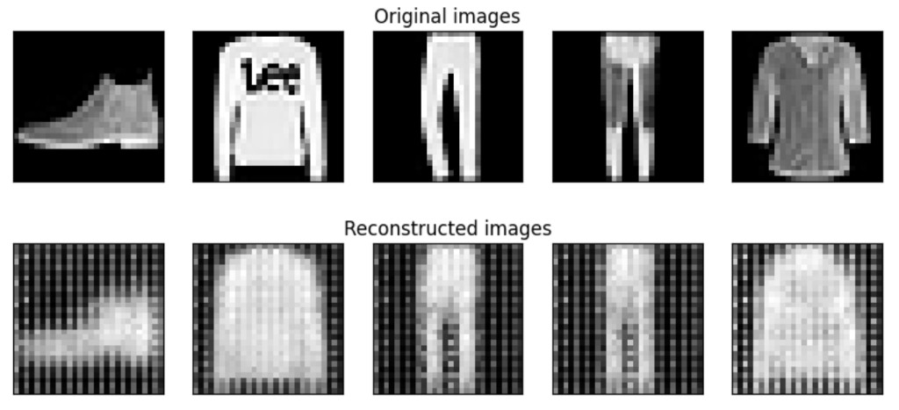

*Після 1 епохи: реконструкції нечіткі, є «шахівний» артефакт — модель тільки починає вчитися.*

```
	 ...
 EPOCH 30/30 	 train loss 0.019 	 val loss 0.019
```

*(після 30 епох)*

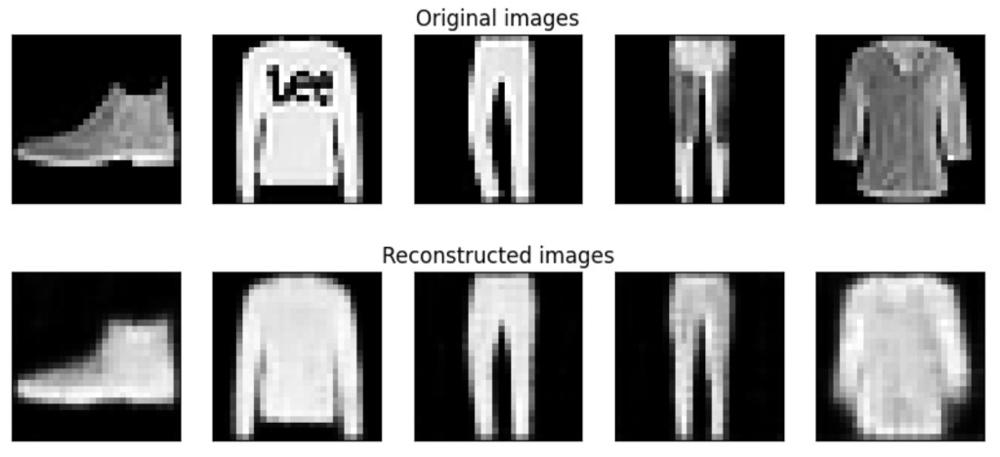

*Після 30 епох: реконструкції значно чіткіші. Видно силуети і форми одягу. Частина деталей втрачена — наслідок стиснення до dim=4.*

**Як читати:**
- `train loss` і `val loss` мають бути близькими — якщо `val_loss` значно вищий за `train_loss`, це перенавчання.
- Спадання loss до ~0.019 свідчить про якісне навчання.
- На першій епосі реконструкції «брудні» і нечіткі — нормально. З кожною епохою якість зростає.

---

### 6.5 Фінальна оцінка на тесті

```python
# Обчислюємо reconstruction loss на тестовій вибірці (ніколи не бачила раніше)
test_epoch(encoder, decoder, device, test_loader, loss_fn).item()
```

**Очікуваний вивід:**

```
0.019229914993047714
```

**Як читати:** `test_loss ≈ 0.0192` — значення близьке до `train_loss` і `val_loss`. Це означає, що **перенавчання відсутнє** — модель добре узагальнює на нові дані.

> **Нюанс:** `.item()` конвертує одноелементний тензор у звичайний Python float. Без `.item()` вивід буде `tensor(0.0192)`.

---

### 6.6 Графік функції втрат

```python
# Будуємо графік зміни loss по епохах
plt.figure(figsize=(7, 5))

# semilogy: логарифмічна шкала по осі Y — краще видно зміни на початку навчання
plt.semilogy(history['train_loss'], label='Train')
plt.semilogy(history['val_loss'], label='Valid')

plt.xlabel('Epoch')
plt.ylabel('Average Loss')
plt.legend()
plt.show()
```

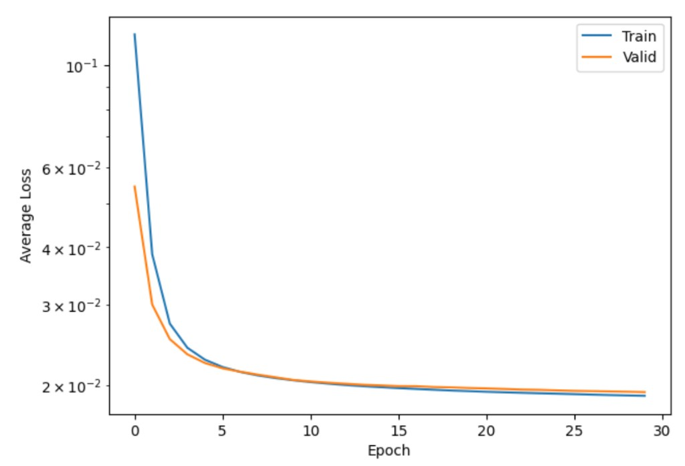

*Логарифмічна шкала: train (синій) і valid (оранжевий) loss спадають паралельно. Криві злилися — ознака відсутності перенавчання.*

**Пояснення параметрів `plt.semilogy`:**

| Параметр | Значення | Опис |
| -------- | -------- | ---- |
| `plt.semilogy(data)` | — | Лінійний графік з логарифмічною Y-шкалою |
| `label='Train'` | рядок | Підпис для легенди |
| `plt.xlabel('Epoch')` | — | Підпис осі X |
| `plt.legend()` | — | Показує легенду |

**Як читати:**
- Криві різко падають у перших 5 епохах → модель швидко навчається базових форм
- Потім уповільнюється → тонке підстроювання
- Обидві криві (train і valid) збігаються → немає ані underfitting, ані overfitting

---

## ЧАСТИНА 7. ПРАКТИКА — ГЕНЕРАЦІЯ НОВИХ ЗОБРАЖЕНЬ

### 7.1 Концепція: семплінг із латентного простору

Ідея: якщо encoder відображає зображення у точки `z` в 4-вимірному просторі, то довільні точки в цьому просторі теж можна «декодувати» у нові зображення.

**Метод:** знаходимо середнє `μ` і стандартне відхилення `σ` latent кодів для кількох тестових зображень, а потім семплюємо нові `z` з нормального розподілу `N(μ, σ²)`:

```
z_new = randn(dim) × σ + μ
```

### 7.2 Функції show_image і show_top_n

```python
def show_image(img):
    """
    Відображає один батч зображень у вигляді сітки.
    img: тензор від torchvision.utils.make_grid (C×H×W)
    """
    npimg = img.numpy()  # Конвертуємо тензор у numpy для matplotlib
    # make_grid повертає [C, H, W]; plt.imshow очікує [H, W, C]
    # np.transpose переставляє виміри: (1,2,0) = (H, W, C)
    plt.imshow(np.transpose(npimg, (1, 2, 0)))


def show_top_n(encoder, decoder, dataset, n=10):
    """
    Генерує нові зображення, семплюючи з латентного простору.

    encoder, decoder: навчені об'єкти
    dataset: датасет для обчислення mid/std latent code
    n: кількість зображень для обчислення статистики
    """
    encoder.eval()
    decoder.eval()

    with torch.no_grad():
        # 1. Кодуємо перші n зображень датасету
        images, labels = map(list, zip(*[dataset[i] for i in range(n)]))
        # map(list, ...) конвертує zip-об'єкт у два списки
        # zip(*...) розпаковує список пар (img, label) у два окремі ітерабельні
        images = torch.stack(images).to(device)  # Збираємо список тензорів у батч
        latent = encoder(images)  # Отримуємо latent коди: [n, dim]
        latent = latent.cpu()

        # 2. Обчислюємо статистику latent space
        mean = latent.mean(dim=0)  # Середнє по batch виміру: [dim]
        print(mean)
        std = (latent - mean).pow(2).mean(dim=0).sqrt()  # Стандартне відхилення: [dim]
        print(std)

        # 3. Семплюємо 128 нових latent векторів з нормального розподілу
        # torch.randn(128, dim): 128 векторів з N(0,1)
        # * std + mean: масштабуємо і зсуваємо до N(mean, std²)
        latent = torch.randn(128, dim) * std + mean

        # 4. Декодуємо нові latent вектори
        latent = latent.to(device)
        img_recon = decoder(latent)  # [128, 1, 28, 28]
        img_recon = img_recon.cpu()

        # 5. Відображаємо перші 100 із 128 згенерованих зображень у сітці 10×10
        fig, ax = plt.subplots(figsize=(20, 8.5))
        show_image(torchvision.utils.make_grid(img_recon[:100], 10, 5))
        # make_grid(tensor, nrow, padding): nrow=10 зображень у рядку, padding=5 пікселів між
        plt.show()


show_top_n(encoder, decoder, test_dataset, n=10)
```

**Пояснення методів:**

| Метод | Параметри | Що робить |
| ----- | --------- | --------- |
| `torch.stack(list)` | список тензорів | Об'єднує список тензорів у новий батч-вимір |
| `latent.mean(dim=0)` | `dim=0`: по batch | Середнє по batch виміру → вектор розміру `[dim]` |
| `.pow(2)` | — | Підносить кожен елемент до квадрату |
| `.sqrt()` | — | Квадратний корінь з кожного елемента |
| `torch.randn(128, dim)` | — | 128 × dim матриця з N(0,1) |
| `torchvision.utils.make_grid(tensor, nrow, padding)` | `nrow`: кількість зображень у рядку | Збирає батч зображень у єдине зображення-сітку |

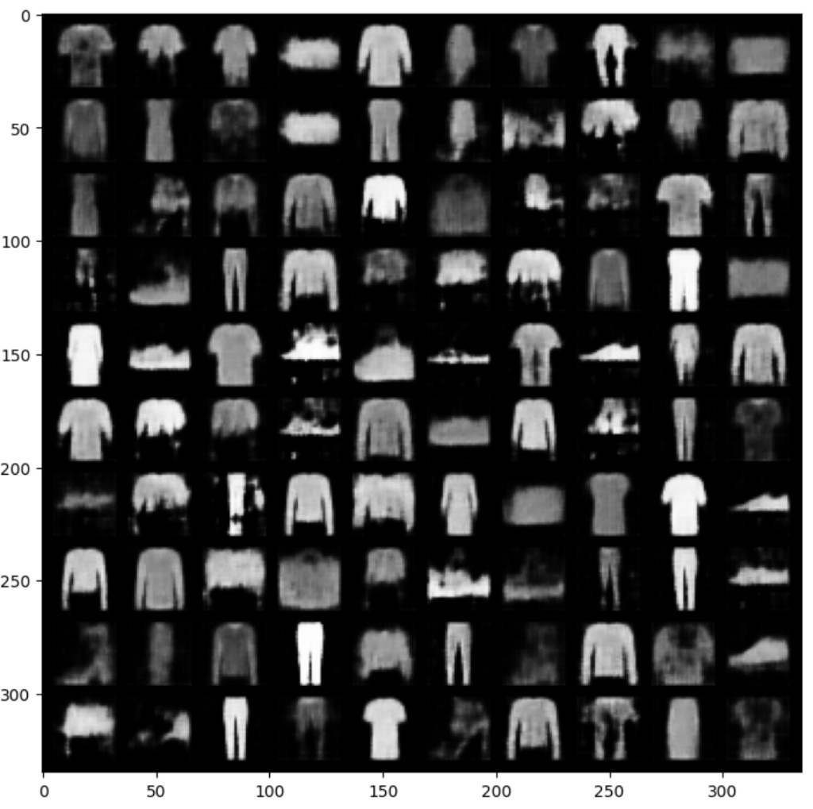

*100 нових зображень, декодованих із точок у латентному просторі (семплінг із N(μ, σ²)). Деякі нагадують одяг, деякі — безглузді.*

**Як читати:**
- Деякі зображення схожі на одяг (сорочки, штани, взуття) — decoder «впізнає» семпли, близькі до тренувальних даних.
- Частина зображень виглядає безглуздо — бо latent space **нерегулярний**: між реальними точками можуть бути «порожні» зони, де decoder не знає, що генерувати.

#### Чому AE погано підходить для генерації

> **Ключовий висновок:** звичайний автокодер навчається відображати конкретні зображення в конкретні точки latent space. Між цими точками можуть бути «порожні» зони, де decoder не має чіткого навчального сигналу → генерує безглуздя.
>
> **Рішення:** Variational Autoencoder (VAE) — регуляризує latent space так, щоб він був «безперервним» і нормально розподіленим. Будь-яка точка в такому просторі декодується у щось осмислене. VAE — тема наступних лекцій.

```
Звичайний AE:          VAE:
  x₁ → z₁               x₁ → μ₁ ± σ₁  (розподіл, не точка)
  x₂ → z₂               x₂ → μ₂ ± σ₂
  ↑                      ↑
між z₁ і z₂             latent простір «щільний»
можуть бути             → семплінг дає осмислені
«порожні» місця         зображення скрізь
```

---

## ПІДСУМКИ

### Що ми вивчили

- **Аналіз результатів детекції:**
  - YOLO зберігає результати у `runs/detect/<model>_<exp>/` — метрики, криві, confusion matrix.
  - **AP** — площа під PR-кривою для одного класу. **mAP** — середнє AP по класах.
  - `mAP@0.5 = 0.874` — дуже хороший результат. `mAP@0.50:0.95 = 0.62` — є куди рости.
  - Найслабший клас — `vehicle` (AP=0.720): найменша кількість прикладів у датасеті.
  - Loss у YOLOv8/v9: `box_loss + cls_loss + dfl_loss` (DFL замінив objectness з YOLOv1).
- **Автокодери:**
  - `Autoencoder = Encoder + Code + Decoder` — навчання без міток.
  - **Reconstruction loss:** MSE для [0,1] значень, BCE для бінарних/категоріальних.
  - Ключова властивість: залежність від даних і кодування з втратами.
  - 9 застосувань: denoising, super-resolution, colorization, anomaly detection тощо.
- **Згорткові автокодери:**
  - Encoder: Conv2d зі stride=2 → зменшення просторового розміру.
  - Decoder: ConvTranspose2d — транспонована згортка для збільшення розміру.
  - Формула: `output = (input - 1) × stride - 2 × padding + kernel + output_padding`.
- **Практика (Fashion-MNIST):**
  - Стиснення 28×28 = 784 числа → 4 числа (стиснення у 196 разів).
  - Після 30 епох: `test_loss ≈ 0.019`, перенавчання відсутнє.
  - Генерація з латентного простору: частина зображень осмислена, частина — ні.
  - Причина: AE має нерегулярний latent space → для генерації краще VAE.

---

## EXAM / REVISION CHEAT SHEET

### 1) AP і mAP — швидко

- `AP` = площа під PR-кривою для **одного класу**
- `mAP` = середнє AP по **всіх класах**
- `mAP@0.5` = AP при IoU ≥ 0.5 (один IoU threshold — «легкий» варіант)
- `mAP@0.50:0.95` = середнє по IoU 0.50, 0.55, ..., 0.95 (строгий COCO-критерій)
- `F1 = 2·P·R/(P+R)` — максимізується при оптимальному confidence threshold

### 2) Читання графіків YOLO

| Графік | Що шукати |
| ------ | --------- |
| `F1_curve` | Де максимум F1 → оптимальний conf threshold |
| `PR_curve` | AP по класах; слабкі класи мають низький AP |
| `P_curve` | Зростає → 1 при conf → 1 (модель впевнена = точна) |
| `R_curve` | Спадає при conf → 1 (суворий поріг = більше пропусків) |
| `confusion_matrix_normalized` | Діагональ = recall по класах; колонка background = пропуски |
| `results.png` | Чи спадають всі loss? Чи зростають метрики? Перенавчання? |

### 3) Автокодер — must know

```
Input X  →  [Encoder]  →  Code z  →  [Decoder]  →  X̂ (реконструкція)
             стискає           відновлює
```

- Навчання: мінімізація reconstruction loss = MSE(X, X̂)
- Latent space = компактне представлення суті вхідних даних
- **Без міток** (unsupervised learning)

### 4) Транспонована згортка (ConvTranspose2d)

- Збільшує просторовий розмір (протилежна до Conv2d зі stride)
- `output = (in - 1) × stride - 2 × padding + kernel + output_padding`
- Stride=2 → розмір × 2 (приблизно)
- `output_padding` потрібен для точного відновлення непарних розмірів

### 5) Форми тензорів нашого CAE

```
Encoder:  [B,1,28,28] → [B,8,14,14] → [B,16,7,7] → [B,32,3,3] → [B,288] → [B,128] → [B,4]
Decoder:  [B,4] → [B,128] → [B,288] → [B,32,3,3] → [B,16,7,7] → [B,8,14,14] → [B,1,28,28]
```

### 6) Чому AE погано генерує і навіщо VAE

- AE: кожне зображення → одна точка в latent space → між точками «порожні» зони
- VAE: кожне зображення → розподіл (μ, σ) → regularized latent space → будь-яка точка осмислена

### 7) Типові пастки коду

- `optim = torch.optim.Adam(...)` перезаписує модуль `optim` → пиши `torch.optim.Adam()` далі
- `encoder.to(device)` і `decoder.to(device)` окремо — вони незалежні `nn.Module`
- `image_batch.to(device)` у циклі — батчі теж потрібно переносити
- `plot_ae_outputs` читає `test_dataset`, `device`, `dim` з глобальної області
- `data_dir = 'data'` для Colab/локально; `'../data'` для Kaggle
- `BatchNorm2d(8)` і `(32)` у Encoder закоментовані — це **навмисно**, не помилка

---

## КОРИСНІ ПОСИЛАННЯ

- **Репозиторій курсу:** [github.com/goitacademy/DEEP-LEARNING-FOR-COMPUTER-VISION-AND-NLP](https://github.com/goitacademy/DEEP-LEARNING-FOR-COMPUTER-VISION-AND-NLP)
- **Ноутбук лекції (офіційний):** [Module_4_Lecture_8_Class.ipynb](https://github.com/goitacademy/DEEP-LEARNING-FOR-COMPUTER-VISION-AND-NLP/blob/main/notebooks/Module_4_Lecture_8_Class.ipynb)
- **Ноутбук теми 7 (з кодом тренування):** [тема_7/deep-learning-topic-7.ipynb](../тема_7/deep-learning-topic-7.ipynb)
- **Fashion-MNIST:** [github.com/zalandoresearch/fashion-mnist](https://github.com/zalandoresearch/fashion-mnist)
- **torchvision.datasets:** [docs.pytorch.org/vision/main/datasets.html](https://docs.pytorch.org/vision/main/datasets.html)
- **Conv arithmetic (анімації):** [github.com/vdumoulin/conv_arithmetic](https://github.com/vdumoulin/conv_arithmetic/blob/master/README.md)
- **PyTorch nn.ConvTranspose2d:** [pytorch.org/docs/stable/generated/torch.nn.ConvTranspose2d.html](https://pytorch.org/docs/stable/generated/torch.nn.ConvTranspose2d.html)
- **Конспект теми 7:** [тема_7/7_object_detection_notes.md](../тема_7/7_object_detection_notes.md)

---

## СТРУКТУРА ФАЙЛІВ

```
тема_8/
├── 8_autoencoders_notes.md     ← Цей конспект
└── images/
    ├── f1_curve.png                 ← F1-Confidence Curve
    ├── pr_curve.png                 ← Precision-Recall Curve (AP по класах)
    ├── p_curve.png                  ← Precision-Confidence Curve
    ├── r_curve.png                  ← Recall-Confidence Curve
    ├── confusion_matrix.png         ← Confusion Matrix (абсолютна)
    ├── confusion_matrix_normalized.png  ← Confusion Matrix (нормалізована)
    ├── labels.png                   ← Статистика датасету (кількість, форми bbox)
    ├── labels_correlogram.png       ← Попарна кореляція параметрів bbox
    ├── results_training_curves.png  ← Learning curves (loss + метрики по епохах)
    ├── val_batch_predictions.jpg    ← Приклади детекцій на валідаційному батчі
    ├── autoencoder_architecture.png ← Схема AE: Encoder → Code → Decoder
    ├── conv_autoencoder_architecture.png  ← Схема CAE з розмірами
    ├── no_padding_no_strides_transposed.gif  ← Анімація транспонованої згортки
    ├── fashion_mnist_samples.png    ← Приклади зображень Fashion-MNIST
    ├── reconstruction_epoch_1.png   ← Реконструкції після 1 епохи
    ├── reconstruction_epoch_30.png  ← Реконструкції після 30 епох
    ├── loss_curve_train_valid.png   ← Train/valid loss по епохах
    └── generated_from_latent.png   ← 100 зображень, згенерованих із latent space
```
