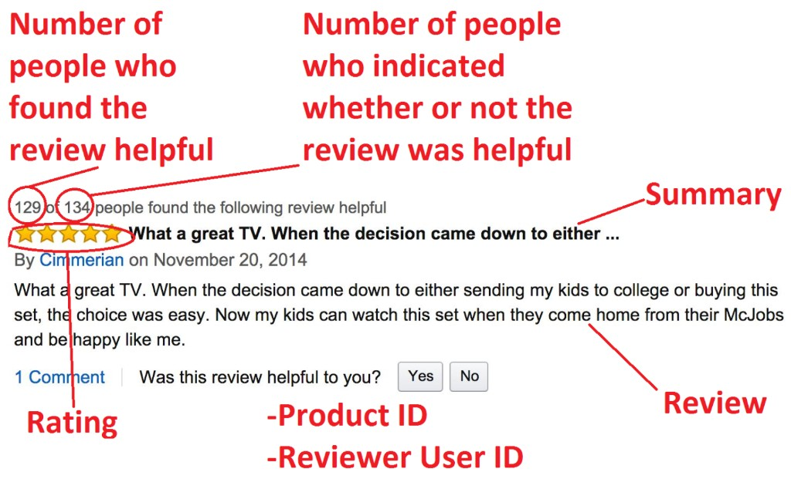
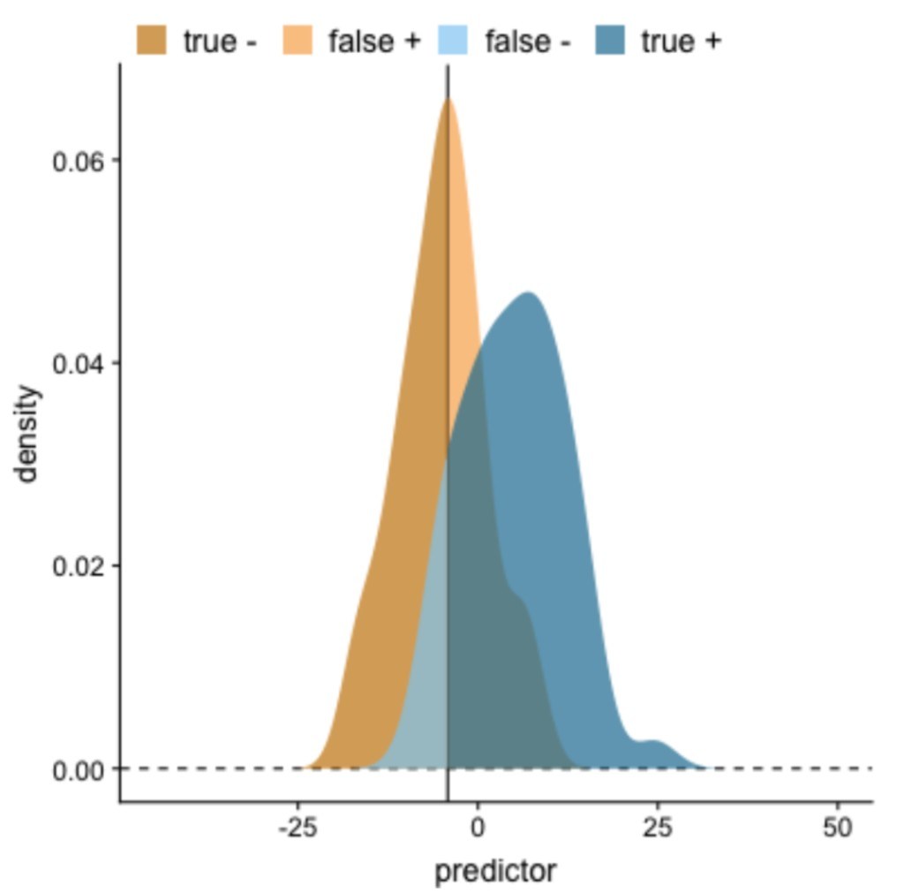
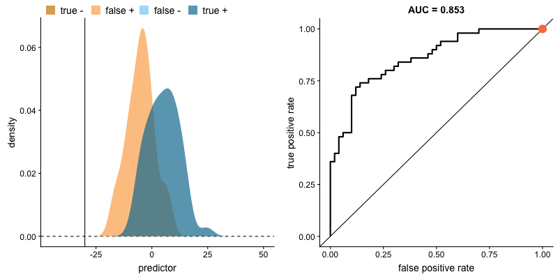
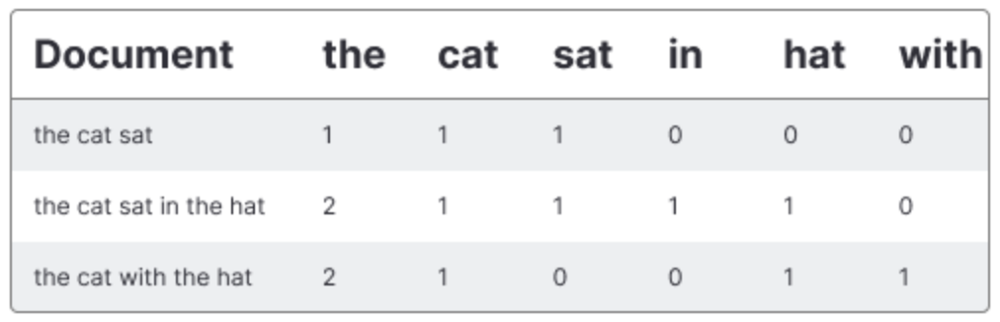
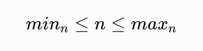

# КОНСПЕКТ ЛЕКЦІЇ: Підготовка даних в обробці природної мови (NLP)

> **Де виконувати:** [Google Colab](https://colab.research.google.com) — відкрий посилання в браузері, натисни **"New notebook"**, і починай виконувати кроки по черзі. Кожен блок коду вставляй в окрему клітинку і запускай кнопкою ▶ або клавішами **Shift + Enter**.
>
> **Альтернатива:** локальний Jupyter Notebook. Встанови залежності (дивись КРОК 0 нижче), запусти `jupyter lab`. Документація: [jupyter.org/install](https://jupyter.org/install)
>
> **Для NLP:** GPU не потрібен — логістична регресія з векторизованим текстом відмінно працює на CPU за кілька секунд.

---

## КРОК 0. ПІДГОТОВКА СЕРЕДОВИЩА (виконати перед усім іншим)

### Для Google Colab

1. Відкрий [Google Colab](https://colab.research.google.com) → **"New notebook"**
2. Виконай наступну клітинку — вона клонує репозиторій і переходить у директорію теми 9:

```python
# Видаляємо стару копію репозиторію (якщо вже клонували раніше)
!rm -rf deep

# Клонуємо особистий репозиторій з конспектами і матеріалами
!git clone https://github.com/PetraStill/deep.git deep

# Переходимо в директорію репозиторію
%cd deep
```

3. Встановлюємо всі необхідні бібліотеки:

```python
# Встановлюємо бібліотеку для завантаження датасетів з Kaggle
!pip install kagglehub

# Встановлюємо бібліотеку для NLP: токенізація, стоп-слова, стемінг
!pip install nltk

# Встановлюємо spaCy та мовну модель для англійської (для лематизації)
!pip install spacy
!python -m spacy download en_core_web_sm
```

4. Завантажуємо датасет Amazon Product Reviews з [Kaggle](https://www.kaggle.com/datasets/arhamrumi/amazon-product-reviews):

```python
# --- Спосіб 1: автоматичне завантаження через kagglehub (рекомендовано) ---
# Потрібен Kaggle-акаунт і API-ключ (~/.kaggle/kaggle.json)
import kagglehub

# Завантажуємо датасет і зберігаємо шлях до директорії
path = kagglehub.dataset_download("arhamrumi/amazon-product-reviews")
print("Датасет знаходиться за шляхом:", path)

# Тепер вказуємо повний шлях до CSV-файлу для pd.read_csv()
# Файл: Module_5_Lecture_1_Class_amazon_product_reviews.csv
```

> **Спосіб 2 (ручне завантаження):** відкрий [kaggle.com/datasets/arhamrumi/amazon-product-reviews](https://www.kaggle.com/datasets/arhamrumi/amazon-product-reviews), натисни **Download**, розпакуй архів і завантаж CSV у Colab через панель **Files → Upload**.

### Для локального запуску

```bash
# Створюємо і активуємо окреме Python-середовище
python -m venv nlp_env
source nlp_env/bin/activate  # macOS/Linux
# nlp_env\Scripts\activate  # Windows

# Встановлюємо всі необхідні бібліотеки
pip install pandas numpy scikit-learn nltk spacy matplotlib seaborn tqdm jupyter

# Завантажуємо мовну модель spaCy для англійської
python -m spacy download en_core_web_sm

# Завантажуємо стоп-слова NLTK (виконати один раз у Python)
# python -c "import nltk; nltk.download('stopwords')"

# Запускаємо Jupyter Lab
jupyter lab
```

> **Що потрібно локально:**
>
> - Python 3.9+
> - GPU не потрібен
> - Мінімум 2 ГБ RAM (датасет — ~300 МБ)

---

## ЧАСТИНА 0. КОРОТКИЙ ОГЛЯД ТЕМИ

### Що ми будемо робити?

У цій темі ми:

- ознайомимось із задачами **обробки природної мови (NLP)** — широкою галуззю штучного інтелекту
- завантажимо та дослідимо датасет **Amazon Product Reviews** (568 тисяч відгуків)
- пройдемо повний пайплайн **препроцесингу тексту**: очищення → токенізація → стоп-слова → лематизація
- розберемо **регулярні вирази** (RegEx) і побудуємо функцію `normalize_text`
- познайомимось із метрикою **ROC-AUC** для оцінки бінарних класифікаторів
- перетворимо тексти у числові вектори методами **Bag of Words**, **TF-IDF** та **n-грамами**
- навчимо **логістичну регресію** і порівняємо різні підходи за значенням AUC

### Розшифровка нових скорочень

| Символ / Скорочення | Що означає | Простими словами | Навіщо |
| ------------------- | ---------- | ---------------- | ------- |
| `NLP` | Natural Language Processing | Обробка природної мови | Галузь ШІ для роботи з текстом |
| `NLTK` | Natural Language Toolkit | — | Бібліотека Python для NLP: токенізація, стемінг, стоп-слова, корпуси |
| `token` | Token | Токен | Мінімальна одиниця тексту (слово, символ) |
| `corpus` | Corpus | Корпус | Зібрання текстів, які аналізуємо |
| `BoW` | Bag of Words | Мішок слів | Метод представлення тексту через частоти слів |
| `DTM` | Document-Term Matrix | Матриця документ-термін | Таблиця: рядки = документи, стовпці = слова |
| `TF` | Term Frequency | Частота терміна | Скільки разів слово зустрічається в документі |
| `DF` | Document Frequency | Частота документа | У скількох документах зустрічається слово |
| `IDF` | Inverse Document Frequency | Зворотна (обернена) частота документа | **Inverse** = обернена величина DF: рідке слово → висока IDF → велика вага; часте слово → низька IDF → мала вага |
| `TF-IDF` | Term Frequency × Inverse Document Frequency | — | Ваговий показник важливості слова в документі: TF помножити на IDF |
| `n-gram` | N-gram | N-грама | Послідовність з n слів: «the cat» = біграма |
| `stemming` | Stemming | Стемінг | Відтинання суфіксів до кореня (може бути не словом) |
| `lemmatization` | Lemmatization | Лематизація | Приведення до словникової форми (завжди реальне слово) |
| `stop words` | Stop words | Стоп-слова | Службові слова без смислу: «a», «the», «is» |
| `OOV` | Out-Of-Vocabulary | Позасловниковий | Слово, якого немає у навченому словнику |
| `sparse matrix` | Sparse matrix | Розріджена матриця | Матриця, де більшість елементів — нулі |
| `TPR` | True Positive Rate | Частка істинно позитивних | Яку частку позитивних правильно знайшла модель |
| `FPR` | False Positive Rate | Частка хибно позитивних | Яку частку негативних помилково відніс до позитивних |
| `ROC` | Receiver Operating Characteristic | Характеристична крива | Графік TPR vs FPR при різних порогах |
| `AUC` | Area Under the Curve | Площа під кривою | Загальна якість класифікатора; 1 = ідеально |
| `threshold` | Threshold | Поріг | Мінімальна впевненість для вибору класу «1» |
| `NER` | Named Entity Recognition | Розпізнавання сутностей | Знаходження імен, організацій, місць у тексті |
| `NLG` | Natural Language Generation | Генерація природної мови | Автоматичне створення тексту |
| `QA` | Question Answering | Відповіді на питання | Пошук або генерація відповіді на запит |

---

## ЧАСТИНА 1. ВСТУП ДО ЗАДАЧ NLP

### Що таке NLP?

**Обробка природної мови (Natural Language Processing, NLP)** — це галузь штучного інтелекту, що займається тим, щоб навчити комп'ютери розуміти, інтерпретувати і генерувати людську мову. Завдяки NLP неструктуровані текстові дані перетворюються на корисну інформацію.

### Огляд задач NLP

| Задача | Що робить | Приклад застосування |
| ------ | --------- | -------------------- |
| **Аналіз сентименту** | Визначає емоційний тон тексту (позитивний / негативний / нейтральний) | Аналіз відгуків покупців, моніторинг соціальних мереж |
| **Класифікація тексту** | Присвоює текстовому документу один або кілька класів | Фільтрація спаму, категоризація новин |
| **Розпізнавання сутностей (NER)** | Знаходить і класифікує іменовані об'єкти: особи, місця, організації | Вилучення фактів з новин, медичних записів |
| **Автоматичне резюмування** | Стискає великий текст до короткого резюме | Реферування наукових статей, новинних стрічок |
| **Машинний переклад** | Автоматично перекладає текст з однієї мови на іншу | Google Translate, DeepL |
| **Виявлення тем** | Знаходить приховані теми у великому корпусі текстів | Аналіз форумів, відгуків клієнтів |
| **Відповіді на питання (QA)** | Знаходить точну відповідь на запитання у документі або корпусі | Пошукові системи, корпоративні FAQ-боти |
| **Чат-боти і діалогові системи** | Підтримують природну розмову з користувачем | Служби підтримки клієнтів, асистенти (Siri, Alexa) |
| **Генерація тексту (NLG)** | Автоматично створює текст на основі вхідних даних | Генерація звітів, описів продуктів |
| **Корекція граматики і орфографії** | Знаходить і виправляє помилки в тексті | Grammarly, вбудована перевірка у Word |
| **Виявлення парафраз** | Знаходить речення з однаковим значенням, але різними словами | Перевірка плагіату, покращення пошуку |

> 💡 **Сьогодні** ми розв'язуємо задачу **аналізу сентименту** — визначаємо, позитивний чи негативний відгук покупця на Amazon, і оцінюємо якість за допомогою метрики **ROC-AUC**.

---

## ЧАСТИНА 2. EDA НАБОРУ ДАНИХ AMAZON PRODUCT REVIEWS

### 2.1 Знайомство з даними

У цій темі ми будемо працювати з набором даних [Amazon Product Reviews](https://www.kaggle.com/datasets/arhamrumi/amazon-product-reviews). Цей датасет містить понад **568 тисяч відгуків** клієнтів та оцінок різним продуктам на платформі Amazon.



*На зображенні показана анатомія одного відгуку Amazon: зліва вгорі — кількість людей, які вважали відгук корисним (HelpfulnessNumerator) і загальна кількість, хто висловив думку (HelpfulnessDenominator); жовті зірочки — оцінка (Score); жирний текст заголовку — Summary; основний текст — Text. Під відгуком також кодуються ProductId і UserId.*

**Ознаки датасету:**

| Назва колонки | Тип | Опис |
| ------------- | --- | ----- |
| `Id` | int | Ідентифікатор запису (використовуємо як індекс) |
| `ProductId` | str | Унікальний ідентифікатор товару |
| `UserId` | str | Унікальний ідентифікатор користувача |
| `ProfileName` | str | Ім'я профілю користувача |
| `HelpfulnessNumerator` | int | Кількість людей, які вважали відгук корисним |
| `HelpfulnessDenominator` | int | Кількість людей, які вказали, корисний відгук чи ні |
| `Score` | int | Оцінка від 1 до 5 |
| `Time` | int | Unix-час публікації відгуку |
| `Summary` | str | Короткий заголовок відгуку |
| `Text` | str | Повний текст відгуку |

**Наша задача:** визначити **сентимент** відгуку (позитивний / негативний) на основі оцінки:
- `Score` 4 або 5 → **позитивний** (sentiment = 1)
- `Score` 1 або 2 → **негативний** (sentiment = 0)
- `Score` 3 → **нейтральний** (ігноруємо у навчанні)

### 2.2 Завантаження та початковий огляд

```python
# Завантажуємо всі необхідні бібліотеки
import re           # Регулярні вирази
import string       # Рядкові константи (рядки пунктуації)
import itertools    # Ітератори
from collections import Counter  # Підрахунок частот

import pandas as pd     # Датафрейми
import numpy as np      # Числові операції

import nltk             # NLTK = Natural Language Toolkit — бібліотека для NLP
nltk.download('stopwords')  # Завантажуємо список стоп-слів (одноразово)

from nltk.corpus import stopwords          # Список стоп-слів
from nltk.tokenize import word_tokenize   # Токенізатор
from nltk.stem.porter import PorterStemmer  # Стемер Портера

import spacy  # Бібліотека для NLP з лематизацією

from sklearn.metrics import roc_auc_score                        # Метрика AUC
from sklearn.feature_extraction.text import CountVectorizer      # BoW-векторизатор
from sklearn.feature_extraction.text import TfidfVectorizer      # TF-IDF-векторизатор
from sklearn.linear_model import LogisticRegression             # Класифікатор

from tqdm.auto import tqdm    # tqdm = «прогрес» (арабське taqaddum) — бібліотека прогрес-барів
tqdm.pandas()                 # Підключаємо tqdm до pandas: активуємо метод progress_apply()

import matplotlib.pyplot as plt  # Графіки
import seaborn as sns            # Статистична візуалізація
```

**Пояснення ключових імпортів:**

| Бібліотека / модуль | Навіщо |
| ------------------- | ------- |
| `re` | Регулярні вирази для очищення тексту |
| `nltk.corpus.stopwords` | Готовий список стоп-слів для англійської |
| `PorterStemmer` | Алгоритм стемінгу Портера (1980) |
| `spacy` | Сучасна NLP-бібліотека з точною лематизацією |
| `CountVectorizer` | Перетворює тексти у матрицю частот (BoW) |
| `TfidfVectorizer` | Перетворює тексти у матрицю TF-IDF |
| `LogisticRegression` | Бінарний класифікатор: визначає сентимент |
| `tqdm` | Показує прогрес-бар під час `apply`. Назва — від арабського **taqaddum** (تقدّم) = «прогрес». Виводить: скільки рядків оброблено, скільки лишилось і швидкість (рядків/сек) |

```python
# CSV (~300 МБ) не зберігається у git — завантажуємо з Kaggle перед першим запуском
# Виконати цей блок один раз, далі файл вже буде на місці
!pip install -q kagglehub

import kagglehub, shutil, os, glob

# Завантажуємо датасет (потрібен Kaggle-акаунт; авторизація відбувається автоматично)
path = kagglehub.dataset_download("arhamrumi/amazon-product-reviews")

# Дивимось, що завантажилось
print(glob.glob(path + '/*'))

# Кладемо файл туди, де його очікує ноутбук
os.makedirs('../data', exist_ok=True)
csv_src = glob.glob(path + '/*.csv')[0]
shutil.copy(csv_src, '../data/Module_5_Lecture_1_Class_amazon_product_reviews.csv')

print('Готово!')

# Зчитуємо набір даних; Id стає індексом датафрейму
# '../data/' — бо ноутбук лежить у папці notebooks/, а CSV — на рівень вище у data/
df = pd.read_csv('../data/Module_5_Lecture_1_Class_amazon_product_reviews.csv', index_col='Id')
```

```python
# Переглядаємо перші рядки для розуміння структури даних
df.head(3)
```

**Очікуваний вивід:**

| Id | ProductId | UserId | ProfileName | HelpfulnessNumerator | HelpfulnessDenominator | Score | Time | Summary | Text |
|---|---|---|---|---|---|---|---|---|---|
| 1 | B001E4KFG0 | A3SGXH7AUHU8GW | delmartian | 1 | 1 | 5 | 1303862400 | Good Quality Dog Food | I have bought several of the Vitality... |
| 2 | B00813GRG4 | A1D87F6ZCVE5NK | dll pa | 0 | 0 | 1 | 1346976000 | Not as Advertised | Product arrived labeled as Jumbo Salted... |
| 3 | B000LQOCH0 | ABXLMWJIXXAIN | Natalia Corres | 1 | 1 | 4 | 1219017600 | "Delight" says it all | This is a confection that has been around... |

**Як читати:** рядок 1 — позитивний відгук (Score = 5), рядок 2 — негативний (Score = 1), рядок 3 — позитивний (Score = 4).

```python
# Переглядаємо базову інформацію про датасет (типи, кількість ненульових значень)
df.info()
```

**Очікуваний вивід:**
```
Int64Index: 568454 entries, 1 to 568454
Data columns (total 9 columns):
 #   Column                  Non-Null Count   Dtype
 0   ProductId               568454 non-null  object
 1   UserId                  568454 non-null  object
 2   ProfileName             568438 non-null  object   ← 16 пропусків
 3   HelpfulnessNumerator    568454 non-null  int64
 4   HelpfulnessDenominator  568454 non-null  int64
 5   Score                   568454 non-null  int64
 6   Time                    568454 non-null  int64
 7   Summary                 568427 non-null  object   ← 27 пропусків
 8   Text                    568454 non-null  object
```

**Як читати:** `ProfileName` та `Summary` мають невелику кількість пропусків. Це не критично для нашої задачі, оскільки ми будемо класифікувати за полем `Text`. Поле `Text` — повне (0 пропусків).

### 2.3 Створення цільової змінної

Ми розв'язуємо задачу **бінарної класифікації**. Нейтральні відгуки (Score = 3) ігноруємо.

```python
# Видаляємо нейтральні відгуки (Score = 3) — вони не мають чіткого сентименту
df = df.loc[df['Score'] != 3]

# Перевіряємо розмір після фільтрації
df.shape
```

**Очікуваний вивід:** `(525814, 9)` — відфільтрували ~42 640 нейтральних відгуків.

```python
# Створюємо цільову змінну:
# 1 (позитивний) — якщо Score = 4 або 5
# 0 (негативний) — якщо Score = 1 або 2
df['sentiment'] = [1 if score in [4, 5] else 0 for score in df['Score']]
```

**Пояснення:** використовуємо list comprehension — для кожного значення `score` у колонці `Score` перевіряємо умову і записуємо 1 або 0. Це ефективніше, ніж `apply`.

### 2.4 Видалення дублікатів

```python
# Підраховуємо кількість повністю ідентичних рядків (усі 10 колонок однакові)
df.duplicated().sum()
```

**Очікуваний вивід:** `255` — є 255 абсолютно ідентичних записів.

```python
# Видаляємо повні дублікати і скидаємо індекс
df = df.drop_duplicates().reset_index(drop=True)
```

> 👉 **Важливо:** на Amazon один продукт може мати кілька версій (наприклад, футболка трьох кольорів). Один і той самий користувач міг залишити **однаковий відгук** для кількох версій продукту. Такі записи мають різні `ProductId`, але однакові `UserId`, `Time` і `Text`.

```python
# Шукаємо однакові відгуки для різних версій продукту
df.groupby(['UserId', 'Time', 'Text']).count().sort_values('ProductId', ascending=False).head(10)
```

**Очікуваний вивід:** таблиця показує, що деякі комбінації (UserId, Time, Text) зустрічаються 182, 51, 43 і більше разів — це той самий відгук, скопійований на кілька версій товару.

> 💡 **Цікавий нюанс:** навіть маючи однаковий `ProductId`, `UserId`, `Time` і `Text` — деякі записи мають **різний Summary**. Це означає, що один і той самий користувач переписав заголовок (Summary), залишивши той самий текст. Платформа Amazon, схоже, зберігала кожен редагований варіант як окремий запис.

```python
# Видаляємо дублікати за ключовою комбінацією: UserId + Time + Text
# Залишаємо лише один відгук від одного користувача в один момент часу
df = df.drop_duplicates(subset={"UserId", "Time", "Text"})

# Перевіряємо фінальний розмір датасету
df.shape
```

**Очікуваний вивід:** `(364133, 10)` — після видалення дублікатів залишилось 364 тисячі унікальних відгуків.

---

## ЧАСТИНА 3. НОРМАЛІЗАЦІЯ ТЕКСТУ

### Навіщо препроцесити текст?

Сирі тексти відгуків містять багато «шуму» — HTML-теги (`<br />`), URL-адреси, пунктуацію, скорочення (`don't`, `I'm`), числа. Моделі машинного навчання не розуміють таких елементів — вони працюють лише з числами. Тому перед векторизацією тексту його потрібно очистити і нормалізувати.

**Три головні причини препроцесингу:**
1. **Видалення шуму** — прибираємо елементи, які не несуть змістовної інформації
2. **Поліпшення якості навчання** — чисті дані дають моделям кращі закономірності
3. **Зниження розмірності** — менше унікальних слів = менший словник = швидша модель

> 👉 **Токен** — це основна одиниця в NLP. Залежно від задачі токеном може бути слово, речення або навіть символ. **Токенізація** — процес розбиття тексту на токени.

### Типові кроки нормалізації тексту

| № | Крок | Що робить | Приклад |
|---|------|-----------|---------|
| 1 | Lowercase | Приводить до нижнього регістру | `Apple` → `apple` |
| 2 | Розширення скорочень | Розгортає скорочення | `we'll` → `we will` |
| 3 | Видалення пунктуації | Видаляє коми, крапки, знаки оклику | `Hello!!!` → `Hello` |
| 4 | Видалення URL | Видаляє посилання | `https://...` → ` ` |
| 5 | Видалення HTML-тегів | Видаляє розмітку | `<br />` → ` ` |
| 6 | Видалення email | Видаляє електронні адреси | `user@mail.com` → ` ` |
| 7 | Видалення хештегів | Видаляє теги соціальних мереж | `#amazon` → ` ` |
| 8 | Видалення згадувань | Видаляє @-теги | `@user` → ` ` |
| 9 | Видалення слів з цифрами | Видаляє «win2024», «product3» | `win2024` → ` ` |
| 10 | Видалення чисел | Видаляє окремі цифри і числа | `42` → ` ` |
| 11 | Видалення стоп-слів | Видаляє службові слова | `a`, `the`, `is` → ` ` |
| 12 | Видалення емодзі | Видаляє або замінює смайли | `😃` → ` ` |
| 13 | Видалення емотиконів | Видаляє ASCII-емотикони | `:-)`→ ` ` |
| 14 | Видалення частих слів | Видаляє слова, що домінують без змісту | `also`, `would` → ` ` |
| 15 | Видалення рідкісних слів | Видаляє слова з 1–2 появами | маловідомі терміни |
| 16 | Видалення слів за POS | Видаляє займенники, прийменники | `in`, `at`, `we` → ` ` |
| 17 | Стемінг | Відтинає суфікси до кореня | `running` → `run` |
| 18 | Лематизація | Приводить до словникової форми | `running` → `run`, `ran` → `run` |

### Стемінг vs Лематизація

Обидва методи зводять слово до «базової» форми, але по-різному:

| Характеристика | Стемінг | Лематизація |
| -------------- | ------- | ----------- |
| Принцип роботи | Відтинає суфікси/префікси за правилами | Враховує граматику і контекст |
| Результат | Може не бути справжнім словом | Завжди реальне слово (лема) |
| Приклад: `running` | `run` | `run` |
| Приклад: `runner` | `runner` | `runner` (не дієслово!) |
| Приклад: `ran` | `ran` (нічого не відтинається) | `run` (знає неправильне дієслово) |
| Приклад: `better` | `better` | `good` (знає ступені порівняння) |
| Швидкість | ⚡ Дуже швидко (правила) | 🐢 Повільніше (аналіз POS) |
| Якість | Нижча (грубе відтинання) | Вища (лінгвістично точна) |
| Бібліотека | `nltk.stem.porter.PorterStemmer` | `spaCy` |

**У нашому пайплайні ми використовуємо лематизацію** через `spaCy`, бо якість важливіша за швидкість на 5 000 прикладів.

### 3.1 Підготовчі дані: словник скорочень

```python
# Словник скорочень: ключ = скорочення, значення = повна форма
# Джерело: https://stackoverflow.com/questions/19790188
contractions = {
    "ain't": "am not",
    "aren't": "are not",
    "can't": "cannot",
    "can't've": "cannot have",
    "'cause": "because",
    "could've": "could have",
    "couldn't": "could not",
    "couldn't've": "could not have",
    "didn't": "did not",
    "doesn't": "does not",
    "don't": "do not",
    "hadn't": "had not",
    "hadn't've": "had not have",
    "hasn't": "has not",
    "haven't": "have not",
    "he'd": "he would",
    "he'd've": "he would have",
    "he'll": "he will",
    "he's": "he is",
    "how'd": "how did",
    "how'll": "how will",
    "how's": "how is",
    "i'd": "i would",
    "i'll": "i will",
    "i'm": "i am",
    "i've": "i have",
    "isn't": "is not",
    "it'd": "it would",
    "it'll": "it will",
    "it's": "it is",
    "let's": "let us",
    "ma'am": "madam",
    "mayn't": "may not",
    "might've": "might have",
    "mightn't": "might not",
    "must've": "must have",
    "mustn't": "must not",
    "needn't": "need not",
    "oughtn't": "ought not",
    "shan't": "shall not",
    "sha'n't": "shall not",
    "she'd": "she would",
    "she'll": "she will",
    "she's": "she is",
    "should've": "should have",
    "shouldn't": "should not",
    "that'd": "that would",
    "that's": "that is",
    "there'd": "there had",
    "there's": "there is",
    "they'd": "they would",
    "they'll": "they will",
    "they're": "they are",
    "they've": "they have",
    "wasn't": "was not",
    "we'd": "we would",
    "we'll": "we will",
    "we're": "we are",
    "we've": "we have",
    "weren't": "were not",
    "what'll": "what will",
    "what're": "what are",
    "what's": "what is",
    "what've": "what have",
    "where'd": "where did",
    "where's": "where is",
    "who'll": "who will",
    "who's": "who is",
    "won't": "will not",
    "wouldn't": "would not",
    "you'd": "you would",
    "you'll": "you will",
    "you're": "you are"
}
```

**Навіщо:** якщо не розширити `don't` → `do not`, стемер / лематизатор не зможе правильно обробити слово `don't`. Після розширення `not` залишиться у тексті і допоможе моделі зрозуміти заперечення.

### 3.2 Стоп-слова

```python
# Завантажуємо стандартний список стоп-слів для англійської
# Використовуємо set() для швидкого пошуку: O(1) замість O(n)
stop_words = set(stopwords.words('english')).union({'also', 'would', 'much', 'many'})
```

**Пояснення:**
- `stopwords.words('english')` — 179 англійських стоп-слів від NLTK: `a, an, the, is, in, at, ...`
- `.union({'also', 'would', 'much', 'many'})` — вручну додаємо слова, які часто зустрічаються у відгуках, але не несуть змісту для аналізу сентименту
- `set()` — структура даних для унікальних елементів із пошуком за **O(1)**

### Що таке `set()` і чому O(1)?

**`set()`** — невпорядкована колекція **унікальних** елементів. Виглядає так:

```python
stop_words = {'a', 'the', 'is', 'in', 'at'}  # фігурні дужки, як у словника без значень

'the' in stop_words    # True  — є у set
'hello' in stop_words  # False — немає у set
```

Порівняння з `list`:

| | `list` | `set` |
|---|---|---|
| Вигляд | `['a', 'the', 'is']` | `{'a', 'the', 'is'}` |
| Порядок елементів | збережений | немає |
| Дублікати | можливі | неможливі |
| Пошук `x in ...` | O(n) | **O(1)** |

**O(1)** і **O(n)** — це **нотація «O велике» (Big O)**: описує, скільки часу займає операція залежно від розміру даних.

| Нотація | Назва | Що означає |
|---|---|---|
| **O(1)** | Константний час | Час однаковий незалежно від розміру: хоч 10, хоч 10 млн елементів |
| **O(n)** | Лінійний час | Чим більше елементів, тим довше: 10 млн слів — 10 млн перевірок |

**Чому `set` — O(1):** він побудований на **хеш-таблиці**. Кожне слово перетворюється у числовий код (хеш), і Python одразу знає де шукати — без перебору всіх елементів.

```python
# Для 179 стоп-слів різниця непомітна,
# але якщо обробляємо 364 000 відгуків × ~100 слів кожен = 36 млн перевірок —
# list займе хвилини, set — секунди
stop_words = set(stopwords.words('english'))   # set → O(1) — швидко
# stop_words = list(stopwords.words('english')) # list → O(n) — повільно
```

### 3.3 Видалення заперечень зі стоп-слів ⚠️

```python
# Список слів-заперечень, які НЕ треба видаляти як стоп-слова
negations = {
    'aren', "aren't", 'couldn', "couldn't",
    'didn', "didn't", 'doesn', "doesn't",
    'don', "don't", 'hadn', "hadn't",
    'hasn', "hasn't", 'haven', "haven't",
    'isn', "isn't", 'mightn', "mightn't",
    'mustn', "mustn't", 'needn', "needn't",
    'no', 'nor', 'not',
    'shan', "shan't", 'shouldn', "shouldn't",
    'wasn', "wasn't", 'weren', "weren't",
    'won', "won't", 'wouldn', "wouldn't"
}

# Видаляємо слова-заперечення зі стоп-слів, щоб вони залишались у тексті
stop_words = stop_words.difference(negations)
```

**Чому це важливо:** `don't` є у стандартному списку NLTK. Якщо ми його видалимо, речення «I **don't** like this product» перетвориться на «I like this product» — **позитивне** замість негативного! Заперечення несуть ключову роль у визначенні сентименту.

```python
# Ініціалізуємо стемер Портера (для стемінгу — опціонально)
from nltk.stem.porter import PorterStemmer
stemmer = PorterStemmer()
```

### Що таке стемер Портера?

**Стемер Портера (Porter Stemmer)** — алгоритм стемінгу, розроблений **Мартіном Портером** у **1980 році**. Один із найстаріших і найпопулярніших алгоритмів відтинання суфіксів для англійської мови.

**Принцип роботи** — набір послідовних правил-замін суфіксів:

| Правило | Приклад |
|---|---|
| `SSES → SS` | `caresses` → `caress` |
| `IES → I` | `ponies` → `poni` |
| `ING → ""` | `running` → `run` |
| `ED → ""` | `jumped` → `jump` |

Алгоритм **не знає мови** — він механічно застосовує правила одне за одним. Тому результат може бути не справжнім словом:

```python
stemmer.stem("running")    # → "run"    ✅ реальне слово
stemmer.stem("studies")    # → "studi"  ❌ не слово
stemmer.stem("generously") # → "gener"  ❌ не слово
stemmer.stem("fairly")     # → "fairli" ❌ не слово
```

Саме тому в нашому пайплайні ми використовуємо **лематизацію через spaCy** — вона знає граматику і завжди повертає реальне слово. Стемер залишається в коді закоментованим як альтернатива.

```python
# Завантажуємо пайплайн spaCy для англійської
# disable=['parser','ner'] — вимикаємо непотрібні компоненти для швидкості
nlp = spacy.load("en_core_web_sm", disable=['parser', 'ner'])
```

**Пояснення `spacy.load`:**

| Параметр | Тип | Значення у нас | Опис |
| --------- | --- | -------------- | ---- |
| `name` | str | `"en_core_web_sm"` | Мовна модель: `en` = англійська, `sm` = small (12 МБ) |
| `disable` | list | `['parser', 'ner']` | Вимикаємо синтаксичний аналіз і NER — потрібна лише лематизація |

---

## ЧАСТИНА 4. РЕГУЛЯРНІ ВИРАЗИ (RegEx)

### Що таке регулярні вирази?

**Регулярні вирази (regular expressions, RegEx)** — це спеціальна мова для опису шаблонів у тексті. Вони дозволяють знаходити, замінювати і видаляти певні послідовності символів — URL-адреси, HTML-теги, email, числа тощо.

> ☝️ **Рекомендуємо** перевіряти свої регулярні вирази на сайті [regex101.com](https://regex101.com/). Оберіть **Python** у лівому меню, введіть шаблон у верхнє поле і текст для перевірки — у нижнє. Збіги підсвічуються автоматично.

### Основні оператори RegEx

**Метасимволи** — символи зі спеціальним значенням:

| Символ | Значення | Приклад | Знаходить |
| ------- | -------- | ------- | --------- |
| `.` | Будь-який символ (крім `\n`) | `a.c` | `abc`, `aXc`, `a1c` |
| `^` | Початок рядка | `^Hello` | `Hello world` ✓, ` Hello` ✗ |
| `$` | Кінець рядка | `end$` | `the end` ✓, `ending` ✗ |
| `*` | 0 або більше повторень | `ab*c` | `ac`, `abc`, `abbbbc` |
| `+` | 1 або більше повторень | `ab+c` | `abc`, `abbbbc`, але не `ac` |
| `?` | 0 або 1 раз (необов'язковий) | `colou?r` | `color`, `colour` |
| `{n}` | Рівно n разів | `a{3}` | `aaa` |
| `{n,m}` | Від n до m разів | `a{2,4}` | `aa`, `aaa`, `aaaa` |
| `\|` | Або | `cat\|dog` | `cat` або `dog` |
| `()` | Група | `(ab)+` | `ab`, `abab`, `ababab` |
| `[]` | Набір символів | `[aeiou]` | будь-яка голосна |

**Спеціальні послідовності** (`\` + символ):

| Послідовність | Значення | Приклад | Знаходить |
| ------------- | -------- | ------- | --------- |
| `\d` | Цифра `[0-9]` | `\d+` | `123`, `42` |
| `\D` | Не-цифра | `\D+` | `abc`, `hello!` |
| `\s` | Пробільний символ (пробіл, таб, `\n`) | `\s+` | ` `, `  `, `\t` |
| `\S` | Не-пробільний | `\S+` | `word`, `123` |
| `\w` | Літера або цифра або `_` | `\w+` | `hello`, `var_1` |
| `\W` | Не-літера, не-цифра | `\W+` | `!`, `@`, ` ` |
| `\b` | Межа слова | `\bcat\b` | `the cat` ✓, `catch` ✗ |
| `\B` | **НЕ**-межа слова (всередині слова) | `\Bcat\B` | `catch` ✓, `the cat` ✗ |
| `\A` | Початок рядка (як `^`) | `\Ahello` | `hello world` ✓ |
| `\Z` | Кінець рядка (як `$`) | `end\Z` | `the end` ✓ |

**Набори символів у `[]`:**

| Набір | Значення | Знаходить |
| ----- | -------- | --------- |
| `[arn]` | `a`, `r` або `n` | `apple`, `run`, `no` |
| `[a-n]` | Букви від a до n | `abc`, `hello` |
| `[^arn]` | Все, крім `a`, `r`, `n` | `xyz`, `!`, `5` |
| `[0-9]` | Цифри від 0 до 9 | `123`, `42` |
| `[a-zA-Z]` | Будь-яка латинська буква | `Hello`, `world` |

### Розбір `re.sub` у функції `normalize_text`

Функція `re.sub(pattern, replacement, text)` замінює всі збіги шаблону `pattern` у рядку `text` на `replacement`.

**Крок 1. Видалення HTML-тегів:**
```python
re.sub("<[^>]*>", " ", raw_review)
```
- `<` — відкриваюча дужка тегу
- `[^>]*` — будь-яка кількість символів, крім `>` (вміст тегу)
- `>` — закриваюча дужка тегу
- Приклад: `<br />` → ` `; `<h1 class="title">` → ` `

**Крок 2. Видалення email-адрес:**
```python
re.sub("\\S*@\\S*[\\s]+", " ", text)
```
- `\\S*` — довільна кількість не-пробільних символів (ім'я користувача)
- `@` — символ «равлик»
- `\\S*` — довільна кількість не-пробільних символів (домен)
- `[\\s]+` — хоча б один пробільний символ після адреси
- Приклад: `user@example.com ` → ` `

**Крок 3. Видалення URL:**
```python
re.sub("https?:\\/\\/.*?[\\s]+", " ", text)
```
- `https?` — `http` або `https` (`s?` = s нуль або один раз)
- `:\\/\\/` — двокрапка і два слеші (`://`)
- `.*?` — будь-яка кількість символів (нежадібний режим `?` зупиняється якнайшвидше)
- `[\\s]+` — пробільний символ після URL (умова кінця посилання)
- Приклад: `https://amazon.com/product ` → ` `

**Крок 4. Видалення нелітерних символів (фінальне очищення):**
```python
re.sub("[^a-zA-Z' ]", "", text)
```
- `[^a-zA-Z' ]` — все, крім латинських літер, апострофа `'` і пробілу
- Видаляє цифри, пунктуацію, спеціальні символи
- Приклад: `perfedc1112t,,,` → `perfedct`

**Крок 5. Видалення зайвих пробілів:**
```python
re.sub("[\\s]+", " ", text)
```
- `[\\s]+` — один або більше пробільних символів
- Замінює будь-яку серію пробілів на один пробіл
- Приклад: `hello   world` → `hello world`

---

## ЧАСТИНА 5. ФУНКЦІЯ `normalize_text` — ДЕТАЛЬНИЙ РОЗБІР

### Повний код функції

```python
def normalize_text(raw_review):
    """
    Нормалізуємо сирий текст відгуку:
    HTML → email → URL → lowercase → contractions → stop words
    → нелітерні символи → лематизація → зайві пробіли.
    Повертає: очищений рядок із пробільними токенами.
    """

    # Видаляємо HTML-теги: <br />, <p>, <strong> тощо
    text = re.sub("<[^>]*>", " ", raw_review)

    # Видаляємо email-адреси (user@domain.com)
    text = re.sub("\\S*@\\S*[\\s]+", " ", text)

    # Видаляємо URL (http:// і https://)
    text = re.sub("https?:\\/\\/.*?[\\s]+", " ", text)

    # Переводимо весь текст у нижній регістр і розбиваємо на слова
    text = text.lower().split()

    # Замінюємо скорочення на повні форми: "don't" → "do not"
    text = [contractions.get(word) if word in contractions else word
            for word in text]

    # Знову об'єднуємо і розбиваємо — після розширення скорочень
    # "do not" — два слова, тому потрібне повторне split()
    text = " ".join(text).split()

    # Видаляємо стоп-слова (окрім заперечень, які залишили вище)
    text = [word for word in text if word not in stop_words]

    # Об'єднуємо у рядок для наступних операцій
    text = " ".join(text)

    # Видаляємо все, крім латинських літер, апострофа і пробілу
    # Це також видаляє залишкові цифри і пунктуацію
    text = re.sub("[^a-zA-Z' ]", "", text)

    # Лематизуємо за допомогою spaCy
    # nlp(text) — аналізуємо текст, token.lemma_ — лема кожного токена
    # len(token.lemma_) > 1 — відфільтровуємо одиничні символи
    doc = nlp(text)
    text = " ".join([token.lemma_ for token in doc if len(token.lemma_) > 1])

    # Видаляємо зайві пробіли (можуть з'явитись після видалення слів)
    text = re.sub("[\\s]+", " ", text)

    # Повертаємо нормалізований рядок
    return text
```

> **Примітка щодо стемінгу:** у коді є закоментований рядок:
> ```python
> # text = [stemmer.stem(word) for word in text.split()]
> ```
> Це альтернатива лематизації. У поточному пайплайні використовуємо лематизацію, але ти можеш спробувати стемінг і порівняти результати.

### Пояснення змінних функції

| Змінна | Тип | Що містить |
| ------- | ---- | ---------- |
| `raw_review` | `str` | Вхідний сирий текст відгуку з усіма тегами і символами |
| `text` | `str` або `list` | Проміжний стан тексту (міняється на кожному кроці) |
| `contractions.get(word)` | `str` або `None` | Повна форма скорочення або `None` якщо не знайдено |
| `doc` | `spacy.Doc` | Об'єкт spaCy з проаналізованим текстом |
| `token.lemma_` | `str` | Лема (словникова форма) одного токена |

**Що ми отримуємо на вході:** сирий рядок типу:
```
'On a quest for the perfedc1112t,,, !!!! <br />%%2%% popcorn...'
```

**Що повертаємо:** очищений рядок:
```
'quest perfedct popcorn compliment whirley pop not get old...'
```

### Тест на прикладі з popcorn

```python
# Тестуємо функцію на реальному прикладі з відгуку
text = 'On a quest for the perfedc1112t,,, !!!! <br />%%2%% popcorn to compliment the Whirley Pop. \
 Don\'t get older, I\'m beginning to appreciate the more "natural" popcorn varieties, \
 and I suppose that\'s what attracted me to the Arrowhead Mills Organic Yellow Popcorn.<br /> \
 <br />I\'m no "organic" food expert. I just wanted some good tasting popcorn. \
 And, I feel like that\'s what I got. Using the Whirley Pop, with a very small amount of oil, \
 I\'ve had great results.'

# Виводимо оригінал і нормалізований текст
print('Оригінальний текст:', text, '#' * 30, sep='\n\n')
print('\nНормалізований текст:', normalize_text(text), sep='\n\n')
```

**Очікуваний вивід:**
```
Оригінальний текст:
On a quest for the perfedc1112t,,, !!!! <br />%%2%% popcorn...

##############################

Нормалізований текст:
quest perfedct popcorn compliment whirley pop not get old begin appreciate natural
popcorn variety suppose attract arrowhead mill organic yellow popcorn no organic food
expert want good taste popcorn and feel like get use whirley pop small amount oil great result
```

**Чому `perfedc1112t` → `perfedct`?** Крок «видалення нелітерних символів» (`re.sub("[^a-zA-Z' ]", "", ...)`) видаляє `1112`, і залишається `perfedct`. Лематизатор не знає такого слова і залишає його як є.

**Чому `no` і `not` вижили?** Тому що ми **видалили їх зі стоп-слів** через `stop_words.difference(negations)`. Вони несуть важливу інформацію про сентимент.

**Чому `Don't` → `not`?** Крок `contractions` розкрив `don't` → `do not`. Потім `do` видалилось як стоп-слово, а `not` залишилось.

### Застосування препроцесингу до датасету

```python
# Зменшуємо датасет до 5000 прикладів для демонстрації
# (2500 позитивних + 2500 негативних)
df = df.groupby('sentiment').sample(2500, random_state=42)

# Перевіряємо розмір
df.shape
```

**Очікуваний вивід:** `(5000, 10)`

```python
# Застосовуємо нормалізацію до кожного відгуку
# progress_apply замість apply показує прогрес-бар (з tqdm)
df['text_normalized'] = df['Text'].progress_apply(normalize_text)
```

**Як читати:** для кожного рядка у колонці `Text` викликається функція `normalize_text`, результат записується у нову колонку `text_normalized`. `progress_apply` показує прогрес-бар з оцінкою часу.

---

## ЧАСТИНА 6. МЕТРИКА ROC-AUC

### Навіщо потрібна метрика?

У задачах класифікації нам потрібно **кількісно** оцінити якість моделі. Точність (accuracy) — погана метрика при дисбалансі класів. **ROC-AUC** (Receiver Operating Characteristic - Area Under the Curve) дозволяє оцінити модель незалежно від порогу прийняття рішення і від балансу класів.

### Таблиця помилок (Confusion Matrix)

Перед розбором ROC-AUC потрібно розуміти 4 типи передбачень:

| | Модель каже «Позитивний» | Модель каже «Негативний» |
|---|---|---|
| **Реально позитивний** | ✅ **True Positive (TP)** — правильно визначений позитивний | ❌ **False Negative (FN)** — пропущений позитивний (Помилка II роду) |
| **Реально негативний** | ❌ **False Positive (FP)** — хибна тривога (Помилка I роду) | ✅ **True Negative (TN)** — правильно визначений негативний |

**На прикладі відгуків:**
- **TP** — модель сказала «позитивний» і це дійсно позитивний відгук ✅
- **FP** — модель сказала «позитивний», але відгук насправді негативний ❌ (хибна тривога)
- **FN** — модель сказала «негативний», але відгук насправді позитивний ❌ (пропуск)
- **TN** — модель сказала «негативний» і це дійсно негативний відгук ✅

### Звідки взялась назва ROC?

**Receiver Operating Characteristic (ROC)** — історичний термін. Він з'явився **не в машинному навчанні**, а в задачах **радарного виявлення сигналів** під час Другої світової війни:

- **Receiver** = приймач сигналу (наприклад, радар)
- **Operating Characteristic** = характеристика того, як приймач працює при різних налаштуваннях порогу

Радар отримував сигнал і мав вирішити: «Це справжня ціль чи шум?» — фактично те саме, що зараз робить бінарний класифікатор: «Це positive чи negative?». Назва залишилась, хоча зараз ROC використовують для логістичної регресії, нейромереж, медичної діагностики тощо.

### Що показує графік розподілів (до ROC-кривої)?

На зображенні вище ще **не ROC-крива** — це графік, який показує, як модель розподіляє свої значення для двох реальних класів. Коричнева крива — реальні negatives, синя — реальні positives. Вони **перекриваються**, тому модель не може провести ідеальну межу.

Вертикальна чорна лінія — це **threshold (поріг)** прийняття рішення:
> значення **правіше** threshold → прогнозуємо **positive**
> значення **лівіше** threshold → прогнозуємо **negative**

```
negative              threshold                positive

<-------------------------|-------------------------->

 TN TN TN TN     FN FN   |    FP FP    TP TP TP TP
```

Звідси 4 зони:
- **True Negative (TN)** — насправді negative і модель сказала negative ✅
- **False Positive (FP)** — насправді negative, але модель сказала positive ❌
- **False Negative (FN)** — насправді positive, але модель сказала negative ❌
- **True Positive (TP)** — насправді positive і модель сказала positive ✅

### Що відбувається при зсуві порогу?

Якщо рухати threshold **вліво** → модель частіше каже «positive!»:
- знайдемо більше справжніх positives → **TPR ↑**
- але більше negatives помилково назвемо positive → **FPR ↑ теж**

Якщо рухати threshold **вправо** → модель обережніша:
- False Positives стане менше → **FPR ↓**
- але частину справжніх positives пропустимо → **TPR ↓**

Саме з цього компромісу і народжується ROC-крива.

### Формули TPR і FPR

**True Positive Rate (TPR)** — також відомий як Recall або Sensitivity. Показує, яку частку всіх реальних позитивних прикладів модель правильно визначила:

```
        TP
TPR = ────────
      TP + FN
```

де:
- **TP** — кількість правильно визначених позитивних
- **FN** — кількість пропущених позитивних (модель помилково сказала «негативний»)
- **TP + FN** — **усі** реально позитивні приклади

**False Positive Rate (FPR)** — показує, яку частку негативних прикладів модель помилково назвала позитивними:

```
        FP
FPR = ────────
      FP + TN
```

де:
- **FP** — кількість хибно позитивних (негативні, яких назвали позитивними)
- **TN** — кількість правильно визначених негативних
- **FP + TN** — **усі** реально негативні приклади

**Приклад на числах:** модель перевіряє 100 відгуків (60 позитивних, 40 негативних).
- TP = 50, FN = 10, FP = 5, TN = 35
- TPR = 50 / (50+10) = 50/60 ≈ **0.833** — знайшла 83% позитивних
- FPR = 5 / (5+35) = 5/40 = **0.125** — помилилась на 12.5% негативних

### ROC-крива: як будується з порогів

Логістична регресія повертає **ймовірність** (число від 0 до 1). Для кожного можливого порогу ми рахуємо TPR і FPR — і отримуємо одну точку на графіку. Перебравши **всі пороги** від 0 до 1, з'єднуємо точки — це і є **ROC-крива**.

Наприклад, для медичної діагностики (100 хворих, 100 здорових):

| Threshold | TPR | FPR | Пояснення |
|---|---|---|---|
| 0.9 | 0.30 | 0.01 | Дуже суворий — знаходимо мало, але майже без помилок |
| 0.7 | 0.60 | 0.05 | Помірний |
| 0.5 | 0.80 | 0.15 | Стандартний поріг |
| 0.3 | 0.95 | 0.40 | М'який — знаходимо майже всіх, але багато помилок |
| 0.1 | 1.00 | 0.85 | Дуже м'який — пропускаємо нікого, але купа false positives |

Кожен рядок — одна точка `(FPR, TPR)` на графіку. Разом вони утворюють криву:

```
TPR
1.0 |     ●──●
    |    ●
0.5 |   ●
    |  ●
0.0 +─●──────────── FPR
    0              1
```

**Ідеальна модель** — крива різко йде вгору і одразу досягає TPR=1 при FPR=0 (верхній лівий кут):

```
TPR
1 | ┌──────────────
  | │
  | │
0 +─┴──────────── FPR
  0               1
```

**Випадкова модель** — крива йде по діагоналі (50/50, як підкидання монети):

```
TPR
1 |           /
  |         /
  |       /
  |     /
0 +───/───────── FPR
  0               1
```



*Ліворуч — розподіли щільності для позитивного (синій) і негативного (жовтий) класів. Вертикальна лінія — поточний поріг. Кольорові зони: темно-жовтий = true negative, світло-жовтий = false positive, блакитний = false negative, темно-синій = true positive. Праворуч — відповідна ROC-крива з AUC = 0.853 і червоною точкою, що відповідає поточному порогу.*



*Анімація: вертикальна лінія переміщується від правого до лівого краю. Червона точка рухається по ROC-кривій. Коли класи повністю розділені — крива підходить до верхнього лівого кута, AUC → 1. При повному перекритті класів — крива вздовж діагоналі, AUC = 0.5. Джерело: [Dariya Sydykova / ROC animation](https://github.com/dariyasydykova/open_projects/tree/master/ROC_animation), детальніше: [paulvanderlaken.com](https://paulvanderlaken.com/2019/08/16/roc-auc-precision-and-recall-visually-explained/).*

### AUC — площа під ROC-кривою

**AUC (Area Under the Curve)** — це площа під ROC-кривою. Чим вища крива, тим більша площа, тим краща модель:

```
AUC = площа під кривою TPR(t) при зміні порогу t від 0 до 1
```

де **t** — поріг, що змінюється від 0 до 1.

**Шкала значень AUC:**

| Значення AUC | Інтерпретація |
| ------------ | ------------- |
| 1.0 | Ідеальний класифікатор — розпізнає всі класи без помилок |
| 0.9 – 0.99 | Відмінна якість |
| 0.8 – 0.89 | Гарна якість |
| 0.7 – 0.79 | Задовільна якість |
| 0.5 | Випадкове вгадування (нічого не навчилось) |
| < 0.5 | Гірше, ніж випадково (модель систематично помиляється) |

### Що означає діагональ на ROC-графіку?

Діагональ іде від точки `(0, 0)` до точки `(1, 1)` і означає рівень **випадкового вгадування** — ситуацію, коли модель не вміє відрізняти positive від negative.

Якщо для якогось threshold: `FPR = 0.5` і `TPR = 0.5` — модель знаходить позитивні приклади не краще, ніж підкиданням монети.

```
TPR
1 |              ╱  ← (1,1)
  |       ●────╱
  |      ╱    ╱  ← крива вище діагоналі = модель краща за random
  |     ╱   ╱
  |    ╱  ╱
  |   ╱ ╱
  |  ╱╱  ← діагональ = random classifier (AUC = 0.5)
  | ╱
0 ╱─────────────── FPR
  0               1
```

| Положення кривої | Значення |
|---|---|
| **Вище діагоналі** | Модель краща за випадкове вгадування |
| **На діагоналі** | Приблизно random classifier, AUC ≈ 0.5 |
| **Нижче діагоналі** | Модель систематично помиляється (гірше за random) |

Площа під самою діагоналлю дорівнює **0.5** — саме тому 0.5 вважається базовим рівнем.

На графіку вище крива значно вище діагоналі, а `AUC = 0.853` — модель доволі добре розрізняє два класи.

---

**Найкорисніша інтуїція для AUC:**

> **ROC-AUC ≈ ймовірність того, що модель дасть випадковому positive прикладу вищий score, ніж випадковому negative прикладу.**

Наприклад, `AUC = 0.90` означає: якщо випадково взяти один positive і один negative, модель у ~90% таких пар поставить positive вище. Тому графік розподілів на початку розділу і пояснює, **навіщо взагалі потрібна ROC-AUC**: якщо синя і коричнева криві добре рознесені — модель добре розрізняє класи. Якщо майже повністю накладаються — модель погано їх розрізняє.

**Чому AUC кращий за accuracy:** AUC не залежить від вибору порогу і дає повну картину роботи моделі при всіх можливих порогах. При дисбалансі класів (наприклад, 90% позитивних) точність 90% отримаємо, просто кажучи «завжди позитивний», а AUC такий «класифікатор» отримає ~0.5.

### ⚠️ Важливий нюанс: `predict` vs `predict_proba`

У лекції `roc_auc_score` викликається так:

```python
predictions = model.predict(vect.transform(X_test))   # бінарні мітки: 0 або 1
print('AUC: ', roc_auc_score(y_test, predictions))
```

`model.predict()` повертає **бінарні мітки** (0 або 1) — одну точку на ROC-кривій при порозі 0.5. Це спрощений варіант AUC — **площа під кривою з двох точок**: (0, 0) і (FPR, TPR) при threshold = 0.5.

**Правильніший варіант** — передавати **ймовірності**, тоді scikit-learn побудує повну ROC-криву:

```python
# Отримуємо ймовірності для класу 1 (позитивного)
probabilities = model.predict_proba(vect.transform(X_test))[:, 1]

# Тепер AUC рахується по всій ROC-кривій (усі пороги)
print('AUC (full curve): ', roc_auc_score(y_test, probabilities))
```

**Чому в лекції залишили `predict`:** для навчальних цілей і базового порівняння методів результати є зіставними. В реальних проєктах завжди використовуй `predict_proba`.

---

## ЧАСТИНА 7. BAG OF WORDS (МІШОК СЛІВ)

### Концепція

**Bag of Words (BoW)** — найпростіший метод представлення тексту у вигляді числового вектора. Текст розглядається як «мішок» слів без урахування порядку, але з урахуванням частоти.

**4 кроки побудови BoW:**

1. **Зібрати корпус** — усі документи (відгуки), які будемо аналізувати
2. **Токенізувати** — розбити кожен документ на окремі слова (токени)
3. **Побудувати словник** — скласти список всіх унікальних слів з усіх документів
4. **Побудувати вектори** — для кожного документа рахуємо, скільки разів кожне слово зустрічається

### Приклад на трьох реченнях



*Document-term matrix для трьох речень. Рядки = документи, стовпці = слова словника. Значення = кількість входжень слова в документ. Наприклад, у «the cat sat in the hat» слово «the» зустрічається двічі.*

**Розбір прикладу вручну:**

Речення: «the cat sat», «the cat sat in the hat», «the cat with the hat».
Словник: `[the, cat, sat, in, hat, with]` — 6 унікальних слів.

| Документ | the | cat | sat | in | hat | with |
|---|---|---|---|---|---|---|
| the cat sat | 1 | 1 | 1 | 0 | 0 | 0 |
| the cat sat in the hat | 2 | 1 | 1 | 1 | 1 | 0 |
| the cat with the hat | 2 | 1 | 0 | 0 | 1 | 1 |

**Переваги BoW:**
- ✅ Просто реалізувати
- ✅ Підходить для великих наборів даних
- ✅ Передає суть документа через частоти слів
- ✅ Стійкий до шуму

**Недоліки BoW:**
- ❌ Не враховує порядок слів і контекст
- ❌ Не може обробити слова поза словником (OOV)
- ❌ Великий простір ознак (словник з тисяч слів)
- ❌ Втрата позиційної інформації

### Практика: CountVectorizer

```python
# Розбиваємо дані на навчальну (80%) і тестову (20%) вибірки
train_idxs = df.sample(frac=0.8, random_state=42).index
test_idxs = [idx for idx in df.index if idx not in train_idxs]

# Формуємо X і y для навчання і тестування
X_train = df.loc[train_idxs, 'text_normalized']
X_test = df.loc[test_idxs, 'text_normalized']

y_train = df.loc[train_idxs, 'sentiment']
y_test = df.loc[test_idxs, 'sentiment']
```

**Пояснення:**

| Змінна | Розмір | Що містить |
| ------- | ------- | ---------- |
| `train_idxs` | 4000 індексів | Індекси рядків для навчання (80%) |
| `test_idxs` | 1000 індексів | Індекси рядків для тестування (20%) |
| `X_train`, `X_test` | Series рядків | Нормалізовані тексти відгуків |
| `y_train`, `y_test` | Series 0/1 | Цільова змінна: 0 = негативний, 1 = позитивний |

```python
# Ініціалізуємо і навчаємо CountVectorizer на тренувальних даних
# fit() будує словник з усіх слів у X_train
vect = CountVectorizer().fit(X_train)

# Виводимо розмір словника
len(vect.vocabulary_)
```

**Очікуваний вивід:** `12632` — словник містить 12 632 унікальних слів (токенів).

**Як читати:** CountVectorizer пройшовся по всіх 4000 тренувальних текстів, зібрав усі унікальні слова і присвоїв кожному числовий індекс. Словник будується лише на тренувальних даних (щоб уникнути витоку інформації з тестової вибірки).

```python
# Переглядаємо перші 5 токенів словника (у алфавітному порядку)
vect.get_feature_names_out()[:5]
```

**Очікуваний вивід:** `array(['aa', 'ab', 'aback', 'abandon', 'abba'], dtype=object)`

```python
# Перетворюємо тренувальні тексти у document-term matrix (DTM)
X_train_vectorized = vect.transform(X_train)
print(X_train_vectorized.shape)  # (4000, 12632)
X_train_vectorized
```

**Очікуваний вивід:**
```
(4000, 12632)
<Compressed Sparse Row sparse matrix of dtype 'int64'
        with 138241 stored elements and shape (4000, 12632)>
```

**Як читати:**
- Матриця розміром 4000 × 12632 (4000 документів, 12632 слів у словнику)
- Теоретично у матриці 4000 × 12632 = **50,5 мільйонів** клітинок
- Але більшість слів відсутні в більшості документів, тому лише **138 241** клітинок ненульові
- `Compressed Sparse Row format` — ефективний формат зберігання: пам'ятає лише ненульові значення та їхні позиції

```python
# Ініціалізуємо логістичну регресію і навчаємо на DTM
model = LogisticRegression(random_state=42)
model.fit(X_train_vectorized, y_train)
```

```python
# Передбачаємо клас для тестових даних і рахуємо AUC
predictions = model.predict(vect.transform(X_test))
print('AUC: ', roc_auc_score(y_test, predictions))
```

**Очікуваний вивід:** `AUC: 0.8340852130325815`

**Як читати:** AUC = 0.834 — гарна якість. Модель правильно розрізняє позитивні та негативні відгуки в ~83% випадків.

---

## ЧАСТИНА 8. TF-IDF

### Концепція

**TF-IDF (Term Frequency – Inverse Document Frequency)** — покращений метод векторизації тексту, який враховує не просто частоту слова у документі, але й наскільки це слово **унікальне** серед усіх документів.

**Ідея:** слово «the» зустрічається майже в кожному документі — воно не несе змісту. Слово «delicious» зустрічається рідко і у конкретних документах — воно важливе. TF-IDF дає «the» низьку вагу, а «delicious» — вищу.

### Формули

**1. Term Frequency (TF)** — частота терміна в документі:

```
           кількість входжень слова t у документі d
tf(t, d) = ──────────────────────────────────────────
                  кількість слів у документі d
```

*Наприклад:* у документі «good food great food» (4 слова) слово «food» зустрічається 2 рази:

```
tf(food, d) = 2 / 4 = 0.5
```

Де:
- **t** — розглядуваний термін (слово)
- **d** — конкретний документ

**2. Document Frequency (DF)** — кількість документів, де зустрічається термін:

```
df(t) = кількість документів з корпусу N, в яких є слово t
```

*Наприклад:* «the» є у 3900 з 4000 документів → `df(the) = 3900`.

**3. Inverse Document Frequency (IDF)** — «обернена частота документів».

Без **inverse** ми мали б просто `df(t)` — у скількох документах є слово. Але нам треба протилежне: часте слово → мала вага, рідкісне → велика. Тому беремо **обернене** співвідношення:

```
    N
 ────────
  df(t)
```

де **N** — кількість усіх документів. Тоді:

```
 слово      df(t)    N / df(t)     коментар
 ─────────────────────────────────────────────
 "the"      1000     1000/1000 = 1    ← скрізь є — неінформативне
 "migraine"   10     1000/10  = 100   ← рідкісне — специфічне
```

Рідкісне слово отримує **більше** значення — саме тому це **inverse** (обернена) document frequency.

Щоб дуже великі значення не були надто різкими, беруть **логарифм**:

```
            N
IDF(t) = log(────────)
             1 + df(t)
```

(+1 у знаменнику — захист від ділення на нуль, якщо слово є в усіх документах)

Запам'ятати легко:

```
 часто всюди  →  IDF маленький
 рідко всюди  →  IDF великий
```

**Числовий приклад** (N = 4000 документів):

| Слово | df(t) | idf(t) = log(4000 / (1 + df(t))) |
|---|---|---|
| `the` | 3900 | log(4000/3901) ≈ **0.025** — дуже мале |
| `delicious` | 50 | log(4000/51) ≈ **4.36** — значне |
| `exceptional` | 5 | log(4000/6) ≈ **6.50** — велике |

**4. TF-IDF** — фінальна вага терміна в документі:

```
tf-idf(t, d) = tf(t, d) × idf(t)
```

*Наприклад:* якщо `delicious` зустрічається 3 рази у документі з 30 слів:

```
tf(delicious, d)       = 3 / 30        = 0.1
tf-idf(delicious, d)   = 0.1 × 4.36   = 0.436
```

А для `the` навіть з tf = 0.3:

```
tf-idf(the, d) = 0.3 × 0.025 = 0.0075
```

→ «the» отримує дуже маленьку вагу, а «delicious» — значно більшу.

### Допоміжна функція `get_preds`

Перш ніж порівнювати конфігурації — визначаємо функцію, яка використовуватиметься далі скрізь:

```python
# Навчаємо допоміжну функцію для швидкого порівняння конфігурацій
def get_preds(text_column, algorithm, ngrams=(1, 1)):
    """
    Будуємо вектора, навчаємо LogisticRegression і виводимо AUC.

    Параметри:
      text_column (str): назва колонки з текстом ('Text' або 'text_normalized')
      algorithm (str): 'cv' — CountVectorizer (= Bag of Words), 'tfidf' — TfidfVectorizer
      ngrams (tuple): діапазон n-грамів, наприклад (1,1) або (1,2)
    """
    # Розбиваємо на навчальну і тестову вибірки
    X_train = df.loc[train_idxs, text_column]
    X_test = df.loc[test_idxs, text_column]
    y_train = df.loc[train_idxs, 'sentiment']
    y_test = df.loc[test_idxs, 'sentiment']

    # Ініціалізуємо векторизатор залежно від вибраного алгоритму
    if algorithm == 'cv':           # 'cv' = CountVectorizer = Bag of Words
        vect = CountVectorizer(ngram_range=ngrams).fit(X_train)
    elif algorithm == 'tfidf':
        vect = TfidfVectorizer(ngram_range=ngrams).fit(X_train)
    else:
        raise ValueError('Вибери алгоритм: `cv` або `tfidf`')

    # Виводимо розмір словника
    print('Vocabulary length: ', len(vect.vocabulary_))

    # Перетворюємо документи у матрицю документ-термін
    X_train_vectorized = vect.transform(X_train)
    print('Document-term matrix shape:', X_train_vectorized.shape)

    # Навчаємо модель логістичної регресії
    model = LogisticRegression(random_state=42)
    model.fit(X_train_vectorized, y_train)

    # Передбачаємо і виводимо AUC
    predictions = model.predict(vect.transform(X_test))
    print('AUC: ', roc_auc_score(y_test, predictions))
```

**Пояснення параметрів функції `get_preds`:**

| Параметр | Тип | Значення | Опис |
|---|---|---|---|
| `text_column` | `str` | `'text_normalized'` або `'Text'` | Яку колонку брати як вхід для векторизатора |
| `algorithm` | `str` | `'cv'` або `'tfidf'` | `'cv'` = CountVectorizer (Bag of Words), `'tfidf'` = TfidfVectorizer |
| `ngrams` | `tuple` | `(1,1)`, `(1,2)`, `(2,2)` | Діапазон n-грамів (min, max) |

**Що виводить функція:**
1. **Vocabulary length** — кількість унікальних токенів/фраз у словнику
2. **Document-term matrix shape** — розміри матриці (рядки = документи навчання, стовпці = токени)
3. **AUC** — якість моделі на тестовій вибірці

---

### Практика: TfidfVectorizer

```python
# Перевіряємо TF-IDF на нормалізованих даних
get_preds('text_normalized', 'tfidf')
```

**Очікуваний вивід:**
```
Vocabulary length:  12632
Document-term matrix shape: (4000, 12632)
AUC:  0.8437593984962407
```

```python
# Перевіряємо TF-IDF на ненормалізованих даних
get_preds('Text', 'tfidf')
```

**Очікуваний вивід:**
```
Vocabulary length:  14214
Document-term matrix shape: (4000, 14214)
AUC:  0.8407017543859648
```

**Як читати:** словник на ненормалізованих даних більший (14 214 vs 12 632) — бо без препроцесингу «Run» і «run» — це різні слова. AUC незначно нижчий.

**Чому BoW перемагає TF-IDF у цьому завданні:** TF-IDF знижує вагу частих слів, але у відгуках часті «позитивні» слова («great», «love», «perfect») важливі для класифікації. BoW зберігає їхні абсолютні частоти, що дає кращий сигнал для логістичної регресії.

---

## ЧАСТИНА 9. N-ГРАМИ

### Концепція

**N-грама (n-gram)** — це послідовність з **n** сусідніх слів у тексті. N-грами дозволяють враховувати контекст: не просто «good» і «not» окремо, а «not good» разом.

**Приклад для речення «I live in Ukraine»:**

| Тип | Назва | N-грами |
|-----|-------|---------|
| n=1 | Уніграми | `[«I», «live», «in», «Ukraine»]` |
| n=2 | Біграми | `[«I live», «live in», «in Ukraine»]` |
| n=3 | Триграми | `[«I live in», «live in Ukraine»]` |

**Для чого використовують:**
- **Мовні моделі** — прогноз наступного слова: `P(word | попередні n-1 слів)`
- **Автодоповнення** — підказки при введенні тексту
- **Класифікація** — фрази «not good», «very bad» несуть більше інформації, ніж окремі слова
- **Виявлення тем** — характерні словосполучення вказують на тему

### Параметр `ngram_range`

У `CountVectorizer` і `TfidfVectorizer` параметр `ngram_range=(min_n, max_n)` вказує, які n-грами включати до словника.

**Правило вибору:** беруться всі n-грами, де розмір n знаходиться між мінімальним і максимальним значенням:



Читається так: **n не менше за min_n і не більше за max_n**.

| `ngram_range` | Що включає | Приклад |
|---|---|---|
| `(1, 1)` | тільки n=1 → уніграми | `«good»`, `«not»` |
| `(2, 2)` | тільки n=2 → біграми | `«not good»`, `«very bad»` |
| `(1, 2)` | n=1 і n=2 → уніграми + біграми | `«good»`, `«not good»` |
| `(1, 3)` | n=1, 2, 3 → уніграми + біграми + триграми | `«good»`, `«not good»`, `«not very good»` |

| `ngram_range` | Включає | Розмір словника |
|---|---|---|
| `(1, 1)` | Лише уніграми | ~12 632 |
| `(1, 2)` | Уніграми + біграми | ~127 843 (×10) |
| `(2, 2)` | Лише біграми | ~115 211 |

> **Чому словник зростає в 10 разів:** пар слів (біграм) набагато більше, ніж одиночних слів. Для корпусу з **V** унікальних слів максимально можливих біграм до **V²**.

**Чому `(1,2)` краще ніж `(2,2)`?**

У режимі `(2,2)` модель бачить тільки пари слів. Але деякі слова вже самі по собі дуже інформативні:

```
excellent  →  сам по собі сильний маркер позитиву
```

При `(2,2)` слово `excellent` окремо **взагалі не стане ознакою** — модель побачить лише:

```
"excellent product"
"really excellent"
```

При `(1,2)` модель бачить **і слова, і словосполучення** — це дає кращий баланс. Саме тому в нашому експерименті `(1,2)` виграв:

```
get_preds('text_normalized', 'cv', (1,2))  →  AUC ≈ 0.86  ← НАЙКРАЩИЙ
```

Нормалізований текст + CountVectorizer (BoW) + уніграми і біграми.

### Практика: порівняння конфігурацій

### Зведена таблиця результатів усіх експериментів

```python
get_preds('text_normalized', 'cv', (1, 2))    # AUC = 0.8637 ← НАЙКРАЩИЙ
get_preds('text_normalized', 'tfidf', (1, 2)) # AUC = 0.8484
get_preds('text_normalized', 'cv', (2, 2))    # AUC = 0.7765
get_preds('Text', 'cv', (2, 2))               # AUC = 0.8374
get_preds('Text', 'tfidf', (2, 2))            # AUC = 0.8363
```

| Текст | Метод | n-грами | Словник | Форма DTM | AUC |
|---|---|---|---|---|---|
| `text_normalized` | BoW (`cv`) | `(1,1)` | 12 632 | 4000×12 632 | 0.834 |
| `Text` | BoW (`cv`) | `(1,1)` | 14 214 | 4000×14 214 | — |
| `text_normalized` | TF-IDF | `(1,1)` | 12 632 | 4000×12 632 | 0.844 |
| `Text` | TF-IDF | `(1,1)` | 14 214 | 4000×14 214 | 0.841 |
| **`text_normalized`** | **BoW (`cv`)** | **`(1,2)`** | **127 843** | **4000×127 843** | **0.8637 ✅** |
| `text_normalized` | TF-IDF | `(1,2)` | 127 843 | 4000×127 843 | 0.848 |
| `text_normalized` | BoW (`cv`) | `(2,2)` | 115 211 | 4000×115 211 | 0.777 |
| `Text` | BoW (`cv`) | `(2,2)` | 132 784 | 4000×132 784 | 0.837 |
| `Text` | TF-IDF | `(2,2)` | 132 784 | 4000×132 784 | 0.836 |

**Висновки:**
1. **Найкращий результат — BoW + уніграми та біграми** (`cv`, `(1,2)`, `text_normalized`): AUC = **0.8637**. Біграми «not good», «very bad», «highly recommend» несуть важливу інформацію для сентименту.
2. **Лише біграми (`(2,2)`) на нормалізованому тексті** дають найгірший результат (0.777) — без уніграм губиться багато слів-маркерів сентименту.
3. **BoW часто перемагає TF-IDF** на короткому тексті відгуків: часті слова («excellent», «terrible») самі по собі є важливими сигналами.
4. **Препроцесинг не завжди допомагає:** на ненормалізованих даних BoW уніграми дав AUC = 0.834 — на нормалізованих трохи інший результат. Нормалізація приводить слова до бази, але втрачає деякий контекст.

---

## ПІДСУМКИ

Чудова робота! 🎉

Сьогодні ми пройшли повний пайплайн від сирих текстів до навченого класифікатора з оцінкою якості. Ось що ми вивчили:

- **Задачі NLP** — 11 основних завдань: від аналізу сентименту до генерації тексту
- **EDA Amazon Reviews** — 568 тисяч відгуків, видалення дублікатів у два етапи, створення цільової змінної `sentiment`
- **Препроцесинг тексту** — 18 кроків очищення, чому важливо зберігати заперечення
- **Стемінг vs Лематизація** — стемінг швидший, лематизація точніша
- **Регулярні вирази** — потужний інструмент для пошуку шаблонів у тексті
- **Функція `normalize_text`** — покроковий пайплайн очищення через RegEx і spaCy
- **ROC-AUC** — метрика для бінарного класифікатора: площа під кривою TPR vs FPR
- **Bag of Words** — представлення тексту через частоти слів у document-term matrix
- **Sparse matrix** — ефективне зберігання матриці з переважаючими нулями
- **TF-IDF** — зважений підхід: важливі рідкісні слова, менш важливі часті
- **N-грами** — врахування послідовностей слів, кращий результат при `(1,2)`

---

## EXAM / REVISION CHEAT SHEET

### 1) Препроцесинг — швидко

- `re.sub("<[^>]*>", " ", text)` — видаляємо HTML-теги
- `re.sub("\\S*@\\S*[\\s]+", " ", text)` — видаляємо email
- `re.sub("https?:\\/\\/.*?[\\s]+", " ", text)` — видаляємо URL
- `re.sub("[^a-zA-Z' ]", "", text)` — залишаємо лише літери і апостроф
- `re.sub("[\\s]+", " ", text)` — прибираємо зайві пробіли
- `contractions.get(word, word)` — розширюємо скорочення перед видаленням стоп-слів
- `stop_words.difference(negations)` — зберігаємо «no», «not», «don't» — вони важливі для сентименту

### 2) Стемінг vs Лематизація — швидко

| | Стемінг | Лематизація |
|---|---|---|
| `running` | `run` | `run` |
| `runner` | `runner` | `runner` |
| `ran` | `ran` | `run` |
| `better` | `better` | `good` |
| Результат | Може бути не словом | Завжди реальне слово |
| Бібліотека | `nltk.stem.PorterStemmer` | `spaCy` |

### 3) ROC-AUC — швидко

- `TPR = TP / (TP + FN)` — яку частку позитивних знайшла модель
- `FPR = FP / (FP + TN)` — яку частку негативних помилково назвала позитивними
- **ROC** = графік TPR vs FPR при всіх порогах від 0 до 1
- **AUC** = площа під ROC: 1.0 = ідеально, 0.5 = випадково
- `roc_auc_score(y_test, proba[:, 1])` — правильно (ймовірності)
- `roc_auc_score(y_test, predict())` — спрощено (одна точка на кривій при threshold=0.5)

### 4) Bag of Words — швидко

```
текст → словник → вектор частот → sparse matrix → модель
```
- `CountVectorizer().fit(X_train)` → будуємо словник
- `.transform(X_test)` → перетворюємо нові тексти (лише слова зі словника)
- OOV-слова ігноруються при `transform`
- `4000×12632` матриця, але тільки `138 241` ненульових → sparse

### 5) TF-IDF — швидко

- `tf(t,d) = count(t in d) / |d|` — нормована частота слова
- `idf(t) = log(N / (1 + df(t)))` — **Inverse** = обернена DF: рідке слово → маленька DF → великий дріб → великий idf → велика вага
- `tfidf(t,d) = tf × idf` — загальна вага
- `+1` у знаменнику — захист від ділення на нуль (Laplace smoothing)
- `log` — пом'якшує масштаб при великому N

### 6) N-грами — швидко

- Уніграми: `(1,1)` — окремі слова
- Уніграми + біграми: `(1,2)` — найчастіше найкращий результат
- Лише біграми: `(2,2)` — ризик втратити важливі уніграми
- Словник зростає в ~10 разів при `(1,2)` порівняно з `(1,1)`

### 7) Зведена таблиця AUC

| Метод | N-грами | AUC |
|---|---|---|
| BoW (`cv`) + `text_normalized` | `(1,2)` | **0.8637** ← найкращий |
| TF-IDF + `text_normalized` | `(1,2)` | 0.8484 |
| TF-IDF + `text_normalized` | `(1,1)` | 0.8438 |
| TF-IDF + `Text` | `(1,1)` | 0.8407 |
| BoW (`cv`) + `text_normalized` | `(1,1)` | 0.8341 |
| BoW (`cv`) + `text_normalized` | `(2,2)` | 0.7765 ← найгірший |

---

## КОРИСНІ ПОСИЛАННЯ

- **Датасет Amazon Product Reviews:** [kaggle.com/datasets/arhamrumi/amazon-product-reviews](https://www.kaggle.com/datasets/arhamrumi/amazon-product-reviews)
- **Репозиторій курсу:** [github.com/goitacademy/DEEP-LEARNING-FOR-COMPUTER-VISION-AND-NLP](https://github.com/goitacademy/DEEP-LEARNING-FOR-COMPUTER-VISION-AND-NLP)
- **Офіційний ноутбук лекції:** [Module_5_Lecture_9_Class.ipynb](https://github.com/goitacademy/DEEP-LEARNING-FOR-COMPUTER-VISION-AND-NLP/blob/main/notebooks/Module_5_Lecture_9_Class.ipynb)
- **CountVectorizer (документація):** [scikit-learn.org/stable/modules/generated/sklearn.feature_extraction.text.CountVectorizer.html](https://scikit-learn.org/stable/modules/generated/sklearn.feature_extraction.text.CountVectorizer.html)
- **TfidfVectorizer (документація):** [scikit-learn.org/stable/modules/generated/sklearn.feature_extraction.text.TfidfVectorizer.html](https://scikit-learn.org/stable/modules/generated/sklearn.feature_extraction.text.TfidfVectorizer.html)
- **roc_auc_score (документація):** [scikit-learn.org/stable/modules/generated/sklearn.metrics.roc_auc_score.html](https://scikit-learn.org/stable/modules/generated/sklearn.metrics.roc_auc_score.html)
- **spaCy pipelines:** [spacy.io/usage/processing-pipelines](https://spacy.io/usage/processing-pipelines)
- **NLTK stopwords:** [nltk.org/api/nltk.corpus.html](https://www.nltk.org/api/nltk.corpus.html)
- **PorterStemmer (NLTK):** [nltk.org/api/nltk.stem.porter.html](https://www.nltk.org/api/nltk.stem.porter.html)
- **Перевірка RegEx online:** [regex101.com](https://regex101.com/) *(обирай Python у лівому меню)*
- **ROC та AUC візуально:** [paulvanderlaken.com/2019/08/16/roc-auc-precision-and-recall-visually-explained](https://paulvanderlaken.com/2019/08/16/roc-auc-precision-and-recall-visually-explained/)
- **Анімації ROC (Dariya Sydykova):** [github.com/dariyasydykova/open_projects/tree/master/ROC_animation](https://github.com/dariyasydykova/open_projects/tree/master/ROC_animation)
- **Джерело словника contractions:** [stackoverflow.com/questions/19790188](https://stackoverflow.com/questions/19790188/expanding-english-language-contractions-in-python)
- **Конспект теми 7 (Object Detection):** [тема_7/7_object_detection_notes.md](../тема_7/7_object_detection_notes.md)
- **Конспект теми 8 (Autoencoders):** [тема_8/8_autoencoders_notes.md](../тема_8/8_autoencoders_notes.md)

---

## СТРУКТУРА ФАЙЛІВ

```
тема_9/
├── 9_nlp_text_preprocessing_notes.md     ← Цей конспект
└── images/
    ├── amazon_review_anatomy.png          ← Будова відгуку Amazon (поля датасету)
    ├── roc_threshold_distributions.png    ← Розподіли класів і ROC-крива при порозі
    ├── roc_cutoff_animation.gif           ← Анімація переміщення порогу по ROC
    └── bag_of_words_example.png           ← Document-term matrix (приклад BoW)
```
